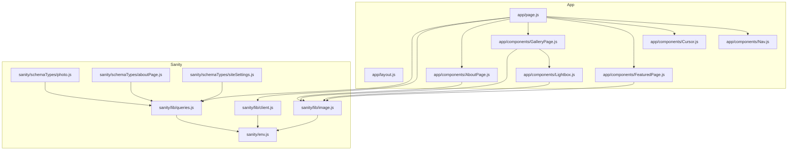
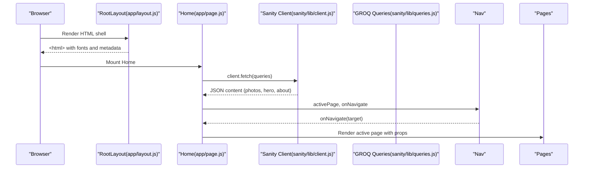
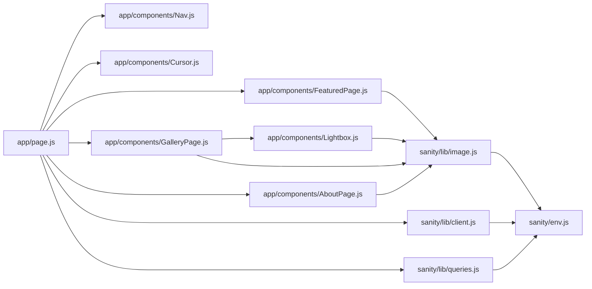

# API Reference

<cite>
**Referenced Files in This Document**
- [app/page.js](file://app/page.js)
- [app/layout.js](file://app/layout.js)
- [app/components/Nav.js](file://app/components/Nav.js)
- [app/components/Cursor.js](file://app/components/Cursor.js)
- [app/components/FeaturedPage.js](file://app/components/FeaturedPage.js)
- [app/components/GalleryPage.js](file://app/components/GalleryPage.js)
- [app/components/AboutPage.js](file://app/components/AboutPage.js)
- [app/components/Lightbox.js](file://app/components/Lightbox.js)
- [sanity/lib/client.js](file://sanity/lib/client.js)
- [sanity/lib/image.js](file://sanity/lib/image.js)
- [sanity/lib/queries.js](file://sanity/lib/queries.js)
- [sanity/env.js](file://sanity/env.js)
- [sanity/schemaTypes/photo.js](file://sanity/schemaTypes/photo.js)
- [sanity/schemaTypes/aboutPage.js](file://sanity/schemaTypes/aboutPage.js)
- [sanity/schemaTypes/siteSettings.js](file://sanity/schemaTypes/siteSettings.js)
</cite>

## Table of Contents
1. [Introduction](#introduction)
2. [Project Structure](#project-structure)
3. [Core Components](#core-components)
4. [Architecture Overview](#architecture-overview)
5. [Detailed Component Analysis](#detailed-component-analysis)
6. [Dependency Analysis](#dependency-analysis)
7. [Performance Considerations](#performance-considerations)
8. [Troubleshooting Guide](#troubleshooting-guide)
9. [Conclusion](#conclusion)
10. [Appendices](#appendices)

## Introduction
This API reference documents the WRD Photography portfolio’s frontend components and backend Sanity integration. It covers:
- Component props, methods, and event handlers for navigation, cursor, featured page, gallery, and about page
- Sanity client API, GROQ queries, and image processing utilities
- Image URL generation, transformation options, and optimization parameters
- Animation and theme configuration via GSAP and CSS variables
- Practical usage patterns and integration examples

## Project Structure
The portfolio is a Next.js application with:
- Client-side pages and components under app/components
- Global styles and layout under app
- Sanity client, image builder, and queries under sanity/lib
- Sanity schema types under sanity/schemaTypes

**Diagram sources**
- [app/page.js:14-227](file://app/page.js#L14-L227)
- [app/components/Nav.js:4-168](file://app/components/Nav.js#L4-L168)
- [app/components/Cursor.js:5-42](file://app/components/Cursor.js#L5-L42)
- [app/components/FeaturedPage.js:6-269](file://app/components/FeaturedPage.js#L6-L269)
- [app/components/GalleryPage.js:6-760](file://app/components/GalleryPage.js#L6-L760)
- [app/components/AboutPage.js:5-458](file://app/components/AboutPage.js#L5-L458)
- [app/components/Lightbox.js:5-303](file://app/components/Lightbox.js#L5-L303)
- [sanity/lib/client.js:4-9](file://sanity/lib/client.js#L4-L9)
- [sanity/lib/image.js:6-8](file://sanity/lib/image.js#L6-L8)
- [sanity/lib/queries.js:3-32](file://sanity/lib/queries.js#L3-L32)
- [sanity/env.js:1-6](file://sanity/env.js#L1-L6)
- [sanity/schemaTypes/photo.js:1-93](file://sanity/schemaTypes/photo.js#L1-L93)
- [sanity/schemaTypes/aboutPage.js:1-27](file://sanity/schemaTypes/aboutPage.js#L1-L27)
- [sanity/schemaTypes/siteSettings.js:1-48](file://sanity/schemaTypes/siteSettings.js#L1-L48)

**Section sources**
- [app/page.js:14-227](file://app/page.js#L14-L227)
- [app/layout.js:31-40](file://app/layout.js#L31-L40)

## Core Components
This section summarizes the primary React components and their roles.

- Nav: Fixed navigation bar with animated entrance, mouse-triggered hide/show, theme toggle, and page navigation callbacks.
- Cursor: Animated mouse cursor with two layered elements for visual effect.
- FeaturedPage: Fullscreen slideshow of featured photos with keyboard and wheel navigation, GSAP-driven transitions, and metadata display.
- GalleryPage: Responsive gallery with filtering, horizontal scrolling, masonry layouts, portrait cards, and lightbox integration.
- AboutPage: Scroll-driven narrative with hero image parallax, text reveals, stats count-up, and contact call-to-action.
- Lightbox: Modal viewer for individual photos with keyboard navigation, GSAP animations, and metadata panel.

**Section sources**
- [app/components/Nav.js:4-168](file://app/components/Nav.js#L4-L168)
- [app/components/Cursor.js:5-42](file://app/components/Cursor.js#L5-L42)
- [app/components/FeaturedPage.js:6-269](file://app/components/FeaturedPage.js#L6-L269)
- [app/components/GalleryPage.js:6-760](file://app/components/GalleryPage.js#L6-L760)
- [app/components/AboutPage.js:5-458](file://app/components/AboutPage.js#L5-L458)
- [app/components/Lightbox.js:5-303](file://app/components/Lightbox.js#L5-L303)

## Architecture Overview
The runtime architecture ties together client-side routing, data fetching, and animations.

**Diagram sources**
- [app/layout.js:31-40](file://app/layout.js#L31-L40)
- [app/page.js:14-227](file://app/page.js#L14-L227)
- [sanity/lib/client.js:4-9](file://sanity/lib/client.js#L4-L9)
- [sanity/lib/queries.js:3-32](file://sanity/lib/queries.js#L3-L32)

## Detailed Component Analysis

### Navigation Component API
Props
- activePage: string
  - Description: Currently selected page identifier. One of "featured", "gallery", "about".
  - Type: string
- onNavigate: (target: string) => void
  - Description: Callback invoked when a navigation link is clicked. Target is one of "featured", "gallery", "about".

Behavior and Methods
- Auto-hide/show on mouse movement near top of viewport using GSAP animations.
- Theme toggle persists to localStorage and updates data-theme attribute on html element.
- Links render with active state styling and hover effects.

Event Handlers
- Button onClick handlers trigger onNavigate or internal theme toggle.
- Mouse move listener adjusts nav position based on cursor proximity.

State Management
- Local state maintains current theme ("dark" | "light") and hidden flag for nav visibility.

Configuration Options
- Animations: Controlled by GSAP timeline/easing parameters.
- Theme: CSS variables adapt to data-theme attribute.

Usage Example
- Pass activePage and onNavigate from parent to Nav.

**Section sources**
- [app/components/Nav.js:4-168](file://app/components/Nav.js#L4-L168)

### Cursor Component API
Props
- None (no props accepted).

Behavior and Methods
- Tracks mousemove events and smoothly animates two concentric elements to cursor position using GSAP.

Event Handlers
- Window mousemove listener updates positions with overwrite behavior.

Configuration Options
- GSAP duration and overwrite settings control responsiveness.

Usage Example
- Import and render Cursor alongside Nav in Home.

**Section sources**
- [app/components/Cursor.js:5-42](file://app/components/Cursor.js#L5-L42)

### Featured Page Component API
Props
- photos: Photo[]
  - Description: Array of photo documents fetched from Sanity.
  - Type: Array of objects matching the photo schema.

Behavior and Methods
- Keyboard navigation: Arrow keys (up/down or left/right) advance slides.
- Mouse wheel navigation: Vertical scroll advances slides with passive=false.
- Slide transitions: GSAP timeline orchestrates exit/enter animations, image transforms, and text reveals.
- Counter and dots indicate current index and total.

State Management
- current: number — active slide index.
- busy: boolean — prevents overlapping transitions.

Methods
- goTo(dir): Performs slide transition logic and updates state.
- revealText(idx): Animates text lines, caption, writeup, and metadata.

Event Handlers
- Wheel and keydown listeners manage navigation.
- Click/touch interactions handled by parent Home.

Configuration Options
- GSAP durations, easings, and stagger timings define motion.
- CSS variables control typography and colors.

Usage Example
- Render FeaturedPage with photos prop from Sanity query.

**Section sources**
- [app/components/FeaturedPage.js:6-269](file://app/components/FeaturedPage.js#L6-L269)

### Gallery Page Component API
Props
- photos: Photo[]
- heroImage: ImageAsset | null

Behavior and Methods
- Filtering: Filter by series ("all", "street", "rural", "landscape", "portraits").
- Horizontal track: GSAP ScrollTrigger-driven horizontal scrolling for street series.
- Masonry and portrait grids: Staggered reveals and hover effects.
- Lightbox integration: Open/close, navigate prev/next within filtered lists.

State Management
- activeFilter: string — current filter selection.
- hoveredCard: string | null — ID of hovered card for hover effects.
- lightboxPhoto: Photo | null — currently viewed photo.
- lightboxList: Photo[] — list backing lightbox navigation.

Methods
- openLightbox(photo, list)
- closeLightbox()
- lightboxPrev()
- lightboxNext()

Event Handlers
- Filter buttons: Magnetic hover transforms and click to change filters.
- Card clicks: Open lightbox with filtered list.

Configuration Options
- GSAP ScrollTrigger pins, scrubs, and toggleActions.
- CSS grid and column layouts for responsive masonry.

Usage Example
- Render GalleryPage with photos and optional heroImage.

**Section sources**
- [app/components/GalleryPage.js:6-760](file://app/components/GalleryPage.js#L6-L760)

### About Page Component API
Props
- onNavigate: (page: string) => void
- heroImage: ImageAsset | null
- collageImages: ImageAsset[] (optional, default [])

Behavior and Methods
- Scroll-driven animations: Hero title lines, bio word reveal, hero image parallax and clip-path reveal, stats count-up, philosophy quote, divider lines, approach items, collage images, CTA title and buttons.
- Magnetic buttons: Subtle transform on mouse move/leave.

Event Handlers
- Button mousemove/mouseleave for magnetic effect.
- Button click triggers onNavigate("gallery").

Configuration Options
- GSAP ScrollTrigger triggers per section.
- Collage fallback URLs if assets are missing.

Usage Example
- Render AboutPage with onNavigate and images from Sanity.

**Section sources**
- [app/components/AboutPage.js:5-458](file://app/components/AboutPage.js#L5-L458)

### Lightbox Component API
Props
- photo: Photo | null
- photos: Photo[]
- onClose: () => void
- onPrev: () => void
- onNext: () => void

Behavior and Methods
- Open/close animations using GSAP timelines.
- Keyboard navigation: Escape to close, arrow keys to navigate.
- Image swap animation when changing photo.
- Info panel displays series, title, writeup, and metadata.

Event Handlers
- Overlay click to close.
- Close button and nav arrows trigger callbacks.

Configuration Options
- GSAP timing and easing for entrance/exit.
- Image URL generation via urlFor with width and quality.

Usage Example
- Call openLightbox from GalleryPage and pass callbacks to Lightbox.

**Section sources**
- [app/components/Lightbox.js:5-303](file://app/components/Lightbox.js#L5-L303)

### Sanity Client API
Client
- client: Next-Sanity client configured with projectId, dataset, apiVersion, and useCdn disabled for fresh content.

Configuration Options
- projectId: string
- dataset: string
- apiVersion: string
- useCdn: boolean (default false)

Error Handling Patterns
- Fetches are awaited and results assigned to state; errors are not explicitly handled in Home. Wrap client.fetch calls with try/catch in production for robustness.

Usage Example
- Import client and queries; fetch in useEffect and set state.

**Section sources**
- [sanity/lib/client.js:4-9](file://sanity/lib/client.js#L4-L9)
- [sanity/env.js:1-6](file://sanity/env.js#L1-L6)

### GROQ Query API
Queries
- featuredPhotosQuery: Returns featured photos ordered by manual order then date.
- allPhotosQuery: Returns all photos ordered similarly.
- galleryHeroQuery: Returns gallery hero document with image and metadata.
- aboutPageQuery: Returns about page document with hero image and collage images.

Utility Functions
- urlFor(source): Returns an image builder for generating URLs with transformations.

Usage Example
- client.fetch(featuredPhotosQuery) in Home.

**Section sources**
- [sanity/lib/queries.js:3-32](file://sanity/lib/queries.js#L3-L32)
- [sanity/lib/image.js:6-8](file://sanity/lib/image.js#L6-L8)

### Image Processing API
URL Generation
- urlFor(image).width(W).quality(Q).url(): Generates optimized image URLs with specified width and quality.

Optimization Parameters
- width: integer — target rendered width.
- quality: integer — JPEG quality level.
- url(): Returns final image URL string.

Usage Example
- Use urlFor(photo.image).width(1920).quality(85).url() for backgrounds.

**Section sources**
- [sanity/lib/image.js:6-8](file://sanity/lib/image.js#L6-L8)
- [app/components/FeaturedPage.js:136](file://app/components/FeaturedPage.js#L136)
- [app/components/GalleryPage.js:250](file://app/components/GalleryPage.js#L250)
- [app/components/GalleryPage.js:386](file://app/components/GalleryPage.js#L386)
- [app/components/GalleryPage.js:487](file://app/components/GalleryPage.js#L487)
- [app/components/GalleryPage.js:574](file://app/components/GalleryPage.js#L574)
- [app/components/GalleryPage.js:651](file://app/components/GalleryPage.js#L651)
- [app/components/GalleryPage.js:695](file://app/components/GalleryPage.js#L695)
- [app/components/AboutPage.js:177](file://app/components/AboutPage.js#L177)
- [app/components/AboutPage.js:195](file://app/components/AboutPage.js#L195)
- [app/components/Lightbox.js:161](file://app/components/Lightbox.js#L161)

### Event Handler Specifications
- Nav.onNavigate(target: string)
- GalleryPage.openLightbox(photo, list)
- GalleryPage.closeLightbox()
- GalleryPage.lightboxPrev()
- GalleryPage.lightboxNext()
- AboutPage.onNavigate(page: string)

Callback Signatures
- onNavigate: (page: string) => void
- onClose/onPrev/onNext: () => void

Usage Example
- Pass callbacks from Home to child components.

**Section sources**
- [app/page.js:136-145](file://app/page.js#L136-L145)
- [app/components/GalleryPage.js:17-37](file://app/components/GalleryPage.js#L17-L37)
- [app/components/AboutPage.js:410](file://app/components/AboutPage.js#L410)

### State Management APIs
- Home manages:
  - activePage: string
  - switching: boolean
  - featuredPhotos, allPhotos: Photo[]
  - galleryHeroImage: ImageAsset | null
  - aboutImages: { heroImage: ImageAsset | null, collageImages: ImageAsset[] }
  - dataLoaded: boolean
  - introDone: boolean
  - pageEntered: boolean

- GalleryPage manages:
  - activeFilter: string
  - hoveredCard: string | null
  - lightboxPhoto/lightboxList: Photo[]

- AboutPage does not maintain persistent state beyond initialization.

Usage Example
- Initialize state in Home and pass derived props to components.

**Section sources**
- [app/page.js:14-227](file://app/page.js#L14-L227)
- [app/components/GalleryPage.js:6-25](file://app/components/GalleryPage.js#L6-L25)

### Configuration Options
Animations
- GSAP timelines and ScrollTrigger configurations drive all animations.
- Easings: power2, power3, power4, ease-in/out variants.
- Durations: typically 0.4–1.5 seconds for transitions.

Themes
- Theme toggled via Nav; persisted to localStorage and reflected on html element via data-theme attribute.
- CSS variables adapt layout colors accordingly.

Component Behavior
- Passive wheel events disabled for FeaturedPage navigation.
- Dynamic imports load GSAP plugins on demand.

**Section sources**
- [app/components/Nav.js:10-76](file://app/components/Nav.js#L10-L76)
- [app/components/FeaturedPage.js:18-34](file://app/components/FeaturedPage.js#L18-L34)
- [app/components/GalleryPage.js:56-58](file://app/components/GalleryPage.js#L56-L58)
- [app/components/AboutPage.js:165-174](file://app/components/AboutPage.js#L165-L174)

### TypeScript Interfaces (Conceptual)
Note: The codebase is JavaScript-based. The following interfaces describe expected shapes inferred from usage.

- Photo
  - _id: string
  - title: string
  - location?: string
  - series: "street" | "rural" | "landscape" | "portraits"
  - date?: string
  - writeup?: string
  - order?: number
  - image: { asset: { _id: string, url: string }, hotspot?: any }

- ImageAsset
  - asset: { _id: string, url: string }
  - hotspot?: any

- AboutPageDoc
  - heroImage?: ImageAsset
  - collageImages?: ImageAsset[]

- GalleryHeroDoc
  - title?: string
  - description?: string
  - credit?: string
  - location?: string
  - galleryHeroImage?: ImageAsset

- HomeState
  - activePage: string
  - switching: boolean
  - featuredPhotos: Photo[]
  - allPhotos: Photo[]
  - galleryHeroImage: ImageAsset | null
  - aboutImages: AboutPageDoc
  - dataLoaded: boolean
  - introDone: boolean
  - pageEntered: boolean

- GalleryPageState
  - activeFilter: string
  - hoveredCard: string | null
  - lightboxPhoto: Photo | null
  - lightboxList: Photo[]

- LightboxProps
  - photo: Photo | null
  - photos: Photo[]
  - onClose: () => void
  - onPrev: () => void
  - onNext: () => void

- NavProps
  - activePage: string
  - onNavigate: (target: string) => void

- CursorProps
  - None

- AboutPageProps
  - onNavigate: (page: string) => void
  - heroImage: ImageAsset | null
  - collageImages?: ImageAsset[]

- SanityClientConfig
  - projectId: string
  - dataset: string
  - apiVersion: string
  - useCdn: boolean

- GROQ Queries
  - featuredPhotosQuery: string
  - allPhotosQuery: string
  - galleryHeroQuery: string
  - aboutPageQuery: string

- Image Builder
  - urlFor(source): Builder
  - Builder.width(n: number): Builder
  - Builder.quality(n: number): Builder
  - Builder.url(): string

[No sources needed since this section provides conceptual interfaces]

## Dependency Analysis
Component and module dependencies:

**Diagram sources**
- [app/page.js:14-227](file://app/page.js#L14-L227)
- [app/components/Nav.js:4-168](file://app/components/Nav.js#L4-L168)
- [app/components/Cursor.js:5-42](file://app/components/Cursor.js#L5-L42)
- [app/components/FeaturedPage.js:6-269](file://app/components/FeaturedPage.js#L6-L269)
- [app/components/GalleryPage.js:6-760](file://app/components/GalleryPage.js#L6-L760)
- [app/components/AboutPage.js:5-458](file://app/components/AboutPage.js#L5-L458)
- [app/components/Lightbox.js:5-303](file://app/components/Lightbox.js#L5-L303)
- [sanity/lib/client.js:4-9](file://sanity/lib/client.js#L4-L9)
- [sanity/lib/image.js:6-8](file://sanity/lib/image.js#L6-L8)
- [sanity/lib/queries.js:3-32](file://sanity/lib/queries.js#L3-L32)
- [sanity/env.js:1-6](file://sanity/env.js#L1-L6)

**Section sources**
- [app/page.js:14-227](file://app/page.js#L14-L227)
- [sanity/lib/client.js:4-9](file://sanity/lib/client.js#L4-L9)
- [sanity/lib/queries.js:3-32](file://sanity/lib/queries.js#L3-L32)
- [sanity/lib/image.js:6-8](file://sanity/lib/image.js#L6-L8)

## Performance Considerations
- Disable CDN for Sanity client to ensure fresh content during development; consider enabling in production with cache invalidation strategies.
- Defer heavy animations until after font loading and initial render to avoid layout shifts.
- Use passive wheel events where appropriate; explicitly preventDefault for slideshow navigation.
- Lazy-load GSAP plugins and components to reduce initial bundle size.
- Optimize image widths and qualities per screen density and container sizes.

[No sources needed since this section provides general guidance]

## Troubleshooting Guide
Common issues and resolutions:
- Missing Sanity credentials: Ensure NEXT_PUBLIC_SANITY_PROJECT_ID and NEXT_PUBLIC_SANITY_DATASET are set; otherwise client creation fails.
- No featured photos: FeaturedPage renders a placeholder message when photos array is empty.
- Lightbox not opening: Verify photo and photos props are passed correctly and openLightbox is called with a valid list.
- Scroll-trigger conflicts: Kill existing ScrollTrigger instances before reinitializing to avoid duplicate triggers.
- Theme not persisting: Confirm localStorage key and data-theme attribute updates occur on toggle.

**Section sources**
- [sanity/env.js:4-5](file://sanity/env.js#L4-L5)
- [app/components/FeaturedPage.js:107-114](file://app/components/FeaturedPage.js#L107-L114)
- [app/components/GalleryPage.js:17-25](file://app/components/GalleryPage.js#L17-L25)
- [app/components/AboutPage.js:157-161](file://app/components/AboutPage.js#L157-L161)
- [app/components/Nav.js:78-83](file://app/components/Nav.js#L78-L83)

## Conclusion
This API reference outlines the component interfaces, data fetching, and animation systems powering the WRD Photography portfolio. By leveraging Sanity’s GROQ queries, the image builder, and GSAP-driven interactions, the site delivers a polished, content-rich experience. Integrate components by passing props as documented and ensure proper error handling around data fetching and plugin initialization.

[No sources needed since this section summarizes without analyzing specific files]

## Appendices

### GROQ Query Syntax and Utility Functions
- featuredPhotosQuery: Selects photos where featured is true, orders by order ascending then date descending.
- allPhotosQuery: Selects all photos with similar ordering.
- galleryHeroQuery: Selects the gallery hero document with image and metadata.
- aboutPageQuery: Selects the about page document with hero image and collage images.
- urlFor(source): Returns a builder for generating transformed URLs.

**Section sources**
- [sanity/lib/queries.js:3-32](file://sanity/lib/queries.js#L3-L32)
- [sanity/lib/image.js:6-8](file://sanity/lib/image.js#L6-L8)

### Backward Compatibility and Versioning
- Sanity API version is configurable via environment variable; update apiVersion to align with Sanity’s supported versions.
- Schema types define field sets and options; adding new fields requires updating both schema and queries.
- Component props are minimal and stable; changes should favor additive modifications to maintain compatibility.

**Section sources**
- [sanity/env.js:1-2](file://sanity/env.js#L1-L2)
- [sanity/schemaTypes/photo.js:1-93](file://sanity/schemaTypes/photo.js#L1-L93)
- [sanity/schemaTypes/aboutPage.js:1-27](file://sanity/schemaTypes/aboutPage.js#L1-L27)
- [sanity/schemaTypes/siteSettings.js:1-48](file://sanity/schemaTypes/siteSettings.js#L1-L48)