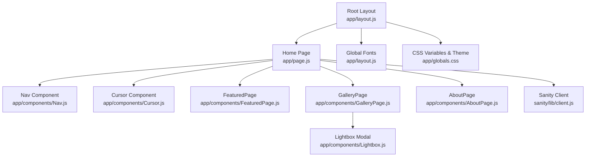
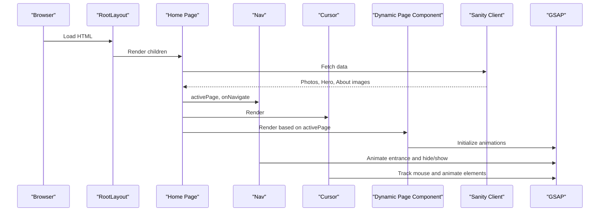
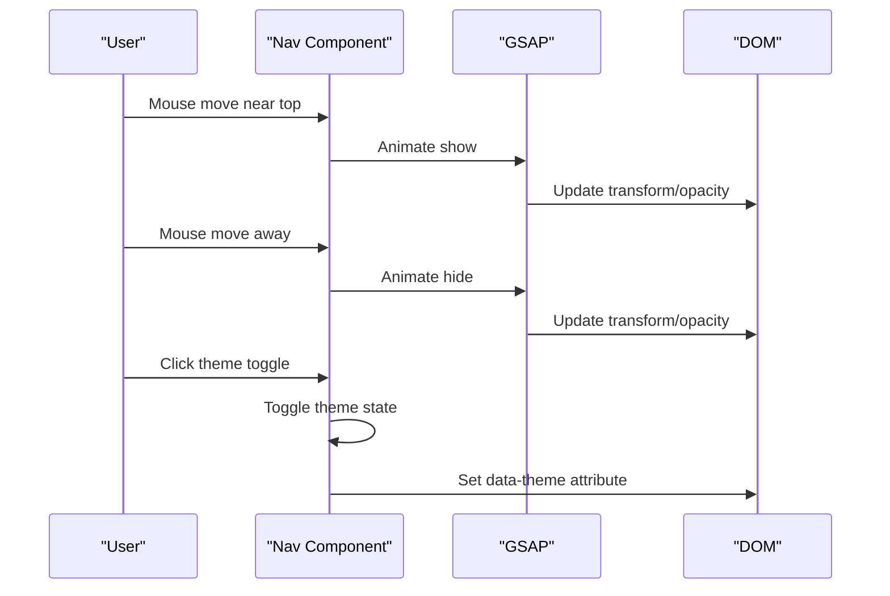
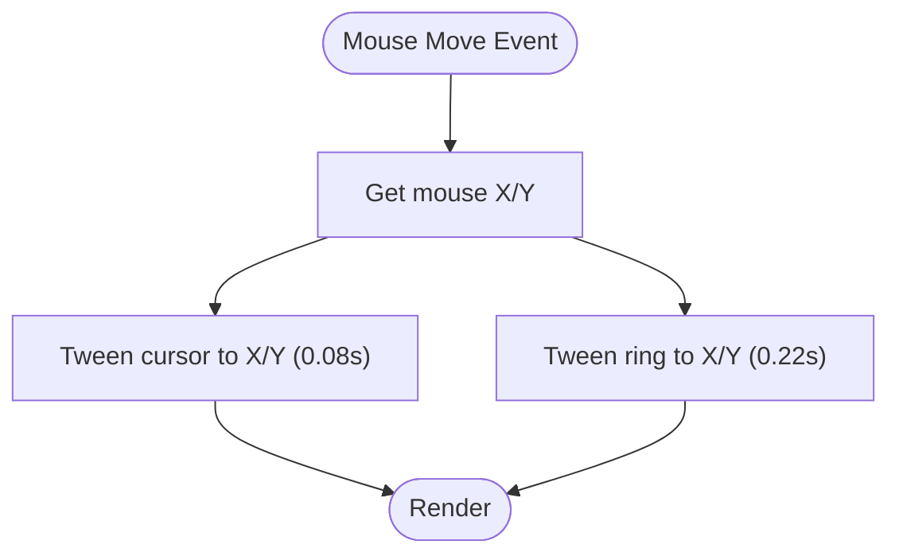
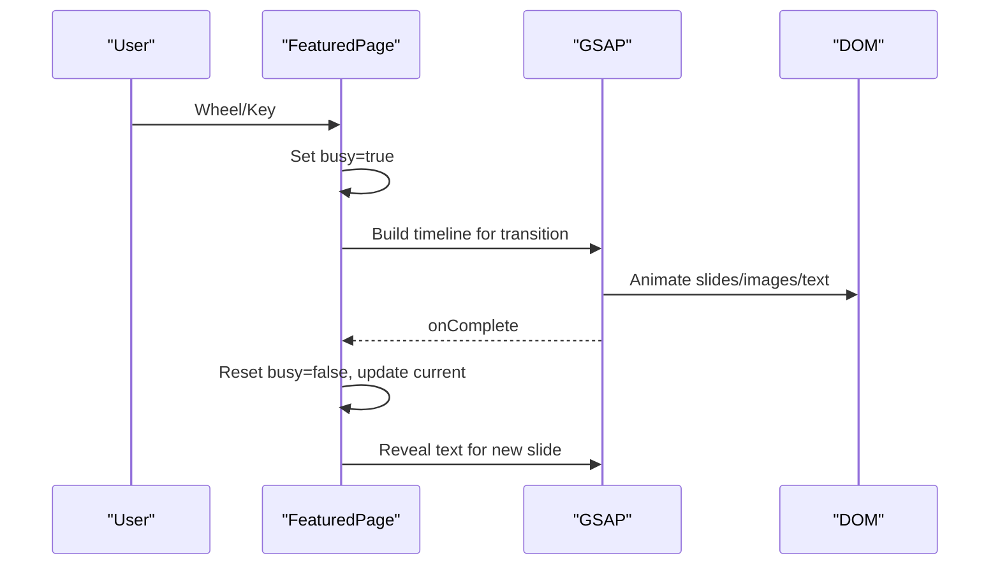
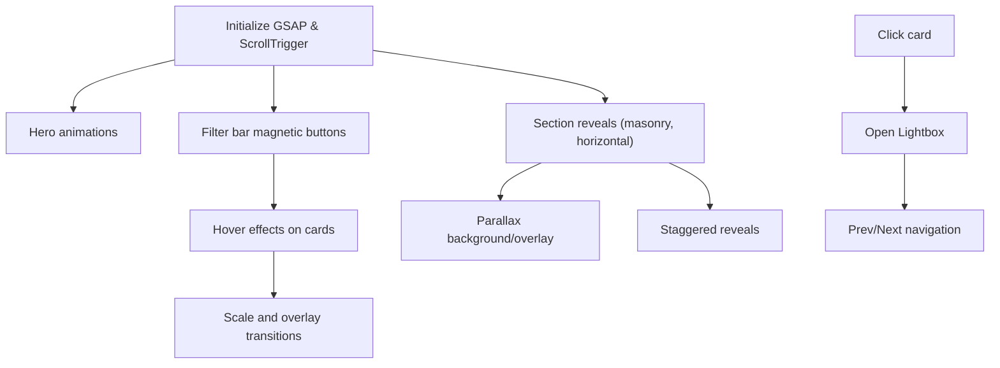
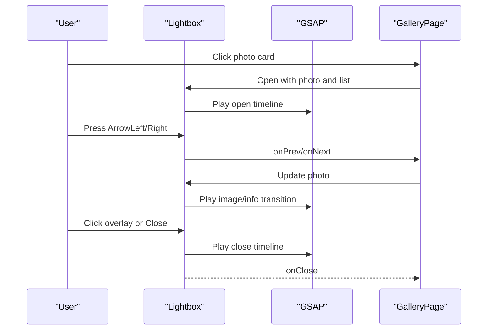
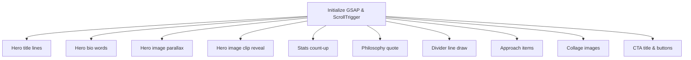
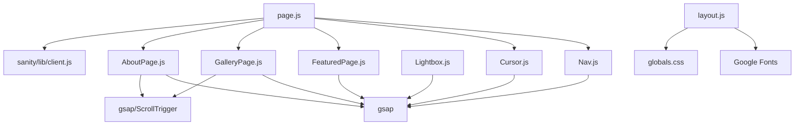

# Component APIs

<cite>
**Referenced Files in This Document**
- [Nav.js](file://app/components/Nav.js)
- [Cursor.js](file://app/components/Cursor.js)
- [FeaturedPage.js](file://app/components/FeaturedPage.js)
- [GalleryPage.js](file://app/components/GalleryPage.js)
- [Lightbox.js](file://app/components/Lightbox.js)
- [AboutPage.js](file://app/components/AboutPage.js)
- [page.js](file://app/page.js)
- [layout.js](file://app/layout.js)
- [globals.css](file://app/globals.css)
- [sanity.config.js](file://sanity.config.js)
- [photo.js](file://sanity/schemaTypes/photo.js)
- [aboutPage.js](file://sanity/schemaTypes/aboutPage.js)
</cite>

## Table of Contents
1. [Introduction](#introduction)
2. [Project Structure](#project-structure)
3. [Core Components](#core-components)
4. [Architecture Overview](#architecture-overview)
5. [Detailed Component Analysis](#detailed-component-analysis)
6. [Dependency Analysis](#dependency-analysis)
7. [Performance Considerations](#performance-considerations)
8. [Troubleshooting Guide](#troubleshooting-guide)
9. [Conclusion](#conclusion)

## Introduction
This document provides comprehensive component API documentation for the WRD Photography portfolio built with Next.js and React. It covers the Nav, Cursor, FeaturedPage, GalleryPage, Lightbox, and AboutPage components. Each component's props, state management, event handlers, lifecycle methods, ref handling, and integration with GSAP animations are documented. The guide also includes TypeScript-style interface definitions, prop validation requirements, usage examples, and troubleshooting tips.

## Project Structure
The portfolio is organized around a client-side React application with dynamic imports for page components to optimize initial load. Navigation is handled by a client-side Nav component, while page content is rendered by dynamic-loaded components. GSAP is used extensively for animations, and Sanity provides content management and data fetching.

**Diagram sources**
- [layout.js:31-39](file://app/layout.js#L31-L39)
- [page.js:14-227](file://app/page.js#L14-L227)
- [Nav.js:4-168](file://app/components/Nav.js#L4-L168)
- [Cursor.js:5-42](file://app/components/Cursor.js#L5-L42)
- [FeaturedPage.js:6-269](file://app/components/FeaturedPage.js#L6-L269)
- [GalleryPage.js:6-760](file://app/components/GalleryPage.js#L6-L760)
- [Lightbox.js:5-303](file://app/components/Lightbox.js#L5-L303)
- [AboutPage.js:5-458](file://app/components/AboutPage.js#L5-L458)
- [globals.css:5-28](file://app/globals.css#L5-L28)

**Section sources**
- [layout.js:1-40](file://app/layout.js#L1-L40)
- [page.js:1-227](file://app/page.js#L1-L227)

## Core Components
This section outlines the primary components and their roles in the portfolio.

- Nav: Fixed navigation bar with theme switching, animated entrance, and mouse-triggered hide/show behavior.
- Cursor: Mouse-tracking animated cursor with two concentric elements for visual feedback.
- FeaturedPage: Full-screen photo slideshow with keyboard and wheel navigation, animated text reveals, and counter display.
- GalleryPage: Multi-section gallery with filtering, horizontal scrolling, masonry layouts, parallax effects, and lightbox integration.
- Lightbox: Modal viewer for individual photos with keyboard navigation and animated transitions.
- AboutPage: Content-driven page with scroll-triggered animations, photo collage, and call-to-action buttons.

**Section sources**
- [Nav.js:4-168](file://app/components/Nav.js#L4-L168)
- [Cursor.js:5-42](file://app/components/Cursor.js#L5-L42)
- [FeaturedPage.js:6-269](file://app/components/FeaturedPage.js#L6-L269)
- [GalleryPage.js:6-760](file://app/components/GalleryPage.js#L6-L760)
- [Lightbox.js:5-303](file://app/components/Lightbox.js#L5-L303)
- [AboutPage.js:5-458](file://app/components/AboutPage.js#L5-L458)

## Architecture Overview
The application uses a client-side routing model with dynamic imports for page components. Data is fetched from Sanity and passed to components as props. GSAP powers animations across pages and modals. Theming is controlled via CSS variables and a theme toggle in Nav.

**Diagram sources**
- [layout.js:31-39](file://app/layout.js#L31-L39)
- [page.js:14-227](file://app/page.js#L14-L227)
- [Nav.js:10-68](file://app/components/Nav.js#L10-L68)
- [Cursor.js:9-21](file://app/components/Cursor.js#L9-L21)

## Detailed Component Analysis

### Nav Component API
- Purpose: Fixed navigation bar with animated entrance, theme toggle, and mouse-triggered hide/show behavior.
- Props:
  - activePage: string — Current active page identifier ('featured' | 'gallery' | 'about').
  - onNavigate: (pageId: string) => void — Callback invoked when a navigation link is clicked.
- State:
  - theme: string — Current theme ('dark' | 'light'), persisted in localStorage and synchronized with data-theme attribute.
  - hiddenRef: boolean — Internal flag tracking whether the nav is currently hidden.
- Refs:
  - navRef: HTMLElement — Reference to the nav element for GSAP animations.
  - gsapRef: GSAP — Reference to the GSAP instance.
- Lifecycle:
  - On mount: Dynamically imports GSAP, animates entrance, sets up auto-hide timer, and attaches mousemove listener to show/hide on cursor proximity.
  - On activePage change: Re-triggers entrance animation and schedules auto-hide.
  - On mount: Reads theme preference from localStorage and OS preference, applies theme to documentElement.
- Event Handlers:
  - onMouseMove: Shows nav when cursor approaches top and hides when moved away.
  - toggleTheme: Toggles theme, updates CSS variable, persists to localStorage.
- Integration with GSAP:
  - Uses gsap.fromTo for entrance and exit animations.
  - Uses gsap.to for immediate transitions on state changes.
- Usage Example:
  - <Nav activePage={activePage} onNavigate={navigate} />

**Diagram sources**
- [Nav.js:27-48](file://app/components/Nav.js#L27-L48)
- [Nav.js:70-83](file://app/components/Nav.js#L70-L83)

**Section sources**
- [Nav.js:4-168](file://app/components/Nav.js#L4-L168)
- [globals.css:30-49](file://app/globals.css#L30-L49)

### Cursor Component API
- Purpose: Animated mouse-tracking cursor with a small dot and a larger ring.
- Props: None.
- Refs:
  - cursorRef: HTMLElement — Small cursor element.
  - ringRef: HTMLElement — Larger ring element.
- Lifecycle:
  - On mount: Attaches mousemove listener and animates cursor/ring positions using GSAP with overwrite behavior.
- Animation Parameters:
  - Duration: 0.08s for cursor, 0.22s for ring.
  - Overwrite: true to prevent queued tweens from conflicting.
- Customization Options:
  - Colors: Controlled via CSS variables (--cream, --border-strong).
  - Size: Adjust width/height styles.
  - Blend mode: mixBlendMode difference for contrast.
- Usage Example:
  - <Cursor />

**Diagram sources**
- [Cursor.js:14-17](file://app/components/Cursor.js#L14-L17)

**Section sources**
- [Cursor.js:5-42](file://app/components/Cursor.js#L5-L42)

### FeaturedPage Component API
- Purpose: Full-screen photo slideshow with keyboard and wheel navigation, animated text reveals, and counter display.
- Props:
  - photos: Photo[] — Array of photo documents from Sanity.
- State:
  - current: number — Index of the currently displayed photo.
  - busy: boolean — Prevents concurrent navigation during animations.
- Refs:
  - slidesRef: HTMLElement[] — References to slide containers.
  - imgsRef: HTMLElement[] — References to background images.
  - counterRef: HTMLElement — Reference to the counter stack.
- Lifecycle:
  - On mount: Sets up wheel and keydown listeners, triggers initial text reveal for the first slide.
- Navigation:
  - Wheel: Prevents default behavior and navigates based on delta direction.
  - Keyboard: Arrow keys (up/left) previous, arrow keys (down/right) next.
- Animation Controls:
  - Uses GSAP timelines for coordinated slide transitions, including text fades, image transforms, and counter movement.
  - Busy flag prevents rapid navigation during animation.
- Counter System:
  - Counter stack is translated vertically to match the current index.
- Text Reveal:
  - Lines, caption, writeup, and meta elements are revealed sequentially with staggered timing.
- Data Model:
  - Photo fields: _id, image, title, series, location, date, writeup.
- Usage Example:
  - <FeaturedPage photos={featuredPhotos} />

**Diagram sources**
- [FeaturedPage.js:56-105](file://app/components/FeaturedPage.js#L56-L105)
- [FeaturedPage.js:36-54](file://app/components/FeaturedPage.js#L36-L54)

**Section sources**
- [FeaturedPage.js:6-269](file://app/components/FeaturedPage.js#L6-L269)
- [photo.js:1-93](file://sanity/schemaTypes/photo.js#L1-L93)

### GalleryPage Component API
- Purpose: Multi-section gallery with filtering, horizontal scrolling, masonry layouts, parallax effects, and lightbox integration.
- Props:
  - photos: Photo[] — All photos from Sanity.
  - heroImage: Image | null — Hero image for the gallery hero section.
- State:
  - activeFilter: string — Current filter ('all' | 'street' | 'rural' | 'landscape' | 'portraits').
  - hoveredCard: string | null — ID of the hovered photo card.
  - lightboxPhoto: Photo | null — Currently displayed photo in lightbox.
  - lightboxList: Photo[] — List of photos in the current lightbox context.
- Refs:
  - containerRef: HTMLElement — Scrolling container for ScrollTrigger.
  - heroTitleRef: HTMLElement — Hero title element for character split reveal.
  - heroEyeRef: HTMLElement — Hero eyebrow element.
  - trackRef: HTMLElement — Horizontal scroll track element.
  - initedRef: boolean — Initialization guard.
- Lifecycle:
  - On mount: Dynamically imports GSAP and ScrollTrigger, initializes ScrollTrigger-based animations, and registers plugin.
  - Cleanup: Kills all ScrollTrigger instances on unmount.
- Layout System:
  - Hero section with parallax background and overlay.
  - Filter bar with magnetic buttons that respond to mouse movement.
  - Sections: Street (horizontal scroll), Rural (masonry), Landscape (masonry), Portraits (wide cards).
  - Fallback section if no series are assigned.
- Photo Filtering:
  - Filters photos by series and updates activeFilter state.
  - Magnetic filter buttons translate based on mouse position.
- Grid Rendering APIs:
  - Horizontal track uses ScrollTrigger scrub with pinning and anticipatePin.
  - Masonry grids use CSS columns with break-inside: avoid.
  - Portrait cards use grid with minmax sizing.
- Lightbox Integration:
  - Opens lightbox with openLightbox(photo, list).
  - Provides lightboxPrev/lightboxNext handlers.
  - Passes onClose/onPrev/onNext to Lightbox.
- Scroll Animations:
  - Character split reveals for hero title.
  - Word-by-word reveal for hero bio.
  - Parallax background and overlay scrubbing.
  - Staggered masonry reveals.
  - Counter scrub effect.
- Usage Example:
  - <GalleryPage photos={allPhotos} heroImage={galleryHeroImage} />

**Diagram sources**
- [GalleryPage.js:51-220](file://app/components/GalleryPage.js#L51-L220)
- [GalleryPage.js:222-232](file://app/components/GalleryPage.js#L222-L232)
- [GalleryPage.js:17-37](file://app/components/GalleryPage.js#L17-L37)

**Section sources**
- [GalleryPage.js:6-760](file://app/components/GalleryPage.js#L6-L760)
- [Lightbox.js:5-303](file://app/components/Lightbox.js#L5-L303)

### Lightbox Component API
- Purpose: Modal viewer for individual photos with keyboard navigation and animated transitions.
- Props:
  - photo: Photo | null — Current photo to display.
  - photos: Photo[] — List of photos in the current context.
  - onClose: () => void — Callback to close the lightbox.
  - onPrev: () => void — Callback to navigate to the previous photo.
  - onNext: () => void — Callback to navigate to the next photo.
- Refs:
  - overlayRef: HTMLElement — Overlay element.
  - imgWrapRef: HTMLElement — Image wrapper element.
  - imgRef: HTMLElement — Main image element.
  - infoRef: HTMLElement — Info panel element.
  - closeRef: HTMLElement — Close button element.
  - navRef: HTMLElement — Navigation container.
  - gsapRef: GSAP — GSAP instance reference.
- Lifecycle:
  - On mount: Animates open sequence (overlay fade, image scale, info slide, close button, nav arrows).
  - On photo change: Animates image and info panel transitions.
  - Keyboard: Escape to close, ArrowLeft/ArrowRight to navigate.
- Interaction Handlers:
  - Close button: Triggers close animation and callback.
  - Overlay click: Closes when clicking outside the image.
  - Nav buttons: Trigger onPrev/onNext callbacks with hover animations.
- Animation Controls:
  - Open/close timelines with staggered timings.
  - Hover animations for close and nav buttons using GSAP.to.
- Usage Example:
  - <Lightbox photo={lightboxPhoto} photos={lightboxList} onClose={closeLightbox} onPrev={lightboxPrev} onNext={lightboxNext} />

**Diagram sources**
- [Lightbox.js:14-90](file://app/components/Lightbox.js#L14-L90)
- [Lightbox.js:54-62](file://app/components/Lightbox.js#L54-L62)
- [GalleryPage.js:17-37](file://app/components/GalleryPage.js#L17-L37)

**Section sources**
- [Lightbox.js:5-303](file://app/components/Lightbox.js#L5-L303)

### AboutPage Component API
- Purpose: Content-driven page showcasing philosophy, approach, stats, and contact with scroll-triggered animations and a photo collage.
- Props:
  - onNavigate: (pageId: string) => void — Callback to navigate to another page (e.g., Gallery).
  - heroImage: Image | null — Hero image for the About page.
  - collageImages: Image[] — Up to 3 images for the collage section.
- State:
  - initedRef: boolean — Initialization guard.
  - titleRef: HTMLElement — Hero title element for line-by-line reveal.
  - lineRefs: HTMLElement[] — References to hero line elements.
- Lifecycle:
  - On mount: Dynamically imports GSAP and ScrollTrigger, initializes ScrollTrigger-based animations, and registers plugin.
  - Cleanup: Kills all ScrollTrigger instances on unmount.
- Content Rendering:
  - Hero section with line-by-line title reveal and word-by-word bio reveal.
  - Philosophy quote with staggered reveal.
  - Photo collage with staggered entry.
  - Approach grid with numbers and descriptions.
  - Call-to-action section with animated buttons.
- Image Collage API:
  - collageLayout defines heights and optional margins.
  - collageImages fallbacks ensure images render even if not provided.
- Magnetic Button Handler:
  - onBtnMove/onBtnLeave apply magnetic translation to buttons.
- Scroll Animations:
  - Character split reveals for hero title.
  - Word-by-word reveals for bio and CTA title.
  - Parallax hero image and clip-path reveal.
  - Stats count-up animations.
  - Divider line draws and section labels slide in.
- Usage Example:
  - <AboutPage onNavigate={navigate} heroImage={aboutImages.heroImage} collageImages={aboutImages.collageImages} />

**Diagram sources**
- [AboutPage.js:11-162](file://app/components/AboutPage.js#L11-L162)
- [AboutPage.js:111-121](file://app/components/AboutPage.js#L111-L121)

**Section sources**
- [AboutPage.js:5-458](file://app/components/AboutPage.js#L5-L458)
- [aboutPage.js:1-27](file://sanity/schemaTypes/aboutPage.js#L1-L27)

## Dependency Analysis
The components depend on:
- GSAP for animations and ScrollTrigger for scroll-based effects.
- Sanity client for data fetching.
- Dynamic imports for page components to defer loading until client-side.
- CSS variables for theming and typography.

**Diagram sources**
- [Nav.js:11-12](file://app/components/Nav.js#L11-L12)
- [Cursor.js:3](file://app/components/Cursor.js#L3)
- [FeaturedPage.js:3](file://app/components/FeaturedPage.js#L3)
- [GalleryPage.js:57-58](file://app/components/GalleryPage.js#L57-L58)
- [Lightbox.js:18-19](file://app/components/Lightbox.js#L18-L19)
- [AboutPage.js:16-18](file://app/components/AboutPage.js#L16-L18)
- [page.js:9-11](file://app/page.js#L9-L11)
- [layout.js:4-24](file://app/layout.js#L4-L24)
- [globals.css:5-28](file://app/globals.css#L5-L28)

**Section sources**
- [page.js:1-227](file://app/page.js#L1-L227)
- [sanity.config.js:16-28](file://sanity.config.js#L16-L28)

## Performance Considerations
- Use dynamic imports for page components to reduce initial bundle size.
- Prefer CSS transforms and opacity for animations to leverage GPU acceleration.
- Use GSAP overwrite behavior for mouse tracking to prevent queued tweens from stacking.
- Register and kill ScrollTrigger instances to avoid memory leaks and redundant triggers.
- Optimize image sizes via Sanity image URLs and quality settings.
- Minimize reflows by batching DOM reads/writes and using will-change where appropriate.

## Troubleshooting Guide
- Theme not persisting:
  - Ensure data-theme attribute is set on html and localStorage key 'wrd-theme' is present.
  - Verify CSS variables switch in [data-theme="light"] block.
- GSAP not found:
  - Confirm dynamic import of 'gsap' and plugin registration for ScrollTrigger.
  - Check that components are client-side only ('use client').
- Scroll animations not triggering:
  - Ensure containerRef is attached and ScrollTrigger.refresh() is called after initialization.
  - Verify trigger elements exist in the DOM before ScrollTrigger runs.
- Lightbox not opening:
  - Confirm photo and photos props are provided and lightboxList is populated.
  - Ensure overlay click handler closes when clicking outside the image area.
- Cursor not moving:
  - Verify mousemove event is attached and refs are initialized before GSAP animations.

**Section sources**
- [Nav.js:70-83](file://app/components/Nav.js#L70-L83)
- [globals.css:30-49](file://app/globals.css#L30-L49)
- [GalleryPage.js:51-220](file://app/components/GalleryPage.js#L51-L220)
- [Lightbox.js:14-62](file://app/components/Lightbox.js#L14-L62)
- [Cursor.js:9-21](file://app/components/Cursor.js#L9-L21)

## Conclusion
The WRD Photography portfolio leverages React components with GSAP-powered animations and Sanity for content management. The Nav, Cursor, FeaturedPage, GalleryPage, Lightbox, and AboutPage components are designed for performance and maintainability, with clear props, state, and lifecycle patterns. By following the API guidelines and troubleshooting tips outlined above, developers can extend and integrate these components effectively.