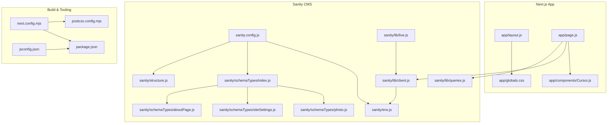
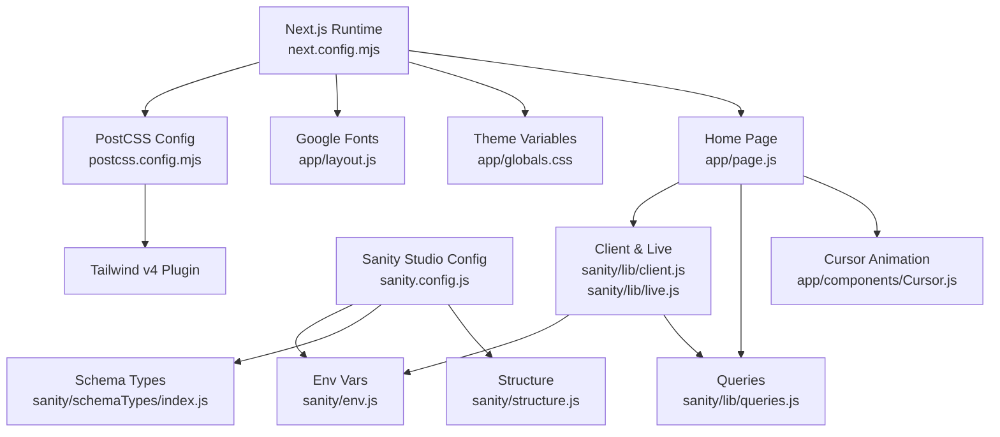
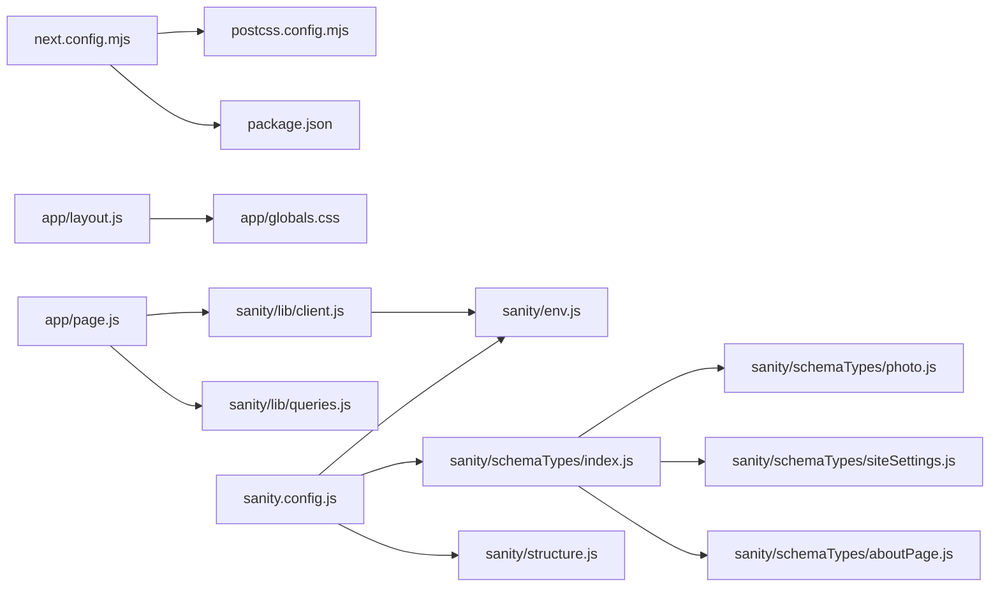

# Configuration APIs

<cite>
**Referenced Files in This Document**
- [next.config.mjs](file://next.config.mjs)
- [package.json](file://package.json)
- [postcss.config.mjs](file://postcss.config.mjs)
- [jsconfig.json](file://jsconfig.json)
- [app/layout.js](file://app/layout.js)
- [app/globals.css](file://app/globals.css)
- [sanity.config.js](file://sanity.config.js)
- [sanity/env.js](file://sanity/env.js)
- [sanity/lib/client.js](file://sanity/lib/client.js)
- [sanity/lib/live.js](file://sanity/lib/live.js)
- [sanity/lib/queries.js](file://sanity/lib/queries.js)
- [sanity/schemaTypes/index.js](file://sanity/schemaTypes/index.js)
- [sanity/schemaTypes/photo.js](file://sanity/schemaTypes/photo.js)
- [sanity/schemaTypes/siteSettings.js](file://sanity/schemaTypes/siteSettings.js)
- [sanity/schemaTypes/aboutPage.js](file://sanity/schemaTypes/aboutPage.js)
- [sanity/structure.js](file://sanity/structure.js)
- [.agents/skills/gsap-core/SKILL.md](file://.agents/skills/gsap-core/SKILL.md)
- [.agents/skills/gsap-timeline/SKILL.md](file://.agents/skills/gsap-timeline/SKILL.md)
- [.agents/skills/gsap-performance/SKILL.md](file://.agents/skills/gsap-performance/SKILL.md)
- [.agents/skills/gsap-plugins/SKILL.md](file://.agents/skills/gsap-plugins/SKILL.md)
- [app/page.js](file://app/page.js)
- [app/components/Cursor.js](file://app/components/Cursor.js)
</cite>

## Table of Contents
1. [Introduction](#introduction)
2. [Project Structure](#project-structure)
3. [Core Components](#core-components)
4. [Architecture Overview](#architecture-overview)
5. [Detailed Component Analysis](#detailed-component-analysis)
6. [Dependency Analysis](#dependency-analysis)
7. [Performance Considerations](#performance-considerations)
8. [Troubleshooting Guide](#troubleshooting-guide)
9. [Conclusion](#conclusion)
10. [Appendices](#appendices)

## Introduction
This document provides comprehensive configuration API documentation for the project. It covers:
- Next.js configuration APIs for build settings, environment variables, and deployment configurations
- Sanity Studio configuration including schema registration, preview URL settings, and authentication configuration
- Theme configuration API via CSS custom properties, color schemes, and responsive design
- Animation configuration options for GSAP, including easing functions, timing parameters, and performance settings
- Font configuration APIs for Google Fonts integration and custom font loading
- Environment variable management, build optimization settings, and production deployment configurations
- Examples of common configuration patterns and customization scenarios for each configuration API

## Project Structure
The project is a Next.js application integrated with Sanity CMS and GSAP-powered animations. Key configuration areas include:
- Next.js runtime and build configuration
- PostCSS and Tailwind integration
- Google Fonts via Next.js font optimization
- Sanity Studio configuration and schema
- GSAP usage in client components

**Diagram sources**
- [next.config.mjs](file://next.config.mjs)
- [postcss.config.mjs](file://postcss.config.mjs)
- [package.json](file://package.json)
- [jsconfig.json](file://jsconfig.json)
- [app/layout.js](file://app/layout.js)
- [app/globals.css](file://app/globals.css)
- [app/page.js](file://app/page.js)
- [app/components/Cursor.js](file://app/components/Cursor.js)
- [sanity.config.js](file://sanity.config.js)
- [sanity/env.js](file://sanity/env.js)
- [sanity/lib/client.js](file://sanity/lib/client.js)
- [sanity/lib/live.js](file://sanity/lib/live.js)
- [sanity/lib/queries.js](file://sanity/lib/queries.js)
- [sanity/schemaTypes/index.js](file://sanity/schemaTypes/index.js)
- [sanity/schemaTypes/photo.js](file://sanity/schemaTypes/photo.js)
- [sanity/schemaTypes/siteSettings.js](file://sanity/schemaTypes/siteSettings.js)
- [sanity/schemaTypes/aboutPage.js](file://sanity/schemaTypes/aboutPage.js)
- [sanity/structure.js](file://sanity/structure.js)

**Section sources**
- [next.config.mjs](file://next.config.mjs)
- [postcss.config.mjs](file://postcss.config.mjs)
- [package.json](file://package.json)
- [jsconfig.json](file://jsconfig.json)
- [app/layout.js](file://app/layout.js)
- [app/globals.css](file://app/globals.css)
- [sanity.config.js](file://sanity.config.js)
- [sanity/env.js](file://sanity/env.js)
- [sanity/lib/client.js](file://sanity/lib/client.js)
- [sanity/lib/live.js](file://sanity/lib/live.js)
- [sanity/lib/queries.js](file://sanity/lib/queries.js)
- [sanity/schemaTypes/index.js](file://sanity/schemaTypes/index.js)
- [sanity/schemaTypes/photo.js](file://sanity/schemaTypes/photo.js)
- [sanity/schemaTypes/siteSettings.js](file://sanity/schemaTypes/siteSettings.js)
- [sanity/schemaTypes/aboutPage.js](file://sanity/schemaTypes/aboutPage.js)
- [sanity/structure.js](file://sanity/structure.js)

## Core Components
This section documents the primary configuration surfaces and their roles.

- Next.js configuration API
  - Purpose: Centralized build-time and runtime configuration for the Next.js application
  - Current state: Placeholder configuration file exists; additional options can be added per project needs
  - Reference: [next.config.mjs](file://next.config.mjs)

- PostCSS and Tailwind integration
  - Purpose: Configure PostCSS plugins and enable Tailwind v4
  - Reference: [postcss.config.mjs](file://postcss.config.mjs)

- Environment variables and deployment
  - Purpose: Define scripts and manage environment variables for local development, builds, and production
  - Reference: [package.json](file://package.json)

- Path aliasing
  - Purpose: Simplify imports using the @/* alias
  - Reference: [jsconfig.json](file://jsconfig.json)

- Theme configuration API
  - Purpose: Define CSS custom properties for color schemes, typography, and responsive behavior
  - Reference: [app/globals.css](file://app/globals.css)

- Font configuration API
  - Purpose: Load Google Fonts with Next.js font optimization and expose CSS variables
  - Reference: [app/layout.js](file://app/layout.js)

- Sanity Studio configuration
  - Purpose: Configure Studio base path, dataset, projectId, schema, and plugins
  - Reference: [sanity.config.js](file://sanity.config.js)

- Sanity environment variables
  - Purpose: Provide dataset, projectId, and API version from environment variables
  - Reference: [sanity/env.js](file://sanity/env.js)

- Sanity client and live content
  - Purpose: Configure Sanity client and enable live content updates
  - References: [sanity/lib/client.js](file://sanity/lib/client.js), [sanity/lib/live.js](file://sanity/lib/live.js)

- Sanity schema registration
  - Purpose: Register content types for the Studio
  - References: [sanity/schemaTypes/index.js](file://sanity/schemaTypes/index.js), [sanity/schemaTypes/photo.js](file://sanity/schemaTypes/photo.js), [sanity/schemaTypes/siteSettings.js](file://sanity/schemaTypes/siteSettings.js), [sanity/schemaTypes/aboutPage.js](file://sanity/schemaTypes/aboutPage.js)

- Sanity Studio structure
  - Purpose: Customize the Studio sidebar navigation
  - Reference: [sanity/structure.js](file://sanity/structure.js)

- GSAP configuration and usage
  - Purpose: Configure easing, timing, and performance for animations
  - References: [.agents/skills/gsap-core/SKILL.md](file://.agents/skills/gsap-core/SKILL.md), [.agents/skills/gsap-timeline/SKILL.md](file://.agents/skills/gsap-timeline/SKILL.md), [.agents/skills/gsap-performance/SKILL.md](file://.agents/skills/gsap-performance/SKILL.md), [.agents/skills/gsap-plugins/SKILL.md](file://.agents/skills/gsap-plugins/SKILL.md), [app/page.js](file://app/page.js), [app/components/Cursor.js](file://app/components/Cursor.js)

**Section sources**
- [next.config.mjs](file://next.config.mjs)
- [postcss.config.mjs](file://postcss.config.mjs)
- [package.json](file://package.json)
- [jsconfig.json](file://jsconfig.json)
- [app/globals.css](file://app/globals.css)
- [app/layout.js](file://app/layout.js)
- [sanity.config.js](file://sanity.config.js)
- [sanity/env.js](file://sanity/env.js)
- [sanity/lib/client.js](file://sanity/lib/client.js)
- [sanity/lib/live.js](file://sanity/lib/live.js)
- [sanity/schemaTypes/index.js](file://sanity/schemaTypes/index.js)
- [sanity/schemaTypes/photo.js](file://sanity/schemaTypes/photo.js)
- [sanity/schemaTypes/siteSettings.js](file://sanity/schemaTypes/siteSettings.js)
- [sanity/schemaTypes/aboutPage.js](file://sanity/schemaTypes/aboutPage.js)
- [sanity/structure.js](file://sanity/structure.js)
- [.agents/skills/gsap-core/SKILL.md](file://.agents/skills/gsap-core/SKILL.md)
- [.agents/skills/gsap-timeline/SKILL.md](file://.agents/skills/gsap-timeline/SKILL.md)
- [.agents/skills/gsap-performance/SKILL.md](file://.agents/skills/gsap-performance/SKILL.md)
- [.agents/skills/gsap-plugins/SKILL.md](file://.agents/skills/gsap-plugins/SKILL.md)
- [app/page.js](file://app/page.js)
- [app/components/Cursor.js](file://app/components/Cursor.js)

## Architecture Overview
The configuration architecture ties together Next.js, Sanity, and GSAP. The Studio is configured under a dedicated base path and uses a centralized schema. The frontend consumes content via a typed client and live updates. Theming and fonts are configured globally, while build tooling integrates Tailwind via PostCSS.

**Diagram sources**
- [next.config.mjs](file://next.config.mjs)
- [postcss.config.mjs](file://postcss.config.mjs)
- [app/layout.js](file://app/layout.js)
- [app/globals.css](file://app/globals.css)
- [sanity.config.js](file://sanity.config.js)
- [sanity/env.js](file://sanity/env.js)
- [sanity/lib/client.js](file://sanity/lib/client.js)
- [sanity/lib/live.js](file://sanity/lib/live.js)
- [sanity/schemaTypes/index.js](file://sanity/schemaTypes/index.js)
- [sanity/lib/queries.js](file://sanity/lib/queries.js)
- [sanity/structure.js](file://sanity/structure.js)
- [app/page.js](file://app/page.js)
- [app/components/Cursor.js](file://app/components/Cursor.js)

## Detailed Component Analysis

### Next.js Configuration API
- Purpose: Centralize Next.js configuration for build and runtime behavior
- Current state: Placeholder configuration file exists; extend with project-specific options (e.g., redirects, headers, experimental features)
- Related files: [next.config.mjs](file://next.config.mjs), [package.json](file://package.json), [postcss.config.mjs](file://postcss.config.mjs), [jsconfig.json](file://jsconfig.json)

Common configuration patterns:
- Extend with output tracing, static export, or experimental features as needed
- Integrate with PostCSS and Tailwind using the existing plugin configuration
- Configure path aliases for simplified imports

**Section sources**
- [next.config.mjs](file://next.config.mjs)
- [package.json](file://package.json)
- [postcss.config.mjs](file://postcss.config.mjs)
- [jsconfig.json](file://jsconfig.json)

### Environment Variable Management
- Purpose: Manage environment variables for Sanity API version, dataset, and projectId
- Implementation:
  - API version defaults to a future date if not provided
  - Dataset and projectId are sourced from environment variables
- References: [sanity/env.js](file://sanity/env.js), [sanity/lib/client.js](file://sanity/lib/client.js), [sanity/lib/live.js](file://sanity/lib/live.js)

Common configuration patterns:
- Set NEXT_PUBLIC_SANITY_API_VERSION, NEXT_PUBLIC_SANITY_DATASET, NEXT_PUBLIC_SANITY_PROJECT_ID in your hosting environment
- Keep API version aligned with Sanity’s API versioning policy

**Section sources**
- [sanity/env.js](file://sanity/env.js)
- [sanity/lib/client.js](file://sanity/lib/client.js)
- [sanity/lib/live.js](file://sanity/lib/live.js)

### Sanity Studio Configuration
- Purpose: Configure the Sanity Studio base path, dataset, projectId, schema, and plugins
- Implementation:
  - Base path is set to /studio
  - Schema is imported from schemaTypes
  - Plugins include structureTool and visionTool with defaultApiVersion
- References: [sanity.config.js](file://sanity.config.js), [sanity/schemaTypes/index.js](file://sanity/schemaTypes/index.js), [sanity/structure.js](file://sanity/structure.js), [sanity/env.js](file://sanity/env.js)

Common configuration patterns:
- Add authentication configuration (e.g., JWT or OAuth) in the Studio configuration as needed
- Customize structureTool to tailor the Studio navigation
- Adjust visionTool defaultApiVersion to match your API versioning strategy

**Section sources**
- [sanity.config.js](file://sanity.config.js)
- [sanity/schemaTypes/index.js](file://sanity/schemaTypes/index.js)
- [sanity/structure.js](file://sanity/structure.js)
- [sanity/env.js](file://sanity/env.js)

### Sanity Schema Registration
- Purpose: Register content types for the Studio and define previews and ordering
- Implementation:
  - photo: document with fields for title, image, location, series, featured flag, date, writeup, and order
  - siteSettings: document for gallery hero settings
  - aboutPage: document for about page hero and collage images
- References: [sanity/schemaTypes/photo.js](file://sanity/schemaTypes/photo.js), [sanity/schemaTypes/siteSettings.js](file://sanity/schemaTypes/siteSettings.js), [sanity/schemaTypes/aboutPage.js](file://sanity/schemaTypes/aboutPage.js), [sanity/schemaTypes/index.js](file://sanity/schemaTypes/index.js)

Common configuration patterns:
- Add new content types by extending the types array in schemaTypes/index.js
- Define preview select and prepare functions for accurate Studio previews
- Use orderings to sort content by custom fields

**Section sources**
- [sanity/schemaTypes/photo.js](file://sanity/schemaTypes/photo.js)
- [sanity/schemaTypes/siteSettings.js](file://sanity/schemaTypes/siteSettings.js)
- [sanity/schemaTypes/aboutPage.js](file://sanity/schemaTypes/aboutPage.js)
- [sanity/schemaTypes/index.js](file://sanity/schemaTypes/index.js)

### Sanity Client and Live Content
- Purpose: Configure the Sanity client and enable live content updates
- Implementation:
  - Client uses projectId, dataset, and apiVersion; caching disabled for fresh data
  - Live content API wraps the client for real-time updates
- References: [sanity/lib/client.js](file://sanity/lib/client.js), [sanity/lib/live.js](file://sanity/lib/live.js), [sanity/lib/queries.js](file://sanity/lib/queries.js)

Common configuration patterns:
- Use sanityFetch for server-side or client-side live queries
- Wrap layouts with SanityLive to enable real-time updates
- Adjust useCdn based on caching requirements

**Section sources**
- [sanity/lib/client.js](file://sanity/lib/client.js)
- [sanity/lib/live.js](file://sanity/lib/live.js)
- [sanity/lib/queries.js](file://sanity/lib/queries.js)

### Theme Configuration API
- Purpose: Define CSS custom properties for color schemes, typography, and responsive behavior
- Implementation:
  - Defines dark and light color schemes with CSS variables
  - Exposes font families via CSS variables for global use
  - Includes reduced motion support and scrollbar styling
- References: [app/globals.css](file://app/globals.css)

Common configuration patterns:
- Switch themes by toggling data-theme attributes on the root element
- Override specific variables for component-level customization
- Add new breakpoints or spacing scales by extending the CSS variables

**Section sources**
- [app/globals.css](file://app/globals.css)

### Font Configuration API
- Purpose: Load Google Fonts with Next.js font optimization and expose CSS variables
- Implementation:
  - Uses next/font/google to load Manrope, Libre Caslon Display, and JetBrains Mono
  - Applies subsets, weights, styles, and variable naming for CSS exposure
- References: [app/layout.js](file://app/layout.js)

Common configuration patterns:
- Add or remove fonts by modifying the font declarations
- Use the exposed CSS variables in global styles and components
- Ensure subsets match your content languages

**Section sources**
- [app/layout.js](file://app/layout.js)

### Animation Configuration Options (GSAP)
- Purpose: Configure easing, timing, and performance for animations
- Implementation:
  - Easing functions include power-based, elastic, bounce, and custom easer
  - Timing parameters include duration, delay, stagger, repeat, yoyo, overwrite
  - Performance best practices emphasize transform and opacity, will-change, and batching
  - Plugins include CustomEase, EasePack, Physics2D, and others
- References: [.agents/skills/gsap-core/SKILL.md](file://.agents/skills/gsap-core/SKILL.md), [.agents/skills/gsap-timeline/SKILL.md](file://.agents/skills/gsap-timeline/SKILL.md), [.agents/skills/gsap-performance/SKILL.md](file://.agents/skills/gsap-performance/SKILL.md), [.agents/skills/gsap-plugins/SKILL.md](file://.agents/skills/gsap-plugins/SKILL.md), [app/page.js](file://app/page.js), [app/components/Cursor.js](file://app/components/Cursor.js)

Common configuration patterns:
- Use stagger for batch animations and consistent timing offsets
- Prefer transform and opacity for smooth 60fps animations
- Register plugins only when needed to minimize bundle size
- Apply easing functions to timelines and individual tweens for expressive motion

**Section sources**
- [.agents/skills/gsap-core/SKILL.md](file://.agents/skills/gsap-core/SKILL.md)
- [.agents/skills/gsap-timeline/SKILL.md](file://.agents/skills/gsap-timeline/SKILL.md)
- [.agents/skills/gsap-performance/SKILL.md](file://.agents/skills/gsap-performance/SKILL.md)
- [.agents/skills/gsap-plugins/SKILL.md](file://.agents/skills/gsap-plugins/SKILL.md)
- [app/page.js](file://app/page.js)
- [app/components/Cursor.js](file://app/components/Cursor.js)

### Build Optimization Settings
- Purpose: Optimize builds and runtime performance
- Implementation:
  - Tailwind v4 enabled via PostCSS plugin
  - Next.js scripts for dev, build, start, and lint
  - Path aliasing via jsconfig.json
- References: [postcss.config.mjs](file://postcss.config.mjs), [package.json](file://package.json), [jsconfig.json](file://jsconfig.json)

Common configuration patterns:
- Enable tree-shaking and minification through Next.js build pipeline
- Use Tailwind utilities to reduce CSS bloat
- Leverage path aliases to simplify imports and improve DX

**Section sources**
- [postcss.config.mjs](file://postcss.config.mjs)
- [package.json](file://package.json)
- [jsconfig.json](file://jsconfig.json)

### Production Deployment Configurations
- Purpose: Prepare the application for production environments
- Implementation:
  - Next.js build and start scripts
  - Environment variables for Sanity configuration
  - PostCSS and Tailwind integration for optimized CSS
- References: [package.json](file://package.json), [sanity/env.js](file://sanity/env.js), [postcss.config.mjs](file://postcss.config.mjs)

Common configuration patterns:
- Set environment variables in your hosting provider (Vercel, Netlify, etc.)
- Verify API version compatibility with Sanity
- Ensure fonts are preloaded or optimized for performance

**Section sources**
- [package.json](file://package.json)
- [sanity/env.js](file://sanity/env.js)
- [postcss.config.mjs](file://postcss.config.mjs)

## Dependency Analysis
This section maps dependencies between configuration components to understand coupling and potential circularities.

**Diagram sources**
- [next.config.mjs](file://next.config.mjs)
- [postcss.config.mjs](file://postcss.config.mjs)
- [package.json](file://package.json)
- [app/layout.js](file://app/layout.js)
- [app/globals.css](file://app/globals.css)
- [app/page.js](file://app/page.js)
- [sanity/lib/client.js](file://sanity/lib/client.js)
- [sanity/lib/queries.js](file://sanity/lib/queries.js)
- [sanity/env.js](file://sanity/env.js)
- [sanity.config.js](file://sanity.config.js)
- [sanity/schemaTypes/index.js](file://sanity/schemaTypes/index.js)
- [sanity/schemaTypes/photo.js](file://sanity/schemaTypes/photo.js)
- [sanity/schemaTypes/siteSettings.js](file://sanity/schemaTypes/siteSettings.js)
- [sanity/schemaTypes/aboutPage.js](file://sanity/schemaTypes/aboutPage.js)
- [sanity/structure.js](file://sanity/structure.js)

**Section sources**
- [next.config.mjs](file://next.config.mjs)
- [postcss.config.mjs](file://postcss.config.mjs)
- [package.json](file://package.json)
- [app/layout.js](file://app/layout.js)
- [app/globals.css](file://app/globals.css)
- [app/page.js](file://app/page.js)
- [sanity/lib/client.js](file://sanity/lib/client.js)
- [sanity/lib/queries.js](file://sanity/lib/queries.js)
- [sanity/env.js](file://sanity/env.js)
- [sanity.config.js](file://sanity.config.js)
- [sanity/schemaTypes/index.js](file://sanity/schemaTypes/index.js)
- [sanity/schemaTypes/photo.js](file://sanity/schemaTypes/photo.js)
- [sanity/schemaTypes/siteSettings.js](file://sanity/schemaTypes/siteSettings.js)
- [sanity/schemaTypes/aboutPage.js](file://sanity/schemaTypes/aboutPage.js)
- [sanity/structure.js](file://sanity/structure.js)

## Performance Considerations
- Prefer transform and opacity animations to keep work on the compositor
- Use will-change sparingly on elements that actually animate
- Batch reads and writes to avoid layout thrashing
- Leverage GSAP’s internal batching and avoid creating excessive tweens
- Disable CDN for the Sanity client when immediate freshness is required
- Use font-display swap to prevent layout shifts during font loading

[No sources needed since this section provides general guidance]

## Troubleshooting Guide
- Sanity API version mismatch
  - Symptom: Queries fail or return unexpected data
  - Resolution: Align NEXT_PUBLIC_SANITY_API_VERSION with Sanity’s supported versions
  - Reference: [sanity/env.js](file://sanity/env.js)

- Missing dataset or projectId
  - Symptom: Sanity client fails to initialize
  - Resolution: Set NEXT_PUBLIC_SANITY_DATASET and NEXT_PUBLIC_SANITY_PROJECT_ID
  - Reference: [sanity/env.js](file://sanity/env.js)

- Live content not updating
  - Symptom: Content changes are not reflected in the UI
  - Resolution: Ensure SanityLive is rendered in the layout and sanityFetch is used for queries
  - References: [sanity/lib/live.js](file://sanity/lib/live.js), [sanity/lib/queries.js](file://sanity/lib/queries.js)

- Fonts not loading
  - Symptom: Text appears unstyled or shifts during load
  - Resolution: Verify font variables are applied in the body and subsets match content
  - Reference: [app/layout.js](file://app/layout.js)

- GSAP performance issues
  - Symptom: Janky animations or dropped frames
  - Resolution: Prefer transform/opacity, use will-change judiciously, and avoid animating layout properties
  - References: [.agents/skills/gsap-performance/SKILL.md](file://.agents/skills/gsap-performance/SKILL.md), [app/page.js](file://app/page.js)

**Section sources**
- [sanity/env.js](file://sanity/env.js)
- [sanity/lib/live.js](file://sanity/lib/live.js)
- [sanity/lib/queries.js](file://sanity/lib/queries.js)
- [app/layout.js](file://app/layout.js)
- [.agents/skills/gsap-performance/SKILL.md](file://.agents/skills/gsap-performance/SKILL.md)
- [app/page.js](file://app/page.js)

## Conclusion
This document outlined the configuration APIs across Next.js, Sanity, GSAP, fonts, and theming. By leveraging environment variables, centralized schema registration, and performance-focused animation practices, the project achieves a maintainable and scalable configuration surface suitable for production deployments.

[No sources needed since this section summarizes without analyzing specific files]

## Appendices

### Appendix A: Next.js Configuration Options
- Extend next.config.mjs with:
  - Experimental features
  - Output tracing and static export
  - Redirects and headers
- Validate with existing PostCSS and Tailwind integration

**Section sources**
- [next.config.mjs](file://next.config.mjs)
- [postcss.config.mjs](file://postcss.config.mjs)

### Appendix B: Sanity Studio Authentication
- Add authentication providers (e.g., JWT, OAuth) in sanity.config.js as needed
- Reference: [sanity.config.js](file://sanity.config.js)

**Section sources**
- [sanity.config.js](file://sanity.config.js)

### Appendix C: GSAP Easing and Timing Patterns
- Use built-in eases for common motion; register CustomEase for bespoke curves
- Apply stagger for consistent timing across multiple targets
- Reference: [.agents/skills/gsap-core/SKILL.md](file://.agents/skills/gsap-core/SKILL.md)

**Section sources**
- [.agents/skills/gsap-core/SKILL.md](file://.agents/skills/gsap-core/SKILL.md)

### Appendix D: Font Loading Strategies
- Use next/font/google for optimized font loading with variable naming
- Reference: [app/layout.js](file://app/layout.js)

**Section sources**
- [app/layout.js](file://app/layout.js)

### Appendix E: Theme Customization Patterns
- Toggle data-theme on the root element to switch between dark and light modes
- Override CSS variables per component for targeted customization
- Reference: [app/globals.css](file://app/globals.css)

**Section sources**
- [app/globals.css](file://app/globals.css)