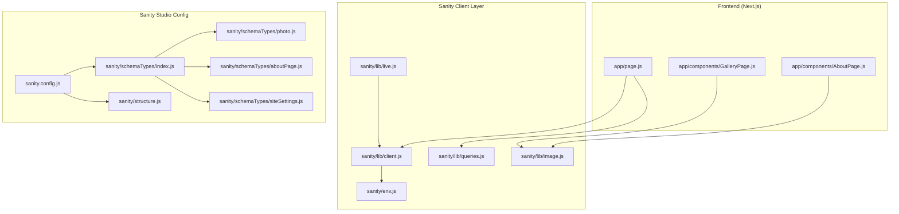
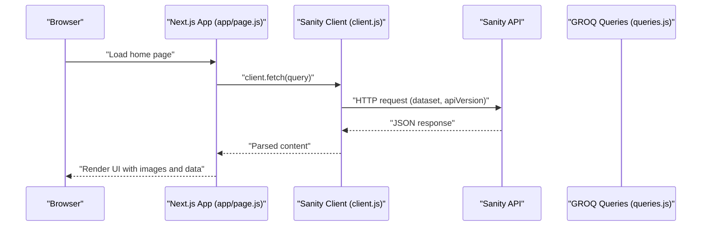
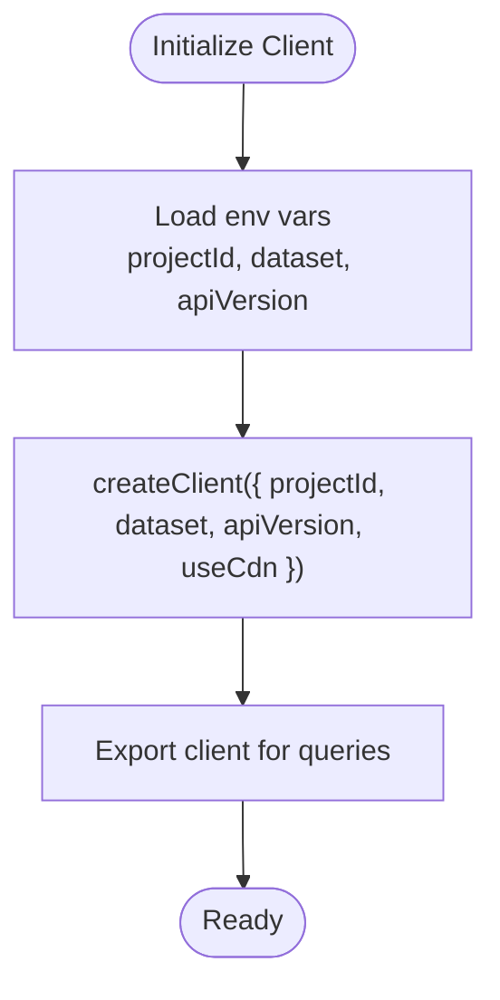
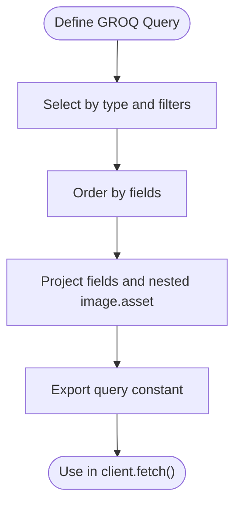
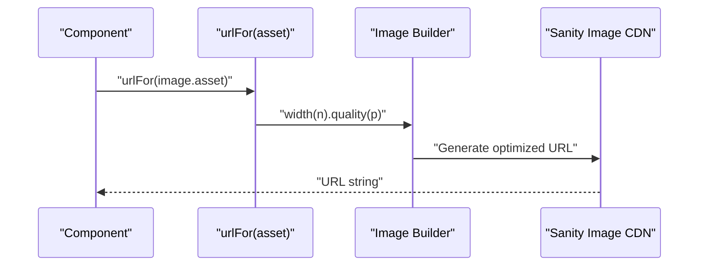
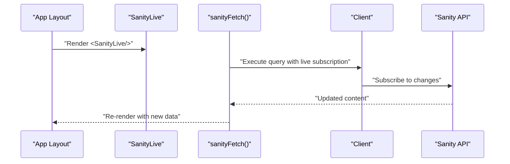
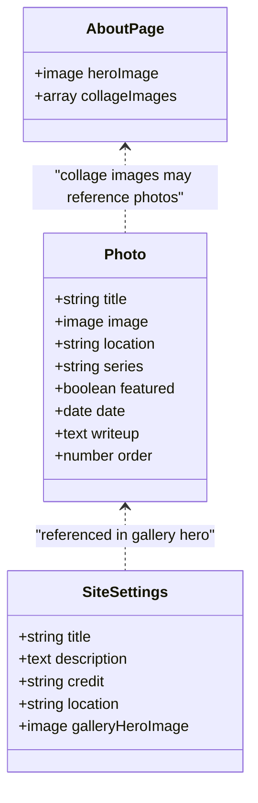
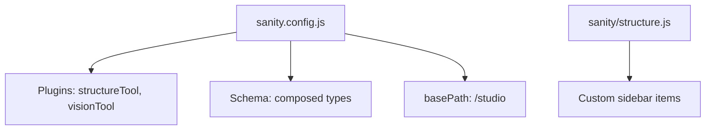
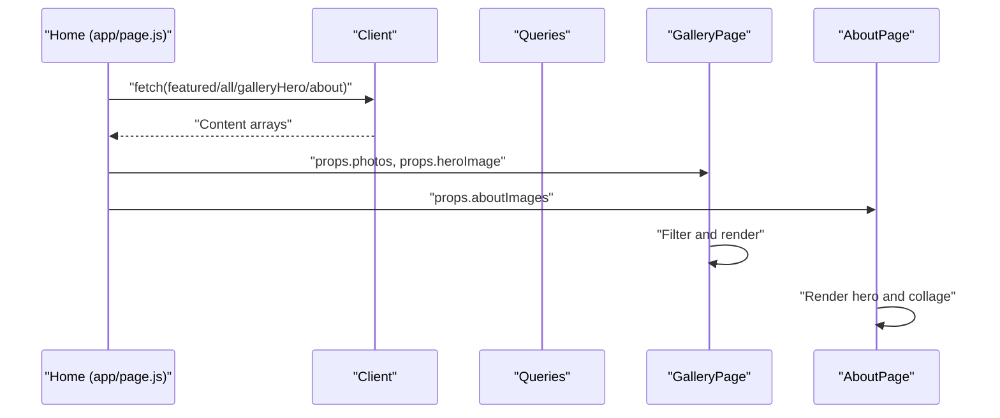
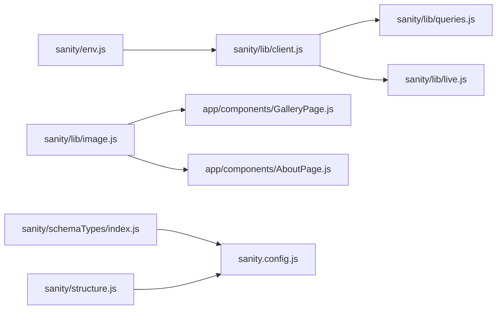

# Sanity CMS API

<cite>
**Referenced Files in This Document**
- [sanity/lib/client.js](file://sanity/lib/client.js)
- [sanity/env.js](file://sanity/env.js)
- [sanity/lib/queries.js](file://sanity/lib/queries.js)
- [sanity/lib/image.js](file://sanity/lib/image.js)
- [sanity/lib/live.js](file://sanity/lib/live.js)
- [sanity.config.js](file://sanity.config.js)
- [sanity/schemaTypes/index.js](file://sanity/schemaTypes/index.js)
- [sanity/schemaTypes/photo.js](file://sanity/schemaTypes/photo.js)
- [sanity/schemaTypes/aboutPage.js](file://sanity/schemaTypes/aboutPage.js)
- [sanity/schemaTypes/siteSettings.js](file://sanity/schemaTypes/siteSettings.js)
- [sanity/structure.js](file://sanity/structure.js)
- [app/page.js](file://app/page.js)
- [app/components/GalleryPage.js](file://app/components/GalleryPage.js)
- [app/components/AboutPage.js](file://app/components/AboutPage.js)
- [package.json](file://package.json)
</cite>

## Table of Contents
1. [Introduction](#introduction)
2. [Project Structure](#project-structure)
3. [Core Components](#core-components)
4. [Architecture Overview](#architecture-overview)
5. [Detailed Component Analysis](#detailed-component-analysis)
6. [Dependency Analysis](#dependency-analysis)
7. [Performance Considerations](#performance-considerations)
8. [Troubleshooting Guide](#troubleshooting-guide)
9. [Conclusion](#conclusion)
10. [Appendices](#appendices)

## Introduction
This document provides comprehensive Sanity CMS API documentation for a Next.js application. It covers client configuration, GROQ query construction and execution, image processing and optimization, live preview capabilities, content schema and validation, and operational best practices. The goal is to help developers configure, query, and manage content effectively while maintaining performance and reliability.

## Project Structure
The project is organized into a Next.js frontend and a Sanity backend configuration:
- Frontend (Next.js): Pages and components fetch content via a Sanity client and render optimized images.
- Backend (Sanity): Client configuration, GROQ queries, image URL builder, live preview hooks, and content schemas.

**Diagram sources**
- [app/page.js](file://app/page.js)
- [app/components/GalleryPage.js](file://app/components/GalleryPage.js)
- [app/components/AboutPage.js](file://app/components/AboutPage.js)
- [sanity/lib/client.js](file://sanity/lib/client.js)
- [sanity/env.js](file://sanity/env.js)
- [sanity/lib/queries.js](file://sanity/lib/queries.js)
- [sanity/lib/image.js](file://sanity/lib/image.js)
- [sanity/lib/live.js](file://sanity/lib/live.js)
- [sanity.config.js](file://sanity.config.js)
- [sanity/schemaTypes/index.js](file://sanity/schemaTypes/index.js)
- [sanity/schemaTypes/photo.js](file://sanity/schemaTypes/photo.js)
- [sanity/schemaTypes/aboutPage.js](file://sanity/schemaTypes/aboutPage.js)
- [sanity/schemaTypes/siteSettings.js](file://sanity/schemaTypes/siteSettings.js)
- [sanity/structure.js](file://sanity/structure.js)

**Section sources**
- [sanity/lib/client.js:1-10](file://sanity/lib/client.js#L1-L10)
- [sanity/env.js:1-6](file://sanity/env.js#L1-L6)
- [sanity/lib/queries.js:1-33](file://sanity/lib/queries.js#L1-L33)
- [sanity/lib/image.js:1-9](file://sanity/lib/image.js#L1-L9)
- [sanity/lib/live.js:1-10](file://sanity/lib/live.js#L1-L10)
- [sanity.config.js:1-29](file://sanity.config.js#L1-L29)
- [sanity/schemaTypes/index.js:1-8](file://sanity/schemaTypes/index.js#L1-L8)
- [sanity/schemaTypes/photo.js:1-93](file://sanity/schemaTypes/photo.js#L1-L93)
- [sanity/schemaTypes/aboutPage.js:1-27](file://sanity/schemaTypes/aboutPage.js#L1-L27)
- [sanity/schemaTypes/siteSettings.js:1-48](file://sanity/schemaTypes/siteSettings.js#L1-L48)
- [sanity/structure.js:1-25](file://sanity/structure.js#L1-L25)
- [app/page.js:1-227](file://app/page.js#L1-L227)
- [app/components/GalleryPage.js:1-760](file://app/components/GalleryPage.js#L1-L760)
- [app/components/AboutPage.js:1-458](file://app/components/AboutPage.js#L1-L458)
- [package.json:1-31](file://package.json#L1-L31)

## Core Components
- Sanity client: Initializes a client with project ID, dataset, API version, and CDN setting.
- Environment configuration: Loads API version and dataset/project ID from environment variables.
- Queries: Predefined GROQ queries for featured photos, all photos, gallery hero, and about page.
- Image processing: Builder for generating optimized image URLs with transformations.
- Live preview: Hooks for real-time content updates using Next.js live content API.
- Schema types: Content models for photo documents, about page, and site settings.
- Studio configuration: Defines Studio base path, plugins, and schema.

**Section sources**
- [sanity/lib/client.js:1-10](file://sanity/lib/client.js#L1-L10)
- [sanity/env.js:1-6](file://sanity/env.js#L1-L6)
- [sanity/lib/queries.js:1-33](file://sanity/lib/queries.js#L1-L33)
- [sanity/lib/image.js:1-9](file://sanity/lib/image.js#L1-L9)
- [sanity/lib/live.js:1-10](file://sanity/lib/live.js#L1-L10)
- [sanity.schemaTypes/index.js:1-8](file://sanity/schemaTypes/index.js#L1-L8)
- [sanity.config.js:1-29](file://sanity.config.js#L1-L29)

## Architecture Overview
The frontend initializes a Sanity client and executes GROQ queries to fetch content. Image URLs are generated using a dedicated builder with transformations. Live preview is enabled via a live content hook. The Studio configures the content schema and structure.

**Diagram sources**
- [app/page.js:109-128](file://app/page.js#L109-L128)
- [sanity/lib/client.js:4-9](file://sanity/lib/client.js#L4-L9)
- [sanity/lib/queries.js:3-32](file://sanity/lib/queries.js#L3-L32)

## Detailed Component Analysis

### Sanity Client Initialization
- Purpose: Create a typed Sanity client configured with project metadata and API version.
- Configuration highlights:
  - Uses project ID, dataset, and API version from environment variables.
  - Disables CDN to ensure fresh content during development and critical updates.
- Authentication: No token is configured in the client; production deployments should set appropriate tokens and access controls in the Studio and environment.

**Diagram sources**
- [sanity/lib/client.js:4-9](file://sanity/lib/client.js#L4-L9)
- [sanity/env.js:1-6](file://sanity/env.js#L1-L6)

**Section sources**
- [sanity/lib/client.js:1-10](file://sanity/lib/client.js#L1-L10)
- [sanity/env.js:1-6](file://sanity/env.js#L1-L6)

### GROQ Query API
- Purpose: Define reusable GROQ queries for fetching content.
- Queries included:
  - Featured photos: Filter by type and featured flag, ordered by manual order and date.
  - All photos: Unfiltered list with the same projection.
  - Gallery hero: Single document for hero content and image.
  - About page: Hero image and collage images.
- Projection pattern: Select minimal fields and nested image assets with URL and hotspot metadata.

**Diagram sources**
- [sanity/lib/queries.js:3-32](file://sanity/lib/queries.js#L3-L32)

**Section sources**
- [sanity/lib/queries.js:1-33](file://sanity/lib/queries.js#L1-L33)

### Image Processing API
- Purpose: Build optimized image URLs with transformations.
- Builder: Created with project ID and dataset.
- Usage pattern: Call urlFor(assetSource).width(n).quality(p).url() to generate transformed URLs.
- Hotspot support: Works with image documents that include hotspot metadata.

**Diagram sources**
- [sanity/lib/image.js:4-8](file://sanity/lib/image.js#L4-L8)
- [app/components/GalleryPage.js:250-253](file://app/components/GalleryPage.js#L250-L253)
- [app/components/GalleryPage.js:386-388](file://app/components/GalleryPage.js#L386-L388)
- [app/components/GalleryPage.js:575-577](file://app/components/GalleryPage.js#L575-L577)
- [app/components/GalleryPage.js:652-654](file://app/components/GalleryPage.js#L652-L654)
- [app/components/GalleryPage.js:696-698](file://app/components/GalleryPage.js#L696-L698)
- [app/components/AboutPage.js:178-179](file://app/components/AboutPage.js#L178-L179)
- [app/components/AboutPage.js:195-195](file://app/components/AboutPage.js#L195-L195)

**Section sources**
- [sanity/lib/image.js:1-9](file://sanity/lib/image.js#L1-L9)
- [app/components/GalleryPage.js:240-760](file://app/components/GalleryPage.js#L240-L760)
- [app/components/AboutPage.js:176-198](file://app/components/AboutPage.js#L176-L198)

### Live Preview API
- Purpose: Enable real-time content updates in the frontend.
- Mechanism: defineLive wraps the client to provide sanityFetch and SanityLive.
- Integration: Render SanityLive in the application layout and use sanityFetch for queries to subscribe to changes.

**Diagram sources**
- [sanity/lib/live.js:7-9](file://sanity/lib/live.js#L7-L9)

**Section sources**
- [sanity/lib/live.js:1-10](file://sanity/lib/live.js#L1-L10)

### Content Schema and Validation
- Schema composition: Photo, About Page, and Site Settings documents.
- Validation rules:
  - Required fields enforced via validation rules.
  - Controlled lists for series selection.
  - Hotspot enabled for precise cropping and focus.
- Ordering and previews: Documents define orderings and preview prepare functions for Studio UX.

**Diagram sources**
- [sanity/schemaTypes/photo.js:1-93](file://sanity/schemaTypes/photo.js#L1-L93)
- [sanity/schemaTypes/aboutPage.js:1-27](file://sanity/schemaTypes/aboutPage.js#L1-L27)
- [sanity/schemaTypes/siteSettings.js:1-48](file://sanity/schemaTypes/siteSettings.js#L1-L48)

**Section sources**
- [sanity/schemaTypes/index.js:1-8](file://sanity/schemaTypes/index.js#L1-L8)
- [sanity/schemaTypes/photo.js:1-93](file://sanity/schemaTypes/photo.js#L1-L93)
- [sanity/schemaTypes/aboutPage.js:1-27](file://sanity/schemaTypes/aboutPage.js#L1-L27)
- [sanity/schemaTypes/siteSettings.js:1-48](file://sanity/schemaTypes/siteSettings.js#L1-L48)

### Studio Configuration and Structure
- Studio base path: /studio.
- Plugins: Structure tool and Vision plugin for GROQ testing.
- Schema: Composed from schemaTypes.
- Structure: Customizes the Studio sidebar to prioritize key documents.

**Diagram sources**
- [sanity.config.js:16-28](file://sanity.config.js#L16-L28)
- [sanity/structure.js:2-24](file://sanity/structure.js#L2-L24)

**Section sources**
- [sanity.config.js:1-29](file://sanity.config.js#L1-L29)
- [sanity/structure.js:1-25](file://sanity/structure.js#L1-L25)

### Frontend Integration Examples
- Home page fetches multiple queries concurrently and sets state for rendering.
- Gallery page renders filtered photo collections and uses image URLs with transformations.
- About page renders hero and collage images with fallbacks and animations.

**Diagram sources**
- [app/page.js:109-128](file://app/page.js#L109-L128)
- [app/components/GalleryPage.js:39-49](file://app/components/GalleryPage.js#L39-L49)
- [app/components/AboutPage.js:5-8](file://app/components/AboutPage.js#L5-L8)

**Section sources**
- [app/page.js:1-227](file://app/page.js#L1-L227)
- [app/components/GalleryPage.js:1-760](file://app/components/GalleryPage.js#L1-L760)
- [app/components/AboutPage.js:1-458](file://app/components/AboutPage.js#L1-L458)

## Dependency Analysis
- Client depends on environment variables for configuration.
- Queries depend on GROQ syntax and document fields.
- Image builder depends on project ID and dataset.
- Live preview depends on the client and Next.js live content integration.
- Studio depends on schema types and structure.

**Diagram sources**
- [sanity/env.js:1-6](file://sanity/env.js#L1-L6)
- [sanity/lib/client.js:1-10](file://sanity/lib/client.js#L1-L10)
- [sanity/lib/queries.js:1-33](file://sanity/lib/queries.js#L1-L33)
- [sanity/lib/live.js:1-10](file://sanity/lib/live.js#L1-L10)
- [sanity/lib/image.js:1-9](file://sanity/lib/image.js#L1-L9)
- [sanity/schemaTypes/index.js:1-8](file://sanity/schemaTypes/index.js#L1-L8)
- [sanity/structure.js:1-25](file://sanity/structure.js#L1-L25)
- [sanity.config.js:1-29](file://sanity.config.js#L1-L29)
- [app/components/GalleryPage.js:1-760](file://app/components/GalleryPage.js#L1-L760)
- [app/components/AboutPage.js:1-458](file://app/components/AboutPage.js#L1-L458)

**Section sources**
- [package.json:11-22](file://package.json#L11-L22)

## Performance Considerations
- Freshness vs. caching: The client disables CDN to ensure fresh data. Consider enabling CDN in production and implementing cache-control strategies where appropriate.
- Concurrent queries: Fetch multiple datasets in parallel to reduce total load time.
- Image transformations: Apply width and quality parameters suited to device sizes and connection speeds to balance quality and bandwidth.
- Hotspot usage: Leverage hotspot metadata for responsive cropping and focal-point adjustments.
- Pagination and filtering: Use GROQ filters and projections to limit payload sizes.

[No sources needed since this section provides general guidance]

## Troubleshooting Guide
- Missing environment variables: Ensure NEXT_PUBLIC_SANITY_PROJECT_ID, NEXT_PUBLIC_SANITY_DATASET, and NEXT_PUBLIC_SANITY_API_VERSION are set.
- CORS and access: Verify dataset visibility and access controls in the Sanity project settings.
- Query errors: Validate GROQ syntax and field names against schema definitions.
- Image URL failures: Confirm asset presence and that the image builder is initialized with correct project ID and dataset.
- Live preview not updating: Ensure SanityLive is rendered in the layout and sanityFetch is used for queries.

**Section sources**
- [sanity/env.js:1-6](file://sanity/env.js#L1-L6)
- [sanity/lib/client.js:4-9](file://sanity/lib/client.js#L4-L9)
- [sanity/lib/image.js:4-8](file://sanity/lib/image.js#L4-L8)
- [sanity/lib/live.js:7-9](file://sanity/lib/live.js#L7-L9)

## Conclusion
This Sanity CMS API implementation provides a robust foundation for fetching content, transforming images, and enabling live updates. By leveraging structured schemas, reusable GROQ queries, and optimized image URLs, the application delivers a fast and maintainable content experience. Extending the schema and queries aligns with the existing patterns to support evolving content needs.

[No sources needed since this section summarizes without analyzing specific files]

## Appendices

### Practical Query Patterns
- Featured photos: Filter by type and featured flag, order by manual order and date.
- All photos: Unfiltered list with the same projection.
- Gallery hero: Single document for hero content and image.
- About page: Hero image and collage images.

**Section sources**
- [sanity/lib/queries.js:3-32](file://sanity/lib/queries.js#L3-L32)

### Authentication and Access Control
- Client configuration does not include a token by default. Configure tokens and access policies in the Sanity Studio and environment variables for production deployments.
- Use dataset access controls to restrict read/write permissions as needed.

**Section sources**
- [sanity/lib/client.js:4-9](file://sanity/lib/client.js#L4-L9)
- [sanity.config.js:16-28](file://sanity.config.js#L16-L28)