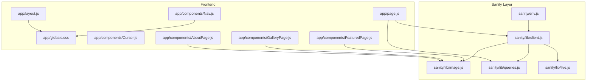
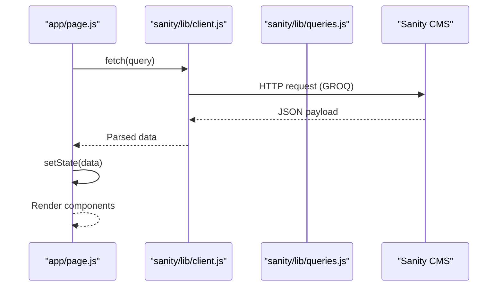
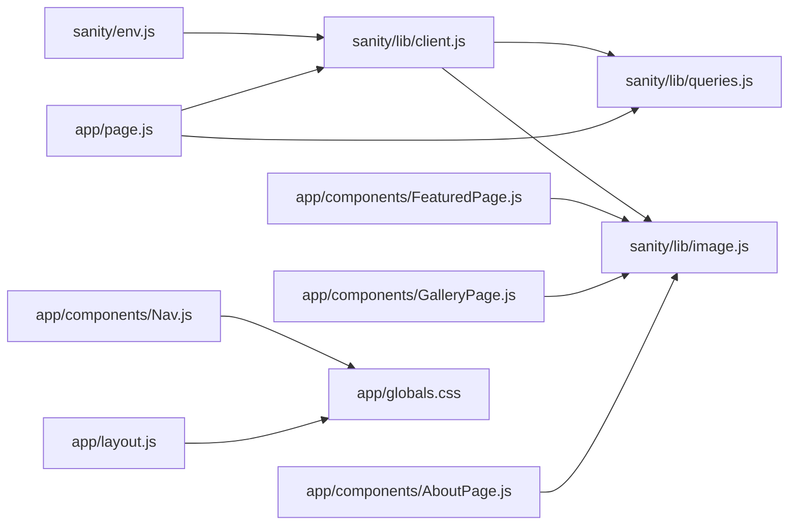

# Utility APIs

<cite>
**Referenced Files in This Document**
- [client.js](file://sanity/lib/client.js)
- [image.js](file://sanity/lib/image.js)
- [queries.js](file://sanity/lib/queries.js)
- [live.js](file://sanity/lib/live.js)
- [env.js](file://sanity/env.js)
- [layout.js](file://app/layout.js)
- [globals.css](file://app/globals.css)
- [page.js](file://app/page.js)
- [Nav.js](file://app/components/Nav.js)
- [Cursor.js](file://app/components/Cursor.js)
- [FeaturedPage.js](file://app/components/FeaturedPage.js)
- [GalleryPage.js](file://app/components/GalleryPage.js)
- [AboutPage.js](file://app/components/AboutPage.js)
</cite>

## Table of Contents
1. [Introduction](#introduction)
2. [Project Structure](#project-structure)
3. [Core Components](#core-components)
4. [Architecture Overview](#architecture-overview)
5. [Detailed Component Analysis](#detailed-component-analysis)
6. [Dependency Analysis](#dependency-analysis)
7. [Performance Considerations](#performance-considerations)
8. [Troubleshooting Guide](#troubleshooting-guide)
9. [Conclusion](#conclusion)

## Introduction
This document provides comprehensive utility API documentation for helper functions and shared utilities used across the application. It covers:
- GROQ query utilities for content fetching, pagination, and filtering
- Image processing utilities for URL generation, transformation parameters, CDN integration, and optimization settings
- CSS utility functions for theme management, responsive breakpoints, and animation timing
- localStorage utilities for theme persistence and user preferences
- Font loading utilities and asset optimization helpers
- Performance monitoring and best practices

The goal is to present usage patterns, parameter specifications, integration guidelines, error handling, fallback mechanisms, and browser compatibility considerations for each utility category.

## Project Structure
The utility ecosystem spans three primary areas:
- Sanity CMS integration (client, image builder, queries, live content)
- Frontend data fetching and rendering (GROQ queries, image transformations)
- UI utilities (theme switching via localStorage, cursor behavior, navigation)

**Diagram sources**
- [env.js:1-6](file://sanity/env.js#L1-L6)
- [client.js:1-10](file://sanity/lib/client.js#L1-L10)
- [image.js:1-9](file://sanity/lib/image.js#L1-L9)
- [queries.js:1-33](file://sanity/lib/queries.js#L1-L33)
- [live.js:1-10](file://sanity/lib/live.js#L1-L10)
- [layout.js:1-40](file://app/layout.js#L1-L40)
- [globals.css:1-93](file://app/globals.css#L1-L93)
- [page.js:1-227](file://app/page.js#L1-L227)
- [Nav.js:1-168](file://app/components/Nav.js#L1-L168)
- [Cursor.js:1-42](file://app/components/Cursor.js#L1-L42)
- [FeaturedPage.js:1-269](file://app/components/FeaturedPage.js#L1-L269)
- [GalleryPage.js:1-760](file://app/components/GalleryPage.js#L1-L760)
- [AboutPage.js:1-458](file://app/components/AboutPage.js#L1-L458)

**Section sources**
- [env.js:1-6](file://sanity/env.js#L1-L6)
- [client.js:1-10](file://sanity/lib/client.js#L1-L10)
- [image.js:1-9](file://sanity/lib/image.js#L1-L9)
- [queries.js:1-33](file://sanity/lib/queries.js#L1-L33)
- [live.js:1-10](file://sanity/lib/live.js#L1-L10)
- [layout.js:1-40](file://app/layout.js#L1-L40)
- [globals.css:1-93](file://app/globals.css#L1-L93)
- [page.js:1-227](file://app/page.js#L1-L227)
- [Nav.js:1-168](file://app/components/Nav.js#L1-L168)
- [Cursor.js:1-42](file://app/components/Cursor.js#L1-L42)
- [FeaturedPage.js:1-269](file://app/components/FeaturedPage.js#L1-L269)
- [GalleryPage.js:1-760](file://app/components/GalleryPage.js#L1-L760)
- [AboutPage.js:1-458](file://app/components/AboutPage.js#L1-L458)

## Core Components
This section documents the core utility categories and their roles.

- Sanity client and environment
  - Provides a configured Sanity client and environment variables for API version, dataset, and project ID.
  - Uses a non-CDN mode for fresh data during development.

- Image URL builder
  - Exposes a urlFor helper to build optimized image URLs with chained transformations.

- GROQ queries
  - Defines typed queries for featured photos, all photos, gallery hero, and about page assets.
  - Returns structured data suitable for component rendering.

- Live content
  - Enables real-time content updates via sanityFetch and a SanityLive provider.

- Theme and font utilities
  - Theme management via CSS custom properties and localStorage persistence.
  - Font loading via Next.js font optimization with swap strategy for fast TTFB.

- Asset optimization helpers
  - Image transformations (width, quality) integrated with urlFor.
  - Fallbacks for missing CMS assets.

**Section sources**
- [client.js:1-10](file://sanity/lib/client.js#L1-L10)
- [image.js:1-9](file://sanity/lib/image.js#L1-L9)
- [queries.js:1-33](file://sanity/lib/queries.js#L1-L33)
- [live.js:1-10](file://sanity/lib/live.js#L1-L10)
- [env.js:1-6](file://sanity/env.js#L1-L6)
- [layout.js:1-40](file://app/layout.js#L1-L40)
- [globals.css:1-93](file://app/globals.css#L1-L93)
- [page.js:1-227](file://app/page.js#L1-L227)
- [Nav.js:70-83](file://app/components/Nav.js#L70-L83)

## Architecture Overview
The application integrates CMS data with frontend rendering through a clean separation of concerns:
- Sanity layer: client initialization, image builder, queries, live content
- Frontend layer: data fetching, component rendering, theme and font utilities

**Diagram sources**
- [page.js:109-128](file://app/page.js#L109-L128)
- [client.js:4-9](file://sanity/lib/client.js#L4-L9)
- [queries.js:3-32](file://sanity/lib/queries.js#L3-L32)

## Detailed Component Analysis

### GROQ Query Utilities
Purpose:
- Encapsulate content retrieval logic with strongly typed queries for different pages and sections.

Key functions and patterns:
- featuredPhotosQuery: Fetches featured photos ordered by custom fields.
- allPhotosQuery: Retrieves all photos with similar ordering and projection.
- galleryHeroQuery: Fetches hero image and metadata for the gallery.
- aboutPageQuery: Retrieves hero and collage images for the about page.

Pagination and filtering:
- Filtering by series is performed client-side in GalleryPage using array filters.
- No server-side pagination is implemented; client-side slicing could be considered for very large datasets.

Integration pattern:
- Import queries and client in app/page.js and fetch concurrently using Promise.all.
- Assign results to state for downstream components.

Usage examples (conceptual):
- Fetch featured and gallery hero data together for initial hydration.
- Filter photos by series in GalleryPage for interactive browsing.

Error handling and fallbacks:
- Components check for empty arrays and render placeholders.
- Fallback images are used when CMS assets are missing.

Browser compatibility:
- Standard fetch API; ensure polyfills if targeting legacy browsers.

**Section sources**
- [queries.js:3-32](file://sanity/lib/queries.js#L3-L32)
- [page.js:109-128](file://app/page.js#L109-L128)
- [GalleryPage.js:39-49](file://app/components/GalleryPage.js#L39-L49)
- [AboutPage.js:176-197](file://app/components/AboutPage.js#L176-L197)

### Image Processing Utilities
Purpose:
- Build optimized image URLs with transformations (width, quality) and integrate with Sanity’s image builder.

Key function:
- urlFor(source): Returns a builder instance for chaining transformations.

Transformation parameters:
- width(): Sets target width for responsive delivery.
- quality(): Sets JPEG/WebP quality level.
- url(): Produces the final image URL.

CDN integration:
- The Sanity client is configured with useCdn disabled for development to ensure fresh content. In production, enabling CDN can improve performance.

Optimization settings:
- Prefer serving appropriately sized images via width().
- Tune quality based on visual fidelity needs and bandwidth constraints.
- Use modern formats (WebP) when supported by the CDN.

Integration patterns:
- FeaturedPage: Uses urlFor with width(1920) and quality(85) for hero backgrounds.
- GalleryPage: Uses urlFor with width(1000) and quality(82) for thumbnails and masonry items.
- AboutPage: Uses urlFor with width(1200)/width(900) and quality(85)/(82) for hero and collage images.

Fallback mechanisms:
- GalleryPage and AboutPage provide fallback URLs when CMS images are unavailable.

Performance considerations:
- Defer non-critical images; lazy-load where appropriate.
- Use aspect ratios and object-fit to avoid layout shifts.

**Section sources**
- [image.js:6-8](file://sanity/lib/image.js#L6-L8)
- [FeaturedPage.js:136-136](file://app/components/FeaturedPage.js#L136-L136)
- [GalleryPage.js:250-252](file://app/components/GalleryPage.js#L250-L252)
- [GalleryPage.js:386-386](file://app/components/GalleryPage.js#L386-L386)
- [GalleryPage.js:488-488](file://app/components/GalleryPage.js#L488-L488)
- [GalleryPage.js:575-575](file://app/components/GalleryPage.js#L575-L575)
- [GalleryPage.js:652-652](file://app/components/GalleryPage.js#L652-L652)
- [GalleryPage.js:696-696](file://app/components/GalleryPage.js#L696-L696)
- [AboutPage.js:178-178](file://app/components/AboutPage.js#L178-L178)
- [AboutPage.js:195-195](file://app/components/AboutPage.js#L195-L195)
- [client.js:8-8](file://sanity/lib/client.js#L8-L8)

### CSS Utility Functions and Theme Management
Purpose:
- Centralized theme management via CSS custom properties and localStorage persistence.

Key utilities:
- Theme switching: Toggle between dark and light themes and persist selection.
- Font loading: Next.js font optimization with display swap for fast TTFB.
- Responsive breakpoints and animation timing: Defined in global CSS.

Integration patterns:
- Nav component reads stored theme and applies data-theme attribute to html element.
- Components consume CSS variables for colors, typography, and spacing.

Usage examples:
- Toggle theme via a button and persist to localStorage.
- Apply theme-aware styles using CSS variables.

Error handling and fallbacks:
- On first load, falls back to user’s OS preference if no stored theme exists.

Browser compatibility:
- CSS custom properties are widely supported; ensure graceful degradation for older browsers.

**Section sources**
- [Nav.js:70-83](file://app/components/Nav.js#L70-L83)
- [globals.css:5-49](file://app/globals.css#L5-L49)
- [layout.js:1-24](file://app/layout.js#L1-L24)

### localStorage Utilities
Purpose:
- Persist user preferences (theme) and restore them on subsequent visits.

Key functions:
- window.localStorage.getItem('wrd-theme'): Retrieve stored theme.
- window.localStorage.setItem('wrd-theme', theme): Save theme preference.

Integration patterns:
- On mount, read stored theme or OS preference and apply to the document element.
- On toggle, update both state and localStorage.

Usage examples:
- Initialize theme on app load.
- Update theme and persist immediately after user action.

Error handling and fallbacks:
- If localStorage is unavailable, gracefully fall back to OS preference.

Browser compatibility:
- Modern browsers support localStorage; consider feature detection and graceful degradation.

**Section sources**
- [Nav.js:70-83](file://app/components/Nav.js#L70-L83)

### Font Loading Utilities
Purpose:
- Optimize font loading using Next.js Google Fonts integration with display swap.

Key utilities:
- Manrope, Libre Caslon Display, JetBrains Mono configured with subsets, weights, and display swap.
- Variables mapped to CSS custom properties for runtime switching.

Integration patterns:
- Import fonts in layout and apply variables to the root element.
- Use CSS variables for font families across components.

Usage examples:
- Apply font variables to headings and body text.
- Ensure fonts are ready before animations requiring text metrics.

Error handling and fallbacks:
- Fallback to system fonts if web fonts fail to load.

Browser compatibility:
- display: swap ensures instant availability of fallback fonts.

**Section sources**
- [layout.js:4-24](file://app/layout.js#L4-L24)
- [globals.css:24-27](file://app/globals.css#L24-L27)

### Asset Optimization Helpers
Purpose:
- Provide consistent image optimization across components with fallbacks.

Key patterns:
- urlFor chaining for width and quality.
- Fallback URLs for hero and collage images when CMS assets are missing.

Integration patterns:
- Use consistent width and quality across sections for visual coherence.
- Provide fallbacks to maintain UX when CMS content is incomplete.

Usage examples:
- Gallery hero background uses urlFor with width(1800) and quality(85).
- Collage images use urlFor with width(900) and quality(82) with fallbacks.

Error handling and fallbacks:
- GalleryPage and AboutPage supply default images when CMS images are absent.

Browser compatibility:
- Modern image formats and sizes are supported; ensure progressive enhancement.

**Section sources**
- [GalleryPage.js:250-252](file://app/components/GalleryPage.js#L250-L252)
- [GalleryPage.js:386-386](file://app/components/GalleryPage.js#L386-L386)
- [GalleryPage.js:488-488](file://app/components/GalleryPage.js#L488-L488)
- [GalleryPage.js:575-575](file://app/components/GalleryPage.js#L575-L575)
- [GalleryPage.js:652-652](file://app/components/GalleryPage.js#L652-L652)
- [GalleryPage.js:696-696](file://app/components/GalleryPage.js#L696-L696)
- [AboutPage.js:176-197](file://app/components/AboutPage.js#L176-L197)

### Performance Monitoring Functions
Purpose:
- Monitor and optimize rendering performance using GSAP utilities and best practices.

Key utilities:
- GSAP utils for clamping, mapping ranges, normalizing, interpolating, randomization, snapping, array conversion, composition, wrapping, and selector scoping.
- Scroll-driven animations with ScrollTrigger and cleanup on unmount.

Integration patterns:
- Register ScrollTrigger dynamically and kill instances on component unmount.
- Use gsap.utils.toArray for robust target handling.
- Apply performance best practices: animate transform and opacity, avoid animating layout-affecting properties.

Usage examples:
- Character-by-character reveals in gallery hero text.
- Parallax effects and staggered masonry reveals.
- Cleanup ScrollTrigger instances to prevent memory leaks.

Error handling and fallbacks:
- Gracefully handle missing targets and ensure cleanup on unmount.

Browser compatibility:
- Ensure modern browser support for ScrollTrigger and GSAP; test on lower-end devices.

**Section sources**
- [GalleryPage.js:56-58](file://app/components/GalleryPage.js#L56-L58)
- [GalleryPage.js:215-219](file://app/components/GalleryPage.js#L215-L219)
- [AboutPage.js:16-18](file://app/components/AboutPage.js#L16-L18)
- [AboutPage.js:157-161](file://app/components/AboutPage.js#L157-L161)

## Dependency Analysis
This section maps dependencies among utility modules and components.

**Diagram sources**
- [env.js:1-6](file://sanity/env.js#L1-L6)
- [client.js:1-10](file://sanity/lib/client.js#L1-L10)
- [image.js:1-9](file://sanity/lib/image.js#L1-L9)
- [queries.js:1-33](file://sanity/lib/queries.js#L1-L33)
- [page.js:1-227](file://app/page.js#L1-L227)
- [FeaturedPage.js:1-269](file://app/components/FeaturedPage.js#L1-L269)
- [GalleryPage.js:1-760](file://app/components/GalleryPage.js#L1-L760)
- [AboutPage.js:1-458](file://app/components/AboutPage.js#L1-L458)
- [Nav.js:1-168](file://app/components/Nav.js#L1-L168)
- [layout.js:1-40](file://app/layout.js#L1-L40)
- [globals.css:1-93](file://app/globals.css#L1-L93)

**Section sources**
- [env.js:1-6](file://sanity/env.js#L1-L6)
- [client.js:1-10](file://sanity/lib/client.js#L1-L10)
- [image.js:1-9](file://sanity/lib/image.js#L1-L9)
- [queries.js:1-33](file://sanity/lib/queries.js#L1-L33)
- [page.js:1-227](file://app/page.js#L1-L227)
- [FeaturedPage.js:1-269](file://app/components/FeaturedPage.js#L1-L269)
- [GalleryPage.js:1-760](file://app/components/GalleryPage.js#L1-L760)
- [AboutPage.js:1-458](file://app/components/AboutPage.js#L1-L458)
- [Nav.js:1-168](file://app/components/Nav.js#L1-L168)
- [layout.js:1-40](file://app/layout.js#L1-L40)
- [globals.css:1-93](file://app/globals.css#L1-L93)

## Performance Considerations
- Animation best practices
  - Animate transform and opacity; prefer gsap.quickTo for frequently updated properties.
  - Use stagger for repeated animations; clean up ScrollTrigger instances on unmount.
  - Debounce refresh calls when layout changes.

- Image optimization
  - Serve appropriately sized images via width() and tune quality for visual fidelity.
  - Use modern formats and consider lazy-loading non-critical images.

- Data fetching
  - Fetch related queries concurrently to minimize total load time.
  - Consider pagination for large datasets to reduce initial payload.

- Theme and fonts
  - Font display swap reduces FOUT; ensure fallback fonts are legible.
  - Persist theme to avoid unnecessary reflows on subsequent visits.

[No sources needed since this section provides general guidance]

## Troubleshooting Guide
Common issues and resolutions:
- Images not appearing
  - Verify urlFor usage and ensure asset fields are populated in Sanity.
  - Confirm fallback URLs are applied when CMS images are missing.

- Theme not persisting
  - Check localStorage availability and permissions.
  - Ensure data-theme attribute is applied to html element.

- Animations stuttering
  - Avoid animating layout-affecting properties; prefer transform and opacity.
  - Kill ScrollTrigger instances on unmount to prevent lingering triggers.

- Fonts not loading
  - Confirm subset and weight configurations match intended usage.
  - Ensure display swap is applied to prevent FOIT.

**Section sources**
- [GalleryPage.js:17-37](file://app/components/GalleryPage.js#L17-L37)
- [AboutPage.js:176-197](file://app/components/AboutPage.js#L176-L197)
- [Nav.js:70-83](file://app/components/Nav.js#L70-L83)
- [layout.js:1-24](file://app/layout.js#L1-L24)

## Conclusion
The utility APIs in this project provide a cohesive foundation for content fetching, image optimization, theme management, and performance-sensitive UI interactions. By leveraging Sanity’s GROQ queries, the urlFor builder, and GSAP utilities, the application achieves a balance between developer productivity and user experience. Following the documented patterns and best practices ensures maintainability, scalability, and cross-browser compatibility.

[No sources needed since this section summarizes without analyzing specific files]