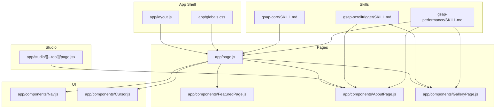
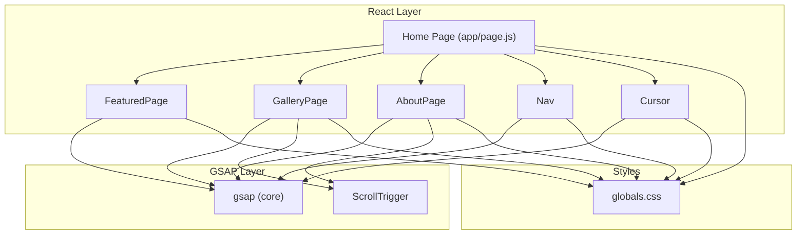
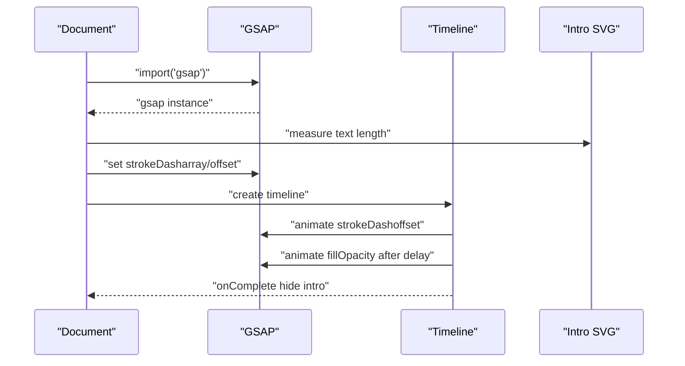
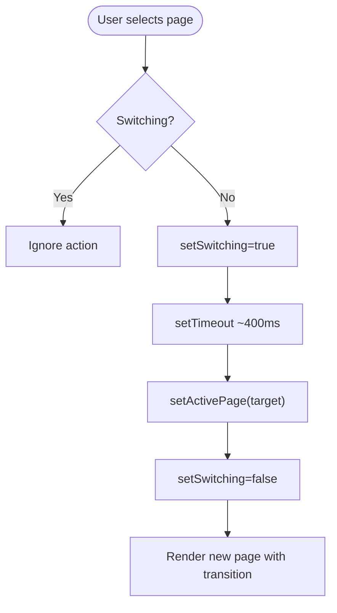
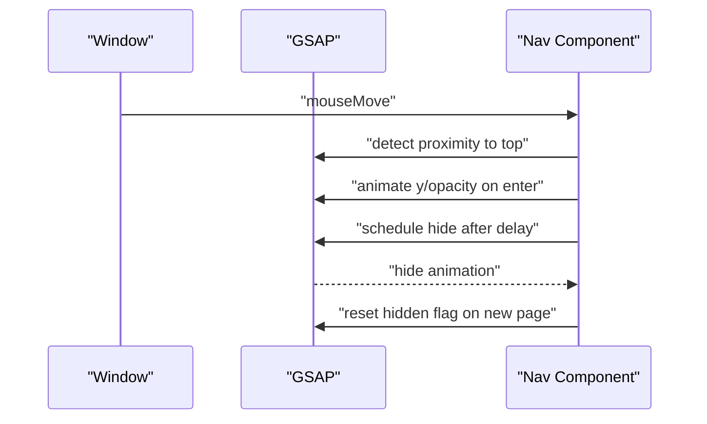
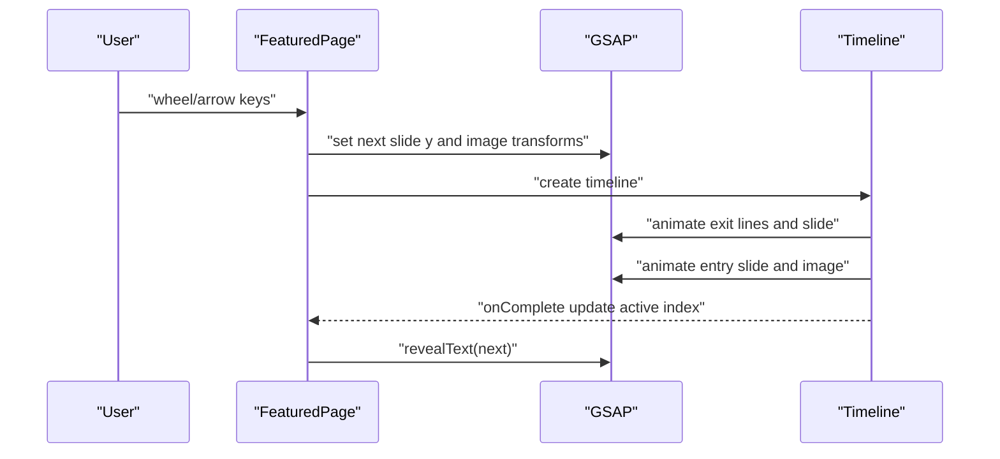
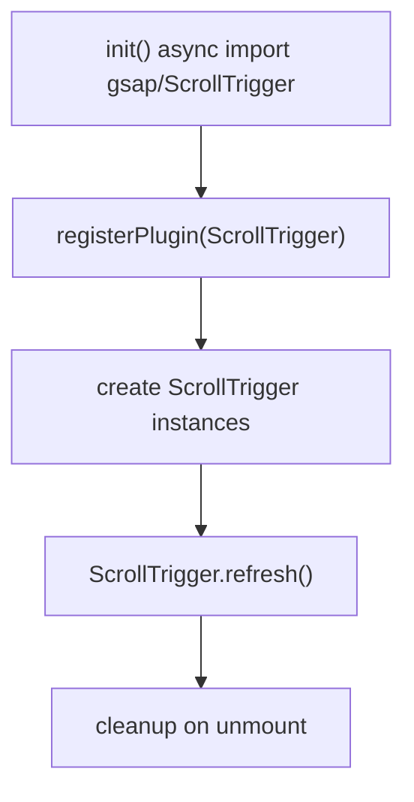
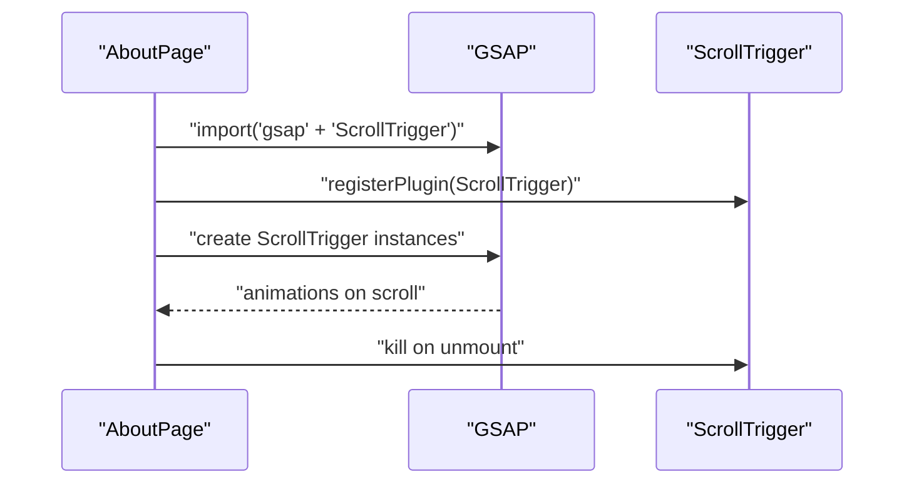
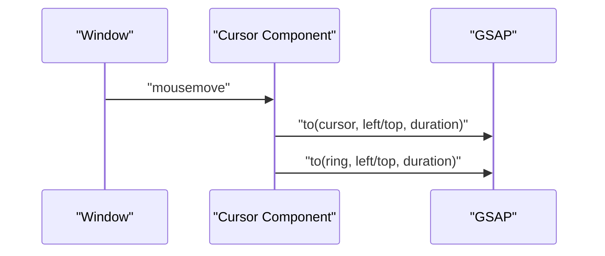
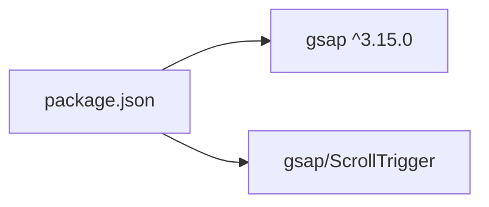

# Animation System Architecture

<cite>
**Referenced Files in This Document**
- [app/page.js](file://app/page.js)
- [app/layout.js](file://app/layout.js)
- [app/globals.css](file://app/globals.css)
- [app/components/Cursor.js](file://app/components/Cursor.js)
- [app/components/Nav.js](file://app/components/Nav.js)
- [app/components/FeaturedPage.js](file://app/components/FeaturedPage.js)
- [app/components/GalleryPage.js](file://app/components/GalleryPage.js)
- [app/components/AboutPage.js](file://app/components/AboutPage.js)
- [app/studio/[[...tool]]/page.jsx](file://app/studio/[[...tool]]/page.jsx)
- [.agents/skills/gsap-core/SKILL.md](file://.agents/skills/gsap-core/SKILL.md)
- [.agents/skills/gsap-scrolltrigger/SKILL.md](file://.agents/skills/gsap-scrolltrigger/SKILL.md)
- [.agents/skills/gsap-performance/SKILL.md](file://.agents/skills/gsap-performance/SKILL.md)
- [package.json](file://package.json)
</cite>

## Table of Contents
1. [Introduction](#introduction)
2. [Project Structure](#project-structure)
3. [Core Components](#core-components)
4. [Architecture Overview](#architecture-overview)
5. [Detailed Component Analysis](#detailed-component-analysis)
6. [Dependency Analysis](#dependency-analysis)
7. [Performance Considerations](#performance-considerations)
8. [Troubleshooting Guide](#troubleshooting-guide)
9. [Conclusion](#conclusion)
10. [Appendices](#appendices)

## Introduction
This document describes the animation system architecture of a Next.js portfolio site powered by GSAP. It explains how GSAP orchestrates micro-interactions, page transitions, navigation animations, and scroll-driven experiences. It also covers the custom cursor implementation, interactive hover effects, performance optimization strategies, browser compatibility considerations, and debugging approaches. The documentation synthesizes the animation patterns found in the codebase and aligns them with official GSAP skills and best practices.

## Project Structure
The animation system spans the Next.js app shell, page components, and shared styles. GSAP is integrated at multiple layers:
- Application shell and global styles define themes and reduced-motion support.
- Page-level components orchestrate intro animations, page transitions, and micro-interactions.
- Scroll-driven animations leverage ScrollTrigger for parallax, pinning, and staggered reveals.
- Interactive elements use GSAP for cursor following and hover effects.

**Diagram sources**
- [app/layout.js:1-40](file://app/layout.js#L1-L40)
- [app/globals.css:1-93](file://app/globals.css#L1-L93)
- [app/page.js:1-227](file://app/page.js#L1-L227)
- [app/components/FeaturedPage.js:1-269](file://app/components/FeaturedPage.js#L1-L269)
- [app/components/AboutPage.js:1-458](file://app/components/AboutPage.js#L1-L458)
- [app/components/GalleryPage.js:1-760](file://app/components/GalleryPage.js#L1-L760)
- [app/components/Nav.js:1-168](file://app/components/Nav.js#L1-L168)
- [app/components/Cursor.js:1-42](file://app/components/Cursor.js#L1-L42)
- [app/studio/[[...tool]]/page.jsx:1-9](file://app/studio/[[...tool]]/page.jsx#L1-L9)
- [.agents/skills/gsap-core/SKILL.md:1-255](file://.agents/skills/gsap-core/SKILL.md#L1-L255)
- [.agents/skills/gsap-scrolltrigger/SKILL.md:1-297](file://.agents/skills/gsap-scrolltrigger/SKILL.md#L1-L297)
- [.agents/skills/gsap-performance/SKILL.md:1-80](file://.agents/skills/gsap-performance/SKILL.md#L1-L80)

**Section sources**
- [app/layout.js:1-40](file://app/layout.js#L1-L40)
- [app/globals.css:1-93](file://app/globals.css#L1-L93)
- [app/page.js:1-227](file://app/page.js#L1-L227)

## Core Components
- Intro animation: A typographic reveal using stroke drawing and fill effects driven by GSAP timelines.
- Navigation: Animated entrance and auto-hide behavior controlled by mouse movement and ScrollTrigger.
- Page transitions: Switching between pages with opacity and transform transitions, complemented by a clip-path reveal.
- Featured slider: Mouse-wheel and keyboard-driven photo slider with layered text and image animations.
- Gallery: Scroll-triggered parallax backgrounds, hero text reveals, horizontal track scrubbing, and masonry card reveals.
- About: Scroll-driven paragraph word reveals, image parallax, collage fades, and CTA animations.
- Cursor: Smooth mouse follower with ring and dot elements animated via GSAP.
- Global styles: Theme variables, reduced-motion support, and page clip-path animation.

**Section sources**
- [app/page.js:28-101](file://app/page.js#L28-L101)
- [app/components/Nav.js:10-68](file://app/components/Nav.js#L10-L68)
- [app/globals.css:65-83](file://app/globals.css#L65-L83)
- [app/components/FeaturedPage.js:36-105](file://app/components/FeaturedPage.js#L36-L105)
- [app/components/GalleryPage.js:51-220](file://app/components/GalleryPage.js#L51-L220)
- [app/components/AboutPage.js:11-162](file://app/components/AboutPage.js#L11-L162)
- [app/components/Cursor.js:9-21](file://app/components/Cursor.js#L9-L21)

## Architecture Overview
The animation architecture follows a layered approach:
- GSAP core engine powers tweens, timelines, and easing.
- ScrollTrigger enables scroll-linked animations and pinning.
- React lifecycle hooks coordinate creation and cleanup of animations.
- Global CSS provides theme and accessibility support (reduced-motion).
- Component-specific logic coordinates micro-interactions and page transitions.

**Diagram sources**
- [app/page.js:14-227](file://app/page.js#L14-L227)
- [app/components/FeaturedPage.js:1-269](file://app/components/FeaturedPage.js#L1-L269)
- [app/components/GalleryPage.js:1-760](file://app/components/GalleryPage.js#L1-L760)
- [app/components/AboutPage.js:1-458](file://app/components/AboutPage.js#L1-L458)
- [app/components/Nav.js:1-168](file://app/components/Nav.js#L1-L168)
- [app/components/Cursor.js:1-42](file://app/components/Cursor.js#L1-L42)
- [app/globals.css:1-93](file://app/globals.css#L1-L93)

## Detailed Component Analysis

### Intro Typographic Animation
The intro animation draws the text stroke and fills it after a short hold. It uses GSAP timelines and respects font loading readiness.

**Diagram sources**
- [app/page.js:33-101](file://app/page.js#L33-L101)

**Section sources**
- [app/page.js:33-101](file://app/page.js#L33-L101)

### Page Transition System
The home page manages page switching with a state flag and a CSS transition. The active page is wrapped in a container with a clip-path animation for entrance.

**Diagram sources**
- [app/page.js:136-145](file://app/page.js#L136-L145)
- [app/globals.css:65-83](file://app/globals.css#L65-L83)

**Section sources**
- [app/page.js:136-145](file://app/page.js#L136-L145)
- [app/globals.css:65-83](file://app/globals.css#L65-L83)

### Navigation Animation and Auto-Hide
The navigation bar animates into view on mount and hides on idle. It reappears when the mouse approaches the top of the viewport and hides again after a timeout.

**Diagram sources**
- [app/components/Nav.js:10-68](file://app/components/Nav.js#L10-L68)

**Section sources**
- [app/components/Nav.js:10-68](file://app/components/Nav.js#L10-L68)

### Featured Photo Slider
The slider supports wheel and keyboard navigation. It animates text lines and image transforms in a coordinated timeline, with a counter that tracks progress.

**Diagram sources**
- [app/components/FeaturedPage.js:36-105](file://app/components/FeaturedPage.js#L36-L105)

**Section sources**
- [app/components/FeaturedPage.js:36-105](file://app/components/FeaturedPage.js#L36-L105)

### Gallery Scroll-Driven Animations
The gallery registers ScrollTrigger on mount and creates multiple scroll-linked animations:
- Hero text character split reveals
- Hero eyebrow fade
- Parallax background and overlay
- Horizontal track scrubbing with pinning
- Masonry card staggered reveals
- Portrait section reveals
- Photo counter scrub

**Diagram sources**
- [app/components/GalleryPage.js:51-220](file://app/components/GalleryPage.js#L51-L220)

**Section sources**
- [app/components/GalleryPage.js:51-220](file://app/components/GalleryPage.js#L51-L220)

### About Page Scroll-Driven Animations
The About page uses ScrollTrigger for:
- Hero title line-by-line reveal
- Hero eyebrow fade
- Bio word-by-word reveal
- Image parallax and clip-path reveal
- Stats count-up
- Quote reveal
- Divider line draw
- Approach items staggered reveal
- Photo collage fade-ins
- CTA title and buttons reveal

**Diagram sources**
- [app/components/AboutPage.js:11-162](file://app/components/AboutPage.js#L11-L162)

**Section sources**
- [app/components/AboutPage.js:11-162](file://app/components/AboutPage.js#L11-L162)

### Custom Cursor Animation
The cursor consists of a dot and a ring that follow the mouse with different easing and durations. GSAP updates their positions on every mousemove event.

**Diagram sources**
- [app/components/Cursor.js:9-21](file://app/components/Cursor.js#L9-L21)

**Section sources**
- [app/components/Cursor.js:9-21](file://app/components/Cursor.js#L9-L21)

### Interactive Hover Effects
Hover effects are implemented with a combination of CSS transitions and GSAP for magnetic buttons and cards:
- Magnetic filter buttons: transform based on mouse position with easing.
- Card hover: image scale and overlay gradient transitions.
- Button hover: magnetic transform with easing and border color changes.

**Section sources**
- [app/components/GalleryPage.js:222-232](file://app/components/GalleryPage.js#L222-L232)
- [app/components/AboutPage.js:164-174](file://app/components/AboutPage.js#L164-L174)

## Dependency Analysis
The project depends on GSAP for all animation logic. Scroll-driven animations rely on the ScrollTrigger plugin. The system integrates with Next.js and React lifecycle hooks for safe initialization and cleanup.

**Diagram sources**
- [package.json:11-22](file://package.json#L11-L22)

**Section sources**
- [package.json:11-22](file://package.json#L11-L22)

## Performance Considerations
- Prefer transform and opacity animations to keep work on the compositor.
- Use stagger for list animations and reuse timelines where possible.
- Leverage quickTo for frequently updated properties (e.g., cursor).
- Kill or revert ScrollTrigger instances on unmount to prevent leaks.
- Respect reduced-motion preferences and disable heavy animations when requested.
- Batch reads and writes to avoid layout thrashing.

**Section sources**
- [.agents/skills/gsap-performance/SKILL.md:15-80](file://.agents/skills/gsap-performance/SKILL.md#L15-L80)
- [app/components/GalleryPage.js:215-219](file://app/components/GalleryPage.js#L215-L219)
- [app/components/AboutPage.js:157-161](file://app/components/AboutPage.js#L157-L161)

## Troubleshooting Guide
- Debugging ScrollTrigger:
  - Use markers during development to visualize trigger positions.
  - Ensure ScrollTrigger.refresh() is called after layout changes.
  - Kill or revert ScrollTrigger instances on unmount.
- Cursor jitter or lag:
  - Verify GSAP updates are not being recreated on every mousemove.
  - Consider using quickTo for frequent updates.
- Reduced-motion compliance:
  - Respect prefers-reduced-motion by skipping or shortening animations.
- Cleanup:
  - Always unregister plugins and revert contexts when components unmount.

**Section sources**
- [.agents/skills/gsap-scrolltrigger/SKILL.md:186-292](file://.agents/skills/gsap-scrolltrigger/SKILL.md#L186-L292)
- [.agents/skills/gsap-performance/SKILL.md:42-80](file://.agents/skills/gsap-performance/SKILL.md#L42-L80)
- [app/globals.css:81-83](file://app/globals.css#L81-L83)

## Conclusion
The animation system leverages GSAP as a unified engine for micro-interactions, page transitions, and scroll-driven experiences. By structuring animations around React lifecycles, registering and cleaning up ScrollTrigger instances, and adhering to performance best practices, the system achieves smooth, accessible, and maintainable animations across the portfolio site.

## Appendices

### Animation Skill Documentation
- GSAP Core: Core tween methods, easing, stagger, and responsive patterns.
- GSAP ScrollTrigger: Scroll-linked animations, pinning, scrubbing, and best practices.
- GSAP Performance: Transform-first animations, batching, and cleanup strategies.

**Section sources**
- [.agents/skills/gsap-core/SKILL.md:1-255](file://.agents/skills/gsap-core/SKILL.md#L1-L255)
- [.agents/skills/gsap-scrolltrigger/SKILL.md:1-297](file://.agents/skills/gsap-scrolltrigger/SKILL.md#L1-L297)
- [.agents/skills/gsap-performance/SKILL.md:1-80](file://.agents/skills/gsap-performance/SKILL.md#L1-L80)