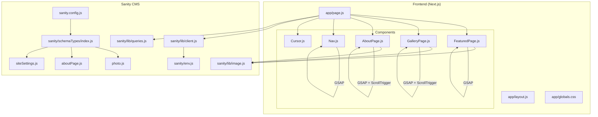
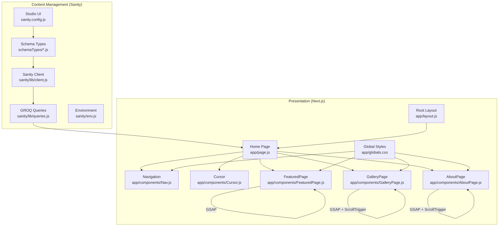
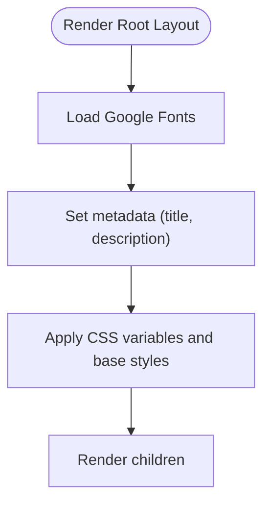
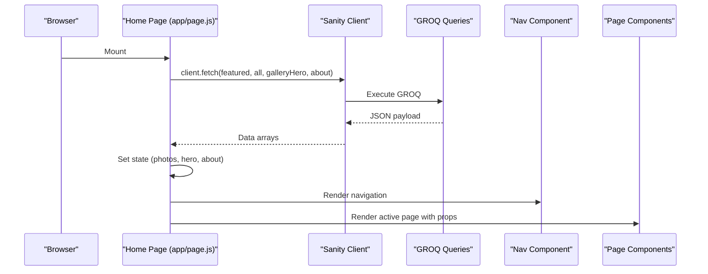
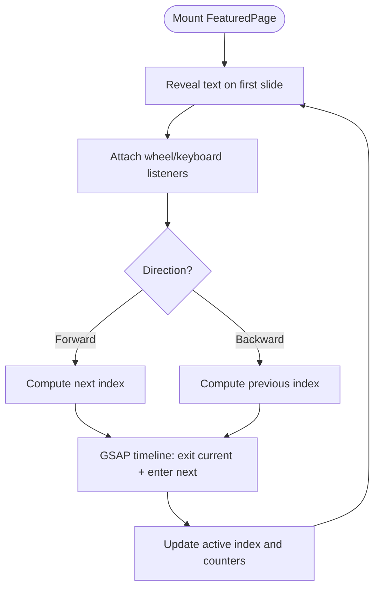
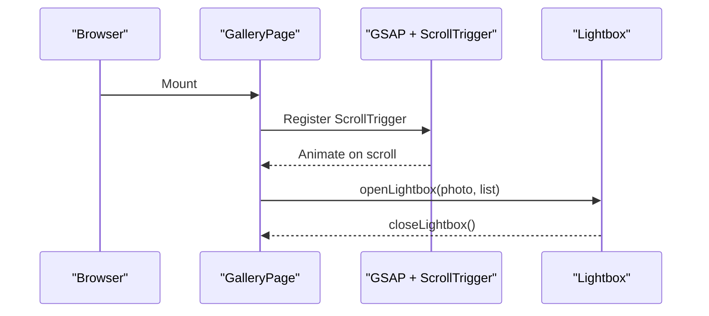
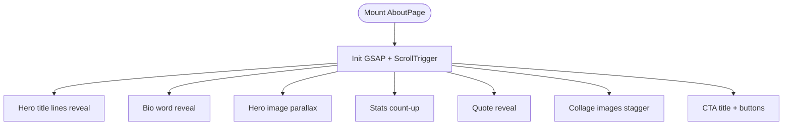
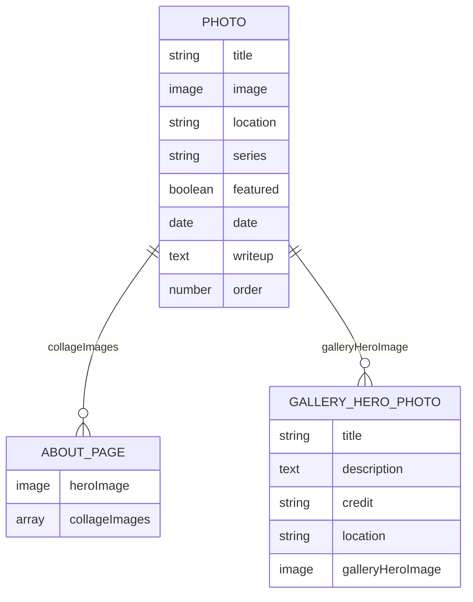
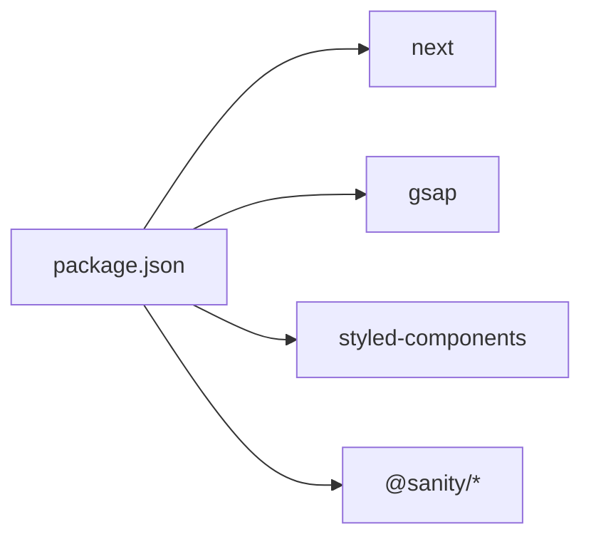

# Architecture Overview

<cite>
**Referenced Files in This Document**
- [README.md](file://README.md)
- [package.json](file://package.json)
- [next.config.mjs](file://next.config.mjs)
- [app/layout.js](file://app/layout.js)
- [app/page.js](file://app/page.js)
- [app/globals.css](file://app/globals.css)
- [app/components/Nav.js](file://app/components/Nav.js)
- [app/components/Cursor.js](file://app/components/Cursor.js)
- [app/components/FeaturedPage.js](file://app/components/FeaturedPage.js)
- [app/components/GalleryPage.js](file://app/components/GalleryPage.js)
- [app/components/AboutPage.js](file://app/components/AboutPage.js)
- [sanity.config.js](file://sanity.config.js)
- [sanity/env.js](file://sanity/env.js)
- [sanity/lib/client.js](file://sanity/lib/client.js)
- [sanity/lib/queries.js](file://sanity/lib/queries.js)
- [sanity/lib/image.js](file://sanity/lib/image.js)
- [sanity/schemaTypes/index.js](file://sanity/schemaTypes/index.js)
- [sanity/schemaTypes/photo.js](file://sanity/schemaTypes/photo.js)
- [sanity/schemaTypes/aboutPage.js](file://sanity/schemaTypes/aboutPage.js)
- [sanity/schemaTypes/siteSettings.js](file://sanity/schemaTypes/siteSettings.js)
</cite>

## Table of Contents
1. [Introduction](#introduction)
2. [Project Structure](#project-structure)
3. [Core Components](#core-components)
4. [Architecture Overview](#architecture-overview)
5. [Detailed Component Analysis](#detailed-component-analysis)
6. [Dependency Analysis](#dependency-analysis)
7. [Performance Considerations](#performance-considerations)
8. [Troubleshooting Guide](#troubleshooting-guide)
9. [Conclusion](#conclusion)
10. [Appendices](#appendices)

## Introduction
This document describes the architectural design of the WRD Photography portfolio system. It combines a Next.js App Router frontend with a Sanity CMS backend using a content-driven architecture. Content is authored in Sanity Studio and queried via GROQ, then rendered by React components. Animations are powered by GSAP for micro-interactions and page transitions. The system enforces a clear separation between the presentation layer (frontend) and content management (backend), while integrating Next.js static generation, server components, and client-side interactivity. The design follows a mobile-first responsive approach and a theme system built on CSS custom properties and styled-components.

## Project Structure
The repository is organized into two primary areas:
- Frontend (Next.js App Router): app/ contains pages, layouts, global styles, and components.
- Backend (Sanity): sanity/ contains configuration, schema types, client initialization, and GROQ queries.



**Diagram sources**
- [app/layout.js:1-40](file://app/layout.js#L1-L40)
- [app/page.js:1-227](file://app/page.js#L1-L227)
- [app/globals.css:1-93](file://app/globals.css#L1-L93)
- [app/components/Nav.js:1-168](file://app/components/Nav.js#L1-L168)
- [app/components/Cursor.js:1-42](file://app/components/Cursor.js#L1-L42)
- [app/components/FeaturedPage.js:1-269](file://app/components/FeaturedPage.js#L1-L269)
- [app/components/GalleryPage.js:1-760](file://app/components/GalleryPage.js#L1-L760)
- [app/components/AboutPage.js:1-458](file://app/components/AboutPage.js#L1-L458)
- [sanity.config.js:1-29](file://sanity.config.js#L1-L29)
- [sanity/env.js:1-6](file://sanity/env.js#L1-L6)
- [sanity/lib/client.js:1-10](file://sanity/lib/client.js#L1-L10)
- [sanity/lib/queries.js:1-33](file://sanity/lib/queries.js#L1-L33)
- [sanity/lib/image.js:1-9](file://sanity/lib/image.js#L1-L9)
- [sanity/schemaTypes/index.js:1-8](file://sanity/schemaTypes/index.js#L1-L8)
- [sanity/schemaTypes/photo.js:1-93](file://sanity/schemaTypes/photo.js#L1-L93)
- [sanity/schemaTypes/aboutPage.js:1-27](file://sanity/schemaTypes/aboutPage.js#L1-L27)
- [sanity/schemaTypes/siteSettings.js:1-48](file://sanity/schemaTypes/siteSettings.js#L1-L48)

**Section sources**
- [README.md:1-37](file://README.md#L1-L37)
- [package.json:1-31](file://package.json#L1-L31)
- [next.config.mjs:1-7](file://next.config.mjs#L1-L7)

## Core Components
- Root layout and metadata: Defines fonts, theme variables, and global metadata.
- Home page: Orchestrates data fetching, intro animation, navigation, and page switching.
- Navigation and cursor: Provide micro-interactions and theme toggling.
- Feature page: Fullscreen slideshow with animated text reveals and transitions.
- Gallery page: Scroll-triggered animations, horizontal track, masonry layout, and lightbox.
- About page: Scroll-driven reveals, stats, and CTA interactions.
- Sanity client and queries: Fetches content via GROQ and transforms images.
- Schema types: Define content models for photos, about page, and gallery hero settings.

**Section sources**
- [app/layout.js:1-40](file://app/layout.js#L1-L40)
- [app/page.js:1-227](file://app/page.js#L1-L227)
- [app/components/Nav.js:1-168](file://app/components/Nav.js#L1-L168)
- [app/components/Cursor.js:1-42](file://app/components/Cursor.js#L1-L42)
- [app/components/FeaturedPage.js:1-269](file://app/components/FeaturedPage.js#L1-L269)
- [app/components/GalleryPage.js:1-760](file://app/components/GalleryPage.js#L1-L760)
- [app/components/AboutPage.js:1-458](file://app/components/AboutPage.js#L1-L458)
- [sanity/lib/client.js:1-10](file://sanity/lib/client.js#L1-L10)
- [sanity/lib/queries.js:1-33](file://sanity/lib/queries.js#L1-L33)
- [sanity/lib/image.js:1-9](file://sanity/lib/image.js#L1-L9)
- [sanity/schemaTypes/photo.js:1-93](file://sanity/schemaTypes/photo.js#L1-L93)
- [sanity/schemaTypes/aboutPage.js:1-27](file://sanity/schemaTypes/aboutPage.js#L1-L27)
- [sanity/schemaTypes/siteSettings.js:1-48](file://sanity/schemaTypes/siteSettings.js#L1-L48)

## Architecture Overview
The system follows a content-driven architecture:
- Content creation: Curators use Sanity Studio to author and manage content.
- Content delivery: The frontend fetches content via GROQ queries and transforms images.
- Presentation: React components render the content with GSAP-driven animations.
- Theming: CSS custom properties and a theme toggle switch between dark/light modes.
- Responsive design: Mobile-first styles with clamp-based typography and constrained layouts.



**Diagram sources**
- [sanity.config.js:1-29](file://sanity.config.js#L1-L29)
- [sanity/schemaTypes/index.js:1-8](file://sanity/schemaTypes/index.js#L1-L8)
- [sanity/lib/queries.js:1-33](file://sanity/lib/queries.js#L1-L33)
- [sanity/lib/client.js:1-10](file://sanity/lib/client.js#L1-L10)
- [sanity/env.js:1-6](file://sanity/env.js#L1-L6)
- [app/layout.js:1-40](file://app/layout.js#L1-L40)
- [app/page.js:1-227](file://app/page.js#L1-L227)
- [app/components/Nav.js:1-168](file://app/components/Nav.js#L1-L168)
- [app/components/Cursor.js:1-42](file://app/components/Cursor.js#L1-L42)
- [app/components/FeaturedPage.js:1-269](file://app/components/FeaturedPage.js#L1-L269)
- [app/components/GalleryPage.js:1-760](file://app/components/GalleryPage.js#L1-L760)
- [app/components/AboutPage.js:1-458](file://app/components/AboutPage.js#L1-L458)
- [app/globals.css:1-93](file://app/globals.css#L1-L93)

## Detailed Component Analysis

### Root Layout and Global Styles
- Sets metadata and Google Fonts with CSS variable injection.
- Applies global CSS variables and theme-aware color tokens.
- Provides a base layout for all pages.



**Diagram sources**
- [app/layout.js:1-40](file://app/layout.js#L1-L40)
- [app/globals.css:1-93](file://app/globals.css#L1-L93)

**Section sources**
- [app/layout.js:1-40](file://app/layout.js#L1-L40)
- [app/globals.css:1-93](file://app/globals.css#L1-L93)

### Home Page Orchestration
- Dynamically imports page components to avoid SSR overhead.
- Fetches multiple datasets concurrently using the Sanity client and GROQ queries.
- Manages intro animation, page switching, and initial state.
- Renders navigation and page-specific components based on active page.



**Diagram sources**
- [app/page.js:1-227](file://app/page.js#L1-L227)
- [sanity/lib/client.js:1-10](file://sanity/lib/client.js#L1-L10)
- [sanity/lib/queries.js:1-33](file://sanity/lib/queries.js#L1-L33)
- [app/components/Nav.js:1-168](file://app/components/Nav.js#L1-L168)

**Section sources**
- [app/page.js:1-227](file://app/page.js#L1-L227)
- [sanity/lib/client.js:1-10](file://sanity/lib/client.js#L1-L10)
- [sanity/lib/queries.js:1-33](file://sanity/lib/queries.js#L1-L33)

### Navigation and Cursor
- Navigation bar animates in and hides on scroll/mouse movement.
- Theme toggle persists preference and updates CSS variables.
- Cursor component follows mouse with GSAP for smooth motion.

```mermaid
classDiagram
class Nav {
+props : activePage, onNavigate
+toggleTheme()
+render()
}
class Cursor {
+render()
}
Nav -->|"GSAP"| Nav
Cursor -->|"GSAP"| Cursor
```

**Diagram sources**
- [app/components/Nav.js:1-168](file://app/components/Nav.js#L1-L168)
- [app/components/Cursor.js:1-42](file://app/components/Cursor.js#L1-L42)

**Section sources**
- [app/components/Nav.js:1-168](file://app/components/Nav.js#L1-L168)
- [app/components/Cursor.js:1-42](file://app/components/Cursor.js#L1-L42)

### Featured Page
- Fullscreen slideshow with animated text reveals and transitions.
- Uses GSAP timelines for staggered and coordinated animations.
- Supports keyboard and wheel navigation with debouncing.



**Diagram sources**
- [app/components/FeaturedPage.js:1-269](file://app/components/FeaturedPage.js#L1-L269)

**Section sources**
- [app/components/FeaturedPage.js:1-269](file://app/components/FeaturedPage.js#L1-L269)

### Gallery Page
- Scroll-triggered animations for hero, masonry, and pinned sections.
- Horizontal track with scrubbed parallax and card tilts.
- Lightbox integration for expanded viewing.



**Diagram sources**
- [app/components/GalleryPage.js:1-760](file://app/components/GalleryPage.js#L1-L760)

**Section sources**
- [app/components/GalleryPage.js:1-760](file://app/components/GalleryPage.js#L1-L760)

### About Page
- Scroll-driven reveals for hero, philosophy, collage, approach, and CTA.
- Magnetic buttons and word-by-word animations.



**Diagram sources**
- [app/components/AboutPage.js:1-458](file://app/components/AboutPage.js#L1-L458)

**Section sources**
- [app/components/AboutPage.js:1-458](file://app/components/AboutPage.js#L1-L458)

### Sanity Content Model and Data Flow
- Schema types define documents for photos, about page, and gallery hero.
- GROQ queries fetch structured content.
- Image URLs are generated using a helper that leverages Sanity’s image pipeline.



**Diagram sources**
- [sanity/schemaTypes/photo.js:1-93](file://sanity/schemaTypes/photo.js#L1-L93)
- [sanity/schemaTypes/aboutPage.js:1-27](file://sanity/schemaTypes/aboutPage.js#L1-L27)
- [sanity/schemaTypes/siteSettings.js:1-48](file://sanity/schemaTypes/siteSettings.js#L1-L48)

**Section sources**
- [sanity/schemaTypes/index.js:1-8](file://sanity/schemaTypes/index.js#L1-L8)
- [sanity/schemaTypes/photo.js:1-93](file://sanity/schemaTypes/photo.js#L1-L93)
- [sanity/schemaTypes/aboutPage.js:1-27](file://sanity/schemaTypes/aboutPage.js#L1-L27)
- [sanity/schemaTypes/siteSettings.js:1-48](file://sanity/schemaTypes/siteSettings.js#L1-L48)
- [sanity/lib/queries.js:1-33](file://sanity/lib/queries.js#L1-L33)
- [sanity/lib/image.js:1-9](file://sanity/lib/image.js#L1-L9)

## Dependency Analysis
- Frontend depends on Next.js runtime, styled-components, and GSAP.
- Sanity client depends on environment variables for API version, dataset, and project ID.
- Components depend on GSAP for animations and Sanity client for data.



**Diagram sources**
- [package.json:1-31](file://package.json#L1-L31)

**Section sources**
- [package.json:1-31](file://package.json#L1-L31)

## Performance Considerations
- Data fetching: The home page fetches multiple datasets concurrently to minimize load time.
- Client-side rendering: Dynamic imports defer heavy page components until needed.
- Animations: GSAP timelines are scoped per component and cleaned up on unmount to prevent memory leaks.
- Scroll-driven animations: ScrollTrigger instances are killed on component unmount.
- Theme and fonts: CSS variables and font-display swap improve perceived performance.
- Image optimization: Sanity image URLs apply width and quality transformations.

[No sources needed since this section provides general guidance]

## Troubleshooting Guide
- Sanity client configuration: Verify environment variables for API version, dataset, and project ID.
- GROQ queries: Ensure selectors match schema field names and types.
- Scroll-trigger animations: Confirm container refs are present and ScrollTrigger is registered before use.
- Theme persistence: Check local storage keys and data-theme attribute updates.
- Font loading: Wait for font readiness before measuring text lengths in animations.

**Section sources**
- [sanity/env.js:1-6](file://sanity/env.js#L1-L6)
- [sanity/lib/client.js:1-10](file://sanity/lib/client.js#L1-L10)
- [sanity/lib/queries.js:1-33](file://sanity/lib/queries.js#L1-L33)
- [app/components/Nav.js:70-83](file://app/components/Nav.js#L70-L83)
- [app/page.js:33-101](file://app/page.js#L33-L101)

## Conclusion
The WRD Photography portfolio integrates a Next.js frontend with a Sanity backend using a clean content-driven architecture. Data flows from Sanity Studio to GROQ queries and into React components, enriched by GSAP animations. The system separates concerns between presentation and content management, supports responsive design, and offers a flexible theme system. Deployment and performance are aligned with Next.js best practices, emphasizing efficient data fetching and optimized animations.

[No sources needed since this section summarizes without analyzing specific files]

## Appendices
- Deployment: Follow Next.js deployment guidance for optimal performance.
- Fonts: Next.js handles font optimization; ensure font-display swap is configured.
- Styling: Global CSS defines theme tokens; styled-components can augment component-level styles.

**Section sources**
- [README.md:32-37](file://README.md#L32-L37)
- [app/layout.js:1-40](file://app/layout.js#L1-L40)
- [app/globals.css:1-93](file://app/globals.css#L1-L93)