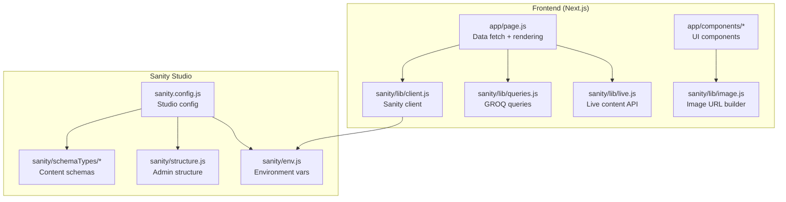
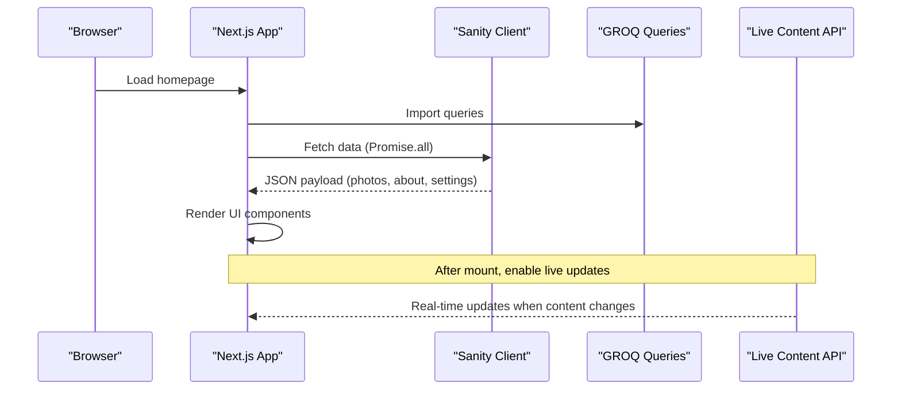
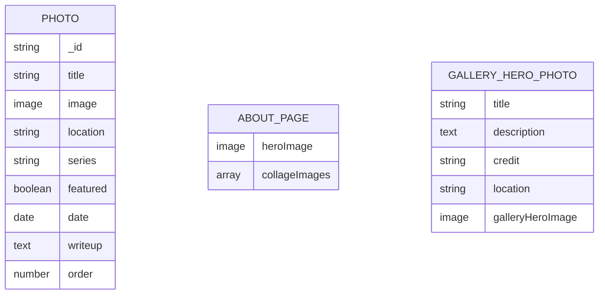
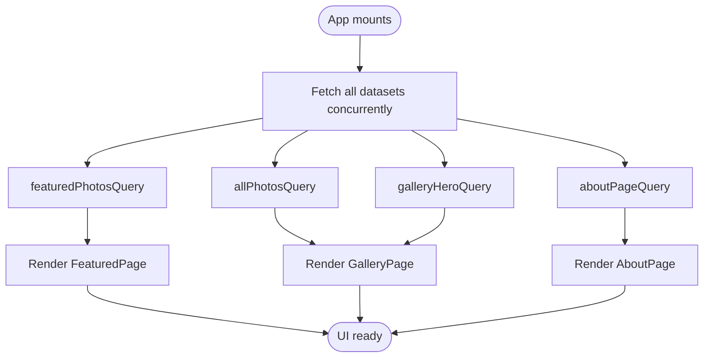
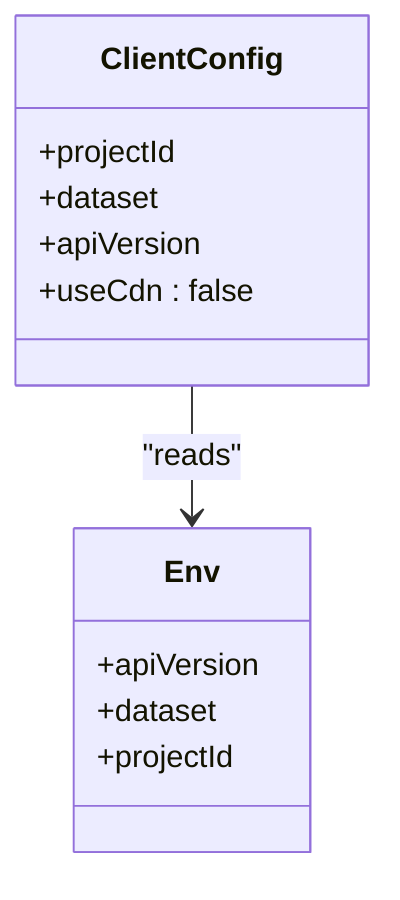
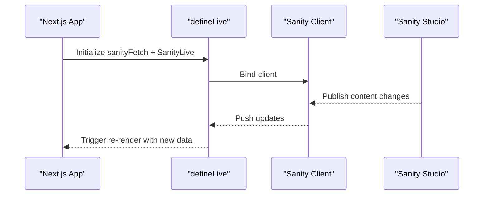
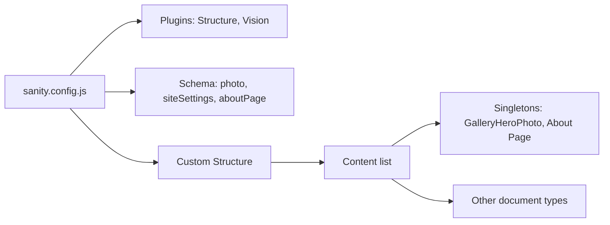
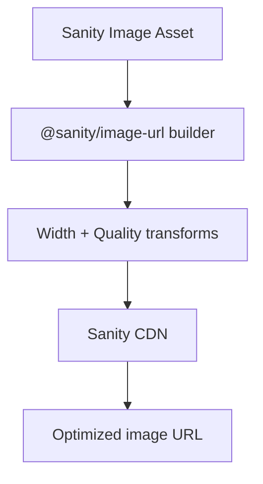
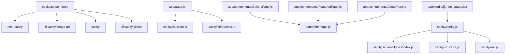

# CMS Integration Architecture

<cite>
**Referenced Files in This Document**
- [sanity.config.js](file://sanity.config.js)
- [sanity/lib/client.js](file://sanity/lib/client.js)
- [sanity/lib/live.js](file://sanity/lib/live.js)
- [sanity/lib/image.js](file://sanity/lib/image.js)
- [sanity/lib/queries.js](file://sanity/lib/queries.js)
- [sanity/env.js](file://sanity/env.js)
- [sanity/schemaTypes/index.js](file://sanity/schemaTypes/index.js)
- [sanity/schemaTypes/photo.js](file://sanity/schemaTypes/photo.js)
- [sanity/schemaTypes/aboutPage.js](file://sanity/schemaTypes/aboutPage.js)
- [sanity/schemaTypes/siteSettings.js](file://sanity/schemaTypes/siteSettings.js)
- [sanity/structure.js](file://sanity/structure.js)
- [app/studio/[[...tool]]/page.jsx](file://app/studio/[[...tool]]/page.jsx)
- [app/page.js](file://app/page.js)
- [app/components/GalleryPage.js](file://app/components/GalleryPage.js)
- [app/components/FeaturedPage.js](file://app/components/FeaturedPage.js)
- [app/components/AboutPage.js](file://app/components/AboutPage.js)
- [package.json](file://package.json)
</cite>

## Table of Contents
1. [Introduction](#introduction)
2. [Project Structure](#project-structure)
3. [Core Components](#core-components)
4. [Architecture Overview](#architecture-overview)
5. [Detailed Component Analysis](#detailed-component-analysis)
6. [Dependency Analysis](#dependency-analysis)
7. [Performance Considerations](#performance-considerations)
8. [Troubleshooting Guide](#troubleshooting-guide)
9. [Conclusion](#conclusion)

## Introduction
This document describes the CMS integration architecture for a Sanity.io headless CMS implementation powering a photography portfolio website. It explains the content modeling approach, documents schemas for photos, about pages, and site settings, and details the GROQ query system and data fetching patterns. It also covers the Sanity client configuration, authentication setup, real-time collaboration features, live preview functionality, content studio customization, admin interface configuration, image processing pipeline, CDN integration, deployment strategy for content changes and preview environments, and content validation and data integrity measures.

## Project Structure
The project follows a clear separation between the Next.js frontend and the Sanity CMS configuration:
- Frontend (Next.js app): Pages and components fetch content via the Sanity client and render interactive galleries and pages.
- Sanity configuration: Defines the studio, schemas, structure, environment variables, and client configuration.

**Diagram sources**
- [sanity.config.js:1-29](file://sanity.config.js#L1-L29)
- [sanity/lib/client.js:1-10](file://sanity/lib/client.js#L1-L10)
- [sanity/lib/queries.js:1-33](file://sanity/lib/queries.js#L1-L33)
- [sanity/lib/image.js:1-9](file://sanity/lib/image.js#L1-L9)
- [sanity/lib/live.js:1-10](file://sanity/lib/live.js#L1-L10)
- [sanity/schemaTypes/index.js:1-8](file://sanity/schemaTypes/index.js#L1-L8)
- [sanity/structure.js:1-25](file://sanity/structure.js#L1-L25)
- [sanity/env.js:1-6](file://sanity/env.js#L1-L6)
- [app/page.js:1-227](file://app/page.js#L1-L227)

**Section sources**
- [sanity.config.js:1-29](file://sanity.config.js#L1-L29)
- [sanity/lib/client.js:1-10](file://sanity/lib/client.js#L1-L10)
- [sanity/lib/queries.js:1-33](file://sanity/lib/queries.js#L1-L33)
- [sanity/lib/image.js:1-9](file://sanity/lib/image.js#L1-L9)
- [sanity/lib/live.js:1-10](file://sanity/lib/live.js#L1-L10)
- [sanity/schemaTypes/index.js:1-8](file://sanity/schemaTypes/index.js#L1-L8)
- [sanity/structure.js:1-25](file://sanity/structure.js#L1-L25)
- [sanity/env.js:1-6](file://sanity/env.js#L1-L6)
- [app/page.js:1-227](file://app/page.js#L1-L227)

## Core Components
- Sanity client: Configured with project ID, dataset, API version, and CDN disabled for fresh data.
- GROQ queries: Centralized in a single module exporting reusable queries for featured photos, all photos, gallery hero, and about page.
- Image processing: Uses @sanity/image-url to generate optimized URLs with width and quality transformations.
- Live content: Enables real-time updates via next-sanity live content API.
- Studio configuration: Defines base path, plugins (Structure, Vision), schema, and structure overrides.

**Section sources**
- [sanity/lib/client.js:1-10](file://sanity/lib/client.js#L1-L10)
- [sanity/lib/queries.js:1-33](file://sanity/lib/queries.js#L1-L33)
- [sanity/lib/image.js:1-9](file://sanity/lib/image.js#L1-L9)
- [sanity/lib/live.js:1-10](file://sanity/lib/live.js#L1-L10)
- [sanity.config.js:1-29](file://sanity.config.js#L1-L29)

## Architecture Overview
The frontend performs initial data fetching on the client, then leverages live content updates for real-time collaboration. The studio provides a custom structure and Vision plugin for content authoring and GROQ testing.

**Diagram sources**
- [app/page.js:106-131](file://app/page.js#L106-L131)
- [sanity/lib/client.js:4-9](file://sanity/lib/client.js#L4-L9)
- [sanity/lib/queries.js:3-32](file://sanity/lib/queries.js#L3-L32)
- [sanity/lib/live.js:7-9](file://sanity/lib/live.js#L7-L9)

## Detailed Component Analysis

### Content Modeling and Schemas
The content model defines three primary document types:
- Photo: Core media asset with metadata, categorization, ordering, and optional write-up.
- About Page: Structured page content with hero image and a small image collage.
- Site Settings (Gallery Hero): Singleton-like document for gallery hero content and metadata.

**Diagram sources**
- [sanity/schemaTypes/photo.js:1-93](file://sanity/schemaTypes/photo.js#L1-L93)
- [sanity/schemaTypes/aboutPage.js:1-27](file://sanity/schemaTypes/aboutPage.js#L1-L27)
- [sanity/schemaTypes/siteSettings.js:1-48](file://sanity/schemaTypes/siteSettings.js#L1-L48)

**Section sources**
- [sanity/schemaTypes/photo.js:1-93](file://sanity/schemaTypes/photo.js#L1-L93)
- [sanity/schemaTypes/aboutPage.js:1-27](file://sanity/schemaTypes/aboutPage.js#L1-L27)
- [sanity/schemaTypes/siteSettings.js:1-48](file://sanity/schemaTypes/siteSettings.js#L1-L48)

### GROQ Query System and Data Fetching Patterns
The application centralizes GROQ queries for reuse and predictable data shaping. Queries target specific document types, apply filters, and select only necessary fields for efficient rendering.

**Diagram sources**
- [app/page.js:106-131](file://app/page.js#L106-L131)
- [sanity/lib/queries.js:3-32](file://sanity/lib/queries.js#L3-L32)

**Section sources**
- [sanity/lib/queries.js:1-33](file://sanity/lib/queries.js#L1-L33)
- [app/page.js:106-131](file://app/page.js#L106-L131)

### Sanity Client Configuration and Authentication Setup
The Sanity client is configured with project ID, dataset, API version, and CDN disabled for immediate content freshness. Environment variables are loaded from the environment module.

**Diagram sources**
- [sanity/lib/client.js:4-9](file://sanity/lib/client.js#L4-L9)
- [sanity/env.js:1-6](file://sanity/env.js#L1-L6)

**Section sources**
- [sanity/lib/client.js:1-10](file://sanity/lib/client.js#L1-L10)
- [sanity/env.js:1-6](file://sanity/env.js#L1-L6)

### Real-time Collaboration and Live Preview
Real-time collaboration is enabled using the next-sanity live content API. The defineLive wrapper binds the Sanity client to the live content system, allowing components to subscribe to content changes.

**Diagram sources**
- [sanity/lib/live.js:7-9](file://sanity/lib/live.js#L7-L9)
- [sanity/lib/client.js:4-9](file://sanity/lib/client.js#L4-L9)

**Section sources**
- [sanity/lib/live.js:1-10](file://sanity/lib/live.js#L1-L10)
- [sanity/lib/client.js:1-10](file://sanity/lib/client.js#L1-L10)

### Content Studio Customization and Admin Interface
The studio is configured with a custom structure that prioritizes key singleton documents and organizes other content types. The Vision plugin enables GROQ querying directly in the studio.

**Diagram sources**
- [sanity.config.js:16-28](file://sanity.config.js#L16-L28)
- [sanity/structure.js:2-24](file://sanity/structure.js#L2-L24)
- [sanity/schemaTypes/index.js:5-7](file://sanity/schemaTypes/index.js#L5-L7)

**Section sources**
- [sanity.config.js:1-29](file://sanity.config.js#L1-L29)
- [sanity/structure.js:1-25](file://sanity/structure.js#L1-L25)
- [sanity/schemaTypes/index.js:1-8](file://sanity/schemaTypes/index.js#L1-L8)

### Image Processing Pipeline and CDN Integration
Images are processed using @sanity/image-url with width and quality transformations. The pipeline generates optimized URLs for different contexts (hero, masonry, lightbox).

**Diagram sources**
- [sanity/lib/image.js:6-8](file://sanity/lib/image.js#L6-L8)
- [app/components/GalleryPage.js:250](file://app/components/GalleryPage.js#L250)
- [app/components/GalleryPage.js:386](file://app/components/GalleryPage.js#L386)
- [app/components/GalleryPage.js:488](file://app/components/GalleryPage.js#L488)
- [app/components/GalleryPage.js:575](file://app/components/GalleryPage.js#L575)
- [app/components/GalleryPage.js:652](file://app/components/GalleryPage.js#L652)
- [app/components/FeaturedPage.js:136](file://app/components/FeaturedPage.js#L136)
- [app/components/AboutPage.js:178](file://app/components/AboutPage.js#L178)

**Section sources**
- [sanity/lib/image.js:1-9](file://sanity/lib/image.js#L1-L9)
- [app/components/GalleryPage.js:1-760](file://app/components/GalleryPage.js#L1-L760)
- [app/components/FeaturedPage.js:1-269](file://app/components/FeaturedPage.js#L1-L269)
- [app/components/AboutPage.js:1-458](file://app/components/AboutPage.js#L1-L458)

### Deployment Strategy for Content Changes and Preview Environments
- API versioning: The studio and client share the same API version, ensuring compatibility across environments.
- Environment variables: Project ID, dataset, and API version are sourced from environment variables for different deployments.
- CDN behavior: The client disables CDN to guarantee fresh content during development and production preview builds.

**Section sources**
- [sanity.config.js:12-14](file://sanity.config.js#L12-L14)
- [sanity/env.js:1-6](file://sanity/env.js#L1-L6)
- [sanity/lib/client.js:8](file://sanity/lib/client.js#L8)

### Content Validation and Data Integrity Measures
- Required fields: Titles, images, and series are validated as required in the photo schema.
- Controlled lists: Series uses a predefined list to maintain consistency.
- Optional fields: Other fields like location, date, and write-up are optional to support flexible content creation.
- Ordering controls: Manual ordering and date-based ordering are supported to manage presentation.

**Section sources**
- [sanity/schemaTypes/photo.js:10](file://sanity/schemaTypes/photo.js#L10)
- [sanity/schemaTypes/photo.js:17](file://sanity/schemaTypes/photo.js#L17)
- [sanity/schemaTypes/photo.js:28](file://sanity/schemaTypes/photo.js#L28)
- [sanity/schemaTypes/photo.js:64-75](file://sanity/schemaTypes/photo.js#L64-L75)

## Dependency Analysis
The frontend depends on the Sanity client and query library, while the studio depends on the schema and structure modules. The image processing library bridges Sanity assets to optimized URLs.

**Diagram sources**
- [package.json:11-21](file://package.json#L11-L21)
- [app/page.js:3-4](file://app/page.js#L3-L4)
- [sanity/lib/client.js:1](file://sanity/lib/client.js#L1)
- [sanity/lib/queries.js:1](file://sanity/lib/queries.js#L1)
- [sanity/lib/image.js:1](file://sanity/lib/image.js#L1)
- [app/studio/[[...tool]]/page.jsx:3-4](file://app/studio/[[...tool]]/page.jsx#L3-L4)
- [sanity.config.js:16-28](file://sanity.config.js#L16-L28)
- [sanity/schemaTypes/index.js:5-7](file://sanity/schemaTypes/index.js#L5-L7)
- [sanity/structure.js:2-24](file://sanity/structure.js#L2-L24)
- [sanity/env.js:1-6](file://sanity/env.js#L1-L6)

**Section sources**
- [package.json:1-31](file://package.json#L1-L31)
- [app/page.js:1-227](file://app/page.js#L1-L227)
- [app/studio/[[...tool]]/page.jsx:1-9](file://app/studio/[[...tool]]/page.jsx#L1-L9)
- [sanity.config.js:1-29](file://sanity.config.js#L1-L29)
- [sanity/schemaTypes/index.js:1-8](file://sanity/schemaTypes/index.js#L1-L8)
- [sanity/structure.js:1-25](file://sanity/structure.js#L1-L25)
- [sanity/env.js:1-6](file://sanity/env.js#L1-L6)

## Performance Considerations
- Fresh data policy: The client disables CDN to avoid stale content, which is appropriate for real-time collaboration but may increase latency compared to cached CDN responses.
- Concurrent fetching: The homepage fetches multiple datasets concurrently to minimize load time.
- Selective projections: Queries limit returned fields to reduce payload sizes.
- Image optimization: Width and quality transformations are applied per component context to balance fidelity and performance.

[No sources needed since this section provides general guidance]

## Troubleshooting Guide
- Authentication and environment: Ensure project ID, dataset, and API version are correctly set in environment variables.
- Client configuration: Verify the client is initialized with the correct project ID, dataset, and API version.
- Live content: Confirm the live content API is initialized and that the layout renders the SanityLive component for real-time updates.
- Studio access: Validate studio base path and plugin configuration.

**Section sources**
- [sanity/env.js:1-6](file://sanity/env.js#L1-L6)
- [sanity/lib/client.js:4-9](file://sanity/lib/client.js#L4-L9)
- [sanity/lib/live.js:7-9](file://sanity/lib/live.js#L7-L9)
- [sanity.config.js:17-27](file://sanity.config.js#L17-L27)

## Conclusion
This Sanity.io headless CMS integration delivers a robust, real-time content management solution for a photography portfolio. The content model emphasizes structured media assets, curated page content, and configurable gallery hero settings. GROQ queries and the Sanity client provide efficient data fetching, while the image processing pipeline ensures optimal delivery. The studio customization streamlines content authoring, and the live content API enables real-time collaboration. With proper environment configuration and validation rules, the system maintains data integrity and supports scalable deployment across preview and production environments.