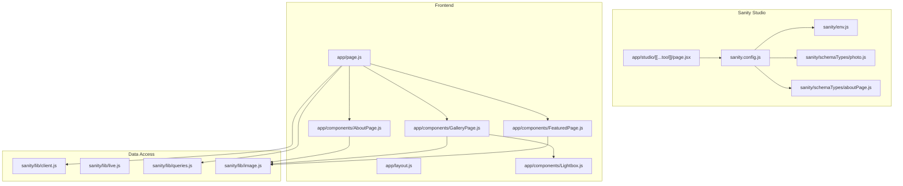
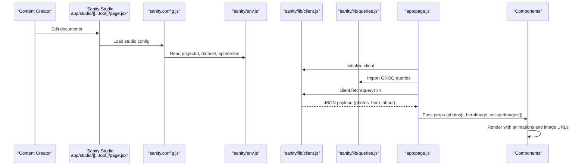
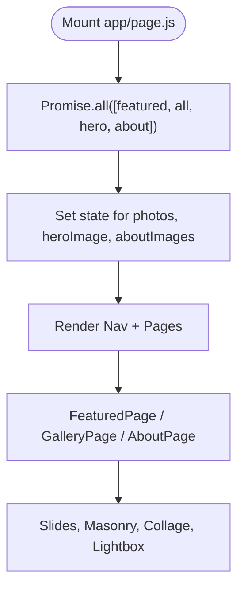
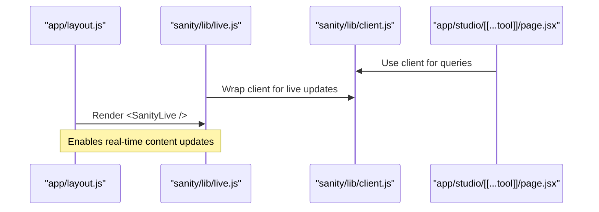
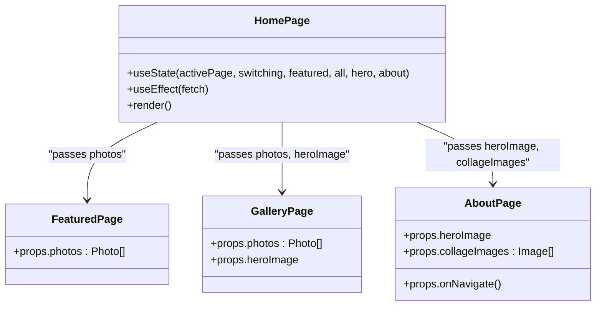
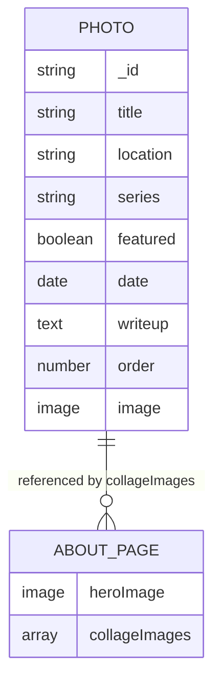
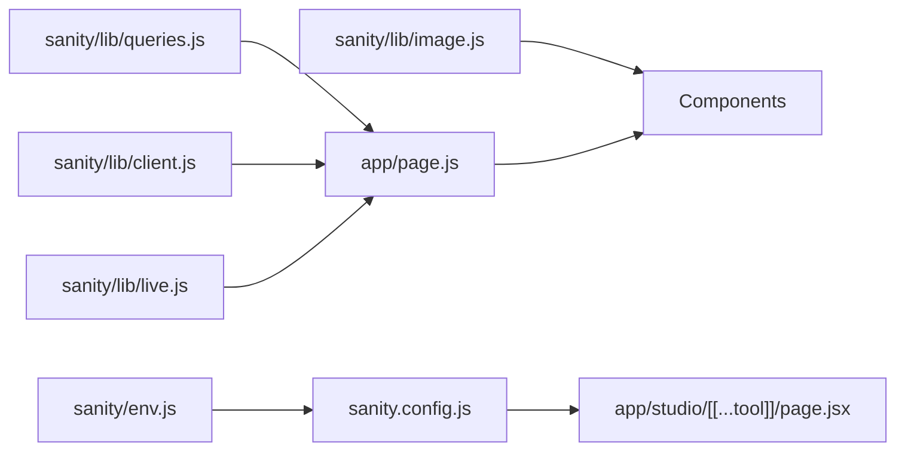

# Data Flow Patterns

<cite>
**Referenced Files in This Document**
- [sanity/lib/client.js](file://sanity/lib/client.js)
- [sanity/lib/live.js](file://sanity/lib/live.js)
- [sanity/lib/queries.js](file://sanity/lib/queries.js)
- [sanity/lib/image.js](file://sanity/lib/image.js)
- [sanity/env.js](file://sanity/env.js)
- [sanity.config.js](file://sanity.config.js)
- [app/studio/[[...tool]]/page.jsx](file://app/studio/[[...tool]]/page.jsx)
- [app/page.js](file://app/page.js)
- [app/layout.js](file://app/layout.js)
- [app/components/FeaturedPage.js](file://app/components/FeaturedPage.js)
- [app/components/GalleryPage.js](file://app/components/GalleryPage.js)
- [app/components/AboutPage.js](file://app/components/AboutPage.js)
- [app/components/Lightbox.js](file://app/components/Lightbox.js)
- [sanity/schemaTypes/photo.js](file://sanity/schemaTypes/photo.js)
- [sanity/schemaTypes/aboutPage.js](file://sanity/schemaTypes/aboutPage.js)
</cite>

## Table of Contents
1. [Introduction](#introduction)
2. [Project Structure](#project-structure)
3. [Core Components](#core-components)
4. [Architecture Overview](#architecture-overview)
5. [Detailed Component Analysis](#detailed-component-analysis)
6. [Dependency Analysis](#dependency-analysis)
7. [Performance Considerations](#performance-considerations)
8. [Troubleshooting Guide](#troubleshooting-guide)
9. [Conclusion](#conclusion)

## Introduction
This document explains the content-driven development pattern implemented in the project. It traces the data flow from Sanity Studio content creation, through GROQ queries, to React component rendering. It covers real-time synchronization via Sanity’s live mode, state management and data-fetching strategies, caching and performance characteristics, the relationship between content schemas and component props, error handling and fallbacks, and content validation and transformation.

## Project Structure
The project follows a clear separation of concerns:
- Sanity Studio and content model live under sanity/.
- Frontend pages and components live under app/.
- Data access utilities and queries live under sanity/lib/.
- Content schemas define the data model under sanity/schemaTypes/.

**Diagram sources**
- [app/studio/[[...tool]]/page.jsx:1-9](file://app/studio/[[...tool]]/page.jsx#L1-L9)
- [sanity.config.js:1-29](file://sanity.config.js#L1-L29)
- [sanity/env.js:1-6](file://sanity/env.js#L1-L6)
- [sanity/schemaTypes/photo.js:1-93](file://sanity/schemaTypes/photo.js#L1-L93)
- [sanity/schemaTypes/aboutPage.js:1-27](file://sanity/schemaTypes/aboutPage.js#L1-L27)
- [app/layout.js:1-40](file://app/layout.js#L1-L40)
- [app/page.js:1-227](file://app/page.js#L1-L227)
- [app/components/FeaturedPage.js:1-269](file://app/components/FeaturedPage.js#L1-L269)
- [app/components/GalleryPage.js:1-760](file://app/components/GalleryPage.js#L1-L760)
- [app/components/AboutPage.js:1-458](file://app/components/AboutPage.js#L1-L458)
- [app/components/Lightbox.js](file://app/components/Lightbox.js)
- [sanity/lib/client.js:1-10](file://sanity/lib/client.js#L1-L10)
- [sanity/lib/live.js:1-10](file://sanity/lib/live.js#L1-L10)
- [sanity/lib/queries.js:1-33](file://sanity/lib/queries.js#L1-L33)
- [sanity/lib/image.js:1-9](file://sanity/lib/image.js#L1-L9)

**Section sources**
- [sanity.config.js:1-29](file://sanity.config.js#L1-L29)
- [app/studio/[[...tool]]/page.jsx:1-9](file://app/studio/[[...tool]]/page.jsx#L1-L9)
- [sanity/env.js:1-6](file://sanity/env.js#L1-L6)
- [sanity/schemaTypes/photo.js:1-93](file://sanity/schemaTypes/photo.js#L1-L93)
- [sanity/schemaTypes/aboutPage.js:1-27](file://sanity/schemaTypes/aboutPage.js#L1-L27)
- [app/layout.js:1-40](file://app/layout.js#L1-L40)
- [app/page.js:1-227](file://app/page.js#L1-L227)
- [sanity/lib/client.js:1-10](file://sanity/lib/client.js#L1-L10)
- [sanity/lib/live.js:1-10](file://sanity/lib/live.js#L1-L10)
- [sanity/lib/queries.js:1-33](file://sanity/lib/queries.js#L1-L33)
- [sanity/lib/image.js:1-9](file://sanity/lib/image.js#L1-L9)

## Core Components
- Sanity client: configured to use a specific API version and dataset, with CDN disabled to ensure fresh data.
- Live mode: enables automatic content updates during development and preview.
- GROQ queries: define the content shape returned to the frontend for featured photos, all photos, gallery hero, and about page.
- Image URL builder: transforms Sanity image assets into optimized URLs.
- Frontend pages and components: fetch data on mount, manage local state, and render content with animations and responsive layouts.

Key implementation references:
- Client initialization and API version/dataset usage
- Live mode export for real-time updates
- GROQ queries for photo collections and page content
- Image URL builder for asset transformations
- Data fetching in the home page and component consumption

**Section sources**
- [sanity/lib/client.js:1-10](file://sanity/lib/client.js#L1-L10)
- [sanity/lib/live.js:1-10](file://sanity/lib/live.js#L1-L10)
- [sanity/lib/queries.js:1-33](file://sanity/lib/queries.js#L1-L33)
- [sanity/lib/image.js:1-9](file://sanity/lib/image.js#L1-L9)
- [app/page.js:106-131](file://app/page.js#L106-L131)
- [app/components/FeaturedPage.js:6](file://app/components/FeaturedPage.js#L6)
- [app/components/GalleryPage.js:6](file://app/components/GalleryPage.js#L6)
- [app/components/AboutPage.js:5](file://app/components/AboutPage.js#L5)

## Architecture Overview
The data flow is content-first: content creators update documents in Sanity Studio; the frontend queries content via GROQ; the app renders components with transformed image URLs and animated transitions.

**Diagram sources**
- [app/studio/[[...tool]]/page.jsx:1-9](file://app/studio/[[...tool]]/page.jsx#L1-L9)
- [sanity.config.js:1-29](file://sanity.config.js#L1-L29)
- [sanity/env.js:1-6](file://sanity/env.js#L1-L6)
- [sanity/lib/client.js:1-10](file://sanity/lib/client.js#L1-L10)
- [sanity/lib/queries.js:1-33](file://sanity/lib/queries.js#L1-L33)
- [app/page.js:106-131](file://app/page.js#L106-L131)
- [app/components/FeaturedPage.js:1-269](file://app/components/FeaturedPage.js#L1-L269)
- [app/components/GalleryPage.js:1-760](file://app/components/GalleryPage.js#L1-L760)
- [app/components/AboutPage.js:1-458](file://app/components/AboutPage.js#L1-L458)

## Detailed Component Analysis

### Data Fetching Pipeline
The home page coordinates fetching four datasets concurrently, then normalizes them into component-ready props.

**Diagram sources**
- [app/page.js:106-131](file://app/page.js#L106-L131)

**Section sources**
- [app/page.js:106-131](file://app/page.js#L106-L131)

### Real-Time Updates and Preview Modes
Live mode is enabled via the live utility, which wraps the client and exposes a fetch variant and a component to render live updates. The studio page mounts the Studio with the configured Sanity config.

**Diagram sources**
- [app/layout.js:1-40](file://app/layout.js#L1-L40)
- [sanity/lib/live.js:1-10](file://sanity/lib/live.js#L1-L10)
- [sanity/lib/client.js:1-10](file://sanity/lib/client.js#L1-L10)
- [app/studio/[[...tool]]/page.jsx:1-9](file://app/studio/[[...tool]]/page.jsx#L1-L9)

**Section sources**
- [sanity/lib/live.js:1-10](file://sanity/lib/live.js#L1-L10)
- [app/studio/[[...tool]]/page.jsx:1-9](file://app/studio/[[...tool]]/page.jsx#L1-L9)
- [app/layout.js:1-40](file://app/layout.js#L1-L40)

### State Management and Component Prop Shapes
- Home page maintains local state for active page, switching flag, and normalized content arrays.
- Components receive props aligned to their schema expectations:
  - FeaturedPage expects an array of photos with image asset and metadata.
  - GalleryPage expects photos and a hero image.
  - AboutPage expects heroImage and collageImages array.

**Diagram sources**
- [app/page.js:14-227](file://app/page.js#L14-L227)
- [app/components/FeaturedPage.js:6](file://app/components/FeaturedPage.js#L6)
- [app/components/GalleryPage.js:6](file://app/components/GalleryPage.js#L6)
- [app/components/AboutPage.js:5](file://app/components/AboutPage.js#L5)

**Section sources**
- [app/page.js:14-227](file://app/page.js#L14-L227)
- [app/components/FeaturedPage.js:6](file://app/components/FeaturedPage.js#L6)
- [app/components/GalleryPage.js:6](file://app/components/GalleryPage.js#L6)
- [app/components/AboutPage.js:5](file://app/components/AboutPage.js#L5)

### Content Validation and Transformation
- Content schemas enforce required fields and options:
  - Photo schema validates title and image, defines series list, and orders.
  - About page schema defines hero image and up to three collage images.
- Image transformation:
  - urlFor builds optimized image URLs from Sanity assets.

**Diagram sources**
- [sanity/schemaTypes/photo.js:1-93](file://sanity/schemaTypes/photo.js#L1-L93)
- [sanity/schemaTypes/aboutPage.js:1-27](file://sanity/schemaTypes/aboutPage.js#L1-L27)
- [sanity/lib/image.js:1-9](file://sanity/lib/image.js#L1-L9)

**Section sources**
- [sanity/schemaTypes/photo.js:1-93](file://sanity/schemaTypes/photo.js#L1-L93)
- [sanity/schemaTypes/aboutPage.js:1-27](file://sanity/schemaTypes/aboutPage.js#L1-L27)
- [sanity/lib/image.js:1-9](file://sanity/lib/image.js#L1-L9)

### GROQ Queries and Data Shape
- featuredPhotosQuery: returns featured photos ordered by manual order and date.
- allPhotosQuery: returns all photos ordered similarly.
- galleryHeroQuery: returns a single hero image record.
- aboutPageQuery: returns hero and collage images for the About page.

These queries define the exact shape consumed by components, ensuring predictable prop structures.

**Section sources**
- [sanity/lib/queries.js:1-33](file://sanity/lib/queries.js#L1-L33)

### Image Rendering and Asset Optimization
- Components use urlFor to build responsive, optimized image URLs from Sanity assets.
- Gallery and About components pass image props to img tags and background styles.

**Section sources**
- [app/components/FeaturedPage.js:136](file://app/components/FeaturedPage.js#L136)
- [app/components/GalleryPage.js:250](file://app/components/GalleryPage.js#L250)
- [app/components/AboutPage.js:177](file://app/components/AboutPage.js#L177)

### Lightbox and Navigation
- GalleryPage opens a Lightbox with the selected photo and list.
- Lightbox animates transitions and supports keyboard navigation.

**Section sources**
- [app/components/GalleryPage.js:17-37](file://app/components/GalleryPage.js#L17-L37)
- [app/components/Lightbox.js](file://app/components/Lightbox.js)

## Dependency Analysis
The frontend depends on:
- Sanity client and live utilities for data access.
- GROQ queries for content shape.
- Image URL builder for asset transformation.
- Studio configuration for content modeling and Vision plugin.

**Diagram sources**
- [sanity/lib/queries.js:1-33](file://sanity/lib/queries.js#L1-L33)
- [sanity/lib/client.js:1-10](file://sanity/lib/client.js#L1-L10)
- [sanity/lib/live.js:1-10](file://sanity/lib/live.js#L1-L10)
- [sanity/lib/image.js:1-9](file://sanity/lib/image.js#L1-L9)
- [app/page.js:1-227](file://app/page.js#L1-L227)
- [sanity.config.js:1-29](file://sanity.config.js#L1-L29)
- [app/studio/[[...tool]]/page.jsx:1-9](file://app/studio/[[...tool]]/page.jsx#L1-L9)
- [sanity/env.js:1-6](file://sanity/env.js#L1-L6)

**Section sources**
- [sanity/lib/queries.js:1-33](file://sanity/lib/queries.js#L1-L33)
- [sanity/lib/client.js:1-10](file://sanity/lib/client.js#L1-L10)
- [sanity/lib/live.js:1-10](file://sanity/lib/live.js#L1-L10)
- [sanity/lib/image.js:1-9](file://sanity/lib/image.js#L1-L9)
- [app/page.js:1-227](file://app/page.js#L1-L227)
- [sanity.config.js:1-29](file://sanity.config.js#L1-L29)
- [app/studio/[[...tool]]/page.jsx:1-9](file://app/studio/[[...tool]]/page.jsx#L1-L9)
- [sanity/env.js:1-6](file://sanity/env.js#L1-L6)

## Performance Considerations
- Freshness vs. caching: The client disables CDN to guarantee fresh content, which is appropriate for a content-driven site prioritizing accuracy over latency.
- Concurrent fetching: The home page fetches multiple datasets in parallel to minimize load time.
- Client-side transformations: Image URLs are built per-render, enabling on-the-fly optimization; consider memoization or server-side transformations for heavy traffic.
- Animations: Extensive GSAP animations occur after initial content load; ensure they do not block first paint by deferring heavy initialization until after hydration.

[No sources needed since this section provides general guidance]

## Troubleshooting Guide
Common issues and strategies:
- Empty or missing content:
  - FeaturedPage falls back to a message when photos are empty.
  - GalleryPage and AboutPage rely on optional hero/collage images; ensure schema allows nulls and provide fallbacks.
- Data shape mismatches:
  - Verify GROQ queries match component prop expectations (e.g., image asset presence).
- Live updates not appearing:
  - Confirm the live utility is imported and <SanityLive /> is rendered in the layout.
- Image rendering problems:
  - Ensure urlFor receives a valid asset source and that the dataset/projectId are correctly configured.

**Section sources**
- [app/components/FeaturedPage.js:107-114](file://app/components/FeaturedPage.js#L107-L114)
- [app/page.js:118-125](file://app/page.js#L118-L125)
- [sanity/lib/live.js:1-10](file://sanity/lib/live.js#L1-L10)
- [sanity/lib/image.js:1-9](file://sanity/lib/image.js#L1-L9)

## Conclusion
This project implements a robust content-driven pipeline: Sanity Studio captures structured content, GROQ queries define precise shapes, and React components render optimized experiences. Live mode ensures creators see updates immediately, while the schema enforces validation and ordering. The approach balances flexibility and performance, with clear boundaries between content modeling, data access, and presentation.