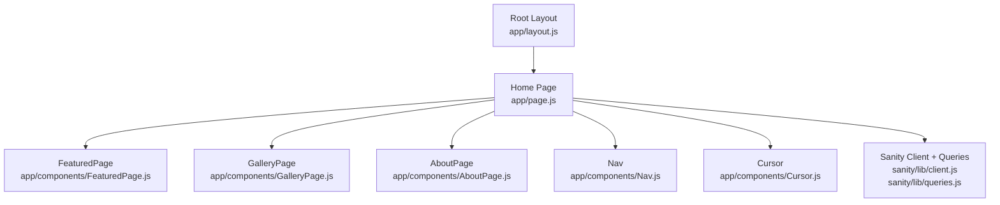
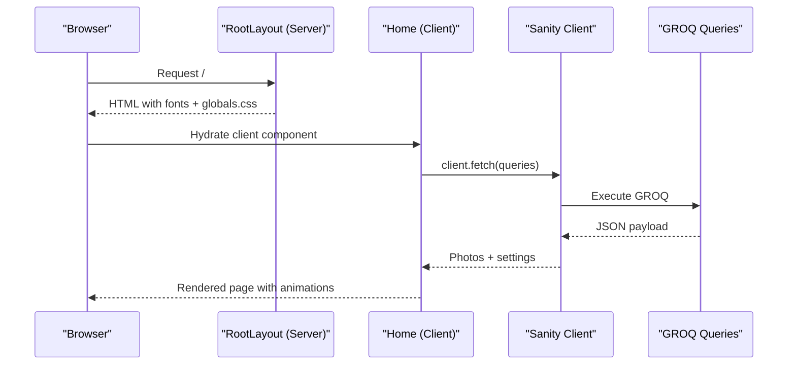
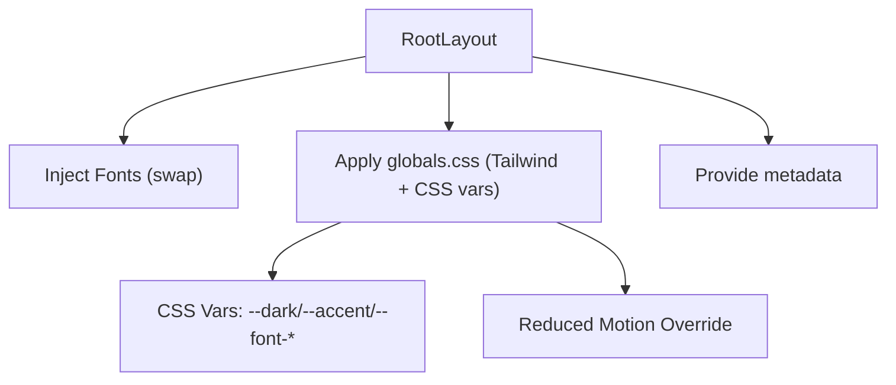
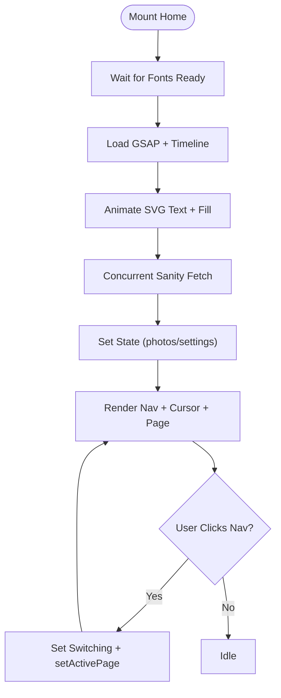
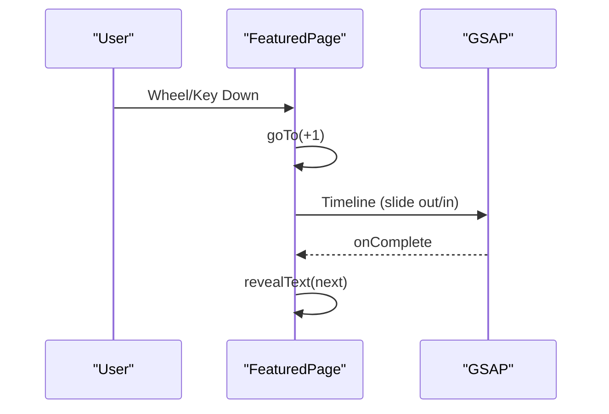
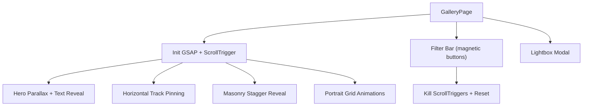
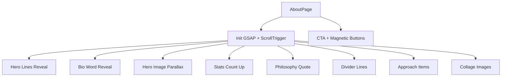
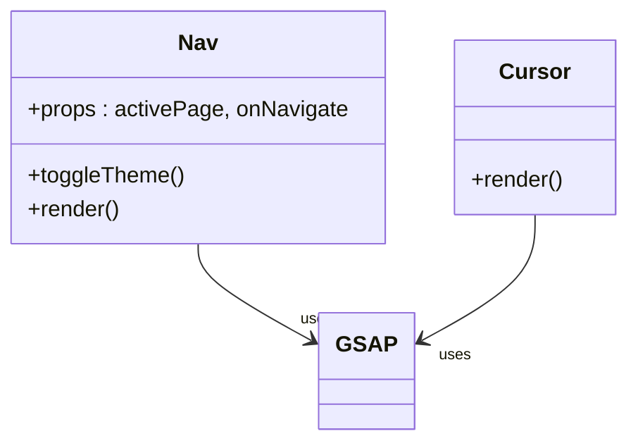
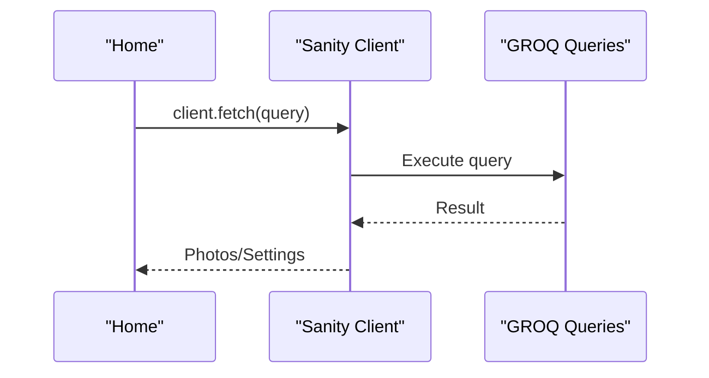
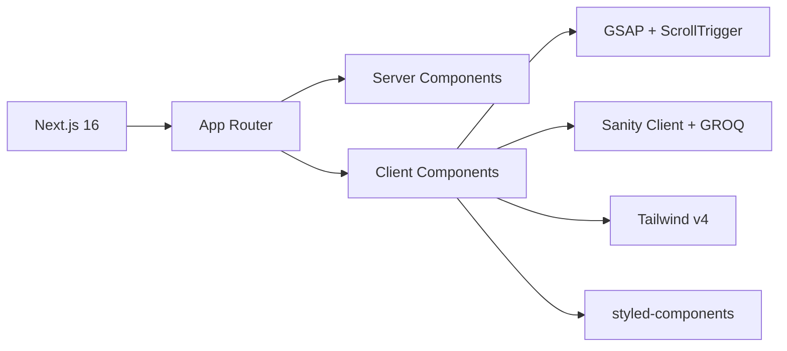

# Frontend Architecture

<cite>
**Referenced Files in This Document**
- [app/layout.js](file://app/layout.js)
- [app/page.js](file://app/page.js)
- [app/globals.css](file://app/globals.css)
- [app/components/Nav.js](file://app/components/Nav.js)
- [app/components/Cursor.js](file://app/components/Cursor.js)
- [app/components/FeaturedPage.js](file://app/components/FeaturedPage.js)
- [app/components/GalleryPage.js](file://app/components/GalleryPage.js)
- [app/components/AboutPage.js](file://app/components/AboutPage.js)
- [sanity/lib/client.js](file://sanity/lib/client.js)
- [sanity/lib/queries.js](file://sanity/lib/queries.js)
- [sanity.config.js](file://sanity.config.js)
- [package.json](file://package.json)
- [next.config.mjs](file://next.config.mjs)
- [postcss.config.mjs](file://postcss.config.mjs)
- [jsconfig.json](file://jsconfig.json)
</cite>

## Table of Contents
1. [Introduction](#introduction)
2. [Project Structure](#project-structure)
3. [Core Components](#core-components)
4. [Architecture Overview](#architecture-overview)
5. [Detailed Component Analysis](#detailed-component-analysis)
6. [Dependency Analysis](#dependency-analysis)
7. [Performance Considerations](#performance-considerations)
8. [Troubleshooting Guide](#troubleshooting-guide)
9. [Conclusion](#conclusion)
10. [Appendices](#appendices)

## Introduction
This document describes the frontend architecture of a Next.js App Router-based photography portfolio. It explains the component hierarchy from the root layout down to page components and reusable UI elements, details the integration of Next.js 16 App Router with server and client components, and documents the styling architecture using CSS custom properties, Tailwind CSS v4, and styled-components. It also covers the font loading system with Google Fonts integration, global state management and component communication patterns, responsive design and mobile-first strategy, asset management, and build/bundling configuration for performance.

## Project Structure
The frontend follows Next.js App Router conventions with a single root layout and three pages: Home, Studio, and a fallback. The Home page composes three page-specific components: Featured, Gallery, and About. Reusable UI elements include navigation, cursor effects, and a lightbox modal. Content is fetched from Sanity CMS via strongly typed GROQ queries.

**Diagram sources**
- [app/layout.js:1-40](file://app/layout.js#L1-L40)
- [app/page.js:1-227](file://app/page.js#L1-L227)
- [app/components/FeaturedPage.js:1-269](file://app/components/FeaturedPage.js#L1-L269)
- [app/components/GalleryPage.js:1-760](file://app/components/GalleryPage.js#L1-L760)
- [app/components/AboutPage.js:1-458](file://app/components/AboutPage.js#L1-L458)
- [app/components/Nav.js:1-168](file://app/components/Nav.js#L1-L168)
- [app/components/Cursor.js:1-42](file://app/components/Cursor.js#L1-L42)
- [sanity/lib/client.js:1-10](file://sanity/lib/client.js#L1-L10)
- [sanity/lib/queries.js:1-33](file://sanity/lib/queries.js#L1-L33)

**Section sources**
- [app/layout.js:1-40](file://app/layout.js#L1-L40)
- [app/page.js:1-227](file://app/page.js#L1-L227)
- [sanity/lib/client.js:1-10](file://sanity/lib/client.js#L1-L10)
- [sanity/lib/queries.js:1-33](file://sanity/lib/queries.js#L1-L33)

## Core Components
- Root layout: Defines metadata, font loading via next/font/google, and applies CSS custom properties to the document root. It wraps all pages with a single HTML shell.
- Home page: Orchestrates navigation, data fetching, intro animation, and page transitions. It conditionally renders page components and manages global UI elements.
- Page components:
  - FeaturedPage: Fullscreen hero carousel with animated text reveals and subtle parallax.
  - GalleryPage: Multi-section gallery with filters, horizontal scrolling, masonry layouts, and a lightbox.
  - AboutPage: Scroll-driven narrative with animated typography, stats, and interactive collage.
- Shared UI:
  - Nav: Animated top bar with theme toggle and navigation actions.
  - Cursor: Smooth mouse-following cursor and ring with blend-mode effects.
- Sanity integration: Client initialization and GROQ queries for featured photos, gallery hero, and about page assets.

**Section sources**
- [app/layout.js:26-39](file://app/layout.js#L26-L39)
- [app/page.js:14-227](file://app/page.js#L14-L227)
- [app/components/FeaturedPage.js:1-269](file://app/components/FeaturedPage.js#L1-L269)
- [app/components/GalleryPage.js:1-760](file://app/components/GalleryPage.js#L1-L760)
- [app/components/AboutPage.js:1-458](file://app/components/AboutPage.js#L1-L458)
- [app/components/Nav.js:1-168](file://app/components/Nav.js#L1-L168)
- [app/components/Cursor.js:1-42](file://app/components/Cursor.js#L1-L42)
- [sanity/lib/client.js:4-9](file://sanity/lib/client.js#L4-L9)
- [sanity/lib/queries.js:3-32](file://sanity/lib/queries.js#L3-L32)

## Architecture Overview
The architecture is a hybrid of server-rendered layout and client-rendered page components. The root layout is a server component that injects fonts and global styles. The Home page is a client component that:
- Loads fonts with font-display swap
- Fetches data concurrently from Sanity
- Drives animations with GSAP
- Manages navigation and page transitions
- Renders page-specific components

**Diagram sources**
- [app/layout.js:31-39](file://app/layout.js#L31-L39)
- [app/page.js:106-131](file://app/page.js#L106-L131)
- [sanity/lib/client.js:4-9](file://sanity/lib/client.js#L4-L9)
- [sanity/lib/queries.js:3-32](file://sanity/lib/queries.js#L3-L32)

## Detailed Component Analysis

### Root Layout and Global Styles
- Font loading: Three Google Fonts are preloaded with next/font/google and configured for font-display swap and CSS variable injection.
- Global CSS: Tailwind v4 is imported; CSS custom properties define a dark/light theme palette and font families. A reduced-motion override disables page transitions when requested.
- Metadata: Title and description are set at the root level.

**Diagram sources**
- [app/layout.js:4-24](file://app/layout.js#L4-L24)
- [app/layout.js:31-39](file://app/layout.js#L31-L39)
- [app/globals.css:5-28](file://app/globals.css#L5-L28)
- [app/globals.css:81-83](file://app/globals.css#L81-L83)

**Section sources**
- [app/layout.js:1-40](file://app/layout.js#L1-L40)
- [app/globals.css:1-93](file://app/globals.css#L1-L93)

### Home Page Orchestration
- Client component with dynamic imports for page components to defer rendering until hydration.
- State management: active page, switching flag, data loading, intro state, and page-entered state.
- Intro animation: Uses GSAP to animate SVG text drawn with stroke-dasharray and fill transitions, waiting for fonts to load.
- Data fetching: Concurrently loads featured photos, all photos, gallery hero, and about page assets.
- Navigation: Switches pages with a transition delay and guards against rapid toggles.
- Rendering: Conditionally shows intro screen, then renders Nav and Cursor, followed by the selected page component.

**Diagram sources**
- [app/page.js:31-101](file://app/page.js#L31-L101)
- [app/page.js:106-131](file://app/page.js#L106-L131)
- [app/page.js:136-145](file://app/page.js#L136-L145)
- [app/page.js:195-226](file://app/page.js#L195-L226)

**Section sources**
- [app/page.js:1-227](file://app/page.js#L1-L227)

### Featured Page Carousel
- Client component with GSAP-driven animations.
- Keyboard and wheel navigation with debouncing.
- Per-slide text reveals with staggered timelines.
- Transition animations include vertical movement, image scaling/rotation, and counter scrubbing.
- Image optimization via Sanity image URL builder with width and quality parameters.

**Diagram sources**
- [app/components/FeaturedPage.js:56-105](file://app/components/FeaturedPage.js#L56-L105)
- [app/components/FeaturedPage.js:36-54](file://app/components/FeaturedPage.js#L36-L54)

**Section sources**
- [app/components/FeaturedPage.js:1-269](file://app/components/FeaturedPage.js#L1-L269)

### Gallery Page Sections and Lightbox
- Client component with ScrollTrigger-powered scroll animations.
- Horizontal scrolling track with pinned behavior and card tilts.
- Masonry and portrait grids with hover overlays and scaling.
- Filter bar with magnetic buttons and dynamic reinitialization of ScrollTrigger on filter change.
- Lightbox modal for full-screen viewing with navigation controls.

**Diagram sources**
- [app/components/GalleryPage.js:51-220](file://app/components/GalleryPage.js#L51-L220)
- [app/components/GalleryPage.js:316-332](file://app/components/GalleryPage.js#L316-L332)
- [app/components/GalleryPage.js:17-37](file://app/components/GalleryPage.js#L17-L37)

**Section sources**
- [app/components/GalleryPage.js:1-760](file://app/components/GalleryPage.js#L1-L760)

### About Page Scroll-Driven Narrative
- Client component with ScrollTrigger-driven animations.
- Hero title split into lines, bio words revealed, and image parallax.
- Stats counting up, philosophy quote reveal, divider lines, approach items, and collage images.
- CTA with magnetic buttons and navigation to gallery.

**Diagram sources**
- [app/components/AboutPage.js:11-162](file://app/components/AboutPage.js#L11-L162)
- [app/components/AboutPage.js:164-174](file://app/components/AboutPage.js#L164-L174)

**Section sources**
- [app/components/AboutPage.js:1-458](file://app/components/AboutPage.js#L1-L458)

### Navigation and Cursor
- Nav: Animated top bar with GSAP, auto-hide on mouseleave, and theme toggle persisted in localStorage.
- Cursor: Smoothly tracks mouse with two layered elements (cursor + ring) using GSAP transforms.

**Diagram sources**
- [app/components/Nav.js:4-83](file://app/components/Nav.js#L4-L83)
- [app/components/Cursor.js:5-21](file://app/components/Cursor.js#L5-L21)

**Section sources**
- [app/components/Nav.js:1-168](file://app/components/Nav.js#L1-L168)
- [app/components/Cursor.js:1-42](file://app/components/Cursor.js#L1-L42)

### Sanity Integration
- Client: Initializes a typed Sanity client with API version and disables CDN for fresh content.
- Queries: GROQ queries for featured photos, all photos, gallery hero, and about page assets.

**Diagram sources**
- [sanity/lib/client.js:4-9](file://sanity/lib/client.js#L4-L9)
- [sanity/lib/queries.js:3-32](file://sanity/lib/queries.js#L3-L32)

**Section sources**
- [sanity/lib/client.js:1-10](file://sanity/lib/client.js#L1-L10)
- [sanity/lib/queries.js:1-33](file://sanity/lib/queries.js#L1-L33)
- [sanity.config.js:16-28](file://sanity.config.js#L16-L28)

## Dependency Analysis
- Next.js 16: App Router with server and client components, font optimization, and build pipeline.
- GSAP: Core animations and ScrollTrigger for scroll-driven effects.
- Tailwind CSS v4: Utility-first CSS framework integrated via PostCSS plugin.
- styled-components: Used per project dependencies; not observed in current codebase.
- Sanity: Headless CMS with typed client and GROQ queries.

**Diagram sources**
- [package.json:11-21](file://package.json#L11-L21)
- [postcss.config.mjs:1-7](file://postcss.config.mjs#L1-L7)

**Section sources**
- [package.json:11-21](file://package.json#L11-L21)
- [postcss.config.mjs:1-7](file://postcss.config.mjs#L1-L7)

## Performance Considerations
- Font loading: next/font/google with display swap ensures fast text rendering and avoids FOIT/FOUT.
- Client component splitting: Dynamic imports defer heavy page components until hydration.
- Animation performance: GSAP leverages GPU-accelerated properties; ScrollTrigger uses efficient scroll throttling.
- Asset optimization: Sanity image URLs apply width and quality transformations; consider lazy-loading and aspect-ratio utilities for images.
- Build pipeline: Tailwind v4 via PostCSS plugin; ensure purge configuration targets production builds to remove unused CSS.
- Bundle size: Keep client-side libraries scoped; avoid importing large libraries on the server.

[No sources needed since this section provides general guidance]

## Troubleshooting Guide
- Fonts not loading: Verify font variable injection in the root layout and ensure subsets match content.
- Scroll-trigger not working: Confirm ScrollTrigger registration and cleanup on component unmount; ensure container refs are present.
- Data not updating: Sanity client uses no cache; confirm dataset and API version configuration.
- Theme toggle not persisting: Check localStorage availability and data-theme attribute updates.
- Lightbox not opening: Ensure lightbox state is initialized and list/photo arrays are populated.

**Section sources**
- [app/layout.js:4-24](file://app/layout.js#L4-L24)
- [app/components/GalleryPage.js:51-220](file://app/components/GalleryPage.js#L51-L220)
- [sanity/lib/client.js:4-9](file://sanity/lib/client.js#L4-L9)
- [app/components/Nav.js:70-83](file://app/components/Nav.js#L70-L83)

## Conclusion
The frontend architecture combines Next.js App Router with server-rendered layout and client-rendered page components to deliver a visually rich photography portfolio. The design leverages CSS custom properties for themes, Tailwind v4 for utility classes, and GSAP for scroll-driven and micro-interactions. Sanity CMS provides structured content with typed queries. The approach balances performance with immersive experiences, using dynamic imports, font optimization, and efficient animation libraries.

[No sources needed since this section summarizes without analyzing specific files]

## Appendices

### Styling Architecture
- CSS custom properties: Centralized theme tokens and font families in globals.css.
- Tailwind CSS v4: Imported via PostCSS plugin; utilities used alongside custom styles.
- styled-components: Present in dependencies; not currently used in the codebase.

**Section sources**
- [app/globals.css:5-28](file://app/globals.css#L5-L28)
- [postcss.config.mjs:1-7](file://postcss.config.mjs#L1-L7)
- [package.json:21](file://package.json#L21)

### Responsive Design and Mobile-First Strategy
- Mobile-first units: rem/em and clamp() for scalable typography; viewport-aware sizing.
- Reduced-motion support: Disables page transitions when user prefers reduced motion.
- Scroll-driven layouts: Use of ScrollTrigger for adaptive experiences across devices.

**Section sources**
- [app/globals.css:81-83](file://app/globals.css#L81-L83)
- [app/components/GalleryPage.js:51-220](file://app/components/GalleryPage.js#L51-L220)

### Asset Management
- Static assets: Public fonts directory exists; font loading handled via next/font/google.
- Image optimization: Sanity image URL builder applied with width and quality parameters.

**Section sources**
- [app/components/FeaturedPage.js:136](file://app/components/FeaturedPage.js#L136)
- [app/components/GalleryPage.js:250](file://app/components/GalleryPage.js#L250)
- [app/components/AboutPage.js:177](file://app/components/AboutPage.js#L177)

### Build Configuration and Bundling
- Next.js configuration: Empty default config; rely on App Router defaults.
- PostCSS: Tailwind v4 plugin enabled.
- Path aliases: @/* resolves to project root for imports.

**Section sources**
- [next.config.mjs:1-7](file://next.config.mjs#L1-L7)
- [postcss.config.mjs:1-7](file://postcss.config.mjs#L1-L7)
- [jsconfig.json:1-7](file://jsconfig.json#L1-L7)