# Content Management System

<cite>
**Referenced Files in This Document**
- [sanity.config.js](file://sanity.config.js)
- [sanity/structure.js](file://sanity/structure.js)
- [sanity/env.js](file://sanity/env.js)
- [sanity/schemaTypes/index.js](file://sanity/schemaTypes/index.js)
- [sanity/schemaTypes/photo.js](file://sanity/schemaTypes/photo.js)
- [sanity/schemaTypes/aboutPage.js](file://sanity/schemaTypes/aboutPage.js)
- [sanity/schemaTypes/siteSettings.js](file://sanity/schemaTypes/siteSettings.js)
- [sanity/lib/client.js](file://sanity/lib/client.js)
- [sanity/lib/queries.js](file://sanity/lib/queries.js)
- [sanity/lib/image.js](file://sanity/lib/image.js)
- [app/studio/[[...tool]]/page.jsx](file://app/studio/[[...tool]]/page.jsx)
- [app/components/GalleryPage.js](file://app/components/GalleryPage.js)
- [app/components/FeaturedPage.js](file://app/components/FeaturedPage.js)
- [app/components/AboutPage.js](file://app/components/AboutPage.js)
- [package.json](file://package.json)
</cite>

## Table of Contents
1. [Introduction](#introduction)
2. [Project Structure](#project-structure)
3. [Core Components](#core-components)
4. [Architecture Overview](#architecture-overview)
5. [Detailed Component Analysis](#detailed-component-analysis)
6. [Dependency Analysis](#dependency-analysis)
7. [Performance Considerations](#performance-considerations)
8. [Troubleshooting Guide](#troubleshooting-guide)
9. [Conclusion](#conclusion)
10. [Appendices](#appendices)

## Introduction
This document explains the Sanity CMS integration and content management system powering a photography portfolio website. It covers the studio interface navigation, content modeling, GROQ query patterns, client configuration, image processing pipeline, and how content flows from the CMS into the frontend. It also documents authoring workflows, validation rules, and the relationship between schemas and frontend rendering.

## Project Structure
The project is a Next.js application with a mounted Sanity Studio at a dedicated route. Content is modeled in Sanity via typed schemas, queried with GROQ, and rendered by React components.

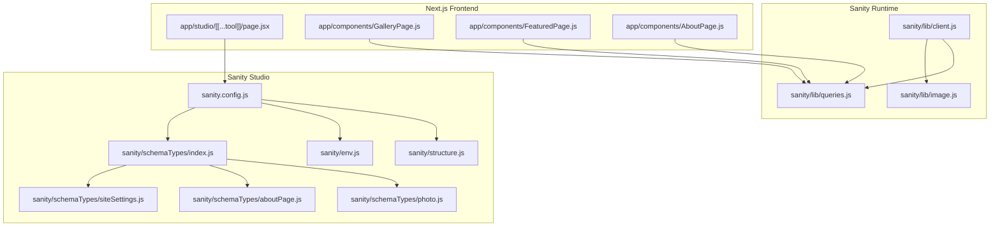

**Diagram sources**
- [sanity.config.js:1-29](file://sanity.config.js#L1-L29)
- [sanity/structure.js:1-25](file://sanity/structure.js#L1-L25)
- [sanity/env.js:1-6](file://sanity/env.js#L1-L6)
- [sanity/schemaTypes/index.js:1-8](file://sanity/schemaTypes/index.js#L1-L8)
- [sanity/schemaTypes/photo.js:1-93](file://sanity/schemaTypes/photo.js#L1-L93)
- [sanity/schemaTypes/aboutPage.js:1-27](file://sanity/schemaTypes/aboutPage.js#L1-L27)
- [sanity/schemaTypes/siteSettings.js:1-48](file://sanity/schemaTypes/siteSettings.js#L1-L48)
- [sanity/lib/client.js:1-10](file://sanity/lib/client.js#L1-L10)
- [sanity/lib/queries.js:1-33](file://sanity/lib/queries.js#L1-L33)
- [sanity/lib/image.js](file://sanity/lib/image.js)
- [app/studio/[[...tool]]/page.jsx:1-9](file://app/studio/[[...tool]]/page.jsx#L1-L9)
- [app/components/GalleryPage.js:1-760](file://app/components/GalleryPage.js#L1-L760)
- [app/components/FeaturedPage.js:1-269](file://app/components/FeaturedPage.js#L1-L269)
- [app/components/AboutPage.js:1-458](file://app/components/AboutPage.js#L1-L458)

**Section sources**
- [sanity.config.js:1-29](file://sanity.config.js#L1-L29)
- [sanity/structure.js:1-25](file://sanity/structure.js#L1-L25)
- [sanity/env.js:1-6](file://sanity/env.js#L1-L6)
- [sanity/schemaTypes/index.js:1-8](file://sanity/schemaTypes/index.js#L1-L8)
- [sanity/schemaTypes/photo.js:1-93](file://sanity/schemaTypes/photo.js#L1-L93)
- [sanity/schemaTypes/aboutPage.js:1-27](file://sanity/schemaTypes/aboutPage.js#L1-L27)
- [sanity/schemaTypes/siteSettings.js:1-48](file://sanity/schemaTypes/siteSettings.js#L1-L48)
- [sanity/lib/client.js:1-10](file://sanity/lib/client.js#L1-L10)
- [sanity/lib/queries.js:1-33](file://sanity/lib/queries.js#L1-L33)
- [sanity/lib/image.js](file://sanity/lib/image.js)
- [app/studio/[[...tool]]/page.jsx:1-9](file://app/studio/[[...tool]]/page.jsx#L1-L9)
- [app/components/GalleryPage.js:1-760](file://app/components/GalleryPage.js#L1-L760)
- [app/components/FeaturedPage.js:1-269](file://app/components/FeaturedPage.js#L1-L269)
- [app/components/AboutPage.js:1-458](file://app/components/AboutPage.js#L1-L458)
- [package.json:1-31](file://package.json#L1-L31)

## Core Components
- Sanity Studio configuration defines the studio base path, schema, and plugins.
- Content schemas define the data model for photos, about page, and gallery hero settings.
- Queries encapsulate GROQ patterns for fetching content.
- Client configuration connects to the Sanity dataset and API version.
- Frontend components render content and apply image transformations.

**Section sources**
- [sanity.config.js:16-28](file://sanity.config.js#L16-L28)
- [sanity/schemaTypes/index.js:5-7](file://sanity/schemaTypes/index.js#L5-L7)
- [sanity/lib/queries.js:3-32](file://sanity/lib/queries.js#L3-L32)
- [sanity/lib/client.js:4-9](file://sanity/lib/client.js#L4-L9)
- [app/studio/[[...tool]]/page.jsx:3-8](file://app/studio/[[...tool]]/page.jsx#L3-L8)

## Architecture Overview
The system follows a clean separation of concerns:
- Studio: Authoring and content modeling.
- Client runtime: Fetches content via GROQ and transforms images.
- Frontend: Renders pages using fetched data and image URLs.

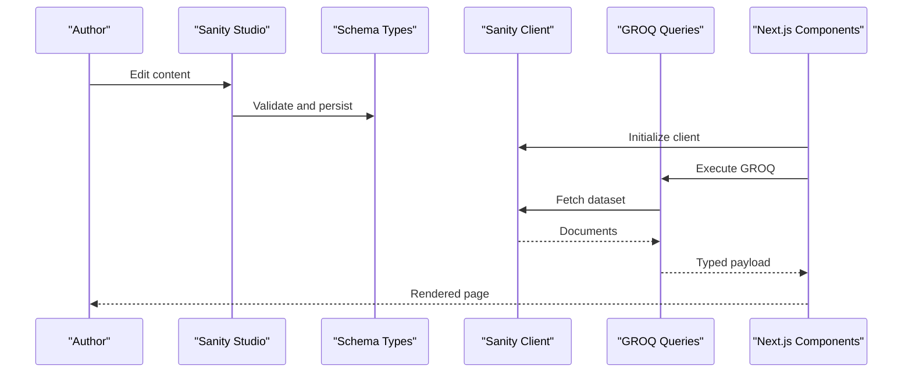

**Diagram sources**
- [sanity.config.js:16-28](file://sanity.config.js#L16-L28)
- [sanity/schemaTypes/photo.js:1-93](file://sanity/schemaTypes/photo.js#L1-L93)
- [sanity/schemaTypes/aboutPage.js:1-27](file://sanity/schemaTypes/aboutPage.js#L1-L27)
- [sanity/schemaTypes/siteSettings.js:1-48](file://sanity/schemaTypes/siteSettings.js#L1-L48)
- [sanity/lib/client.js:4-9](file://sanity/lib/client.js#L4-L9)
- [sanity/lib/queries.js:3-32](file://sanity/lib/queries.js#L3-L32)
- [app/components/GalleryPage.js:1-760](file://app/components/GalleryPage.js#L1-L760)
- [app/components/FeaturedPage.js:1-269](file://app/components/FeaturedPage.js#L1-L269)
- [app/components/AboutPage.js:1-458](file://app/components/AboutPage.js#L1-L458)

## Detailed Component Analysis

### Sanity Studio Configuration
- Defines studio base path and plugin registration.
- Imports schema and structure definitions.
- Uses environment variables for API version, dataset, and project ID.

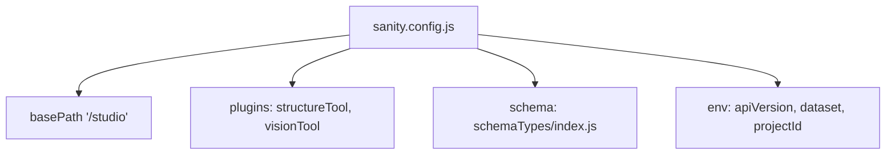

**Diagram sources**
- [sanity.config.js:16-28](file://sanity.config.js#L16-L28)
- [sanity/env.js:1-6](file://sanity/env.js#L1-L6)
- [sanity/schemaTypes/index.js:5-7](file://sanity/schemaTypes/index.js#L5-L7)

**Section sources**
- [sanity.config.js:16-28](file://sanity.config.js#L16-L28)
- [sanity/env.js:1-6](file://sanity/env.js#L1-L6)

### Content Modeling

#### Photo Document
- Fields: title, image (with hotspot), location, series, featured, date, writeup, order.
- Validation: required fields enforced via validation rules.
- Options: predefined series list and hotspot editing for images.
- Ordering: manual order and newest-first ordering.
- Preview: composite preview combining title, location, series, featured flag, and media.

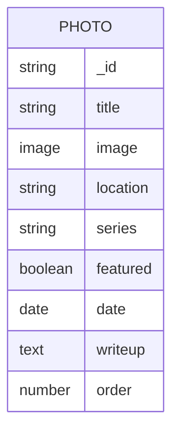

**Diagram sources**
- [sanity/schemaTypes/photo.js:5-63](file://sanity/schemaTypes/photo.js#L5-L63)

**Section sources**
- [sanity/schemaTypes/photo.js:1-93](file://sanity/schemaTypes/photo.js#L1-L93)

#### About Page
- Fields: heroImage (image with hotspot), collageImages (array of images with hotspots).
- Preview: simple title-only preview.

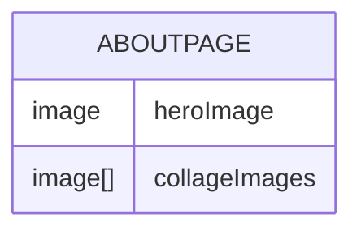

**Diagram sources**
- [sanity/schemaTypes/aboutPage.js:5-20](file://sanity/schemaTypes/aboutPage.js#L5-L20)

**Section sources**
- [sanity/schemaTypes/aboutPage.js:1-27](file://sanity/schemaTypes/aboutPage.js#L1-L27)

#### Site Settings (Gallery Hero)
- Fields: title, description, credit, location, galleryHeroImage (optional image with hotspot).
- Preview: title and media selection.

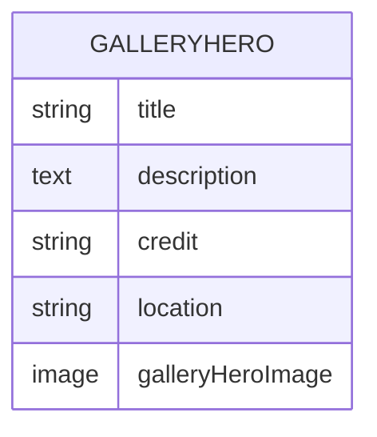

**Diagram sources**
- [sanity/schemaTypes/siteSettings.js:5-34](file://sanity/schemaTypes/siteSettings.js#L5-L34)

**Section sources**
- [sanity/schemaTypes/siteSettings.js:1-48](file://sanity/schemaTypes/siteSettings.js#L1-L48)

### GROQ Queries and Implementation Patterns
- featuredPhotosQuery: fetches featured photos ordered by manual order and date.
- allPhotosQuery: fetches all photos with similar projection.
- galleryHeroQuery: fetches the gallery hero document for hero image and metadata.
- aboutPageQuery: fetches hero image and collage images for the about page.

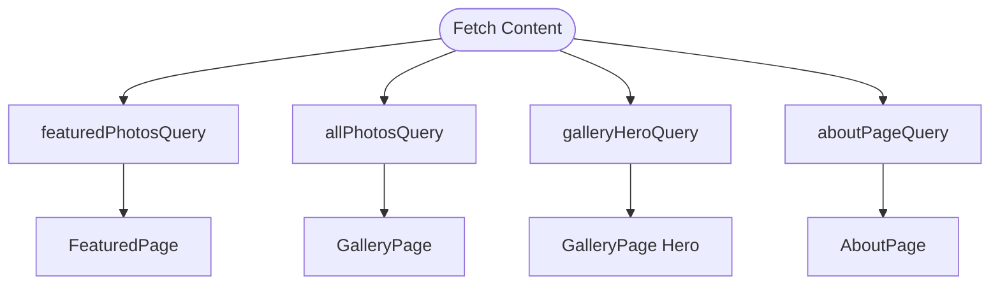

**Diagram sources**
- [sanity/lib/queries.js:3-32](file://sanity/lib/queries.js#L3-L32)
- [app/components/FeaturedPage.js:6](file://app/components/FeaturedPage.js#L6)
- [app/components/GalleryPage.js:6](file://app/components/GalleryPage.js#L6)
- [app/components/AboutPage.js:5](file://app/components/AboutPage.js#L5)

**Section sources**
- [sanity/lib/queries.js:1-33](file://sanity/lib/queries.js#L1-L33)

### Sanity Client Configuration
- Initializes the Sanity client with projectId, dataset, and API version.
- Disables CDN to ensure fresh data during development.

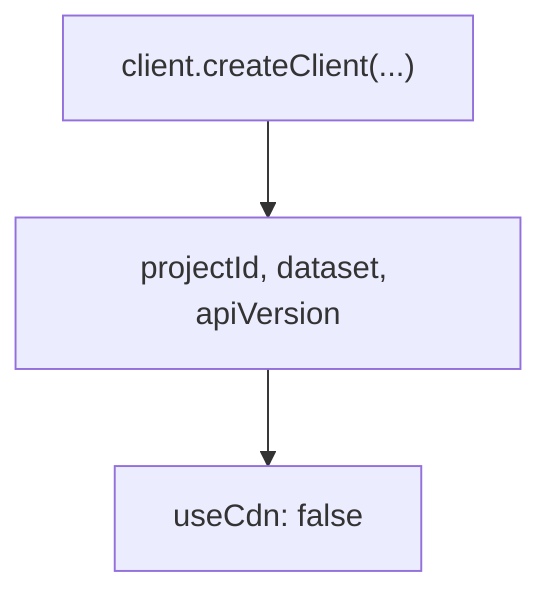

**Diagram sources**
- [sanity/lib/client.js:4-9](file://sanity/lib/client.js#L4-L9)

**Section sources**
- [sanity/lib/client.js:1-10](file://sanity/lib/client.js#L1-L10)

### Image Processing Pipeline and CDN Integration
- urlFor(image) is used to build optimized image URLs.
- Transformations include width and quality adjustments.
- Hotspot support is available via schema options and can be applied in queries.

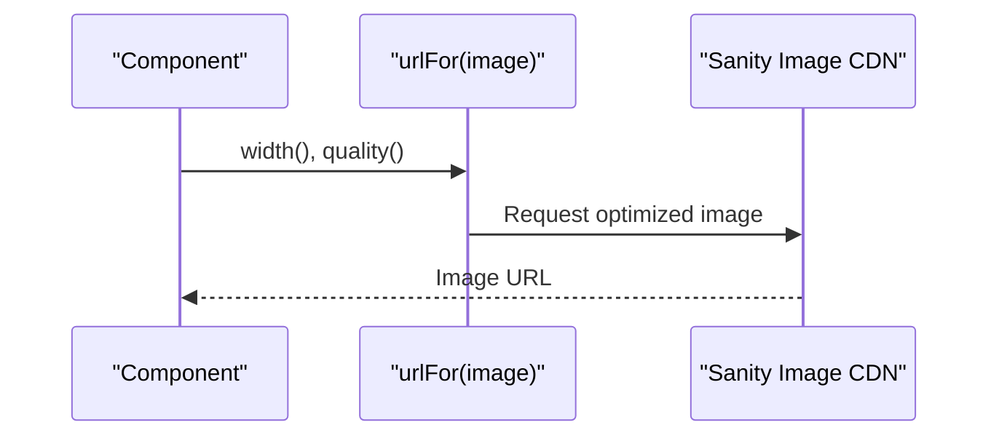

**Diagram sources**
- [app/components/GalleryPage.js:250](file://app/components/GalleryPage.js#L250)
- [app/components/GalleryPage.js:386](file://app/components/GalleryPage.js#L386)
- [app/components/GalleryPage.js:488](file://app/components/GalleryPage.js#L488)
- [app/components/GalleryPage.js:575](file://app/components/GalleryPage.js#L575)
- [app/components/GalleryPage.js:652](file://app/components/GalleryPage.js#L652)
- [app/components/FeaturedPage.js:136](file://app/components/FeaturedPage.js#L136)
- [app/components/AboutPage.js:178](file://app/components/AboutPage.js#L178)
- [sanity/schemaTypes/photo.js:16](file://sanity/schemaTypes/photo.js#L16)
- [sanity/schemaTypes/aboutPage.js:17](file://sanity/schemaTypes/aboutPage.js#L17)
- [sanity/schemaTypes/siteSettings.js:32](file://sanity/schemaTypes/siteSettings.js#L32)

**Section sources**
- [app/components/GalleryPage.js:3](file://app/components/GalleryPage.js#L3)
- [app/components/FeaturedPage.js:4](file://app/components/FeaturedPage.js#L4)
- [app/components/AboutPage.js:3](file://app/components/AboutPage.js#L3)
- [sanity/schemaTypes/photo.js:16](file://sanity/schemaTypes/photo.js#L16)
- [sanity/schemaTypes/aboutPage.js:17](file://sanity/schemaTypes/aboutPage.js#L17)
- [sanity/schemaTypes/siteSettings.js:32](file://sanity/schemaTypes/siteSettings.js#L32)

### Studio Navigation and Structure
- Custom structure groups GalleryHeroPhoto and About Page at the top.
- Filters out these singleton types from the general document list.

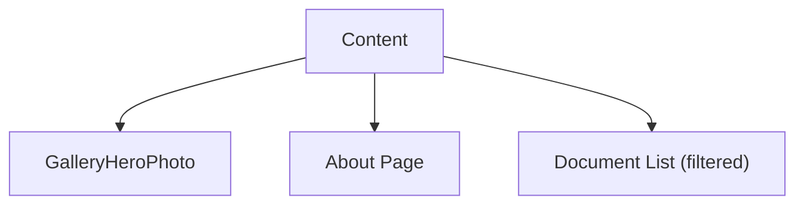

**Diagram sources**
- [sanity/structure.js:2-24](file://sanity/structure.js#L2-L24)

**Section sources**
- [sanity/structure.js:1-25](file://sanity/structure.js#L1-L25)

### Frontend Rendering and Authoring Workflows
- GalleryPage renders filtered photo collections and hero imagery.
- FeaturedPage renders a full-screen slideshow of featured photos.
- AboutPage renders hero imagery, collage, and static content.
- Components consume GROQ queries and apply urlFor transformations.

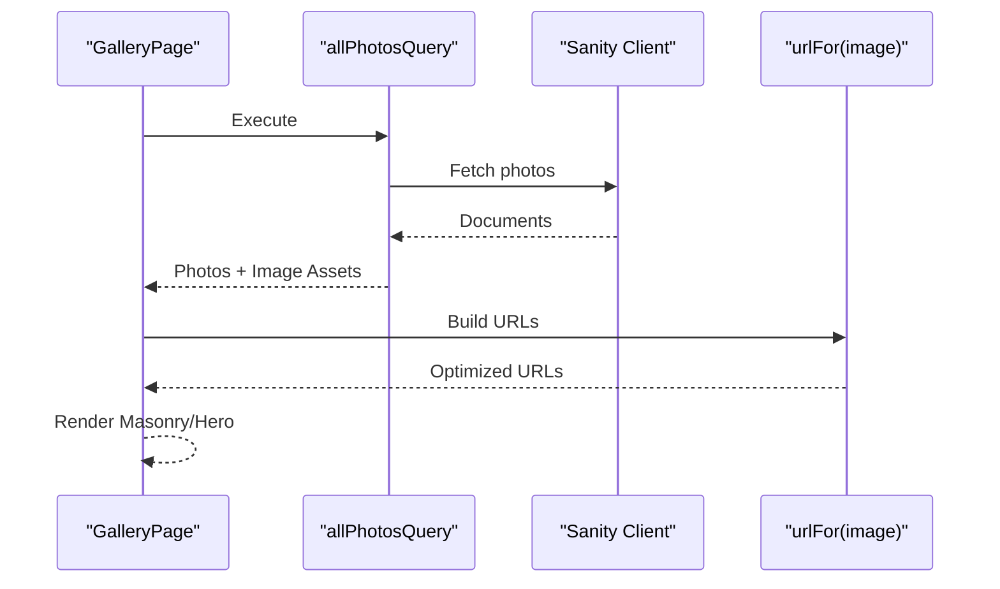

**Diagram sources**
- [app/components/GalleryPage.js:6](file://app/components/GalleryPage.js#L6)
- [sanity/lib/queries.js:10-15](file://sanity/lib/queries.js#L10-L15)
- [sanity/lib/client.js:4-9](file://sanity/lib/client.js#L4-L9)

**Section sources**
- [app/components/GalleryPage.js:1-760](file://app/components/GalleryPage.js#L1-L760)
- [app/components/FeaturedPage.js:1-269](file://app/components/FeaturedPage.js#L1-L269)
- [app/components/AboutPage.js:1-458](file://app/components/AboutPage.js#L1-L458)
- [sanity/lib/queries.js:3-32](file://sanity/lib/queries.js#L3-L32)

## Dependency Analysis
- Studio depends on schema types and structure.
- Client depends on environment variables and provides typed queries.
- Frontend components depend on client and image helpers.

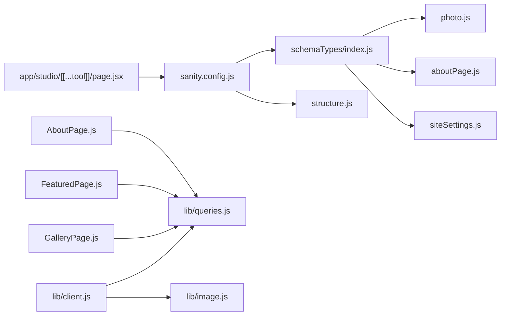

**Diagram sources**
- [sanity.config.js:16-28](file://sanity.config.js#L16-L28)
- [sanity/schemaTypes/index.js:5-7](file://sanity/schemaTypes/index.js#L5-L7)
- [sanity/lib/client.js:4-9](file://sanity/lib/client.js#L4-L9)
- [sanity/lib/queries.js:3-32](file://sanity/lib/queries.js#L3-L32)
- [sanity/lib/image.js](file://sanity/lib/image.js)
- [app/studio/[[...tool]]/page.jsx:3-8](file://app/studio/[[...tool]]/page.jsx#L3-L8)
- [app/components/GalleryPage.js:1-760](file://app/components/GalleryPage.js#L1-L760)
- [app/components/FeaturedPage.js:1-269](file://app/components/FeaturedPage.js#L1-L269)
- [app/components/AboutPage.js:1-458](file://app/components/AboutPage.js#L1-L458)

**Section sources**
- [sanity.config.js:16-28](file://sanity.config.js#L16-L28)
- [sanity/schemaTypes/index.js:5-7](file://sanity/schemaTypes/index.js#L5-L7)
- [sanity/lib/client.js:4-9](file://sanity/lib/client.js#L4-L9)
- [sanity/lib/queries.js:3-32](file://sanity/lib/queries.js#L3-L32)
- [sanity/lib/image.js](file://sanity/lib/image.js)
- [app/studio/[[...tool]]/page.jsx:3-8](file://app/studio/[[...tool]]/page.jsx#L3-L8)
- [app/components/GalleryPage.js:1-760](file://app/components/GalleryPage.js#L1-L760)
- [app/components/FeaturedPage.js:1-269](file://app/components/FeaturedPage.js#L1-L269)
- [app/components/AboutPage.js:1-458](file://app/components/AboutPage.js#L1-L458)

## Performance Considerations
- Fresh data mode: The client disables CDN to avoid stale content during development.
- Image optimization: Components apply width and quality transformations to reduce payload sizes.
- Selective projections: Queries limit returned fields to those needed by components.

Recommendations:
- Enable CDN in production for improved latency.
- Use responsive breakpoints and appropriate widths per component.
- Consider pagination for large photo sets.

**Section sources**
- [sanity/lib/client.js:8](file://sanity/lib/client.js#L8)
- [app/components/GalleryPage.js:250](file://app/components/GalleryPage.js#L250)
- [app/components/GalleryPage.js:386](file://app/components/GalleryPage.js#L386)
- [app/components/GalleryPage.js:488](file://app/components/GalleryPage.js#L488)
- [app/components/GalleryPage.js:575](file://app/components/GalleryPage.js#L575)
- [app/components/GalleryPage.js:652](file://app/components/GalleryPage.js#L652)
- [app/components/FeaturedPage.js:136](file://app/components/FeaturedPage.js#L136)
- [sanity/lib/queries.js:4](file://sanity/lib/queries.js#L4)

## Troubleshooting Guide
- Studio not loading: Verify studio route and config export.
- Missing images: Confirm image assets exist and urlFor is applied.
- Query errors: Ensure GROQ syntax matches schema types and field names.
- Environment variables: Validate projectId, dataset, and API version.

Common checks:
- Studio mount: [app/studio/[[...tool]]/page.jsx:3-8](file://app/studio/[[...tool]]/page.jsx#L3-L8)
- Client initialization: [sanity/lib/client.js:4-9](file://sanity/lib/client.js#L4-L9)
- Queries: [sanity/lib/queries.js:3-32](file://sanity/lib/queries.js#L3-L32)
- Dependencies: [package.json:11-21](file://package.json#L11-L21)

**Section sources**
- [app/studio/[[...tool]]/page.jsx:3-8](file://app/studio/[[...tool]]/page.jsx#L3-L8)
- [sanity/lib/client.js:4-9](file://sanity/lib/client.js#L4-L9)
- [sanity/lib/queries.js:3-32](file://sanity/lib/queries.js#L3-L32)
- [package.json:11-21](file://package.json#L11-L21)

## Conclusion
The Sanity integration provides a structured, validated, and flexible content model for a photography portfolio. With GROQ queries, a typed client, and optimized image delivery, the system supports efficient authoring and high-performance rendering. The schema-driven approach ensures data integrity while enabling rich authoring experiences and dynamic frontend presentations.

## Appendices

### Practical Authoring Tasks
- Create a new photo: Use the Photo schema to add title, image, series, and optional metadata; toggle featured to promote to the slideshow.
- Update About Page: Assign hero image and up to three collage images; use hotspot editing for precise cropping.
- Configure Gallery Hero: Optionally set a dedicated hero image for the gallery; otherwise, the first photo is used.

### Publishing and Validation
- Required fields enforce content completeness.
- Hotspot options improve image cropping and focus.
- Ordering controls presentation flow.

**Section sources**
- [sanity/schemaTypes/photo.js:10-17](file://sanity/schemaTypes/photo.js#L10-L17)
- [sanity/schemaTypes/photo.js:28-36](file://sanity/schemaTypes/photo.js#L28-L36)
- [sanity/schemaTypes/aboutPage.js:10-18](file://sanity/schemaTypes/aboutPage.js#L10-L18)
- [sanity/schemaTypes/siteSettings.js:32](file://sanity/schemaTypes/siteSettings.js#L32)
- [sanity/schemaTypes/photo.js:64-75](file://sanity/schemaTypes/photo.js#L64-L75)