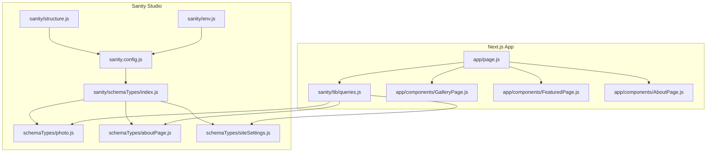
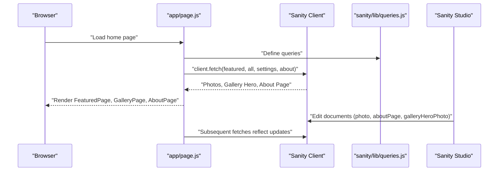
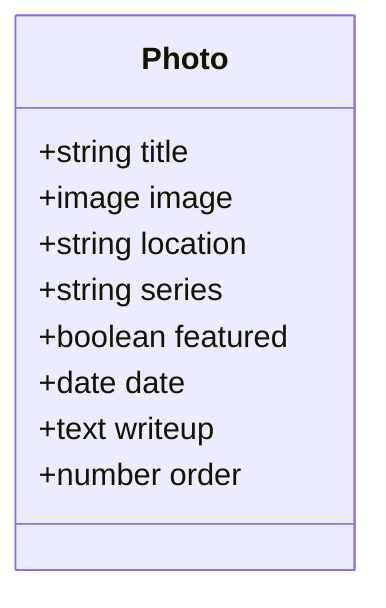
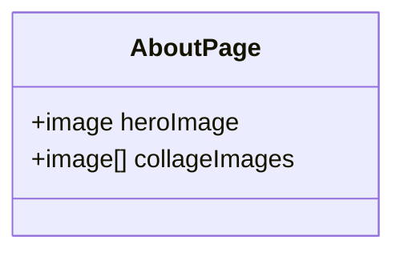
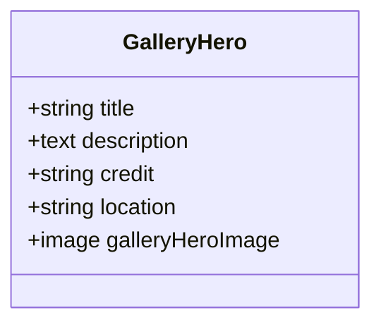
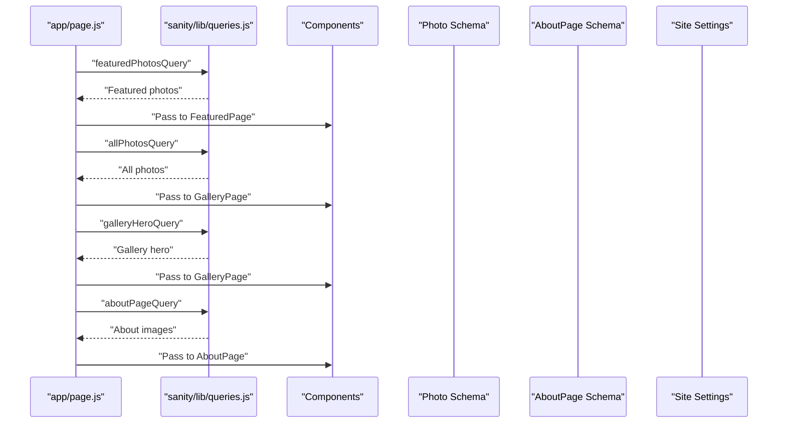
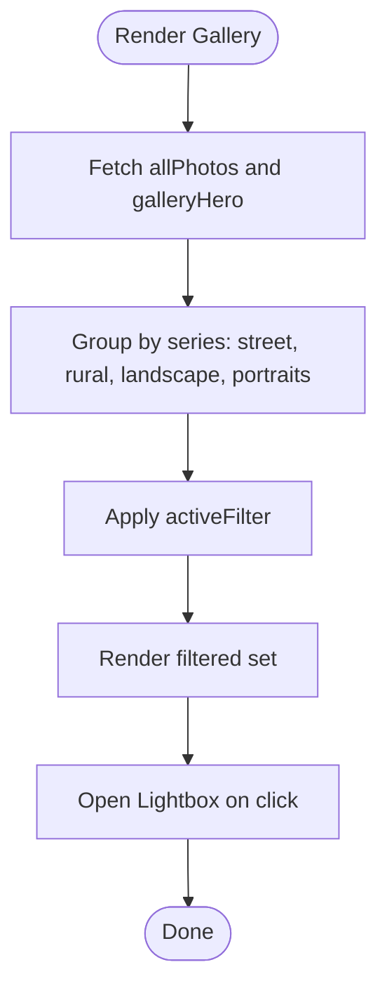
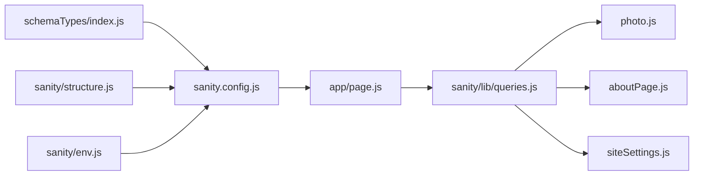

# Content Schemas and Data Models

<cite>
**Referenced Files in This Document**
- [sanity/schemaTypes/photo.js](file://sanity/schemaTypes/photo.js)
- [sanity/schemaTypes/aboutPage.js](file://sanity/schemaTypes/aboutPage.js)
- [sanity/schemaTypes/siteSettings.js](file://sanity/schemaTypes/siteSettings.js)
- [sanity/schemaTypes/index.js](file://sanity/schemaTypes/index.js)
- [sanity.config.js](file://sanity.config.js)
- [sanity/structure.js](file://sanity/structure.js)
- [sanity/env.js](file://sanity/env.js)
- [sanity/lib/queries.js](file://sanity/lib/queries.js)
- [app/page.js](file://app/page.js)
- [app/components/GalleryPage.js](file://app/components/GalleryPage.js)
- [app/components/FeaturedPage.js](file://app/components/FeaturedPage.js)
- [app/components/AboutPage.js](file://app/components/AboutPage.js)
</cite>

## Table of Contents
1. [Introduction](#introduction)
2. [Project Structure](#project-structure)
3. [Core Components](#core-components)
4. [Architecture Overview](#architecture-overview)
5. [Detailed Component Analysis](#detailed-component-analysis)
6. [Dependency Analysis](#dependency-analysis)
7. [Performance Considerations](#performance-considerations)
8. [Troubleshooting Guide](#troubleshooting-guide)
9. [Conclusion](#conclusion)
10. [Appendices](#appendices)

## Introduction
This document describes the content schemas and data models used in the portfolio, focusing on how Sanity CMS defines content types and how the Next.js frontend consumes them. It covers:
- Photo schema with field definitions, validation, ordering, and preview behavior
- About Page schema for hero and collage images
- Site Settings schema for gallery hero configuration
- Field-level validation rules, required/optional specifications, and data types
- Schema relationships and how content types interact
- Practical examples of content creation and field usage
- Schema evolution practices and backward compatibility considerations
- Content modeling best practices and field naming conventions

## Project Structure
The content model is defined in Sanity under the schemaTypes directory and consumed by the Next.js app via GROQ queries. The Studio is mounted at a dedicated route and configured in sanity.config.js.

**Diagram sources**
- [sanity.config.js:1-29](file://sanity.config.js#L1-L29)
- [sanity/structure.js:1-25](file://sanity/structure.js#L1-L25)
- [sanity/env.js:1-6](file://sanity/env.js#L1-L6)
- [sanity/schemaTypes/index.js:1-8](file://sanity/schemaTypes/index.js#L1-L8)
- [sanity/schemaTypes/photo.js:1-93](file://sanity/schemaTypes/photo.js#L1-L93)
- [sanity/schemaTypes/aboutPage.js:1-27](file://sanity/schemaTypes/aboutPage.js#L1-L27)
- [sanity/schemaTypes/siteSettings.js:1-48](file://sanity/schemaTypes/siteSettings.js#L1-L48)
- [sanity/lib/queries.js:1-33](file://sanity/lib/queries.js#L1-L33)
- [app/page.js:1-227](file://app/page.js#L1-L227)
- [app/components/GalleryPage.js:1-760](file://app/components/GalleryPage.js#L1-L760)
- [app/components/FeaturedPage.js:1-269](file://app/components/FeaturedPage.js#L1-L269)
- [app/components/AboutPage.js:1-458](file://app/components/AboutPage.js#L1-L458)

**Section sources**
- [sanity.config.js:1-29](file://sanity.config.js#L1-L29)
- [sanity/schemaTypes/index.js:1-8](file://sanity/schemaTypes/index.js#L1-L8)
- [sanity/structure.js:1-25](file://sanity/structure.js#L1-L25)
- [sanity/env.js:1-6](file://sanity/env.js#L1-L6)

## Core Components
This section documents each content schema with field definitions, validation rules, and usage patterns.

### Photo Schema
- Type: Document
- Fields:
  - title: string, required
  - image: image with hotspot, required
  - location: string, optional
  - series: string with predefined list, required
  - featured: boolean, initial false, optional
  - date: date, optional
  - writeup: text (rows 4), optional
  - order: number, optional
- Ordering:
  - Manual Order (asc by order)
  - Newest First (desc by date)
- Preview:
  - Title includes a star when featured
  - Subtitle shows series and location
  - Media is the image asset

Validation summary:
- Required fields: title, image, series
- Optional fields: location, featured, date, writeup, order

Usage in queries:
- featuredPhotosQuery filters by featured == true and orders by order asc, then date desc
- allPhotosQuery retrieves all photos ordered similarly

Practical example:
- To feature a photo on the homepage slideshow, toggle featured ON and optionally set a numeric order to control display precedence.

**Section sources**
- [sanity/schemaTypes/photo.js:1-93](file://sanity/schemaTypes/photo.js#L1-L93)
- [sanity/lib/queries.js:3-8](file://sanity/lib/queries.js#L3-L8)
- [sanity/lib/queries.js:10-15](file://sanity/lib/queries.js#L10-L15)

### About Page Schema
- Type: Document
- Fields:
  - heroImage: image with hotspot, optional
  - collageImages: array of images with hotspot, up to three items
- Preview:
  - Title is “About Page”

Usage in queries:
- aboutPageQuery returns heroImage and up to three collageImages

Practical example:
- Add up to three images to the collage section; the frontend renders them with fixed heights and margins.

**Section sources**
- [sanity/schemaTypes/aboutPage.js:1-27](file://sanity/schemaTypes/aboutPage.js#L1-L27)
- [sanity/lib/queries.js:27-32](file://sanity/lib/queries.js#L27-L32)
- [app/components/AboutPage.js:181-197](file://app/components/AboutPage.js#L181-L197)

### Site Settings Schema (Gallery Hero)
- Type: Document
- Name: galleryHeroPhoto
- Fields:
  - title: string, optional
  - description: text (rows 3), optional
  - credit: string, optional
  - location: string, optional
  - galleryHeroImage: image with hotspot, optional
- Preview:
  - Title defaults to “GalleryHeroPhoto” if no title
  - Media is the galleryHeroImage

Usage in queries:
- galleryHeroQuery returns the first document and selects title, description, credit, location, and galleryHeroImage

Practical example:
- Set an optional gallery hero image; if omitted, the gallery hero falls back to the first photo.

**Section sources**
- [sanity/schemaTypes/siteSettings.js:1-48](file://sanity/schemaTypes/siteSettings.js#L1-L48)
- [sanity/lib/queries.js:17-25](file://sanity/lib/queries.js#L17-L25)
- [app/components/GalleryPage.js:240-255](file://app/components/GalleryPage.js#L240-L255)

## Architecture Overview
The frontend fetches content using GROQ queries and passes it to page components. The Studio manages content creation and editing.

**Diagram sources**
- [app/page.js:106-131](file://app/page.js#L106-L131)
- [sanity/lib/queries.js:3-32](file://sanity/lib/queries.js#L3-L32)
- [sanity.config.js:16-28](file://sanity.config.js#L16-L28)

## Detailed Component Analysis

### Photo Schema Class Model

**Diagram sources**
- [sanity/schemaTypes/photo.js:5-62](file://sanity/schemaTypes/photo.js#L5-L62)

**Section sources**
- [sanity/schemaTypes/photo.js:1-93](file://sanity/schemaTypes/photo.js#L1-L93)

### About Page Schema Class Model

**Diagram sources**
- [sanity/schemaTypes/aboutPage.js:5-19](file://sanity/schemaTypes/aboutPage.js#L5-L19)

**Section sources**
- [sanity/schemaTypes/aboutPage.js:1-27](file://sanity/schemaTypes/aboutPage.js#L1-L27)

### Site Settings Schema Class Model

**Diagram sources**
- [sanity/schemaTypes/siteSettings.js:5-33](file://sanity/schemaTypes/siteSettings.js#L5-L33)

**Section sources**
- [sanity/schemaTypes/siteSettings.js:1-48](file://sanity/schemaTypes/siteSettings.js#L1-L48)

### Data Flow Between Queries and Components

**Diagram sources**
- [app/page.js:106-131](file://app/page.js#L106-L131)
- [sanity/lib/queries.js:3-32](file://sanity/lib/queries.js#L3-L32)
- [app/components/FeaturedPage.js:6](file://app/components/FeaturedPage.js#L6)
- [app/components/GalleryPage.js:6](file://app/components/GalleryPage.js#L6)
- [app/components/AboutPage.js:5](file://app/components/AboutPage.js#L5)

**Section sources**
- [app/page.js:106-131](file://app/page.js#L106-L131)
- [sanity/lib/queries.js:3-32](file://sanity/lib/queries.js#L3-L32)

### Filtering and Rendering Logic (GalleryPage)

**Diagram sources**
- [app/components/GalleryPage.js:39-49](file://app/components/GalleryPage.js#L39-L49)
- [app/components/GalleryPage.js:21-37](file://app/components/GalleryPage.js#L21-L37)

**Section sources**
- [app/components/GalleryPage.js:1-760](file://app/components/GalleryPage.js#L1-L760)

## Dependency Analysis
- Schema registration: sanity/schemaTypes/index.js exports types for Sanity Studio
- Studio configuration: sanity.config.js imports schema and structure
- Frontend consumption: app/page.js runs queries and passes data to components
- Structure customization: sanity/structure.js places galleryHeroPhoto and aboutPage at the top level

**Diagram sources**
- [sanity/schemaTypes/index.js:5-7](file://sanity/schemaTypes/index.js#L5-L7)
- [sanity.config.js:16-28](file://sanity.config.js#L16-L28)
- [sanity/structure.js:2-24](file://sanity/structure.js#L2-L24)
- [sanity/env.js:1-6](file://sanity/env.js#L1-L6)
- [app/page.js:106-131](file://app/page.js#L106-L131)
- [sanity/lib/queries.js:3-32](file://sanity/lib/queries.js#L3-L32)

**Section sources**
- [sanity/schemaTypes/index.js:1-8](file://sanity/schemaTypes/index.js#L1-L8)
- [sanity.config.js:1-29](file://sanity.config.js#L1-L29)
- [sanity/structure.js:1-25](file://sanity/structure.js#L1-L25)
- [sanity/env.js:1-6](file://sanity/env.js#L1-L6)
- [app/page.js:106-131](file://app/page.js#L106-L131)

## Performance Considerations
- Use GROQ projections to limit returned fields to those needed by components.
- Prefer featuredPhotosQuery for homepage slideshow to reduce payload.
- Lazy-load animations and heavy components using dynamic imports.
- Optimize image URLs via urlFor with appropriate width and quality settings.

## Troubleshooting Guide
Common issues and resolutions:
- Missing gallery hero image: The GalleryPage falls back to the first photo if galleryHeroImage is empty.
- No featured photos: FeaturedPage displays a message prompting to add photos in the Studio.
- About collage images missing: AboutPage uses fallback images if collageImages are not set.
- Ordering anomalies: Ensure the order field is set consistently; otherwise rely on date ordering.

**Section sources**
- [app/components/GalleryPage.js:240-255](file://app/components/GalleryPage.js#L240-L255)
- [app/components/FeaturedPage.js:107-114](file://app/components/FeaturedPage.js#L107-L114)
- [app/components/AboutPage.js:176-197](file://app/components/AboutPage.js#L176-L197)

## Conclusion
The portfolio’s content model centers on a robust Photo schema with strong validation and ordering, complemented by a concise About Page schema and a flexible Site Settings schema for gallery hero configuration. The Studio integrates seamlessly with the frontend via GROQ queries, enabling efficient content authoring and rendering.

## Appendices

### Field Validation Rules and Data Types
- Photo
  - title: string, required
  - image: image, required
  - location: string, optional
  - series: string (enum-like list), required
  - featured: boolean, optional, default false
  - date: date, optional
  - writeup: text, optional
  - order: number, optional
- About Page
  - heroImage: image, optional
  - collageImages: array of images, optional (up to 3)
- Site Settings (Gallery Hero)
  - title: string, optional
  - description: text, optional
  - credit: string, optional
  - location: string, optional
  - galleryHeroImage: image, optional

**Section sources**
- [sanity/schemaTypes/photo.js:5-62](file://sanity/schemaTypes/photo.js#L5-L62)
- [sanity/schemaTypes/aboutPage.js:5-19](file://sanity/schemaTypes/aboutPage.js#L5-L19)
- [sanity/schemaTypes/siteSettings.js:5-33](file://sanity/schemaTypes/siteSettings.js#L5-L33)

### Practical Examples
- Creating a new photo:
  - Set title and upload image (both required).
  - Choose a series from the predefined list.
  - Toggle featured to show on the homepage slideshow.
  - Optionally set date, location, writeup, and order.
- Configuring the gallery hero:
  - Add a galleryHeroImage in the Site Settings document; if absent, the gallery hero uses the first photo.
- Building the About Page:
  - Upload a hero image and up to three collage images.

**Section sources**
- [sanity/schemaTypes/photo.js:1-93](file://sanity/schemaTypes/photo.js#L1-L93)
- [sanity/schemaTypes/siteSettings.js:1-48](file://sanity/schemaTypes/siteSettings.js#L1-L48)
- [sanity/schemaTypes/aboutPage.js:1-27](file://sanity/schemaTypes/aboutPage.js#L1-L27)

### Schema Evolution Practices and Backward Compatibility
- Keep required fields minimal to avoid breaking existing content.
- Use enums or lists for categorical fields (e.g., series) to maintain consistency.
- Add optional fields with sensible defaults to preserve backward compatibility.
- When renaming fields, provide migration steps in the Studio and update queries accordingly.
- Version API and dataset names to prevent unintended breaking changes during upgrades.

[No sources needed since this section provides general guidance]

### Content Modeling Best Practices and Field Naming Conventions
- Use clear, consistent field names (camelCase).
- Prefer explicit descriptions for complex fields.
- Use enums/lists for controlled vocabularies.
- Keep previews informative and representative of the content.
- Separate concerns: use distinct documents for gallery hero and About Page.

[No sources needed since this section provides general guidance]