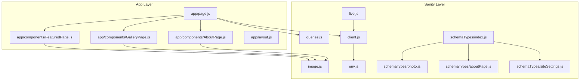
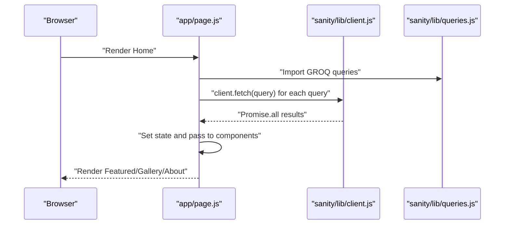
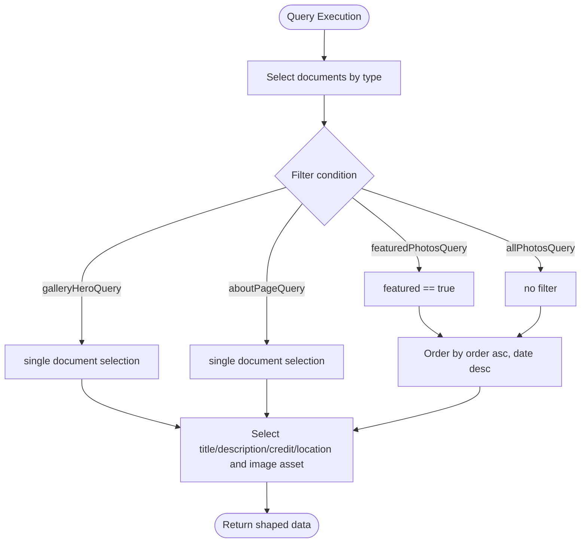
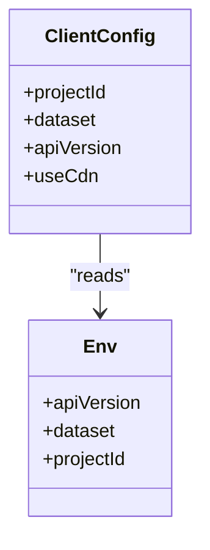
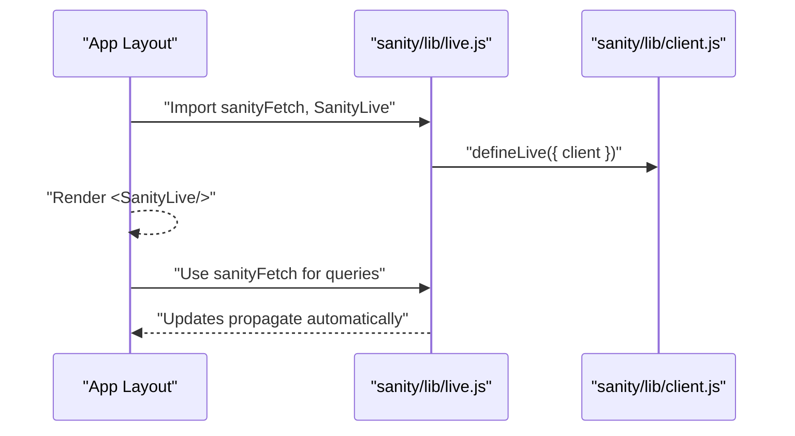
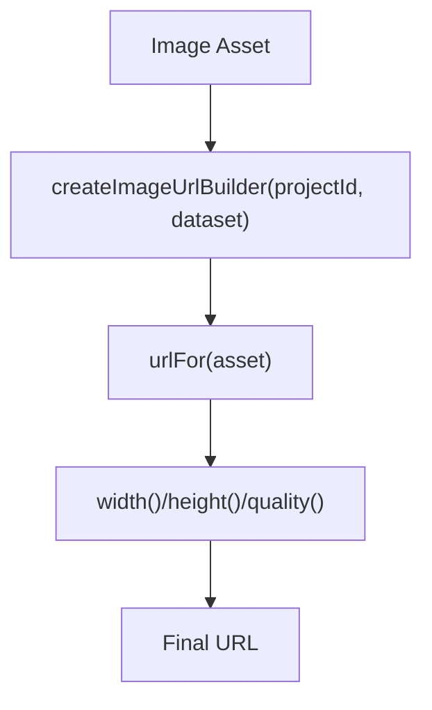
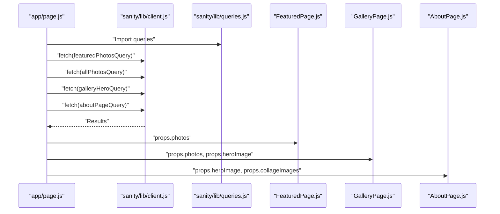
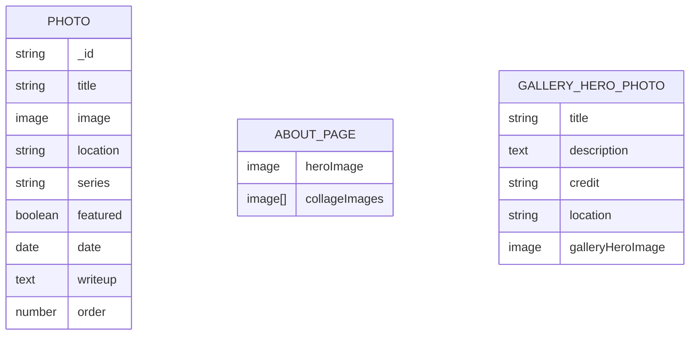
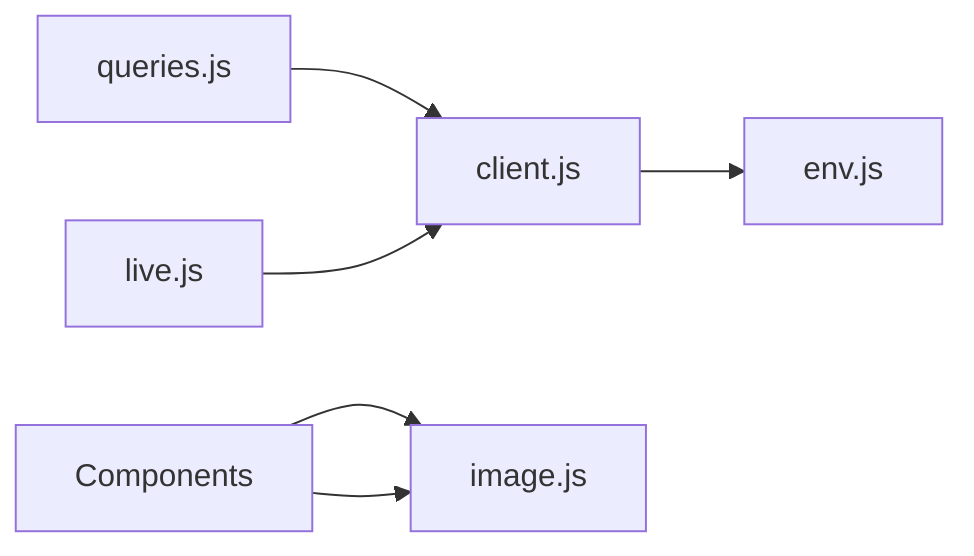

# GROQ Queries and Data Access

<cite>
**Referenced Files in This Document**
- [queries.js](file://sanity/lib/queries.js)
- [client.js](file://sanity/lib/client.js)
- [live.js](file://sanity/lib/live.js)
- [image.js](file://sanity/lib/image.js)
- [env.js](file://sanity/env.js)
- [schemaTypes/index.js](file://sanity/schemaTypes/index.js)
- [schemaTypes/photo.js](file://sanity/schemaTypes/photo.js)
- [schemaTypes/aboutPage.js](file://sanity/schemaTypes/aboutPage.js)
- [schemaTypes/siteSettings.js](file://sanity/schemaTypes/siteSettings.js)
- [app/page.js](file://app/page.js)
- [app/components/FeaturedPage.js](file://app/components/FeaturedPage.js)
- [app/components/GalleryPage.js](file://app/components/GalleryPage.js)
- [app/components/AboutPage.js](file://app/components/AboutPage.js)
- [app/layout.js](file://app/layout.js)
</cite>

## Table of Contents
1. [Introduction](#introduction)
2. [Project Structure](#project-structure)
3. [Core Components](#core-components)
4. [Architecture Overview](#architecture-overview)
5. [Detailed Component Analysis](#detailed-component-analysis)
6. [Dependency Analysis](#dependency-analysis)
7. [Performance Considerations](#performance-considerations)
8. [Troubleshooting Guide](#troubleshooting-guide)
9. [Conclusion](#conclusion)

## Introduction
This document explains how the portfolio website retrieves and renders content using the GROQ query language and the Sanity client. It covers query construction, client configuration, live content updates, and how queries integrate with frontend components. Practical examples illustrate common patterns for retrieving photos, gallery hero assets, about page content, and site settings.

## Project Structure
The data access layer is organized under sanity/lib with dedicated modules for queries, client configuration, image URL building, and live content. Frontend pages and components consume these queries to render dynamic content.

**Diagram sources**
- [queries.js:1-33](file://sanity/lib/queries.js#L1-L33)
- [client.js:1-10](file://sanity/lib/client.js#L1-L10)
- [live.js:1-10](file://sanity/lib/live.js#L1-L10)
- [image.js:1-9](file://sanity/lib/image.js#L1-L9)
- [env.js:1-6](file://sanity/env.js#L1-L6)
- [schemaTypes/index.js:1-8](file://sanity/schemaTypes/index.js#L1-L8)
- [schemaTypes/photo.js:1-93](file://sanity/schemaTypes/photo.js#L1-L93)
- [schemaTypes/aboutPage.js:1-27](file://sanity/schemaTypes/aboutPage.js#L1-L27)
- [schemaTypes/siteSettings.js:1-48](file://sanity/schemaTypes/siteSettings.js#L1-L48)
- [app/page.js:1-227](file://app/page.js#L1-L227)
- [app/components/FeaturedPage.js:1-269](file://app/components/FeaturedPage.js#L1-L269)
- [app/components/GalleryPage.js:1-760](file://app/components/GalleryPage.js#L1-L760)
- [app/components/AboutPage.js:1-458](file://app/components/AboutPage.js#L1-L458)
- [app/layout.js:1-40](file://app/layout.js#L1-L40)

**Section sources**
- [queries.js:1-33](file://sanity/lib/queries.js#L1-L33)
- [client.js:1-10](file://sanity/lib/client.js#L1-L10)
- [live.js:1-10](file://sanity/lib/live.js#L1-L10)
- [image.js:1-9](file://sanity/lib/image.js#L1-L9)
- [env.js:1-6](file://sanity/env.js#L1-L6)
- [schemaTypes/index.js:1-8](file://sanity/schemaTypes/index.js#L1-L8)
- [schemaTypes/photo.js:1-93](file://sanity/schemaTypes/photo.js#L1-L93)
- [schemaTypes/aboutPage.js:1-27](file://sanity/schemaTypes/aboutPage.js#L1-L27)
- [schemaTypes/siteSettings.js:1-48](file://sanity/schemaTypes/siteSettings.js#L1-L48)
- [app/page.js:1-227](file://app/page.js#L1-L227)
- [app/components/FeaturedPage.js:1-269](file://app/components/FeaturedPage.js#L1-L269)
- [app/components/GalleryPage.js:1-760](file://app/components/GalleryPage.js#L1-L760)
- [app/components/AboutPage.js:1-458](file://app/components/AboutPage.js#L1-L458)
- [app/layout.js:1-40](file://app/layout.js#L1-L40)

## Core Components
- GROQ queries: Defined as tagged template literals for fetching featured photos, all photos, gallery hero assets, and about page content.
- Sanity client: Configured with project credentials and API version, with CDN disabled for fresh content.
- Live content: Exposes a live-fetch helper and a component to enable real-time updates.
- Image URL builder: Provides a helper to construct optimized image URLs from Sanity image assets.
- Frontend integration: The home page orchestrates concurrent data fetching and passes data to page components.

**Section sources**
- [queries.js:1-33](file://sanity/lib/queries.js#L1-L33)
- [client.js:1-10](file://sanity/lib/client.js#L1-L10)
- [live.js:1-10](file://sanity/lib/live.js#L1-L10)
- [image.js:1-9](file://sanity/lib/image.js#L1-L9)
- [app/page.js:106-131](file://app/page.js#L106-L131)

## Architecture Overview
The application uses a clean separation between data access and presentation:
- Queries are declared in a single module and imported by the page controller.
- The page controller uses the Sanity client to fetch data concurrently.
- Components receive props and render content, using the image URL builder for responsive images.

**Diagram sources**
- [app/page.js:106-131](file://app/page.js#L106-L131)
- [sanity/lib/client.js:4-9](file://sanity/lib/client.js#L4-L9)
- [sanity/lib/queries.js:3-32](file://sanity/lib/queries.js#L3-L32)

## Detailed Component Analysis

### GROQ Queries Module
The queries module defines four primary queries:
- featuredPhotosQuery: Retrieves documents of type photo where featured is true, ordered by manual order and date.
- allPhotosQuery: Retrieves all photo documents with the same ordering.
- galleryHeroQuery: Retrieves a single gallery hero document and selects a hero image with asset metadata.
- aboutPageQuery: Retrieves the about page document and selects hero and collage images with asset metadata.

**Diagram sources**
- [sanity/lib/queries.js:3-32](file://sanity/lib/queries.js#L3-L32)

**Section sources**
- [sanity/lib/queries.js:1-33](file://sanity/lib/queries.js#L1-L33)

### Sanity Client Configuration
The client is configured with:
- projectId, dataset, and apiVersion from environment variables.
- useCdn set to false to bypass CDN and ensure fresh content.

**Diagram sources**
- [sanity/lib/client.js:4-9](file://sanity/lib/client.js#L4-L9)
- [sanity/env.js:1-6](file://sanity/env.js#L1-L6)

**Section sources**
- [sanity/lib/client.js:1-10](file://sanity/lib/client.js#L1-L10)
- [sanity/env.js:1-6](file://sanity/env.js#L1-L6)

### Live Content Integration
The live module wraps the client to enable automatic content updates. It exports a sanityFetch function and a SanityLive component for rendering.

**Diagram sources**
- [sanity/lib/live.js:1-10](file://sanity/lib/live.js#L1-L10)
- [sanity/lib/client.js:4-9](file://sanity/lib/client.js#L4-L9)

**Section sources**
- [sanity/lib/live.js:1-10](file://sanity/lib/live.js#L1-L10)

### Image URL Builder
The image URL builder constructs optimized URLs from Sanity image assets using project and dataset identifiers.

**Diagram sources**
- [sanity/lib/image.js:4-8](file://sanity/lib/image.js#L4-L8)
- [sanity/env.js:4-5](file://sanity/env.js#L4-L5)

**Section sources**
- [sanity/lib/image.js:1-9](file://sanity/lib/image.js#L1-L9)
- [sanity/env.js:1-6](file://sanity/env.js#L1-L6)

### Frontend Data Fetching and Rendering
The home page coordinates data fetching and component rendering:
- Concurrently fetches featured photos, all photos, gallery hero, and about page data.
- Passes data to components, which render images using urlFor and apply animations.

**Diagram sources**
- [app/page.js:106-131](file://app/page.js#L106-L131)
- [sanity/lib/queries.js:3-32](file://sanity/lib/queries.js#L3-L32)
- [sanity/lib/client.js:4-9](file://sanity/lib/client.js#L4-L9)
- [app/components/FeaturedPage.js:6](file://app/components/FeaturedPage.js#L6)
- [app/components/GalleryPage.js:6](file://app/components/GalleryPage.js#L6)
- [app/components/AboutPage.js:5](file://app/components/AboutPage.js#L5)

**Section sources**
- [app/page.js:106-131](file://app/page.js#L106-L131)
- [app/components/FeaturedPage.js:1-269](file://app/components/FeaturedPage.js#L1-L269)
- [app/components/GalleryPage.js:1-760](file://app/components/GalleryPage.js#L1-L760)
- [app/components/AboutPage.js:1-458](file://app/components/AboutPage.js#L1-L458)

### Schema Types Overview
The schema types define the content model used by queries:
- Photo: Title, image with hotspot, location, series, featured flag, date, writeup, order.
- About Page: Hero image and array of collage images.
- Site Settings (Gallery Hero): Title, description, credit, location, optional gallery hero image.

**Diagram sources**
- [sanity/schemaTypes/photo.js:5-63](file://sanity/schemaTypes/photo.js#L5-L63)
- [sanity/schemaTypes/aboutPage.js:5-19](file://sanity/schemaTypes/aboutPage.js#L5-L19)
- [sanity/schemaTypes/siteSettings.js:5-33](file://sanity/schemaTypes/siteSettings.js#L5-L33)

**Section sources**
- [sanity/schemaTypes/photo.js:1-93](file://sanity/schemaTypes/photo.js#L1-L93)
- [sanity/schemaTypes/aboutPage.js:1-27](file://sanity/schemaTypes/aboutPage.js#L1-L27)
- [sanity/schemaTypes/siteSettings.js:1-48](file://sanity/schemaTypes/siteSettings.js#L1-L48)

## Dependency Analysis
- Queries depend on the Sanity client and rely on the schema types’ fields.
- The client depends on environment variables for project credentials.
- Components depend on the image URL builder for rendering images.
- Live content depends on the client and requires the SanityLive component in the layout.

**Diagram sources**
- [sanity/lib/queries.js:3-32](file://sanity/lib/queries.js#L3-L32)
- [sanity/lib/client.js:4-9](file://sanity/lib/client.js#L4-L9)
- [sanity/env.js:1-6](file://sanity/env.js#L1-L6)
- [sanity/lib/image.js:4-8](file://sanity/lib/image.js#L4-L8)
- [sanity/lib/live.js:7-9](file://sanity/lib/live.js#L7-L9)

**Section sources**
- [sanity/lib/queries.js:1-33](file://sanity/lib/queries.js#L1-L33)
- [sanity/lib/client.js:1-10](file://sanity/lib/client.js#L1-L10)
- [sanity/env.js:1-6](file://sanity/env.js#L1-L6)
- [sanity/lib/image.js:1-9](file://sanity/lib/image.js#L1-L9)
- [sanity/lib/live.js:1-10](file://sanity/lib/live.js#L1-L10)

## Performance Considerations
- Freshness vs. performance: The client disables CDN to ensure fresh content, which may increase latency compared to cached responses. Consider enabling CDN for production and using the live content system for real-time updates.
- Concurrent fetching: The home page fetches multiple queries concurrently to reduce total load time.
- Image optimization: Components use urlFor with width and quality parameters to serve appropriately sized images.
- Ordering and filtering: Queries sort by order and date to ensure deterministic presentation and avoid expensive client-side sorting.

[No sources needed since this section provides general guidance]

## Troubleshooting Guide
- Environment variables: Ensure NEXT_PUBLIC_SANITY_PROJECT_ID, NEXT_PUBLIC_SANITY_DATASET, and NEXT_PUBLIC_SANITY_API_VERSION are set in the environment.
- Query correctness: Verify that field names in queries match schema types (e.g., image asset fields, arrays).
- Live content: Confirm that the SanityLive component is rendered in the layout and that sanityFetch is used for queries.
- Image URLs: Confirm that the image URL builder receives a valid asset and that projectId/dataset are correctly configured.

**Section sources**
- [sanity/env.js:1-6](file://sanity/env.js#L1-L6)
- [sanity/lib/queries.js:3-32](file://sanity/lib/queries.js#L3-L32)
- [sanity/lib/live.js:1-10](file://sanity/lib/live.js#L1-L10)
- [sanity/lib/image.js:4-8](file://sanity/lib/image.js#L4-L8)

## Conclusion
The application leverages GROQ for precise content retrieval, a straightforward client configuration for reliable data access, and a live content system for real-time updates. Queries are designed around the schema types to ensure accurate and efficient data shaping. Components consume this data to deliver a visually rich, animated experience, with image optimization integrated via the URL builder.