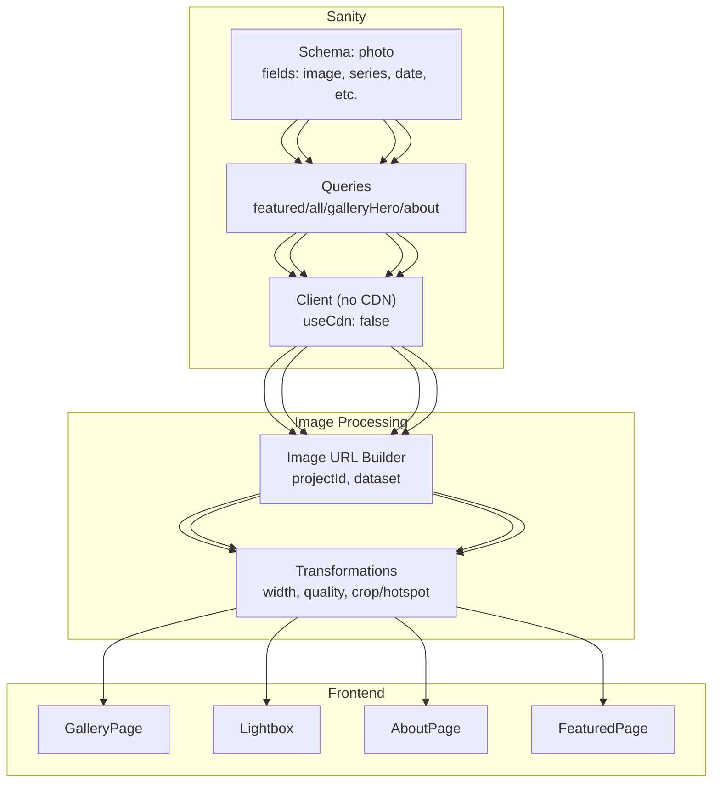
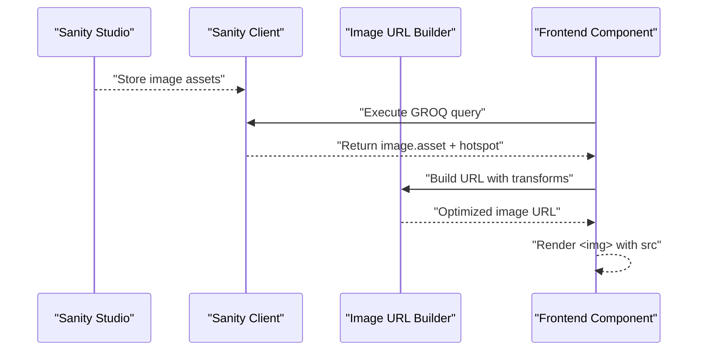
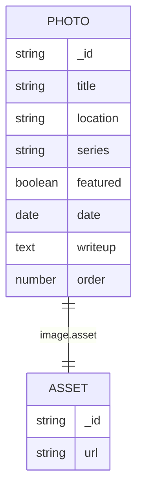
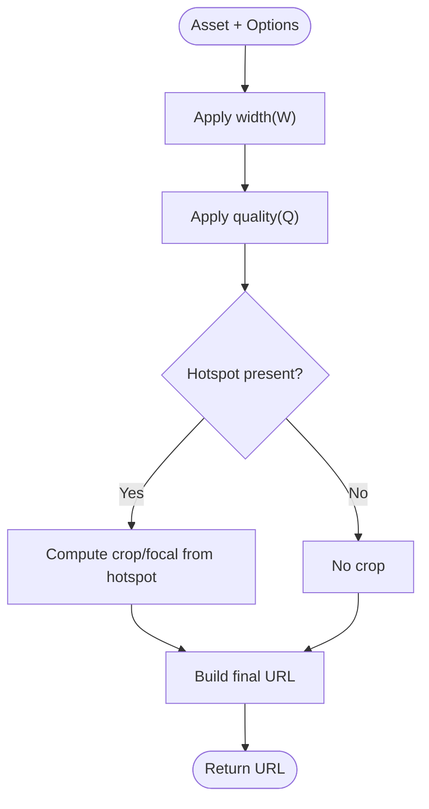
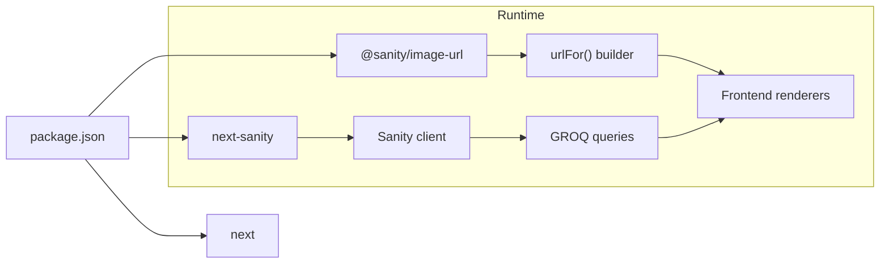

# Image Processing and CDN Integration

<cite>
**Referenced Files in This Document**
- [sanity/lib/image.js](file://sanity/lib/image.js)
- [sanity/env.js](file://sanity/env.js)
- [sanity/lib/client.js](file://sanity/lib/client.js)
- [sanity/lib/queries.js](file://sanity/lib/queries.js)
- [sanity/schemaTypes/photo.js](file://sanity/schemaTypes/photo.js)
- [sanity.config.js](file://sanity.config.js)
- [next.config.mjs](file://next.config.mjs)
- [package.json](file://package.json)
- [app/components/GalleryPage.js](file://app/components/GalleryPage.js)
- [app/components/Lightbox.js](file://app/components/Lightbox.js)
- [app/components/AboutPage.js](file://app/components/AboutPage.js)
- [app/components/FeaturedPage.js](file://app/components/FeaturedPage.js)
</cite>

## Table of Contents
1. [Introduction](#introduction)
2. [Project Structure](#project-structure)
3. [Core Components](#core-components)
4. [Architecture Overview](#architecture-overview)
5. [Detailed Component Analysis](#detailed-component-analysis)
6. [Dependency Analysis](#dependency-analysis)
7. [Performance Considerations](#performance-considerations)
8. [Troubleshooting Guide](#troubleshooting-guide)
9. [Conclusion](#conclusion)
10. [Appendices](#appendices)

## Introduction
This document explains the image processing pipeline and CDN integration used in the portfolio website. It covers how images are stored in Sanity, transformed via the Sanity Image URL builder, and delivered to the frontend. It also documents optimization settings, responsive serving strategies, and the relationship between Sanity image assets and frontend rendering. Practical examples of transformations and cropping are included, along with guidance on lazy loading and caching behavior.

## Project Structure
The image pipeline spans three layers:
- Sanity CMS: Stores images and metadata, exposes GROQ queries, and defines the image schema.
- Image URL builder: Translates asset references into optimized URLs with transformations.
- Frontend components: Render images with appropriate sizes, quality, and fallbacks.

**Diagram sources**
- [sanity/schemaTypes/photo.js:1-93](file://sanity/schemaTypes/photo.js#L1-L93)
- [sanity/lib/queries.js:1-33](file://sanity/lib/queries.js#L1-L33)
- [sanity/lib/client.js:1-10](file://sanity/lib/client.js#L1-L10)
- [sanity/lib/image.js:1-9](file://sanity/lib/image.js#L1-L9)
- [app/components/GalleryPage.js:1-760](file://app/components/GalleryPage.js#L1-L760)
- [app/components/Lightbox.js:1-303](file://app/components/Lightbox.js#L1-L303)
- [app/components/AboutPage.js:170-369](file://app/components/AboutPage.js#L170-L369)
- [app/components/FeaturedPage.js:130-269](file://app/components/FeaturedPage.js#L130-L269)

**Section sources**
- [sanity/schemaTypes/photo.js:1-93](file://sanity/schemaTypes/photo.js#L1-L93)
- [sanity/lib/queries.js:1-33](file://sanity/lib/queries.js#L1-L33)
- [sanity/lib/client.js:1-10](file://sanity/lib/client.js#L1-L10)
- [sanity/lib/image.js:1-9](file://sanity/lib/image.js#L1-L9)
- [app/components/GalleryPage.js:1-760](file://app/components/GalleryPage.js#L1-L760)
- [app/components/Lightbox.js:1-303](file://app/components/Lightbox.js#L1-L303)
- [app/components/AboutPage.js:170-369](file://app/components/AboutPage.js#L170-L369)
- [app/components/FeaturedPage.js:130-269](file://app/components/FeaturedPage.js#L130-L269)

## Core Components
- Sanity image asset model: The photo document includes an image field configured with hotspot support for smart cropping.
- GROQ queries: Retrieve image assets with metadata and hotspot coordinates.
- Image URL builder: Provides a typed interface to construct optimized URLs from asset references.
- Frontend renderers: Apply transformations per view (hero, thumbnails, lightbox) and provide fallbacks.

Key implementation references:
- Photo schema with image field and hotspot option: [sanity/schemaTypes/photo.js:12-18](file://sanity/schemaTypes/photo.js#L12-L18)
- Queries selecting image.asset and hotspot: [sanity/lib/queries.js:3-15](file://sanity/lib/queries.js#L3-L15)
- Image URL builder initialization: [sanity/lib/image.js:1-9](file://sanity/lib/image.js#L1-L9)
- Frontend usage examples across components: [app/components/GalleryPage.js:249-253](file://app/components/GalleryPage.js#L249-L253), [app/components/GalleryPage.js:385-393](file://app/components/GalleryPage.js#L385-L393), [app/components/GalleryPage.js:487-495](file://app/components/GalleryPage.js#L487-L495), [app/components/GalleryPage.js:574-582](file://app/components/GalleryPage.js#L574-L582), [app/components/GalleryPage.js:651-659](file://app/components/GalleryPage.js#L651-L659), [app/components/GalleryPage.js:695-699](file://app/components/GalleryPage.js#L695-L699), [app/components/Lightbox.js:159-168](file://app/components/Lightbox.js#L159-L168), [app/components/AboutPage.js:176-179](file://app/components/AboutPage.js#L176-L179), [app/components/AboutPage.js:194-196](file://app/components/AboutPage.js#L194-L196), [app/components/FeaturedPage.js:135-137](file://app/components/FeaturedPage.js#L135-L137)

**Section sources**
- [sanity/schemaTypes/photo.js:12-18](file://sanity/schemaTypes/photo.js#L12-L18)
- [sanity/lib/queries.js:3-15](file://sanity/lib/queries.js#L3-L15)
- [sanity/lib/image.js:1-9](file://sanity/lib/image.js#L1-L9)
- [app/components/GalleryPage.js:249-253](file://app/components/GalleryPage.js#L249-L253)
- [app/components/GalleryPage.js:385-393](file://app/components/GalleryPage.js#L385-L393)
- [app/components/GalleryPage.js:487-495](file://app/components/GalleryPage.js#L487-L495)
- [app/components/GalleryPage.js:574-582](file://app/components/GalleryPage.js#L574-L582)
- [app/components/GalleryPage.js:651-659](file://app/components/GalleryPage.js#L651-L659)
- [app/components/GalleryPage.js:695-699](file://app/components/GalleryPage.js#L695-L699)
- [app/components/Lightbox.js:159-168](file://app/components/Lightbox.js#L159-L168)
- [app/components/AboutPage.js:176-179](file://app/components/AboutPage.js#L176-L179)
- [app/components/AboutPage.js:194-196](file://app/components/AboutPage.js#L194-L196)
- [app/components/FeaturedPage.js:135-137](file://app/components/FeaturedPage.js#L135-L137)

## Architecture Overview
The image pipeline follows a clean separation of concerns:
- Data ingestion and storage: Sanity stores image assets and metadata.
- Query layer: GROQ fetches image assets and hotspot coordinates.
- Transformation layer: The Sanity Image URL builder applies transforms (size, quality, crop).
- Delivery layer: Frontend renders images with responsive sizing and fallbacks.

**Diagram sources**
- [sanity/lib/client.js:1-10](file://sanity/lib/client.js#L1-L10)
- [sanity/lib/queries.js:3-15](file://sanity/lib/queries.js#L3-L15)
- [sanity/lib/image.js:1-9](file://sanity/lib/image.js#L1-L9)
- [app/components/GalleryPage.js:385-393](file://app/components/GalleryPage.js#L385-L393)

**Section sources**
- [sanity/lib/client.js:1-10](file://sanity/lib/client.js#L1-L10)
- [sanity/lib/queries.js:3-15](file://sanity/lib/queries.js#L3-L15)
- [sanity/lib/image.js:1-9](file://sanity/lib/image.js#L1-L9)
- [app/components/GalleryPage.js:385-393](file://app/components/GalleryPage.js#L385-L393)

## Detailed Component Analysis

### Sanity Image Asset Model
- The photo document defines an image field with hotspot enabled, enabling focal-point-based cropping.
- Queries select image.asset and hotspot so transformations can be computed server-side.

**Diagram sources**
- [sanity/schemaTypes/photo.js:12-18](file://sanity/schemaTypes/photo.js#L12-L18)
- [sanity/lib/queries.js:3-15](file://sanity/lib/queries.js#L3-L15)

**Section sources**
- [sanity/schemaTypes/photo.js:12-18](file://sanity/schemaTypes/photo.js#L12-L18)
- [sanity/lib/queries.js:3-15](file://sanity/lib/queries.js#L3-L15)

### Image URL Generation and Transformations
- The URL builder is initialized with projectId and dataset from environment variables.
- Frontend components call urlFor(asset).width(W).quality(Q).url() to produce optimized URLs.
- Hotspot/crop are handled automatically by the builder when the asset includes hotspot data.

**Diagram sources**
- [sanity/lib/image.js:1-9](file://sanity/lib/image.js#L1-L9)
- [sanity/env.js:1-6](file://sanity/env.js#L1-L6)
- [app/components/GalleryPage.js:385-393](file://app/components/GalleryPage.js#L385-L393)

**Section sources**
- [sanity/lib/image.js:1-9](file://sanity/lib/image.js#L1-L9)
- [sanity/env.js:1-6](file://sanity/env.js#L1-L6)
- [app/components/GalleryPage.js:385-393](file://app/components/GalleryPage.js#L385-L393)

### Frontend Rendering Patterns
- Hero backgrounds: Large width with moderate quality for impactful visuals.
- Thumbnails/masonry: Medium width with balanced quality for fast loading.
- Lightbox: Large width with higher quality for detailed viewing.
- Collages and fallbacks: Static Unsplash URLs with explicit width and quality for reliability.

Examples:
- Hero background: [app/components/GalleryPage.js:249-253](file://app/components/GalleryPage.js#L249-L253), [app/components/FeaturedPage.js:135-137](file://app/components/FeaturedPage.js#L135-L137)
- Thumbnail grids: [app/components/GalleryPage.js:385-393](file://app/components/GalleryPage.js#L385-L393), [app/components/GalleryPage.js:487-495](file://app/components/GalleryPage.js#L487-L495), [app/components/GalleryPage.js:574-582](file://app/components/GalleryPage.js#L574-L582), [app/components/GalleryPage.js:651-659](file://app/components/GalleryPage.js#L651-L659), [app/components/GalleryPage.js:695-699](file://app/components/GalleryPage.js#L695-L699)
- Lightbox detail: [app/components/Lightbox.js:159-168](file://app/components/Lightbox.js#L159-L168)
- About page collage: [app/components/AboutPage.js:176-179](file://app/components/AboutPage.js#L176-L179), [app/components/AboutPage.js:194-196](file://app/components/AboutPage.js#L194-L196)

**Section sources**
- [app/components/GalleryPage.js:249-253](file://app/components/GalleryPage.js#L249-L253)
- [app/components/GalleryPage.js:385-393](file://app/components/GalleryPage.js#L385-L393)
- [app/components/GalleryPage.js:487-495](file://app/components/GalleryPage.js#L487-L495)
- [app/components/GalleryPage.js:574-582](file://app/components/GalleryPage.js#L574-L582)
- [app/components/GalleryPage.js:651-659](file://app/components/GalleryPage.js#L651-L659)
- [app/components/GalleryPage.js:695-699](file://app/components/GalleryPage.js#L695-L699)
- [app/components/Lightbox.js:159-168](file://app/components/Lightbox.js#L159-L168)
- [app/components/AboutPage.js:176-179](file://app/components/AboutPage.js#L176-L179)
- [app/components/AboutPage.js:194-196](file://app/components/AboutPage.js#L194-L196)
- [app/components/FeaturedPage.js:135-137](file://app/components/FeaturedPage.js#L135-L137)

### CDN Integration and Caching Behavior
- Sanity client is configured with useCdn disabled for development to ensure fresh data.
- The Image URL builder produces URLs pointing to Sanity’s CDN, which caches and optimizes images globally.
- Next.js configuration does not override CDN behavior for images; Sanity handles image delivery.

References:
- Client with useCdn disabled: [sanity/lib/client.js](file://sanity/lib/client.js#L8)
- Image URL builder using projectId/dataset: [sanity/lib/image.js:1-9](file://sanity/lib/image.js#L1-L9)
- Next.js config defaults: [next.config.mjs:1-7](file://next.config.mjs#L1-L7)

**Section sources**
- [sanity/lib/client.js](file://sanity/lib/client.js#L8)
- [sanity/lib/image.js:1-9](file://sanity/lib/image.js#L1-L9)
- [next.config.mjs:1-7](file://next.config.mjs#L1-L7)

### Responsive Image Serving and Cropping Techniques
- Smart cropping: Hotspot enables focal-point-based crop for optimal composition.
- Size optimization: Different widths per view (e.g., 800–1600) balance quality and bandwidth.
- Quality presets: Moderate to high quality (82–90) tailored to context (thumbnails vs. detail).
- Fallbacks: Static URLs with explicit width and quality ensure resilience when Sanity assets are unavailable.

References:
- Hotspot-enabled image field: [sanity/schemaTypes/photo.js:12-18](file://sanity/schemaTypes/photo.js#L12-L18)
- Queries returning asset and hotspot: [sanity/lib/queries.js:3-15](file://sanity/lib/queries.js#L3-L15)
- Examples across components: [app/components/GalleryPage.js:385-393](file://app/components/GalleryPage.js#L385-L393), [app/components/Lightbox.js:159-168](file://app/components/Lightbox.js#L159-L168), [app/components/AboutPage.js:176-179](file://app/components/AboutPage.js#L176-L179), [app/components/AboutPage.js:194-196](file://app/components/AboutPage.js#L194-L196)

**Section sources**
- [sanity/schemaTypes/photo.js:12-18](file://sanity/schemaTypes/photo.js#L12-L18)
- [sanity/lib/queries.js:3-15](file://sanity/lib/queries.js#L3-L15)
- [app/components/GalleryPage.js:385-393](file://app/components/GalleryPage.js#L385-L393)
- [app/components/Lightbox.js:159-168](file://app/components/Lightbox.js#L159-L168)
- [app/components/AboutPage.js:176-179](file://app/components/AboutPage.js#L176-L179)
- [app/components/AboutPage.js:194-196](file://app/components/AboutPage.js#L194-L196)

### Relationship Between Sanity Assets and Frontend Rendering
- Components fetch photo documents via GROQ, receiving image.asset and hotspot.
- urlFor(asset) constructs a URL with optional transforms.
- Frontend renders images with appropriate sizing and fallbacks.

References:
- Client and queries: [sanity/lib/client.js:1-10](file://sanity/lib/client.js#L1-L10), [sanity/lib/queries.js:3-15](file://sanity/lib/queries.js#L3-L15)
- Renderer usage: [app/components/GalleryPage.js:385-393](file://app/components/GalleryPage.js#L385-L393), [app/components/Lightbox.js:159-168](file://app/components/Lightbox.js#L159-L168), [app/components/AboutPage.js:176-179](file://app/components/AboutPage.js#L176-L179), [app/components/FeaturedPage.js:135-137](file://app/components/FeaturedPage.js#L135-L137)

**Section sources**
- [sanity/lib/client.js:1-10](file://sanity/lib/client.js#L1-L10)
- [sanity/lib/queries.js:3-15](file://sanity/lib/queries.js#L3-L15)
- [app/components/GalleryPage.js:385-393](file://app/components/GalleryPage.js#L385-L393)
- [app/components/Lightbox.js:159-168](file://app/components/Lightbox.js#L159-L168)
- [app/components/AboutPage.js:176-179](file://app/components/AboutPage.js#L176-L179)
- [app/components/FeaturedPage.js:135-137](file://app/components/FeaturedPage.js#L135-L137)

## Dependency Analysis
- Runtime dependencies include @sanity/image-url for URL building and next-sanity for client connectivity.
- The project does not declare a Next.js image optimization plugin; image optimization is handled by Sanity’s CDN.

**Diagram sources**
- [package.json:11-22](file://package.json#L11-L22)
- [sanity/lib/image.js:1-9](file://sanity/lib/image.js#L1-L9)
- [sanity/lib/client.js:1-10](file://sanity/lib/client.js#L1-L10)
- [sanity/lib/queries.js:3-15](file://sanity/lib/queries.js#L3-L15)

**Section sources**
- [package.json:11-22](file://package.json#L11-L22)
- [sanity/lib/image.js:1-9](file://sanity/lib/image.js#L1-L9)
- [sanity/lib/client.js:1-10](file://sanity/lib/client.js#L1-L10)
- [sanity/lib/queries.js:3-15](file://sanity/lib/queries.js#L3-L15)

## Performance Considerations
- Prefer smaller widths for thumbnails and hero previews to reduce payload.
- Use moderate quality (82–85) for most contexts; increase to 90 for lightbox/detail views.
- Leverage hotspot-based cropping to avoid server-side cropping overhead.
- Keep transform parameters consistent per component to maximize CDN cache hits.
- Avoid unnecessary re-renders by memoizing transformed URLs when props are stable.

[No sources needed since this section provides general guidance]

## Troubleshooting Guide
- Empty or missing images:
  - Verify queries include image.asset and hotspot.
  - Confirm asset uploads succeeded in Sanity Studio.
- Incorrect cropping:
  - Ensure hotspot is set in the Sanity asset.
  - Re-trim focal area if needed.
- Slow initial load:
  - Reduce initial hero width or defer non-critical images.
  - Consider lazy-loading with native loading="lazy" on .
- Fallback strategy:
  - Use static fallback URLs with explicit width and quality for critical hero images.
  - Example pattern: [app/components/AboutPage.js:176-179](file://app/components/AboutPage.js#L176-L179), [app/components/AboutPage.js:194-196](file://app/components/AboutPage.js#L194-L196)

**Section sources**
- [sanity/lib/queries.js:3-15](file://sanity/lib/queries.js#L3-L15)
- [app/components/AboutPage.js:176-179](file://app/components/AboutPage.js#L176-L179)
- [app/components/AboutPage.js:194-196](file://app/components/AboutPage.js#L194-L196)

## Conclusion
The portfolio leverages Sanity’s asset storage and the @sanity/image-url builder to deliver optimized images across contexts. By combining hotspot-aware cropping, responsive widths, and quality presets, the system achieves a strong balance between visual fidelity and performance. The frontend remains flexible, with clear fallbacks and consistent transform patterns that improve caching and user experience.

[No sources needed since this section summarizes without analyzing specific files]

## Appendices

### Practical Examples Index
- Hero background (large width, moderate quality): [app/components/GalleryPage.js:249-253](file://app/components/GalleryPage.js#L249-L253), [app/components/FeaturedPage.js:135-137](file://app/components/FeaturedPage.js#L135-L137)
- Thumbnail grid (medium width, balanced quality): [app/components/GalleryPage.js:385-393](file://app/components/GalleryPage.js#L385-L393), [app/components/GalleryPage.js:487-495](file://app/components/GalleryPage.js#L487-L495), [app/components/GalleryPage.js:574-582](file://app/components/GalleryPage.js#L574-L582), [app/components/GalleryPage.js:651-659](file://app/components/GalleryPage.js#L651-L659), [app/components/GalleryPage.js:695-699](file://app/components/GalleryPage.js#L695-L699)
- Lightbox detail (large width, higher quality): [app/components/Lightbox.js:159-168](file://app/components/Lightbox.js#L159-L168)
- About page collage (fallbacks with explicit width/quality): [app/components/AboutPage.js:176-179](file://app/components/AboutPage.js#L176-L179), [app/components/AboutPage.js:194-196](file://app/components/AboutPage.js#L194-L196)

**Section sources**
- [app/components/GalleryPage.js:249-253](file://app/components/GalleryPage.js#L249-L253)
- [app/components/GalleryPage.js:385-393](file://app/components/GalleryPage.js#L385-L393)
- [app/components/GalleryPage.js:487-495](file://app/components/GalleryPage.js#L487-L495)
- [app/components/GalleryPage.js:574-582](file://app/components/GalleryPage.js#L574-L582)
- [app/components/GalleryPage.js:651-659](file://app/components/GalleryPage.js#L651-L659)
- [app/components/GalleryPage.js:695-699](file://app/components/GalleryPage.js#L695-L699)
- [app/components/Lightbox.js:159-168](file://app/components/Lightbox.js#L159-L168)
- [app/components/AboutPage.js:176-179](file://app/components/AboutPage.js#L176-L179)
- [app/components/AboutPage.js:194-196](file://app/components/AboutPage.js#L194-L196)
- [app/components/FeaturedPage.js:135-137](file://app/components/FeaturedPage.js#L135-L137)