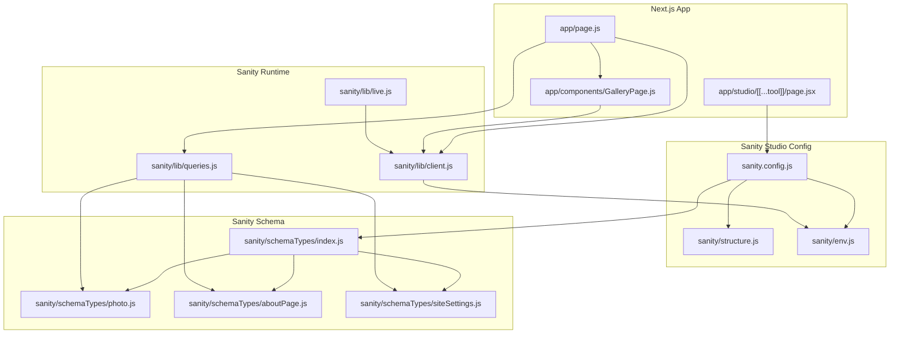
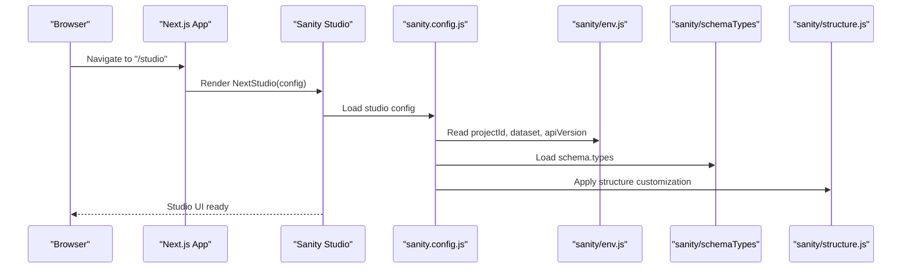
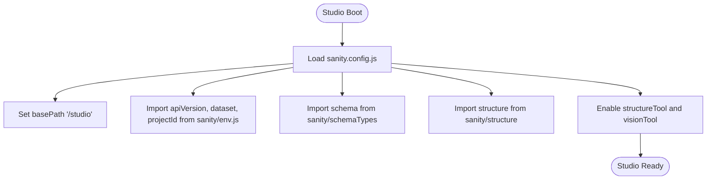
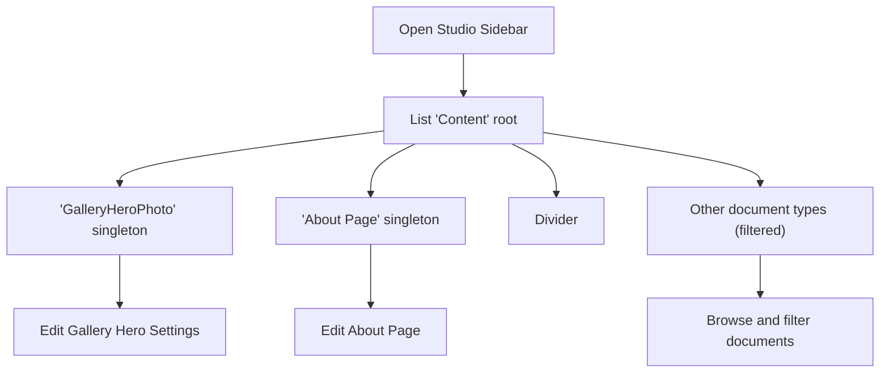
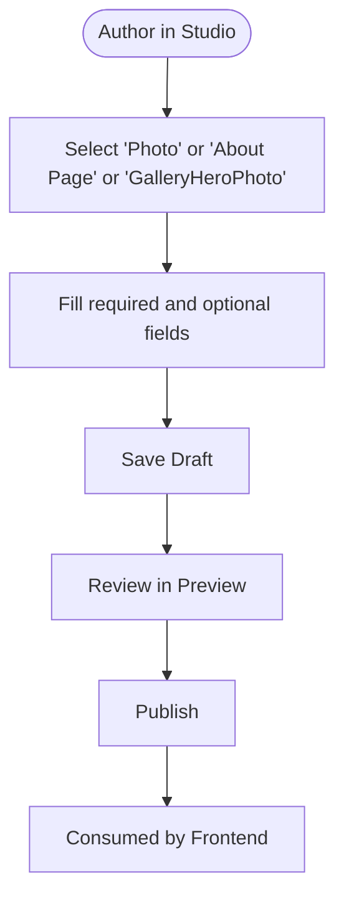
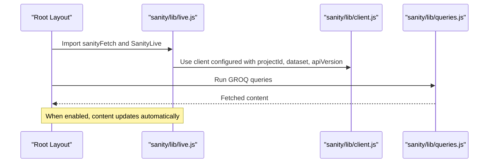
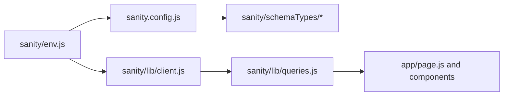
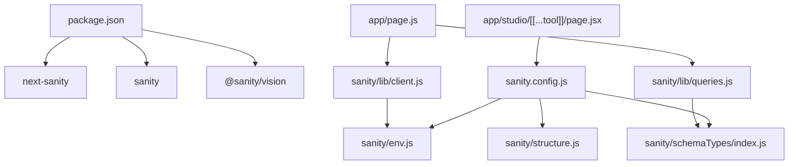

# Sanity CMS Overview

<cite>
**Referenced Files in This Document**
- [sanity.config.js](file://sanity.config.js)
- [sanity/env.js](file://sanity/env.js)
- [sanity/structure.js](file://sanity/structure.js)
- [sanity/schemaTypes/index.js](file://sanity/schemaTypes/index.js)
- [sanity/schemaTypes/photo.js](file://sanity/schemaTypes/photo.js)
- [sanity/schemaTypes/aboutPage.js](file://sanity/schemaTypes/aboutPage.js)
- [sanity/schemaTypes/siteSettings.js](file://sanity/schemaTypes/siteSettings.js)
- [sanity/lib/client.js](file://sanity/lib/client.js)
- [sanity/lib/queries.js](file://sanity/lib/queries.js)
- [sanity/lib/live.js](file://sanity/lib/live.js)
- [app/studio/[[...tool]]/page.jsx](file://app/studio/[[...tool]]/page.jsx)
- [app/page.js](file://app/page.js)
- [app/components/GalleryPage.js](file://app/components/GalleryPage.js)
- [package.json](file://package.json)
</cite>

## Table of Contents
1. [Introduction](#introduction)
2. [Project Structure](#project-structure)
3. [Core Components](#core-components)
4. [Architecture Overview](#architecture-overview)
5. [Detailed Component Analysis](#detailed-component-analysis)
6. [Dependency Analysis](#dependency-analysis)
7. [Performance Considerations](#performance-considerations)
8. [Troubleshooting Guide](#troubleshooting-guide)
9. [Conclusion](#conclusion)
10. [Appendices](#appendices)

## Introduction
This document explains how the Sanity CMS studio is configured and integrated into the Next.js application for this photography portfolio. It covers studio setup, plugin configuration (Structure Tool and Vision), studio navigation and content workflows, real-time preview capabilities, environment variable configuration, studio structure customization, and how studio content is consumed by the frontend. It also outlines permissions, collaboration, and scheduling considerations grounded in the current configuration.

## Project Structure
The studio is mounted as a Next.js route under app/studio/[[...tool]]/page.jsx and configured via sanity.config.js. Content types are defined under sanity/schemaTypes, and studio navigation is customized in sanity/structure.js. Frontend pages consume content using next-sanity client and GROQ queries.

**Diagram sources**
- [app/studio/[[...tool]]/page.jsx:1-9](file://app/studio/[[...tool]]/page.jsx#L1-L9)
- [sanity.config.js:1-29](file://sanity.config.js#L1-L29)
- [sanity/structure.js:1-25](file://sanity/structure.js#L1-L25)
- [sanity/env.js:1-6](file://sanity/env.js#L1-L6)
- [sanity/schemaTypes/index.js:1-8](file://sanity/schemaTypes/index.js#L1-L8)
- [sanity/schemaTypes/photo.js:1-93](file://sanity/schemaTypes/photo.js#L1-L93)
- [sanity/schemaTypes/aboutPage.js:1-27](file://sanity/schemaTypes/aboutPage.js#L1-L27)
- [sanity/schemaTypes/siteSettings.js:1-48](file://sanity/schemaTypes/siteSettings.js#L1-L48)
- [sanity/lib/client.js:1-10](file://sanity/lib/client.js#L1-L10)
- [sanity/lib/queries.js:1-33](file://sanity/lib/queries.js#L1-L33)
- [sanity/lib/live.js:1-10](file://sanity/lib/live.js#L1-L10)
- [app/page.js:1-227](file://app/page.js#L1-L227)
- [app/components/GalleryPage.js:1-760](file://app/components/GalleryPage.js#L1-L760)

**Section sources**
- [sanity.config.js:1-29](file://sanity.config.js#L1-L29)
- [app/studio/[[...tool]]/page.jsx:1-9](file://app/studio/[[...tool]]/page.jsx#L1-L9)
- [sanity/structure.js:1-25](file://sanity/structure.js#L1-L25)
- [sanity/env.js:1-6](file://sanity/env.js#L1-L6)
- [sanity/schemaTypes/index.js:1-8](file://sanity/schemaTypes/index.js#L1-L8)
- [sanity/schemaTypes/photo.js:1-93](file://sanity/schemaTypes/photo.js#L1-L93)
- [sanity/schemaTypes/aboutPage.js:1-27](file://sanity/schemaTypes/aboutPage.js#L1-L27)
- [sanity/schemaTypes/siteSettings.js:1-48](file://sanity/schemaTypes/siteSettings.js#L1-L48)
- [sanity/lib/client.js:1-10](file://sanity/lib/client.js#L1-L10)
- [sanity/lib/queries.js:1-33](file://sanity/lib/queries.js#L1-L33)
- [sanity/lib/live.js:1-10](file://sanity/lib/live.js#L1-L10)
- [app/page.js:1-227](file://app/page.js#L1-L227)
- [app/components/GalleryPage.js:1-760](file://app/components/GalleryPage.js#L1-L760)

## Core Components
- Studio configuration: Defines base path, project identity, dataset, schema, and plugins (Structure Tool and Vision).
- Environment variables: Provide projectId, dataset, and API version used by both studio and client.
- Studio structure: Curates a prioritized navigation for key singleton documents and exposes other document types.
- Schema types: Define content models for photos, about page, and gallery hero settings.
- Client and queries: Fetch content in the frontend with GROQ and optional live updates.
- Live content: Enables real-time updates for content consumers.

**Section sources**
- [sanity.config.js:16-28](file://sanity.config.js#L16-L28)
- [sanity/env.js:1-6](file://sanity/env.js#L1-L6)
- [sanity/structure.js:2-24](file://sanity/structure.js#L2-L24)
- [sanity/schemaTypes/index.js:5-7](file://sanity/schemaTypes/index.js#L5-L7)
- [sanity/lib/client.js:4-9](file://sanity/lib/client.js#L4-L9)
- [sanity/lib/queries.js:3-32](file://sanity/lib/queries.js#L3-L32)
- [sanity/lib/live.js:7-9](file://sanity/lib/live.js#L7-L9)

## Architecture Overview
The studio is a Next.js route that renders the Sanity Studio using the configured Sanity config. The frontend consumes content via next-sanity client and GROQ queries. Real-time updates are optionally enabled through the live content API.

**Diagram sources**
- [app/studio/[[...tool]]/page.jsx:6-8](file://app/studio/[[...tool]]/page.jsx#L6-L8)
- [sanity.config.js:16-28](file://sanity.config.js#L16-L28)
- [sanity/env.js:1-6](file://sanity/env.js#L1-L6)
- [sanity/schemaTypes/index.js:5-7](file://sanity/schemaTypes/index.js#L5-L7)
- [sanity/structure.js:2-24](file://sanity/structure.js#L2-L24)

## Detailed Component Analysis

### Studio Setup and Plugins
- Base path: The studio is served under /studio.
- Plugins:
  - Structure Tool: Provides a custom sidebar structure.
  - Vision Tool: Adds a GROQ playground with a configurable API version.
- Schema and structure are injected from local modules.

**Diagram sources**
- [sanity.config.js:16-28](file://sanity.config.js#L16-L28)
- [sanity/env.js:1-6](file://sanity/env.js#L1-L6)
- [sanity/schemaTypes/index.js:5-7](file://sanity/schemaTypes/index.js#L5-L7)
- [sanity/structure.js:2-24](file://sanity/structure.js#L2-L24)

**Section sources**
- [sanity.config.js:16-28](file://sanity.config.js#L16-L28)

### Environment Variable Configuration
- projectId: Used to identify the Sanity project.
- dataset: Selects the dataset for content.
- apiVersion: Controls API versioning for both studio and client.
- All three are loaded from environment variables and used consistently across studio and client.

Practical guidance:
- Set NEXT_PUBLIC_SANITY_PROJECT_ID, NEXT_PUBLIC_SANITY_DATASET, and NEXT_PUBLIC_SANITY_API_VERSION in your deployment environment.
- The studio reads these values at runtime to connect to the correct project and dataset.

**Section sources**
- [sanity/env.js:1-6](file://sanity/env.js#L1-L6)
- [sanity.config.js:12-12](file://sanity.config.js#L12-L12)
- [sanity/lib/client.js:2-2](file://sanity/lib/client.js#L2-L2)

### Studio Navigation Patterns and Structure Customization
- The sidebar lists:
  - A dedicated singleton for the gallery hero settings.
  - The About Page singleton.
  - A divider.
  - All other document types, excluding the two singletons.
- This prioritizes frequently edited content and keeps the rest discoverable.

**Diagram sources**
- [sanity/structure.js:2-24](file://sanity/structure.js#L2-L24)

**Section sources**
- [sanity/structure.js:2-24](file://sanity/structure.js#L2-L24)

### Content Creation Workflows
- Create a new photo document using the Photo schema. Required fields include title, image, and series.
- Use the ordering options to control display order.
- Toggle featured to include a photo in the homepage slideshow.
- Use the About Page schema to manage hero and collage images.
- Use the Gallery Hero singleton to set the hero title, description, credit, location, and optional hero image.

**Diagram sources**
- [sanity/schemaTypes/photo.js:5-63](file://sanity/schemaTypes/photo.js#L5-L63)
- [sanity/schemaTypes/aboutPage.js:5-20](file://sanity/schemaTypes/aboutPage.js#L5-L20)
- [sanity/schemaTypes/siteSettings.js:5-34](file://sanity/schemaTypes/siteSettings.js#L5-L34)

**Section sources**
- [sanity/schemaTypes/photo.js:5-63](file://sanity/schemaTypes/photo.js#L5-L63)
- [sanity/schemaTypes/aboutPage.js:5-20](file://sanity/schemaTypes/aboutPage.js#L5-L20)
- [sanity/schemaTypes/siteSettings.js:5-34](file://sanity/schemaTypes/siteSettings.js#L5-L34)

### Real-Time Preview and Live Content
- The frontend uses next-sanity client to fetch content with GROQ queries.
- Real-time updates can be enabled using the live content API. The defineLive wrapper is exported for use in layouts and pages.

**Diagram sources**
- [sanity/lib/live.js:7-9](file://sanity/lib/live.js#L7-L9)
- [sanity/lib/client.js:4-9](file://sanity/lib/client.js#L4-L9)
- [sanity/lib/queries.js:3-32](file://sanity/lib/queries.js#L3-L32)

**Section sources**
- [sanity/lib/live.js:1-10](file://sanity/lib/live.js#L1-L10)
- [sanity/lib/client.js:1-10](file://sanity/lib/client.js#L1-L10)
- [sanity/lib/queries.js:1-33](file://sanity/lib/queries.js#L1-L33)

### Relationship Between Studio Configuration and Frontend Consumption
- Studio configuration and frontend client share the same environment variables for projectId, dataset, and API version.
- Frontend queries target the same dataset and types defined in the studio schema.

**Diagram sources**
- [sanity/env.js:1-6](file://sanity/env.js#L1-L6)
- [sanity.config.js:12-12](file://sanity.config.js#L12-L12)
- [sanity/lib/client.js:2-2](file://sanity/lib/client.js#L2-L2)
- [sanity/schemaTypes/index.js:5-7](file://sanity/schemaTypes/index.js#L5-L7)
- [sanity/lib/queries.js:3-32](file://sanity/lib/queries.js#L3-L32)
- [app/page.js:3-3](file://app/page.js#L3-L3)

**Section sources**
- [sanity/env.js:1-6](file://sanity/env.js#L1-L6)
- [sanity/config.js:12-12](file://sanity.config.js#L12-L12)
- [sanity/lib/client.js:2-2](file://sanity/lib/client.js#L2-L2)
- [sanity/schemaTypes/index.js:5-7](file://sanity/schemaTypes/index.js#L5-L7)
- [sanity/lib/queries.js:3-32](file://sanity/lib/queries.js#L3-L32)
- [app/page.js:3-3](file://app/page.js#L3-L3)

### Permissions, Collaboration, and Scheduling
- Permissions and collaboration are managed in the Sanity project settings. The studio integrates with these settings to control who can edit and publish content.
- Scheduling content publishes is handled within the Sanity project settings; the studio does not include explicit scheduling UI in this configuration.

[No sources needed since this section provides general guidance]

## Dependency Analysis
The studio depends on the Sanity configuration, environment variables, and schema modules. The frontend depends on the client and queries modules, which in turn depend on environment variables.

**Diagram sources**
- [package.json:11-22](file://package.json#L11-L22)
- [app/studio/[[...tool]]/page.jsx:3-4](file://app/studio/[[...tool]]/page.jsx#L3-L4)
- [sanity.config.js:12-14](file://sanity.config.js#L12-L14)
- [sanity/env.js:1-6](file://sanity/env.js#L1-L6)
- [sanity/schemaTypes/index.js:5-7](file://sanity/schemaTypes/index.js#L5-L7)
- [sanity/structure.js:2-24](file://sanity/structure.js#L2-L24)
- [app/page.js:3-4](file://app/page.js#L3-L4)
- [sanity/lib/client.js:2-2](file://sanity/lib/client.js#L2-L2)
- [sanity/lib/queries.js:1-1](file://sanity/lib/queries.js#L1-L1)

**Section sources**
- [package.json:11-22](file://package.json#L11-L22)
- [app/studio/[[...tool]]/page.jsx:3-4](file://app/studio/[[...tool]]/page.jsx#L3-L4)
- [sanity.config.js:12-14](file://sanity.config.js#L12-L14)
- [sanity/env.js:1-6](file://sanity/env.js#L1-L6)
- [sanity/schemaTypes/index.js:5-7](file://sanity/schemaTypes/index.js#L5-L7)
- [sanity/structure.js:2-24](file://sanity/structure.js#L2-L24)
- [app/page.js:3-4](file://app/page.js#L3-L4)
- [sanity/lib/client.js:2-2](file://sanity/lib/client.js#L2-L2)
- [sanity/lib/queries.js:1-1](file://sanity/lib/queries.js#L1-L1)

## Performance Considerations
- The client is configured to bypass CDN for freshest data. This ensures accuracy but may increase latency compared to cached responses.
- Queries fetch multiple datasets concurrently in the home page to reduce perceived loading time.
- Consider enabling CDN for production environments if acceptable trade-offs are made for staleness vs. speed.

**Section sources**
- [sanity/lib/client.js:8-8](file://sanity/lib/client.js#L8-L8)
- [app/page.js:110-126](file://app/page.js#L110-L126)

## Troubleshooting Guide
- Studio not loading:
  - Verify basePath is correct and the route matches the studio page export.
  - Confirm environment variables for projectId, dataset, and apiVersion are present.
- Content not updating in real-time:
  - Ensure the live content API is initialized and rendered in the layout.
  - Confirm the client is configured with the same projectId, dataset, and apiVersion.
- Queries returning unexpected data:
  - Validate schema types match the queries and that document IDs align with singleton expectations.

**Section sources**
- [app/studio/[[...tool]]/page.jsx:6-8](file://app/studio/[[...tool]]/page.jsx#L6-L8)
- [sanity/env.js:1-6](file://sanity/env.js#L1-L6)
- [sanity/lib/live.js:7-9](file://sanity/lib/live.js#L7-L9)
- [sanity/lib/client.js:4-9](file://sanity/lib/client.js#L4-L9)
- [sanity/lib/queries.js:3-32](file://sanity/lib/queries.js#L3-L32)

## Conclusion
The studio is configured to serve a focused editing experience with Structure and Vision plugins, while the frontend consumes content through typed GROQ queries and optional live updates. Environment variables centralize configuration for both studio and client, ensuring consistency across the system.

## Appendices
- Practical examples:
  - Authoring a photo: Use the Photo schema to set title, image, series, and optional featured flag.
  - Editing About Page: Populate hero and collage images via the About Page singleton.
  - Publishing: Save and publish documents in the studio; the frontend reflects changes immediately when live updates are enabled.

[No sources needed since this section provides general guidance]