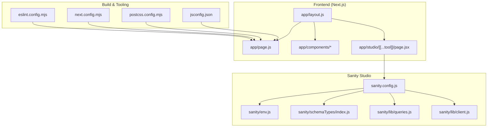
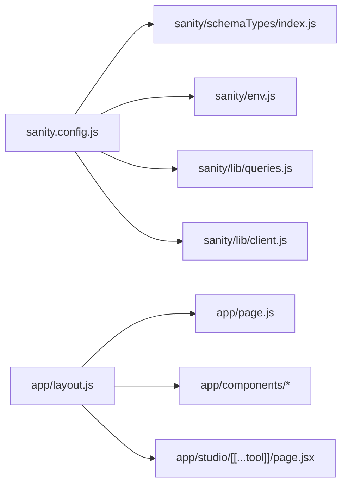

# Contributing Guide

<cite>
**Referenced Files in This Document**
- [README.md](file://README.md)
- [package.json](file://package.json)
- [eslint.config.mjs](file://eslint.config.mjs)
- [next.config.mjs](file://next.config.mjs)
- [postcss.config.mjs](file://postcss.config.mjs)
- [jsconfig.json](file://jsconfig.json)
- [sanity.config.js](file://sanity.config.js)
- [sanity/env.js](file://sanity/env.js)
- [sanity/lib/client.js](file://sanity/lib/client.js)
- [sanity/lib/queries.js](file://sanity/lib/queries.js)
- [sanity/schemaTypes/index.js](file://sanity/schemaTypes/index.js)
- [app/layout.js](file://app/layout.js)
- [app/page.js](file://app/page.js)
- [app/components/Nav.js](file://app/components/Nav.js)
- [app/components/Cursor.js](file://app/components/Cursor.js)
- [app/components/GalleryPage.js](file://app/components/GalleryPage.js)
- [app/components/Lightbox.js](file://app/components/Lightbox.js)
- [app/studio/[[...tool]]/page.jsx](file://app/studio/[[...tool]]/page.jsx)
</cite>

## Table of Contents
1. [Introduction](#introduction)
2. [Project Structure](#project-structure)
3. [Development Environment Setup](#development-environment-setup)
4. [Branching and Commit Workflow](#branching-and-commit-workflow)
5. [Pull Request Procedures](#pull-request-procedures)
6. [Code Review and Quality Standards](#code-review-and-quality-standards)
7. [Testing Strategy](#testing-strategy)
8. [Coding Standards and Formatting](#coding-standards-and-formatting)
9. [Architectural Guidelines](#architectural-guidelines)
10. [Release Process and Versioning](#release-process-and-versioning)
11. [Deployment Procedures](#deployment-procedures)
12. [Documentation Contributions](#documentation-contributions)
13. [Bug Reporting and Feature Requests](#bug-reporting-and-feature-requests)
14. [Community Guidelines and Communication](#community-guidelines-and-communication)
15. [Contribution Templates](#contribution-templates)
16. [Governance Model](#governance-model)
17. [Troubleshooting Guide](#troubleshooting-guide)
18. [Appendices](#appendices)

## Introduction
This guide provides a comprehensive overview of how to contribute effectively to the WRD Photography portfolio project. It covers development workflow, code quality, testing, documentation, releases, and community practices. The project is a Next.js application with integrated Sanity CMS for content management and GSAP for animations.

## Project Structure
The repository combines a frontend Next.js application with a Sanity Studio. Key areas:
- Frontend: Next.js app under the app directory, with shared components and pages.
- Sanity Studio: Mounted at /studio, configured via sanity.config.js and driven by schemaTypes and environment configuration.
- Shared configuration: ESLint, PostCSS/Tailwind, Next.js configuration, and JS path aliases.

**Diagram sources**
- [sanity.config.js:1-29](file://sanity.config.js#L1-L29)
- [sanity/env.js](file://sanity/env.js)
- [sanity/schemaTypes/index.js](file://sanity/schemaTypes/index.js)
- [sanity/lib/queries.js](file://sanity/lib/queries.js)
- [sanity/lib/client.js](file://sanity/lib/client.js)
- [app/studio/[[...tool]]/page.jsx](file://app/studio/[[...tool]]/page.jsx)
- [app/layout.js](file://app/layout.js)
- [app/page.js](file://app/page.js)
- [eslint.config.mjs:1-17](file://eslint.config.mjs#L1-L17)
- [next.config.mjs:1-7](file://next.config.mjs#L1-L7)
- [postcss.config.mjs:1-8](file://postcss.config.mjs#L1-L8)
- [jsconfig.json:1-8](file://jsconfig.json#L1-L8)

**Section sources**
- [README.md:1-37](file://README.md#L1-L37)
- [sanity.config.js:1-29](file://sanity.config.js#L1-L29)
- [sanity/env.js](file://sanity/env.js)
- [sanity/schemaTypes/index.js](file://sanity/schemaTypes/index.js)
- [sanity/lib/queries.js](file://sanity/lib/queries.js)
- [sanity/lib/client.js](file://sanity/lib/client.js)
- [app/studio/[[...tool]]/page.jsx](file://app/studio/[[...tool]]/page.jsx)
- [app/layout.js](file://app/layout.js)
- [app/page.js](file://app/page.js)
- [eslint.config.mjs:1-17](file://eslint.config.mjs#L1-L17)
- [next.config.mjs:1-7](file://next.config.mjs#L1-L7)
- [postcss.config.mjs:1-8](file://postcss.config.mjs#L1-L8)
- [jsconfig.json:1-8](file://jsconfig.json#L1-L8)

## Development Environment Setup
- Prerequisites
  - Node.js and npm (as indicated by package manager metadata).
  - Git for version control.
  - A modern browser for local preview.
- Local development
  - Start the development server using the scripts defined in package.json.
  - Access the application at http://localhost:3000.
  - Sanity Studio is served at /studio.
- Build and lint
  - Use the provided scripts to build and lint the project.
- Path aliases
  - The project uses path aliases configured in jsconfig.json to simplify imports.

**Section sources**
- [README.md:3-37](file://README.md#L3-L37)
- [package.json:1-31](file://package.json#L1-L31)
- [jsconfig.json:1-8](file://jsconfig.json#L1-L8)

## Branching and Commit Workflow
- Branch naming conventions
  - Use imperative, present tense, hyphen-delimited: feat/, fix/, chore/, docs/, refactor/.
  - Examples: feat/add-lightbox, fix/navbar-styling, docs/contributing-guide.
- Commit message standards
  - Type: Short summary
  - Optional body: Context and rationale.
  - Optional footer: Issue links or breaking change notices.
- Pull requests
  - Open PRs against the default branch.
  - Include a clear description, links to related issues, and testing notes.
  - Keep PRs focused and small for easier review.

[No sources needed since this section provides general guidance]

## Pull Request Procedures
- Before opening a PR
  - Ensure your branch is up-to-date with the base branch.
  - Run lint and build locally to catch issues early.
- During review
  - Respond to comments promptly and update the PR accordingly.
  - Add screenshots or short videos for UI-related changes.
- After approval
  - Squash and merge if appropriate; ensure commit messages remain meaningful.

[No sources needed since this section provides general guidance]

## Code Review and Quality Standards
- Code quality checks
  - ESLint enforces Next.js core web vitals and overrides default ignores for project-specific paths.
  - Run lint before submitting changes.
- Accessibility and performance
  - Follow Next.js performance best practices.
  - Ensure animations (GSAP) are optimized and accessible.
- Security
  - Avoid committing secrets; rely on environment configuration for Sanity credentials.

**Section sources**
- [eslint.config.mjs:1-17](file://eslint.config.mjs#L1-L17)

## Testing Strategy
- Unit and integration tests
  - No explicit test runner or test files are present in the repository snapshot.
  - Recommended: Add React Testing Library for component tests and Jest for integration tests.
- Manual testing
  - Verify responsive behavior across devices.
  - Test navigation, lightbox interactions, and Sanity Studio content updates.
- Coverage
  - Aim for critical paths covered by tests; prioritize user-facing components and data fetching logic.

[No sources needed since this section provides general guidance]

## Coding Standards and Formatting
- ESLint configuration
  - Extends Next.js core web vitals and customizes global ignores.
  - Exported as a single config module.
- Formatting
  - Use consistent indentation and spacing; follow existing patterns in the codebase.
- Architectural alignment
  - Respect path aliases and component boundaries.
  - Keep components reusable and self-contained.

**Section sources**
- [eslint.config.mjs:1-17](file://eslint.config.mjs#L1-L17)
- [jsconfig.json:1-8](file://jsconfig.json#L1-L8)

## Architectural Guidelines
- Next.js app directory
  - Pages and components are organized under app; use the recommended file naming and export patterns.
- Sanity integration
  - Sanity Studio is configured centrally and mounted at /studio.
  - Content schemas are defined under sanity/schemaTypes; queries are encapsulated in sanity/lib.
- Build pipeline
  - Tailwind via PostCSS is configured; Next.js handles transpilation and optimization.

**Diagram sources**
- [sanity.config.js:1-29](file://sanity.config.js#L1-L29)
- [sanity/schemaTypes/index.js](file://sanity/schemaTypes/index.js)
- [sanity/env.js](file://sanity/env.js)
- [sanity/lib/queries.js](file://sanity/lib/queries.js)
- [sanity/lib/client.js](file://sanity/lib/client.js)
- [app/layout.js](file://app/layout.js)
- [app/page.js](file://app/page.js)
- [app/studio/[[...tool]]/page.jsx](file://app/studio/[[...tool]]/page.jsx)

**Section sources**
- [sanity.config.js:1-29](file://sanity.config.js#L1-L29)
- [sanity/schemaTypes/index.js](file://sanity/schemaTypes/index.js)
- [sanity/env.js](file://sanity/env.js)
- [sanity/lib/queries.js](file://sanity/lib/queries.js)
- [sanity/lib/client.js](file://sanity/lib/client.js)
- [app/layout.js](file://app/layout.js)
- [app/page.js](file://app/page.js)
- [app/studio/[[...tool]]/page.jsx](file://app/studio/[[...tool]]/page.jsx)

## Release Process and Versioning
- Versioning
  - Semantic versioning is recommended; current project version is set in package.json.
- Release workflow
  - Tag releases after merging approved PRs.
  - Update CHANGELOG entries summarizing changes.
- CI/CD
  - Integrate automated linting and builds in CI; enforce passing checks before merging.

[No sources needed since this section provides general guidance]

## Deployment Procedures
- Vercel deployment
  - The project is compatible with Vercel; follow the official Next.js deployment documentation.
- Sanity Studio
  - Deploy Sanity Studio alongside the Next.js app; ensure environment variables are configured in the hosting platform.
- Preview deployments
  - Use preview branches for review deployments during long-running feature work.

**Section sources**
- [README.md:32-37](file://README.md#L32-L37)

## Documentation Contributions
- Types of contributions
  - Improve existing docs, add inline code comments, or create new guides.
- Style
  - Keep documentation concise, actionable, and aligned with the project’s tone.
- Review
  - Treat documentation changes like code changes: small, focused PRs with clear descriptions.

[No sources needed since this section provides general guidance]

## Bug Reporting and Feature Requests
- Bug reports
  - Include steps to reproduce, expected vs. actual behavior, environment details, and screenshots/videos when applicable.
- Feature requests
  - Describe the problem being solved and proposed solution; include acceptance criteria if possible.
- Labels
  - Use labels like bug, enhancement, help wanted, and good first issue to categorize and triage.

[No sources needed since this section provides general guidance]

## Community Guidelines and Communication
- Be respectful and inclusive in discussions.
- Use dedicated channels for announcements, questions, and coordination.
- Recognize maintainers’ efforts and provide constructive feedback.

[No sources needed since this section provides general guidance]

## Contribution Templates
- Bug fix
  - Summary: Briefly describe the issue and fix.
  - Steps to reproduce: List exact steps to observe the problem.
  - Root cause: Explain what went wrong.
  - Fix approach: Describe the minimal change to resolve it.
  - Testing: Outline manual verification steps.
- Feature addition
  - Problem: What user need does this address?
  - Proposed solution: High-level design and implementation plan.
  - Breaking changes: Any API or behavior changes?
  - Testing: How will this be tested?
- Documentation improvement
  - Which file(s) are affected?
  - What is the change and why is it helpful?
  - Any related issues or PRs?

[No sources needed since this section provides general guidance]

## Governance Model
- Decision-making
  - Core maintainers review and merge contributions; major changes may require consensus or maintainer approval.
- Roles
  - Contributors: propose changes via PRs.
  - Maintainers: review, approve, and merge PRs.
- Consensus-building
  - For significant changes, encourage discussion and iterate on proposals.

[No sources needed since this section provides general guidance]

## Troubleshooting Guide
- Local server fails to start
  - Ensure Node.js and npm versions satisfy project requirements; clear node_modules and reinstall if needed.
- ESLint errors
  - Run the linter locally and address reported issues; confirm your editor is configured to use the project’s ESLint config.
- Sanity Studio issues
  - Verify environment variables and dataset configuration; ensure the Sanity CLI is installed and authenticated.
- Build failures
  - Check for missing dependencies and resolve TypeScript/JSX errors; rebuild after fixing.

**Section sources**
- [package.json:1-31](file://package.json#L1-L31)
- [eslint.config.mjs:1-17](file://eslint.config.mjs#L1-L17)
- [sanity/env.js](file://sanity/env.js)

## Appendices
- Quick reference
  - Development: npm run dev
  - Build: npm run build
  - Lint: npm run lint
  - Path aliases: @/*
  - Sanity Studio: /studio

**Section sources**
- [README.md:3-17](file://README.md#L3-L17)
- [package.json:5-10](file://package.json#L5-L10)
- [jsconfig.json:3-5](file://jsconfig.json#L3-L5)