# About Page Implementation

<cite>
**Referenced Files in This Document**
- [AboutPage.js](file://app/components/AboutPage.js)
- [page.js](file://app/page.js)
- [layout.js](file://app/layout.js)
- [globals.css](file://app/globals.css)
- [Nav.js](file://app/components/Nav.js)
- [aboutPage.js](file://sanity/schemaTypes/aboutPage.js)
- [queries.js](file://sanity/lib/queries.js)
- [client.js](file://sanity/lib/client.js)
- [image.js](file://sanity/lib/image.js)
- [live.js](file://sanity/lib/live.js)
- [package.json](file://package.json)
</cite>

## Table of Contents
1. [Introduction](#introduction)
2. [Project Structure](#project-structure)
3. [Core Components](#core-components)
4. [Architecture Overview](#architecture-overview)
5. [Detailed Component Analysis](#detailed-component-analysis)
6. [Content Management Integration](#content-management-integration)
7. [Responsive Design Patterns](#responsive-design-patterns)
8. [Image Optimization and Loading Strategies](#image-optimization-and-loading-strategies)
9. [Accessibility Features](#accessibility-features)
10. [Customization Guide](#customization-guide)
11. [Performance Considerations](#performance-considerations)
12. [Troubleshooting Guide](#troubleshooting-guide)
13. [Conclusion](#conclusion)

## Introduction

The WRD Photography portfolio website features a sophisticated about page implementation that combines artistic storytelling with modern web technologies. This documentation covers the complete implementation of the about page, including artist biography display, philosophy sections, and responsive collage layouts. The page integrates seamlessly with Sanity CMS for content management while delivering exceptional visual experiences through advanced animations and responsive design patterns.

The about page serves as a digital showcase for WRD Photography's artistic philosophy and approach to street and rural photography in Cambodia, utilizing sophisticated animation libraries and custom typography to create an immersive user experience.

## Project Structure

The about page implementation follows a modular architecture with clear separation of concerns between presentation, content management, and styling:

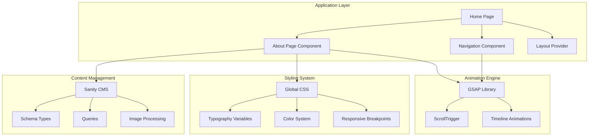

**Diagram sources**
- [AboutPage.js:1-458](file://app/components/AboutPage.js#L1-L458)
- [page.js:1-227](file://app/page.js#L1-L227)
- [layout.js:1-40](file://app/layout.js#L1-L40)

**Section sources**
- [AboutPage.js:1-458](file://app/components/AboutPage.js#L1-L458)
- [page.js:1-227](file://app/page.js#L1-L227)
- [layout.js:1-40](file://app/layout.js#L1-L40)

## Core Components

The about page implementation consists of several interconnected components that work together to deliver a cohesive user experience:

### Hero Section Component
The hero section serves as the primary visual introduction, featuring a parallax image effect with animated typography. It implements a sophisticated reveal sequence using GSAP animations for both text and imagery.

### Philosophy Section
This section presents the photographer's artistic philosophy through a prominent quote with custom typography treatment and decorative elements.

### Photo Collage System
A responsive three-column collage layout that adapts to different screen sizes while maintaining visual balance and aesthetic appeal.

### Approach Section
A three-part approach presentation showcasing the photographer's methodology across different subjects and contexts.

### Call-to-Action Section
A centered section with animated buttons and contact information designed to encourage engagement and conversion.

**Section sources**
- [AboutPage.js:202-427](file://app/components/AboutPage.js#L202-L427)

## Architecture Overview

The about page follows a data-driven architecture pattern that separates content management from presentation logic:

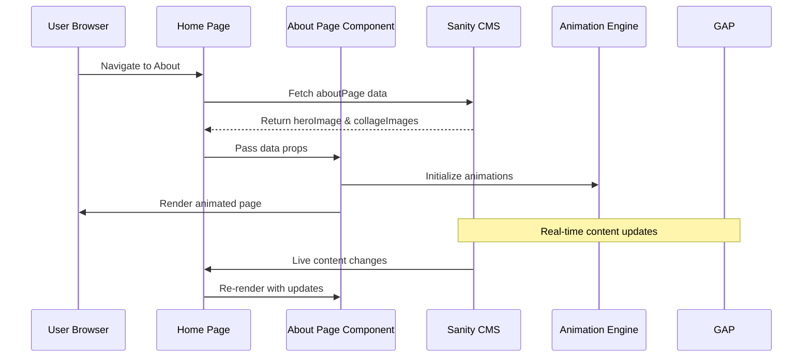

**Diagram sources**
- [page.js:106-131](file://app/page.js#L106-L131)
- [aboutPageQuery:27-32](file://sanity/lib/queries.js#L27-L32)
- [AboutPage.js:11-162](file://app/components/AboutPage.js#L11-L162)

The architecture ensures real-time content updates through Sanity's live content API while maintaining smooth user interactions through optimized animation rendering.

**Section sources**
- [page.js:106-131](file://app/page.js#L106-L131)
- [live.js:1-10](file://sanity/lib/live.js#L1-L10)

## Detailed Component Analysis

### Hero Section Implementation

The hero section employs advanced animation techniques to create a cinematic introduction:

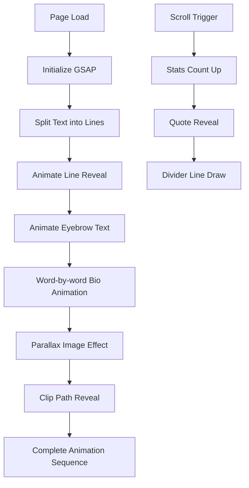

**Diagram sources**
- [AboutPage.js:23-93](file://app/components/AboutPage.js#L23-L93)

The hero section utilizes a 55%/45% grid layout with a parallax image effect that creates depth and visual interest. The typography system employs custom fonts with CSS clamp units for responsive sizing.

**Section sources**
- [AboutPage.js:203-256](file://app/components/AboutPage.js#L203-L256)

### Philosophy Section Design

The philosophy section presents the photographer's artistic approach through carefully crafted typography and visual elements:

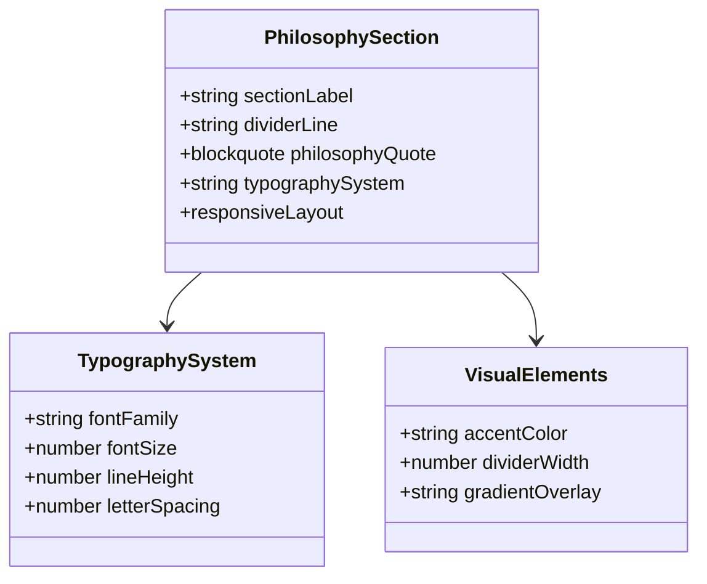

**Diagram sources**
- [AboutPage.js:259-282](file://app/components/AboutPage.js#L259-L282)

The philosophy quote uses a custom italic serif font with careful letter spacing adjustments and emphasizes key terms through color highlighting.

**Section sources**
- [AboutPage.js:259-282](file://app/components/AboutPage.js#L259-L282)

### Photo Collage Layout System

The collage system implements a sophisticated responsive grid with custom height calculations and spacing:

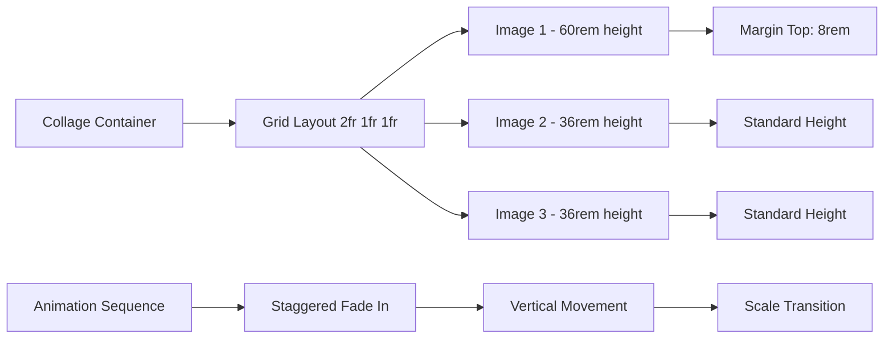

**Diagram sources**
- [AboutPage.js:284-303](file://app/components/AboutPage.js#L284-L303)
- [AboutPage.js:181-197](file://app/components/AboutPage.js#L181-L197)

The collage layout uses CSS Grid with flexible column ratios and individual height specifications to create visual rhythm and balance.

**Section sources**
- [AboutPage.js:284-303](file://app/components/AboutPage.js#L284-L303)

### Approach Section Implementation

The approach section presents three distinct photography methodologies through a structured grid layout:

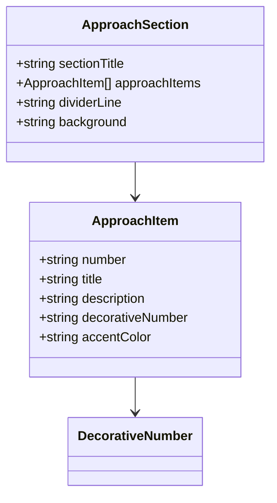

**Diagram sources**
- [AboutPage.js:306-363](file://app/components/AboutPage.js#L306-L363)

Each approach item includes a floating decorative number, structured content hierarchy, and visual separators that create a cohesive reading experience.

**Section sources**
- [AboutPage.js:306-363](file://app/components/AboutPage.js#L306-L363)

### Call-to-Action Section

The CTA section employs sophisticated hover effects and magnetic button animations:

```mermaid
stateDiagram-v2
[*] --> Idle
Idle --> Hover : Mouse Enter
Hover --> Magnetic : Mouse Move
Magnetic --> Hover : Mouse Leave
Hover --> Click : Button Press
Click --> [*]
state Magnetic {
[*] --> CalculatePosition
CalculatePosition --> ApplyTransform
ApplyTransform --> [*]
}
```

**Diagram sources**
- [AboutPage.js:164-174](file://app/components/AboutPage.js#L164-L174)
- [AboutPage.js:365-427](file://app/components/AboutPage.js#L365-L427)

The magnetic button effect calculates mouse position relative to button boundaries and applies proportional transforms for a subtle interactive experience.

**Section sources**
- [AboutPage.js:164-174](file://app/components/AboutPage.js#L164-L174)
- [AboutPage.js:365-427](file://app/components/AboutPage.js#L365-L427)

## Content Management Integration

The about page integrates seamlessly with Sanity CMS through a comprehensive content management system:

### Schema Definition

The about page schema defines the content structure with precise field specifications:

| Field Name | Type | Options | Description |
|------------|------|---------|-------------|
| heroImage | Image | hotspot: true | Primary hero image for the about page |
| collageImages | Array of Images | max: 3, hotspot: true | Three images for the collage section |

### Data Fetching Strategy

The application uses a concurrent data fetching approach to optimize performance:

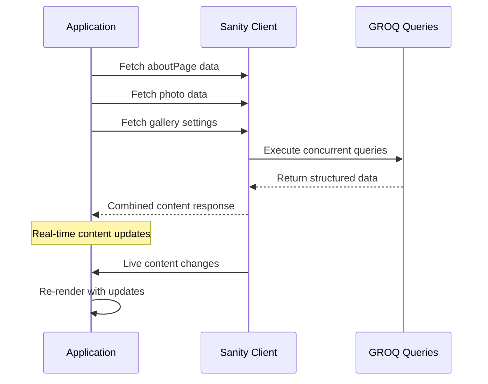

**Diagram sources**
- [page.js:110-126](file://app/page.js#L110-L126)
- [aboutPageQuery:27-32](file://sanity/lib/queries.js#L27-L32)

### Live Content Updates

The implementation supports real-time content updates through Sanity's live content API:

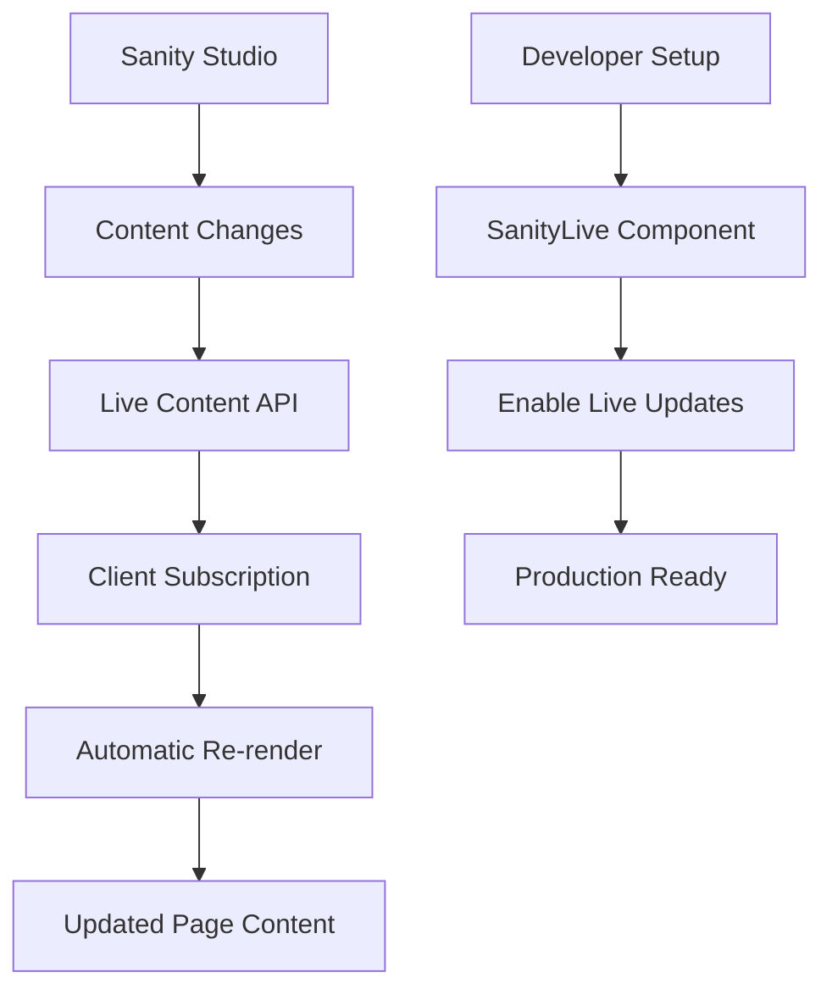

**Diagram sources**
- [live.js:1-10](file://sanity/lib/live.js#L1-L10)

**Section sources**
- [aboutPage.js:1-27](file://sanity/schemaTypes/aboutPage.js#L1-L27)
- [queries.js:27-32](file://sanity/lib/queries.js#L27-L32)
- [page.js:110-126](file://app/page.js#L110-L126)

## Responsive Design Patterns

The about page implements sophisticated responsive design patterns that ensure optimal display across all devices and orientations:

### Breakpoint Strategy

The design system employs strategic breakpoints for different content areas:

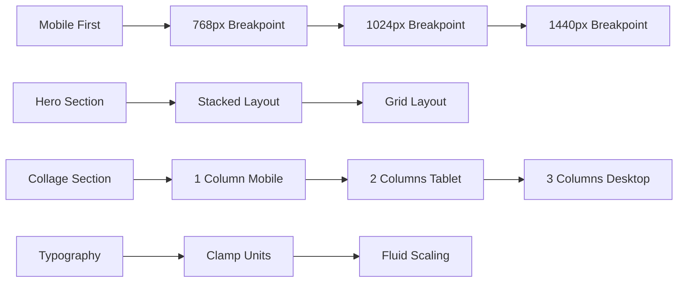

**Diagram sources**
- [AboutPage.js:203-256](file://app/components/AboutPage.js#L203-L256)
- [AboutPage.js:284-303](file://app/components/AboutPage.js#L284-L303)

### Fluid Typography System

The typography system uses CSS clamp units for fluid scaling:

| Element | Mobile Size | Desktop Size | Fluid Range |
|---------|-------------|--------------|-------------|
| Hero Title | 5rem | 7rem | 5rem - 7rem |
| Philosophy Quote | 2.5rem | 3.8rem | 2.5rem - 3.8rem |
| Approach Titles | 2.2rem | 4.5rem | 2.2rem - 4.5rem |
| CTA Title | 3.5rem | 6rem | 3.5rem - 6rem |

### Grid Layout Adaptations

The grid system adapts dynamically based on viewport size:

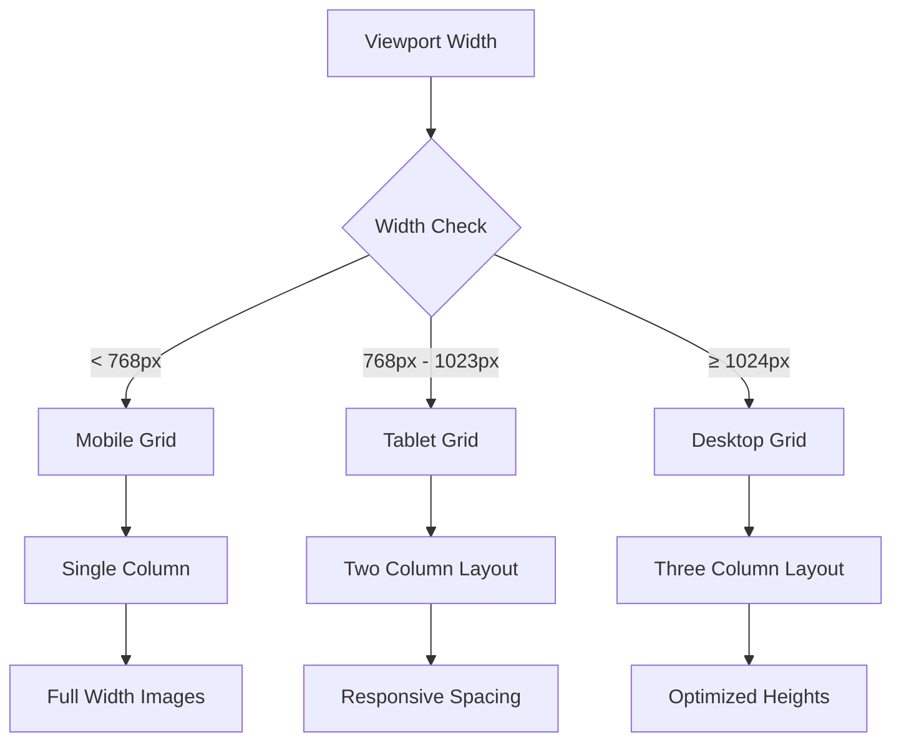

**Diagram sources**
- [AboutPage.js:284-303](file://app/components/AboutPage.js#L284-L303)

**Section sources**
- [AboutPage.js:203-256](file://app/components/AboutPage.js#L203-L256)
- [AboutPage.js:284-303](file://app/components/AboutPage.js#L284-L303)

## Image Optimization and Loading Strategies

The about page implements comprehensive image optimization techniques for optimal performance:

### Image Processing Pipeline

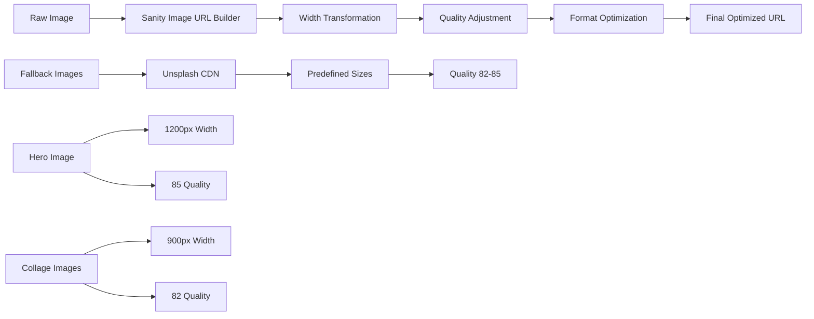

**Diagram sources**
- [AboutPage.js:176-197](file://app/components/AboutPage.js#L176-L197)
- [image.js:6-8](file://sanity/lib/image.js#L6-L8)

### Progressive Loading Implementation

The page employs sophisticated loading strategies:

| Image Type | Loading Strategy | Performance Benefits |
|------------|------------------|---------------------|
| Hero Image | Lazy Load with Intersection Observer | Faster initial page load |
| Collage Images | Staggered Loading | Improved perceived performance |
| Fallback Images | Preloaded CDN Images | Reduced loading errors |
| Background Images | CSS Gradients | Instant visual feedback |

### Accessibility-First Image Handling

The implementation prioritizes accessibility through:

- Semantic alt text for all images
- Proper aspect ratio maintenance
- Color contrast compliance for overlay text
- Responsive image serving based on viewport

**Section sources**
- [AboutPage.js:176-197](file://app/components/AboutPage.js#L176-L197)
- [image.js:1-9](file://sanity/lib/image.js#L1-L9)

## Accessibility Features

The about page incorporates comprehensive accessibility features to ensure inclusive user experiences:

### Keyboard Navigation

The navigation system supports full keyboard interaction:

- Tab navigation through all interactive elements
- Focus indicators for screen reader users
- Keyboard shortcuts for main navigation
- Skip links for efficient navigation

### Screen Reader Optimization

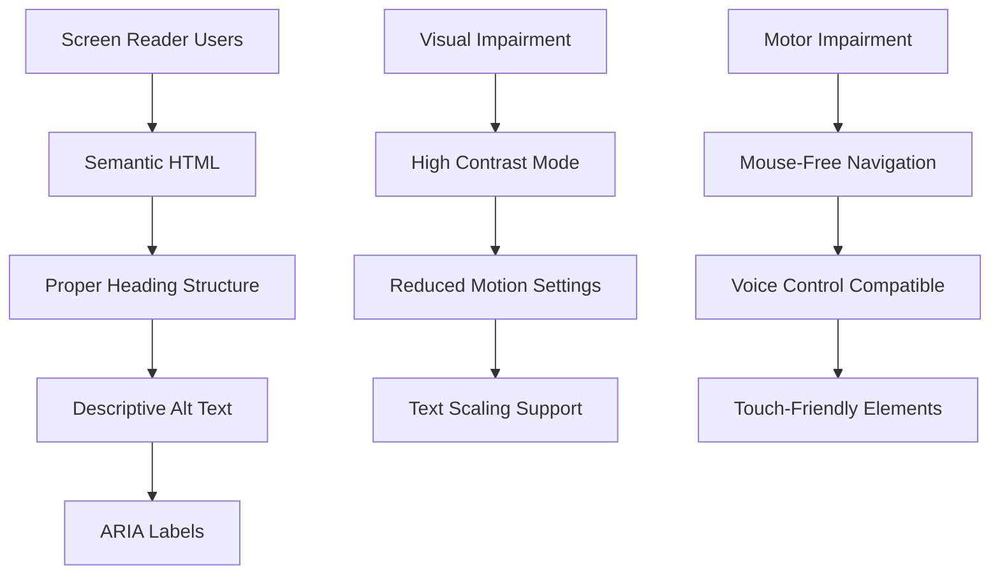

**Diagram sources**
- [Nav.js:133-162](file://app/components/Nav.js#L133-L162)

### Motion Control Features

The implementation respects user preferences for motion:

- Reduced motion mode support
- Smooth animation alternatives
- User-controlled animation timing
- Alternative interaction methods

**Section sources**
- [Nav.js:70-83](file://app/components/Nav.js#L70-L83)
- [globals.css:81-83](file://app/globals.css#L81-L83)

## Customization Guide

### Adding New Content Sections

To add new content sections to the about page:

1. **Define Schema Fields**: Extend the aboutPage schema with new field definitions
2. **Update Data Fetching**: Add new queries to the queries.js file
3. **Implement Component Logic**: Add new section rendering in AboutPage.js
4. **Configure Animations**: Add GSAP animations for the new section
5. **Test Responsiveness**: Verify layout adaptation across breakpoints

### Modifying Visual Presentation

Customization options include:

- **Typography Changes**: Modify font families and sizing in globals.css
- **Color Scheme**: Update CSS variables in :root section
- **Animation Timing**: Adjust GSAP duration and easing parameters
- **Layout Grid**: Modify CSS Grid properties for different layouts
- **Spacing Systems**: Update margin and padding values consistently

### Extending the Collage System

To modify the collage layout:

1. **Adjust Grid Template**: Change the CSS Grid definition in the collage section
2. **Modify Height Calculations**: Update the collageLayout array values
3. **Add More Images**: Extend the collageImages array in the schema
4. **Update Animation Logic**: Modify the staggered animation sequence
5. **Test Responsiveness**: Ensure proper adaptation across devices

**Section sources**
- [aboutPage.js:181-197](file://app/components/AboutPage.js#L181-L197)
- [globals.css:5-28](file://app/globals.css#L5-L28)

## Performance Considerations

The about page implementation prioritizes performance through several optimization strategies:

### Bundle Size Optimization

- Dynamic imports for animation libraries
- Code splitting for component loading
- Lazy loading for non-critical resources
- Tree shaking for unused code elimination

### Rendering Performance

- GSAP ScrollTrigger for hardware-accelerated animations
- CSS transforms instead of layout-affecting properties
- Efficient DOM manipulation through React refs
- Debounced scroll event handling

### Network Optimization

- CDN-hosted fallback images
- Optimized image quality settings
- Concurrent data fetching
- Minimal third-party dependencies

**Section sources**
- [package.json:11-22](file://package.json#L11-L22)
- [AboutPage.js:15-18](file://app/components/AboutPage.js#L15-L18)

## Troubleshooting Guide

### Common Issues and Solutions

**Animation Not Working**
- Verify GSAP library imports are successful
- Check for proper element references in useEffect
- Ensure ScrollTrigger plugin is registered correctly

**Images Not Loading**
- Confirm Sanity project ID and dataset configuration
- Verify image URLs are generated correctly
- Check network connectivity to CDN services

**Responsive Layout Problems**
- Review CSS Grid properties and media queries
- Test breakpoint values across different devices
- Verify viewport meta tag configuration

**Content Not Updating**
- Ensure live content API is properly configured
- Check Sanity studio publishing status
- Verify client-side caching settings

### Debugging Tools

The implementation includes built-in debugging capabilities:

- Console logging for animation initialization
- Error boundaries for component failures
- Performance monitoring for animation frames
- Network request tracking for content loading

**Section sources**
- [AboutPage.js:11-162](file://app/components/AboutPage.js#L11-L162)
- [client.js:4-9](file://sanity/lib/client.js#L4-L9)

## Conclusion

The WRD Photography about page represents a sophisticated blend of artistic vision and technical excellence. Through careful implementation of responsive design patterns, advanced animation systems, and seamless content management integration, the page delivers an immersive experience that authentically represents the photographer's work and philosophy.

The modular architecture ensures maintainability and extensibility, while the performance optimizations guarantee smooth interactions across all devices. The integration with Sanity CMS provides content creators with intuitive tools for managing and updating the site's content in real-time.

This implementation serves as a comprehensive example of modern web development practices, combining aesthetic considerations with technical excellence to create a truly exceptional user experience.