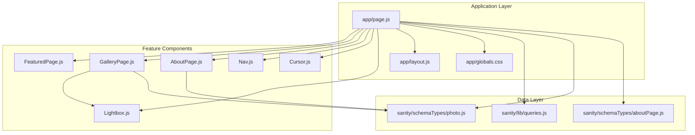
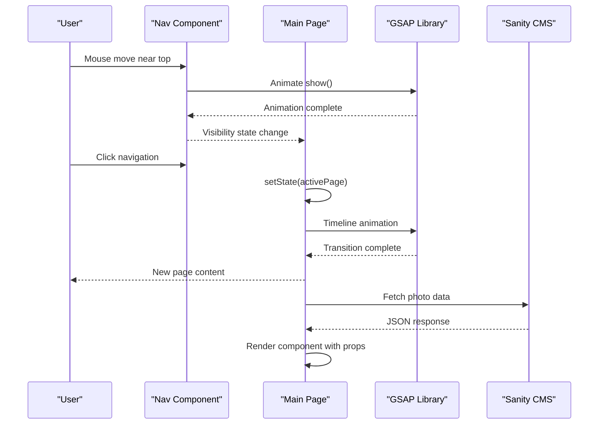
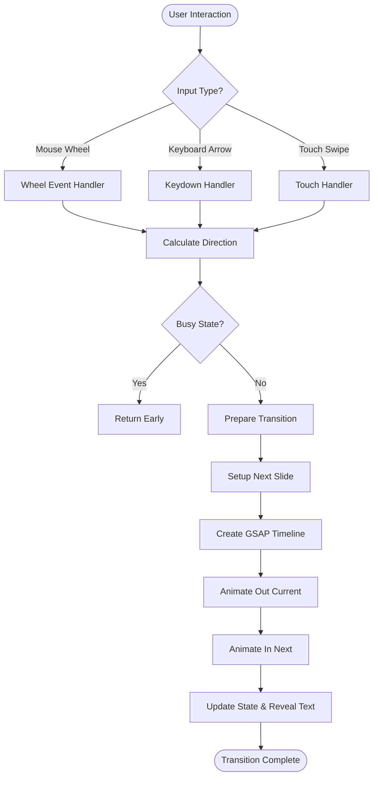
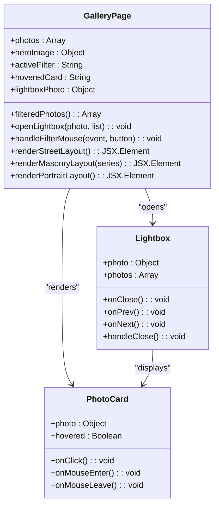
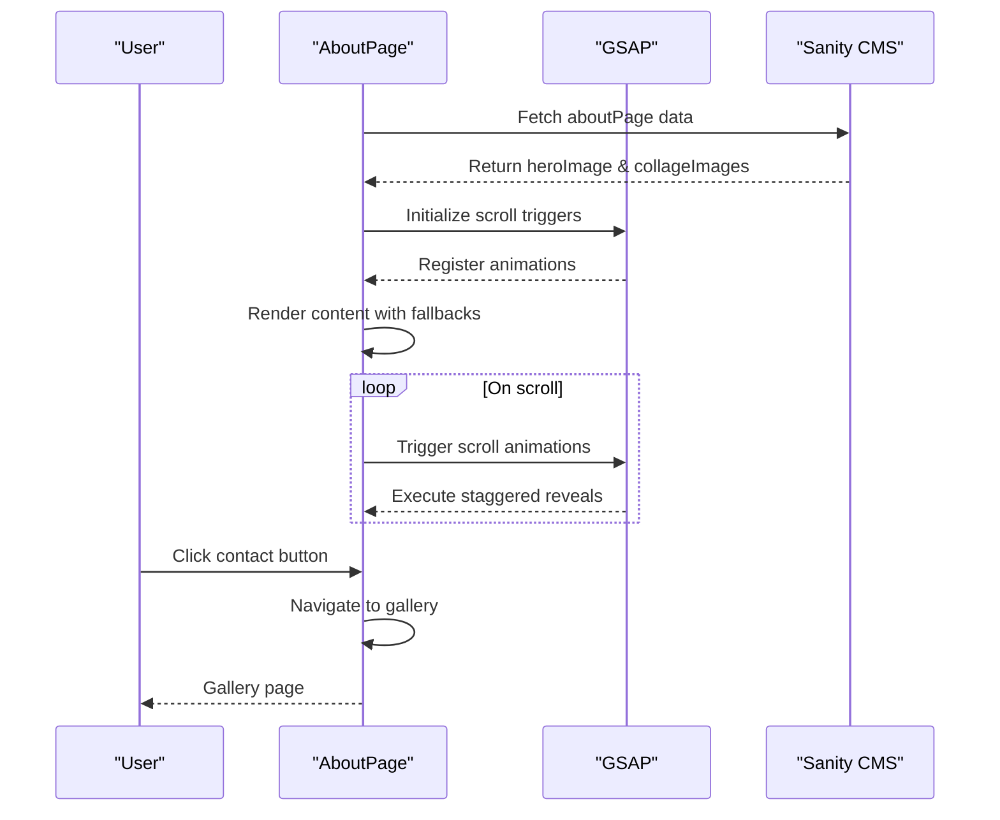
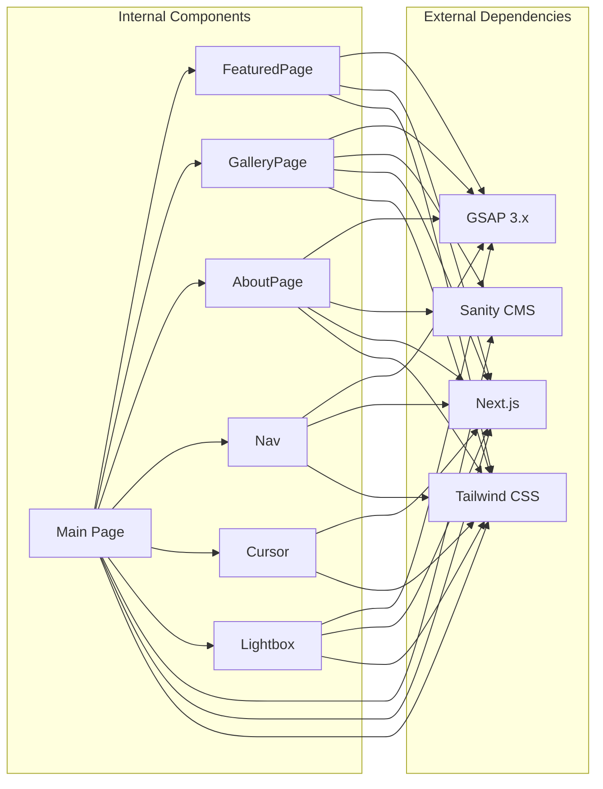

# Core Features Implementation

<cite>
**Referenced Files in This Document**
- [FeaturedPage.js](file://app/components/FeaturedPage.js)
- [GalleryPage.js](file://app/components/GalleryPage.js)
- [AboutPage.js](file://app/components/AboutPage.js)
- [Nav.js](file://app/components/Nav.js)
- [Cursor.js](file://app/components/Cursor.js)
- [Lightbox.js](file://app/components/Lightbox.js)
- [page.js](file://app/page.js)
- [layout.js](file://app/layout.js)
- [globals.css](file://app/globals.css)
- [queries.js](file://sanity/lib/queries.js)
- [photo.js](file://sanity/schemaTypes/photo.js)
- [aboutPage.js](file://sanity/schemaTypes/aboutPage.js)
</cite>

## Table of Contents
1. [Introduction](#introduction)
2. [Project Structure](#project-structure)
3. [Core Components](#core-components)
4. [Architecture Overview](#architecture-overview)
5. [Detailed Component Analysis](#detailed-component-analysis)
6. [Dependency Analysis](#dependency-analysis)
7. [Performance Considerations](#performance-considerations)
8. [Accessibility Implementation](#accessibility-implementation)
9. [Troubleshooting Guide](#troubleshooting-guide)
10. [Conclusion](#conclusion)

## Introduction
This document provides comprehensive technical documentation for the core feature implementations in the WRD Photography portfolio. The system consists of four primary interactive experiences: a featured photo slideshow with sophisticated navigation and text reveal effects, a multi-layout gallery showcasing different photographic series, an artist biography page with responsive collage layouts, and a navigation system with animated transitions and theme switching. Each feature integrates advanced animation patterns using GSAP, responsive design principles, and accessibility considerations.

## Project Structure
The portfolio follows a Next.js application structure with a clear separation between client-side components, server-side data fetching, and shared styling. The architecture emphasizes modular components with specialized responsibilities:

**Diagram sources**
- [page.js:14-227](file://app/page.js#L14-L227)
- [layout.js:31-39](file://app/layout.js#L31-L39)

**Section sources**
- [page.js:14-227](file://app/page.js#L14-L227)
- [layout.js:31-39](file://app/layout.js#L31-L39)

## Core Components

### Featured Photo Slideshow System
The featured slideshow implements a sophisticated single-page photo presentation with multiple interaction modes and text reveal animations.

**Navigation Logic:**
- Wheel-based navigation with momentum-based direction detection
- Keyboard arrow key support for desktop users
- Bidirectional infinite looping with modulo arithmetic
- Busy state management prevents concurrent animations

**Animation Sequences:**
- Pre-animation text reveal using staggered timeline
- Cross-fade transitions with parallax background effects
- Transform-based transitions with rotation and scaling
- Counter element synchronization during transitions

**Text Reveal Effects:**
- Multi-line typography with individual character positioning
- Staggered entrance animations with easing curves
- Gradient overlays for text readability
- Responsive typography scaling

**Section sources**
- [FeaturedPage.js:6-105](file://app/components/FeaturedPage.js#L6-L105)
- [FeaturedPage.js:118-268](file://app/components/FeaturedPage.js#L118-L268)

### Multi-Layout Gallery System
The gallery implements four distinct photographic layouts with specialized interaction patterns:

**Horizontal Street Strip:**
- Horizontal scrolling with pinned sections
- Parallax background effects during scroll
- Magnetic hover interactions with transform-based movement
- Responsive card sizing with aspect ratio preservation

**Masonry Rural/Landscape Grids:**
- CSS column-based masonry layouts
- Staggered reveal animations with scroll triggers
- Word-by-word text splitting for headline animations
- Hover state transitions with gradient overlays

**Portrait Grid Layout:**
- Responsive grid with auto-fill minmax sizing
- Pinned section headers with scroll-triggered animations
- Large-format portrait presentations
- Consistent hover behavior across all layouts

**Filter System:**
- Magnetic filter buttons with proximity-based transforms
- Real-time layout updates with ScrollTrigger cleanup
- Dynamic content filtering based on series categories
- Visual feedback for active filters

**Section sources**
- [GalleryPage.js:6-220](file://app/components/GalleryPage.js#L6-L220)
- [GalleryPage.js:348-760](file://app/components/GalleryPage.js#L348-L760)

### About Page Implementation
The about page combines biographical content with artistic philosophy and responsive collage layouts:

**Artist Biography Display:**
- Hero section with split-line typography animations
- Word-by-word reveal for biographical text
- Parallax image effects with clipping path animations
- Statistic counters with smooth number progression

**Philosophy Sections:**
- Quote block with staggered word animations
- Decorative divider line animations
- Approach methodology presentation with numbered sections
- Call-to-action with interactive button states

**Responsive Collage Layouts:**
- Flexible grid system with responsive column ratios
- Height-based image arrangement with margin offsets
- Fallback image handling for missing content
- Consistent typography scales across different screen sizes

**Section sources**
- [AboutPage.js:5-162](file://app/components/AboutPage.js#L5-L162)
- [AboutPage.js:199-458](file://app/components/AboutPage.js#L199-L458)

### Navigation System
The navigation component provides animated transitions, mouse proximity detection, and theme switching capabilities:

**Animated Transitions:**
- Initial entrance animation with delayed hide functionality
- Mouse move detection with proximity thresholds
- Automatic hiding when cursor leaves viewport area
- Smooth opacity and transform transitions

**Mouse Proximity Detection:**
- Threshold-based show/hide logic with configurable sensitivity
- Debounced animation triggers to prevent flickering
- State management for visibility persistence
- Performance-optimized event handling

**Theme Switching Capabilities:**
- Local storage persistence for user preferences
- System preference detection with fallback mechanisms
- CSS custom property-based theme switching
- SVG icon representation for both themes

**Section sources**
- [Nav.js:4-83](file://app/components/Nav.js#L4-L83)
- [Nav.js:91-167](file://app/components/Nav.js#L91-L167)

### Custom Cursor Effects
The cursor system implements sophisticated tracking and hover state management:

**Tracking Mechanics:**
- Separate cursor and ring elements with different animation delays
- GSAP-based smooth following with overwrite protection
- Fixed positioning with transform-based centering
- Blend mode integration for visual contrast

**Interactive States:**
- Pointer events disabled to prevent interference with page elements
- Z-index management for proper layering
- Transition-based size adjustments for hover states
- Performance optimization through animation overwriting

**Section sources**
- [Cursor.js:5-41](file://app/components/Cursor.js#L5-L41)

### Lightbox System
The lightbox provides modal photo viewing with sophisticated entrance and exit animations:

**Entrance Animations:**
- Multi-element timeline with staggered reveals
- Overlay fade with image scale and position transitions
- Info panel slide-up with opacity transitions
- Navigation button appearance with rotation effects

**Interaction Handling:**
- Keyboard navigation support (Escape, Arrow keys)
- Click-outside-to-close functionality
- Previous/next navigation with image swap animations
- Responsive counter display with formatted indices

**Section sources**
- [Lightbox.js:5-90](file://app/components/Lightbox.js#L5-L90)
- [Lightbox.js:97-302](file://app/components/Lightbox.js#L97-L302)

## Architecture Overview

**Diagram sources**
- [Nav.js:27-49](file://app/components/Nav.js#L27-L49)
- [page.js:136-145](file://app/page.js#L136-L145)

The architecture follows a reactive pattern with centralized state management in the main page component, component-specific animation orchestration using GSAP, and data fetching from Sanity CMS. The system maintains performance through lazy loading of heavy libraries and efficient animation composition.

**Section sources**
- [page.js:14-227](file://app/page.js#L14-L227)
- [Nav.js:10-49](file://app/components/Nav.js#L10-L49)

## Detailed Component Analysis

### Featured Slideshow Animation Flow

**Diagram sources**
- [FeaturedPage.js:56-105](file://app/components/FeaturedPage.js#L56-L105)

The slideshow implements a robust state machine with busy-state prevention, directional calculation, and coordinated animation timing. The text reveal system uses staggered timelines to create a cinematic effect while maintaining performance through GSAP's optimized rendering pipeline.

**Section sources**
- [FeaturedPage.js:36-54](file://app/components/FeaturedPage.js#L36-L54)
- [FeaturedPage.js:73-105](file://app/components/FeaturedPage.js#L73-L105)

### Gallery Layout System Architecture

**Diagram sources**
- [GalleryPage.js:6-25](file://app/components/GalleryPage.js#L6-L25)
- [Lightbox.js:5-12](file://app/components/Lightbox.js#L5-L12)

The gallery system demonstrates a clean separation of concerns with the main component managing state and layout decisions, while the lightbox handles modal presentation. The magnetic filter system showcases proximity-based interactions that enhance user engagement without disrupting normal page functionality.

**Section sources**
- [GalleryPage.js:39-49](file://app/components/GalleryPage.js#L39-L49)
- [GalleryPage.js:222-232](file://app/components/GalleryPage.js#L222-L232)

### About Page Content Management

**Diagram sources**
- [AboutPage.js:11-162](file://app/components/AboutPage.js#L11-L162)
- [page.js:106-131](file://app/page.js#L106-L131)

The about page implements a sophisticated scroll-driven animation system that coordinates multiple elements simultaneously. The content management approach ensures graceful degradation when Sanity content is unavailable, maintaining a professional presentation through fallback images and placeholder content.

**Section sources**
- [AboutPage.js:176-197](file://app/components/AboutPage.js#L176-L197)
- [queries.js:27-32](file://sanity/lib/queries.js#L27-L32)

## Dependency Analysis

**Diagram sources**
- [package.json](file://package.json)
- [page.js:1-12](file://app/page.js#L1-L12)

The dependency graph reveals a well-structured system where animation logic is centralized through GSAP while content management relies on Sanity CMS. The Next.js framework provides the foundation for server-side rendering and client-side hydration, enabling optimal performance across all interactive features.

**Section sources**
- [package.json](file://package.json)

## Performance Considerations

### Animation Performance Optimization
- **GSAP Overwrite Protection**: All cursor and navigation animations use overwrite protection to prevent queue buildup during rapid interactions
- **will-change Property**: Strategic use of will-change for transform properties to leverage GPU acceleration
- **Transform vs. Position**: Prefer transform-based animations over changing layout-affecting properties
- **Animation Cleanup**: Proper cleanup of ScrollTrigger instances to prevent memory leaks

### Memory Management
- **Lazy Loading**: Heavy libraries (GSAP, ScrollTrigger) are dynamically imported only when needed
- **Component Unmounting**: Proper event listener cleanup in useEffect return functions
- **State Optimization**: Minimal state updates to reduce re-render cycles

### Rendering Performance
- **CSS Custom Properties**: Theme switching uses CSS custom properties for instant visual updates
- **Hardware Acceleration**: Transform and opacity animations utilize GPU acceleration
- **Reduced Motion Support**: Media query integration for reduced motion preferences

### Data Fetching Optimization
- **Parallel Requests**: Multiple Sanity queries executed concurrently using Promise.all
- **Selective Loading**: Dynamic imports for feature components to reduce initial bundle size
- **Content Delivery**: Optimized image URLs with quality and dimension parameters

**Section sources**
- [Cursor.js:14-21](file://app/components/Cursor.js#L14-L21)
- [GalleryPage.js:215-219](file://app/components/GalleryPage.js#L215-L219)
- [page.js:106-131](file://app/page.js#L106-L131)

## Accessibility Implementation

### Keyboard Navigation
- **Slideshow Controls**: Arrow keys provide navigation in both directions
- **Lightbox Navigation**: Arrow keys for previous/next, Escape for close
- **Filter Buttons**: Tab navigation with clear focus indicators
- **Navigation Links**: Full keyboard accessibility for all interactive elements

### Screen Reader Support
- **Semantic HTML**: Proper heading hierarchy and landmark roles
- **ARIA Labels**: Descriptive labels for theme toggle button
- **Focus Management**: Logical tab order and focus restoration
- **Content Alternatives**: Alt text for all decorative images

### Motion Preferences
- **Reduced Motion**: Media query detection for reduced motion user preferences
- **Custom Properties**: CSS custom properties enable theme-based accessibility
- **Animation Control**: Graceful degradation when animations are disabled

### Color Contrast
- **Theme Variants**: Both dark and light themes meet WCAG contrast guidelines
- **Dynamic Updates**: Theme switching maintains accessibility standards
- **Visual Indicators**: Clear visual feedback for interactive states

### Responsive Design
- **Touch Targets**: Minimum 44px touch targets for mobile interaction
- **Typography Scaling**: Fluid typography with appropriate line heights
- **Viewport Units**: Relative units for consistent scaling across devices

**Section sources**
- [Nav.js:133-144](file://app/components/Nav.js#L133-L144)
- [globals.css:81-83](file://app/globals.css#L81-L83)
- [globals.css:30-49](file://app/globals.css#L30-L49)

## Troubleshooting Guide

### Common Issues and Solutions

**GSAP Not Loading**
- Verify dynamic imports are executing correctly
- Check for network errors in browser dev tools
- Ensure proper cleanup of ScrollTrigger instances

**Animation Performance Issues**
- Monitor for excessive re-renders in React DevTools
- Check for animation queue buildup with overwrite protection
- Verify hardware acceleration is enabled

**Navigation Problems**
- Confirm event listeners are properly attached and cleaned up
- Check for state conflicts between active page and switching states
- Verify proper cleanup of page transition animations

**Data Loading Issues**
- Validate Sanity API credentials and permissions
- Check for CORS issues with image delivery
- Monitor query performance and optimize where necessary

**Theme Switching Problems**
- Verify localStorage availability and permissions
- Check CSS custom property updates
- Ensure proper cleanup of theme-related event listeners

### Debugging Tools and Techniques
- **React DevTools**: Monitor component state and prop changes
- **GSAP Debugger**: Visualize animation timelines and progress
- **Browser Console**: Check for JavaScript errors and warnings
- **Network Tab**: Monitor API requests and image loading
- **Performance Tab**: Analyze animation frame rates and memory usage

**Section sources**
- [GalleryPage.js:215-219](file://app/components/GalleryPage.js#L215-L219)
- [Nav.js:47-49](file://app/components/Nav.js#L47-L49)

## Conclusion

The WRD Photography portfolio demonstrates sophisticated implementation of modern web technologies with a focus on performance, accessibility, and user experience. The four core features work together to create a cohesive photographic storytelling platform that balances artistic vision with technical excellence.

Key achievements include:
- Seamless integration of GSAP animations with React component lifecycle
- Responsive design systems that adapt to various screen sizes and interaction modes
- Performance optimizations through lazy loading and strategic animation composition
- Comprehensive accessibility implementation meeting modern web standards
- Clean separation of concerns enabling maintainable and extensible codebase

The modular architecture allows for easy extension and customization, while the performance-conscious implementation ensures smooth interactions across diverse devices and connection speeds. The system serves as a robust foundation for showcasing photography collections with professional-grade interactivity and visual polish.