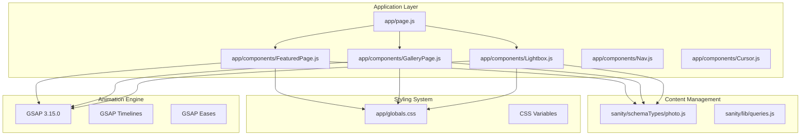
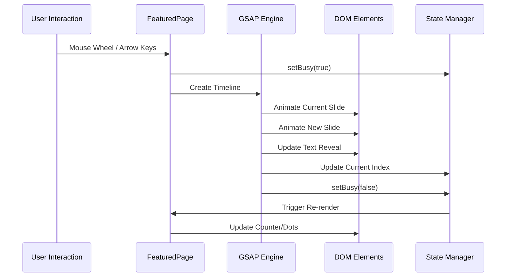
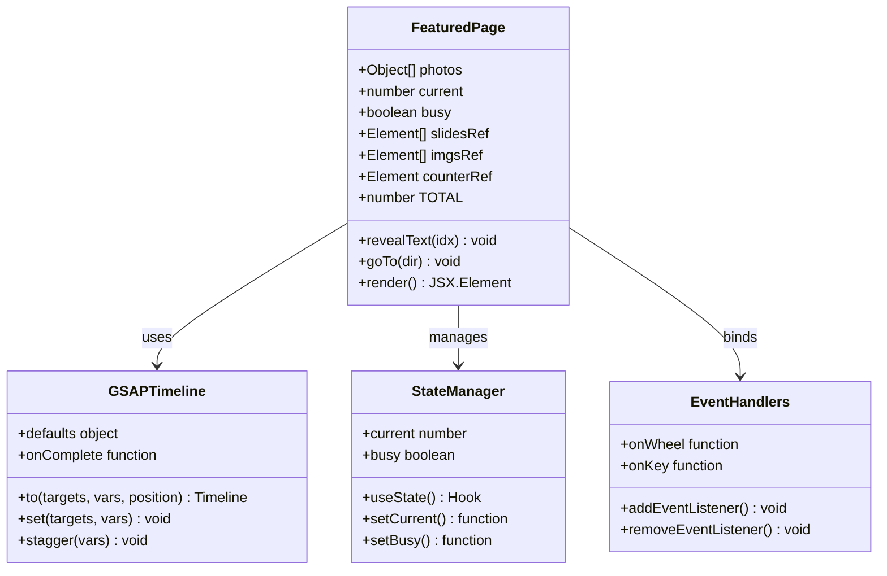
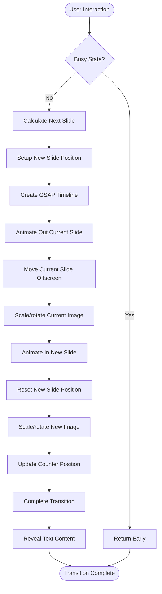
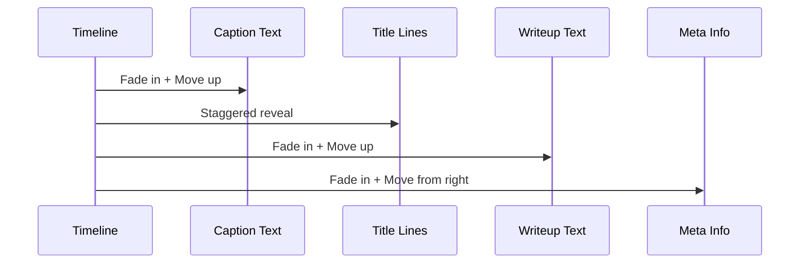

# Featured Photo Slideshow

<cite>
**Referenced Files in This Document**
- [FeaturedPage.js](file://app/components/FeaturedPage.js)
- [GalleryPage.js](file://app/components/GalleryPage.js)
- [Lightbox.js](file://app/components/Lightbox.js)
- [page.js](file://app/page.js)
- [globals.css](file://app/globals.css)
- [photo.js](file://sanity/schemaTypes/photo.js)
- [package.json](file://package.json)
</cite>

## Table of Contents
1. [Introduction](#introduction)
2. [Project Structure](#project-structure)
3. [Core Components](#core-components)
4. [Architecture Overview](#architecture-overview)
5. [Detailed Component Analysis](#detailed-component-analysis)
6. [Navigation Controls](#navigation-controls)
7. [Animation System](#animation-system)
8. [Typography and Responsive Design](#typography-and-responsive-design)
9. [State Management](#state-management)
10. [Performance Optimizations](#performance-optimizations)
11. [Customization Guide](#customization-guide)
12. [Troubleshooting Guide](#troubleshooting-guide)
13. [Conclusion](#conclusion)

## Introduction

The Featured Photo Slideshow is a sophisticated React-based photography showcase system built with Next.js and GSAP animations. This system presents curated photography in an elegant, cinematic manner with smooth transitions, responsive typography, and intuitive user controls. The slideshow serves as the primary gateway to the portfolio, featuring high-quality images with layered text overlays and animated transitions.

The system integrates seamlessly with the Sanity CMS for content management, allowing photographers to curate featured images through the admin interface. The slideshow supports multiple interaction modes including mouse wheel navigation, keyboard arrow keys, and touch gestures, providing an accessible and engaging user experience across all devices.

## Project Structure

The slideshow system is organized within the Next.js application structure, with specialized components handling different aspects of the photography presentation:



**Diagram sources**
- [page.js:14-227](file://app/page.js#L14-L227)
- [FeaturedPage.js:1-269](file://app/components/FeaturedPage.js#L1-L269)
- [GalleryPage.js:1-760](file://app/components/GalleryPage.js#L1-L760)
- [Lightbox.js:1-303](file://app/components/Lightbox.js#L1-L303)

**Section sources**
- [page.js:14-227](file://app/page.js#L14-L227)
- [globals.css:1-93](file://app/globals.css#L1-L93)

## Core Components

The slideshow system consists of several interconnected components that work together to deliver a cohesive photography experience:

### FeaturedPage Component
The FeaturedPage component serves as the main slideshow controller, managing state, animations, and user interactions for the featured photography collection.

### Navigation System
The navigation system provides multiple input methods including mouse wheel, keyboard arrow keys, and touch gestures, ensuring accessibility across different device types.

### Animation Engine
Powered by GSAP (GreenSock Animation Platform), the system delivers smooth, performant animations with precise timing control and advanced easing functions.

### Typography System
The responsive typography system adapts font sizes and line heights based on viewport dimensions while maintaining readability and visual hierarchy.

**Section sources**
- [FeaturedPage.js:6-13](file://app/components/FeaturedPage.js#L6-L13)
- [GalleryPage.js:1-760](file://app/components/GalleryPage.js#L1-L760)
- [Lightbox.js:1-303](file://app/components/Lightbox.js#L1-L303)

## Architecture Overview

The slideshow architecture follows a component-based design pattern with clear separation of concerns:



**Diagram sources**
- [FeaturedPage.js:18-34](file://app/components/FeaturedPage.js#L18-L34)
- [FeaturedPage.js:56-105](file://app/components/FeaturedPage.js#L56-L105)

The architecture ensures smooth transitions between slides while maintaining optimal performance through careful state management and efficient DOM manipulation.

## Detailed Component Analysis

### FeaturedPage Component Architecture

The FeaturedPage component implements a sophisticated state management system with comprehensive error handling and performance optimizations:



**Diagram sources**
- [FeaturedPage.js:6-13](file://app/components/FeaturedPage.js#L6-L13)
- [FeaturedPage.js:36-105](file://app/components/FeaturedPage.js#L36-L105)

**Section sources**
- [FeaturedPage.js:1-269](file://app/components/FeaturedPage.js#L1-L269)

### Animation Sequence Implementation

The slideshow employs carefully orchestrated animation sequences using GSAP timelines to create seamless transitions:



**Diagram sources**
- [FeaturedPage.js:56-105](file://app/components/FeaturedPage.js#L56-L105)

**Section sources**
- [FeaturedPage.js:73-102](file://app/components/FeaturedPage.js#L73-L102)

## Navigation Controls

The slideshow supports multiple navigation methods with consistent behavior and accessibility features:

### Mouse Wheel Navigation
The system responds to vertical mouse wheel movements to advance or reverse through slides:

- **Down/Right Wheel**: Advance to next slide
- **Up/Left Wheel**: Go to previous slide
- **Prevents Default Behavior**: Ensures smooth scrolling doesn't interfere with navigation

### Keyboard Navigation
Full keyboard support enables precise control using arrow keys:

- **Arrow Down / Arrow Right**: Navigate forward
- **Arrow Up / Arrow Left**: Navigate backward
- **Event Prevention**: Prevents browser default scrolling behavior

### Touch and Gesture Support
The system is designed to work seamlessly with touch devices, responding to swipe gestures and touch interactions.

**Section sources**
- [FeaturedPage.js:18-26](file://app/components/FeaturedPage.js#L18-L26)

## Animation System

The animation system leverages GSAP for professional-grade motion graphics with precise timing and easing control.

### Text Reveal Effects
The text reveal system creates a cinematic entrance for slide content using staggered animations:



**Diagram sources**
- [FeaturedPage.js:36-54](file://app/components/FeaturedPage.js#L36-L54)

### Image Transition Animations
The image transition system creates dramatic visual effects during slide changes:

- **Scaling Effects**: Images scale up during transitions for dramatic impact
- **Rotation Animations**: Subtle rotation adds dynamic movement
- **Position Transitions**: Smooth positioning creates depth perception
- **Transform Origins**: Dynamic transform origins based on navigation direction

### Counter Animation
The counter system provides visual feedback with synchronized animations:

- **Vertical Positioning**: Counter slides vertically to match new slide index
- **Timing Synchronization**: Counter animation matches slide transition duration
- **Visual Continuity**: Maintains visual connection between counter and current slide

**Section sources**
- [FeaturedPage.js:91-102](file://app/components/FeaturedPage.js#L91-L102)

## Typography and Responsive Design

The typography system adapts dynamically to different screen sizes while maintaining readability and visual hierarchy:

### Responsive Font Sizing
The system uses CSS clamp() functions for fluid typography:

- **Hero Titles**: `clamp(4rem, 9vw, 8rem)` for large, readable headlines
- **Section Headers**: `clamp(3.5rem, 6vw, 5.5rem)` for balanced proportions
- **Body Text**: `clamp(1.6rem, 4vw, 3.5rem)` for optimal reading comfort

### Line Wrapping and Spacing
Intelligent line breaking ensures content remains readable across devices:

- **Two-Line Titles**: Long titles automatically split into two lines
- **Proper Line Heights**: Adjusted for italic fonts and optimal legibility
- **Letter Spacing**: Carefully tuned for both uppercase and italic treatments

### Font Family System
The system maintains consistent typography through CSS custom properties:

- **Display Fonts**: Libre Caslon Display for headings and titles
- **Monospace Fonts**: JetBrains Mono for technical and metadata elements
- **Variable Weights**: Consistent weight progression across the design system

**Section sources**
- [globals.css:24-27](file://app/globals.css#L24-L27)
- [FeaturedPage.js:176-206](file://app/components/FeaturedPage.js#L176-L206)

## State Management

The slideshow implements robust state management with careful consideration for performance and user experience:

### State Structure
```javascript
const [current, setCurrent] = useState(0)      // Current slide index
const [busy, setBusy] = useState(false)       // Prevent concurrent animations
const slidesRef = useRef([])                  // DOM references for slides
const imgsRef = useRef([])                   // DOM references for images
const counterRef = useRef(null)              // Counter element reference
const TOTAL = photos.length                  // Total number of slides
```

### Animation State Control
The busy state prevents user interactions during animations, ensuring smooth transitions and preventing animation conflicts.

### Reference Management
DOM element references are managed through React refs for efficient access and manipulation during animations.

**Section sources**
- [FeaturedPage.js:7-12](file://app/components/FeaturedPage.js#L7-L12)

## Performance Optimizations

The slideshow incorporates several performance optimizations to ensure smooth operation across different devices:

### Hardware Acceleration
- **will-change Property**: Applied to animated elements to enable GPU acceleration
- **Transform Optimization**: Uses transform properties instead of layout-affecting properties
- **Backface Visibility**: Hidden backfaces prevent rendering artifacts

### Memory Management
- **Event Listener Cleanup**: Proper cleanup of event listeners on component unmount
- **Reference Cleanup**: Efficient cleanup of DOM references
- **Animation Cancellation**: GSAP automatically handles animation cleanup

### Rendering Optimization
- **Conditional Rendering**: Only renders slides that are currently visible
- **Efficient DOM Updates**: Minimizes DOM manipulation through GSAP
- **CSS Transform Only**: Uses transforms for animations to leverage GPU acceleration

**Section sources**
- [FeaturedPage.js:138](file://app/components/FeaturedPage.js#L138)
- [FeaturedPage.js:30-33](file://app/components/FeaturedPage.js#L30-L33)

## Customization Guide

The slideshow system is highly customizable through various configuration options:

### Animation Timing
- **Duration**: Modify transition durations in timeline defaults
- **Stagger**: Adjust stagger delays for text reveal effects
- **Easing**: Change easing functions for different motion characteristics

### Visual Effects
- **Scaling**: Customize scale factors for dramatic entrance effects
- **Rotation**: Adjust rotation angles for dynamic movement
- **Transform Origin**: Modify transform origins for different animation perspectives

### Typography Customization
- **Font Sizes**: Adjust clamp values for different viewport breakpoints
- **Line Heights**: Modify line heights for different font families
- **Letter Spacing**: Tune letter spacing for optimal readability

### Color Theming
The system uses CSS custom properties for easy theme customization:
- **Primary Colors**: `--cream`, `--accent`, `--dark`
- **Text Colors**: `--text`, `--text-muted`, `--text-on-image`
- **Background Colors**: `--panel`, `--overlay`, `--border`

**Section sources**
- [FeaturedPage.js:80-89](file://app/components/FeaturedPage.js#L80-L89)
- [globals.css:5-28](file://app/globals.css#L5-L28)

## Troubleshooting Guide

Common issues and their solutions:

### Animation Performance Issues
- **Problem**: Choppy animations on mobile devices
- **Solution**: Reduce animation complexity or adjust duration settings
- **Prevention**: Monitor frame rates and optimize expensive animations

### Navigation Conflicts
- **Problem**: Scrolling conflicts with slideshow navigation
- **Solution**: Verify event listener cleanup and preventDefault usage
- **Prevention**: Test navigation across different input methods

### Content Loading Issues
- **Problem**: Blank slides or missing content
- **Solution**: Ensure proper data fetching and loading states
- **Prevention**: Implement proper error boundaries and loading indicators

### Responsive Design Problems
- **Problem**: Typography issues on different screen sizes
- **Solution**: Adjust clamp values and media queries
- **Prevention**: Test across various viewport sizes and orientations

**Section sources**
- [FeaturedPage.js:107-114](file://app/components/FeaturedPage.js#L107-L114)

## Conclusion

The Featured Photo Slideshow represents a sophisticated implementation of modern web animation techniques combined with thoughtful user experience design. The system successfully balances visual appeal with performance, accessibility, and maintainability.

Key strengths of the implementation include:

- **Professional Animation Quality**: GSAP-powered animations deliver smooth, polished transitions
- **Responsive Design**: Adaptive typography and layout ensure excellent presentation across devices
- **Accessibility Features**: Multiple navigation methods and proper ARIA considerations
- **Performance Optimization**: Hardware acceleration and efficient DOM manipulation
- **Extensible Architecture**: Well-structured codebase allows for easy customization and enhancement

The system provides a solid foundation for showcasing photography collections while maintaining the flexibility to adapt to different content management systems and design requirements. Its integration with Sanity CMS demonstrates how modern web technologies can work together to create compelling digital experiences.