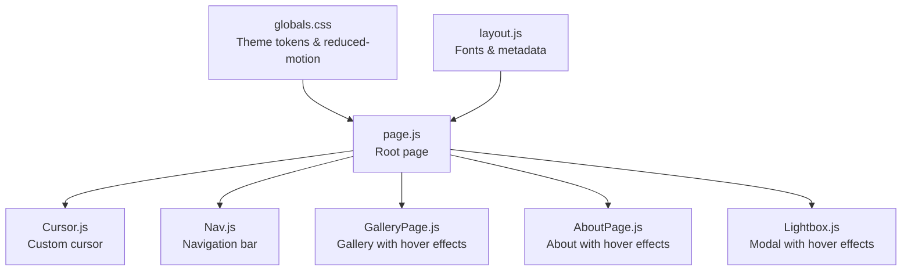
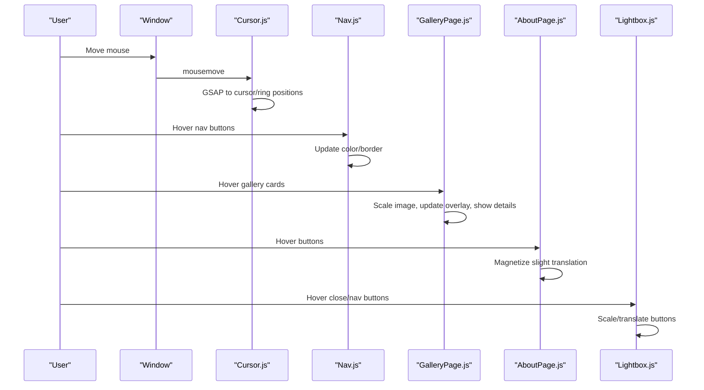
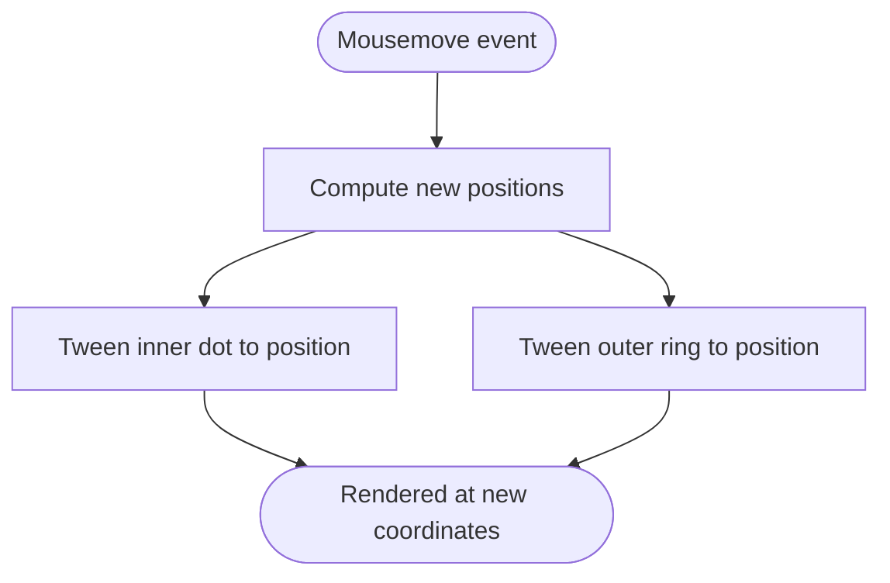
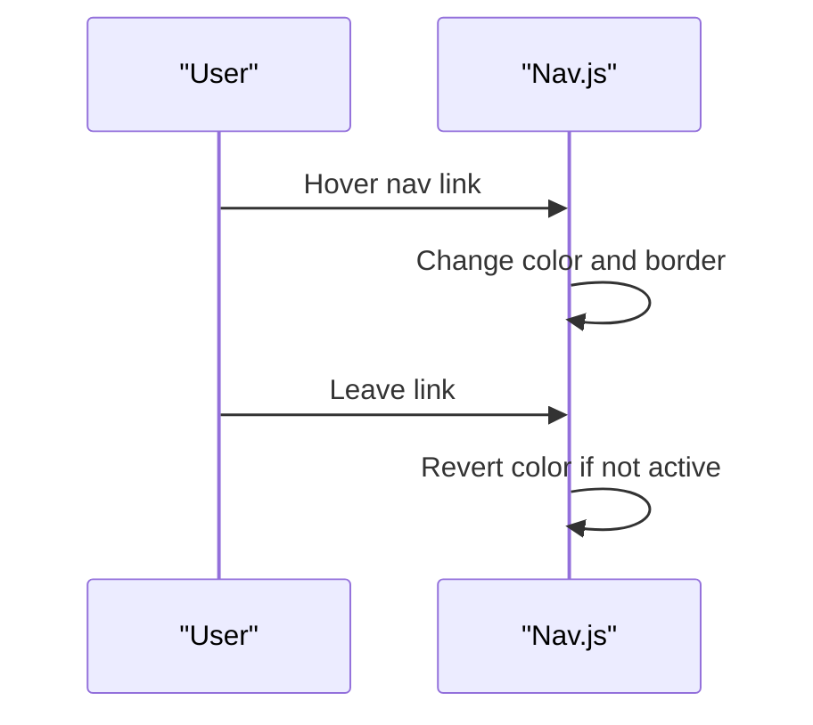
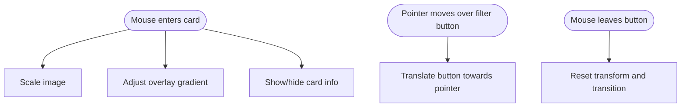
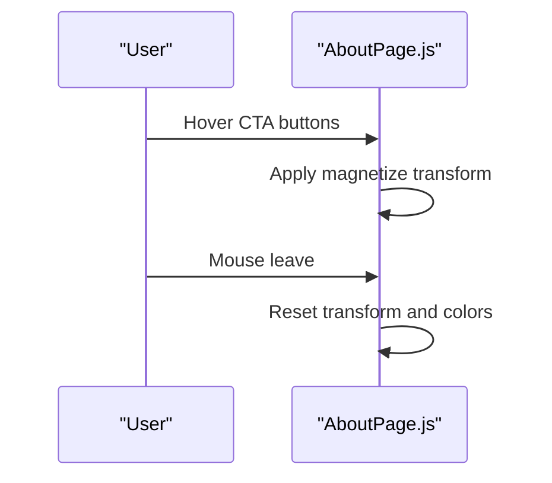
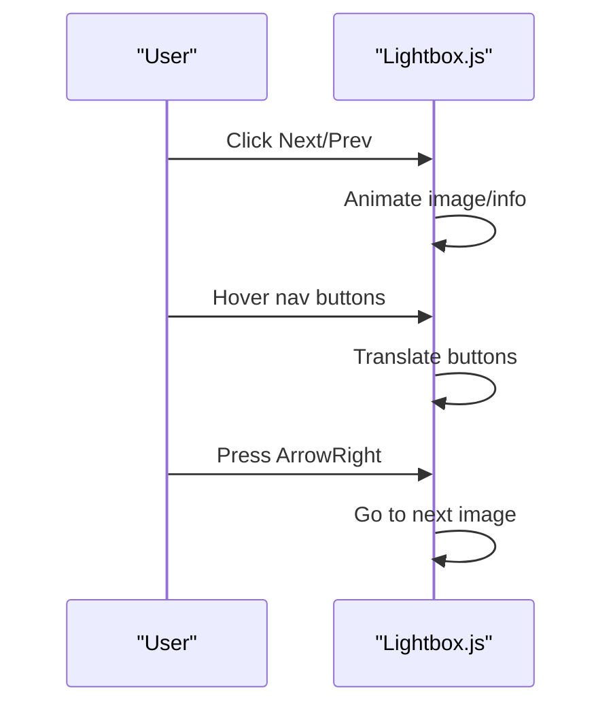
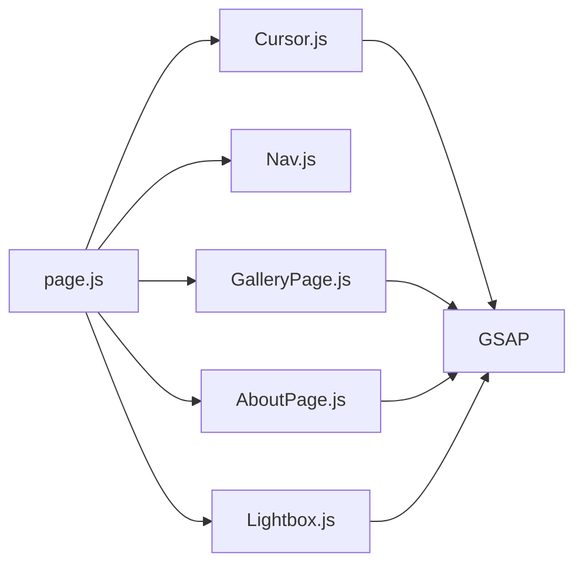

# Interactive Elements

<cite>
**Referenced Files in This Document**
- [Cursor.js](file://app/components/Cursor.js)
- [globals.css](file://app/globals.css)
- [layout.js](file://app/layout.js)
- [page.js](file://app/page.js)
- [Nav.js](file://app/components/Nav.js)
- [GalleryPage.js](file://app/components/GalleryPage.js)
- [AboutPage.js](file://app/components/AboutPage.js)
- [Lightbox.js](file://app/components/Lightbox.js)
- [package.json](file://package.json)
</cite>

## Table of Contents
1. [Introduction](#introduction)
2. [Project Structure](#project-structure)
3. [Core Components](#core-components)
4. [Architecture Overview](#architecture-overview)
5. [Detailed Component Analysis](#detailed-component-analysis)
6. [Dependency Analysis](#dependency-analysis)
7. [Performance Considerations](#performance-considerations)
8. [Accessibility Considerations](#accessibility-considerations)
9. [Customization Examples](#customization-examples)
10. [Troubleshooting Guide](#troubleshooting-guide)
11. [Conclusion](#conclusion)

## Introduction
This document explains the interactive elements of the portfolio, focusing on the custom cursor system and hover effects that enhance user engagement. It covers smooth cursor tracking, hover state modifications, proximity-aware interactions, and micro-interactions across pages. It also addresses accessibility, performance optimizations, and practical customization guidance.

## Project Structure
The interactive system spans a few core files:
- Cursor rendering and tracking
- Global styles and theme tokens
- Page composition and navigation
- Hover effects on buttons, cards, and lightbox controls
- Lightbox modal with keyboard navigation

**Diagram sources**
- [page.js:14-227](file://app/page.js#L14-L227)
- [Cursor.js:1-42](file://app/components/Cursor.js#L1-L42)
- [Nav.js:1-168](file://app/components/Nav.js#L1-L168)
- [GalleryPage.js:1-760](file://app/components/GalleryPage.js#L1-L760)
- [AboutPage.js:1-458](file://app/components/AboutPage.js#L1-L458)
- [Lightbox.js:1-303](file://app/components/Lightbox.js#L1-L303)
- [globals.css:1-93](file://app/globals.css#L1-L93)
- [layout.js:1-40](file://app/layout.js#L1-L40)

**Section sources**
- [page.js:14-227](file://app/page.js#L14-L227)
- [globals.css:1-93](file://app/globals.css#L1-L93)
- [layout.js:1-40](file://app/layout.js#L1-L40)

## Core Components
- Custom cursor: Two-layered overlay (inner dot and outer ring) smoothly tracks mouse movement using GSAP.
- Navigation hover states: Buttons animate color and border on hover; theme toggle has accessible labels.
- Gallery hover states: Cards scale and overlay fades on hover; filter buttons magnetically follow the pointer.
- About page hover states: Buttons magnetize slightly on hover; links animate color transitions.
- Lightbox hover states: Close and navigation buttons animate scale and translation; keyboard navigation supported.

**Section sources**
- [Cursor.js:1-42](file://app/components/Cursor.js#L1-L42)
- [Nav.js:114-167](file://app/components/Nav.js#L114-L167)
- [GalleryPage.js:324-346](file://app/components/GalleryPage.js#L324-L346)
- [GalleryPage.js:376-430](file://app/components/GalleryPage.js#L376-L430)
- [AboutPage.js:390-427](file://app/components/AboutPage.js#L390-L427)
- [Lightbox.js:109-131](file://app/components/Lightbox.js#L109-L131)
- [Lightbox.js:240-296](file://app/components/Lightbox.js#L240-L296)

## Architecture Overview
The interactive pipeline consists of:
- Mousemove event listener updates cursor positions via GSAP tweens.
- Hover handlers on interactive elements modify styles and trigger micro-animations.
- Keyboard shortcuts integrate with lightbox navigation.
- Theme toggling and reduced-motion preferences influence visual behavior.

**Diagram sources**
- [Cursor.js:9-21](file://app/components/Cursor.js#L9-L21)
- [Nav.js:114-167](file://app/components/Nav.js#L114-L167)
- [GalleryPage.js:376-430](file://app/components/GalleryPage.js#L376-L430)
- [AboutPage.js:390-427](file://app/components/AboutPage.js#L390-L427)
- [Lightbox.js:109-131](file://app/components/Lightbox.js#L109-L131)
- [Lightbox.js:240-296](file://app/components/Lightbox.js#L240-L296)

## Detailed Component Analysis

### Custom Cursor System
The cursor comprises:
- Inner dot: small, solid circle following the pointer closely.
- Outer ring: larger ring following with a longer easing tail.
- Smooth tracking: GSAP tweens update positions on every mousemove.
- Pointer events disabled to avoid interfering with underlying interactions.

**Diagram sources**
- [Cursor.js:14-17](file://app/components/Cursor.js#L14-L17)

**Section sources**
- [Cursor.js:1-42](file://app/components/Cursor.js#L1-L42)

### Navigation Hover States
The navigation bar includes:
- Active page underline and color changes on hover.
- Theme toggle with accessible labels and border color transitions.
- Auto-hide/show behavior controlled by mouse proximity to top of viewport.

**Diagram sources**
- [Nav.js:114-167](file://app/components/Nav.js#L114-L167)

**Section sources**
- [Nav.js:1-168](file://app/components/Nav.js#L1-L168)

### Gallery Hover Effects
The gallery implements:
- Card hover scaling and overlay gradient changes.
- Filter buttons that magnetically translate toward the pointer.
- Horizontal scrolling with pinned track and staggered reveals.

**Diagram sources**
- [GalleryPage.js:376-430](file://app/components/GalleryPage.js#L376-L430)
- [GalleryPage.js:223-232](file://app/components/GalleryPage.js#L223-L232)

**Section sources**
- [GalleryPage.js:1-760](file://app/components/GalleryPage.js#L1-L760)

### About Page Hover Effects
The About page includes:
- Button magnetism with slight translation on hover.
- Link color transitions and social media hover states.
- CTA section with animated buttons and hover feedback.

**Diagram sources**
- [AboutPage.js:390-427](file://app/components/AboutPage.js#L390-L427)

**Section sources**
- [AboutPage.js:1-458](file://app/components/AboutPage.js#L1-L458)

### Lightbox Hover Effects and Accessibility
The lightbox provides:
- Smooth open/close animations using GSAP timelines.
- Hover states for close and navigation buttons with scale and translation.
- Keyboard navigation: Escape to close, arrow keys to navigate.

**Diagram sources**
- [Lightbox.js:18-62](file://app/components/Lightbox.js#L18-L62)
- [Lightbox.js:240-296](file://app/components/Lightbox.js#L240-L296)

**Section sources**
- [Lightbox.js:1-303](file://app/components/Lightbox.js#L1-L303)

## Dependency Analysis
- GSAP is used extensively for smooth animations and timelines across components.
- Cursor relies on GSAP for positional tweens.
- Gallery and About pages use GSAP for magnet effects and hover animations.
- Lightbox uses GSAP timelines for entrance/exit sequences.

**Diagram sources**
- [page.js:14-227](file://app/page.js#L14-L227)
- [Cursor.js:1-42](file://app/components/Cursor.js#L1-L42)
- [GalleryPage.js:1-760](file://app/components/GalleryPage.js#L1-L760)
- [AboutPage.js:1-458](file://app/components/AboutPage.js#L1-L458)
- [Lightbox.js:1-303](file://app/components/Lightbox.js#L1-L303)

**Section sources**
- [package.json:11-22](file://package.json#L11-L22)

## Performance Considerations
- Smooth cursor movement: GSAP tweens with short durations and overwrite ensure responsive tracking without jank.
- Reduced motion: The stylesheet includes a reduced-motion guard that disables page-clip animations when users prefer less motion.
- Battery life: Minimizing heavy DOM updates and using transforms (translate/scale) rather than layout-affecting properties helps conserve energy.
- Scroll-triggered animations: Components register and clean up ScrollTrigger instances to prevent memory leaks and unnecessary computations.

Recommendations:
- Keep hover animations simple and constrained to transform/opacity for GPU acceleration.
- Debounce or throttle mousemove handlers if extending the cursor system.
- Use will-change or transform3d sparingly; prefer native GPU-friendly properties.

**Section sources**
- [globals.css:81-83](file://app/globals.css#L81-L83)
- [GalleryPage.js:51-220](file://app/components/GalleryPage.js#L51-L220)
- [AboutPage.js:11-162](file://app/components/AboutPage.js#L11-L162)

## Accessibility Considerations
- Keyboard navigation: Lightbox supports Escape, ArrowLeft, and ArrowRight for non-mouse users.
- Screen reader compatibility: Interactive elements use semantic roles and appropriate ARIA attributes where applicable (e.g., aria-label on theme toggle).
- Reduced motion: Users who prefer reduced motion can opt out of motion-heavy animations via system preferences.
- Focus management: Ensure focus indicators remain visible and predictable when navigating via keyboard.

Action items:
- Add explicit role and aria-describedby attributes to interactive elements where helpful.
- Test tab order and focus traps in modals.
- Provide visible focus styles consistent with the theme.

**Section sources**
- [Lightbox.js:54-62](file://app/components/Lightbox.js#L54-L62)
- [Nav.js:133-144](file://app/components/Nav.js#L133-L144)
- [globals.css:81-83](file://app/globals.css#L81-L83)

## Customization Examples
Below are practical examples to extend the interactive system without modifying core logic:

- Customize cursor appearance
  - Adjust size, color, and blend mode in the cursor div styles.
  - Modify easing durations for different tracking feel.
  - Reference: [Cursor.js:25-38](file://app/components/Cursor.js#L25-L38)

- Add new hover effects to buttons
  - Duplicate the hover pattern used in navigation or lightbox buttons.
  - Example patterns: color change, border transition, subtle scale or translation.
  - References: [Nav.js:126-131](file://app/components/Nav.js#L126-L131), [Lightbox.js:262-271](file://app/components/Lightbox.js#L262-L271)

- Implement proximity-based micro-interactions
  - Repurpose the Nav’s proximity logic to reveal elements near the viewport edges.
  - Reference: [Nav.js:27-48](file://app/components/Nav.js#L27-L48)

- Integrate magnet effects on new elements
  - Use pointer distance to compute translation offsets similar to filter buttons.
  - Reference: [GalleryPage.js:223-232](file://app/components/GalleryPage.js#L223-L232)

- Enhance lightbox interactions
  - Add swipe gestures or wheel navigation alongside existing keyboard support.
  - Reference: [Lightbox.js:54-62](file://app/components/Lightbox.js#L54-L62)

- Extend hover states for cards or grids
  - Combine scaling, overlay gradients, and text reveals like in the gallery.
  - References: [GalleryPage.js:394-409](file://app/components/GalleryPage.js#L394-L409), [GalleryPage.js:496-509](file://app/components/GalleryPage.js#L496-L509)

## Troubleshooting Guide
Common issues and resolutions:
- Cursor not moving
  - Verify mousemove listener is attached and refs resolve.
  - Confirm GSAP is imported and initialized.
  - References: [Cursor.js:9-21](file://app/components/Cursor.js#L9-L21), [Cursor.js:2-3](file://app/components/Cursor.js#L2-L3)

- Hover animations not firing
  - Ensure event handlers are attached and not overwritten by re-renders.
  - Check for conflicting inline styles or z-index stacking.
  - References: [Nav.js:126-131](file://app/components/Nav.js#L126-L131), [GalleryPage.js:376-430](file://app/components/GalleryPage.js#L376-L430)

- Lightbox not closing or navigating
  - Confirm keydown listeners are registered and cleanup occurs on unmount.
  - Verify click-to-close logic targets the overlay only.
  - References: [Lightbox.js:54-62](file://app/components/Lightbox.js#L54-L62), [Lightbox.js:99-101](file://app/components/Lightbox.js#L99-L101)

- Performance degradation
  - Reduce animation complexity or durations.
  - Disable ScrollTrigger instances when components unmount.
  - References: [GalleryPage.js:215-219](file://app/components/GalleryPage.js#L215-L219), [AboutPage.js:157-161](file://app/components/AboutPage.js#L157-L161)

## Conclusion
The portfolio’s interactive elements combine a polished custom cursor with thoughtful hover states and micro-interactions. GSAP powers smooth animations, while accessibility and reduced-motion preferences are considered. The modular structure allows straightforward extension with consistent patterns across components.