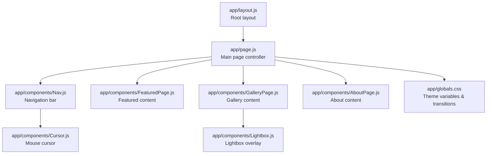
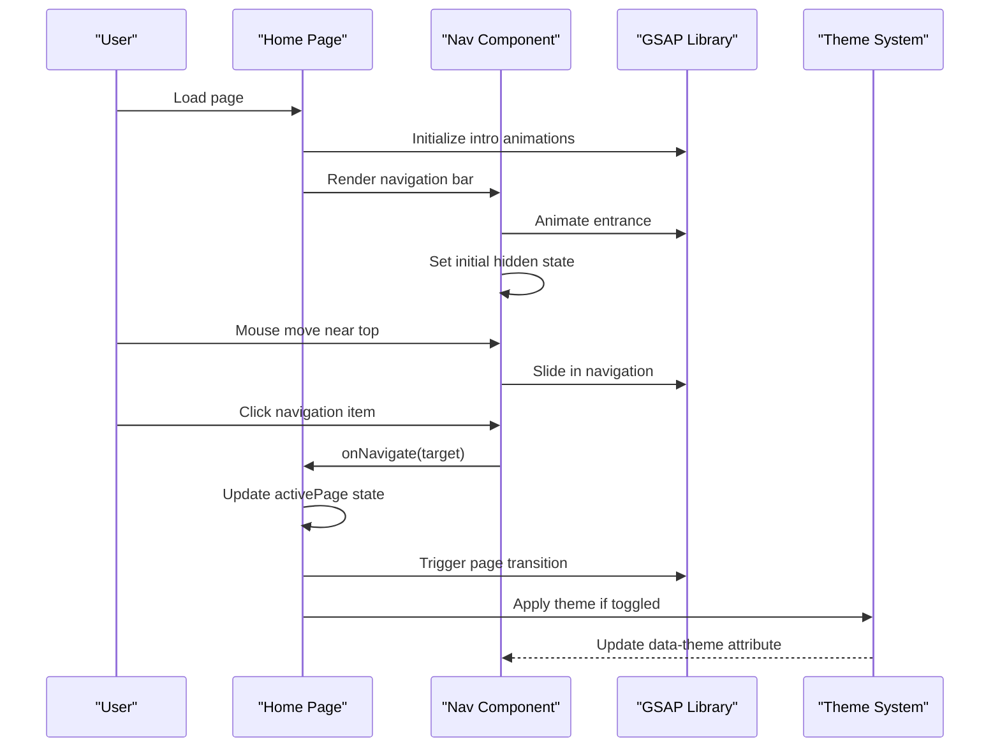
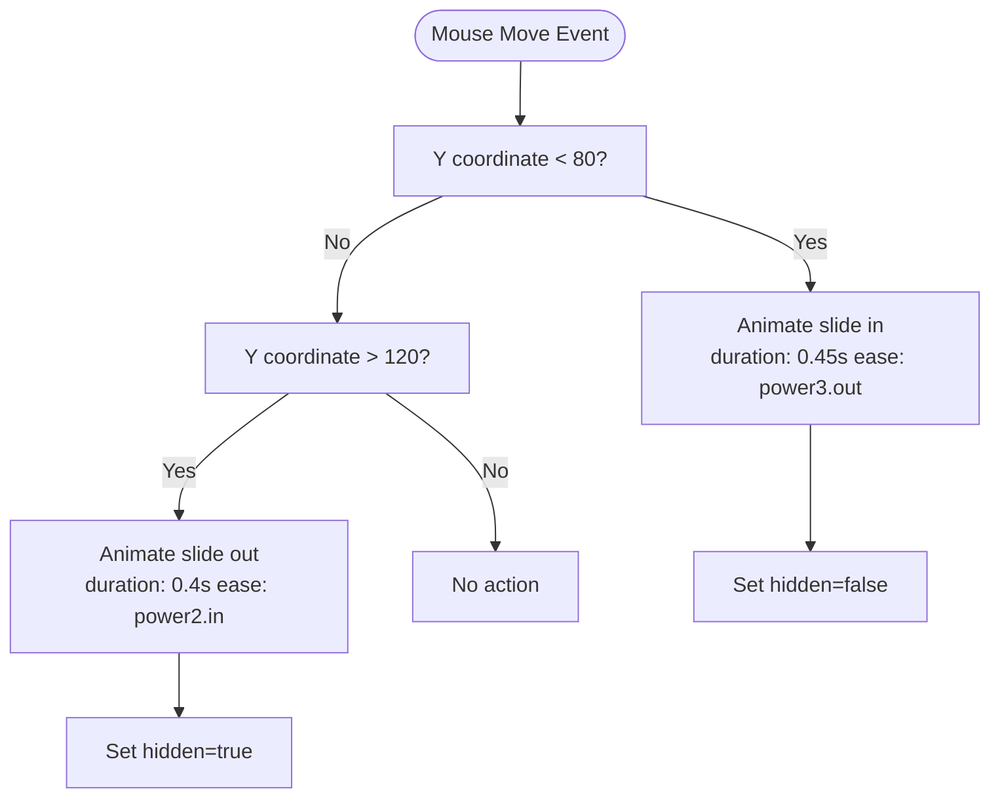
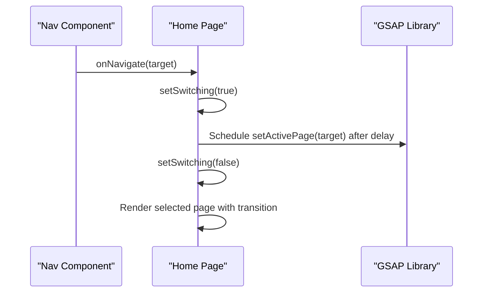
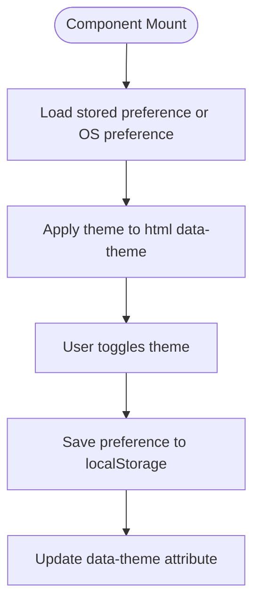
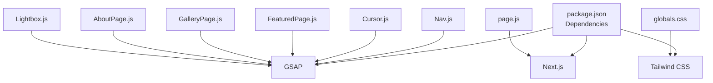

# Navigation System

<cite>
**Referenced Files in This Document**
- [Nav.js](file://app/components/Nav.js)
- [page.js](file://app/page.js)
- [globals.css](file://app/globals.css)
- [layout.js](file://app/layout.js)
- [Cursor.js](file://app/components/Cursor.js)
- [FeaturedPage.js](file://app/components/FeaturedPage.js)
- [GalleryPage.js](file://app/components/GalleryPage.js)
- [AboutPage.js](file://app/components/AboutPage.js)
- [Lightbox.js](file://app/components/Lightbox.js)
- [package.json](file://package.json)
</cite>

## Table of Contents
1. [Introduction](#introduction)
2. [Project Structure](#project-structure)
3. [Core Components](#core-components)
4. [Architecture Overview](#architecture-overview)
5. [Detailed Component Analysis](#detailed-component-analysis)
6. [Dependency Analysis](#dependency-analysis)
7. [Performance Considerations](#performance-considerations)
8. [Troubleshooting Guide](#troubleshooting-guide)
9. [Conclusion](#conclusion)

## Introduction
This document provides comprehensive documentation for the navigation system, covering animated transitions, mouse proximity detection, theme switching, and responsive navigation patterns. It explains how smooth page transitions are implemented using GSAP animations, how hover effects leverage proximity-based interactions, and how seamless navigation occurs between portfolio sections. The theme switching mechanism supports dark/light modes with CSS custom properties and persistent user preferences. Accessibility features for keyboard navigation and integration with Next.js routing are also documented. Practical examples demonstrate customizing animation timings, adding new navigation items, and implementing additional interactive elements.

## Project Structure
The navigation system spans several key files:
- Navigation component with animated entrance, mouse proximity detection, and theme switching
- Page controller managing navigation state and page transitions
- Global styles defining theme variables and page transitions
- Cursor component for mouse-following animations
- Portfolio pages implementing GSAP-driven interactions
- Lightbox component with animated overlays and keyboard navigation

**Diagram sources**
- [page.js:14-227](file://app/page.js#L14-L227)
- [Nav.js:1-168](file://app/components/Nav.js#L1-L168)
- [globals.css:1-93](file://app/globals.css#L1-L93)
- [layout.js:1-40](file://app/layout.js#L1-L40)
- [Cursor.js:1-42](file://app/components/Cursor.js#L1-L42)
- [FeaturedPage.js:1-269](file://app/components/FeaturedPage.js#L1-L269)
- [GalleryPage.js:1-760](file://app/components/GalleryPage.js#L1-L760)
- [AboutPage.js:1-458](file://app/components/AboutPage.js#L1-L458)
- [Lightbox.js:1-303](file://app/components/Lightbox.js#L1-L303)

**Section sources**
- [page.js:14-227](file://app/page.js#L14-L227)
- [Nav.js:1-168](file://app/components/Nav.js#L1-L168)
- [globals.css:1-93](file://app/globals.css#L1-L93)
- [layout.js:1-40](file://app/layout.js#L1-L40)

## Core Components
- Navigation Bar (Nav): Implements animated entrance, mouse proximity detection, theme switching, and navigation item interactions.
- Page Controller (page.js): Manages active page state, handles navigation requests, and orchestrates page transitions.
- Theme System (globals.css): Defines CSS custom properties for themes and applies them via data attributes.
- Cursor (Cursor.js): Provides mouse-following animations with GSAP.
- Portfolio Pages: Feature GSAP-driven animations and interactions for each section.
- Lightbox (Lightbox.js): Implements animated overlays and keyboard navigation for media viewing.

**Section sources**
- [Nav.js:1-168](file://app/components/Nav.js#L1-L168)
- [page.js:136-145](file://app/page.js#L136-L145)
- [globals.css:5-49](file://app/globals.css#L5-L49)
- [Cursor.js:1-42](file://app/components/Cursor.js#L1-L42)
- [FeaturedPage.js:1-269](file://app/components/FeaturedPage.js#L1-L269)
- [GalleryPage.js:1-760](file://app/components/GalleryPage.js#L1-L760)
- [AboutPage.js:1-458](file://app/components/AboutPage.js#L1-L458)
- [Lightbox.js:1-303](file://app/components/Lightbox.js#L1-L303)

## Architecture Overview
The navigation system integrates React components with GSAP for animations and CSS custom properties for theming. The page controller manages state and triggers transitions, while the navigation bar coordinates entrance animations, proximity-based visibility, and theme toggling. Portfolio pages implement scroll-triggered animations and interactive elements, and the lightbox provides modal overlays with keyboard navigation.

**Diagram sources**
- [page.js:136-145](file://app/page.js#L136-L145)
- [Nav.js:10-68](file://app/components/Nav.js#L10-L68)
- [globals.css:30-49](file://app/globals.css#L30-L49)

## Detailed Component Analysis

### Navigation Bar (Nav)
The navigation bar implements animated entrance, mouse proximity detection, and theme switching:
- Animated entrance: Uses GSAP to animate from off-screen to visible position with easing and delays.
- Proximity detection: Listens to mouse movement and reveals/hides the navigation based on Y-coordinate thresholds.
- Theme switching: Toggles between dark and light themes, persists preference in localStorage, and updates CSS variables via data attributes.
- Navigation items: Renders static links and applies active state styling based on current page.

**Diagram sources**
- [Nav.js:27-44](file://app/components/Nav.js#L27-L44)

**Section sources**
- [Nav.js:1-168](file://app/components/Nav.js#L1-L168)

### Page Controller (page.js)
The page controller manages navigation state and transitions:
- Active page state: Tracks the currently displayed section.
- Navigation handler: Prevents redundant navigation and triggers a delayed state update to synchronize with animations.
- Page rendering: Dynamically renders the appropriate portfolio page component and applies a clipping transition effect.

**Diagram sources**
- [page.js:136-145](file://app/page.js#L136-L145)

**Section sources**
- [page.js:136-145](file://app/page.js#L136-L145)

### Theme Switching Mechanism
The theme system uses CSS custom properties and data attributes:
- CSS variables: Define color tokens for dark and light modes in :root and [data-theme="light"] blocks.
- Theme persistence: Reads user preference from localStorage and respects OS preference if no stored preference exists.
- Dynamic switching: Updates the data-theme attribute on html element and stores the preference in localStorage.

**Diagram sources**
- [Nav.js:70-83](file://app/components/Nav.js#L70-L83)
- [globals.css:5-49](file://app/globals.css#L5-L49)

**Section sources**
- [Nav.js:70-83](file://app/components/Nav.js#L70-L83)
- [globals.css:5-49](file://app/globals.css#L5-L49)

### Cursor Component (Cursor.js)
The cursor component provides mouse-following animations:
- GSAP positioning: Smoothly animates cursor and ring elements to follow mouse movement with different durations.
- Layered elements: Maintains two elements (inner cursor and outer ring) with blend modes and transitions.

**Section sources**
- [Cursor.js:1-42](file://app/components/Cursor.js#L1-L42)

### Portfolio Pages Interactions
Portfolio pages implement various GSAP-driven interactions:
- FeaturedPage: Slideshow with directional transitions, text reveals, and counter animations.
- GalleryPage: Scroll-triggered reveals, horizontal scrolling with parallax, filter buttons with magnetic effects, and lightbox integration.
- AboutPage: Hero title reveals, paragraph word-by-word animations, parallax hero image, and magnetic button effects.

**Section sources**
- [FeaturedPage.js:1-269](file://app/components/FeaturedPage.js#L1-L269)
- [GalleryPage.js:1-760](file://app/components/GalleryPage.js#L1-L760)
- [AboutPage.js:1-458](file://app/components/AboutPage.js#L1-L458)

### Lightbox Component (Lightbox.js)
The lightbox provides animated overlays and keyboard navigation:
- Entrance animation: Staggered animations for overlay, image, info panel, and navigation controls.
- Image swap: Smooth transitions when navigating between images.
- Keyboard navigation: Supports Escape, Arrow keys for closing and moving between images.

**Section sources**
- [Lightbox.js:1-303](file://app/components/Lightbox.js#L1-L303)

## Dependency Analysis
External dependencies relevant to the navigation system:
- GSAP: Core animation library for all animated transitions and interactions.
- Next.js: Routing and SSR/SSG integration with dynamic imports for page components.
- Tailwind CSS: Utility-first CSS framework integrated via PostCSS.

**Diagram sources**
- [package.json:11-22](file://package.json#L11-L22)
- [Nav.js:1-2](file://app/components/Nav.js#L1-L2)
- [Cursor.js:1-3](file://app/components/Cursor.js#L1-L3)
- [FeaturedPage.js:1-3](file://app/components/FeaturedPage.js#L1-L3)
- [GalleryPage.js:1-3](file://app/components/GalleryPage.js#L1-L3)
- [AboutPage.js:1-3](file://app/components/AboutPage.js#L1-L3)
- [Lightbox.js:1-3](file://app/components/Lightbox.js#L1-L3)
- [page.js:1-6](file://app/page.js#L1-L6)
- [globals.css](file://app/globals.css#L1)

**Section sources**
- [package.json:11-22](file://package.json#L11-L22)

## Performance Considerations
- GSAP usage: Animations leverage will-change and transform properties to optimize rendering performance.
- Lazy loading: Dynamic imports defer loading of heavy components until needed.
- Scroll-triggered animations: Proper cleanup of ScrollTrigger instances prevents memory leaks.
- CSS custom properties: Efficient theming reduces style recalculation overhead.
- Reduced motion: Media query support for reduced motion preferences disables animations when requested.

[No sources needed since this section provides general guidance]

## Troubleshooting Guide
Common issues and resolutions:
- Navigation not responding to mouse proximity: Verify event listener registration and ensure refs are properly initialized.
- Theme toggle not persisting: Confirm localStorage availability and proper data-theme attribute updates.
- Page transitions not smooth: Check animation durations and easing functions; ensure state updates occur after animation completion.
- Scroll-triggered animations not firing: Validate ScrollTrigger initialization and container references; refresh triggers after dynamic content updates.
- Lightbox keyboard navigation not working: Ensure event listeners are attached and removed appropriately during component lifecycle.

**Section sources**
- [Nav.js:27-48](file://app/components/Nav.js#L27-L48)
- [Nav.js:70-83](file://app/components/Nav.js#L70-L83)
- [page.js:136-145](file://app/page.js#L136-L145)
- [GalleryPage.js:215-219](file://app/components/GalleryPage.js#L215-L219)
- [Lightbox.js:54-62](file://app/components/Lightbox.js#L54-L62)

## Conclusion
The navigation system combines React state management with GSAP animations and CSS custom properties to deliver a polished, responsive experience. Animated entrances, proximity-based visibility, and seamless page transitions enhance user engagement. The theme switching mechanism provides flexible visual customization with persistent preferences. Interactive elements across portfolio pages reinforce the cohesive design language, while accessibility features ensure inclusive navigation. The modular architecture supports easy customization and extension for future enhancements.