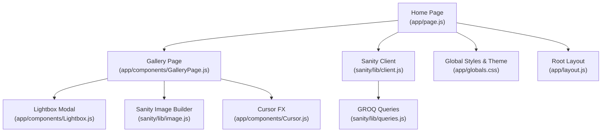
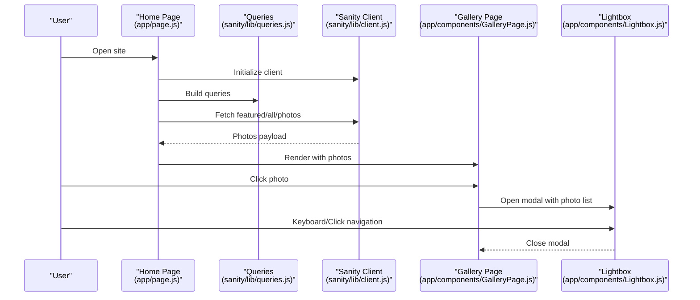
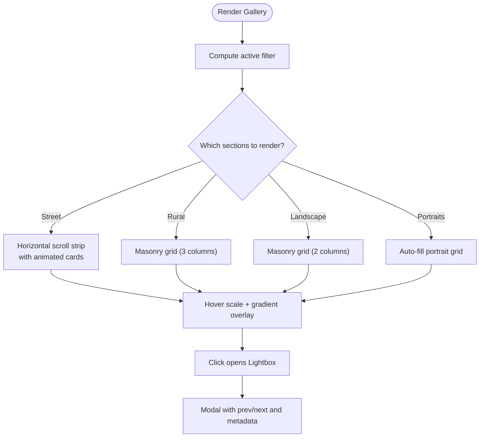
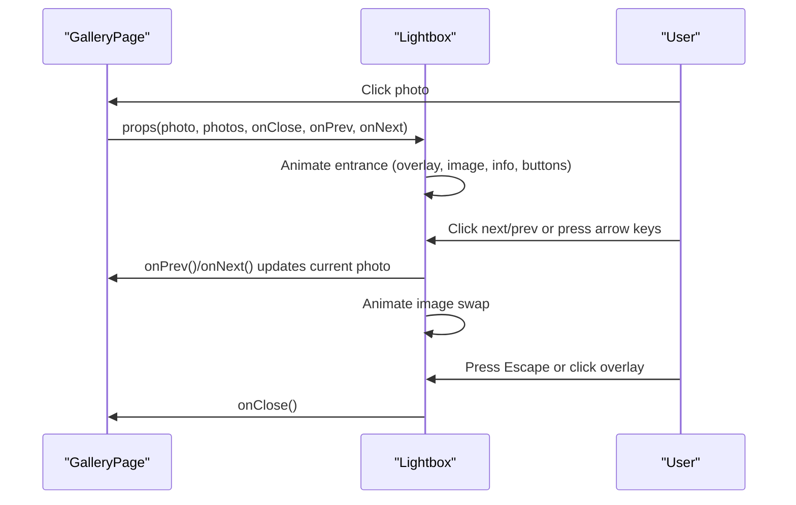
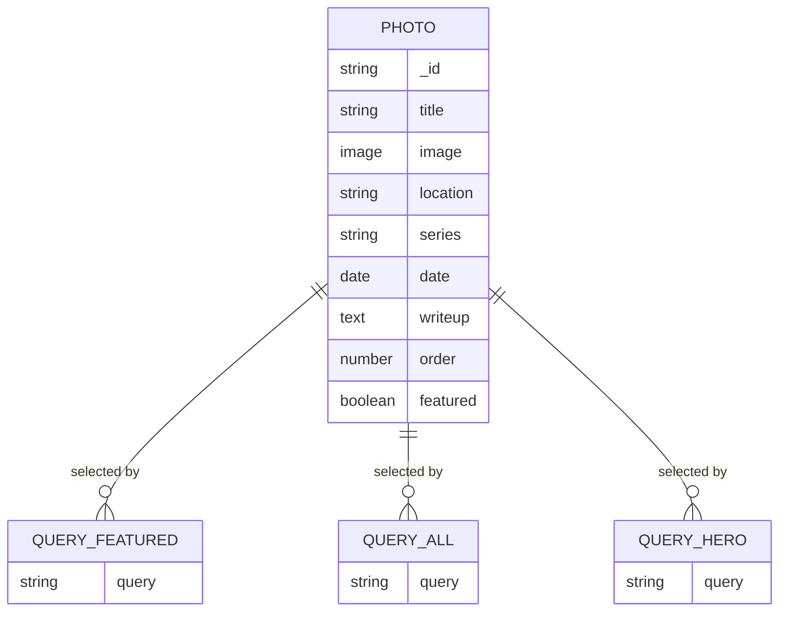
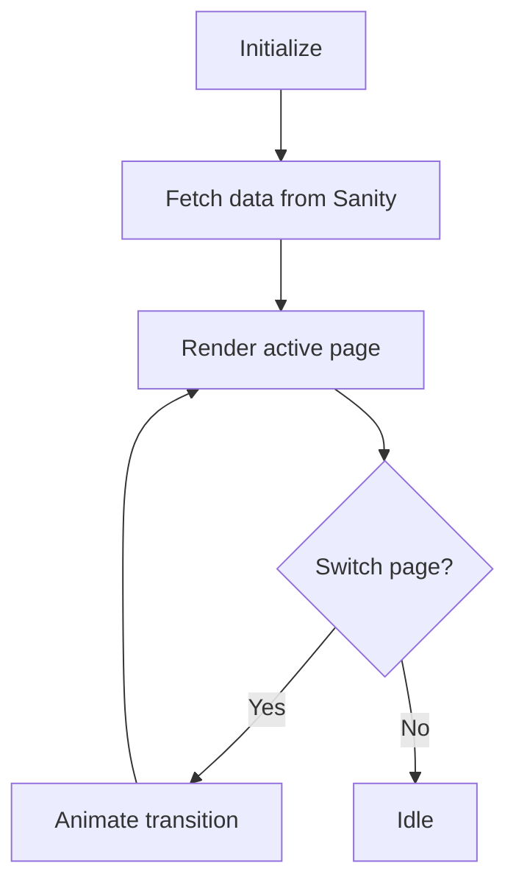
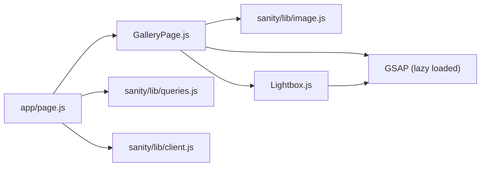

# Photo Gallery System

<cite>
**Referenced Files in This Document**
- [app/page.js](file://app/page.js)
- [app/layout.js](file://app/layout.js)
- [app/globals.css](file://app/globals.css)
- [app/components/GalleryPage.js](file://app/components/GalleryPage.js)
- [app/components/Lightbox.js](file://app/components/Lightbox.js)
- [app/components/Cursor.js](file://app/components/Cursor.js)
- [sanity/lib/client.js](file://sanity/lib/client.js)
- [sanity/lib/image.js](file://sanity/lib/image.js)
- [sanity/lib/queries.js](file://sanity/lib/queries.js)
- [sanity/schemaTypes/photo.js](file://sanity/schemaTypes/photo.js)
- [sanity/env.js](file://sanity/env.js)
</cite>

## Table of Contents
1. [Introduction](#introduction)
2. [Project Structure](#project-structure)
3. [Core Components](#core-components)
4. [Architecture Overview](#architecture-overview)
5. [Detailed Component Analysis](#detailed-component-analysis)
6. [Dependency Analysis](#dependency-analysis)
7. [Performance Considerations](#performance-considerations)
8. [Troubleshooting Guide](#troubleshooting-guide)
9. [Conclusion](#conclusion)
10. [Appendices](#appendices)

## Introduction
This document explains the multi-layout gallery system used in the portfolio website. It covers:
- Layouts: horizontal street strip, masonry rural/countryside and landscape grids, and a portrait grid
- Responsive design patterns and scroll-driven animations
- Lightbox viewer with modal display, navigation controls, and image optimization
- Filtering and sorting of photos
- Lazy loading and performance optimizations for large photo collections
- Extensibility: customizing grids, adding new gallery types, and implementing additional viewing modes
- Accessibility: keyboard navigation and screen reader considerations

## Project Structure
The gallery is a Next.js application with:
- A client-side page that fetches data from Sanity CMS
- A gallery page component that renders multiple layouts
- A lightbox component for modal viewing
- Shared global styles and theme tokens
- Sanity client, image URL builder, and GROQ queries

**Diagram sources**
- [app/page.js:14-131](file://app/page.js#L14-L131)
- [app/components/GalleryPage.js:6-760](file://app/components/GalleryPage.js#L6-L760)
- [app/components/Lightbox.js:5-303](file://app/components/Lightbox.js#L5-L303)
- [sanity/lib/client.js:1-10](file://sanity/lib/client.js#L1-L10)
- [sanity/lib/queries.js:1-33](file://sanity/lib/queries.js#L1-L33)
- [sanity/lib/image.js:1-9](file://sanity/lib/image.js#L1-L9)
- [app/globals.css:1-93](file://app/globals.css#L1-L93)
- [app/layout.js:1-40](file://app/layout.js#L1-L40)
- [app/components/Cursor.js:1-41](file://app/components/Cursor.js#L1-L41)

**Section sources**
- [app/page.js:14-131](file://app/page.js#L14-L131)
- [app/layout.js:31-39](file://app/layout.js#L31-L39)
- [app/globals.css:5-28](file://app/globals.css#L5-L28)

## Core Components
- Home page orchestrates data fetching and page routing
- Gallery page renders multiple layouts and handles filters, hover effects, and scroll-triggered animations
- Lightbox modal provides full-screen viewing with navigation and metadata
- Sanity integration supplies typed photo documents and optimized images
- Global CSS defines theme tokens and responsive base styles

**Section sources**
- [app/page.js:14-131](file://app/page.js#L14-L131)
- [app/components/GalleryPage.js:6-760](file://app/components/GalleryPage.js#L6-L760)
- [app/components/Lightbox.js:5-303](file://app/components/Lightbox.js#L5-L303)
- [sanity/schemaTypes/photo.js:1-93](file://sanity/schemaTypes/photo.js#L1-L93)
- [sanity/lib/queries.js:10-15](file://sanity/lib/queries.js#L10-L15)
- [sanity/lib/image.js:6-8](file://sanity/lib/image.js#L6-L8)
- [app/globals.css:5-28](file://app/globals.css#L5-L28)

## Architecture Overview
The gallery architecture follows a data-first pattern:
- Data is fetched via Sanity client and GROQ queries
- Images are transformed using the Sanity image builder
- Layouts are rendered client-side with scroll-driven animations
- A modal lightbox overlays the current view for focused viewing

**Diagram sources**
- [app/page.js:106-131](file://app/page.js#L106-L131)
- [sanity/lib/queries.js:3-15](file://sanity/lib/queries.js#L3-L15)
- [sanity/lib/client.js:4-9](file://sanity/lib/client.js#L4-L9)
- [app/components/GalleryPage.js:17-37](file://app/components/GalleryPage.js#L17-L37)
- [app/components/Lightbox.js:54-62](file://app/components/Lightbox.js#L54-L62)

## Detailed Component Analysis

### GalleryPage Component
GalleryPage implements:
- Filtering by series: “All”, “Street”, “Rural”, “Landscape”, “Portraits”
- Horizontal scroll strip for street photos with parallax hero and animated cards
- Masonry grids for rural and landscape photos with staggered reveals
- Portrait grid with auto-fill columns
- Hover scaling and overlay text
- Scroll-triggered animations powered by GSAP
- Lightbox integration for modal viewing

**Diagram sources**
- [app/components/GalleryPage.js:39-49](file://app/components/GalleryPage.js#L39-L49)
- [app/components/GalleryPage.js:349-442](file://app/components/GalleryPage.js#L349-L442)
- [app/components/GalleryPage.js:445-531](file://app/components/GalleryPage.js#L445-L531)
- [app/components/GalleryPage.js:533-616](file://app/components/GalleryPage.js#L533-L616)
- [app/components/GalleryPage.js:618-679](file://app/components/GalleryPage.js#L618-L679)
- [app/components/GalleryPage.js:17-37](file://app/components/GalleryPage.js#L17-L37)

Key implementation highlights:
- Filtering and computed lists for each series
- Scroll-triggered reveals for hero text, masonry items, and portrait cards
- Magnetic filter buttons with subtle mouse-based transforms
- Hero background parallax and overlay scrubbing

Responsive design patterns:
- CSS clamp for fluid typography
- Column-based masonry with fixed gutters
- Auto-fill grid for portrait cards
- Scroll-driven animations adapt to viewport and scroll position

Accessibility considerations:
- Keyboard navigation in lightbox (Escape, Arrow keys)
- Focusable buttons and semantic labels
- Reduced motion considerations via matchMedia patterns

**Section sources**
- [app/components/GalleryPage.js:39-49](file://app/components/GalleryPage.js#L39-L49)
- [app/components/GalleryPage.js:349-442](file://app/components/GalleryPage.js#L349-L442)
- [app/components/GalleryPage.js:445-531](file://app/components/GalleryPage.js#L445-L531)
- [app/components/GalleryPage.js:533-616](file://app/components/GalleryPage.js#L533-L616)
- [app/components/GalleryPage.js:618-679](file://app/components/GalleryPage.js#L618-L679)
- [app/components/GalleryPage.js:222-232](file://app/components/GalleryPage.js#L222-L232)
- [app/components/GalleryPage.js:51-220](file://app/components/GalleryPage.js#L51-L220)

### Lightbox Component
Lightbox provides:
- Modal overlay with entrance/exit animations
- Navigation controls (previous/next) and keyboard shortcuts
- Image scaling and containment with optimized URLs
- Metadata panel with series, title, write-up, location, and date
- Hover animations on navigation buttons

**Diagram sources**
- [app/components/GalleryPage.js:17-37](file://app/components/GalleryPage.js#L17-L37)
- [app/components/Lightbox.js:5-303](file://app/components/Lightbox.js#L5-L303)

Accessibility and UX:
- Escape key closes the modal
- Arrow keys navigate between images
- Buttons are focusable and styled for contrast
- Animations are coordinated for smooth transitions

**Section sources**
- [app/components/Lightbox.js:54-62](file://app/components/Lightbox.js#L54-L62)
- [app/components/Lightbox.js:64-77](file://app/components/Lightbox.js#L64-L77)
- [app/components/Lightbox.js:94-142](file://app/components/Lightbox.js#L94-L142)
- [app/components/Lightbox.js:236-298](file://app/components/Lightbox.js#L236-L298)

### Data Layer and Schema
- Sanity schema defines photo fields including title, image, location, series, date, writeup, and order
- GROQ queries fetch featured, all, and hero images with structured projections
- Client initialization sets API version and dataset
- Image URL builder constructs optimized URLs

**Diagram sources**
- [sanity/schemaTypes/photo.js:5-62](file://sanity/schemaTypes/photo.js#L5-L62)
- [sanity/lib/queries.js:3-15](file://sanity/lib/queries.js#L3-L15)
- [sanity/lib/client.js:4-9](file://sanity/lib/client.js#L4-L9)
- [sanity/lib/image.js:6-8](file://sanity/lib/image.js#L6-L8)

**Section sources**
- [sanity/schemaTypes/photo.js:1-93](file://sanity/schemaTypes/photo.js#L1-L93)
- [sanity/lib/queries.js:3-15](file://sanity/lib/queries.js#L3-L15)
- [sanity/lib/client.js:1-10](file://sanity/lib/client.js#L1-L10)
- [sanity/lib/image.js:1-9](file://sanity/lib/image.js#L1-L9)
- [sanity/env.js:1-6](file://sanity/env.js#L1-L6)

### Home Page and Routing
- Dynamically imports gallery, featured, and about pages to keep initial bundle lean
- Fetches photos and hero data concurrently
- Manages page transitions and intro animation

**Diagram sources**
- [app/page.js:14-131](file://app/page.js#L14-L131)

**Section sources**
- [app/page.js:9-12](file://app/page.js#L9-L12)
- [app/page.js:106-131](file://app/page.js#L106-L131)
- [app/page.js:136-145](file://app/page.js#L136-L145)

## Dependency Analysis
- GalleryPage depends on:
  - Sanity image builder for optimized URLs
  - GSAP for scroll-driven animations and modal transitions
  - Lightbox component for modal display
- Lightbox depends on:
  - GSAP for entrance/exit animations and image swap
  - Sanity image builder for image URLs
- Home page depends on:
  - Sanity client and queries
  - Dynamic imports for client-side rendering

**Diagram sources**
- [app/components/GalleryPage.js:3-4](file://app/components/GalleryPage.js#L3-L4)
- [app/components/Lightbox.js:2-3](file://app/components/Lightbox.js#L2-L3)
- [app/page.js:3-4](file://app/page.js#L3-L4)
- [sanity/lib/queries.js:1-2](file://sanity/lib/queries.js#L1-L2)
- [sanity/lib/client.js:1-2](file://sanity/lib/client.js#L1-L2)

**Section sources**
- [app/components/GalleryPage.js:3-4](file://app/components/GalleryPage.js#L3-L4)
- [app/components/Lightbox.js:2-3](file://app/components/Lightbox.js#L2-L3)
- [app/page.js:3-4](file://app/page.js#L3-L4)
- [sanity/lib/queries.js:1-2](file://sanity/lib/queries.js#L1-L2)
- [sanity/lib/client.js:1-2](file://sanity/lib/client.js#L1-L2)

## Performance Considerations
- Lazy loading:
  - GalleryPage and other heavy pages are dynamically imported
  - GSAP plugins are lazy-loaded when needed
- Image optimization:
  - Sanity image builder generates optimized URLs with width and quality parameters
- Scroll performance:
  - Scroll-triggered animations are registered and killed on filter changes
  - CSS will-change hints and transform-based animations minimize layout thrash
- Data fetching:
  - Concurrent fetch of multiple datasets reduces total load time
- Accessibility:
  - Reduced motion support can be integrated via matchMedia to disable or shorten animations

Recommendations:
- Add IntersectionObserver-based lazy loading for offscreen images
- Consider preloading hero images
- Debounce filter button interactions to avoid frequent re-initialization of ScrollTrigger

**Section sources**
- [app/page.js:9-11](file://app/page.js#L9-L11)
- [app/components/GalleryPage.js:55-58](file://app/components/GalleryPage.js#L55-L58)
- [app/components/GalleryPage.js:326-331](file://app/components/GalleryPage.js#L326-L331)
- [sanity/lib/image.js:6-8](file://sanity/lib/image.js#L6-L8)

## Troubleshooting Guide
Common issues and resolutions:
- Lightbox does not open:
  - Ensure the clicked photo exists in the provided list and that open/close handlers are wired
- Animations not playing:
  - Verify GSAP is lazy-loaded and ScrollTrigger is registered before use
- Images appear blurry:
  - Confirm width and quality parameters are set appropriately in the image URL builder
- Filter resets unexpectedly:
  - Check that ScrollTrigger instances are killed and re-initialized when changing filters
- Keyboard navigation not working:
  - Ensure event listeners are attached and removed properly on mount/unmount

**Section sources**
- [app/components/Lightbox.js:54-62](file://app/components/Lightbox.js#L54-L62)
- [app/components/GalleryPage.js:55-58](file://app/components/GalleryPage.js#L55-L58)
- [app/components/GalleryPage.js:326-331](file://app/components/GalleryPage.js#L326-L331)

## Conclusion
The gallery system combines a flexible multi-layout rendering approach with scroll-driven animations and a polished lightbox viewer. By leveraging Sanity’s typed content model and optimized image delivery, it scales efficiently for large photo collections while maintaining strong accessibility and responsive behavior.

## Appendices

### Customizing Grid Layouts
- Add a new series:
  - Extend the series filter logic and add a new section block similar to existing masonry or portrait grids
  - Reference: [app/components/GalleryPage.js:39-49](file://app/components/GalleryPage.js#L39-L49), [app/components/GalleryPage.js:445-531](file://app/components/GalleryPage.js#L445-L531)
- Modify masonry columns:
  - Adjust the CSS column count and gutters in the masonry containers
  - Reference: [app/components/GalleryPage.js:474](file://app/components/GalleryPage.js#L474), [app/components/GalleryPage.js:561](file://app/components/GalleryPage.js#L561)
- Change portrait grid sizing:
  - Update the grid template columns and card heights
  - Reference: [app/components/GalleryPage.js:636](file://app/components/GalleryPage.js#L636), [app/components/GalleryPage.js:648](file://app/components/GalleryPage.js#L648)

### Adding New Gallery Types
- Define a new section:
  - Create a new conditional block rendering a distinct layout (e.g., grid, carousel, or masonry)
  - Reference: [app/components/GalleryPage.js:349-442](file://app/components/GalleryPage.js#L349-L442)
- Integrate with filters:
  - Add a new filter option and update the filtered list computation
  - Reference: [app/components/GalleryPage.js:317-344](file://app/components/GalleryPage.js#L317-L344), [app/components/GalleryPage.js:45-49](file://app/components/GalleryPage.js#L45-L49)

### Additional Photo Viewing Modes
- Implement a carousel:
  - Use a slider component with navigation controls and keyboard support
  - Reference: [app/components/Lightbox.js:236-298](file://app/components/Lightbox.js#L236-L298)
- Add fullscreen mode:
  - Expand modal to cover viewport and adjust image containment
  - Reference: [app/components/Lightbox.js:150-169](file://app/components/Lightbox.js#L150-L169)

### Accessibility Enhancements
- Keyboard navigation:
  - Ensure Escape and Arrow keys are handled consistently
  - Reference: [app/components/Lightbox.js:55-59](file://app/components/Lightbox.js#L55-L59)
- Screen reader labels:
  - Add aria-labels to navigation buttons and modal container
  - Reference: [app/components/Lightbox.js:109-131](file://app/components/Lightbox.js#L109-L131), [app/components/Lightbox.js:240-296](file://app/components/Lightbox.js#L240-L296)
- Reduced motion:
  - Integrate matchMedia to disable or shorten animations
  - Reference: [.agents/skills/gsap-core/SKILL.md:206-237](file://.agents/skills/gsap-core/SKILL.md#L206-L237)