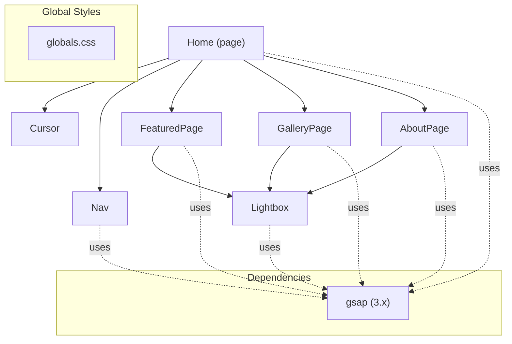
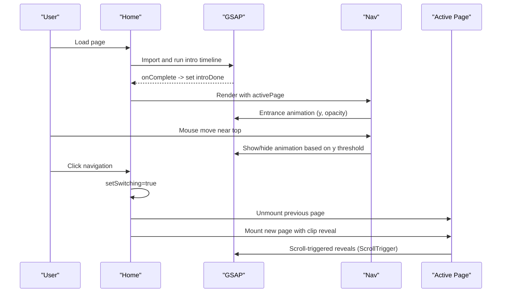
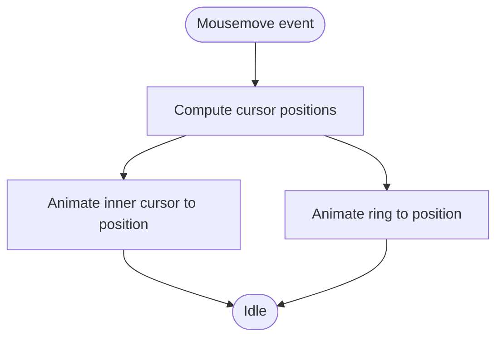
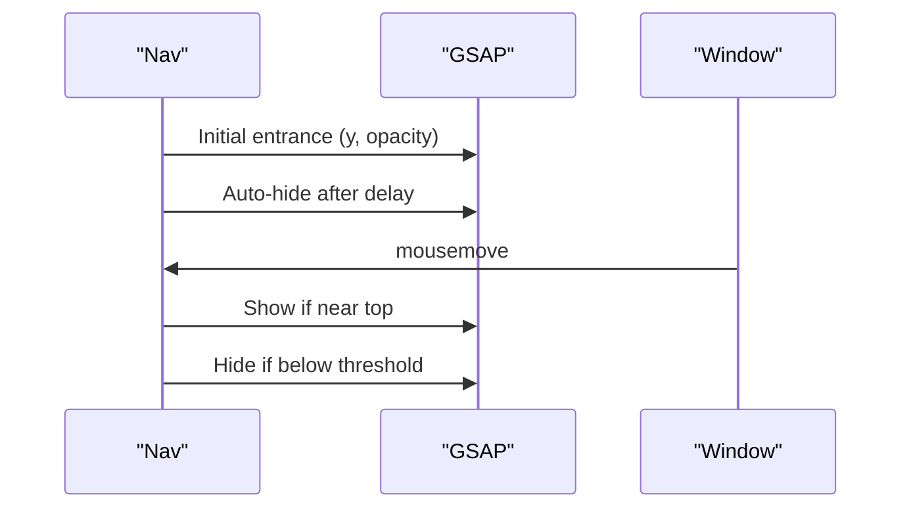
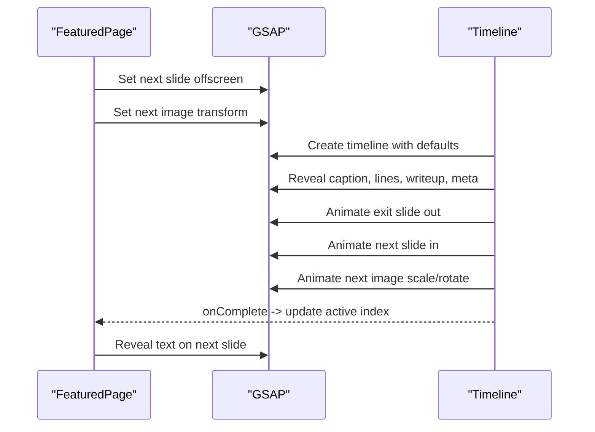
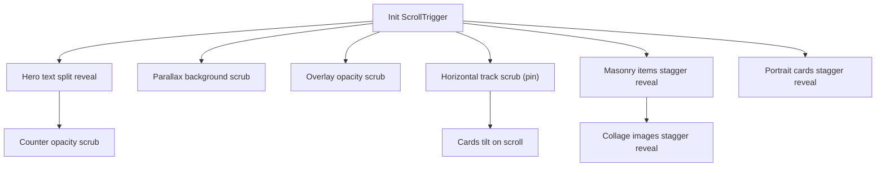
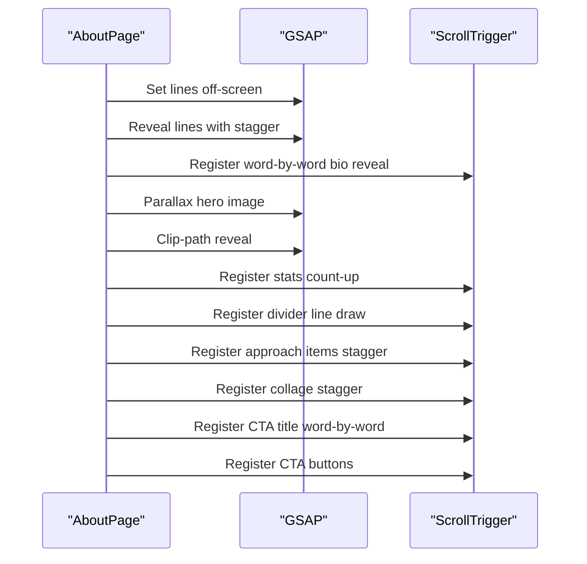
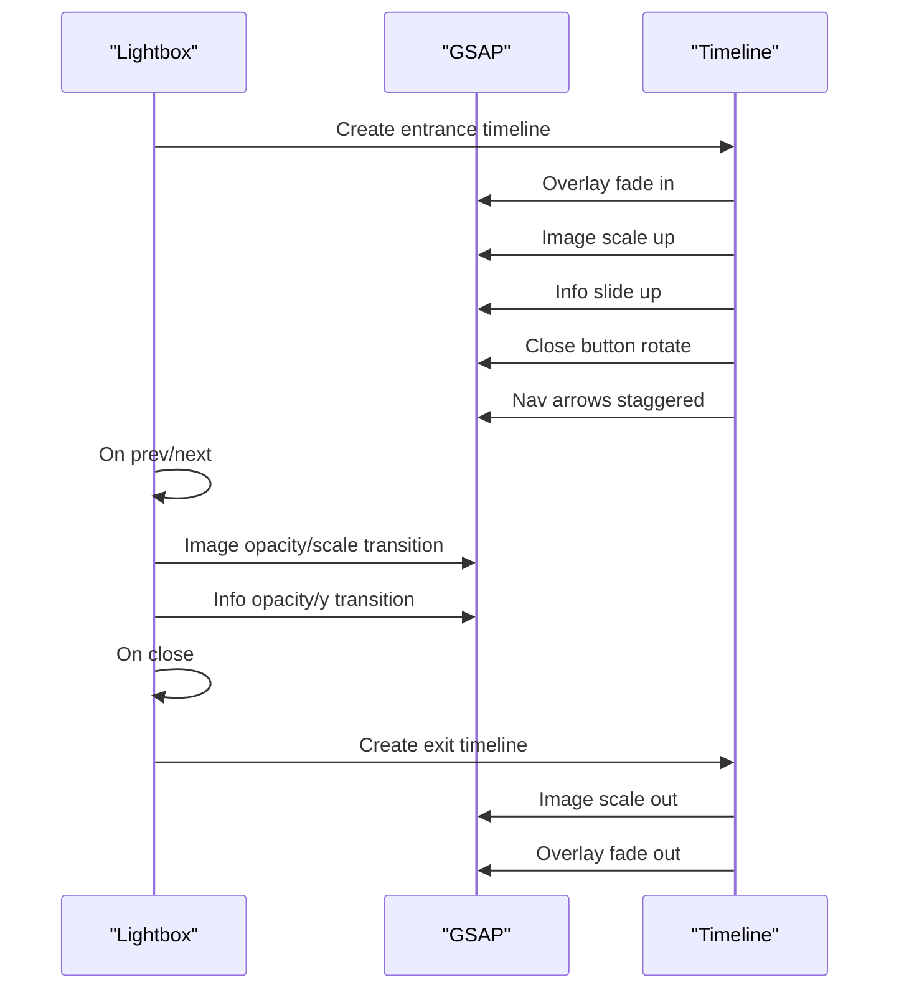
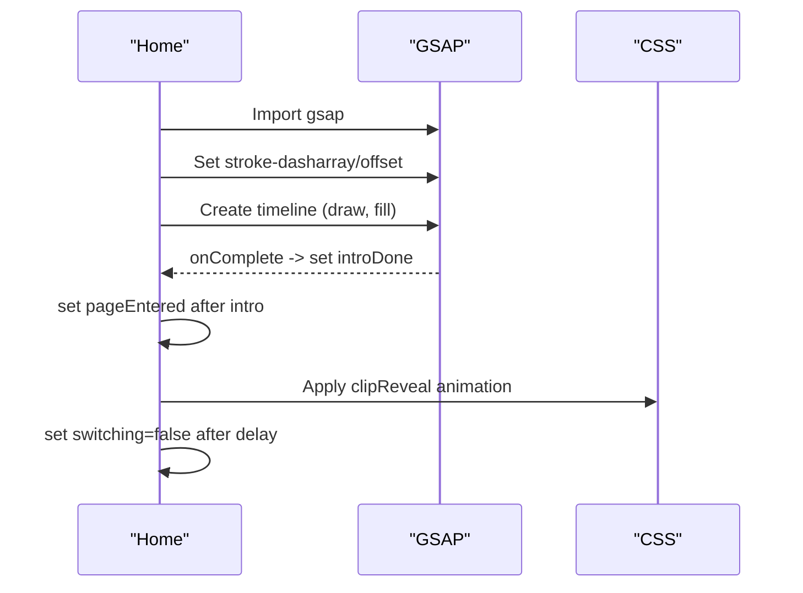
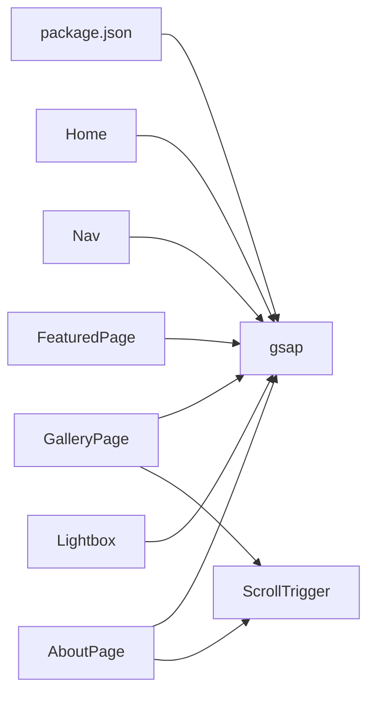

# Animation System

<cite>
**Referenced Files in This Document**
- [Cursor.js](file://app/components/Cursor.js)
- [Nav.js](file://app/components/Nav.js)
- [FeaturedPage.js](file://app/components/FeaturedPage.js)
- [GalleryPage.js](file://app/components/GalleryPage.js)
- [AboutPage.js](file://app/components/AboutPage.js)
- [Lightbox.js](file://app/components/Lightbox.js)
- [Home.js](file://app/page.js)
- [globals.css](file://app/globals.css)
- [package.json](file://package.json)
- [SKILL.md (GSAP Core)](file://.agents/skills/gsap-core/SKILL.md)
- [SKILL.md (GSAP ScrollTrigger)](file://.agents/skills/gsap-scrolltrigger/SKILL.md)
- [SKILL.md (GSAP Frameworks)](file://.agents/skills/gsap-frameworks/SKILL.md)
</cite>

## Table of Contents
1. [Introduction](#introduction)
2. [Project Structure](#project-structure)
3. [Core Components](#core-components)
4. [Architecture Overview](#architecture-overview)
5. [Detailed Component Analysis](#detailed-component-analysis)
6. [Dependency Analysis](#dependency-analysis)
7. [Performance Considerations](#performance-considerations)
8. [Troubleshooting Guide](#troubleshooting-guide)
9. [Conclusion](#conclusion)
10. [Appendices](#appendices)

## Introduction
This document explains the GSAP-based animation system powering the photography portfolio. It covers integration setup, timeline creation patterns, and sequencing for smooth page transitions, photo slideshow animations, navigation interactions, and cursor behaviors. It documents the animation architecture, controller patterns, state-driven animations, performance optimizations, accessibility considerations, and debugging techniques. The system blends React state with GSAP timelines and ScrollTrigger for scroll-linked animations, while maintaining performance and user preference support.

## Project Structure
The animation system is organized around Next.js pages and components, with GSAP integrated at the component boundaries and page transitions. Key areas:
- Page-level transitions and intro animation
- Navigation entrance, idle, and hover interactions
- Photo slideshow with directional transitions and text reveals
- Gallery with scroll-triggered reveals, parallax, and horizontal tracks
- About page with word-by-word reveals and stats
- Lightbox modal with entrance/exit animations and keyboard navigation
- Global CSS for reduced-motion and page clip transitions

**Diagram sources**
- [Home.js:14-227](file://app/page.js#L14-L227)
- [Cursor.js:1-42](file://app/components/Cursor.js#L1-L42)
- [Nav.js:1-168](file://app/components/Nav.js#L1-L168)
- [FeaturedPage.js:1-269](file://app/components/FeaturedPage.js#L1-L269)
- [GalleryPage.js:1-760](file://app/components/GalleryPage.js#L1-L760)
- [AboutPage.js:1-458](file://app/components/AboutPage.js#L1-L458)
- [Lightbox.js:1-303](file://app/components/Lightbox.js#L1-L303)
- [globals.css:1-93](file://app/globals.css#L1-L93)
- [package.json:14](file://package.json#L14)

**Section sources**
- [Home.js:14-227](file://app/page.js#L14-L227)
- [package.json:14](file://package.json#L14)

## Core Components
- Cursor: Smooth mouse-following cursor and ring using gsap.to() with overwrite behavior.
- Nav: Entrance and idle animations with power-based eases; mouse-triggered show/hide.
- FeaturedPage: Slideshow with directional transitions, staggered text reveals, and counter animation.
- GalleryPage: Scroll-triggered reveals, parallax backgrounds, horizontal track scrubbing, and magnetic filters.
- AboutPage: Word-by-word reveals, stats counting, and section labels with ScrollTrigger.
- Lightbox: Modal entrance/exit with staggered elements and keyboard navigation.
- Home: Intro SVG animation with stroke-dash drawing and fill, plus page transition controls.

**Section sources**
- [Cursor.js:5-42](file://app/components/Cursor.js#L5-L42)
- [Nav.js:10-68](file://app/components/Nav.js#L10-L68)
- [FeaturedPage.js:14-105](file://app/components/FeaturedPage.js#L14-L105)
- [GalleryPage.js:51-220](file://app/components/GalleryPage.js#L51-L220)
- [AboutPage.js:11-162](file://app/components/AboutPage.js#L11-L162)
- [Lightbox.js:14-90](file://app/components/Lightbox.js#L14-L90)
- [Home.js:33-101](file://app/page.js#L33-L101)

## Architecture Overview
The system follows a React-first architecture with GSAP orchestrating animations:
- React manages state (active page, slideshow index, hover states).
- GSAP handles timing, easing, and sequencing for UI and scroll-driven animations.
- ScrollTrigger coordinates scroll-linked animations and lifecycle cleanup.
- Global CSS integrates reduced-motion support and page clip transitions.

**Diagram sources**
- [Home.js:33-101](file://app/page.js#L33-L101)
- [Nav.js:10-68](file://app/components/Nav.js#L10-L68)
- [globals.css:65-79](file://app/globals.css#L65-L79)
- [GalleryPage.js:51-220](file://app/components/GalleryPage.js#L51-L220)

## Detailed Component Analysis

### Cursor Interaction
- Smooth mouse tracking with two layered elements (inner dot and outer ring).
- Uses gsap.to() with short durations and overwrite behavior to minimize overlap.
- Fixed positioning with blend modes for visual contrast.

**Diagram sources**
- [Cursor.js:9-21](file://app/components/Cursor.js#L9-L21)

**Section sources**
- [Cursor.js:5-42](file://app/components/Cursor.js#L5-L42)

### Navigation Controller
- Entrances on mount and after idle timeout.
- Mouse-triggered show/hide based on cursor proximity to top of viewport.
- Uses power-based eases for natural motion.

**Diagram sources**
- [Nav.js:10-68](file://app/components/Nav.js#L10-L68)

**Section sources**
- [Nav.js:10-68](file://app/components/Nav.js#L10-L68)

### Featured Photo Slideshow
- Directional transitions with staggered text reveals.
- Counter animation synchronized with slide change.
- Transform aliases for smooth movement and rotation.

**Diagram sources**
- [FeaturedPage.js:56-105](file://app/components/FeaturedPage.js#L56-L105)
- [FeaturedPage.js:36-54](file://app/components/FeaturedPage.js#L36-L54)

**Section sources**
- [FeaturedPage.js:14-105](file://app/components/FeaturedPage.js#L14-L105)

### Gallery Scroll-Driven Animations
- Hero character split reveal and eyebrow fade.
- Parallax background and overlay scrubbing.
- Horizontal track scrubbing with pinned section.
- Masonry and portrait section reveals with stagger.
- Magnetic filter buttons with transform-based hover.

**Diagram sources**
- [GalleryPage.js:51-220](file://app/components/GalleryPage.js#L51-L220)

**Section sources**
- [GalleryPage.js:51-220](file://app/components/GalleryPage.js#L51-L220)

### About Page Reveal Patterns
- Line-by-line hero title reveal.
- Word-by-word biography reveal.
- Parallax hero image and clip-path reveal.
- Stats counting animation.
- Divider line draw and approach items stagger.
- Photo collage staggered reveal.
- CTA title word-by-word reveal and button magnetic hover.

**Diagram sources**
- [AboutPage.js:11-162](file://app/components/AboutPage.js#L11-L162)

**Section sources**
- [AboutPage.js:11-162](file://app/components/AboutPage.js#L11-L162)

### Lightbox Modal
- Modal entrance with overlay fade, image scale, info slide, and nav arrows.
- Image swap animation on navigation with opacity and scale transitions.
- Keyboard navigation (escape, arrow keys).
- Hover states with GSAP-driven transforms.

**Diagram sources**
- [Lightbox.js:14-90](file://app/components/Lightbox.js#L14-L90)

**Section sources**
- [Lightbox.js:14-90](file://app/components/Lightbox.js#L14-L90)

### Page Transitions and Intro
- Intro SVG animation with stroke-dash drawing and fill.
- Page clip reveal using CSS animation and GSAP timeline completion.
- Switching state to coordinate page transitions and prevent race conditions.

**Diagram sources**
- [Home.js:33-101](file://app/page.js#L33-L101)
- [globals.css:65-79](file://app/globals.css#L65-L79)

**Section sources**
- [Home.js:33-101](file://app/page.js#L33-L101)
- [globals.css:65-79](file://app/globals.css#L65-L79)

## Dependency Analysis
- GSAP is a direct dependency and used across components for tweens, timelines, and ScrollTrigger.
- ScrollTrigger is registered once per component that needs scroll-driven animations.
- React state manages page switching, slideshow indices, and hover states; GSAP controls the motion.

**Diagram sources**
- [package.json:14](file://package.json#L14)
- [GalleryPage.js:57](file://app/components/GalleryPage.js#L57)
- [AboutPage.js:17](file://app/components/AboutPage.js#L17)

**Section sources**
- [package.json:14](file://package.json#L14)
- [GalleryPage.js:57](file://app/components/GalleryPage.js#L57)
- [AboutPage.js:17](file://app/components/AboutPage.js#L17)

## Performance Considerations
- Use transform aliases (x, y, scale, rotation) instead of layout properties for smoother animations.
- Prefer gsap.to() with overwrite behavior to avoid overlapping tweens.
- Use will-change and transform-origin hints where appropriate.
- Leverage ScrollTrigger scrubbing for efficient scroll-linked animations.
- Minimize DOM reads during animations; cache element references.
- Use reduced-motion support to disable or shorten animations for accessibility.

[No sources needed since this section provides general guidance]

## Troubleshooting Guide
- ScrollTrigger not firing: ensure ScrollTrigger.refresh() is called after layout changes (fonts, images, dynamic content).
- Animations not cleaning up: kill ScrollTrigger instances on unmount or use framework-specific cleanup patterns.
- Overlapping tweens: use overwrite behavior or kill existing tweens before starting new ones.
- Reduced motion issues: respect prefers-reduced-motion by skipping or shortening animations.

**Section sources**
- [SKILL.md (GSAP ScrollTrigger):259-268](file://.agents/skills/gsap-scrolltrigger/SKILL.md#L259-L268)
- [globals.css:81-83](file://app/globals.css#L81-L83)

## Conclusion
The animation system combines React state management with GSAP’s powerful tweening and timeline capabilities, enriched by ScrollTrigger for scroll-driven experiences. It delivers smooth page transitions, engaging photo slideshows, interactive navigation, and immersive gallery and about pages. The architecture emphasizes performance, accessibility, and maintainability, with clear separation of concerns between state and motion.

[No sources needed since this section summarizes without analyzing specific files]

## Appendices

### Animation Timing Functions and Easing Curves
- Power-based eases for natural motion (power1, power2, power3, power4).
- Back and elastic for playful overshoots.
- None for linear motion when needed.
- Custom easiness can be achieved with CustomEase when required.

**Section sources**
- [SKILL.md (GSAP Core):116-143](file://.agents/skills/gsap-core/SKILL.md#L116-L143)

### Accessibility and Reduced Motion Support
- Respect prefers-reduced-motion by skipping or shortening animations.
- Provide alternative static states for motion-sensitive users.
- Ensure keyboard navigation remains functional alongside mouse interactions.

**Section sources**
- [globals.css:81-83](file://app/globals.css#L81-L83)
- [SKILL.md (GSAP Core):206-237](file://.agents/skills/gsap-core/SKILL.md#L206-L237)

### Browser Compatibility Approaches
- Use transform aliases for cross-browser stability.
- Avoid animating layout-heavy properties; prefer transforms.
- Test ScrollTrigger behavior across devices and browsers; adjust scrub and ease as needed.

**Section sources**
- [SKILL.md (GSAP Core):67-95](file://.agents/skills/gsap-core/SKILL.md#L67-L95)
- [SKILL.md (GSAP ScrollTrigger):272-291](file://.agents/skills/gsap-scrolltrigger/SKILL.md#L272-L291)