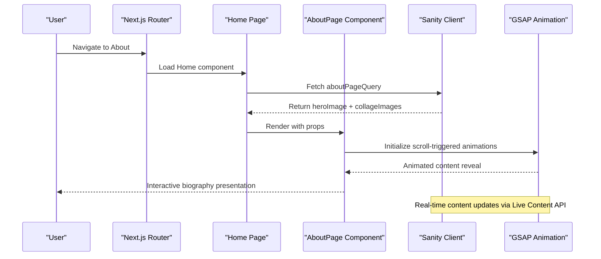
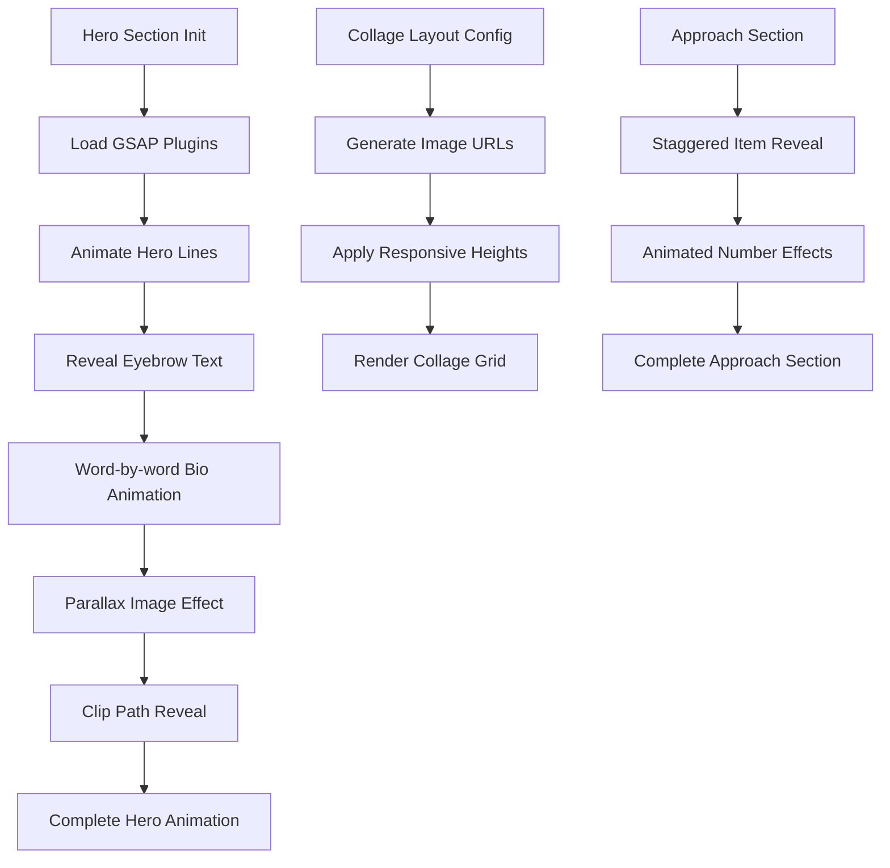
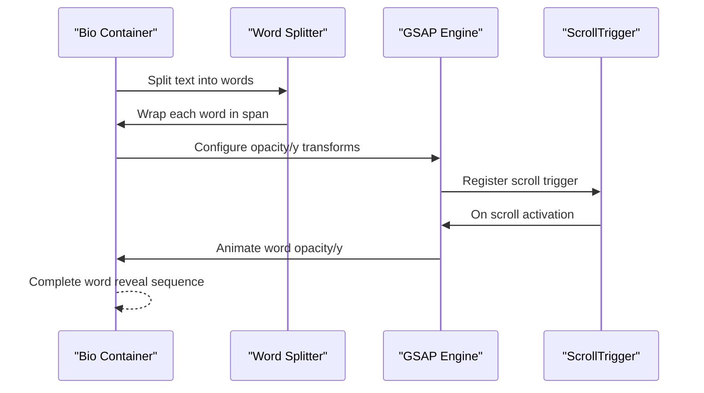
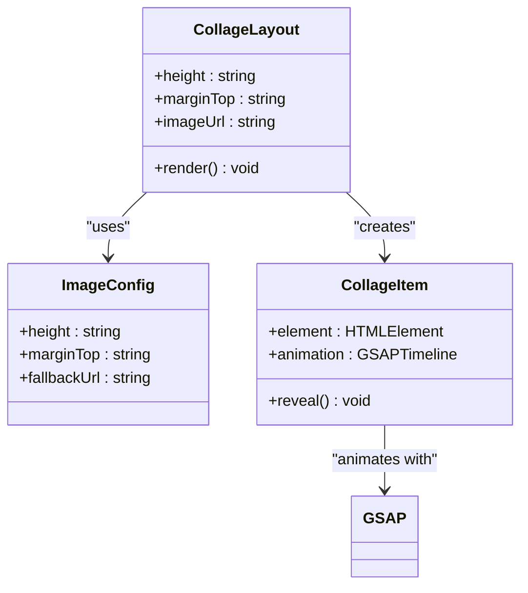
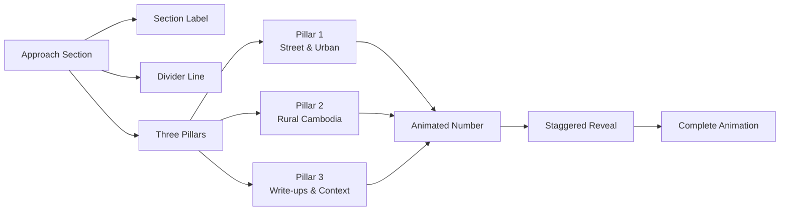
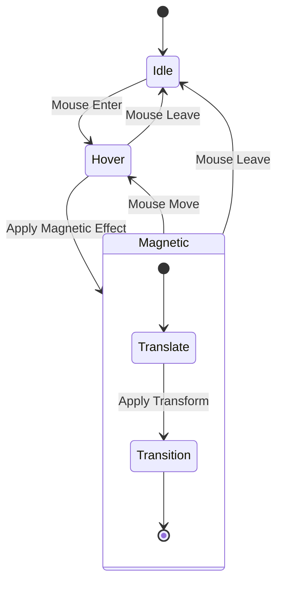
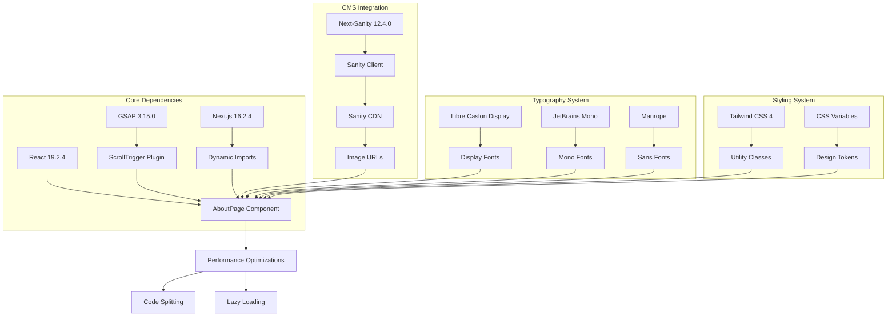

# About Page Component

<cite>
**Referenced Files in This Document**
- [AboutPage.js](file://app/components/AboutPage.js)
- [page.js](file://app/page.js)
- [Nav.js](file://app/components/Nav.js)
- [Cursor.js](file://app/components/Cursor.js)
- [layout.js](file://app/layout.js)
- [globals.css](file://app/globals.css)
- [aboutPage.js](file://sanity/schemaTypes/aboutPage.js)
- [queries.js](file://sanity/lib/queries.js)
- [client.js](file://sanity/lib/client.js)
- [env.js](file://sanity/env.js)
- [live.js](file://sanity/lib/live.js)
- [package.json](file://package.json)
</cite>

## Table of Contents
1. [Introduction](#introduction)
2. [Project Structure](#project-structure)
3. [Core Components](#core-components)
4. [Architecture Overview](#architecture-overview)
5. [Detailed Component Analysis](#detailed-component-analysis)
6. [Dependency Analysis](#dependency-analysis)
7. [Performance Considerations](#performance-considerations)
8. [Troubleshooting Guide](#troubleshooting-guide)
9. [Conclusion](#conclusion)
10. [Appendices](#appendices)

## Introduction
This document provides comprehensive technical documentation for the About Page component implementation in the WRD Photography portfolio. It covers the artist biography presentation system, including hero image display, biographical content formatting, and image collage layout. The guide explains the component's responsive design for different content arrangements, typography hierarchy, and visual storytelling elements. It details the integration with Sanity CMS for content management, dynamic content rendering, and real-time updates. Implementation of the page layout system, content section organization, and accessibility features for biography content are included. Examples of content customization, layout variations, and integration with the overall site design system are provided.

## Project Structure
The About Page implementation spans React components, Sanity CMS integration, and Next.js routing. The structure follows a modular approach with clear separation between presentation, data fetching, and content management.

```mermaid
graph TB
subgraph "Next.js Application"
A[app/page.js] --> B[app/components/AboutPage.js]
A --> C[app/components/Nav.js]
A --> D[app/components/Cursor.js]
E[app/layout.js] --> F[app/globals.css]
end
subgraph "Sanity CMS"
G[sanity/lib/client.js] --> H[sanity/lib/queries.js]
I[sanity/schemaTypes/aboutPage.js] --> H
J[sanity/env.js]
K[sanity/lib/live.js]
end
subgraph "External Dependencies"
L[gsap] --> B
M[next-sanity] --> G
N[@sanity/image-url] --> B
end
A --> G
B --> N
G --> J
H --> G
K --> A
```

**Diagram sources**
- [page.js:14-227](file://app/page.js#L14-L227)
- [AboutPage.js:1-458](file://app/components/AboutPage.js#L1-L458)
- [client.js:1-10](file://sanity/lib/client.js#L1-L10)

**Section sources**
- [page.js:14-227](file://app/page.js#L14-L227)
- [layout.js:31-40](file://app/layout.js#L31-L40)

## Core Components
The About Page system consists of several interconnected components that work together to deliver a cohesive visual narrative:

### AboutPage Component
The primary component responsible for rendering the biography content with sophisticated animations and responsive layouts. It implements a scroll-driven animation system using GSAP for all content reveals.

### Data Management Layer
The system fetches content from Sanity CMS using GROQ queries and manages real-time updates through the next-sanity Live Content API.

### Presentation Layer
The component handles typography hierarchy, responsive design patterns, and visual storytelling through carefully crafted CSS-in-JS styling and animation sequences.

**Section sources**
- [AboutPage.js:5-458](file://app/components/AboutPage.js#L5-L458)
- [queries.js:27-33](file://sanity/lib/queries.js#L27-L33)

## Architecture Overview
The About Page follows a client-side rendering architecture with dynamic imports for optimal performance. The system integrates seamlessly with Sanity CMS for content management while maintaining excellent user experience through sophisticated animations.



**Diagram sources**
- [page.js:106-131](file://app/page.js#L106-L131)
- [AboutPage.js:11-162](file://app/components/AboutPage.js#L11-L162)
- [queries.js:27-33](file://sanity/lib/queries.js#L27-L33)

## Detailed Component Analysis

### Hero Section Implementation
The hero section serves as the visual centerpiece, combining typography animation with parallax imagery to create an immersive introduction to the photographer's work.



**Diagram sources**
- [AboutPage.js:23-66](file://app/components/AboutPage.js#L23-L66)
- [AboutPage.js:181-197](file://app/components/AboutPage.js#L181-L197)

#### Typography Hierarchy System
The component implements a sophisticated typography system with three distinct font families:
- **Display Font**: Libre Caslon Display for italic headings and quotes
- **Mono Font**: JetBrains Mono for technical elements and navigation
- **Sans Font**: Manrope for body text and interface elements

The typography scales responsively using clamp() units to ensure optimal readability across devices while maintaining design intent.

#### Hero Image Parallax System
The hero image employs a sophisticated parallax effect where the image moves at a different speed than the scroll container, creating depth and visual interest. The system uses GSAP ScrollTrigger to coordinate timing and easing functions.

**Section sources**
- [AboutPage.js:203-256](file://app/components/AboutPage.js#L203-L256)
- [AboutPage.js:52-66](file://app/components/AboutPage.js#L52-L66)

### Biography Content Formatting
The biography content undergoes a multi-stage animation process that transforms static text into an engaging narrative experience.



**Diagram sources**
- [AboutPage.js:39-50](file://app/components/AboutPage.js#L39-L50)

#### Content Customization Options
The biography system supports dynamic content through:
- **Hotspot-aware image URLs** via @sanity/image-url
- **Responsive typography scaling** using CSS clamp()
- **Flexible content arrangement** through CSS Grid layouts
- **Animation timing customization** through GSAP configuration

**Section sources**
- [AboutPage.js:230-237](file://app/components/AboutPage.js#L230-L237)
- [AboutPage.js:40-50](file://app/components/AboutPage.js#L40-L50)

### Image Collage Layout System
The collage section presents multiple photographic works in a responsive grid layout with individualized sizing and positioning.



**Diagram sources**
- [AboutPage.js:181-197](file://app/components/AboutPage.js#L181-L197)
- [AboutPage.js:284-303](file://app/components/AboutPage.js#L284-L303)

#### Responsive Design Patterns
The collage system implements a three-column grid layout that adapts to different screen sizes:
- **Desktop**: Full-width three-column layout
- **Tablet**: Two-column layout with adjusted spacing
- **Mobile**: Single-column stacked layout

Individual image heights are calculated based on content importance and visual balance.

**Section sources**
- [AboutPage.js:284-303](file://app/components/AboutPage.js#L284-L303)
- [AboutPage.js:181-197](file://app/components/AboutPage.js#L181-L197)

### Approach Section Organization
The approach section presents the photographer's methodology through three distinct pillars, each with animated numbering and contextual information.



**Diagram sources**
- [AboutPage.js:306-363](file://app/components/AboutPage.js#L306-L363)

#### Animation Sequencing
The approach section employs a sophisticated animation sequence:
1. **Section Labels**: Slide-in entrance with X-axis movement
2. **Number Elements**: Staggered reveal with delayed timing
3. **Content Blocks**: Individual item animations with Y-axis movement
4. **Visual Dividers**: Scaling animations for emphasis

**Section sources**
- [AboutPage.js:95-109](file://app/components/AboutPage.js#L95-L109)
- [AboutPage.js:144-150](file://app/components/AboutPage.js#L144-L150)

### Call-to-Action Integration
The CTA section combines contact information with interactive buttons that feature magnetic hover effects and subtle animations.



**Diagram sources**
- [AboutPage.js:164-174](file://app/components/AboutPage.js#L164-L174)
- [AboutPage.js:365-427](file://app/components/AboutPage.js#L365-L427)

#### Interactive Button System
The button system implements magnetic physics where elements move proportionally to mouse movement, creating an engaging user experience. Buttons feature:
- **Magnetic Movement**: Proportional to cursor distance from element center
- **Smooth Transitions**: Cubic-bezier easing for natural motion
- **Theme Adaptation**: Automatic color scheme switching based on context

**Section sources**
- [AboutPage.js:390-426](file://app/components/AboutPage.js#L390-L426)
- [AboutPage.js:164-174](file://app/components/AboutPage.js#L164-L174)

## Dependency Analysis
The About Page component relies on several key dependencies that enable its sophisticated functionality and seamless integration with the broader application ecosystem.



**Diagram sources**
- [package.json:11-22](file://package.json#L11-L22)
- [AboutPage.js:16-18](file://app/components/AboutPage.js#L16-L18)

### External Library Integration
The component integrates multiple external libraries to achieve its functionality:

#### GSAP Animation System
The animation library provides sophisticated scroll-triggered animations with precise timing control and performance optimization. The system registers plugins dynamically to minimize initial bundle size.

#### Sanity Image URL Generation
The @sanity/image-url library generates optimized image URLs with automatic resizing and quality adjustments based on content requirements.

#### Next-Sanity Live Content
The next-sanity package enables real-time content updates through a live content API, allowing content changes to reflect immediately without page refresh.

**Section sources**
- [AboutPage.js:16-18](file://app/components/AboutPage.js#L16-L18)
- [client.js:4-9](file://sanity/lib/client.js#L4-L9)
- [live.js:7-9](file://sanity/lib/live.js#L7-L9)

## Performance Considerations
The About Page implementation prioritizes performance through several optimization strategies:

### Dynamic Import Strategy
Components are loaded dynamically using Next.js dynamic imports, reducing initial bundle size and improving first-contentful-paint metrics.

### Animation Performance
Animations leverage GPU acceleration through transform properties and use efficient easing functions to maintain smooth performance across devices.

### Image Optimization
Images are automatically optimized through Sanity's image pipeline with appropriate sizing and quality settings for different contexts.

### Memory Management
ScrollTrigger instances are properly cleaned up when components unmount to prevent memory leaks and performance degradation.

**Section sources**
- [page.js:9-11](file://app/page.js#L9-L11)
- [AboutPage.js:157-162](file://app/components/AboutPage.js#L157-L162)

## Troubleshooting Guide

### Common Issues and Solutions

#### Animation Not Triggering
**Problem**: Scroll animations fail to activate
**Solution**: Verify that ScrollTrigger is properly registered and that trigger elements exist in the DOM before initialization.

#### Image Loading Failures
**Problem**: Collage images fail to load or display incorrectly
**Solution**: Check that Sanity image assets are properly configured and that fallback URLs are available for graceful degradation.

#### Typography Rendering Issues
**Problem**: Fonts not loading or displaying incorrectly
**Solution**: Ensure font loading is complete before attempting to measure text lengths and verify CSS variable definitions are properly set.

#### Navigation Problems
**Problem**: About page not accessible through navigation
**Solution**: Verify that the navigation component passes the correct page identifier and that the main page component renders the AboutPage component with proper props.

**Section sources**
- [AboutPage.js:11-162](file://app/components/AboutPage.js#L11-L162)
- [page.js:136-145](file://app/page.js#L136-L145)

## Conclusion
The About Page component represents a sophisticated implementation of modern web development practices, combining content management flexibility with advanced animation techniques. The system successfully balances aesthetic appeal with technical performance, providing an engaging user experience while maintaining accessibility and responsiveness across all device types.

The integration with Sanity CMS ensures content creators have full control over the biography presentation while developers benefit from a robust, scalable architecture. The component's modular design allows for easy maintenance and future enhancements while preserving the established visual identity and user experience.

## Appendices

### Content Schema Reference
The About Page content schema defines the structure for managing biography-related content in Sanity CMS, including image assets and their associated metadata.

**Section sources**
- [aboutPage.js:1-27](file://sanity/schemaTypes/aboutPage.js#L1-L27)

### Query Configuration
The GROQ query system provides structured access to About Page content, enabling efficient data fetching and real-time updates through the Live Content API.

**Section sources**
- [queries.js:27-33](file://sanity/lib/queries.js#L27-L33)

### Environment Configuration
The Sanity environment configuration manages API credentials and versioning, ensuring secure and reliable content delivery.

**Section sources**
- [env.js:1-6](file://sanity/env.js#L1-L6)