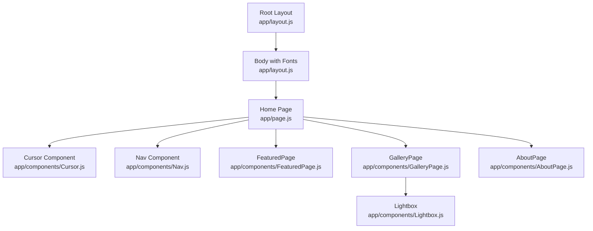
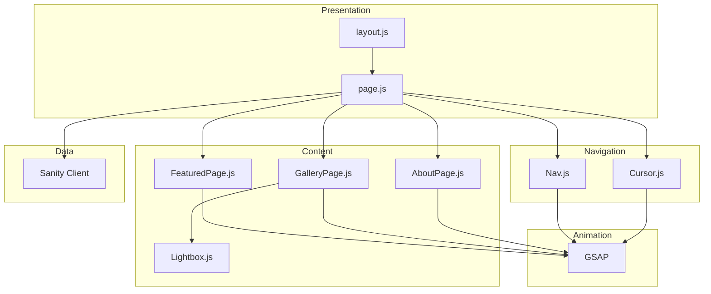
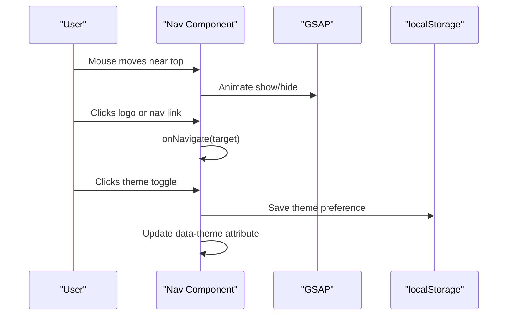
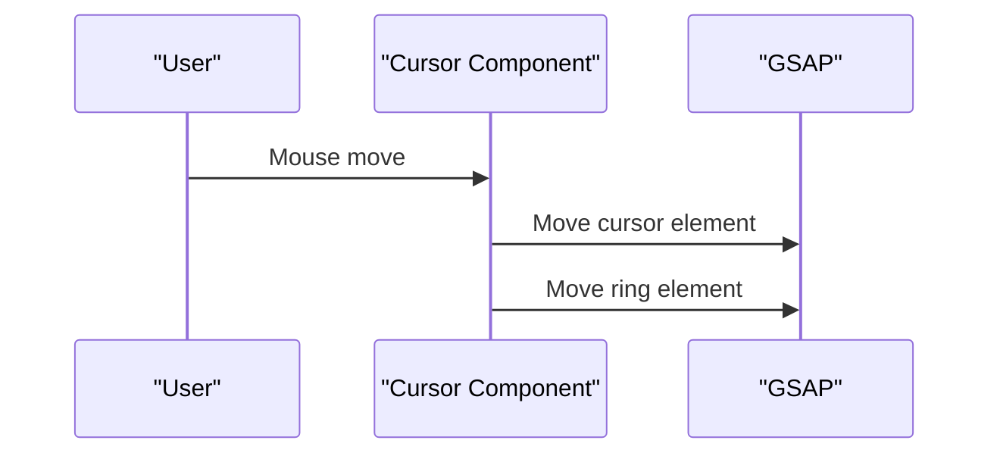
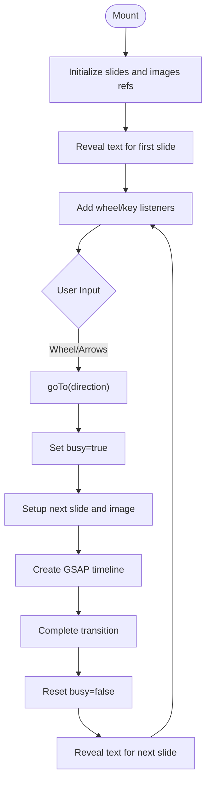
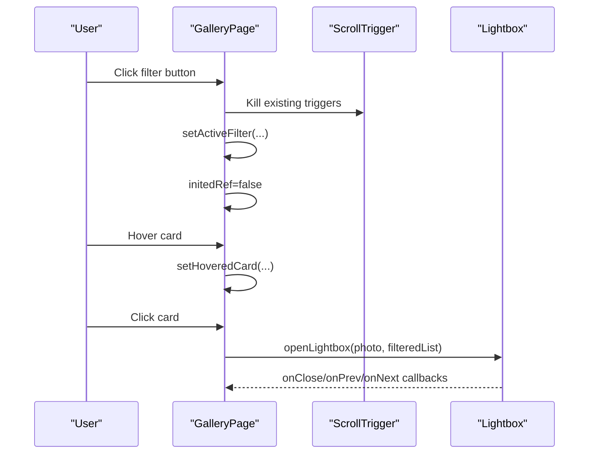
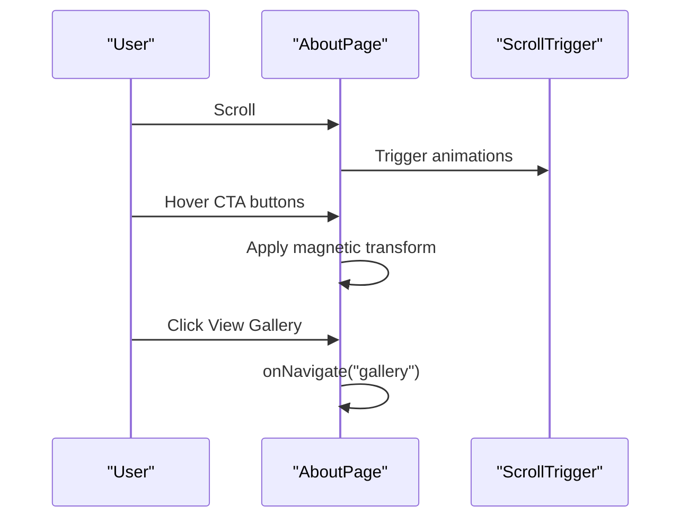
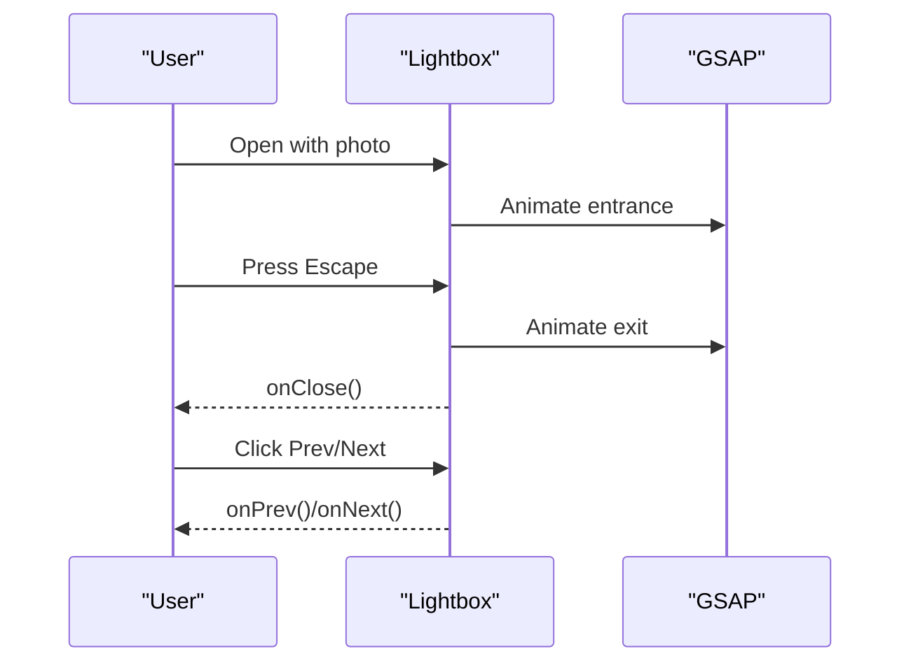
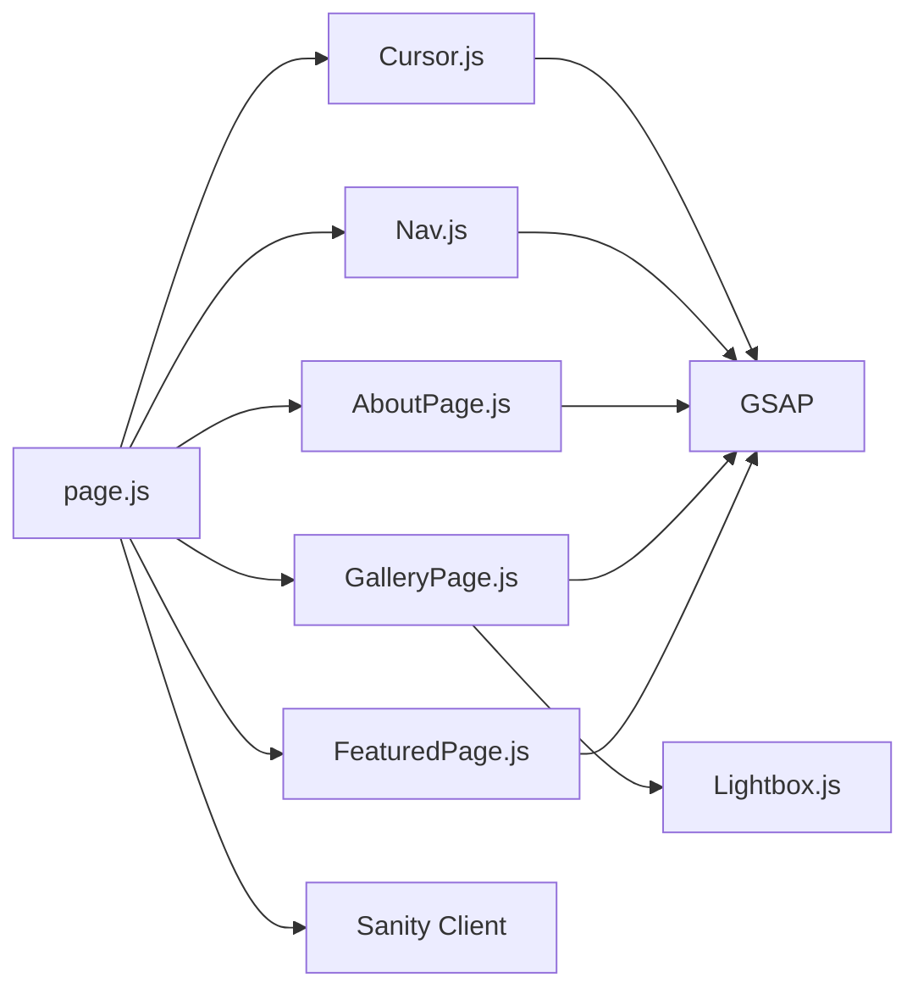

# Component Architecture

<cite>
**Referenced Files in This Document**
- [layout.js](file://app/layout.js)
- [page.js](file://app/page.js)
- [Nav.js](file://app/components/Nav.js)
- [Cursor.js](file://app/components/Cursor.js)
- [FeaturedPage.js](file://app/components/FeaturedPage.js)
- [GalleryPage.js](file://app/components/GalleryPage.js)
- [AboutPage.js](file://app/components/AboutPage.js)
- [Lightbox.js](file://app/components/Lightbox.js)
- [globals.css](file://app/globals.css)
- [package.json](file://package.json)
- [studio page.jsx](file://app/studio/[[...tool]]/page.jsx)
</cite>

## Table of Contents
1. [Introduction](#introduction)
2. [Project Structure](#project-structure)
3. [Core Components](#core-components)
4. [Architecture Overview](#architecture-overview)
5. [Detailed Component Analysis](#detailed-component-analysis)
6. [Dependency Analysis](#dependency-analysis)
7. [Performance Considerations](#performance-considerations)
8. [Troubleshooting Guide](#troubleshooting-guide)
9. [Conclusion](#conclusion)

## Introduction
This document describes the component architecture of the Next.js frontend application for WRD Photography. It focuses on the root layout and navigation layer, animated navigation component, custom cursor effects, and specialized page components including a photo slideshow, multi-layout gallery, artist biography presentation, and a photo viewer. The analysis covers component composition patterns, prop interfaces, state management integration, lifecycle methods, component communication strategies, event handling patterns, styling approaches, animation integration, and accessibility implementations.

## Project Structure
The application follows a Next.js App Router structure with a root layout, a client-side home page orchestrating navigation and data fetching, and modular page components. Dynamic imports are used for heavy client-side components to optimize initial load. The global stylesheet defines theme tokens and base styles, while the studio route integrates Sanity Studio for content management.

**Diagram sources**
- [layout.js:31-39](file://app/layout.js#L31-L39)
- [page.js:14-227](file://app/page.js#L14-L227)
- [Cursor.js:1-42](file://app/components/Cursor.js#L1-L42)
- [Nav.js:1-168](file://app/components/Nav.js#L1-L168)
- [FeaturedPage.js:1-269](file://app/components/FeaturedPage.js#L1-L269)
- [GalleryPage.js:1-760](file://app/components/GalleryPage.js#L1-L760)
- [AboutPage.js:1-458](file://app/components/AboutPage.js#L1-L458)
- [Lightbox.js:1-303](file://app/components/Lightbox.js#L1-L303)

**Section sources**
- [layout.js:1-40](file://app/layout.js#L1-L40)
- [page.js:1-227](file://app/page.js#L1-L227)

## Core Components
- Root Layout: Provides typography fonts and global metadata.
- Home Page: Orchestrates data fetching, intro animation, navigation state, and page rendering.
- Nav: Animated navigation bar with theme toggle and auto-hide behavior.
- Cursor: Custom animated mouse cursor with GSAP-driven motion.
- FeaturedPage: Full-screen photo slideshow with keyboard and wheel navigation.
- GalleryPage: Multi-layout gallery with filters, parallax, and scroll-triggered animations.
- AboutPage: Artist biography presentation with scroll-triggered reveals and magnetic buttons.
- Lightbox: Modal photo viewer with navigation and info panel.

**Section sources**
- [layout.js:26-39](file://app/layout.js#L26-L39)
- [page.js:14-227](file://app/page.js#L14-L227)
- [Nav.js:4-168](file://app/components/Nav.js#L4-L168)
- [Cursor.js:1-42](file://app/components/Cursor.js#L1-L42)
- [FeaturedPage.js:6-269](file://app/components/FeaturedPage.js#L6-L269)
- [GalleryPage.js:6-760](file://app/components/GalleryPage.js#L6-L760)
- [AboutPage.js:5-458](file://app/components/AboutPage.js#L5-L458)
- [Lightbox.js:5-303](file://app/components/Lightbox.js#L5-L303)

## Architecture Overview
The application uses a layered architecture:
- Presentation Layer: Root layout and home page.
- Navigation Layer: Nav component handles page transitions and theme.
- Content Layer: Page components render specialized content.
- Interaction Layer: Cursor and Lightbox provide interactive experiences.
- Animation Layer: GSAP powers all animations and scroll-triggered effects.
- Data Layer: Sanity client fetches content and images.

**Diagram sources**
- [layout.js:31-39](file://app/layout.js#L31-L39)
- [page.js:14-227](file://app/page.js#L14-L227)
- [Nav.js:10-68](file://app/components/Nav.js#L10-L68)
- [Cursor.js:9-21](file://app/components/Cursor.js#L9-L21)
- [FeaturedPage.js:14-34](file://app/components/FeaturedPage.js#L14-L34)
- [GalleryPage.js:51-220](file://app/components/GalleryPage.js#L51-L220)
- [AboutPage.js:11-162](file://app/components/AboutPage.js#L11-L162)
- [Lightbox.js:15-77](file://app/components/Lightbox.js#L15-L77)
- [package.json:14-14](file://package.json#L14-L14)

## Detailed Component Analysis

### Nav Component
- Purpose: Animated navigation bar with auto-hide on scroll, theme toggle, and page navigation.
- Props: activePage (string), onNavigate (function).
- State: theme (string), hidden flag (ref).
- Lifecycle: Initializes GSAP animations on mount; manages mousemove-based reveal/hide; toggles theme persisted in localStorage.
- Event Handling: Mouse move events trigger reveal/hide; button clicks call onNavigate; theme toggle updates data-theme attribute.
- Styling: Uses CSS variables for theme tokens; fixed positioning; border and background derived from theme.
- Accessibility: Theme toggle includes aria-label; buttons are keyboard focusable.

**Diagram sources**
- [Nav.js:27-48](file://app/components/Nav.js#L27-L48)
- [Nav.js:51-68](file://app/components/Nav.js#L51-L68)
- [Nav.js:78-83](file://app/components/Nav.js#L78-L83)

**Section sources**
- [Nav.js:4-168](file://app/components/Nav.js#L4-L168)

### Cursor Component
- Purpose: Custom animated cursor with a central dot and surrounding ring following mouse movement.
- Props: None.
- State: None.
- Lifecycle: Adds mousemove listener on mount; removes on cleanup.
- Event Handling: Updates positions of cursor and ring elements using GSAP with overwrite behavior.
- Styling: Fixed-position elements with blend mode; responsive sizing.

**Diagram sources**
- [Cursor.js:14-21](file://app/components/Cursor.js#L14-L21)

**Section sources**
- [Cursor.js:1-42](file://app/components/Cursor.js#L1-L42)

### FeaturedPage Component
- Purpose: Full-screen photo slideshow with keyboard and wheel navigation, animated text reveals, and counter indicators.
- Props: photos (array).
- State: current (number), busy (boolean), TOTAL (constant).
- Lifecycle: Sets up text reveals on mount; adds wheel and key listeners; cleans up on unmount.
- Event Handling: Wheel and arrow keys drive navigation; timeout-based auto-hide behavior.
- Animation: GSAP timeline orchestrates slide transitions, text reveals, and counter movement.
- Styling: Absolute positioning for slides; gradient overlays; responsive typography.

**Diagram sources**
- [FeaturedPage.js:14-34](file://app/components/FeaturedPage.js#L14-L34)
- [FeaturedPage.js:56-105](file://app/components/FeaturedPage.js#L56-L105)

**Section sources**
- [FeaturedPage.js:6-269](file://app/components/FeaturedPage.js#L6-L269)

### GalleryPage Component
- Purpose: Multi-layout gallery with filters, horizontal scrolling, masonry layouts, portrait cards, and scroll-triggered animations.
- Props: photos (array), heroImage (image).
- State: activeFilter (string), hoveredCard (id), lightboxPhoto (photo), lightboxList (array).
- Lifecycle: Dynamically imports GSAP and ScrollTrigger; initializes character split reveals, parallax, counters, and staggered reveals; cleans up ScrollTrigger instances on unmount.
- Event Handling: Filter buttons update activeFilter and kill/re-init ScrollTrigger; card clicks open Lightbox with filtered list.
- Animation: Extensive GSAP ScrollTrigger usage for hero text, hero image parallax, section labels, horizontal track pinning, masonry reveals, and portrait cards.
- Styling: Grids, columns, and absolute/fixed overlays; theme-aware colors; responsive typography.

**Diagram sources**
- [GalleryPage.js:316-333](file://app/components/GalleryPage.js#L316-L333)
- [GalleryPage.js:51-220](file://app/components/GalleryPage.js#L51-L220)
- [GalleryPage.js:17-37](file://app/components/GalleryPage.js#L17-L37)

**Section sources**
- [GalleryPage.js:6-760](file://app/components/GalleryPage.js#L6-L760)

### AboutPage Component
- Purpose: Artist biography presentation with hero image, philosophy quote, photo collage, approach grid, and contact call-to-action.
- Props: onNavigate (function), heroImage (image), collageImages (array).
- State: None.
- Lifecycle: Dynamically imports GSAP and ScrollTrigger; initializes hero title reveal, bio word reveal, image parallax, stats count-up, quote reveal, divider lines, approach items, collage images, CTA title, and button magnetic effects; cleans up ScrollTrigger on unmount.
- Event Handling: Magnetic button effects on mouse move/leave; navigation button triggers onNavigate.
- Animation: Scroll-triggered reveals for all sections; word-by-word animations; count-up animations.
- Styling: Grid layouts, absolute overlays, theme-aware backgrounds and borders; responsive typography.

**Diagram sources**
- [AboutPage.js:11-162](file://app/components/AboutPage.js#L11-L162)
- [AboutPage.js:164-174](file://app/components/AboutPage.js#L164-L174)
- [AboutPage.js:409-426](file://app/components/AboutPage.js#L409-L426)

**Section sources**
- [AboutPage.js:5-458](file://app/components/AboutPage.js#L5-L458)

### Lightbox Component
- Purpose: Modal photo viewer with navigation controls, info panel, and keyboard support.
- Props: photo (object), photos (array), onClose (function), onPrev (function), onNext (function).
- State: None.
- Lifecycle: On mount, animates overlay, image, info, close button, and nav arrows; on photo change, animates image and info; on close, animates out and calls onClose.
- Event Handling: Overlay click closes; Escape key closes; Arrow keys navigate; Close and nav buttons trigger callbacks.
- Animation: GSAP timelines orchestrate entrance and exit sequences.
- Styling: Fixed-position modal with overlay; centered content area; info panel with typography and metadata.

**Diagram sources**
- [Lightbox.js:15-62](file://app/components/Lightbox.js#L15-L62)
- [Lightbox.js:64-77](file://app/components/Lightbox.js#L64-L77)
- [Lightbox.js:79-90](file://app/components/Lightbox.js#L79-L90)

**Section sources**
- [Lightbox.js:5-303](file://app/components/Lightbox.js#L5-L303)

## Dependency Analysis
- Runtime Dependencies: GSAP for animations, Sanity client for content, Next.js for routing and SSR/SSG, Tailwind for base styles.
- Component Dependencies:
  - Home page depends on Nav, Cursor, and page components.
  - GalleryPage composes Lightbox.
  - All page components depend on Sanity image helpers and GSAP/ScrollTrigger.
- External Integrations: Sanity Studio via dedicated route.

**Diagram sources**
- [page.js:6-11](file://app/page.js#L6-L11)
- [GalleryPage.js:4-4](file://app/components/GalleryPage.js#L4-L4)
- [package.json:11-21](file://package.json#L11-L21)

**Section sources**
- [package.json:11-21](file://package.json#L11-L21)
- [page.js:14-227](file://app/page.js#L14-L227)

## Performance Considerations
- Dynamic Imports: Heavy client components (page components) are dynamically imported to defer loading until client-side execution.
- ScrollTrigger Cleanup: ScrollTrigger instances are killed on component unmount to prevent memory leaks and redundant listeners.
- GSAP Overwrite: Cursor uses overwrite behavior to minimize animation churn during rapid mouse movement.
- Theme Persistence: Theme preference is stored in localStorage to avoid repeated theme calculations.
- Image Optimization: Sanity image URLs are generated with width and quality parameters to balance fidelity and performance.

[No sources needed since this section provides general guidance]

## Troubleshooting Guide
- Navigation Not Responding:
  - Verify onNavigate callback is passed to Nav and that activePage state updates correctly.
  - Check for switching state preventing rapid navigation.
- Animations Not Playing:
  - Ensure GSAP and ScrollTrigger are dynamically imported and registered before use.
  - Confirm that DOM elements exist before applying animations.
- Cursor Not Moving:
  - Confirm mousemove listener is attached and cursor elements are present.
  - Verify GSAP is loaded before attempting to animate.
- Lightbox Not Opening:
  - Ensure photo and photos props are provided and openLightbox is invoked with correct arguments.
  - Check that overlay click handler and keyboard events are attached.
- Theme Toggle Issues:
  - Confirm data-theme attribute is set on html element and localStorage persists the value.

**Section sources**
- [Nav.js:10-68](file://app/components/Nav.js#L10-L68)
- [Cursor.js:9-21](file://app/components/Cursor.js#L9-L21)
- [FeaturedPage.js:14-34](file://app/components/FeaturedPage.js#L14-L34)
- [GalleryPage.js:51-220](file://app/components/GalleryPage.js#L51-L220)
- [AboutPage.js:11-162](file://app/components/AboutPage.js#L11-L162)
- [Lightbox.js:15-77](file://app/components/Lightbox.js#L15-L77)

## Conclusion
The component architecture combines a clean separation of concerns with robust animation and interaction patterns. The root layout and home page coordinate navigation and data, while specialized page components deliver rich, scroll-driven experiences. GSAP powers all animations, and dynamic imports optimize performance. The design system relies on CSS variables for themes, enabling seamless light/dark mode. The Lightbox component provides a cohesive viewer experience integrated with the gallery’s filtering and navigation.