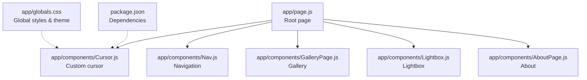
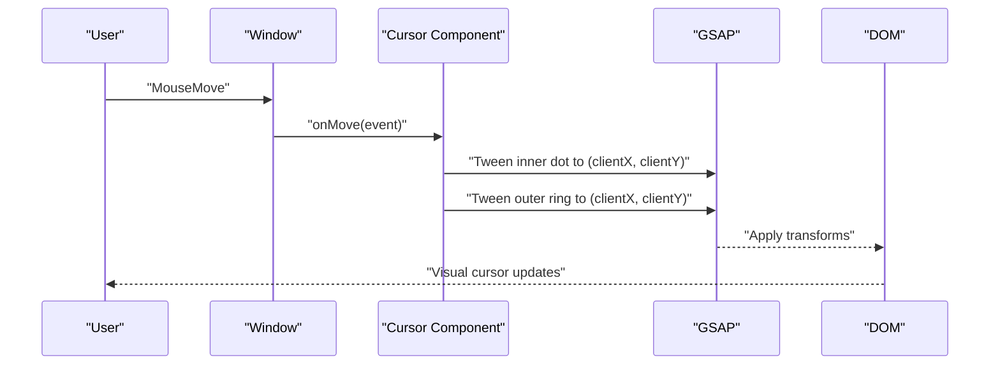
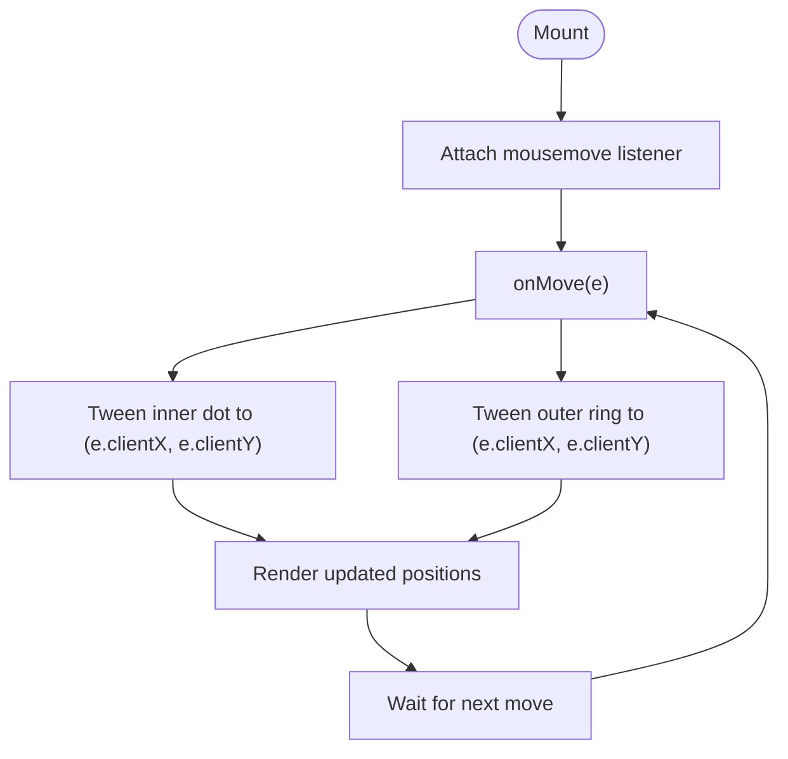
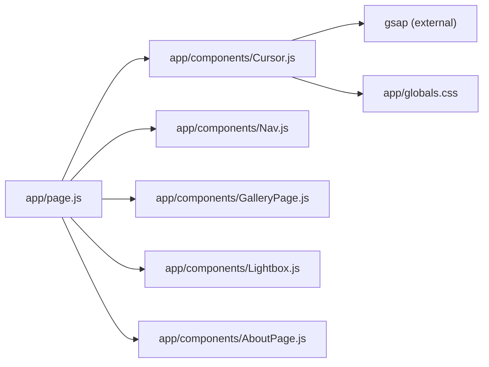
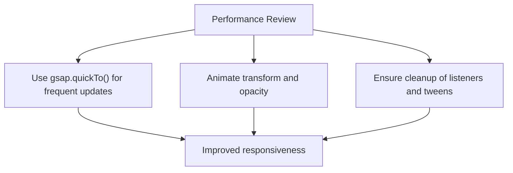

# Custom Cursor Component

<cite>
**Referenced Files in This Document**
- [Cursor.js](file://app/components/Cursor.js)
- [page.js](file://app/page.js)
- [globals.css](file://app/globals.css)
- [Nav.js](file://app/components/Nav.js)
- [GalleryPage.js](file://app/components/GalleryPage.js)
- [Lightbox.js](file://app/components/Lightbox.js)
- [AboutPage.js](file://app/components/AboutPage.js)
- [package.json](file://package.json)
- [SKILL.md (GSAP Performance)](file://.agents/skills/gsap-performance/SKILL.md)
</cite>

## Table of Contents
1. [Introduction](#introduction)
2. [Project Structure](#project-structure)
3. [Core Components](#core-components)
4. [Architecture Overview](#architecture-overview)
5. [Detailed Component Analysis](#detailed-component-analysis)
6. [Dependency Analysis](#dependency-analysis)
7. [Performance Considerations](#performance-considerations)
8. [Troubleshooting Guide](#troubleshooting-guide)
9. [Conclusion](#conclusion)
10. [Appendices](#appendices)

## Introduction
This document explains the Custom Cursor component implementation used across the portfolio application. It covers mouse tracking, element detection, scaling animations, and interactive behaviors. It also documents the cursor’s positioning logic, collision detection with interactive elements, GSAP-powered animations for hover states, performance optimizations for smooth tracking, and integration with page navigation. Finally, it outlines cursor customization options, performance considerations, and integration patterns with other interactive elements.

## Project Structure
The cursor is implemented as a React client component and integrated into the main application page. Supporting styles and themes are defined globally, while interactive components (navigation, gallery, lightbox, and about page) demonstrate cursor interaction patterns.

**Diagram sources**
- [page.js:196-197](file://app/page.js#L196-L197)
- [Cursor.js:1-41](file://app/components/Cursor.js#L1-L41)
- [Nav.js:1-168](file://app/components/Nav.js#L1-L168)
- [GalleryPage.js:330-529](file://app/components/GalleryPage.js#L330-L529)
- [Lightbox.js:120-303](file://app/components/Lightbox.js#L120-L303)
- [AboutPage.js:390-458](file://app/components/AboutPage.js#L390-L458)
- [globals.css:1-93](file://app/globals.css#L1-L93)
- [package.json:11-22](file://package.json#L11-L22)

**Section sources**
- [page.js:196-197](file://app/page.js#L196-L197)
- [globals.css:1-93](file://app/globals.css#L1-L93)
- [package.json:11-22](file://package.json#L11-L22)

## Core Components
- Custom Cursor: A lightweight React component rendering two layered elements (inner dot and outer ring) that follow the mouse with GSAP-driven animations. It uses fixed positioning and blend modes for visual contrast against backgrounds.
- Global Theme and Styles: CSS variables define cursor colors and borders, enabling easy customization and theme switching.
- Navigation and Interactive Pages: Navigation and page components showcase hover interactions and demonstrate how cursor visuals integrate with interactive elements.

Key implementation highlights:
- Mouse tracking via a single event listener updating positions for both cursor elements.
- GSAP tweens with short durations for responsiveness and smooth motion.
- Pointer events disabled on cursor elements to avoid interfering with underlying interactions.
- Z-index stacking ensures the cursor appears above page content.

**Section sources**
- [Cursor.js:1-41](file://app/components/Cursor.js#L1-L41)
- [globals.css:5-28](file://app/globals.css#L5-L28)
- [page.js:196-197](file://app/page.js#L196-L197)

## Architecture Overview
The cursor follows a minimal, reactive architecture:
- Initialization: On mount, the component attaches a mousemove listener and stores references to inner and outer cursor nodes.
- Movement: Each move event triggers two GSAP tweens to smoothly update the positions of the inner dot and outer ring.
- Cleanup: The event listener is removed on unmount to prevent memory leaks.

**Diagram sources**
- [Cursor.js:9-21](file://app/components/Cursor.js#L9-L21)

## Detailed Component Analysis

### Custom Cursor Component
The cursor consists of:
- Inner dot: Small, solid circle following the mouse precisely.
- Outer ring: Larger ring that trails behind the dot with a longer duration for a trailing effect.

Positioning logic:
- Fixed positioning with transform centering to maintain precise alignment with the pointer.
- Mix blend mode for visibility across varying backgrounds.
- Pointer events disabled to allow normal interaction with underlying elements.

GSAP-powered animations:
- Short-duration tweens for responsiveness.
- Overwrite behavior to prevent queued animations from competing.

**Diagram sources**
- [Cursor.js:9-21](file://app/components/Cursor.js#L9-L21)

Interactive behaviors:
- Hover states in surrounding components trigger subtle transitions and transforms. These are independent of the cursor itself but visually complement the cursor’s presence.
- Example hover interactions occur in navigation links, gallery cards, and lightbox controls.

Collision detection:
- The current implementation does not implement explicit collision detection with interactive elements. Instead, it relies on visual layering and z-index ordering to ensure the cursor remains above interactive elements.

Cursor variants:
- Default: Inner dot and ring positioned at pointer coordinates.
- Hover: Surfaces through hover effects on interactive elements (no dedicated cursor variant toggles).
- Click: Not implemented in the current cursor component.

Integration with page navigation:
- The cursor is rendered at the root level and remains visible during navigation and page transitions.

**Section sources**
- [Cursor.js:1-41](file://app/components/Cursor.js#L1-L41)
- [Nav.js:114-139](file://app/components/Nav.js#L114-L139)
- [GalleryPage.js:376-382](file://app/components/GalleryPage.js#L376-L382)
- [Lightbox.js:240-296](file://app/components/Lightbox.js#L240-L296)
- [AboutPage.js:390-426](file://app/components/AboutPage.js#L390-L426)

### Positioning and Layering
- Fixed positioning with translate centering ensures pixel-perfect alignment with the mouse.
- Z-index values place the inner dot above the ring, and both above page content.
- Blend mode enhances visibility on both light and dark backgrounds.

Responsive behavior:
- The cursor adapts to any viewport size due to client coordinates and fixed positioning.
- No device-specific adjustments are implemented; behavior is consistent across screen sizes.

**Section sources**
- [Cursor.js:25-38](file://app/components/Cursor.js#L25-L38)
- [globals.css:5-28](file://app/globals.css#L5-L28)

### GSAP Integration and Hover Animations
- The cursor uses GSAP for smooth, performant movement.
- Hover states in interactive components are handled independently with CSS and inline transitions, complementing the cursor’s presence without modifying cursor visuals.

**Section sources**
- [Cursor.js:14-16](file://app/components/Cursor.js#L14-L16)
- [Nav.js:116-131](file://app/components/Nav.js#L116-L131)
- [GalleryPage.js:390-392](file://app/components/GalleryPage.js#L390-L392)
- [Lightbox.js:240-296](file://app/components/Lightbox.js#L240-L296)

## Dependency Analysis
External dependencies:
- GSAP: Provides tweening and animation capabilities for smooth cursor movement.
- React: Client-side component lifecycle and refs for DOM manipulation.

Internal integration:
- The cursor is rendered in the root page alongside navigation and page content.
- Global CSS variables define cursor colors and borders, enabling easy customization.

**Diagram sources**
- [page.js:196-197](file://app/page.js#L196-L197)
- [Cursor.js:1-41](file://app/components/Cursor.js#L1-L41)
- [globals.css:1-93](file://app/globals.css#L1-L93)
- [package.json:14](file://package.json#L14)

**Section sources**
- [package.json:14](file://package.json#L14)
- [page.js:196-197](file://app/page.js#L196-L197)

## Performance Considerations
Current implementation:
- Single event listener for mousemove updates both cursor elements.
- Short GSAP durations balance responsiveness and smoothness.

Recommended optimizations (aligned with GSAP best practices):
- Use quickTo for frequently updated properties to reuse a single tween per element.
- Prefer transform and opacity animations; avoid animating width/height for movement.
- Debounce or throttle event handlers if additional heavy logic is introduced.
- Clean up animations and listeners on unmount to prevent lingering work.

**Diagram sources**
- [SKILL.md (GSAP Performance):44-54](file://.agents/skills/gsap-performance/SKILL.md#L44-L54)
- [SKILL.md (GSAP Performance):69-72](file://.agents/skills/gsap-performance/SKILL.md#L69-L72)

**Section sources**
- [SKILL.md (GSAP Performance):44-54](file://.agents/skills/gsap-performance/SKILL.md#L44-L54)
- [SKILL.md (GSAP Performance):69-72](file://.agents/skills/gsap-performance/SKILL.md#L69-L72)

## Troubleshooting Guide
Common issues and resolutions:
- Cursor not visible:
  - Verify z-index stacking and global CSS variables for colors.
  - Confirm blend mode compatibility with page backgrounds.
- Jittery movement:
  - Adjust GSAP duration values to balance smoothness and responsiveness.
  - Consider using quickTo for smoother updates.
- Interference with clicks:
  - Ensure pointer-events are disabled on cursor elements.
  - Confirm z-index order places the cursor above interactive elements.

**Section sources**
- [Cursor.js:28-30](file://app/components/Cursor.js#L28-L30)
- [globals.css:5-28](file://app/globals.css#L5-L28)

## Conclusion
The Custom Cursor component delivers a polished, performant pointer experience using GSAP for smooth tracking and global CSS for consistent theming. While it currently focuses on default and hover states without explicit click or collision variants, its modular design allows future enhancements such as click animations, collision detection, and trail effects. The component integrates seamlessly with navigation and interactive pages, providing a cohesive user interface enhancement.

## Appendices

### Cursor Customization Examples
- Colors and borders:
  - Modify CSS variables for cursor and ring colors.
- Size and timing:
  - Adjust inner dot and ring dimensions and GSAP durations.
- Visual effects:
  - Change blend mode or add transitions for hover states.

**Section sources**
- [globals.css:5-28](file://app/globals.css#L5-L28)
- [Cursor.js:25-38](file://app/components/Cursor.js#L25-L38)