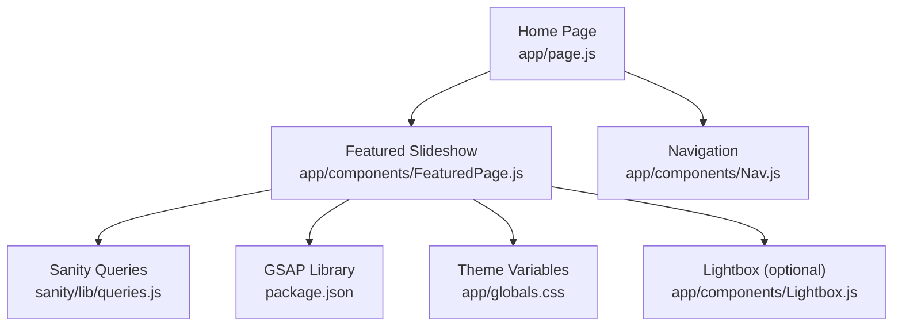
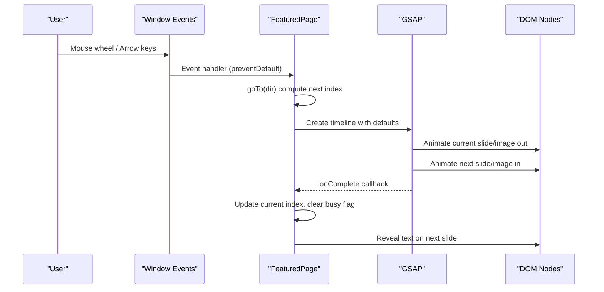
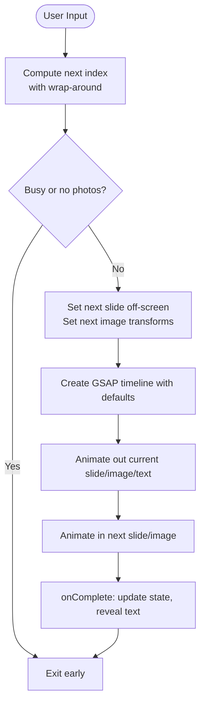
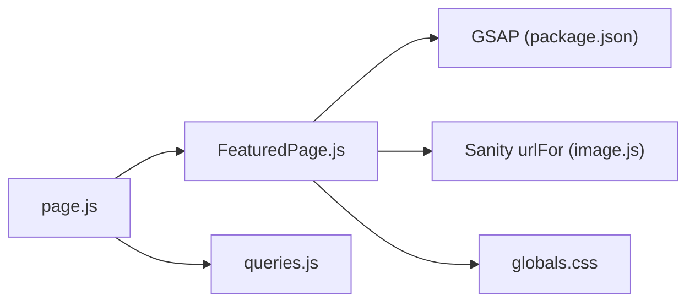

# Featured Photo Slideshow

<cite>
**Referenced Files in This Document**
- [FeaturedPage.js](file://app/components/FeaturedPage.js)
- [page.js](file://app/page.js)
- [Nav.js](file://app/components/Nav.js)
- [Lightbox.js](file://app/components/Lightbox.js)
- [queries.js](file://sanity/lib/queries.js)
- [photo.js](file://sanity/schemaTypes/photo.js)
- [globals.css](file://app/globals.css)
- [package.json](file://package.json)
- [SKILL.md (gsap-timeline)](file://.agents/skills/gsap-timeline/SKILL.md)
- [SKILL.md (gsap-performance)](file://.agents/skills/gsap-performance/SKILL.md)
- [SKILL.md (gsap-core)](file://.agents/skills/gsap-core/SKILL.md)
</cite>

## Table of Contents
1. [Introduction](#introduction)
2. [Project Structure](#project-structure)
3. [Core Components](#core-components)
4. [Architecture Overview](#architecture-overview)
5. [Detailed Component Analysis](#detailed-component-analysis)
6. [Dependency Analysis](#dependency-analysis)
7. [Performance Considerations](#performance-considerations)
8. [Troubleshooting Guide](#troubleshooting-guide)
9. [Conclusion](#conclusion)
10. [Appendices](#appendices)

## Introduction
This document describes the Featured Photo Slideshow component that presents a full-screen, vertically scrolling photo presentation with animated text reveals, navigation controls, and a dot indicator. The slideshow is powered by GSAP for smooth transitions, integrates with keyboard and mouse wheel navigation, and displays a photo counter. It also includes responsive image handling via Sanity’s image URL builder and demonstrates state management for current photo tracking, navigation logic, and accessibility considerations. The component is part of a Next.js application and integrates with the main navigation system.

## Project Structure
The slideshow lives in the Next.js app under app/components and is rendered on the home page. It relies on Sanity for data fetching and image URLs, and uses GSAP for animations.

**Diagram sources**
- [page.js:14-227](file://app/page.js#L14-L227)
- [FeaturedPage.js:1-269](file://app/components/FeaturedPage.js#L1-L269)
- [Nav.js:1-168](file://app/components/Nav.js#L1-L168)
- [queries.js:1-32](file://sanity/lib/queries.js#L1-L32)
- [package.json:11-22](file://package.json#L11-L22)
- [globals.css:1-93](file://app/globals.css#L1-L93)
- [Lightbox.js:1-303](file://app/components/Lightbox.js#L1-L303)

**Section sources**
- [page.js:9-227](file://app/page.js#L9-L227)
- [FeaturedPage.js:1-269](file://app/components/FeaturedPage.js#L1-L269)
- [Nav.js:1-168](file://app/components/Nav.js#L1-L168)
- [queries.js:1-32](file://sanity/lib/queries.js#L1-L32)
- [globals.css:1-93](file://app/globals.css#L1-L93)
- [package.json:11-22](file://package.json#L11-L22)

## Core Components
- FeaturedPage: Full-screen vertical slideshow with GSAP-powered transitions, text reveal animations, photo counter, and dot indicators. Handles mouse wheel and keyboard navigation.
- Home page: Fetches data from Sanity, renders the FeaturedPage component, and manages page switching.
- Navigation: Provides top navigation and theme toggle, integrating with the slideshow via the main page.
- Lightbox: Optional fullscreen viewer for individual photos with keyboard navigation and GSAP animations.

**Section sources**
- [FeaturedPage.js:6-105](file://app/components/FeaturedPage.js#L6-L105)
- [page.js:106-131](file://app/page.js#L106-L131)
- [Nav.js:85-132](file://app/components/Nav.js#L85-L132)
- [Lightbox.js:5-62](file://app/components/Lightbox.js#L5-L62)

## Architecture Overview
The slideshow is a client-side React component that receives a list of photos from the home page. Photos are fetched from Sanity using GROQ queries and passed down as props. The component uses refs to manage DOM nodes for slides and images, and GSAP timelines to orchestrate transitions. Keyboard and mouse wheel events trigger navigation, while a counter and dots reflect the current index.

**Diagram sources**
- [FeaturedPage.js:18-34](file://app/components/FeaturedPage.js#L18-L34)
- [FeaturedPage.js:56-105](file://app/components/FeaturedPage.js#L56-L105)

**Section sources**
- [FeaturedPage.js:14-34](file://app/components/FeaturedPage.js#L14-L34)
- [FeaturedPage.js:56-105](file://app/components/FeaturedPage.js#L56-L105)

## Detailed Component Analysis

### FeaturedPage: Full-Screen Vertical Slideshow
- State and refs
  - Tracks current index and a busy flag to prevent concurrent transitions.
  - Uses refs for slides and images arrays, and a ref for the counter container.
- Initialization
  - On mount, reveals text for the first slide.
  - Adds wheel and keydown listeners to handle navigation.
- Navigation logic
  - Computes next index with wrap-around (circular).
  - Prevents navigation when busy or no photos.
- Transitions
  - Sets up the next slide off-screen and applies initial transforms to the next image.
  - Uses a GSAP timeline with defaults for coordinated animation.
  - Animates current text out, current slide out, current image out, next slide in, next image in.
  - Updates active class and current index on completion.
- Text reveal
  - Resets and animates caption, lines, writeup, and meta with staggered timing.
- UI elements
  - Photo counter: a vertically stacked list with a GSAP-managed offset.
  - Dots: small circles reflecting the current slide.
  - Hint: a small text hint near the bottom-left.

**Diagram sources**
- [FeaturedPage.js:56-105](file://app/components/FeaturedPage.js#L56-L105)

**Section sources**
- [FeaturedPage.js:6-12](file://app/components/FeaturedPage.js#L6-L12)
- [FeaturedPage.js:14-34](file://app/components/FeaturedPage.js#L14-L34)
- [FeaturedPage.js:36-54](file://app/components/FeaturedPage.js#L36-L54)
- [FeaturedPage.js:56-105](file://app/components/FeaturedPage.js#L56-L105)
- [FeaturedPage.js:118-266](file://app/components/FeaturedPage.js#L118-L266)

### Navigation Controls: Mouse Wheel and Keyboard
- Mouse wheel
  - Listens to wheel events, prevents default scrolling, and navigates based on delta direction.
- Keyboard
  - Arrow keys Up/Left for previous, Down/Right for next.
- Accessibility
  - The component does not include explicit ARIA attributes for screen readers. Consider adding role="region" and aria-labels to the slideshow container and controls.

**Section sources**
- [FeaturedPage.js:18-26](file://app/components/FeaturedPage.js#L18-L26)
- [FeaturedPage.js:28-33](file://app/components/FeaturedPage.js#L28-L33)

### Text Reveal Animations
- Targets elements with classes: caption, writeup, meta, and text-line spans.
- Uses gsap.set to establish starting positions and opacity, then animates them into view with staggered timing.
- Delays the reveal slightly after the main transition completes.

**Section sources**
- [FeaturedPage.js:36-54](file://app/components/FeaturedPage.js#L36-L54)
- [FeaturedPage.js:104](file://app/components/FeaturedPage.js#L104)

### Photo Counter Display
- Maintains a vertical list of indices and moves it vertically to align with the current slide.
- Uses a GSAP tween to translate the container by a calculated amount based on the next index.

**Section sources**
- [FeaturedPage.js:91-96](file://app/components/FeaturedPage.js#L91-L96)
- [FeaturedPage.js:221-240](file://app/components/FeaturedPage.js#L221-L240)

### Dot Indicator System
- Renders a row of small dots aligned horizontally below the counter.
- Highlights the current dot and scales it slightly for emphasis.

**Section sources**
- [FeaturedPage.js:242-256](file://app/components/FeaturedPage.js#L242-L256)

### Swipe Gesture Support
- The current implementation does not include touch or pointer swipe gestures.
- To add swipe gestures, integrate a gesture plugin (e.g., Observer) and implement directional logic similar to wheel/keyboard navigation.

**Section sources**
- [SKILL.md (gsap-plugins):146-161](file://.agents/skills/gsap-plugins/SKILL.md#L146-L161)
- [FeaturedPage.js:18-26](file://app/components/FeaturedPage.js#L18-L26)

### Responsive Image Handling
- Uses Sanity’s urlFor with width and quality parameters to generate optimized image URLs.
- Applies a gradient overlay for readability and centers the background image.

**Section sources**
- [FeaturedPage.js:136](file://app/components/FeaturedPage.js#L136)
- [FeaturedPage.js:142-144](file://app/components/FeaturedPage.js#L142-L144)

### State Management and Navigation Logic
- Current index: managed via useState.
- Busy flag: prevents overlapping transitions.
- Circular navigation: wraps around from first to last and vice versa.
- Active class updates: ensures only one slide is visible at a time.

**Section sources**
- [FeaturedPage.js:7](file://app/components/FeaturedPage.js#L7)
- [FeaturedPage.js:56-63](file://app/components/FeaturedPage.js#L56-L63)
- [FeaturedPage.js:82-88](file://app/components/FeaturedPage.js#L82-L88)

### Accessibility Features
- Missing explicit ARIA roles and labels for the slideshow and controls.
- Consider adding:
  - ARIA roles and labels for the slideshow region and navigation buttons.
  - Focus management for keyboard navigation.
  - Reduced motion support via prefers-reduced-motion checks.

**Section sources**
- [globals.css:81-83](file://app/globals.css#L81-L83)
- [SKILL.md (gsap-core):235-246](file://.agents/skills/gsap-core/SKILL.md#L235-L246)

### Photo Loading System and Lazy Loading Strategies
- Images are loaded via Sanity’s urlFor with fixed width and quality.
- The component does not implement intersection observer-based lazy loading.
- Recommendations:
  - Use native loading="lazy" on img elements when applicable.
  - Consider preloading the next slide’s image after a transition completes.
  - Debounce or throttle wheel events to avoid rapid navigation.

**Section sources**
- [FeaturedPage.js:136](file://app/components/FeaturedPage.js#L136)
- [FeaturedPage.js:18-26](file://app/components/FeaturedPage.js#L18-L26)

### Integration with Main Navigation System
- The home page dynamically imports FeaturedPage and passes photos fetched from Sanity.
- Navigation component controls page switching; the slideshow resides on the featured page.

**Section sources**
- [page.js:9](file://app/page.js#L9)
- [page.js:106-131](file://app/page.js#L106-L131)
- [Nav.js:85-132](file://app/components/Nav.js#L85-L132)

## Dependency Analysis
- Internal dependencies
  - FeaturedPage depends on Sanity image URL builder and GSAP.
  - Home page depends on Sanity client and queries.
- External dependencies
  - GSAP is included via package.json.
  - Tailwind CSS and theme variables are configured globally.

**Diagram sources**
- [FeaturedPage.js:3-4](file://app/components/FeaturedPage.js#L3-L4)
- [package.json:14](file://package.json#L14)
- [page.js:3-4](file://app/page.js#L3-L4)
- [queries.js:1-2](file://sanity/lib/queries.js#L1-L2)
- [globals.css:1-28](file://app/globals.css#L1-L28)

**Section sources**
- [FeaturedPage.js:3-4](file://app/components/FeaturedPage.js#L3-L4)
- [package.json:14](file://package.json#L14)
- [page.js:3-4](file://app/page.js#L3-L4)
- [queries.js:1-2](file://sanity/lib/queries.js#L1-L2)
- [globals.css:1-28](file://app/globals.css#L1-L28)

## Performance Considerations
- GSAP timelines
  - Use timelines for sequencing and reuse defaults to minimize overhead.
- Staggered animations
  - Prefer stagger over many separate tweens for large lists.
- Property updates
  - Use transform aliases and will-change to promote compositing.
- Reduced motion
  - Respect prefers-reduced-motion by shortening durations or disabling animations.

**Section sources**
- [SKILL.md (gsap-timeline):15-51](file://.agents/skills/gsap-timeline/SKILL.md#L15-L51)
- [SKILL.md (gsap-performance):36-65](file://.agents/skills/gsap-performance/SKILL.md#L36-L65)
- [SKILL.md (gsap-core):235-246](file://.agents/skills/gsap-core/SKILL.md#L235-L246)
- [globals.css:138](file://app/globals.css#L138)

## Troubleshooting Guide
- No photos displayed
  - Verify that the photos prop is populated and that the query returns results.
- Navigation not working
  - Ensure wheel and keydown listeners are attached and that the busy flag is cleared.
- Transitions feel sluggish
  - Confirm transform-origin and will-change are applied to animated elements.
- Counter misaligned
  - Check that the counter container is properly referenced and that the translateY calculation matches the index.

**Section sources**
- [FeaturedPage.js:107-114](file://app/components/FeaturedPage.js#L107-L114)
- [FeaturedPage.js:18-33](file://app/components/FeaturedPage.js#L18-L33)
- [FeaturedPage.js:91-96](file://app/components/FeaturedPage.js#L91-L96)

## Conclusion
The Featured Photo Slideshow provides a polished, full-screen presentation with smooth GSAP transitions, text reveals, and intuitive navigation. It integrates cleanly with the main navigation system and leverages Sanity for data and image optimization. Enhancements such as swipe gestures, accessibility attributes, and lazy loading would further improve the user experience and performance.

## Appendices

### Customization Examples
- Adjusting animation timing
  - Modify defaults in the GSAP timeline constructor and individual tweens.
- Changing easing
  - Replace ease values in the timeline and tweens to alter motion curves.
- Modifying counter behavior
  - Change the translateY calculation and font sizing to fit layout needs.

**Section sources**
- [FeaturedPage.js:80-89](file://app/components/FeaturedPage.js#L80-L89)
- [FeaturedPage.js:93-95](file://app/components/FeaturedPage.js#L93-L95)

### Data Model and Queries
- Featured photos are filtered by a boolean flag and ordered by manual order and date.
- The schema defines fields for title, image, location, series, date, writeup, and order.

**Section sources**
- [queries.js:3-8](file://sanity/lib/queries.js#L3-L8)
- [photo.js:5-62](file://sanity/schemaTypes/photo.js#L5-L62)