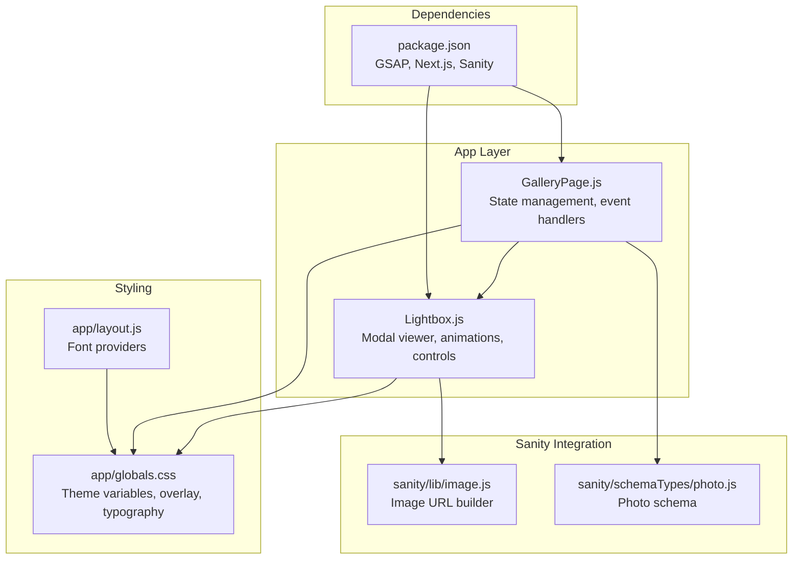
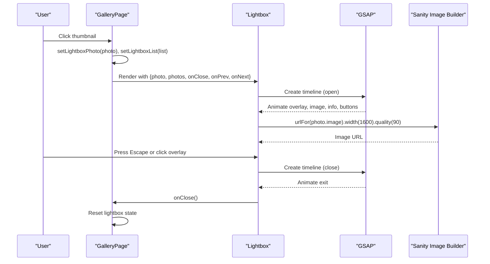
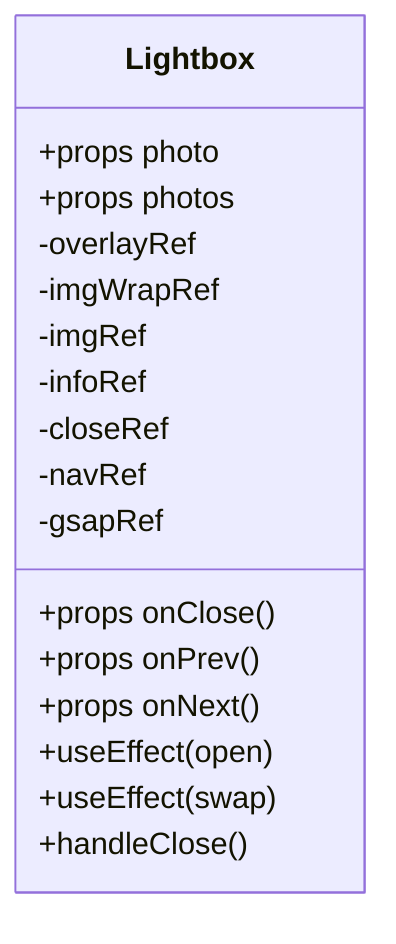
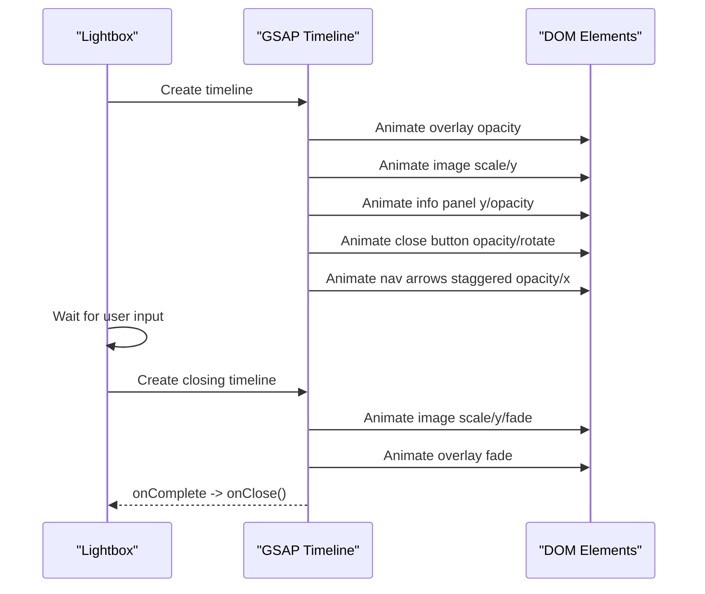
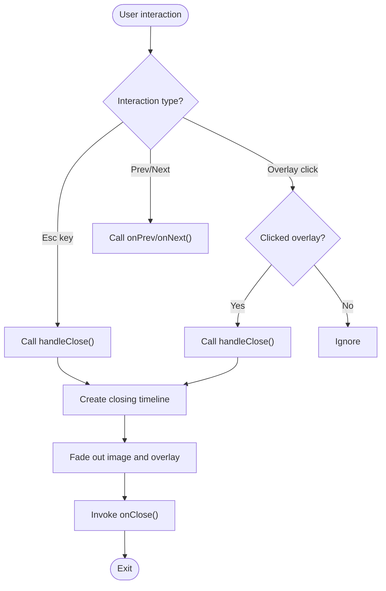
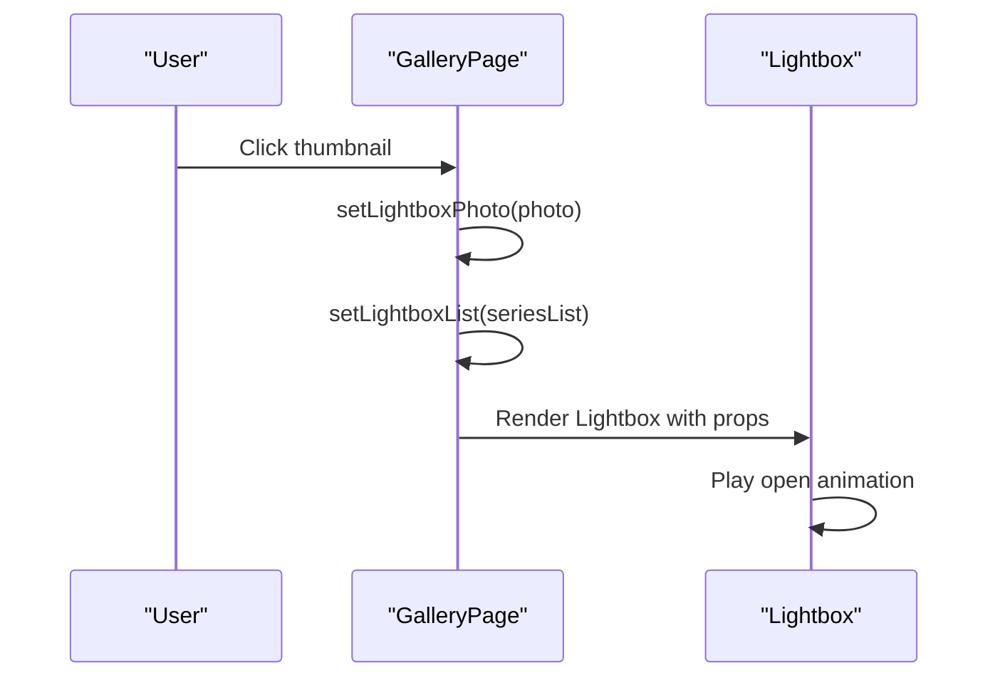
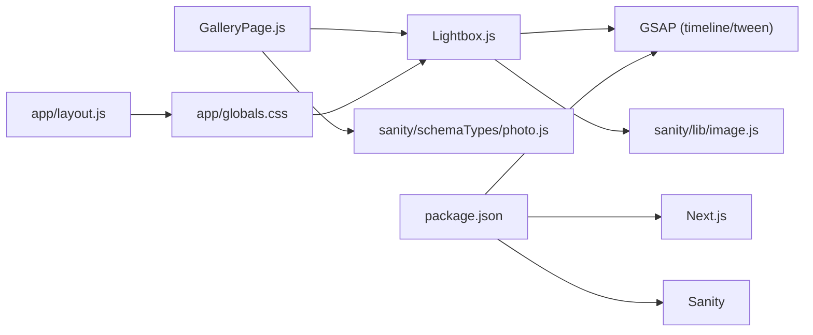

# Lightbox Photo Viewer

<cite>
**Referenced Files in This Document**
- [Lightbox.js](file://app/components/Lightbox.js)
- [GalleryPage.js](file://app/components/GalleryPage.js)
- [globals.css](file://app/globals.css)
- [image.js](file://sanity/lib/image.js)
- [photo.js](file://sanity/schemaTypes/photo.js)
- [layout.js](file://app/layout.js)
- [package.json](file://package.json)
</cite>

## Table of Contents
1. [Introduction](#introduction)
2. [Project Structure](#project-structure)
3. [Core Components](#core-components)
4. [Architecture Overview](#architecture-overview)
5. [Detailed Component Analysis](#detailed-component-analysis)
6. [Dependency Analysis](#dependency-analysis)
7. [Performance Considerations](#performance-considerations)
8. [Troubleshooting Guide](#troubleshooting-guide)
9. [Conclusion](#conclusion)
10. [Appendices](#appendices)

## Introduction
This document describes the Lightbox Photo Viewer component implementation used in the WRD Photography portfolio. It covers the modal photo viewing system, overlay effects, navigation controls, fullscreen presentation, keyboard navigation, and integration with the gallery navigation system. It also documents state management, photo loading optimization, performance characteristics, customization options, accessibility features, and responsive behavior.

## Project Structure
The lightbox is implemented as a standalone React component that receives a selected photo, the full list of photos, and callbacks for closing and navigating. The gallery page manages the lightbox state and passes the current selection and navigation handlers to the lightbox.

**Diagram sources**
- [GalleryPage.js:17-37](file://app/components/GalleryPage.js#L17-L37)
- [Lightbox.js:1-131](file://app/components/Lightbox.js#L1-L131)
- [image.js:1-9](file://sanity/lib/image.js#L1-L9)
- [photo.js:1-93](file://sanity/schemaTypes/photo.js#L1-L93)
- [globals.css:1-93](file://app/globals.css#L1-L93)
- [layout.js:1-40](file://app/layout.js#L1-L40)
- [package.json:1-31](file://package.json#L1-L31)

**Section sources**
- [GalleryPage.js:1-760](file://app/components/GalleryPage.js#L1-L760)
- [Lightbox.js:1-303](file://app/components/Lightbox.js#L1-L303)
- [image.js:1-9](file://sanity/lib/image.js#L1-L9)
- [photo.js:1-93](file://sanity/schemaTypes/photo.js#L1-L93)
- [globals.css:1-93](file://app/globals.css#L1-L93)
- [layout.js:1-40](file://app/layout.js#L1-L40)
- [package.json:1-31](file://package.json#L1-L31)

## Core Components
- Lightbox component: Renders the modal overlay, image, info panel, navigation controls, and close mechanism. Implements opening/closing animations using GSAP timelines and keyboard navigation.
- GalleryPage component: Manages lightbox state, builds photo lists for each series, and provides navigation callbacks to the lightbox.
- Sanity integration: Provides image URL generation and photo schema definitions for metadata.

Key responsibilities:
- Modal presentation with overlay and centered content
- Smooth entrance/exit animations
- Keyboard navigation (Escape, Arrow keys)
- Photo metadata display (series, title, writeup, location, date)
- Navigation between photos in the current list

**Section sources**
- [Lightbox.js:5-303](file://app/components/Lightbox.js#L5-L303)
- [GalleryPage.js:17-37](file://app/components/GalleryPage.js#L17-L37)
- [image.js:6-8](file://sanity/lib/image.js#L6-L8)
- [photo.js:5-62](file://sanity/schemaTypes/photo.js#L5-L62)

## Architecture Overview
The lightbox is a controlled modal that receives props from the gallery page. It uses GSAP for animations and relies on theme variables for styling. The image URLs are generated via Sanity’s image URL builder.

**Diagram sources**
- [GalleryPage.js:17-37](file://app/components/GalleryPage.js#L17-L37)
- [Lightbox.js:15-90](file://app/components/Lightbox.js#L15-L90)
- [image.js:6-8](file://sanity/lib/image.js#L6-L8)

## Detailed Component Analysis

### Lightbox Component
The Lightbox component renders a fixed-position modal with:
- Overlay background using theme variables
- Centered image container with containment fit
- Right-aligned info panel with series, title, writeup, and metadata
- Close button with hover animations
- Navigation arrows with hover animations
- Counter showing current index and total

State and lifecycle:
- Uses refs for DOM nodes to animate with GSAP
- On mount, creates an opening timeline that animates the overlay, image, info panel, close button, and nav arrows
- On photo change, animates image and info panel transitions
- Handles keyboard events for Escape, ArrowLeft, ArrowRight
- Close action triggers a closing timeline and invokes the provided onClose callback

Animations:
- Opening: overlay fade-in, image scale/y translation, info slide-up, close button reveal, nav arrows staggered reveal
- Closing: image scale/y fade-out, overlay fade-out
- Hover states: close button and nav arrows scale/rotate and translate on mouse enter/leave

Accessibility and UX:
- Overlay click-to-close
- Keyboard navigation for dismissal and navigation
- Alt text from photo title
- Responsive layout with flexible widths and viewport-height constraints

Customization hooks:
- Theme variables control colors, borders, and overlay opacity
- Font families and sizes are configurable via CSS variables
- Image quality and width are set in the lightbox rendering

**Section sources**
- [Lightbox.js:5-303](file://app/components/Lightbox.js#L5-L303)

#### Class Diagram

**Diagram sources**
- [Lightbox.js:5-131](file://app/components/Lightbox.js#L5-L131)

#### Sequence Diagram: Open and Close Animations

**Diagram sources**
- [Lightbox.js:15-90](file://app/components/Lightbox.js#L15-L90)

#### Flowchart: Close Mechanism

**Diagram sources**
- [Lightbox.js:79-90](file://app/components/Lightbox.js#L79-L90)
- [Lightbox.js:100-100](file://app/components/Lightbox.js#L100-L100)

### GalleryPage Integration
The gallery page maintains:
- Active filter state
- Hovered card state
- Lightbox state (selected photo and list)
- Handlers for opening, closing, and navigating within the lightbox

Navigation logic:
- openLightbox sets the current photo and the list to navigate within
- closeLightbox clears the selection and list
- lightboxPrev/Next compute the previous/next index with wrap-around

Rendering:
- Renders thumbnails for each series and attaches click handlers to open the lightbox with the appropriate list
- Conditionally renders the lightbox when a photo is selected

**Section sources**
- [GalleryPage.js:17-37](file://app/components/GalleryPage.js#L17-L37)
- [GalleryPage.js:371-378](file://app/components/GalleryPage.js#L371-L378)
- [GalleryPage.js:479-486](file://app/components/GalleryPage.js#L479-L486)
- [GalleryPage.js:566-572](file://app/components/GalleryPage.js#L566-L572)
- [GalleryPage.js:643-649](file://app/components/GalleryPage.js#L643-L649)
- [GalleryPage.js:749-757](file://app/components/GalleryPage.js#L749-L757)

#### Sequence Diagram: Thumbnail Click to Lightbox

**Diagram sources**
- [GalleryPage.js:371-378](file://app/components/GalleryPage.js#L371-L378)
- [GalleryPage.js:479-486](file://app/components/GalleryPage.js#L479-L486)
- [GalleryPage.js:566-572](file://app/components/GalleryPage.js#L566-L572)
- [GalleryPage.js:643-649](file://app/components/GalleryPage.js#L643-L649)
- [GalleryPage.js:749-757](file://app/components/GalleryPage.js#L749-L757)

### Photo Schema and Image URL Generation
- Photo schema defines fields for title, image, location, series, date, writeup, and ordering.
- Image URL builder generates optimized URLs with width and quality parameters for the lightbox.

**Section sources**
- [photo.js:5-62](file://sanity/schemaTypes/photo.js#L5-L62)
- [image.js:6-8](file://sanity/lib/image.js#L6-L8)
- [Lightbox.js:161-161](file://app/components/Lightbox.js#L161-L161)

## Dependency Analysis
External libraries and integrations:
- GSAP: Used for all animations (timelines, tweens)
- Next.js: Framework runtime and font providers
- Sanity: Image URL builder and schema types
- TailwindCSS: Utility classes and global styles

Internal dependencies:
- Lightbox depends on Sanity image builder for URLs
- GalleryPage manages state and passes callbacks to Lightbox
- Global CSS provides theme variables consumed by Lightbox

**Diagram sources**
- [Lightbox.js:1-3](file://app/components/Lightbox.js#L1-L3)
- [GalleryPage.js:1-4](file://app/components/GalleryPage.js#L1-L4)
- [image.js:1-9](file://sanity/lib/image.js#L1-L9)
- [photo.js:1-93](file://sanity/schemaTypes/photo.js#L1-L93)
- [globals.css:1-93](file://app/globals.css#L1-L93)
- [layout.js:1-40](file://app/layout.js#L1-L40)
- [package.json:11-22](file://package.json#L11-L22)

**Section sources**
- [package.json:11-22](file://package.json#L11-L22)
- [Lightbox.js:1-3](file://app/components/Lightbox.js#L1-L3)
- [GalleryPage.js:1-4](file://app/components/GalleryPage.js#L1-L4)
- [image.js:1-9](file://sanity/lib/image.js#L1-L9)
- [photo.js:1-93](file://sanity/schemaTypes/photo.js#L1-L93)
- [globals.css:1-93](file://app/globals.css#L1-L93)
- [layout.js:1-40](file://app/layout.js#L1-L40)

## Performance Considerations
- Lazy load GSAP: Import GSAP dynamically when the lightbox mounts to avoid blocking initial render.
- Image optimization: Use Sanity’s image URL builder with appropriate width and quality for the lightbox view.
- Minimal reflows: Use transforms and opacity for animations; avoid layout-affecting properties.
- Efficient state updates: Only update state when necessary (e.g., on photo change).
- Cleanup listeners: Remove keyboard event listeners on unmount.
- CSS variables: Centralized theming reduces style recalculation overhead.

[No sources needed since this section provides general guidance]

## Troubleshooting Guide
Common issues and resolutions:
- Lightbox does not open: Ensure a photo is passed and that the lightbox state is set in the gallery page.
- Animations not playing: Verify that GSAP is imported and timelines are created on mount.
- Keyboard navigation not working: Confirm that keydown listeners are attached and removed on unmount.
- Overlay click does nothing: Check that the overlay click handler calls the close function.
- Image not loading: Confirm the Sanity image URL builder is configured and the photo has an image field.

**Section sources**
- [Lightbox.js:15-62](file://app/components/Lightbox.js#L15-L62)
- [Lightbox.js:79-90](file://app/components/Lightbox.js#L79-L90)
- [Lightbox.js:100-100](file://app/components/Lightbox.js#L100-L100)
- [GalleryPage.js:17-37](file://app/components/GalleryPage.js#L17-L37)

## Conclusion
The Lightbox Photo Viewer provides a polished, animated modal experience with keyboard navigation, responsive layout, and seamless integration with the gallery navigation system. Its modular design, reliance on theme variables, and lazy-loaded animations contribute to a performant and accessible viewing experience.

[No sources needed since this section summarizes without analyzing specific files]

## Appendices

### Accessibility Features
- Keyboard navigation: Escape to close, arrow keys to navigate
- Focus-friendly controls: Buttons with hover feedback
- Alt text: Provided via photo title
- Reduced motion support: Animations respect reduced motion preferences

**Section sources**
- [Lightbox.js:55-61](file://app/components/Lightbox.js#L55-L61)
- [Lightbox.js:162-162](file://app/components/Lightbox.js#L162-L162)
- [globals.css:81-83](file://app/globals.css#L81-L83)

### Customization Options
- Theme variables: Adjust colors, borders, overlay, and typography via CSS variables
- Image quality/size: Modify width and quality in the lightbox image URL generation
- Animation timing/easing: Tune GSAP durations and easings in the lightbox effect hooks
- Layout: Adjust widths, gaps, and viewport constraints in the lightbox container styles

**Section sources**
- [globals.css:5-28](file://app/globals.css#L5-L28)
- [Lightbox.js:161-161](file://app/components/Lightbox.js#L161-L161)
- [Lightbox.js:21-51](file://app/components/Lightbox.js#L21-L51)
- [Lightbox.js:84-89](file://app/components/Lightbox.js#L84-L89)

### Responsive Behavior
- Flexible layout: The lightbox adapts to different screen sizes with percentage-based widths and viewport constraints
- Typography scaling: Uses clamp for fluid headings
- Info panel sizing: Fixed width with flex shrink to keep image dominant on smaller screens

**Section sources**
- [Lightbox.js:145-178](file://app/components/Lightbox.js#L145-L178)
- [Lightbox.js:186-189](file://app/components/Lightbox.js#L186-L189)