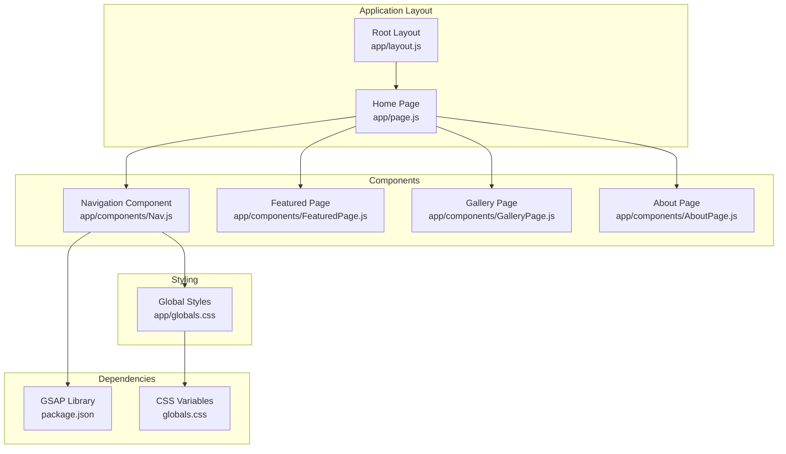
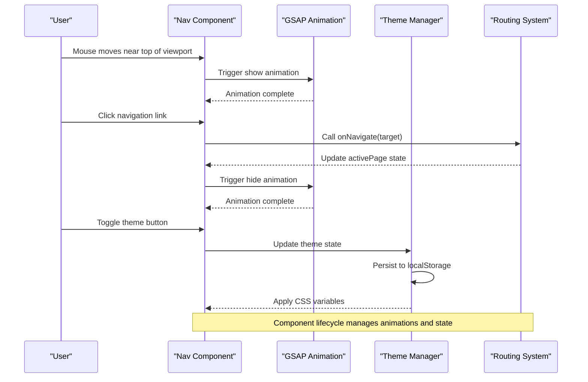
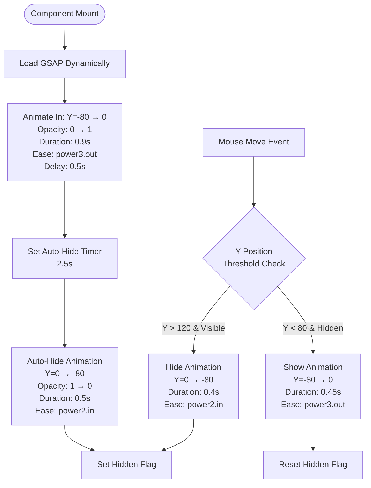
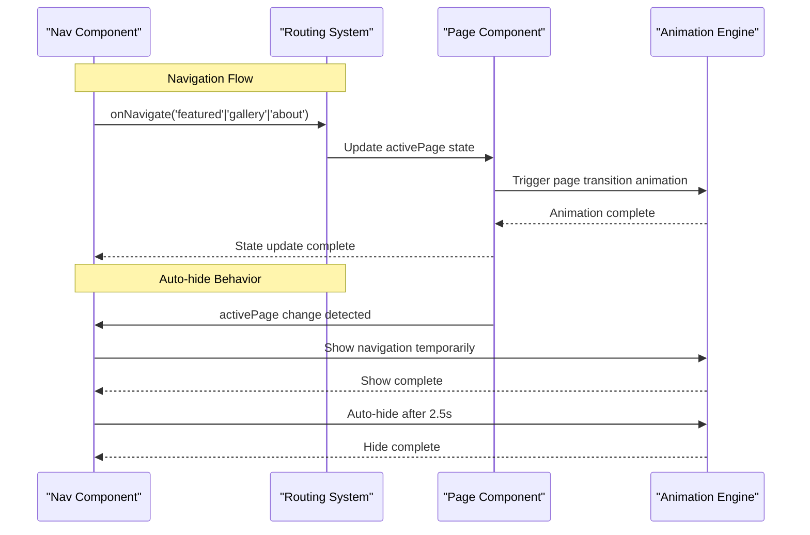
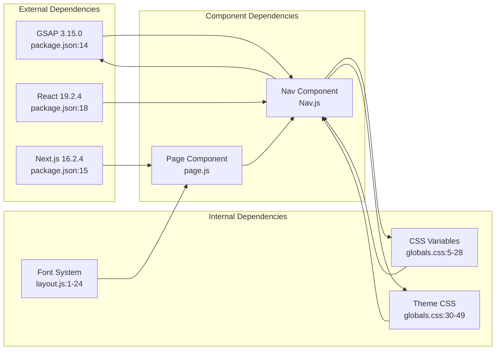

# Navigation Component

<cite>
**Referenced Files in This Document**
- [Nav.js](file://app/components/Nav.js)
- [page.js](file://app/page.js)
- [globals.css](file://app/globals.css)
- [package.json](file://package.json)
</cite>

## Table of Contents
1. [Introduction](#introduction)
2. [Project Structure](#project-structure)
3. [Core Components](#core-components)
4. [Architecture Overview](#architecture-overview)
5. [Detailed Component Analysis](#detailed-component-analysis)
6. [Dependency Analysis](#dependency-analysis)
7. [Performance Considerations](#performance-considerations)
8. [Troubleshooting Guide](#troubleshooting-guide)
9. [Conclusion](#conclusion)

## Introduction
This document provides comprehensive technical documentation for the Navigation component implementation. It covers the animated navigation system powered by GSAP, mouse proximity detection logic, auto-hide functionality, props interface, state management for theme switching, localStorage persistence, navigation links structure, hover effects, visual indicators for active pages, automatic hide/show behavior, theme toggle button with SVG icons, and responsive design considerations. It also includes usage examples, customization options, and integration patterns with the main application routing system.

## Project Structure
The Navigation component is implemented as a React client component located in the app components directory. It integrates with the main application layout and page routing system.



**Diagram sources**
- [Nav.js:1-168](file://app/components/Nav.js#L1-L168)
- [page.js:14-227](file://app/page.js#L14-L227)
- [globals.css:1-93](file://app/globals.css#L1-L93)
- [package.json:14](file://package.json#L14)

**Section sources**
- [Nav.js:1-168](file://app/components/Nav.js#L1-L168)
- [page.js:14-227](file://app/page.js#L14-L227)
- [globals.css:1-93](file://app/globals.css#L1-L93)

## Core Components
The Navigation component is a sophisticated React client component that combines:
- GSAP-powered entrance/exit animations
- Mouse proximity detection for auto-hide functionality
- Theme switching with localStorage persistence
- Dynamic navigation links with visual active state indicators
- Responsive design using CSS variables

Key implementation characteristics:
- Client-side only component using 'use client' directive
- GSAP integration for smooth animations
- Mouse move event listener for proximity detection
- LocalStorage integration for theme persistence
- CSS-in-JS styling with CSS variables
- Dynamic link rendering based on active page state

**Section sources**
- [Nav.js:1-168](file://app/components/Nav.js#L1-L168)

## Architecture Overview
The Navigation component follows a unidirectional data flow pattern integrated with the main application routing system.



**Diagram sources**
- [Nav.js:10-68](file://app/components/Nav.js#L10-L68)
- [page.js:136-145](file://app/page.js#L136-L145)

## Detailed Component Analysis

### Props Interface and State Management
The Navigation component accepts two primary props and manages internal state:

**Props Interface:**
- `activePage`: string - Current active navigation page identifier
- `onNavigate`: function - Callback function for handling navigation requests

**Internal State:**
- `theme`: string - Current theme ('dark' or 'light')
- `hiddenRef`: boolean - Internal flag tracking navigation visibility state
- `navRef`: DOM reference to the navigation element
- `gsapRef`: reference to GSAP instance

**Section sources**
- [Nav.js:4-8](file://app/components/Nav.js#L4-L8)

### Animated Entrance/Exit System
The component implements a sophisticated GSAP-based animation system:



**Diagram sources**
- [Nav.js:10-49](file://app/components/Nav.js#L10-L49)
- [Nav.js:51-68](file://app/components/Nav.js#L51-L68)

**Section sources**
- [Nav.js:10-49](file://app/components/Nav.js#L10-L49)
- [Nav.js:51-68](file://app/components/Nav.js#L51-L68)

### Mouse Proximity Detection Logic
The proximity detection system uses mouse coordinates to determine navigation visibility:

**Detection Algorithm:**
- Threshold 1: Y coordinate < 80 pixels triggers show animation
- Threshold 2: Y coordinate > 120 pixels triggers hide animation
- Uses `hiddenRef` to prevent conflicting animations
- Debounces rapid mouse movements near threshold zones

**Section sources**
- [Nav.js:27-44](file://app/components/Nav.js#L27-L44)

### Theme Switching and Persistence
The theme system implements a robust dual-persistence mechanism:

```mermaid
stateDiagram-v2
[*] --> CheckLocalStorage
CheckLocalStorage --> HasStoredTheme{"Has Stored Theme?"}
HasStoredTheme --> |Yes| UseStoredTheme["Use Stored Theme<br/>localStorage.getItem('wrd-theme')"]
HasStoredTheme --> |No| CheckSystemPref{"System Prefers Light?"}
CheckSystemPref --> |Yes| UseLightTheme["Use Light Theme"]
CheckSystemPref --> |No| UseDarkTheme["Use Dark Theme"]
UseStoredTheme --> ApplyTheme["Apply CSS Variables<br/>data-theme attribute"]
UseLightTheme --> ApplyTheme
UseDarkTheme --> ApplyTheme
ApplyTheme --> ToggleTheme["User Toggles Theme"]
ToggleTheme --> UpdateTheme["Update State & CSS Variables"]
UpdateTheme --> PersistToStorage["localStorage.setItem('wrd-theme')"]
PersistToStorage --> ApplyTheme
note right of CheckLocalStorage
Initial load only
Uses localStorage first,
then system preference
end note
```

**Diagram sources**
- [Nav.js:70-83](file://app/components/Nav.js#L70-L83)

**Section sources**
- [Nav.js:70-83](file://app/components/Nav.js#L70-L83)
- [globals.css:30-49](file://app/globals.css#L30-L49)

### Navigation Links Structure and Visual Indicators
The component renders three primary navigation links with sophisticated visual feedback:

**Link Structure:**
- Featured: Primary navigation target
- Gallery: Secondary navigation target  
- About: Tertiary navigation target

**Visual Indicators:**
- Active state: Underlined with accent color (`borderBottom: '1px solid var(--accent)'`)
- Hover state: Text color transitions from muted to full (`var(--text-muted)` → `var(--text)`)
- Typography: Uppercase, letter spacing 1.5px, font weight adjusts based on active state
- Transition effects: Smooth color transitions (0.2s duration)

**Section sources**
- [Nav.js:85-132](file://app/components/Nav.js#L85-L132)

### Theme Toggle Button Implementation
The theme toggle button features a dual-SVG icon system with interactive hover effects:

**SVG Icon System:**
- Dark mode icon: Sun with rays and central circle
- Light mode icon: Crescent moon shape
- Both icons use consistent stroke width and strokeLinecap

**Interactive Effects:**
- Border transitions from `var(--border)` to `var(--border-strong)`
- Smooth hover animations using GSAP
- Accessible aria-label attributes
- Circular design with 34px dimensions

**Section sources**
- [Nav.js:133-162](file://app/components/Nav.js#L133-L162)

### Integration with Routing System
The Navigation component integrates seamlessly with the main application routing:



**Diagram sources**
- [page.js:136-145](file://app/page.js#L136-L145)
- [Nav.js:51-68](file://app/components/Nav.js#L51-L68)

**Section sources**
- [page.js:136-145](file://app/page.js#L136-L145)
- [Nav.js:51-68](file://app/components/Nav.js#L51-L68)

## Dependency Analysis
The Navigation component relies on several key dependencies and external systems:



**Diagram sources**
- [package.json:14](file://package.json#L14)
- [Nav.js:11](file://app/components/Nav.js#L11)
- [globals.css:5-28](file://app/globals.css#L5-L28)

**Section sources**
- [package.json:14](file://package.json#L14)
- [Nav.js:11](file://app/components/Nav.js#L11)

## Performance Considerations
The Navigation component implements several performance optimizations:

**Animation Performance:**
- Uses `willChange: 'transform'` for GPU-accelerated animations
- Leverages GSAP's optimized animation engine
- Minimizes DOM manipulation during animations
- Uses CSS transforms instead of layout-affecting properties

**Memory Management:**
- Proper cleanup of event listeners in useEffect cleanup functions
- Reference-based state management to avoid unnecessary re-renders
- Conditional GSAP initialization to prevent blocking

**Accessibility:**
- Proper ARIA labels for theme toggle button
- Keyboard navigable elements
- Reduced motion support through CSS media queries

**Section sources**
- [Nav.js:103](file://app/components/Nav.js#L103)
- [Nav.js:47-48](file://app/components/Nav.js#L47-L48)

## Troubleshooting Guide

### Common Issues and Solutions

**GSAP Not Loading:**
- Verify GSAP dependency is installed in package.json
- Check browser console for module loading errors
- Ensure 'use client' directive is present

**Animations Not Working:**
- Confirm navRef is properly attached to DOM element
- Verify GSAP instance is loaded before animation calls
- Check for conflicting CSS transitions

**Theme Persistence Issues:**
- Verify localStorage is enabled in browser
- Check for browser privacy settings blocking localStorage
- Ensure data-theme attribute is properly applied

**Mouse Detection Problems:**
- Verify mousemove event listener is attached
- Check for overlapping elements intercepting mouse events
- Ensure coordinate calculations account for viewport positioning

**Section sources**
- [Nav.js:10-25](file://app/components/Nav.js#L10-L25)
- [Nav.js:70-76](file://app/components/Nav.js#L70-L76)

## Conclusion
The Navigation component represents a sophisticated implementation of modern web navigation patterns, combining smooth animations, intelligent auto-hide behavior, and seamless theme management. Its modular design allows for easy customization while maintaining performance and accessibility standards. The component serves as a foundation for the application's user interface, providing both functional navigation and visual polish that enhances the overall user experience.

The implementation demonstrates best practices in React component architecture, including proper state management, lifecycle optimization, and integration with external libraries like GSAP. The responsive design considerations and accessibility features ensure the component works effectively across different devices and user needs.