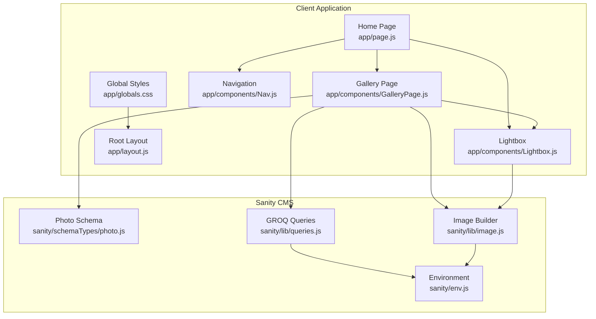
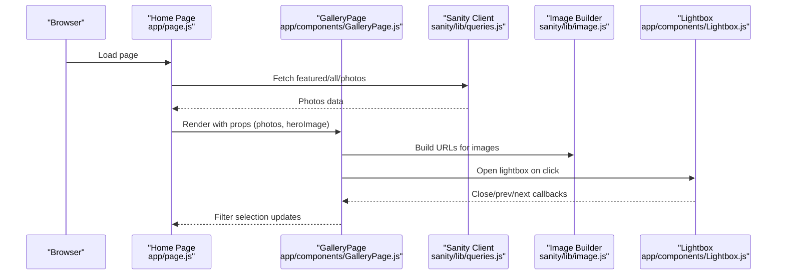
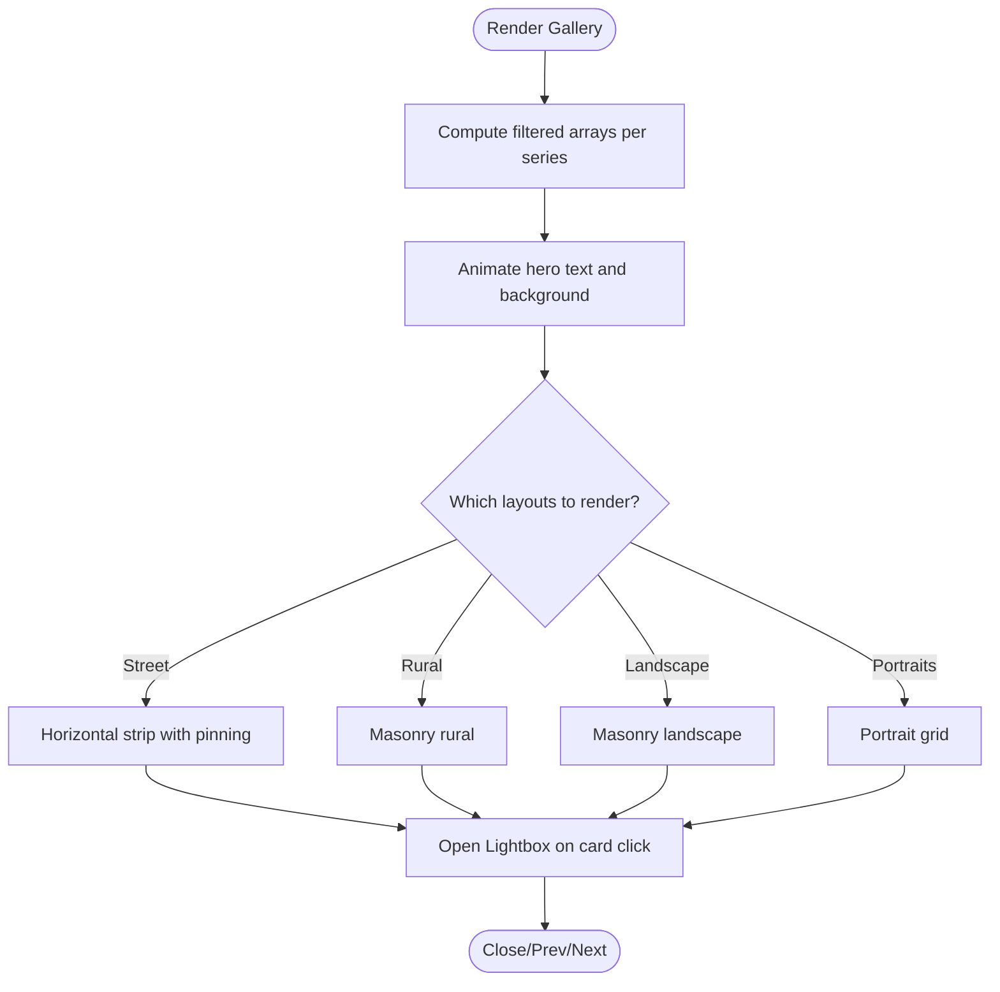
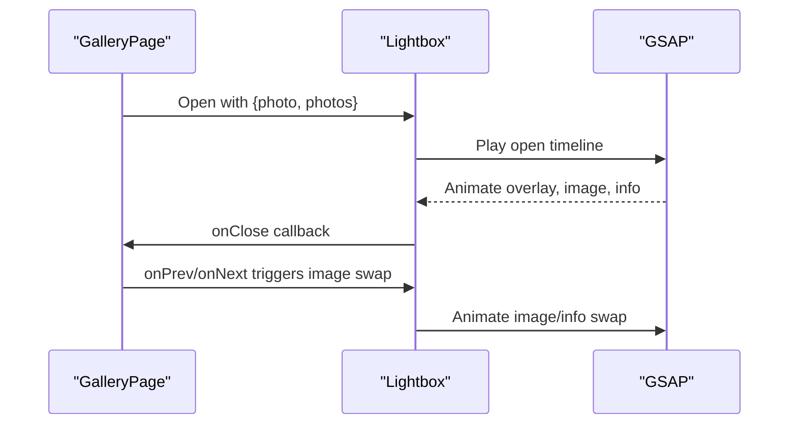
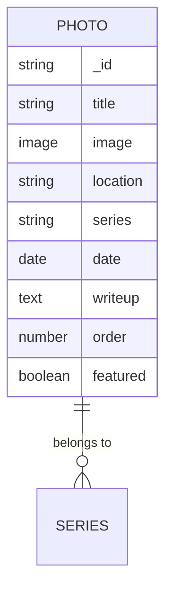
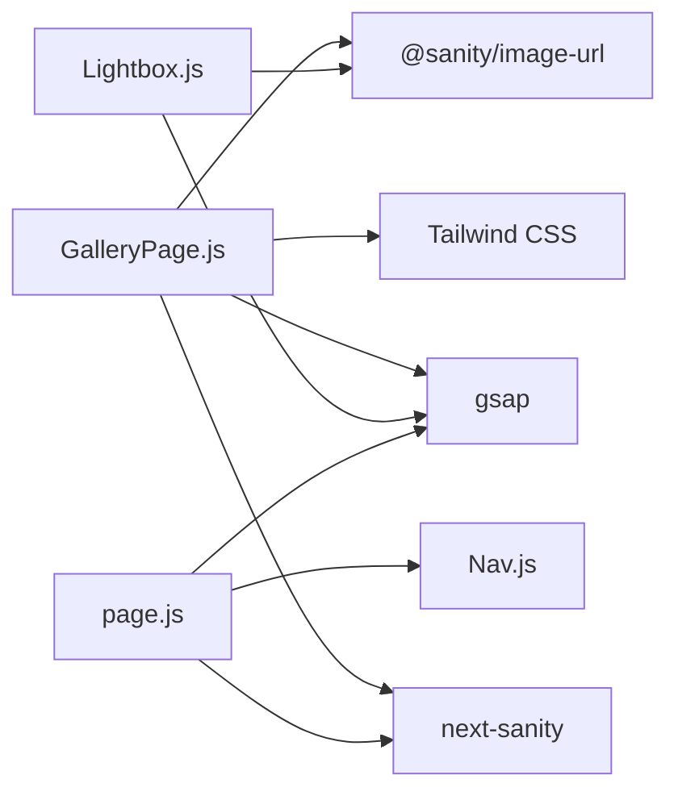

# Photo Gallery System

<cite>
**Referenced Files in This Document**
- [GalleryPage.js](file://app/components/GalleryPage.js)
- [Lightbox.js](file://app/components/Lightbox.js)
- [Nav.js](file://app/components/Nav.js)
- [page.js](file://app/page.js)
- [globals.css](file://app/globals.css)
- [layout.js](file://app/layout.js)
- [photo.js](file://sanity/schemaTypes/photo.js)
- [image.js](file://sanity/lib/image.js)
- [queries.js](file://sanity/lib/queries.js)
- [env.js](file://sanity/env.js)
- [package.json](file://package.json)
</cite>

## Table of Contents
1. [Introduction](#introduction)
2. [Project Structure](#project-structure)
3. [Core Components](#core-components)
4. [Architecture Overview](#architecture-overview)
5. [Detailed Component Analysis](#detailed-component-analysis)
6. [Dependency Analysis](#dependency-analysis)
7. [Performance Considerations](#performance-considerations)
8. [Troubleshooting Guide](#troubleshooting-guide)
9. [Conclusion](#conclusion)
10. [Appendices](#appendices)

## Introduction
This document describes the Photo Gallery System implemented in the portfolio website. It covers the multi-layout gallery system with horizontal street strip, masonry rural/landscape, and portrait grid layouts. It explains layout switching logic, responsive behavior, image optimization strategies, filtering and sorting capabilities, infinite scroll considerations, performance characteristics for large photo collections, gallery navigation, category-based filtering, and integration with the lightbox system. It also provides guidance on layout customization, mobile performance tuning, and accessibility features for photo browsing.

## Project Structure
The gallery system is built as a Next.js application with a client-side component that renders multiple photo layouts and integrates with a lightbox. Data is fetched from Sanity CMS using GROQ queries and processed with the Sanity Image URL builder. The UI relies on CSS custom properties and Tailwind for styling, with GSAP animations for hero reveals and scroll-triggered effects.

**Diagram sources**
- [page.js:14-227](file://app/page.js#L14-L227)
- [GalleryPage.js:6-760](file://app/components/GalleryPage.js#L6-L760)
- [Lightbox.js:5-303](file://app/components/Lightbox.js#L5-L303)
- [Nav.js:4-168](file://app/components/Nav.js#L4-L168)
- [globals.css:1-93](file://app/globals.css#L1-L93)
- [layout.js:31-39](file://app/layout.js#L31-L39)
- [photo.js:1-93](file://sanity/schemaTypes/photo.js#L1-L93)
- [queries.js:1-33](file://sanity/lib/queries.js#L1-L33)
- [image.js:1-9](file://sanity/lib/image.js#L1-L9)
- [env.js:1-6](file://sanity/env.js#L1-L6)

**Section sources**
- [page.js:14-227](file://app/page.js#L14-L227)
- [GalleryPage.js:6-760](file://app/components/GalleryPage.js#L6-L760)
- [Lightbox.js:5-303](file://app/components/Lightbox.js#L5-L303)
- [Nav.js:4-168](file://app/components/Nav.js#L4-L168)
- [globals.css:1-93](file://app/globals.css#L1-L93)
- [layout.js:31-39](file://app/layout.js#L31-L39)
- [photo.js:1-93](file://sanity/schemaTypes/photo.js#L1-L93)
- [queries.js:1-33](file://sanity/lib/queries.js#L1-L33)
- [image.js:1-9](file://sanity/lib/image.js#L1-L9)
- [env.js:1-6](file://sanity/env.js#L1-L6)

## Core Components
- GalleryPage: Renders the multi-layout gallery with filters, hero animation, and scroll-triggered reveals. Implements category-based filtering and lightbox integration.
- Lightbox: Provides modal viewing with navigation, keyboard controls, and animated transitions.
- Navigation: Handles page switching between Featured, Gallery, and About pages.
- Global Styles and Layout: Define theme tokens, typography, and scroll behavior.
- Sanity Integration: Photo schema, GROQ queries, and image URL builder.

Key implementation highlights:
- Layouts: Horizontal street strip, masonry rural/landscape, and portrait grid.
- Filtering: Category buttons filter by series (street, rural, landscape, portraits).
- Hero Animation: GSAP-driven character and word reveal, parallax background, and overlay scrub.
- Scroll Effects: GSAP ScrollTrigger pins and animates sections during horizontal scrolling and masonry reveals.
- Lightbox: Full-screen modal with prev/next navigation and keyboard support.

**Section sources**
- [GalleryPage.js:6-760](file://app/components/GalleryPage.js#L6-L760)
- [Lightbox.js:5-303](file://app/components/Lightbox.js#L5-L303)
- [Nav.js:4-168](file://app/components/Nav.js#L4-L168)
- [photo.js:1-93](file://sanity/schemaTypes/photo.js#L1-L93)
- [queries.js:1-33](file://sanity/lib/queries.js#L1-L33)
- [image.js:1-9](file://sanity/lib/image.js#L1-L9)

## Architecture Overview
The gallery system is a client-rendered React component integrated into the home page. Data is fetched server-side via Next.js and Sanity client, then passed down to the GalleryPage. The component orchestrates layout rendering, filtering, and lightbox interactions. GSAP powers animations and scroll-triggered effects. The lightbox composes with the gallery to provide immersive viewing.

**Diagram sources**
- [page.js:14-227](file://app/page.js#L14-L227)
- [GalleryPage.js:6-760](file://app/components/GalleryPage.js#L6-L760)
- [Lightbox.js:5-303](file://app/components/Lightbox.js#L5-L303)
- [queries.js:1-33](file://sanity/lib/queries.js#L1-L33)
- [image.js:1-9](file://sanity/lib/image.js#L1-L9)

## Detailed Component Analysis

### GalleryPage Component
Responsibilities:
- Render hero with animated text and parallax background.
- Provide category filter bar with magnetic hover effect.
- Render four distinct layouts: horizontal street strip, masonry rural, masonry landscape, and portrait grid.
- Integrate with GSAP for scroll-triggered animations and horizontal track pinning.
- Open lightbox with selected photo and list context.

Filtering logic:
- Maintains activeFilter state and computes filtered arrays per series.
- Magnetic filter buttons apply transform on mouse move and reset on leave.
- On filter change, kills existing ScrollTrigger instances and resets initialization flag to re-run animations safely.

Layouts:
- Horizontal Street Strip: Fixed-width cards arranged in a horizontally scrollable track with pinning and staggered entrance animations.
- Masonry Rural/Landscape: CSS columns with break-inside: avoid for items; hover overlays with staggered reveals.
- Portrait Grid: Responsive grid with auto-fill minmax sizing and varying heights.

Image optimization:
- Uses Sanity Image URL builder with width and quality parameters per layout.
- Applies objectFit: cover for grid layouts and contain for lightbox.

Accessibility:
- Hover states controlled via mouse events; consider adding focus-visible styles for keyboard navigation.
- Alt text provided for images.

Responsive behavior:
- Uses CSS clamp for fluid typography and grid templates.
- Columns adjust based on viewport; portrait grid uses repeat(auto-fill, minmax(...)).

Performance considerations:
- GSAP ScrollTrigger refresh on mount and filter changes.
- Dynamic imports for GSAP plugins to reduce initial bundle size.
- Efficient filtering via array operations; consider memoization for large datasets.

**Diagram sources**
- [GalleryPage.js:6-760](file://app/components/GalleryPage.js#L6-L760)

**Section sources**
- [GalleryPage.js:6-760](file://app/components/GalleryPage.js#L6-L760)

### Lightbox Component
Responsibilities:
- Modal overlay with fade and scale-in animation on open.
- Image swap animation on prev/next.
- Keyboard navigation (Escape, Arrow keys).
- Information panel with series, title, writeup, location, and date.
- Navigation arrows with hover animations.

Animation flow:
- Timeline sequences overlay fade, image scale, info slide, close button, and nav arrows.
- Image swap uses opacity and scale transitions for smooth transitions.

Integration:
- Receives photo, photos list, onClose, onPrev, onNext callbacks from GalleryPage.
- Uses Sanity Image URL builder for high-resolution display.

Accessibility:
- Keyboard controls for navigation.
- Overlay click-to-close.
- Consider adding focus trapping and ARIA attributes for improved accessibility.

**Diagram sources**
- [Lightbox.js:5-303](file://app/components/Lightbox.js#L5-L303)
- [GalleryPage.js:17-37](file://app/components/GalleryPage.js#L17-L37)

**Section sources**
- [Lightbox.js:5-303](file://app/components/Lightbox.js#L5-L303)
- [GalleryPage.js:17-37](file://app/components/GalleryPage.js#L17-L37)

### Navigation Component
Responsibilities:
- Page navigation between Featured, Gallery, and About.
- Auto-hide/show behavior on mouse movement near top of screen.
- Theme toggle with persistent storage and system preference detection.

Integration:
- Used by Home page to switch active page and trigger page transitions.

**Section sources**
- [Nav.js:4-168](file://app/components/Nav.js#L4-L168)
- [page.js:136-145](file://app/page.js#L136-L145)

### Data Model and Queries
Photo schema defines fields for title, image, location, series, date, writeup, and order. GROQ queries fetch featured photos, all photos ordered by manual order and date, and gallery hero image. The image URL builder constructs optimized URLs from Sanity assets.

**Diagram sources**
- [photo.js:1-93](file://sanity/schemaTypes/photo.js#L1-L93)

**Section sources**
- [photo.js:1-93](file://sanity/schemaTypes/photo.js#L1-L93)
- [queries.js:1-33](file://sanity/lib/queries.js#L1-L33)
- [image.js:1-9](file://sanity/lib/image.js#L1-L9)
- [env.js:1-6](file://sanity/env.js#L1-L6)

## Dependency Analysis
External libraries and integrations:
- GSAP: ScrollTrigger and timeline animations for hero and layout reveals.
- next-sanity: GROQ client for fetching data.
- @sanity/image-url: Construct optimized image URLs.
- Tailwind: Utility-first CSS framework for responsive layouts.
- next/font/google: Font loading with display swap.

**Diagram sources**
- [package.json:11-22](file://package.json#L11-L22)
- [GalleryPage.js:1-220](file://app/components/GalleryPage.js#L1-L220)
- [Lightbox.js:1-62](file://app/components/Lightbox.js#L1-L62)
- [page.js:1-131](file://app/page.js#L1-L131)

**Section sources**
- [package.json:11-22](file://package.json#L11-L22)
- [GalleryPage.js:1-220](file://app/components/GalleryPage.js#L1-L220)
- [Lightbox.js:1-62](file://app/components/Lightbox.js#L1-L62)
- [page.js:1-131](file://app/page.js#L1-L131)

## Performance Considerations
- Image optimization:
  - Use width and quality parameters per layout to balance quality and bandwidth.
  - Consider lazy-loading images with native loading="lazy" and intersection observers for offscreen items.
  - Prefer modern formats (AVIF/WebP) via Sanity transformations when available.

- Animation performance:
  - Use transform and opacity for GPU-accelerated animations.
  - Limit ScrollTrigger instances and refresh on mount/filter changes to prevent accumulation.
  - Defer heavy animations until after initial render and font loading.

- Rendering:
  - Keep filtered arrays computed efficiently; consider memoizing filtered results for large datasets.
  - Avoid unnecessary re-renders by passing stable references where possible.

- Mobile:
  - Reduce animation intensity for reduced motion preferences.
  - Optimize touch targets and hover effects for mobile interactions.
  - Use CSS clamp for scalable typography and avoid excessive transforms on small screens.

- Infinite scroll:
  - The current implementation renders all photos at once. For large collections, implement pagination or virtualized lists to limit DOM nodes.
  - Lazy-load additional batches when nearing the end of the gallery.

[No sources needed since this section provides general guidance]

## Troubleshooting Guide
Common issues and resolutions:
- Animations not triggering:
  - Ensure ScrollTrigger.refresh is called after layout changes and filter updates.
  - Verify container refs are present before initializing animations.

- Lightbox not opening:
  - Confirm openLightbox is invoked with correct photo and photos list.
  - Check that urlFor is available and images are loaded.

- Filter buttons not responding:
  - Ensure activeFilter state updates and initedRef is reset to reinitialize animations.

- Hero background not appearing:
  - Verify heroImage prop is passed and urlFor resolves to a valid URL.

- Accessibility concerns:
  - Add keyboard navigation for filter buttons and lightbox.
  - Provide focus management and ARIA attributes for modal interactions.

**Section sources**
- [GalleryPage.js:51-220](file://app/components/GalleryPage.js#L51-L220)
- [Lightbox.js:54-62](file://app/components/Lightbox.js#L54-L62)
- [page.js:136-145](file://app/page.js#L136-L145)

## Conclusion
The Photo Gallery System delivers a visually rich, interactive experience with multiple layouts and seamless navigation. Its modular design integrates cleanly with Sanity for content management and GSAP for compelling animations. By focusing on image optimization, efficient filtering, and accessibility, the system scales effectively for large photo collections while maintaining a smooth user experience across devices.

[No sources needed since this section summarizes without analyzing specific files]

## Appendices

### Layout Switching Logic
- Filter buttons update activeFilter state and reset initialization flag to re-run animations.
- Conditional rendering ensures only relevant layouts are shown based on activeFilter and series availability.

**Section sources**
- [GalleryPage.js:39-49](file://app/components/GalleryPage.js#L39-L49)
- [GalleryPage.js:326-331](file://app/components/GalleryPage.js#L326-L331)

### Responsive Breakpoint Handling
- Typography uses clamp for fluid scaling across breakpoints.
- Grid layouts use repeat(auto-fill, minmax(...)) for adaptive column counts.
- Masonry columns adjust naturally with CSS column-count.

**Section sources**
- [GalleryPage.js:534-616](file://app/components/GalleryPage.js#L534-L616)
- [GalleryPage.js:618-679](file://app/components/GalleryPage.js#L618-L679)

### Image Optimization Strategies
- urlFor with width and quality tuned per layout.
- objectFit strategies: cover for grids, contain for lightbox.
- Consider lazy-loading and modern formats for improved performance.

**Section sources**
- [image.js:6-8](file://sanity/lib/image.js#L6-L8)
- [GalleryPage.js:385-389](file://app/components/GalleryPage.js#L385-L389)
- [Lightbox.js:159-167](file://app/components/Lightbox.js#L159-L167)

### Gallery Filtering and Sorting
- Filtering by series via array operations and state.
- Sorting via GROQ orderings: manual order and newest first.

**Section sources**
- [GalleryPage.js:39-49](file://app/components/GalleryPage.js#L39-L49)
- [photo.js:64-75](file://sanity/schemaTypes/photo.js#L64-L75)
- [queries.js:10-15](file://sanity/lib/queries.js#L10-L15)

### Infinite Scroll Implementation
- Current implementation renders all photos; consider pagination or virtualization for large datasets.
- Implement intersection observer to load additional batches when reaching the end.

[No sources needed since this section provides general guidance]

### Performance Tuning for Mobile Devices
- Reduce animation complexity for reduced motion.
- Optimize touch interactions and remove hover-only effects.
- Use CSS clamp and flexible units for scalable layouts.

[No sources needed since this section provides general guidance]

### Accessibility Features for Photo Browsing
- Keyboard navigation for lightbox and filter buttons.
- Overlay click-to-close and Escape key support.
- Consider focus trapping and ARIA roles for modal dialogs.

**Section sources**
- [Lightbox.js:54-62](file://app/components/Lightbox.js#L54-L62)
- [Nav.js:133-144](file://app/components/Nav.js#L133-L144)