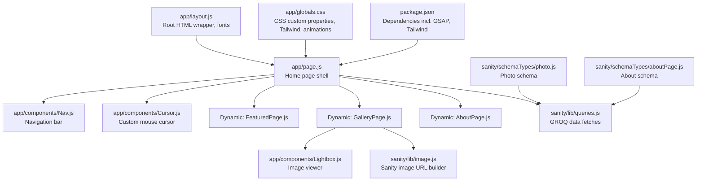
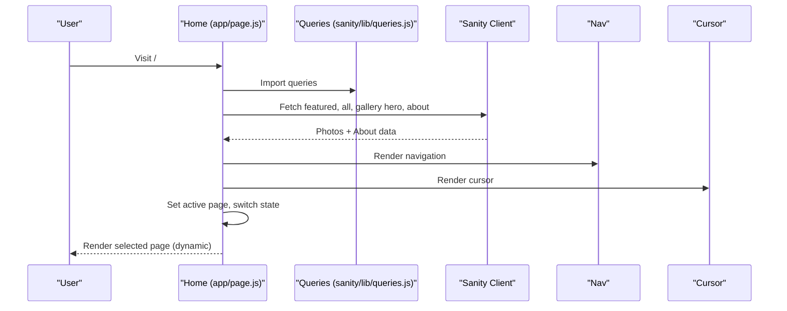
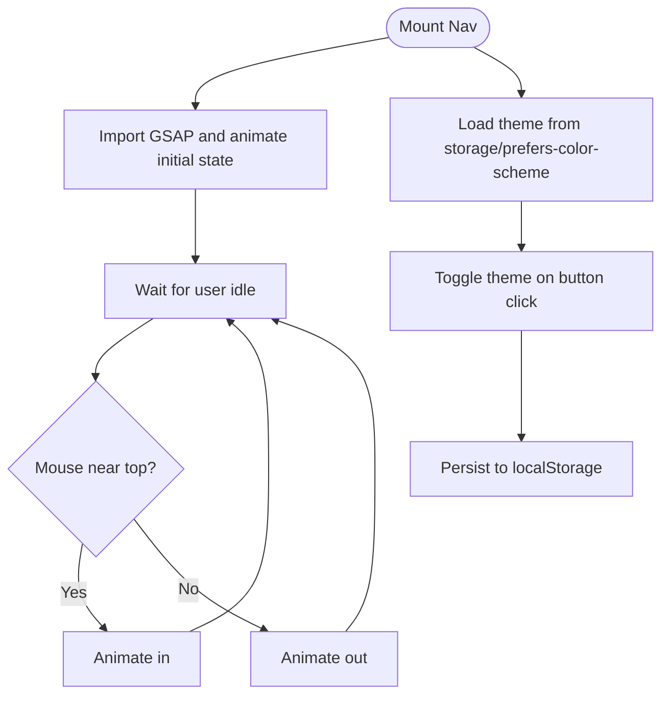
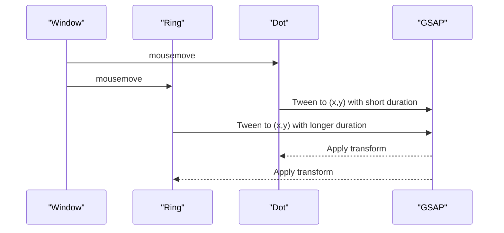
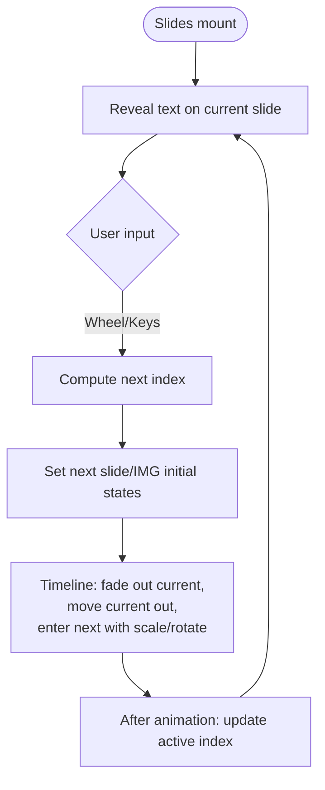
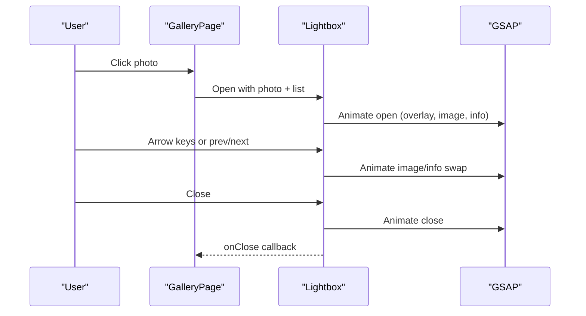
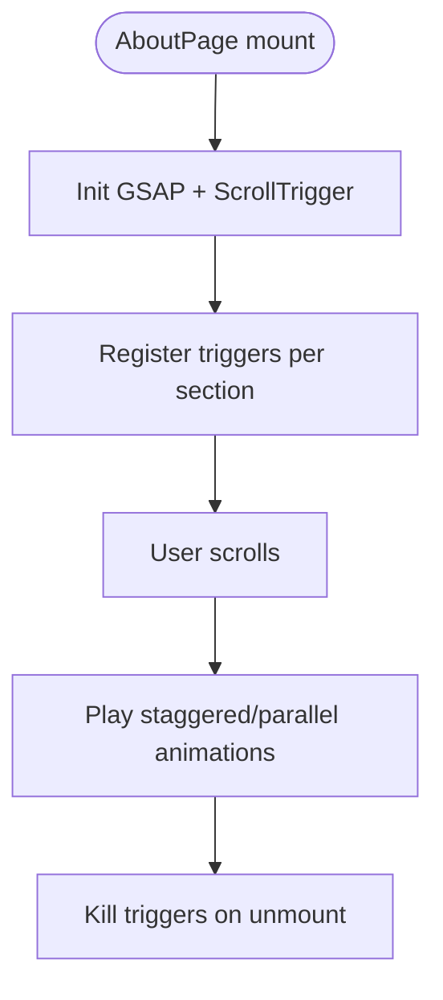
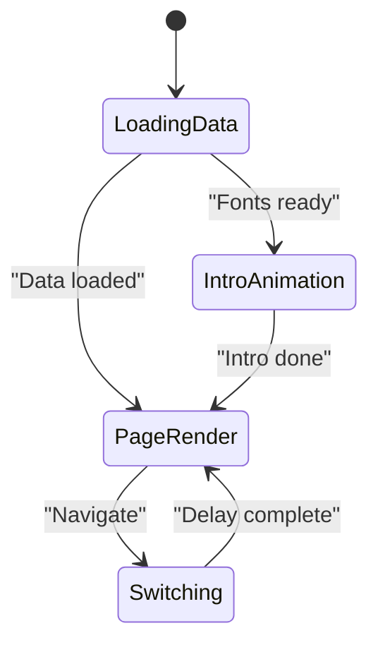
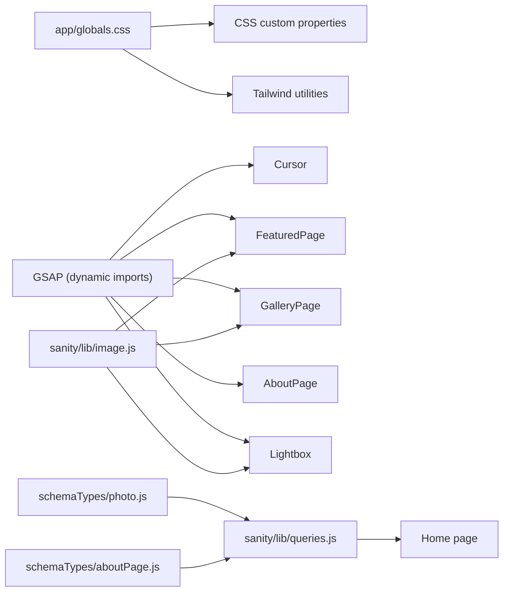

# Frontend Application

<cite>
**Referenced Files in This Document**
- [app/layout.js](file://app/layout.js)
- [app/page.js](file://app/page.js)
- [app/globals.css](file://app/globals.css)
- [app/components/Nav.js](file://app/components/Nav.js)
- [app/components/Cursor.js](file://app/components/Cursor.js)
- [app/components/FeaturedPage.js](file://app/components/FeaturedPage.js)
- [app/components/GalleryPage.js](file://app/components/GalleryPage.js)
- [app/components/AboutPage.js](file://app/components/AboutPage.js)
- [app/components/Lightbox.js](file://app/components/Lightbox.js)
- [sanity/lib/queries.js](file://sanity/lib/queries.js)
- [sanity/lib/image.js](file://sanity/lib/image.js)
- [sanity/schemaTypes/photo.js](file://sanity/schemaTypes/photo.js)
- [sanity/schemaTypes/aboutPage.js](file://sanity/schemaTypes/aboutPage.js)
- [package.json](file://package.json)
- [next.config.mjs](file://next.config.mjs)
</cite>

## Table of Contents
1. [Introduction](#introduction)
2. [Project Structure](#project-structure)
3. [Core Components](#core-components)
4. [Architecture Overview](#architecture-overview)
5. [Detailed Component Analysis](#detailed-component-analysis)
6. [Dependency Analysis](#dependency-analysis)
7. [Performance Considerations](#performance-considerations)
8. [Accessibility Considerations](#accessibility-considerations)
9. [Troubleshooting Guide](#troubleshooting-guide)
10. [Conclusion](#conclusion)

## Introduction
This document explains the Next.js frontend architecture for a photography portfolio. It covers the component-based structure, styling strategy, animation system with GSAP, state management, component communication, lifecycle management, composition patterns, and performance optimizations. Practical usage and customization guidance is included for each major feature area.

## Project Structure
The application follows a Next.js App Router structure with a single-page home route that renders a multipage experience via client-side navigation and dynamic imports. Styling is centralized in global CSS with CSS custom properties and Tailwind CSS integration. Content is managed via Sanity CMS with typed schemas and GROQ queries.

**Diagram sources**
- [app/layout.js:1-40](file://app/layout.js#L1-L40)
- [app/page.js:1-227](file://app/page.js#L1-L227)
- [app/components/Nav.js:1-168](file://app/components/Nav.js#L1-L168)
- [app/components/Cursor.js:1-42](file://app/components/Cursor.js#L1-L42)
- [app/components/FeaturedPage.js:1-269](file://app/components/FeaturedPage.js#L1-L269)
- [app/components/GalleryPage.js:1-760](file://app/components/GalleryPage.js#L1-L760)
- [app/components/AboutPage.js:1-458](file://app/components/AboutPage.js#L1-L458)
- [app/components/Lightbox.js:1-303](file://app/components/Lightbox.js#L1-L303)
- [sanity/lib/queries.js:1-33](file://sanity/lib/queries.js#L1-L33)
- [sanity/lib/image.js:1-9](file://sanity/lib/image.js#L1-L9)
- [sanity/schemaTypes/photo.js:1-93](file://sanity/schemaTypes/photo.js#L1-L93)
- [sanity/schemaTypes/aboutPage.js:1-27](file://sanity/schemaTypes/aboutPage.js#L1-L27)
- [app/globals.css:1-93](file://app/globals.css#L1-L93)
- [package.json:1-31](file://package.json#L1-L31)

**Section sources**
- [app/layout.js:1-40](file://app/layout.js#L1-L40)
- [app/page.js:1-227](file://app/page.js#L1-L227)
- [app/globals.css:1-93](file://app/globals.css#L1-L93)
- [package.json:1-31](file://package.json#L1-L31)

## Core Components
- Navigation Bar: Animated, auto-hiding bar with theme toggle and page links.
- Custom Cursor: Smooth-tracked ring and dot cursor with blend-mode effects.
- Featured Photo Slideshow: Keyboard/mouse wheel-driven slideshow with typographic reveals.
- Gallery Layouts: Hero parallax, horizontal scrolling street cards, masonry grids, portrait cards, and a lightbox viewer.
- About Page: Scroll-triggered reveals, stats counters, and a photo collage.
- Lightbox Viewer: Fullscreen modal with navigation, info panel, and keyboard controls.

**Section sources**
- [app/components/Nav.js:1-168](file://app/components/Nav.js#L1-L168)
- [app/components/Cursor.js:1-42](file://app/components/Cursor.js#L1-L42)
- [app/components/FeaturedPage.js:1-269](file://app/components/FeaturedPage.js#L1-L269)
- [app/components/GalleryPage.js:1-760](file://app/components/GalleryPage.js#L1-L760)
- [app/components/AboutPage.js:1-458](file://app/components/AboutPage.js#L1-L458)
- [app/components/Lightbox.js:1-303](file://app/components/Lightbox.js#L1-L303)

## Architecture Overview
The home page orchestrates state and rendering:
- Loads fonts and global styles.
- Fetches data from Sanity concurrently.
- Renders navigation and cursor.
- Switches pages with a controlled transition.
- Uses dynamic imports to defer heavy page components until client-side.

**Diagram sources**
- [app/page.js:1-227](file://app/page.js#L1-L227)
- [sanity/lib/queries.js:1-33](file://sanity/lib/queries.js#L1-L33)

**Section sources**
- [app/page.js:1-227](file://app/page.js#L1-L227)

## Detailed Component Analysis

### Navigation System
- Auto-hide on idle with GSAP-driven entrance/exit.
- Theme persistence and toggle using localStorage and prefers-color-scheme.
- Links trigger page transitions with a 400ms switch delay to coordinate animations.

**Diagram sources**
- [app/components/Nav.js:1-168](file://app/components/Nav.js#L1-L168)

**Section sources**
- [app/components/Nav.js:1-168](file://app/components/Nav.js#L1-L168)

### Custom Cursor Effects
- Two layered elements: a small dot and a larger ring.
- GSAP animates positions with different easing and delays for trailing effect.
- Mix-blend-mode difference for contrast across themes.

**Diagram sources**
- [app/components/Cursor.js:1-42](file://app/components/Cursor.js#L1-L42)

**Section sources**
- [app/components/Cursor.js:1-42](file://app/components/Cursor.js#L1-L42)

### Featured Photo Slideshow
- Keyboard and wheel navigation with debouncing.
- Per-slide text lines, caption, writeup, and metadata revealed with staggered timelines.
- Cross-fade transforms with scaling and rotation for smooth transitions.

**Diagram sources**
- [app/components/FeaturedPage.js:1-269](file://app/components/FeaturedPage.js#L1-L269)

**Section sources**
- [app/components/FeaturedPage.js:1-269](file://app/components/FeaturedPage.js#L1-L269)

### Gallery Layouts and Lightbox Viewer
- Hero section with character-split text reveal and parallax overlays.
- Horizontal track for street photos with magnetic hover effects and pinning.
- Masonry grids for rural and landscape with staggered reveals.
- Portrait cards with wide aspect ratios and gradient overlays.
- Lightbox modal with open/close animations, keyboard navigation, and info panel.

**Diagram sources**
- [app/components/GalleryPage.js:1-760](file://app/components/GalleryPage.js#L1-L760)
- [app/components/Lightbox.js:1-303](file://app/components/Lightbox.js#L1-L303)

**Section sources**
- [app/components/GalleryPage.js:1-760](file://app/components/GalleryPage.js#L1-L760)
- [app/components/Lightbox.js:1-303](file://app/components/Lightbox.js#L1-L303)

### About Page
- Scroll-triggered reveals for hero lines, bio words, stats counters, philosophy quote, divider lines, approach items, and collage images.
- Magnetic buttons for subtle hover transforms.
- Parallax hero image and clipped entrance.

**Diagram sources**
- [app/components/AboutPage.js:1-458](file://app/components/AboutPage.js#L1-L458)

**Section sources**
- [app/components/AboutPage.js:1-458](file://app/components/AboutPage.js#L1-L458)

### State Management and Lifecycle
- Home page manages active page, switching flag, and data loading states.
- Page transitions use a simple opacity/transform fade coordinated with a clip-path reveal.
- Dynamic imports defer rendering of heavy pages to the client.

**Diagram sources**
- [app/page.js:1-227](file://app/page.js#L1-L227)
- [app/globals.css:65-83](file://app/globals.css#L65-L83)

**Section sources**
- [app/page.js:1-227](file://app/page.js#L1-L227)
- [app/globals.css:65-83](file://app/globals.css#L65-L83)

## Dependency Analysis
- Styling: Tailwind CSS imported at root; CSS custom properties define theme tokens and typography families. Scrollbar styling and reduced-motion handling are applied globally.
- Animation: GSAP is dynamically imported per component where needed (cursor, slideshow, gallery, about, lightbox). ScrollTrigger is registered conditionally in gallery and about.
- Data: Sanity client is used to fetch typed content via GROQ queries. Image URLs are generated with a helper wrapping @sanity/image-url.
- Routing: Next.js dynamic imports are used for page components to optimize initial load.

**Diagram sources**
- [app/globals.css:1-93](file://app/globals.css#L1-L93)
- [app/components/Cursor.js:1-42](file://app/components/Cursor.js#L1-L42)
- [app/components/FeaturedPage.js:1-269](file://app/components/FeaturedPage.js#L1-L269)
- [app/components/GalleryPage.js:1-760](file://app/components/GalleryPage.js#L1-L760)
- [app/components/AboutPage.js:1-458](file://app/components/AboutPage.js#L1-L458)
- [app/components/Lightbox.js:1-303](file://app/components/Lightbox.js#L1-L303)
- [sanity/lib/queries.js:1-33](file://sanity/lib/queries.js#L1-L33)
- [sanity/lib/image.js:1-9](file://sanity/lib/image.js#L1-L9)
- [sanity/schemaTypes/photo.js:1-93](file://sanity/schemaTypes/photo.js#L1-L93)
- [sanity/schemaTypes/aboutPage.js:1-27](file://sanity/schemaTypes/aboutPage.js#L1-L27)

**Section sources**
- [app/globals.css:1-93](file://app/globals.css#L1-L93)
- [package.json:11-22](file://package.json#L11-L22)
- [sanity/lib/queries.js:1-33](file://sanity/lib/queries.js#L1-L33)
- [sanity/lib/image.js:1-9](file://sanity/lib/image.js#L1-L9)
- [sanity/schemaTypes/photo.js:1-93](file://sanity/schemaTypes/photo.js#L1-L93)
- [sanity/schemaTypes/aboutPage.js:1-27](file://sanity/schemaTypes/aboutPage.js#L1-L27)

## Performance Considerations
- Lazy loading and code splitting:
  - Dynamic imports for page components prevent loading unnecessary bundles on the home route.
  - GSAP plugins are imported on demand within components that require them.
- Image optimization:
  - Sanity image URL builder applies width and quality transformations per component.
  - Use appropriate widths for hero vs. grid contexts to balance quality and bandwidth.
- Animation performance:
  - GSAP tweens use transform and opacity for GPU-accelerated updates.
  - Reduced-motion media query disables animations for accessibility.
- Scroll performance:
  - ScrollTrigger is killed on unmount to avoid memory leaks.
  - Pinning and scrubbing are scoped to relevant sections.

[No sources needed since this section provides general guidance]

## Accessibility Considerations
- Reduced motion: Global reduced-motion handling disables page-clip animation.
- Keyboard navigation:
  - Featured slideshow supports arrow keys and mouse wheel.
  - Lightbox supports Escape, ArrowLeft, ArrowRight.
- Focus and semantics:
  - Buttons use native button elements with aria labels where applicable.
  - Ensure focus styles remain visible and predictable.
- Color contrast:
  - Theme toggles switch between dark and light palettes; verify contrast thresholds across both modes.

[No sources needed since this section provides general guidance]

## Troubleshooting Guide
- Fonts not rendering during intro:
  - The home page waits for font loading before animating the intro text.
- Scroll-trigger not firing:
  - Ensure the container element exists and ScrollTrigger is initialized after DOM is ready.
- Lightbox not closing:
  - Verify overlay click handler and Escape key listener are attached.
- Dynamic imports failing:
  - Confirm SSR is disabled for components that rely on browser APIs.

**Section sources**
- [app/page.js:30-101](file://app/page.js#L30-L101)
- [app/components/GalleryPage.js:215-220](file://app/components/GalleryPage.js#L215-L220)
- [app/components/Lightbox.js:54-62](file://app/components/Lightbox.js#L54-L62)

## Conclusion
This frontend combines a modular component architecture with a cohesive design system powered by CSS custom properties and Tailwind utilities. GSAP enables polished micro-interactions and scroll-driven experiences, while dynamic imports and image transformations optimize performance. The Sanity integration ensures structured content and scalable editing. Together, these patterns deliver a visually rich, accessible, and maintainable photography portfolio.