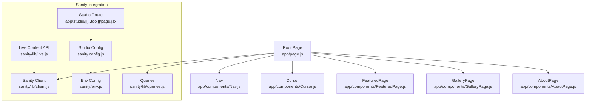
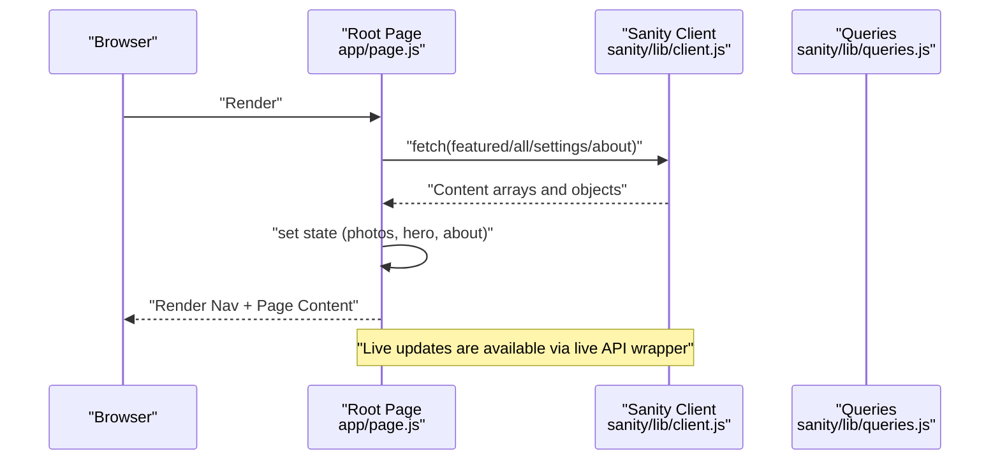
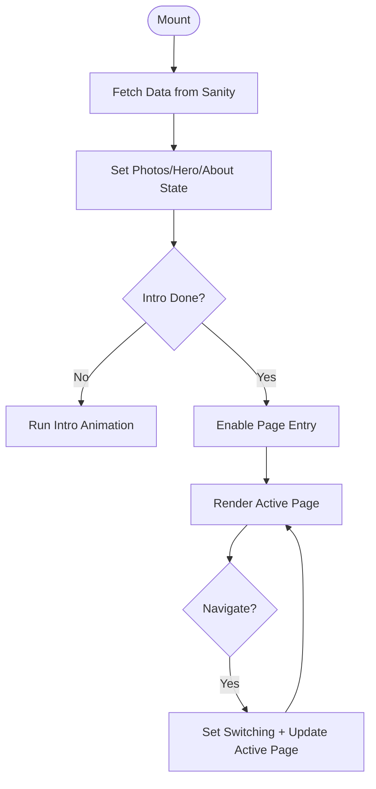
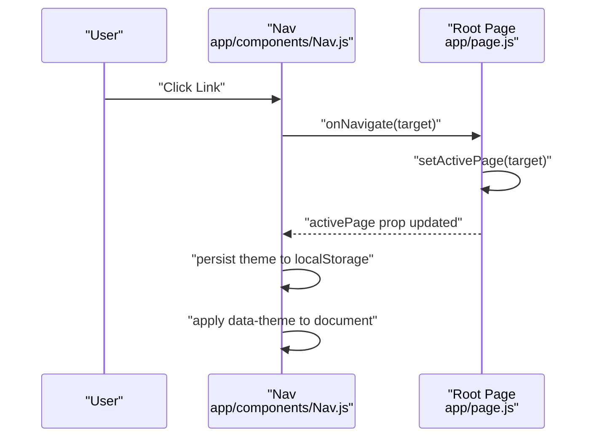
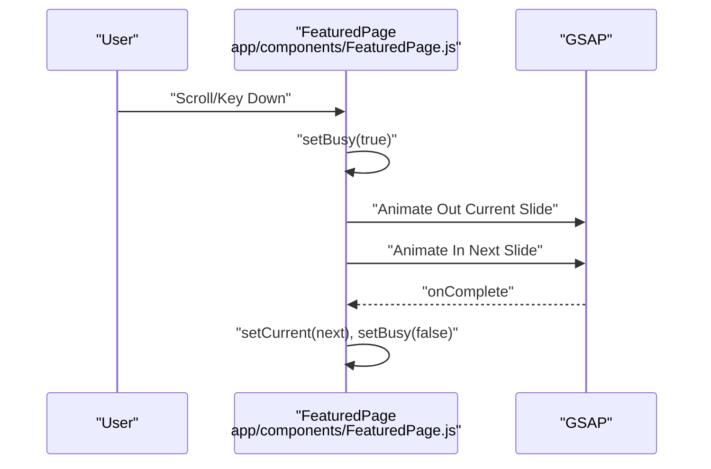
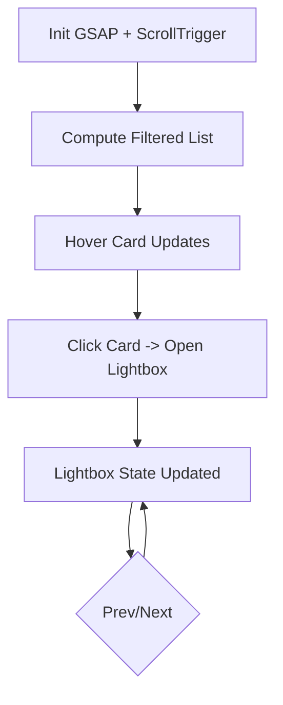
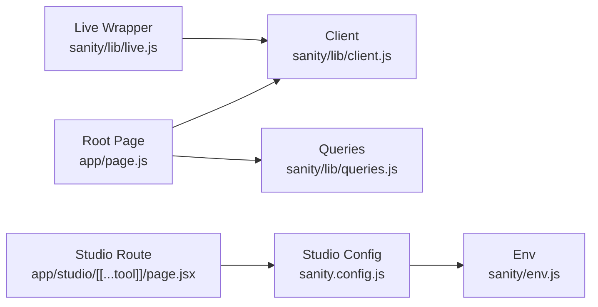
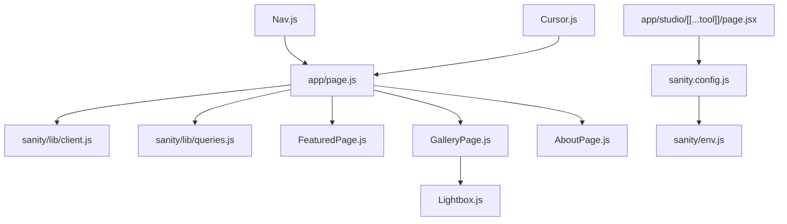

# State Management

<cite>
**Referenced Files in This Document**
- [app/page.js](file://app/page.js)
- [app/layout.js](file://app/layout.js)
- [app/components/Nav.js](file://app/components/Nav.js)
- [app/components/FeaturedPage.js](file://app/components/FeaturedPage.js)
- [app/components/GalleryPage.js](file://app/components/GalleryPage.js)
- [app/components/AboutPage.js](file://app/components/AboutPage.js)
- [app/components/Lightbox.js](file://app/components/Lightbox.js)
- [app/components/Cursor.js](file://app/components/Cursor.js)
- [sanity/lib/client.js](file://sanity/lib/client.js)
- [sanity/lib/live.js](file://sanity/lib/live.js)
- [sanity/lib/queries.js](file://sanity/lib/queries.js)
- [sanity/config.js](file://sanity.config.js)
- [sanity/env.js](file://sanity/env.js)
- [app/studio/[[...tool]]/page.jsx](file://app/studio/[[...tool]]/page.jsx)
</cite>

## Table of Contents
1. [Introduction](#introduction)
2. [Project Structure](#project-structure)
3. [Core Components](#core-components)
4. [Architecture Overview](#architecture-overview)
5. [Detailed Component Analysis](#detailed-component-analysis)
6. [Dependency Analysis](#dependency-analysis)
7. [Performance Considerations](#performance-considerations)
8. [Troubleshooting Guide](#troubleshooting-guide)
9. [Conclusion](#conclusion)

## Introduction
This document explains the state management architecture of the Next.js application. It covers how component state is organized across active page tracking, photo selection, theme switching, and navigation. It documents the integration with Sanity CMS for real-time content updates and live preview, the synchronization between client-side components and server-side rendering, and the patterns used for context providers, state lifting, and component communication. It also outlines persistence strategies, session management, caching, performance optimizations, and best practices for maintaining state consistency.

## Project Structure
The application follows a Next.js App Router structure with a single-page shell that orchestrates page-level components. State is primarily managed via React hooks in the root page and passed down to child components. Sanity is integrated for content fetching and live updates, with a dedicated Studio route.

**Diagram sources**
- [app/page.js:14-227](file://app/page.js#L14-L227)
- [app/components/Nav.js:4-168](file://app/components/Nav.js#L4-L168)
- [app/components/Cursor.js:5-42](file://app/components/Cursor.js#L5-L42)
- [app/components/FeaturedPage.js:6-269](file://app/components/FeaturedPage.js#L6-L269)
- [app/components/GalleryPage.js:6-760](file://app/components/GalleryPage.js#L6-L760)
- [app/components/AboutPage.js:5-458](file://app/components/AboutPage.js#L5-L458)
- [sanity/lib/client.js:1-10](file://sanity/lib/client.js#L1-L10)
- [sanity/lib/live.js:1-10](file://sanity/lib/live.js#L1-L10)
- [sanity/lib/queries.js:1-33](file://sanity/lib/queries.js#L1-L33)
- [sanity/env.js:1-6](file://sanity/env.js#L1-L6)
- [app/studio/[[...tool]]/page.jsx:1-9](file://app/studio/[[...tool]]/page.jsx#L1-L9)
- [sanity.config.js:1-29](file://sanity.config.js#L1-L29)

**Section sources**
- [app/page.js:14-227](file://app/page.js#L14-L227)
- [app/layout.js:1-40](file://app/layout.js#L1-L40)

## Core Components
- Root page orchestrates:
  - Active page state and transitions
  - Data loading from Sanity
  - Intro animation lifecycle
  - Navigation state and page switching
- Nav manages:
  - Theme switching and persistence
  - Animated navigation bar behavior
- FeaturedPage manages:
  - Photo carousel state and transitions
- GalleryPage manages:
  - Filter state, hover state, and lightbox state
- AboutPage manages:
  - Scroll-triggered animations and interactions
- Lightbox manages:
  - Modal state and navigation
- Cursor provides:
  - Pointer behavior for UX

**Section sources**
- [app/page.js:14-227](file://app/page.js#L14-L227)
- [app/components/Nav.js:4-168](file://app/components/Nav.js#L4-L168)
- [app/components/FeaturedPage.js:6-269](file://app/components/FeaturedPage.js#L6-L269)
- [app/components/GalleryPage.js:6-760](file://app/components/GalleryPage.js#L6-L760)
- [app/components/AboutPage.js:5-458](file://app/components/AboutPage.js#L5-L458)
- [app/components/Lightbox.js:5-303](file://app/components/Lightbox.js#L5-L303)
- [app/components/Cursor.js:5-42](file://app/components/Cursor.js#L5-L42)

## Architecture Overview
The state architecture is centralized in the root page with controlled prop drilling and local component state. Sanity is accessed via a dedicated client configured for fresh data. Live content updates are enabled through a live content API wrapper. The Studio route mounts the Sanity Studio for content editing.

**Diagram sources**
- [app/page.js:106-131](file://app/page.js#L106-L131)
- [sanity/lib/client.js:1-10](file://sanity/lib/client.js#L1-L10)
- [sanity/lib/queries.js:1-33](file://sanity/lib/queries.js#L1-L33)

## Detailed Component Analysis

### Root Page State Management
- Active page tracking: state tracks the currently visible page and a switching flag to coordinate transitions.
- Data loading: fetches multiple datasets concurrently and sets state for featured photos, all photos, gallery hero, and about images.
- Intro animation lifecycle: controls initial loading and animation completion before enabling page entry.
- Navigation: exposes a navigate function that updates active page with a transition delay.

**Diagram sources**
- [app/page.js:14-227](file://app/page.js#L14-L227)

**Section sources**
- [app/page.js:14-227](file://app/page.js#L14-L227)

### Navigation and Theme State
- Nav receives activePage and onNavigate from the root and maintains its own theme state.
- Theme persistence: reads localStorage and prefers-color-scheme media query to initialize theme, toggles and persists to localStorage, and applies a data-theme attribute to the document element.
- Navigation links update activePage via the callback, triggering page transitions in the root.

**Diagram sources**
- [app/components/Nav.js:4-168](file://app/components/Nav.js#L4-L168)
- [app/page.js:136-145](file://app/page.js#L136-L145)

**Section sources**
- [app/components/Nav.js:4-168](file://app/components/Nav.js#L4-L168)

### Photo Selection and Carousel State
- FeaturedPage maintains:
  - Current index for the active slide
  - Busy flag to prevent concurrent transitions
  - Refs to slides and images for DOM manipulation
- Transitions use GSAP timelines to animate out the current slide and animate in the next, updating state after completion.

**Diagram sources**
- [app/components/FeaturedPage.js:56-105](file://app/components/FeaturedPage.js#L56-L105)

**Section sources**
- [app/components/FeaturedPage.js:6-269](file://app/components/FeaturedPage.js#L6-L269)

### Gallery State, Filtering, and Lightbox
- GalleryPage maintains:
  - activeFilter for series filtering
  - hoveredCard for hover effects
  - lightboxPhoto and lightboxList for modal state
- Filtering is computed from props and activeFilter.
- Lightbox state is coordinated via callbacks for open/close and navigation.

**Diagram sources**
- [app/components/GalleryPage.js:6-760](file://app/components/GalleryPage.js#L6-L760)
- [app/components/Lightbox.js:5-303](file://app/components/Lightbox.js#L5-L303)

**Section sources**
- [app/components/GalleryPage.js:6-760](file://app/components/GalleryPage.js#L6-L760)
- [app/components/Lightbox.js:5-303](file://app/components/Lightbox.js#L5-L303)

### About Page State and Scroll Interactions
- AboutPage initializes scroll-triggered animations and does not maintain persistent state beyond initialization.
- Interaction handlers (buttons) call back into parent navigation.

**Section sources**
- [app/components/AboutPage.js:5-458](file://app/components/AboutPage.js#L5-L458)

### Cursor State
- Cursor updates absolute positions via mousemove events and animates with GSAP for smooth motion.

**Section sources**
- [app/components/Cursor.js:5-42](file://app/components/Cursor.js#L5-L42)

### Sanity Integration and Live Content
- Client configuration disables CDN for fresh data.
- Live content API wrapper enables automatic updates when rendered within the app layout.
- Queries encapsulate GROQ for featured photos, all photos, gallery hero, and about page content.

**Diagram sources**
- [sanity/lib/client.js:1-10](file://sanity/lib/client.js#L1-L10)
- [sanity/lib/live.js:1-10](file://sanity/lib/live.js#L1-L10)
- [sanity/lib/queries.js:1-33](file://sanity/lib/queries.js#L1-L33)
- [sanity.config.js:1-29](file://sanity.config.js#L1-L29)
- [sanity/env.js:1-6](file://sanity/env.js#L1-L6)
- [app/studio/[[...tool]]/page.jsx:1-9](file://app/studio/[[...tool]]/page.jsx#L1-L9)

**Section sources**
- [sanity/lib/client.js:1-10](file://sanity/lib/client.js#L1-L10)
- [sanity/lib/live.js:1-10](file://sanity/lib/live.js#L1-L10)
- [sanity/lib/queries.js:1-33](file://sanity/lib/queries.js#L1-L33)
- [sanity.config.js:1-29](file://sanity.config.js#L1-L29)
- [sanity/env.js:1-6](file://sanity/env.js#L1-L6)
- [app/studio/[[...tool]]/page.jsx:1-9](file://app/studio/[[...tool]]/page.jsx#L1-L9)

## Dependency Analysis
- Root depends on:
  - Sanity client and queries for data
  - Dynamic imports for page components to disable SSR where needed
- Nav depends on:
  - Local storage and media query for theme initialization
  - GSAP for animations
- GalleryPage depends on:
  - Sanity image URLs and GSAP/ScrollTrigger for animations
- Lightbox depends on:
  - Sanity image URLs and GSAP for modal animations
- Studio depends on:
  - Sanity Studio configuration and environment variables

**Diagram sources**
- [app/page.js:14-227](file://app/page.js#L14-L227)
- [app/components/Nav.js:4-168](file://app/components/Nav.js#L4-L168)
- [app/components/Cursor.js:5-42](file://app/components/Cursor.js#L5-L42)
- [app/components/GalleryPage.js:6-760](file://app/components/GalleryPage.js#L6-L760)
- [app/components/Lightbox.js:5-303](file://app/components/Lightbox.js#L5-L303)
- [app/studio/[[...tool]]/page.jsx:1-9](file://app/studio/[[...tool]]/page.jsx#L1-L9)
- [sanity.config.js:1-29](file://sanity.config.js#L1-L29)
- [sanity/env.js:1-6](file://sanity/env.js#L1-L6)

**Section sources**
- [app/page.js:14-227](file://app/page.js#L14-L227)
- [app/components/Nav.js:4-168](file://app/components/Nav.js#L4-L168)
- [app/components/GalleryPage.js:6-760](file://app/components/GalleryPage.js#L6-L760)
- [app/components/Lightbox.js:5-303](file://app/components/Lightbox.js#L5-L303)
- [app/studio/[[...tool]]/page.jsx:1-9](file://app/studio/[[...tool]]/page.jsx#L1-L9)
- [sanity.config.js:1-29](file://sanity.config.js#L1-L29)
- [sanity/env.js:1-6](file://sanity/env.js#L1-L6)

## Performance Considerations
- Memoization and stable references:
  - Use refs for DOM nodes and callbacks to avoid recreating functions on every render.
  - Keep filtered lists derived from props stable by computing them once per relevant prop change.
- Avoid unnecessary re-renders:
  - Split concerns into smaller components with focused responsibilities.
  - Prefer passing only required props to child components.
- Animation performance:
  - Use transform and opacity for animations; avoid layout thrashing.
  - Use GSAP’s overwrite behavior and timeline composition to minimize redundant tweens.
- Data fetching:
  - Fetch related content in parallel to reduce total load time.
  - Disable CDN for fresh content during development; evaluate CDN usage in production based on freshness needs.
- Scroll-triggered animations:
  - Register plugins conditionally and kill triggers on unmount to prevent memory leaks.
- Rendering:
  - Defer heavy animations until after initial hydration and data load.
  - Use dynamic imports for page components where SSR is not required.

[No sources needed since this section provides general guidance]

## Troubleshooting Guide
- Navigation not switching pages:
  - Verify activePage and switching flags are correctly updated and that navigate guards against redundant transitions.
- Theme not persisting:
  - Confirm localStorage key exists and matches the expected value; ensure data-theme attribute is applied to the document element.
- Lightbox not opening/closing:
  - Ensure lightboxPhoto is truthy and that open/close callbacks are invoked with correct arguments.
- Scroll-trigger animations not firing:
  - Confirm plugin registration and that containers are present; refresh triggers after dynamic content is injected.
- Sanity data stale:
  - Check client configuration for CDN usage and environment variables; confirm queries return expected shapes.
- Live preview not updating:
  - Ensure the live wrapper is used and rendered within the app layout; verify Studio is reachable at the configured base path.

**Section sources**
- [app/page.js:136-145](file://app/page.js#L136-L145)
- [app/components/Nav.js:70-83](file://app/components/Nav.js#L70-L83)
- [app/components/GalleryPage.js:17-37](file://app/components/GalleryPage.js#L17-L37)
- [app/components/Lightbox.js:79-90](file://app/components/Lightbox.js#L79-L90)
- [sanity/lib/client.js:1-10](file://sanity/lib/client.js#L1-L10)
- [sanity/lib/live.js:1-10](file://sanity/lib/live.js#L1-L10)

## Conclusion
The application employs a straightforward, React-focused state management model centered in the root page with targeted local state in specialized components. Navigation, theme, photo selection, and lightbox interactions are handled with minimal external libraries, prioritizing performance and clarity. Sanity integration is cleanly separated, with a dedicated client and live content wrapper enabling real-time updates. By adhering to the patterns outlined—prop drilling, local state, stable references, and careful animation lifecycle—the system remains maintainable and responsive.