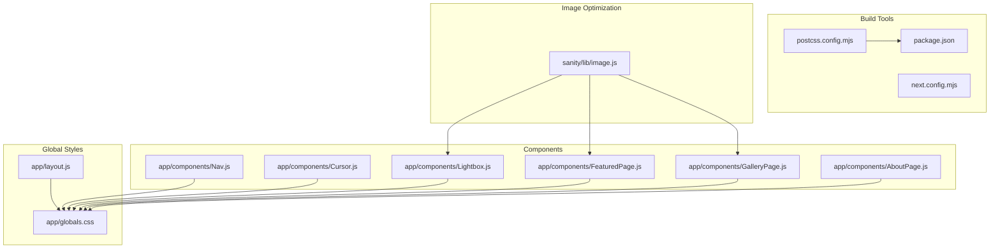
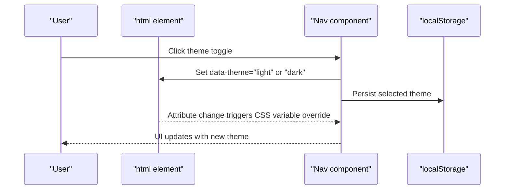
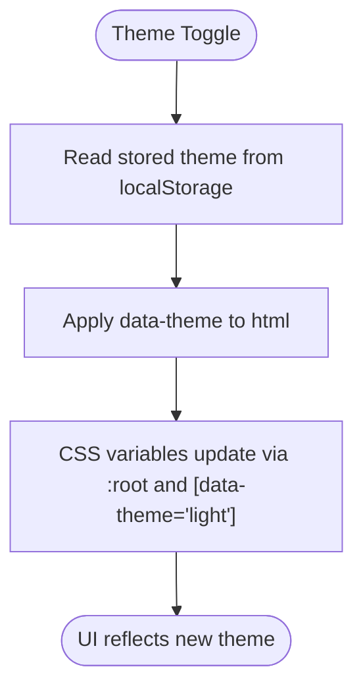
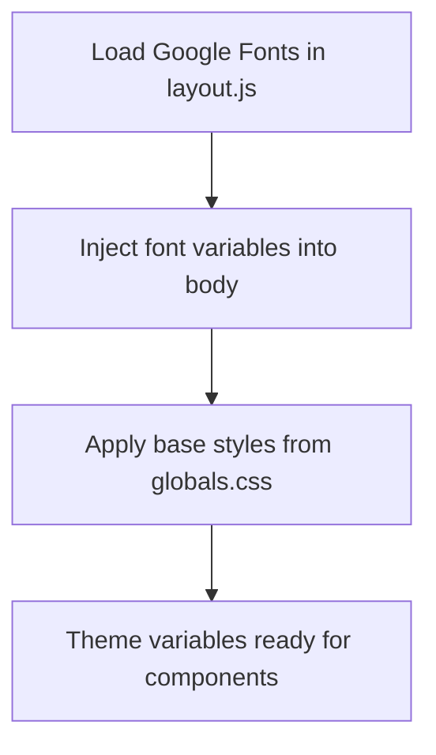
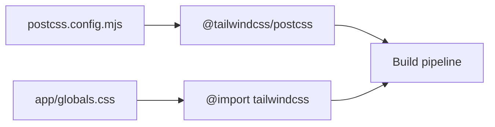
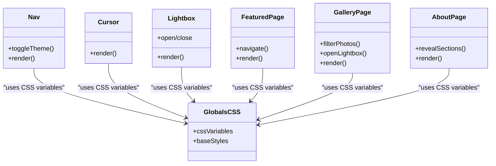
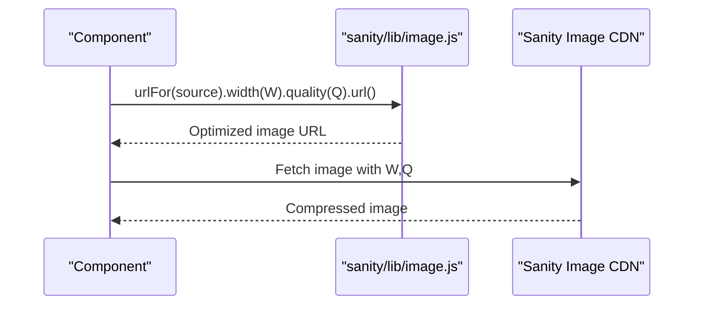
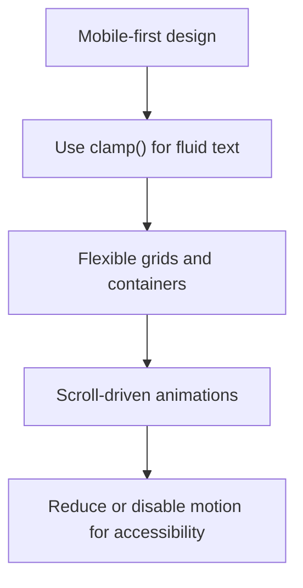
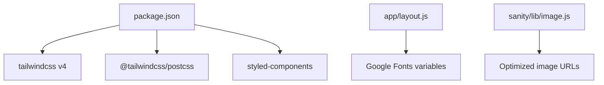

# Styling System

<cite>
**Referenced Files in This Document**
- [app/globals.css](file://app/globals.css)
- [app/layout.js](file://app/layout.js)
- [app/components/Nav.js](file://app/components/Nav.js)
- [app/components/Cursor.js](file://app/components/Cursor.js)
- [app/components/Lightbox.js](file://app/components/Lightbox.js)
- [app/components/FeaturedPage.js](file://app/components/FeaturedPage.js)
- [app/components/GalleryPage.js](file://app/components/GalleryPage.js)
- [app/components/AboutPage.js](file://app/components/AboutPage.js)
- [sanity/lib/image.js](file://sanity/lib/image.js)
- [postcss.config.mjs](file://postcss.config.mjs)
- [package.json](file://package.json)
- [next.config.mjs](file://next.config.mjs)
</cite>

## Table of Contents
1. [Introduction](#introduction)
2. [Project Structure](#project-structure)
3. [Core Components](#core-components)
4. [Architecture Overview](#architecture-overview)
5. [Detailed Component Analysis](#detailed-component-analysis)
6. [Dependency Analysis](#dependency-analysis)
7. [Performance Considerations](#performance-considerations)
8. [Troubleshooting Guide](#troubleshooting-guide)
9. [Conclusion](#conclusion)

## Introduction
This document explains the styling system of the Next.js application, focusing on the CSS custom properties architecture for theming, dark/light mode switching, and color scheme management. It documents the integration with Tailwind CSS 4 for utility-first styling and responsive design patterns, the global styling approach in globals.css, the image optimization pipeline via Sanity’s image URL builder, and the responsive design strategy. It also covers CSS-in-JS considerations, component-specific styling patterns, and performance optimization techniques such as critical CSS, CSS minification, and asset optimization. Practical examples demonstrate theme customization, responsive breakpoints, and styling best practices.

## Project Structure
The styling system spans global styles, font loading, component-level styles, and image optimization utilities:
- Global CSS defines CSS custom properties, base styles, and theme variants.
- Font loading is handled in the root layout using Next.js Google Fonts integration.
- Components apply styles using CSS custom properties and inline styles.
- Tailwind CSS 4 is integrated via PostCSS.
- Image optimization is provided by Sanity’s image URL builder.

**Diagram sources**
- [app/globals.css:1-93](file://app/globals.css#L1-L93)
- [app/layout.js:1-40](file://app/layout.js#L1-L40)
- [postcss.config.mjs:1-8](file://postcss.config.mjs#L1-L8)
- [package.json:1-31](file://package.json#L1-L31)
- [sanity/lib/image.js:1-8](file://sanity/lib/image.js#L1-L8)

**Section sources**
- [app/globals.css:1-93](file://app/globals.css#L1-L93)
- [app/layout.js:1-40](file://app/layout.js#L1-L40)
- [postcss.config.mjs:1-8](file://postcss.config.mjs#L1-L8)
- [package.json:1-31](file://package.json#L1-L31)

## Core Components
- CSS custom properties architecture: Centralized theme tokens in :root and [data-theme="light"] variants. These drive color, typography, and contrast values across the app.
- Dark/light mode switching: Controlled via data attributes on html and persisted in localStorage. Theme preference respects user’s OS setting.
- Tailwind CSS 4 integration: Tailwind is imported in globals.css and processed by PostCSS with @tailwindcss/postcss.
- Global base styles: Normalize-like resets, font smoothing, scrollbar styling, and page transitions.
- Component-specific styling: Components use CSS custom properties and inline styles for dynamic effects and animations.
- Image optimization: Sanity’s urlFor builder generates optimized URLs with width and quality parameters.

**Section sources**
- [app/globals.css:5-49](file://app/globals.css#L5-L49)
- [app/layout.js:1-40](file://app/layout.js#L1-L40)
- [app/components/Nav.js:70-83](file://app/components/Nav.js#L70-L83)
- [postcss.config.mjs:1-8](file://postcss.config.mjs#L1-L8)
- [sanity/lib/image.js:1-8](file://sanity/lib/image.js#L1-L8)

## Architecture Overview
The styling architecture combines:
- A single source of truth for theme tokens via CSS custom properties.
- A theme switcher that toggles a data attribute on html, enabling seamless light/dark variant overrides.
- Utility-first styling with Tailwind CSS 4 for rapid layout and responsive helpers.
- Component-level inline styles leveraging CSS variables for dynamic theming and motion.
- Optimized image delivery through Sanity’s image URL builder.

**Diagram sources**
- [app/components/Nav.js:78-83](file://app/components/Nav.js#L78-L83)
- [app/globals.css:30-49](file://app/globals.css#L30-L49)

## Detailed Component Analysis

### Theming and Color Scheme Management
- CSS custom properties define semantic tokens for colors, borders, panels, overlays, and typography families.
- :root sets the default dark theme; [data-theme="light"] overrides tokens for light mode.
- color-scheme is set to dark by default and switches to light when the light theme is active.
- Components read values from CSS variables to maintain consistent theming.

**Diagram sources**
- [app/components/Nav.js:70-83](file://app/components/Nav.js#L70-L83)
- [app/globals.css:5-49](file://app/globals.css#L5-L49)

**Section sources**
- [app/globals.css:5-49](file://app/globals.css#L5-L49)
- [app/components/Nav.js:70-83](file://app/components/Nav.js#L70-L83)

### Global Base Styles and Typography
- Reset and normalize styles for margins, padding, and box sizing.
- Font loading via Next.js Google Fonts with variable class injection into body.
- Body styles include background, color, font family, and motion preferences handling.
- Scrollbar styling uses CSS variables for consistent theming.
- Page transitions and animation helpers for entrance effects.

**Diagram sources**
- [app/layout.js:1-40](file://app/layout.js#L1-L40)
- [app/globals.css:51-92](file://app/globals.css#L51-L92)

**Section sources**
- [app/layout.js:1-40](file://app/layout.js#L1-L40)
- [app/globals.css:3-92](file://app/globals.css#L3-L92)

### Tailwind CSS 4 Integration
- Tailwind is imported in globals.css to enable utility classes.
- PostCSS configuration includes @tailwindcss/postcss plugin.
- The project depends on tailwindcss v4 and @tailwindcss/postcss.

**Diagram sources**
- [app/globals.css:1-1](file://app/globals.css#L1-L1)
- [postcss.config.mjs:1-8](file://postcss.config.mjs#L1-L8)
- [package.json:24-27](file://package.json#L24-L27)

**Section sources**
- [app/globals.css:1-1](file://app/globals.css#L1-L1)
- [postcss.config.mjs:1-8](file://postcss.config.mjs#L1-L8)
- [package.json:24-27](file://package.json#L24-L27)

### Component-Level Styling Patterns
- Navigation: Uses CSS variables for colors and typography; includes animated theme toggle icon.
- Cursor: Renders overlay elements with CSS variables and GSAP-driven motion.
- Lightbox: Full-screen modal with CSS variables for backgrounds, borders, and overlays; integrates GSAP animations.
- Featured Page: Hero slider with CSS variables for on-image text and gradients; keyboard and wheel navigation.
- Gallery Page: Responsive masonry and horizontal scrolling with CSS variables; filter bar and lightbox integration.
- About Page: Scroll-driven reveals with CSS variables for typography and backgrounds.

**Diagram sources**
- [app/components/Nav.js:1-168](file://app/components/Nav.js#L1-L168)
- [app/components/Cursor.js:1-42](file://app/components/Cursor.js#L1-L42)
- [app/components/Lightbox.js:1-303](file://app/components/Lightbox.js#L1-L303)
- [app/components/FeaturedPage.js:1-269](file://app/components/FeaturedPage.js#L1-L269)
- [app/components/GalleryPage.js:1-760](file://app/components/GalleryPage.js#L1-L760)
- [app/components/AboutPage.js:1-458](file://app/components/AboutPage.js#L1-L458)
- [app/globals.css:5-92](file://app/globals.css#L5-L92)

**Section sources**
- [app/components/Nav.js:93-167](file://app/components/Nav.js#L93-L167)
- [app/components/Cursor.js:25-38](file://app/components/Cursor.js#L25-L38)
- [app/components/Lightbox.js:98-178](file://app/components/Lightbox.js#L98-L178)
- [app/components/FeaturedPage.js:120-218](file://app/components/FeaturedPage.js#L120-L218)
- [app/components/GalleryPage.js:236-737](file://app/components/GalleryPage.js#L236-L737)
- [app/components/AboutPage.js:199-454](file://app/components/AboutPage.js#L199-L454)

### Image Optimization and CDN Integration
- Sanity’s urlFor builder constructs optimized image URLs with width and quality parameters.
- Components pass image assets to urlFor to generate production-ready URLs.
- This ensures responsive sizing and compression for performance.

**Diagram sources**
- [sanity/lib/image.js:1-8](file://sanity/lib/image.js#L1-L8)
- [app/components/Lightbox.js:159-168](file://app/components/Lightbox.js#L159-L168)
- [app/components/FeaturedPage.js:136-136](file://app/components/FeaturedPage.js#L136-L136)
- [app/components/GalleryPage.js:386-386](file://app/components/GalleryPage.js#L386-L386)

**Section sources**
- [sanity/lib/image.js:1-8](file://sanity/lib/image.js#L1-L8)
- [app/components/Lightbox.js:159-168](file://app/components/Lightbox.js#L159-L168)
- [app/components/FeaturedPage.js:136-136](file://app/components/FeaturedPage.js#L136-L136)
- [app/components/GalleryPage.js:386-386](file://app/components/GalleryPage.js#L386-L386)

### Responsive Design and Breakpoints
- Mobile-first approach: Components use clamp() for fluid typography and percentage-based layouts.
- Horizontal scrolling sections adapt to viewport width; masonry grids adjust columns based on available space.
- Scroll-driven animations rely on ScrollTrigger; responsive behavior can be extended with matchMedia for advanced breakpoints.
- Reduced motion support: prefers-reduced-motion reduces or disables animations.

**Diagram sources**
- [app/components/FeaturedPage.js:176-206](file://app/components/FeaturedPage.js#L176-L206)
- [app/components/GalleryPage.js:474-529](file://app/components/GalleryPage.js#L474-L529)
- [app/globals.css:81-83](file://app/globals.css#L81-L83)

**Section sources**
- [app/components/FeaturedPage.js:176-206](file://app/components/FeaturedPage.js#L176-L206)
- [app/components/GalleryPage.js:474-529](file://app/components/GalleryPage.js#L474-L529)
- [app/globals.css:81-83](file://app/globals.css#L81-L83)

### CSS-in-JS and Styled Components Considerations
- Inline styles dominate component styling, leveraging CSS variables for theme consistency.
- styled-components is present in dependencies; however, no styled-components usage is observed in the analyzed files.
- For future expansion, styled-components can coexist with CSS variables and Tailwind utilities while maintaining a consistent design system.

**Section sources**
- [package.json:21-21](file://package.json#L21-L21)
- [app/components/Nav.js:97-167](file://app/components/Nav.js#L97-L167)
- [app/components/Lightbox.js:98-178](file://app/components/Lightbox.js#L98-L178)

## Dependency Analysis
- Tailwind CSS 4 is enabled via PostCSS with @tailwindcss/postcss.
- Next.js handles font loading and injects font variables into the DOM.
- Sanity image URL builder provides optimized image URLs.
- styled-components is available as a dependency for potential CSS-in-JS usage.

**Diagram sources**
- [package.json:11-31](file://package.json#L11-L31)
- [app/layout.js:1-40](file://app/layout.js#L1-L40)
- [sanity/lib/image.js:1-8](file://sanity/lib/image.js#L1-L8)

**Section sources**
- [package.json:11-31](file://package.json#L11-L31)
- [app/layout.js:1-40](file://app/layout.js#L1-L40)
- [sanity/lib/image.js:1-8](file://sanity/lib/image.js#L1-L8)

## Performance Considerations
- Critical CSS: Keep base styles minimal and defer non-critical animations until interactions occur.
- CSS minification: Tailwind CSS 4 and PostCSS pipeline produce optimized CSS during build.
- Asset optimization: Use urlFor with appropriate width and quality settings to balance fidelity and file size.
- Motion preferences: Respect prefers-reduced-motion to improve accessibility and perceived performance.
- Font loading: font-display swap ensures fast rendering with fallbacks.

**Section sources**
- [app/globals.css:81-83](file://app/globals.css#L81-L83)
- [app/layout.js:4-24](file://app/layout.js#L4-L24)
- [sanity/lib/image.js:6-8](file://sanity/lib/image.js#L6-L8)

## Troubleshooting Guide
- Theme not applying: Verify data-theme attribute is set on html and localStorage persists the selection.
- Fonts not loading: Confirm font variables are injected into body via layout.js.
- Tailwind utilities missing: Ensure @tailwind directives are present and PostCSS plugin is configured.
- Images not optimized: Check urlFor usage and verify width/quality parameters.

**Section sources**
- [app/components/Nav.js:70-83](file://app/components/Nav.js#L70-L83)
- [app/layout.js:32-36](file://app/layout.js#L32-L36)
- [postcss.config.mjs:1-8](file://postcss.config.mjs#L1-L8)
- [sanity/lib/image.js:6-8](file://sanity/lib/image.js#L6-L8)

## Conclusion
The styling system leverages a robust CSS custom properties architecture for theming, seamless dark/light mode switching, and consistent typography. Tailwind CSS 4 integrates via PostCSS for utility-first development, while components apply inline styles with CSS variables for dynamic, theme-aware visuals. Image optimization is handled through Sanity’s image URL builder, and responsive design follows a mobile-first strategy with scroll-driven animations and reduced motion support. The system balances performance, accessibility, and maintainability, with clear extension points for future enhancements such as styled-components.