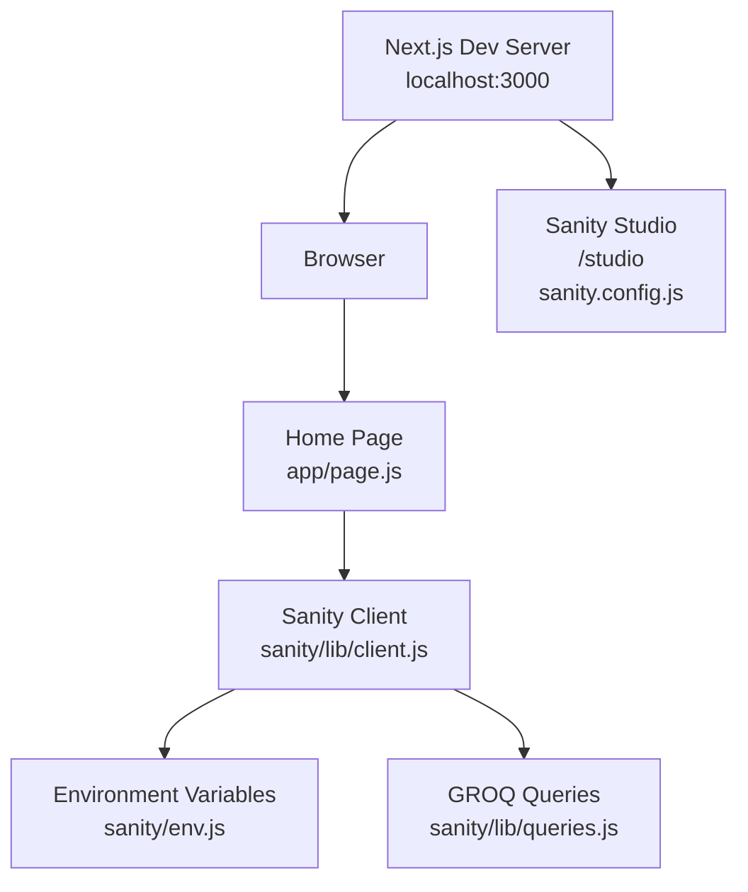

# Getting Started

<cite>
**Referenced Files in This Document**
- [README.md](file://README.md)
- [package.json](file://package.json)
- [sanity.config.js](file://sanity.config.js)
- [sanity/env.js](file://sanity/env.js)
- [sanity/lib/client.js](file://sanity/lib/client.js)
- [sanity/lib/queries.js](file://sanity/lib/queries.js)
- [sanity/schemaTypes/index.js](file://sanity/schemaTypes/index.js)
- [sanity/structure.js](file://sanity/structure.js)
- [next.config.mjs](file://next.config.mjs)
- [jsconfig.json](file://jsconfig.json)
- [eslint.config.mjs](file://eslint.config.mjs)
- [app/page.js](file://app/page.js)
- [app/layout.js](file://app/layout.js)
</cite>

## Table of Contents
1. [Introduction](#introduction)
2. [Prerequisites](#prerequisites)
3. [Installation](#installation)
4. [Development Server](#development-server)
5. [Environment Variables](#environment-variables)
6. [Verification](#verification)
7. [Architecture Overview](#architecture-overview)
8. [Troubleshooting](#troubleshooting)
9. [Conclusion](#conclusion)

## Introduction
This guide helps you install and run the WRD Photography portfolio locally. It covers prerequisites, installation, environment configuration, running the development server, and verifying your setup. The project is a Next.js application integrated with Sanity CMS for content management.

## Prerequisites
- Operating system: macOS, Linux, or Windows
- Node.js: The project specifies a compatible Node.js runtime via the Next.js version. Install a current LTS version of Node.js appropriate for your platform.
- Package manager: The project supports npm, yarn, pnpm, and bun. Choose one and ensure it is installed and functional.
- Git: Required to clone the repository.

Why these matter:
- Next.js requires a supported Node.js version to build and run.
- The project defines scripts for dev, build, start, and lint, which are executed by your chosen package manager.
- Sanity integration depends on environment variables for project ID, dataset, and API version.

**Section sources**
- [package.json:11-22](file://package.json#L11-L22)
- [package.json:23-28](file://package.json#L23-L28)
- [package.json:5-10](file://package.json#L5-L10)
- [README.md:3-17](file://README.md#L3-L17)

## Installation
Follow these steps to prepare your local environment:

1. Clone the repository
- Use git to clone the repository to your machine.

2. Navigate into the project directory
- Change your working directory to the repository root.

3. Install dependencies
- Run your chosen package manager to install dependencies:
  - npm: npm ci or npm install
  - yarn: yarn install
  - pnpm: pnpm install
  - bun: bun install

4. Verify installation
- After installation completes, confirm that the development script runs without errors.

Notes:
- The project sets a preferred package manager in its configuration. Using the recommended package manager avoids lockfile conflicts.
- The project includes a lint script for code quality checks.

**Section sources**
- [package.json:29](file://package.json#L29)
- [package.json:5-10](file://package.json#L5-L10)
- [README.md:3-17](file://README.md#L3-L17)

## Development Server
Start the local development server using your preferred package manager:

- npm: npm run dev
- yarn: yarn dev
- pnpm: pnpm dev
- bun: bun dev

Access the application:
- Open http://localhost:3000 in your browser.

What happens:
- The Next.js dev server starts and serves the React application.
- The Sanity Studio is available at /studio within the app.

**Section sources**
- [README.md:5-17](file://README.md#L5-L17)
- [package.json:5-10](file://package.json#L5-L10)
- [sanity.config.js:16-28](file://sanity.config.js#L16-L28)

## Environment Variables
Configure the following environment variables for the frontend and Sanity integration:

- NEXT_PUBLIC_SANITY_PROJECT_ID
  - Purpose: Identifies your Sanity project.
  - Source: Used by the Sanity client configuration.
- NEXT_PUBLIC_SANITY_DATASET
  - Purpose: Selects the Sanity dataset containing your content.
  - Source: Used by the Sanity client configuration.
- NEXT_PUBLIC_SANITY_API_VERSION
  - Purpose: Sets the Sanity API version used for queries.
  - Default fallback: A default value is provided if unspecified.

Where they are used:
- Frontend: The Sanity client reads these variables to connect to your Sanity project.
- Sanity Studio: The Studio configuration imports these values to mount the Studio at /studio.

How to set them:
- Create a .env.local file at the project root and add the variables with your Sanity project details.

Validation:
- After setting the variables, restart the dev server and verify the app loads content from Sanity.

**Section sources**
- [sanity/env.js:1-6](file://sanity/env.js#L1-L6)
- [sanity/lib/client.js:1-10](file://sanity/lib/client.js#L1-L10)
- [sanity.config.js:12](file://sanity.config.js#L12)

## Verification
After completing installation and environment setup, verify your installation:

1. Confirm the dev server starts
- Running the dev script should start the Next.js server without errors.

2. Visit the homepage
- Open http://localhost:3000 and ensure the home page renders.

3. Access the Sanity Studio
- Navigate to http://localhost:3000/studio and confirm the Sanity Studio opens.

4. Check content loading
- The homepage fetches content from Sanity using GROQ queries. If content appears, the integration is working.

5. Lint your code
- Run the lint script to validate code quality.

**Section sources**
- [README.md:5-17](file://README.md#L5-L17)
- [sanity.config.js:17](file://sanity.config.js#L17)
- [app/page.js:3-4](file://app/page.js#L3-L4)
- [sanity/lib/queries.js:1-33](file://sanity/lib/queries.js#L1-L33)
- [package.json:5-10](file://package.json#L5-L10)

## Architecture Overview
High-level flow during development:

**Diagram sources**
- [app/page.js:3-4](file://app/page.js#L3-L4)
- [sanity/lib/client.js:1-10](file://sanity/lib/client.js#L1-L10)
- [sanity/env.js:1-6](file://sanity/env.js#L1-L6)
- [sanity/lib/queries.js:1-33](file://sanity/lib/queries.js#L1-L33)
- [sanity.config.js:16-28](file://sanity.config.js#L16-L28)

## Troubleshooting
Common setup issues and fixes:

- Node.js version mismatch
  - Symptom: Build errors or unexpected behavior.
  - Fix: Install a supported Node.js version matching the Next.js requirement.

- Missing environment variables
  - Symptom: Content does not load or Sanity Studio fails to initialize.
  - Fix: Set NEXT_PUBLIC_SANITY_PROJECT_ID, NEXT_PUBLIC_SANITY_DATASET, and NEXT_PUBLIC_SANITY_API_VERSION in your environment.

- Port conflict on localhost:3000
  - Symptom: Dev server fails to start or reports port already in use.
  - Fix: Stop the conflicting process or configure Next.js to use another port.

- Package manager mismatch
  - Symptom: Lockfile conflicts or dependency resolution errors.
  - Fix: Use the package manager specified by the project or align your choice accordingly.

- Sanity Studio not found at /studio
  - Symptom: Navigating to /studio yields a 404.
  - Fix: Ensure environment variables are set and restart the dev server. Confirm the Studio base path in the Sanity configuration.

- Fonts or assets not loading
  - Symptom: Missing fonts or images.
  - Fix: Verify asset uploads in Sanity and ensure correct field mappings in queries.

**Section sources**
- [sanity/env.js:1-6](file://sanity/env.js#L1-L6)
- [sanity.config.js:17](file://sanity.config.js#L17)
- [README.md:5-17](file://README.md#L5-L17)

## Conclusion
You now have the prerequisites, installation steps, environment configuration, and verification procedures to run the WRD Photography portfolio locally. Start the dev server, confirm the homepage and Sanity Studio are reachable, and validate content loading. Use the troubleshooting section to resolve common issues quickly.