# Build Optimization

<cite>
**Referenced Files in This Document**
- [next.config.mjs](file://next.config.mjs)
- [postcss.config.mjs](file://postcss.config.mjs)
- [package.json](file://package.json)
- [jsconfig.json](file://jsconfig.json)
- [eslint.config.mjs](file://eslint.config.mjs)
- [sanity.config.js](file://sanity.config.js)
- [app/layout.js](file://app/layout.js)
- [app/page.js](file://app/page.js)
- [app/globals.css](file://app/globals.css)
- [app/components/Lightbox.js](file://app/components/Lightbox.js)
- [app/components/FeaturedPage.js](file://app/components/FeaturedPage.js)
- [app/components/GalleryPage.js](file://app/components/GalleryPage.js)
</cite>

## Table of Contents
1. [Introduction](#introduction)
2. [Project Structure](#project-structure)
3. [Core Components](#core-components)
4. [Architecture Overview](#architecture-overview)
5. [Detailed Component Analysis](#detailed-component-analysis)
6. [Dependency Analysis](#dependency-analysis)
7. [Performance Considerations](#performance-considerations)
8. [Troubleshooting Guide](#troubleshooting-guide)
9. [Conclusion](#conclusion)
10. [Appendices](#appendices)

## Introduction
This document provides comprehensive build optimization guidance for the Next.js application. It focuses on Next.js-specific optimizations (static generation configuration, code splitting, and bundle analysis), PostCSS and Tailwind CSS optimizations, Webpack configuration considerations, build-time image optimization, asset compression, deployment strategies, environment-specific configurations, ISR optimization, build caching, parallel builds, and CI/CD pipeline optimization. Practical examples and diagrams illustrate how current code and configuration interact with Next.js build behavior.

## Project Structure
The project follows a modern Next.js App Router structure with a dedicated app directory, shared global styles, and dynamic client components. Key areas impacting build performance include:
- Next.js configuration placeholder for future optimizations
- PostCSS/Tailwind integration via a dedicated plugin
- Global CSS and font loading via next/font
- Dynamic imports for client-side heavy libraries (GSAP) and page sections
- Image optimization through Sanity image helpers

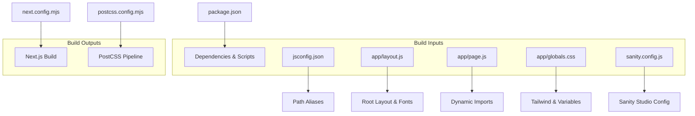

**Diagram sources**
- [next.config.mjs:1-7](file://next.config.mjs#L1-L7)
- [postcss.config.mjs:1-8](file://postcss.config.mjs#L1-L8)
- [package.json:1-31](file://package.json#L1-L31)
- [jsconfig.json:1-8](file://jsconfig.json#L1-L8)
- [app/layout.js:1-40](file://app/layout.js#L1-L40)
- [app/page.js:1-227](file://app/page.js#L1-L227)
- [app/globals.css:1-93](file://app/globals.css#L1-L93)
- [sanity.config.js:1-29](file://sanity.config.js#L1-L29)

**Section sources**
- [next.config.mjs:1-7](file://next.config.mjs#L1-L7)
- [postcss.config.mjs:1-8](file://postcss.config.mjs#L1-L8)
- [package.json:1-31](file://package.json#L1-L31)
- [jsconfig.json:1-8](file://jsconfig.json#L1-L8)
- [app/layout.js:1-40](file://app/layout.js#L1-L40)
- [app/page.js:1-227](file://app/page.js#L1-L227)
- [app/globals.css:1-93](file://app/globals.css#L1-L93)
- [sanity.config.js:1-29](file://sanity.config.js#L1-L29)

## Core Components
- Next.js configuration: Placeholder for future build-time optimizations (e.g., output tracing, experimental flags, SWC transforms).
- PostCSS/Tailwind: Tailwind CSS plugin configured via PostCSS; CSS purging is handled by Tailwind’s v4 defaults.
- Global CSS and fonts: next/font preloads fonts to improve Core Web Vitals; CSS variables define theme tokens.
- Dynamic imports: Client-only heavy libraries (GSAP) and page sections defer initial server rendering and reduce initial JS payload.
- Image optimization: Sanity image helpers generate responsive URLs with width and quality parameters.

Practical implications:
- Font preloading reduces font shift; ensure only used weights/styles are loaded.
- Dynamic imports split bundles and enable lazy-loading of heavy client code.
- Tailwind CSS purges unused styles automatically in production builds.

**Section sources**
- [next.config.mjs:1-7](file://next.config.mjs#L1-L7)
- [postcss.config.mjs:1-8](file://postcss.config.mjs#L1-L8)
- [app/layout.js:1-40](file://app/layout.js#L1-L40)
- [app/page.js:1-227](file://app/page.js#L1-L227)
- [app/globals.css:1-93](file://app/globals.css#L1-L93)
- [app/components/Lightbox.js:1-169](file://app/components/Lightbox.js#L1-L169)
- [app/components/FeaturedPage.js:116-145](file://app/components/FeaturedPage.js#L116-L145)
- [app/components/GalleryPage.js:306-335](file://app/components/GalleryPage.js#L306-L335)

## Architecture Overview
The build pipeline integrates Next.js compilation, PostCSS processing, and asset optimization. Dynamic imports and font preloading influence bundle composition and runtime performance.

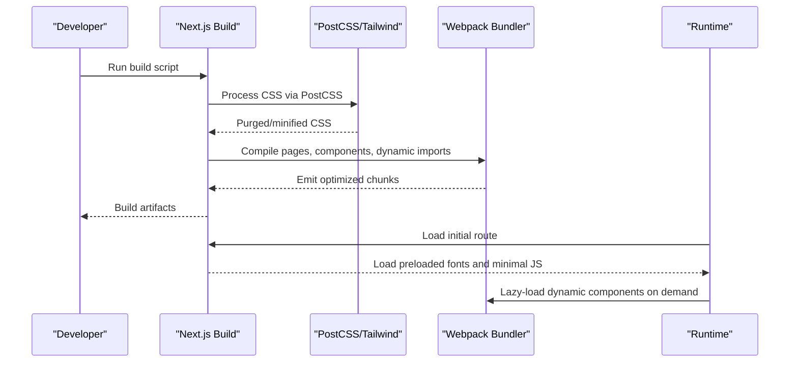

**Diagram sources**
- [package.json:5-10](file://package.json#L5-L10)
- [postcss.config.mjs:1-8](file://postcss.config.mjs#L1-L8)
- [app/layout.js:1-40](file://app/layout.js#L1-L40)
- [app/page.js:1-227](file://app/page.js#L1-L227)

## Detailed Component Analysis

### Next.js Configuration and Static Generation
Current configuration is a placeholder. Recommended additions for optimization:
- Output tracing and experimental flags for advanced SWC transforms
- Incremental Static Regeneration (ISR) for dynamic content
- Optimize images and static exports for CDN delivery

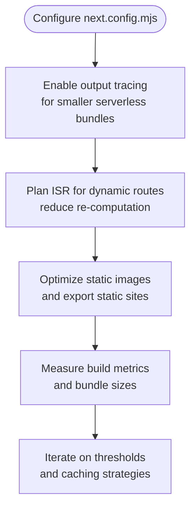

**Diagram sources**
- [next.config.mjs:1-7](file://next.config.mjs#L1-L7)

**Section sources**
- [next.config.mjs:1-7](file://next.config.mjs#L1-L7)

### PostCSS and Tailwind CSS Optimization
- Tailwind CSS is integrated via PostCSS; purge is automatic in production.
- Global CSS defines theme variables and animations; ensure only used utilities remain post-purge.

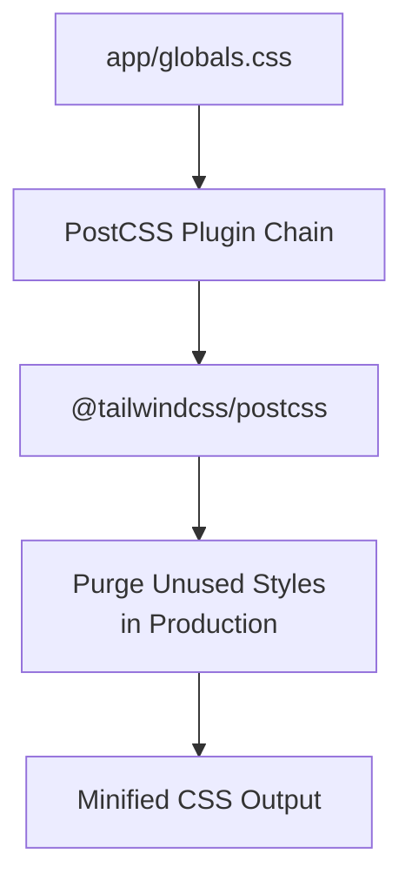

**Diagram sources**
- [postcss.config.mjs:1-8](file://postcss.config.mjs#L1-L8)
- [app/globals.css:1-93](file://app/globals.css#L1-L93)

**Section sources**
- [postcss.config.mjs:1-8](file://postcss.config.mjs#L1-L8)
- [app/globals.css:1-93](file://app/globals.css#L1-L93)

### Code Splitting and Dynamic Imports
- Page sections and client-heavy libraries are dynamically imported to reduce initial bundle size.
- Client-only components prevent SSR overhead for interactive UI.

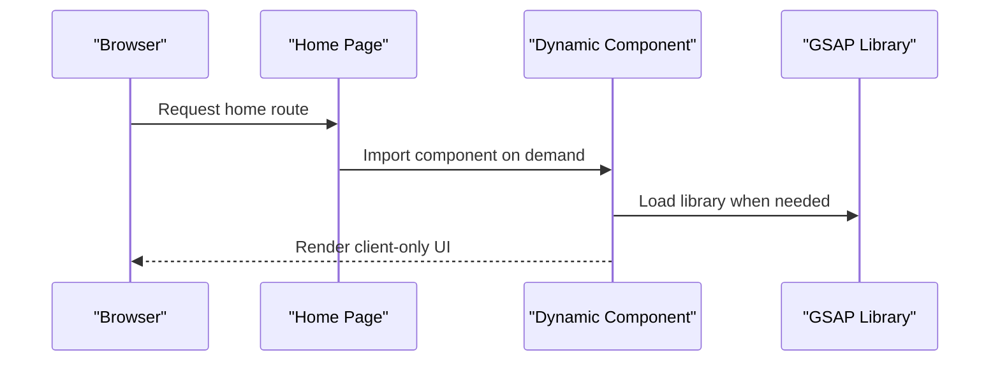

**Diagram sources**
- [app/page.js:1-227](file://app/page.js#L1-L227)
- [app/components/Lightbox.js:1-169](file://app/components/Lightbox.js#L1-L169)

**Section sources**
- [app/page.js:1-227](file://app/page.js#L1-L227)
- [app/components/Lightbox.js:1-169](file://app/components/Lightbox.js#L1-L169)

### Font Loading and CSS Delivery
- next/font preloads selected font variants and variables to minimize layout shifts.
- CSS variables centralize theme tokens and support light/dark modes.

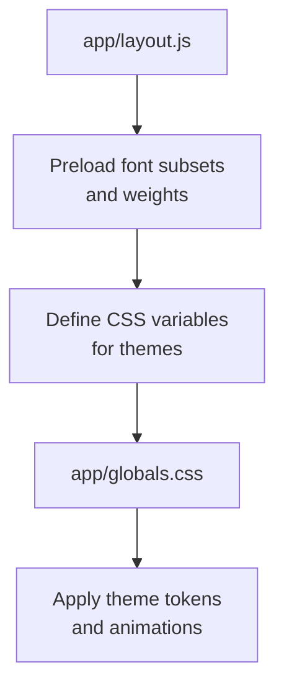

**Diagram sources**
- [app/layout.js:1-40](file://app/layout.js#L1-L40)
- [app/globals.css:1-93](file://app/globals.css#L1-L93)

**Section sources**
- [app/layout.js:1-40](file://app/layout.js#L1-L40)
- [app/globals.css:1-93](file://app/globals.css#L1-L93)

### Image Optimization and Asset Compression
- Sanity image helpers generate responsive URLs with width and quality parameters.
- Consider enabling Next.js built-in image optimization for static assets and ensuring compression in production.

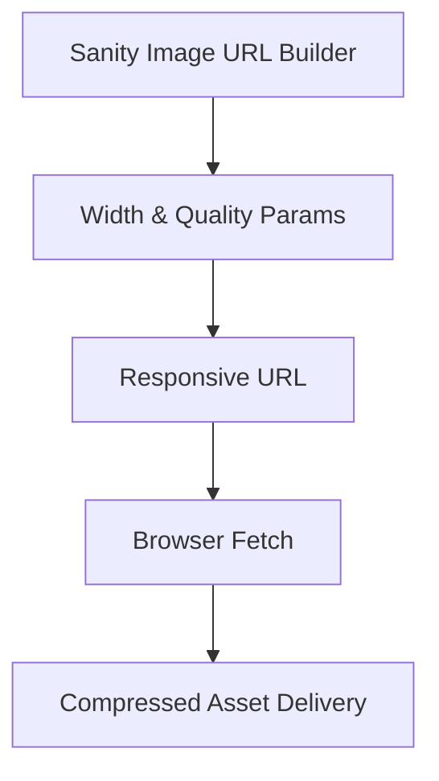

**Diagram sources**
- [app/components/FeaturedPage.js:116-145](file://app/components/FeaturedPage.js#L116-L145)
- [app/components/Lightbox.js:159-168](file://app/components/Lightbox.js#L159-L168)

**Section sources**
- [app/components/FeaturedPage.js:116-145](file://app/components/FeaturedPage.js#L116-L145)
- [app/components/Lightbox.js:159-168](file://app/components/Lightbox.js#L159-L168)

### ISR Optimization for Dynamic Content
- Plan ISR for routes backed by CMS data to balance freshness and performance.
- Use appropriate revalidation intervals and background regeneration.

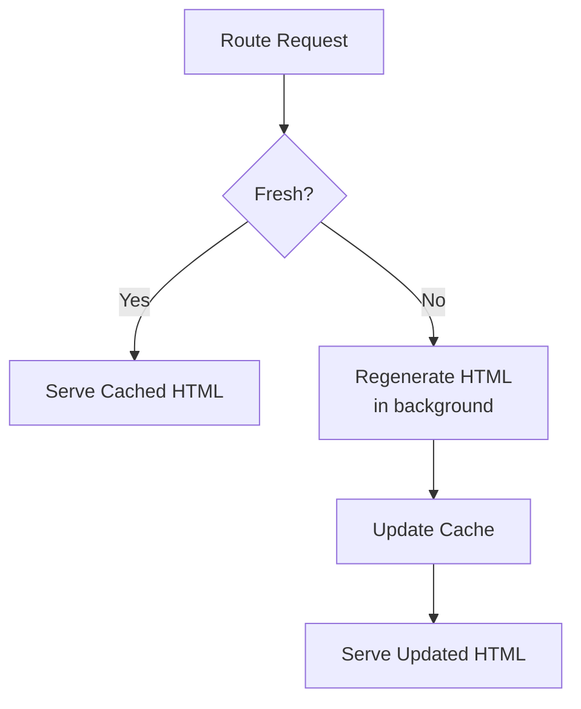

[No sources needed since this diagram shows conceptual workflow, not actual code structure]

### Build-Time Monitoring and Bundle Analysis
- Use Next.js build stats and analyzer tools to inspect bundle composition.
- Monitor chunk sizes, entry points, and third-party contributions.

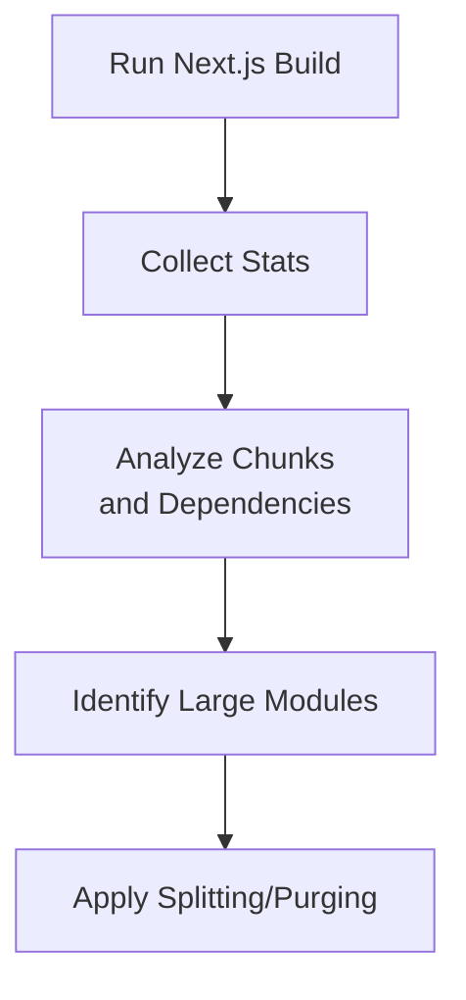

[No sources needed since this diagram shows conceptual workflow, not actual code structure]

### Environment-Specific Optimizations and Production Builds
- Configure environment variables for API keys and feature flags.
- Enable production-only optimizations (e.g., minification, purging) and disable development-only features.

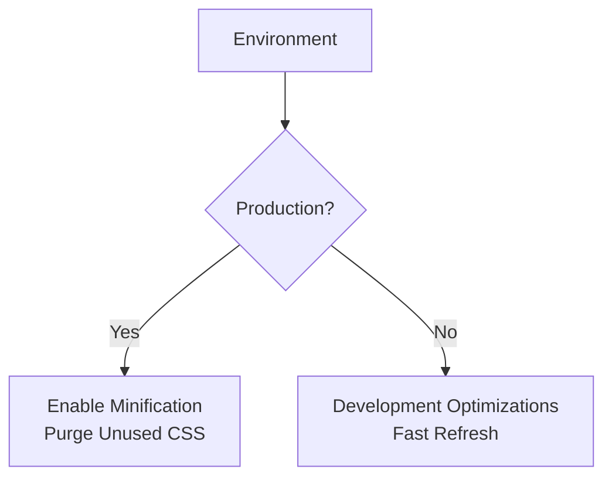

[No sources needed since this diagram shows conceptual workflow, not actual code structure]

### CI/CD Pipeline Optimization
- Cache node_modules and Next.js build output between runs.
- Parallelize linting, type checks, and builds where possible.
- Use build artifacts for faster deployments.

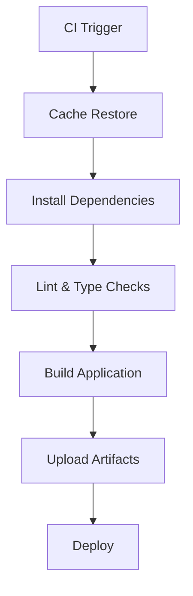

[No sources needed since this diagram shows conceptual workflow, not actual code structure]

## Dependency Analysis
The project relies on Next.js, React 19, Sanity integration, and Tailwind CSS via PostCSS. Understanding these dependencies helps optimize build performance and compatibility.

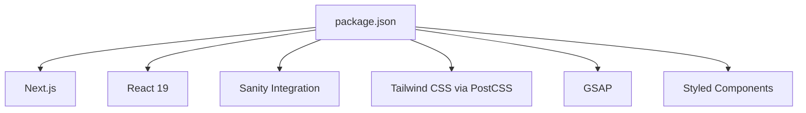

**Diagram sources**
- [package.json:11-22](file://package.json#L11-L22)
- [package.json:23-28](file://package.json#L23-L28)

**Section sources**
- [package.json:11-22](file://package.json#L11-L22)
- [package.json:23-28](file://package.json#L23-L28)

## Performance Considerations
- Prefer dynamic imports for client-only heavy libraries to reduce initial bundle size.
- Keep font subsets minimal and leverage next/font preloading.
- Use Tailwind utilities judiciously; rely on purge in production.
- Compress images and leverage responsive URLs from image providers.
- Monitor bundle composition and remove unused dependencies.

[No sources needed since this section provides general guidance]

## Troubleshooting Guide
- ESLint configuration ignores Next.js output directories by default; ensure custom ignores align with build outputs.
- Sanity Studio configuration sets a base path; verify routing and asset paths match deployment structure.

**Section sources**
- [eslint.config.mjs:1-17](file://eslint.config.mjs#L1-L17)
- [sanity.config.js:16-28](file://sanity.config.js#L16-L28)

## Conclusion
By leveraging Next.js dynamic imports, font preloading, Tailwind CSS purging, and strategic ISR, this project can achieve fast builds and optimal runtime performance. Future enhancements to next.config.mjs, combined with CI/CD caching and bundle analysis, will further refine build efficiency and reliability.

[No sources needed since this section summarizes without analyzing specific files]

## Appendices
- Path aliases configured for cleaner imports and module resolution.
- Sanity Studio configuration defines the admin interface base path and plugins.

**Section sources**
- [jsconfig.json:1-8](file://jsconfig.json#L1-L8)
- [sanity.config.js:16-28](file://sanity.config.js#L16-L28)