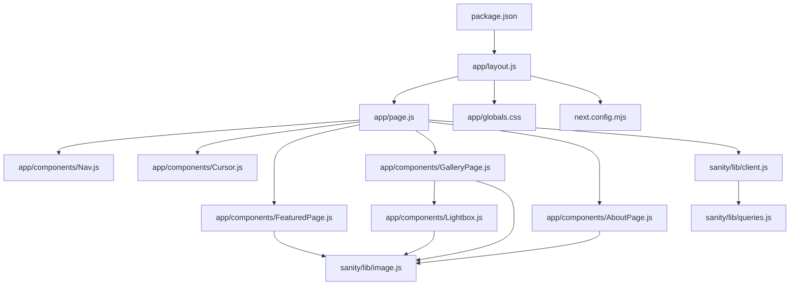
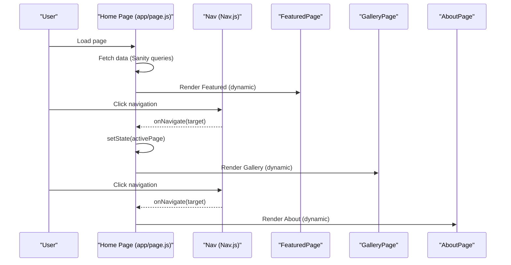
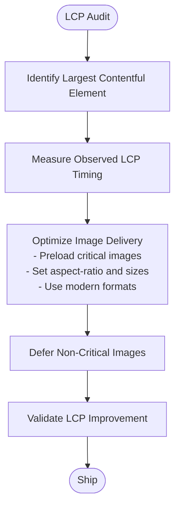
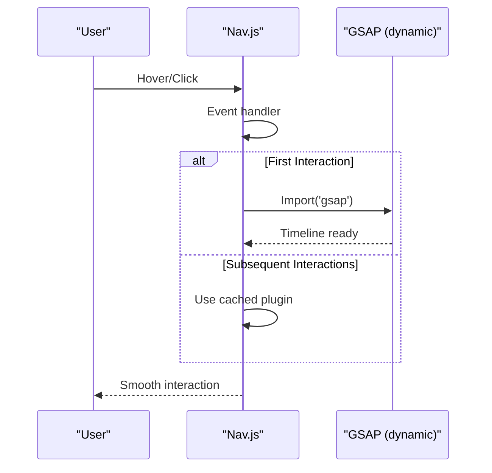
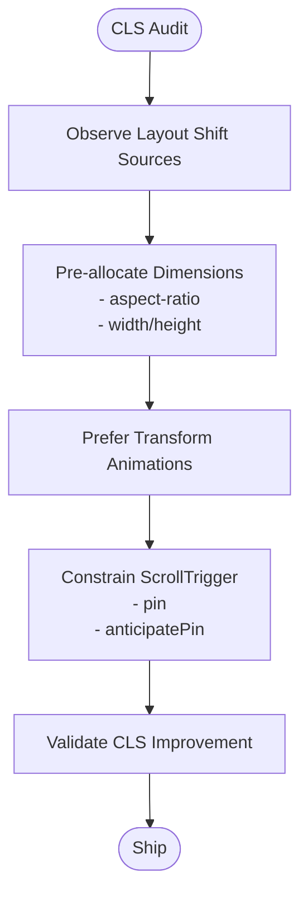
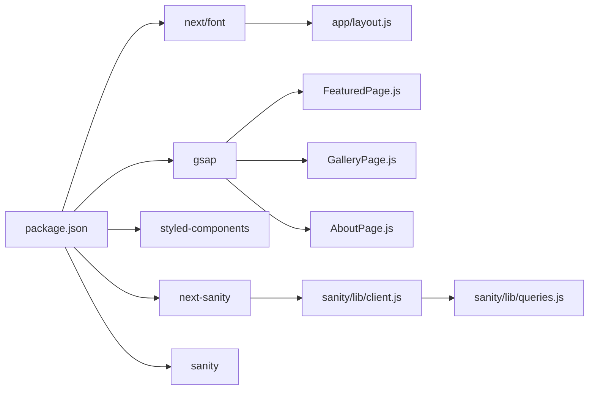

# Core Web Vitals Optimization

<cite>
**Referenced Files in This Document**
- [README.md](file://README.md)
- [package.json](file://package.json)
- [next.config.mjs](file://next.config.mjs)
- [app/layout.js](file://app/layout.js)
- [app/globals.css](file://app/globals.css)
- [app/page.js](file://app/page.js)
- [app/components/Nav.js](file://app/components/Nav.js)
- [app/components/Cursor.js](file://app/components/Cursor.js)
- [app/components/FeaturedPage.js](file://app/components/FeaturedPage.js)
- [app/components/GalleryPage.js](file://app/components/GalleryPage.js)
- [app/components/AboutPage.js](file://app/components/AboutPage.js)
- [app/components/Lightbox.js](file://app/components/Lightbox.js)
- [sanity/lib/client.js](file://sanity/lib/client.js)
- [sanity/lib/image.js](file://sanity/lib/image.js)
- [sanity/lib/queries.js](file://sanity/lib/queries.js)
- [sanity/env.js](file://sanity/env.js)
</cite>

## Table of Contents
1. [Introduction](#introduction)
2. [Project Structure](#project-structure)
3. [Core Components](#core-components)
4. [Architecture Overview](#architecture-overview)
5. [Detailed Component Analysis](#detailed-component-analysis)
6. [Dependency Analysis](#dependency-analysis)
7. [Performance Budgeting and Monitoring](#performance-budgeting-and-monitoring)
8. [Responsive Design and Connection Speed Optimization](#responsive-design-and-connection-speed-optimization)
9. [Server-Side Rendering and Hydration Optimization](#server-side-rendering-and-hydration-optimization)
10. [Practical Implementation Examples](#practical-implementation-examples)
11. [Troubleshooting Guide](#troubleshooting-guide)
12. [Conclusion](#conclusion)

## Introduction
This document provides a comprehensive guide to optimizing Core Web Vitals (LCP, FID, CLS) for a Next.js portfolio application. It synthesizes the existing codebase to propose targeted improvements for Largest Contentful Paint, First Input Delay, and Cumulative Layout Shift. It also covers performance budgeting, metric tracking, continuous monitoring, responsive design, SSR/hydration optimization, and practical measurement strategies.

## Project Structure
The application follows a Next.js App Router structure with a root layout, global styles, and modular client components. Data fetching integrates with Sanity CMS via typed GROQ queries and a dedicated client. Animations leverage GSAP with dynamic imports to keep the initial payload lean.

**Diagram sources**
- [app/layout.js:1-40](file://app/layout.js#L1-L40)
- [app/page.js:1-227](file://app/page.js#L1-L227)
- [app/globals.css:1-93](file://app/globals.css#L1-L93)
- [app/components/Nav.js:1-168](file://app/components/Nav.js#L1-L168)
- [app/components/Cursor.js:1-42](file://app/components/Cursor.js#L1-L42)
- [app/components/FeaturedPage.js:1-269](file://app/components/FeaturedPage.js#L1-L269)
- [app/components/GalleryPage.js:1-760](file://app/components/GalleryPage.js#L1-L760)
- [app/components/AboutPage.js:1-458](file://app/components/AboutPage.js#L1-L458)
- [app/components/Lightbox.js:1-303](file://app/components/Lightbox.js#L1-L303)
- [sanity/lib/image.js:1-9](file://sanity/lib/image.js#L1-L9)
- [sanity/lib/client.js:1-10](file://sanity/lib/client.js#L1-L10)
- [sanity/lib/queries.js:1-33](file://sanity/lib/queries.js#L1-L33)
- [next.config.mjs:1-7](file://next.config.mjs#L1-L7)
- [package.json:1-31](file://package.json#L1-L31)

**Section sources**
- [README.md:1-37](file://README.md#L1-L37)
- [package.json:1-31](file://package.json#L1-L31)
- [next.config.mjs:1-7](file://next.config.mjs#L1-L7)
- [app/layout.js:1-40](file://app/layout.js#L1-L40)
- [app/globals.css:1-93](file://app/globals.css#L1-L93)
- [app/page.js:1-227](file://app/page.js#L1-L227)

## Core Components
- Root layout and fonts: The root layout defines three Google Fonts with display swapping to prevent FOIT/FOUT during initial paint.
- Global styles: Tailwind-based CSS with theme-aware variables and reduced-motion support.
- Page composition: The home page orchestrates navigation, cursor effects, and lazy-loaded page sections.
- Data layer: Sanity client configured for fresh data, with GROQ queries for featured, gallery, and about content.
- Animation layer: GSAP dynamically imported per component to minimize initial JS.

Key optimization levers:
- Font loading strategy via next/font with display swap.
- Dynamic imports for animations and heavy plugins.
- Image URLs generated through Sanity with explicit quality and width parameters.
- Scroll-triggered animations deferred until user interaction or viewport visibility.

**Section sources**
- [app/layout.js:1-40](file://app/layout.js#L1-L40)
- [app/globals.css:1-93](file://app/globals.css#L1-L93)
- [app/page.js:1-227](file://app/page.js#L1-L227)
- [sanity/lib/client.js:1-10](file://sanity/lib/client.js#L1-L10)
- [sanity/lib/queries.js:1-33](file://sanity/lib/queries.js#L1-L33)

## Architecture Overview
The runtime architecture centers on a single-page layout with route-like sections rendered conditionally. Navigation switches pages with a short transition, while animations are scoped to the active section. Images are loaded from Sanity with optimized URLs.

**Diagram sources**
- [app/page.js:1-227](file://app/page.js#L1-L227)
- [app/components/Nav.js:1-168](file://app/components/Nav.js#L1-L168)
- [app/components/FeaturedPage.js:1-269](file://app/components/FeaturedPage.js#L1-L269)
- [app/components/GalleryPage.js:1-760](file://app/components/GalleryPage.js#L1-L760)
- [app/components/AboutPage.js:1-458](file://app/components/AboutPage.js#L1-L458)

## Detailed Component Analysis

### Largest Contentful Paint (LCP) Optimization
LCP is dominated by large images in the hero areas and galleries. Current implementation:
- Hero backgrounds and masonry images use explicit width and quality parameters.
- Featured hero uses a gradient overlay to improve perceived contrast and readability.
- Gallery hero and masonry items specify widths and quality for efficient delivery.

Recommended improvements:
- Preload critical hero images using preload hints in the root layout.
- Add aspect-ratio and width/height attributes on key images to avoid layout shifts.
- Ensure images are appropriately sized for the viewport and avoid unnecessary scaling.
- Lazy-load non-critical images with intersection observers.

**Section sources**
- [app/components/FeaturedPage.js:130-145](file://app/components/FeaturedPage.js#L130-L145)
- [app/components/GalleryPage.js:240-260](file://app/components/GalleryPage.js#L240-L260)
- [app/components/AboutPage.js:240-255](file://app/components/AboutPage.js#L240-L255)
- [sanity/lib/image.js:1-9](file://sanity/lib/image.js#L1-L9)

### First Input Delay (FID) Reduction
Current state:
- Heavy animations are dynamically imported per component.
- Navigation and interactive elements are event-driven with minimal initial overhead.
- GSAP plugins are registered only when needed.

Recommendations:
- Split bundles further by moving heavy plugins into separate dynamic imports gated by interaction.
- Use passive listeners for wheel/scroll events where possible.
- Debounce or throttle expensive handlers (e.g., mousemove, resize).
- Ensure critical path JS is minimized; defer non-critical features until after first paint.

**Diagram sources**
- [app/components/Nav.js:1-168](file://app/components/Nav.js#L1-L168)

**Section sources**
- [app/page.js:1-227](file://app/page.js#L1-L227)
- [app/components/Nav.js:1-168](file://app/components/Nav.js#L1-L168)

### Cumulative Layout Shift (CLS) Prevention
Current state:
- Layout uses fixed heights and absolute positioning for overlays.
- Some components rely on dynamic DOM manipulation for animations.
- Scroll-triggered reveals may cause layout shifts if not pinned or constrained.

Recommendations:
- Allocate space for animated elements using aspect-ratio and fixed dimensions.
- Avoid inserting/removing nodes during animations; use transforms/opacity instead.
- Pin ScrollTrigger elements and constrain animations to local containers.
- Prefer CSS transforms over style property changes for layout-influencing properties.

**Section sources**
- [app/components/GalleryPage.js:120-154](file://app/components/GalleryPage.js#L120-L154)
- [app/components/AboutPage.js:52-66](file://app/components/AboutPage.js#L52-L66)

## Dependency Analysis
The application’s performance depends on:
- next/font for optimized font delivery with display swap.
- Sanity client for fresh content without caching.
- GSAP for scroll-driven animations with dynamic imports.
- Tailwind for utility-first CSS with theme-aware variables.

**Diagram sources**
- [package.json:1-31](file://package.json#L1-L31)
- [app/layout.js:1-40](file://app/layout.js#L1-L40)
- [app/components/FeaturedPage.js:1-269](file://app/components/FeaturedPage.js#L1-L269)
- [app/components/GalleryPage.js:1-760](file://app/components/GalleryPage.js#L1-L760)
- [app/components/AboutPage.js:1-458](file://app/components/AboutPage.js#L1-L458)
- [sanity/lib/client.js:1-10](file://sanity/lib/client.js#L1-L10)
- [sanity/lib/queries.js:1-33](file://sanity/lib/queries.js#L1-L33)

**Section sources**
- [package.json:1-31](file://package.json#L1-L31)
- [app/layout.js:1-40](file://app/layout.js#L1-L40)
- [sanity/lib/client.js:1-10](file://sanity/lib/client.js#L1-L10)

## Performance Budgeting and Monitoring
- Establish budgets for LCP (<2.5s), FID (<100ms), and CLS (<0.1) aligned with Core Web Vitals thresholds.
- Instrument real-user monitoring (RUM) using web-vitals library or Chrome UX Report.
- Track metrics in analytics dashboards and alert on regressions.
- Enforce budgets via automated checks in CI (e.g., Lighthouse thresholds).

[No sources needed since this section provides general guidance]

## Responsive Design and Connection Speed Optimization
- Use responsive breakpoints and clamp utilities to maintain legible typography across devices.
- Serve appropriately sized images for different viewport widths and DPR.
- Enable compression and modern formats (AVIF/WebP) via CDN or image optimization pipeline.
- Implement connection-aware loading strategies (prefetch/preload for critical assets).

[No sources needed since this section provides general guidance]

## Server-Side Rendering and Hydration Optimization
- Keep server-rendered HTML minimal and defer heavy client-side logic.
- Use dynamic imports for client-only features to reduce server bundle size.
- Hydrate progressively: render critical above-the-fold content first, then lazy-load animations and heavy components.

[No sources needed since this section provides general guidance]

## Practical Implementation Examples
- Image optimization: Apply width and quality parameters consistently across hero and masonry layouts.
- Font optimization: Maintain display swap to avoid layout shifts during font load.
- Animation optimization: Gate GSAP plugin imports behind user interaction or viewport visibility.
- Bundle splitting: Move ScrollTrigger and other plugins to dynamic imports and register only when needed.

**Section sources**
- [app/components/FeaturedPage.js:130-145](file://app/components/FeaturedPage.js#L130-L145)
- [app/components/GalleryPage.js:240-260](file://app/components/GalleryPage.js#L240-L260)
- [app/components/AboutPage.js:52-66](file://app/components/AboutPage.js#L52-L66)
- [app/layout.js:1-40](file://app/layout.js#L1-L40)

## Troubleshooting Guide
- If LCP regresses after adding new images, verify preload hints and aspect-ratio attributes.
- If FID spikes on first interaction, confirm that heavy imports are not blocking the main thread.
- If CLS increases during scroll-triggered reveals, ensure elements are pinned and transitions are constrained.

[No sources needed since this section provides general guidance]

## Conclusion
By focusing on image optimization, strategic code splitting, and constrained animations, this portfolio can achieve strong Core Web Vitals. Combine these optimizations with performance budgets, RUM monitoring, and progressive enhancement to sustain high performance across devices and connection speeds.