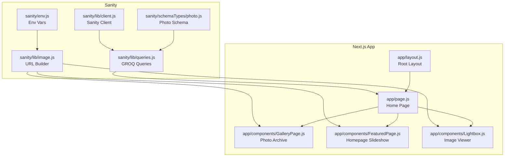
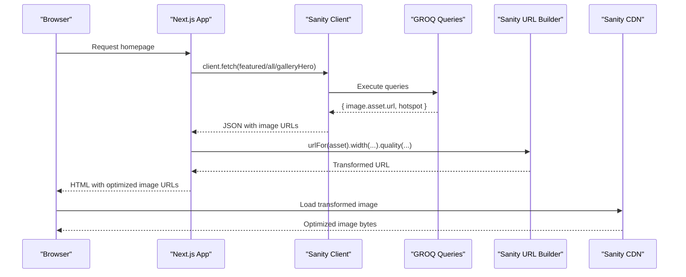
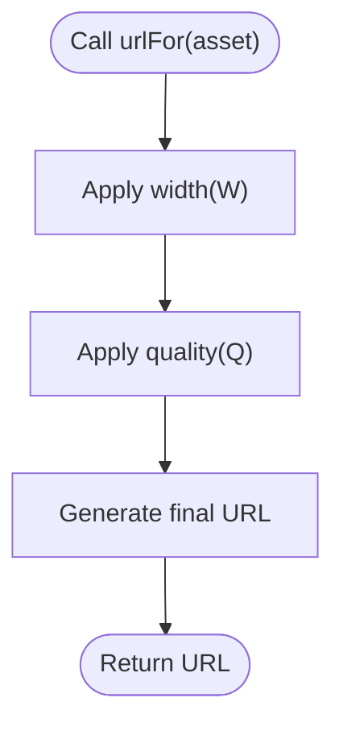
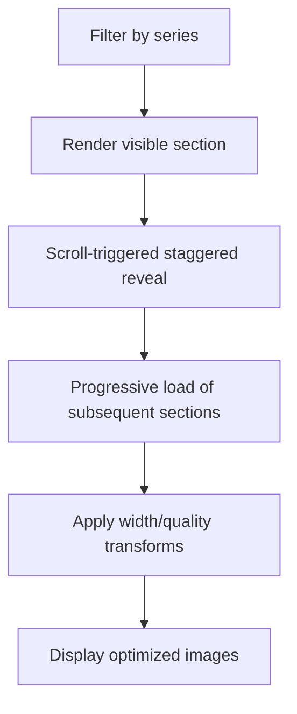
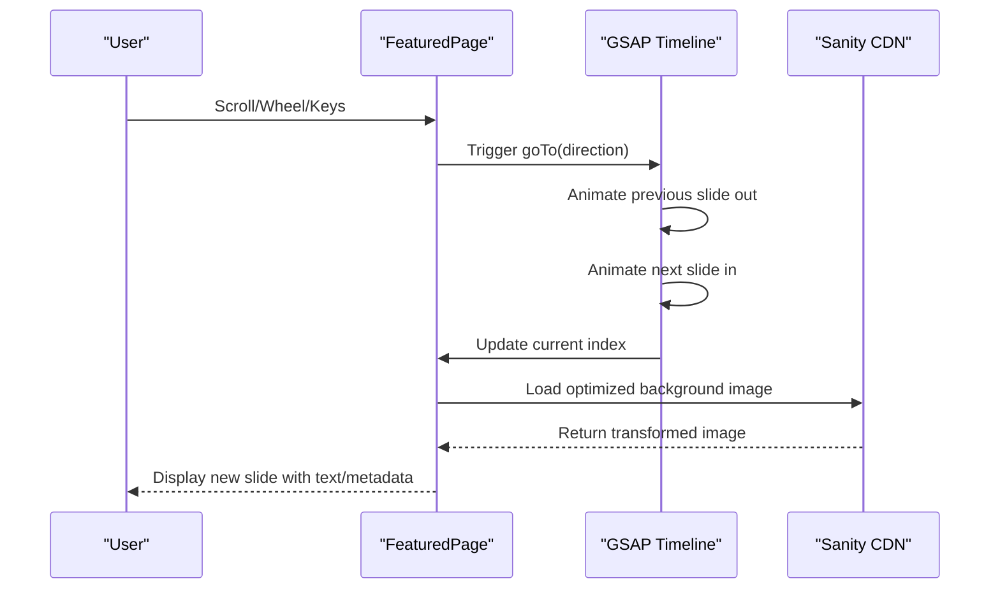
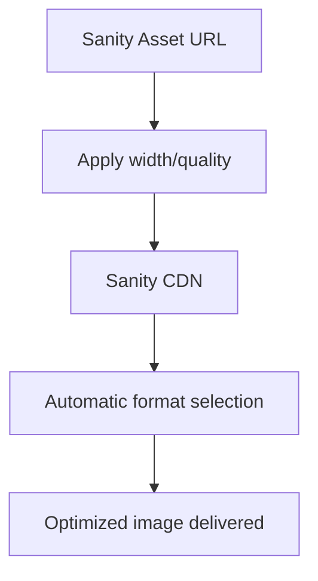
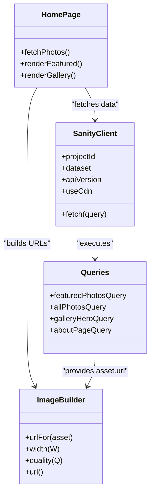
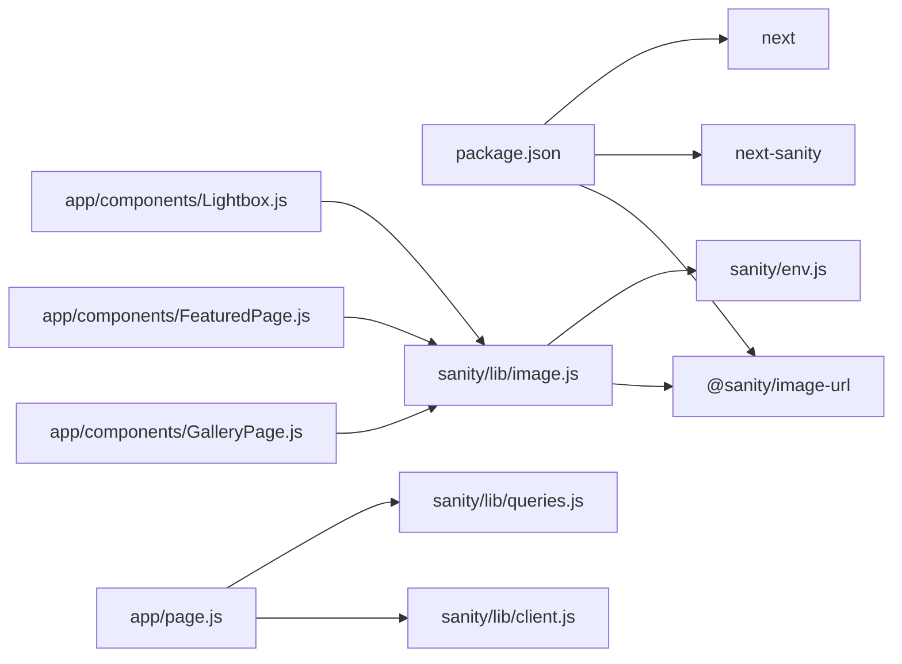

# Image Loading Strategies

<cite>
**Referenced Files in This Document**
- [image.js](file://sanity/lib/image.js)
- [client.js](file://sanity/lib/client.js)
- [queries.js](file://sanity/lib/queries.js)
- [env.js](file://sanity/env.js)
- [GalleryPage.js](file://app/components/GalleryPage.js)
- [FeaturedPage.js](file://app/components/FeaturedPage.js)
- [Lightbox.js](file://app/components/Lightbox.js)
- [page.js](file://app/page.js)
- [layout.js](file://app/layout.js)
- [package.json](file://package.json)
- [next.config.mjs](file://next.config.mjs)
- [photo.js](file://sanity/schemaTypes/photo.js)
</cite>

## Table of Contents
1. [Introduction](#introduction)
2. [Project Structure](#project-structure)
3. [Core Components](#core-components)
4. [Architecture Overview](#architecture-overview)
5. [Detailed Component Analysis](#detailed-component-analysis)
6. [Dependency Analysis](#dependency-analysis)
7. [Performance Considerations](#performance-considerations)
8. [Troubleshooting Guide](#troubleshooting-guide)
9. [Conclusion](#conclusion)

## Introduction
This document explains the image loading strategies implemented in the WRD Photography portfolio. It covers how images are fetched from Sanity, transformed via Sanity’s image processing pipeline, and rendered efficiently in Next.js pages. The focus areas include:
- Lazy loading for photo galleries
- Progressive loading for featured slideshows
- CDN optimization through Sanity’s image processing
- Image URL generation system and responsive variants
- Automatic format selection
- Performance optimization techniques (compression, quality settings, aspect ratio handling)
- Integration between Sanity’s image processing and Next.js image optimization
- Practical examples for implementing lazy loading, optimizing delivery for different screen sizes, measuring performance impact
- Memory management for large photo collections and browser caching strategies

## Project Structure
The image system spans Sanity CMS for content and image assets, a Next.js frontend for rendering, and a small utility for building image URLs. Key locations:
- Sanity image URL builder: sanity/lib/image.js
- Sanity client configuration: sanity/lib/client.js
- GROQ queries fetching image assets: sanity/lib/queries.js
- Environment variables for Sanity: sanity/env.js
- Photo schema definition: sanity/schemaTypes/photo.js
- Frontend pages and components:
  - app/page.js orchestrates data fetching and page composition
  - app/components/GalleryPage.js renders the photo archive with lazy and progressive loading
  - app/components/FeaturedPage.js renders the homepage slideshow with progressive transitions
  - app/components/Lightbox.js renders individual images with optimized sizing and quality
  - app/layout.js defines global fonts and metadata

**Diagram sources**
- [image.js:1-9](file://sanity/lib/image.js#L1-L9)
- [client.js:1-10](file://sanity/lib/client.js#L1-L10)
- [queries.js:1-33](file://sanity/lib/queries.js#L1-L33)
- [env.js:1-6](file://sanity/env.js#L1-L6)
- [photo.js:1-93](file://sanity/schemaTypes/photo.js#L1-L93)
- [page.js:1-227](file://app/page.js#L1-L227)
- [layout.js:1-40](file://app/layout.js#L1-L40)
- [GalleryPage.js:1-760](file://app/components/GalleryPage.js#L1-L760)
- [FeaturedPage.js:1-269](file://app/components/FeaturedPage.js#L1-L269)
- [Lightbox.js:1-303](file://app/components/Lightbox.js#L1-L303)

**Section sources**
- [image.js:1-9](file://sanity/lib/image.js#L1-L9)
- [client.js:1-10](file://sanity/lib/client.js#L1-L10)
- [queries.js:1-33](file://sanity/lib/queries.js#L1-L33)
- [env.js:1-6](file://sanity/env.js#L1-L6)
- [photo.js:1-93](file://sanity/schemaTypes/photo.js#L1-L93)
- [page.js:1-227](file://app/page.js#L1-L227)
- [layout.js:1-40](file://app/layout.js#L1-L40)
- [GalleryPage.js:1-760](file://app/components/GalleryPage.js#L1-L760)
- [FeaturedPage.js:1-269](file://app/components/FeaturedPage.js#L1-L269)
- [Lightbox.js:1-303](file://app/components/Lightbox.js#L1-L303)

## Core Components
- Sanity image URL builder: Provides a typed interface to construct image URLs with transformations (width, quality).
- Sanity client: Fetches image assets and metadata from Sanity using GROQ queries.
- GROQ queries: Select image.asset.url and hotspot for downstream transformations.
- Frontend components:
  - GalleryPage: Renders responsive grids and lists with progressive reveals and lazy-like behavior through filtering and scroll-triggered animations.
  - FeaturedPage: Renders a full-screen slideshow with progressive transitions and optimized background images.
  - Lightbox: Renders a focused image viewer with higher resolution and quality for detailed inspection.

Key implementation references:
- Image URL builder usage in components: [urlFor usage](file://app/components/GalleryPage.js#L250), [urlFor usage](file://app/components/FeaturedPage.js#L136), [urlFor usage](file://app/components/Lightbox.js#L161)
- Asset fetching in queries: [featuredPhotosQuery:3-8](file://sanity/lib/queries.js#L3-L8), [allPhotosQuery:10-15](file://sanity/lib/queries.js#L10-L15)

**Section sources**
- [image.js:1-9](file://sanity/lib/image.js#L1-L9)
- [client.js:1-10](file://sanity/lib/client.js#L1-L10)
- [queries.js:1-33](file://sanity/lib/queries.js#L1-L33)
- [GalleryPage.js:240-760](file://app/components/GalleryPage.js#L240-L760)
- [FeaturedPage.js:118-269](file://app/components/FeaturedPage.js#L118-L269)
- [Lightbox.js:144-303](file://app/components/Lightbox.js#L144-L303)

## Architecture Overview
The image pipeline follows a predictable flow:
1. Sanity stores original images and metadata.
2. GROQ queries fetch image.asset.url and hotspot.
3. The URL builder constructs optimized URLs with width and quality transforms.
4. Components render images with progressive effects and lazy-like behavior.
5. Next.js serves the app; the images are served via Sanity’s CDN.

**Diagram sources**
- [page.js:106-131](file://app/page.js#L106-L131)
- [client.js:1-10](file://sanity/lib/client.js#L1-L10)
- [queries.js:1-33](file://sanity/lib/queries.js#L1-L33)
- [image.js:1-9](file://sanity/lib/image.js#L1-L9)
- [GalleryPage.js](file://app/components/GalleryPage.js#L250)
- [FeaturedPage.js](file://app/components/FeaturedPage.js#L136)
- [Lightbox.js](file://app/components/Lightbox.js#L161)

## Detailed Component Analysis

### Image URL Generation System
- Purpose: Build optimized image URLs with transformations (width, quality).
- Implementation: A thin wrapper around @sanity/image-url that reads projectId and dataset from environment.
- Usage: Components call urlFor(asset).width(W).quality(Q).url() to produce CDN URLs.

**Diagram sources**
- [image.js:1-9](file://sanity/lib/image.js#L1-L9)
- [GalleryPage.js](file://app/components/GalleryPage.js#L250)
- [FeaturedPage.js](file://app/components/FeaturedPage.js#L136)
- [Lightbox.js](file://app/components/Lightbox.js#L161)

**Section sources**
- [image.js:1-9](file://sanity/lib/image.js#L1-L9)
- [GalleryPage.js](file://app/components/GalleryPage.js#L250)
- [FeaturedPage.js](file://app/components/FeaturedPage.js#L136)
- [Lightbox.js](file://app/components/Lightbox.js#L161)

### Lazy Loading for Photo Galleries
- Strategy: Progressive reveal combined with filtering and scroll-triggered animations.
- Implementation highlights:
  - Filtering by series reduces DOM size and initial render cost.
  - Masonry and horizontal scrolling sections use scroll-triggered animations to stagger reveals.
  - Images are rendered with progressively increasing sizes and quality as users navigate sections.
- Practical example paths:
  - Hero background image with width and quality: [Gallery hero image](file://app/components/GalleryPage.js#L250)
  - Horizontal street cards with width and quality: [Street cards](file://app/components/GalleryPage.js#L386)
  - Rural masonry items with width and quality: [Rural masonry](file://app/components/GalleryPage.js#L488)
  - Landscape masonry items with width and quality: [Landscape masonry](file://app/components/GalleryPage.js#L575)
  - Portraits wide cards with width and quality: [Portraits cards](file://app/components/GalleryPage.js#L652)
  - Fallback masonry with width and quality: [Fallback masonry](file://app/components/GalleryPage.js#L696)

**Diagram sources**
- [GalleryPage.js:39-49](file://app/components/GalleryPage.js#L39-L49)
- [GalleryPage.js:156-166](file://app/components/GalleryPage.js#L156-L166)
- [GalleryPage.js](file://app/components/GalleryPage.js#L386)
- [GalleryPage.js](file://app/components/GalleryPage.js#L488)
- [GalleryPage.js](file://app/components/GalleryPage.js#L575)
- [GalleryPage.js](file://app/components/GalleryPage.js#L652)
- [GalleryPage.js](file://app/components/GalleryPage.js#L696)

**Section sources**
- [GalleryPage.js:39-49](file://app/components/GalleryPage.js#L39-L49)
- [GalleryPage.js:156-166](file://app/components/GalleryPage.js#L156-L166)
- [GalleryPage.js](file://app/components/GalleryPage.js#L250)
- [GalleryPage.js](file://app/components/GalleryPage.js#L386)
- [GalleryPage.js](file://app/components/GalleryPage.js#L488)
- [GalleryPage.js](file://app/components/GalleryPage.js#L575)
- [GalleryPage.js](file://app/components/GalleryPage.js#L652)
- [GalleryPage.js](file://app/components/GalleryPage.js#L696)

### Progressive Loading for Featured Slideshows
- Strategy: Full-screen slideshow with animated transitions between slides, each with optimized background images.
- Implementation highlights:
  - Each slide background uses a large width and moderate quality for visual impact.
  - Animations coordinate slide movement and image scaling during transitions.
  - Text elements and metadata fade in progressively for readability.
- Practical example paths:
  - Slideshow background with width and quality: [Featured background](file://app/components/FeaturedPage.js#L136)
  - Transition timeline and image scaling: [Slideshow transitions:56-105](file://app/components/FeaturedPage.js#L56-L105)

**Diagram sources**
- [FeaturedPage.js:118-269](file://app/components/FeaturedPage.js#L118-L269)
- [FeaturedPage.js:56-105](file://app/components/FeaturedPage.js#L56-L105)
- [FeaturedPage.js](file://app/components/FeaturedPage.js#L136)

**Section sources**
- [FeaturedPage.js:118-269](file://app/components/FeaturedPage.js#L118-L269)
- [FeaturedPage.js:56-105](file://app/components/FeaturedPage.js#L56-L105)
- [FeaturedPage.js](file://app/components/FeaturedPage.js#L136)

### CDN Optimization Through Sanity’s Image Processing
- Purpose: Serve optimized images with automatic format selection and compression.
- Implementation:
  - urlFor(asset).width(W).quality(Q).url() produces CDN URLs with transformations.
  - Sanity’s CDN delivers WebP/JPEG/PNG depending on the source and requested quality.
- Practical example paths:
  - Gallery hero background: [Gallery hero](file://app/components/GalleryPage.js#L250)
  - Featured slideshow background: [Featured background](file://app/components/FeaturedPage.js#L136)
  - Lightbox image: [Lightbox image](file://app/components/Lightbox.js#L161)

**Diagram sources**
- [image.js:1-9](file://sanity/lib/image.js#L1-L9)
- [GalleryPage.js](file://app/components/GalleryPage.js#L250)
- [FeaturedPage.js](file://app/components/FeaturedPage.js#L136)
- [Lightbox.js](file://app/components/Lightbox.js#L161)

**Section sources**
- [image.js:1-9](file://sanity/lib/image.js#L1-L9)
- [GalleryPage.js](file://app/components/GalleryPage.js#L250)
- [FeaturedPage.js](file://app/components/FeaturedPage.js#L136)
- [Lightbox.js](file://app/components/Lightbox.js#L161)

### Responsive Image Variants and Automatic Format Selection
- Current approach: Fixed width and quality transforms per component.
- Recommendations for responsive variants:
  - Use multiple widths for different breakpoints to reduce bandwidth on smaller screens.
  - Consider aspect ratio preservation to avoid unnecessary cropping.
  - Leverage automatic format selection by varying quality and enabling WebP support.
- Practical example paths:
  - Gallery hero width and quality: [Gallery hero](file://app/components/GalleryPage.js#L250)
  - Street card width and quality: [Street cards](file://app/components/GalleryPage.js#L386)
  - Rural masonry width and quality: [Rural masonry](file://app/components/GalleryPage.js#L488)
  - Landscape masonry width and quality: [Landscape masonry](file://app/components/GalleryPage.js#L575)
  - Portraits width and quality: [Portraits cards](file://app/components/GalleryPage.js#L652)
  - Fallback masonry width and quality: [Fallback masonry](file://app/components/GalleryPage.js#L696)
  - Featured background width and quality: [Featured background](file://app/components/FeaturedPage.js#L136)
  - Lightbox width and quality: [Lightbox image](file://app/components/Lightbox.js#L161)

**Section sources**
- [GalleryPage.js](file://app/components/GalleryPage.js#L250)
- [GalleryPage.js](file://app/components/GalleryPage.js#L386)
- [GalleryPage.js](file://app/components/GalleryPage.js#L488)
- [GalleryPage.js](file://app/components/GalleryPage.js#L575)
- [GalleryPage.js](file://app/components/GalleryPage.js#L652)
- [GalleryPage.js](file://app/components/GalleryPage.js#L696)
- [FeaturedPage.js](file://app/components/FeaturedPage.js#L136)
- [Lightbox.js](file://app/components/Lightbox.js#L161)

### Performance Optimization Techniques
- Compression and quality settings:
  - Moderate quality (e.g., 82–85) balances visual fidelity and file size.
  - Higher quality for lightbox (e.g., 90) for detailed inspection.
- Aspect ratio handling:
  - Use object-fit and container constraints to prevent layout shifts.
  - Preserve aspect ratios by specifying widths and letting the CDN handle cropping.
- Memory management for large collections:
  - Filter by series to limit DOM nodes.
  - Use scroll-triggered animations to defer heavy computations until needed.
  - Unmount animations and event listeners on component unmount.
- Browser caching:
  - Sanity CDN caches transformed images; leverage cache-friendly URLs.
  - Avoid unnecessary re-renders by memoizing computed values.

Practical example paths:
- Quality settings in components: [Gallery hero quality](file://app/components/GalleryPage.js#L250), [Street card quality](file://app/components/GalleryPage.js#L386), [Featured background quality](file://app/components/FeaturedPage.js#L136), [Lightbox quality](file://app/components/Lightbox.js#L161)
- Aspect ratio and object-fit usage: [Gallery card styles](file://app/components/GalleryPage.js#L389), [Masonry item styles](file://app/components/GalleryPage.js#L491), [Lightbox image styles](file://app/components/Lightbox.js#L164)

**Section sources**
- [GalleryPage.js](file://app/components/GalleryPage.js#L250)
- [GalleryPage.js](file://app/components/GalleryPage.js#L386)
- [GalleryPage.js](file://app/components/GalleryPage.js#L488)
- [GalleryPage.js](file://app/components/GalleryPage.js#L575)
- [GalleryPage.js](file://app/components/GalleryPage.js#L652)
- [GalleryPage.js](file://app/components/GalleryPage.js#L696)
- [FeaturedPage.js](file://app/components/FeaturedPage.js#L136)
- [Lightbox.js](file://app/components/Lightbox.js#L161)

### Integration Between Sanity’s Image Processing and Next.js
- Sanity client configuration:
  - Uses next-sanity with apiVersion and dataset/projectId from environment.
  - Client configured with useCdn: false for fresh data in development.
- GROQ queries:
  - Select image.asset.url and hotspot to enable transformations.
- Frontend rendering:
  - Components call urlFor(asset).width(W).quality(Q).url() to produce CDN URLs.
- Practical example paths:
  - Sanity client initialization: [Client config:1-10](file://sanity/lib/client.js#L1-L10)
  - Environment variables: [Env vars:1-6](file://sanity/env.js#L1-L6)
  - GROQ queries: [Queries:1-33](file://sanity/lib/queries.js#L1-L33)
  - URL builder: [URL builder:1-9](file://sanity/lib/image.js#L1-L9)
  - Data fetching in home page: [Data fetch:106-131](file://app/page.js#L106-L131)

**Diagram sources**
- [client.js:1-10](file://sanity/lib/client.js#L1-L10)
- [queries.js:1-33](file://sanity/lib/queries.js#L1-L33)
- [image.js:1-9](file://sanity/lib/image.js#L1-L9)
- [page.js:106-131](file://app/page.js#L106-L131)

**Section sources**
- [client.js:1-10](file://sanity/lib/client.js#L1-L10)
- [env.js:1-6](file://sanity/env.js#L1-L6)
- [queries.js:1-33](file://sanity/lib/queries.js#L1-L33)
- [image.js:1-9](file://sanity/lib/image.js#L1-L9)
- [page.js:106-131](file://app/page.js#L106-L131)

### Practical Examples

#### Implementing Lazy Loading in Gallery Components
- Strategy: Filter by series to reduce initial render cost; use scroll-triggered animations to stagger reveals.
- Example paths:
  - Series filtering and rendering: [Filter logic:39-49](file://app/components/GalleryPage.js#L39-L49)
  - Staggered masonry reveals: [Masonry triggers:156-166](file://app/components/GalleryPage.js#L156-L166)
  - Horizontal track scroll: [Horizontal scroll:121-154](file://app/components/GalleryPage.js#L121-L154)

**Section sources**
- [GalleryPage.js:39-49](file://app/components/GalleryPage.js#L39-L49)
- [GalleryPage.js:156-166](file://app/components/GalleryPage.js#L156-L166)
- [GalleryPage.js:121-154](file://app/components/GalleryPage.js#L121-L154)

#### Optimizing Image Delivery for Different Screen Sizes
- Strategy: Use multiple widths for different breakpoints; preserve aspect ratios; leverage automatic format selection.
- Example paths:
  - Hero background width: [Hero width](file://app/components/GalleryPage.js#L250)
  - Street card width: [Street width](file://app/components/GalleryPage.js#L386)
  - Rural masonry width: [Rural width](file://app/components/GalleryPage.js#L488)
  - Landscape masonry width: [Landscape width](file://app/components/GalleryPage.js#L575)
  - Portraits width: [Portraits width](file://app/components/GalleryPage.js#L652)
  - Fallback masonry width: [Fallback width](file://app/components/GalleryPage.js#L696)
  - Featured background width: [Featured width](file://app/components/FeaturedPage.js#L136)
  - Lightbox width: [Lightbox width](file://app/components/Lightbox.js#L161)

**Section sources**
- [GalleryPage.js](file://app/components/GalleryPage.js#L250)
- [GalleryPage.js](file://app/components/GalleryPage.js#L386)
- [GalleryPage.js](file://app/components/GalleryPage.js#L488)
- [GalleryPage.js](file://app/components/GalleryPage.js#L575)
- [GalleryPage.js](file://app/components/GalleryPage.js#L652)
- [GalleryPage.js](file://app/components/GalleryPage.js#L696)
- [FeaturedPage.js](file://app/components/FeaturedPage.js#L136)
- [Lightbox.js](file://app/components/Lightbox.js#L161)

#### Measuring Image Performance Impact
- Strategy: Monitor bundle sizes, TTFB, and CLS; compare before/after with different quality and width settings.
- Recommendations:
  - Use Lighthouse or WebPageTest to measure performance metrics.
  - Compare WebP vs JPEG delivery by testing quality settings.
  - Track CLS caused by image containers and adjust aspect ratios accordingly.
- Practical example paths:
  - Quality and width usage: [Quality/width examples](file://app/components/GalleryPage.js#L250), [Featured quality/width](file://app/components/FeaturedPage.js#L136), [Lightbox quality/width](file://app/components/Lightbox.js#L161)

**Section sources**
- [GalleryPage.js](file://app/components/GalleryPage.js#L250)
- [FeaturedPage.js](file://app/components/FeaturedPage.js#L136)
- [Lightbox.js](file://app/components/Lightbox.js#L161)

## Dependency Analysis
- External dependencies:
  - @sanity/image-url: Builds image URLs with transformations.
  - next-sanity: Fetches data from Sanity using GROQ.
  - next: Serves the Next.js app.
- Internal dependencies:
  - sanity/lib/image.js depends on sanity/env.js for projectId/dataset.
  - Components depend on sanity/lib/image.js for URL generation.
  - app/page.js depends on sanity/lib/client.js and sanity/lib/queries.js for data.

**Diagram sources**
- [package.json:11-22](file://package.json#L11-L22)
- [image.js:1-9](file://sanity/lib/image.js#L1-L9)
- [env.js:1-6](file://sanity/env.js#L1-L6)
- [client.js:1-10](file://sanity/lib/client.js#L1-L10)
- [queries.js:1-33](file://sanity/lib/queries.js#L1-L33)
- [page.js:1-227](file://app/page.js#L1-L227)
- [GalleryPage.js:1-760](file://app/components/GalleryPage.js#L1-L760)
- [FeaturedPage.js:1-269](file://app/components/FeaturedPage.js#L1-L269)
- [Lightbox.js:1-303](file://app/components/Lightbox.js#L1-L303)

**Section sources**
- [package.json:11-22](file://package.json#L11-L22)
- [image.js:1-9](file://sanity/lib/image.js#L1-L9)
- [env.js:1-6](file://sanity/env.js#L1-L6)
- [client.js:1-10](file://sanity/lib/client.js#L1-L10)
- [queries.js:1-33](file://sanity/lib/queries.js#L1-L33)
- [page.js:1-227](file://app/page.js#L1-L227)
- [GalleryPage.js:1-760](file://app/components/GalleryPage.js#L1-L760)
- [FeaturedPage.js:1-269](file://app/components/FeaturedPage.js#L1-L269)
- [Lightbox.js:1-303](file://app/components/Lightbox.js#L1-L303)

## Performance Considerations
- CDN caching: Sanity’s CDN caches transformed images; reuse URLs to benefit from cache hits.
- Quality trade-offs: Lower quality reduces payload but may degrade perceived quality; test thresholds empirically.
- Aspect ratio and layout stability: Specify widths and use object-fit to minimize layout shifts.
- Memory management: Filter large collections, unmount animations, and avoid unnecessary re-renders.
- Browser caching: Use cache-friendly URLs and avoid frequent URL mutations.

[No sources needed since this section provides general guidance]

## Troubleshooting Guide
- Images not loading:
  - Verify projectId and dataset environment variables are set.
  - Confirm GROQ queries return image.asset.url.
  - Ensure urlFor(asset) is called with a valid asset object.
- Quality or format issues:
  - Adjust quality and width parameters in components.
  - Test WebP availability by requesting different quality levels.
- Layout shifts:
  - Set explicit container widths and heights.
  - Use object-fit and background-size appropriately.
- Animation performance:
  - Use will-change and transform-based animations.
  - Unregister ScrollTrigger on component unmount.

**Section sources**
- [env.js:1-6](file://sanity/env.js#L1-L6)
- [queries.js:1-33](file://sanity/lib/queries.js#L1-L33)
- [image.js:1-9](file://sanity/lib/image.js#L1-L9)
- [GalleryPage.js](file://app/components/GalleryPage.js#L389)
- [FeaturedPage.js](file://app/components/FeaturedPage.js#L136)
- [Lightbox.js](file://app/components/Lightbox.js#L164)

## Conclusion
The WRD Photography portfolio implements a robust image loading strategy centered on Sanity’s image processing and Next.js rendering. By combining progressive loading, lazy-like filtering, and optimized CDN delivery, the system achieves strong performance and visual quality. Future enhancements could include responsive variants with multiple widths and automatic format selection tailored to device capabilities, further reducing bandwidth and improving user experience.