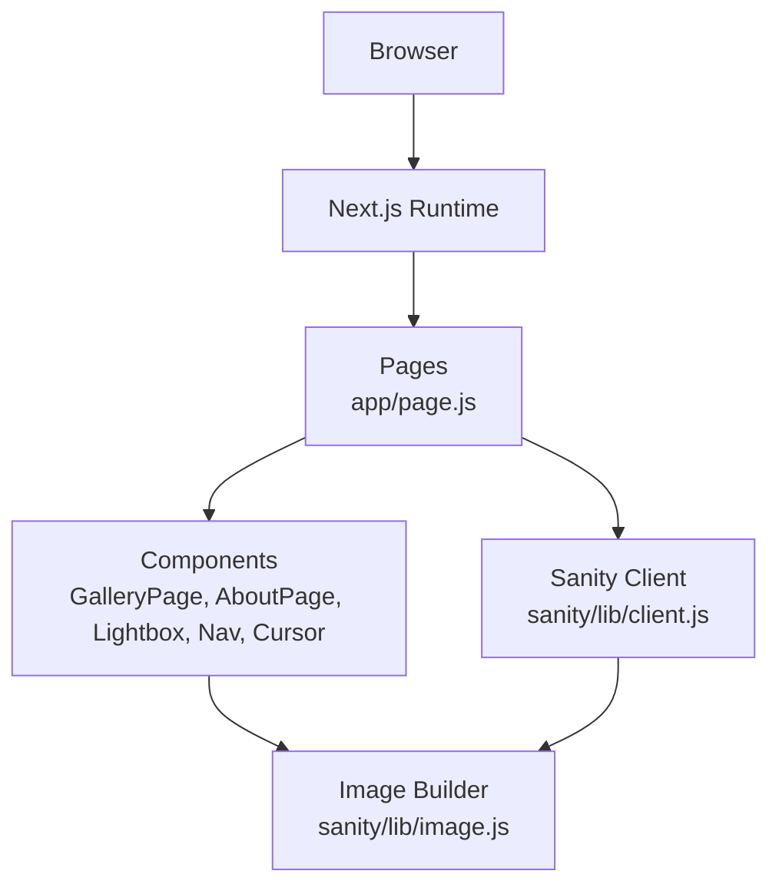
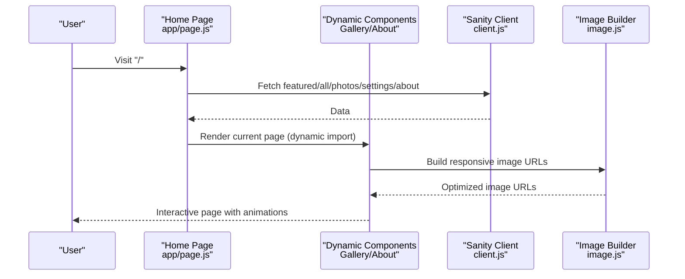
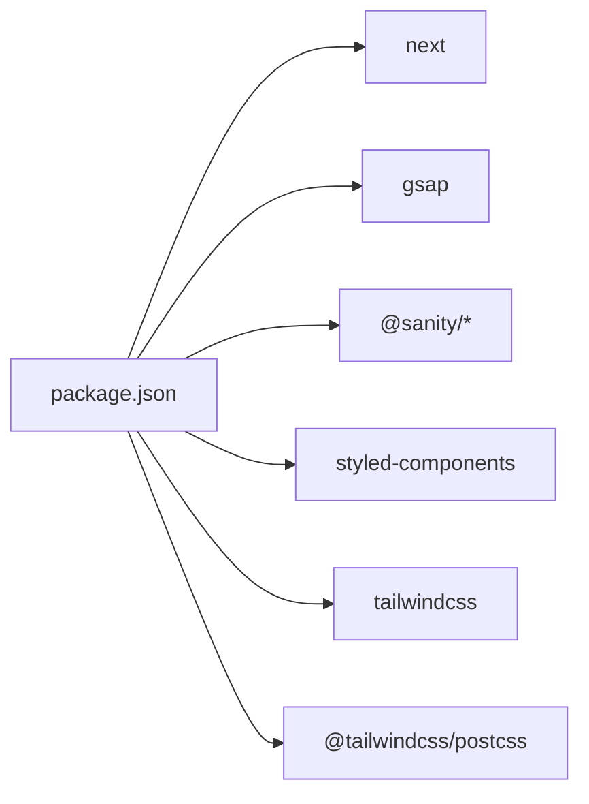

# Performance Optimization

<cite>
**Referenced Files in This Document**
- [package.json](file://package.json)
- [next.config.mjs](file://next.config.mjs)
- [postcss.config.mjs](file://postcss.config.mjs)
- [app/layout.js](file://app/layout.js)
- [app/globals.css](file://app/globals.css)
- [app/page.js](file://app/page.js)
- [app/components/GalleryPage.js](file://app/components/GalleryPage.js)
- [app/components/Lightbox.js](file://app/components/Lightbox.js)
- [app/components/Cursor.js](file://app/components/Cursor.js)
- [app/components/Nav.js](file://app/components/Nav.js)
- [app/components/AboutPage.js](file://app/components/AboutPage.js)
- [sanity/lib/client.js](file://sanity/lib/client.js)
- [sanity/lib/image.js](file://sanity/lib/image.js)
- [sanity/env.js](file://sanity/env.js)
- [sanity.config.js](file://sanity.config.js)
</cite>

## Table of Contents
1. [Introduction](#introduction)
2. [Project Structure](#project-structure)
3. [Core Components](#core-components)
4. [Architecture Overview](#architecture-overview)
5. [Detailed Component Analysis](#detailed-component-analysis)
6. [Dependency Analysis](#dependency-analysis)
7. [Performance Considerations](#performance-considerations)
8. [Troubleshooting Guide](#troubleshooting-guide)
9. [Conclusion](#conclusion)
10. [Appendices](#appendices)

## Introduction
This document provides a comprehensive performance optimization guide for the WRD Photography portfolio. It focuses on image loading strategies, Next.js optimizations, CSS optimization, runtime performance, Core Web Vitals improvements, build-time optimizations, monitoring, and mobile-specific considerations. Practical implementation references are included via file paths and line ranges to help you apply changes effectively.

## Project Structure
The portfolio is a Next.js 16 application with:
- Client-side React components under app/components
- Dynamic imports for page-level components to leverage code splitting
- Sanity CMS integration for content and images
- PostCSS/Tailwind pipeline for CSS processing
- Global styles and font optimization via next/font

**Diagram sources**
- [app/page.js:14-227](file://app/page.js#L14-L227)
- [app/components/GalleryPage.js:1-760](file://app/components/GalleryPage.js#L1-L760)
- [app/components/AboutPage.js:1-458](file://app/components/AboutPage.js#L1-L458)
- [app/components/Lightbox.js:1-303](file://app/components/Lightbox.js#L1-L303)
- [app/components/Nav.js:1-168](file://app/components/Nav.js#L1-L168)
- [app/components/Cursor.js:1-42](file://app/components/Cursor.js#L1-L42)
- [sanity/lib/client.js:1-10](file://sanity/lib/client.js#L1-L10)
- [sanity/lib/image.js:1-9](file://sanity/lib/image.js#L1-L9)

**Section sources**
- [package.json:1-31](file://package.json#L1-L31)
- [next.config.mjs:1-7](file://next.config.mjs#L1-L7)
- [postcss.config.mjs:1-8](file://postcss.config.mjs#L1-L8)
- [app/layout.js:1-40](file://app/layout.js#L1-L40)
- [app/globals.css:1-93](file://app/globals.css#L1-L93)

## Core Components
- Page loader and navigation orchestration with dynamic imports for page components
- Gallery and About pages with scroll-triggered animations and image rendering
- Lightbox component for optimized modal image viewing
- Cursor and navigation components with lightweight animations
- Sanity client and image URL builder for responsive image URLs

Key performance-sensitive areas:
- Dynamic imports for page components to split bundles
- On-demand GSAP imports to reduce initial JS payload
- Sanity client configured to bypass CDN for freshest data
- Image URLs generated with width and quality parameters

**Section sources**
- [app/page.js:14-227](file://app/page.js#L14-L227)
- [app/components/GalleryPage.js:1-760](file://app/components/GalleryPage.js#L1-L760)
- [app/components/AboutPage.js:1-458](file://app/components/AboutPage.js#L1-L458)
- [app/components/Lightbox.js:1-303](file://app/components/Lightbox.js#L1-L303)
- [app/components/Nav.js:1-168](file://app/components/Nav.js#L1-L168)
- [app/components/Cursor.js:1-42](file://app/components/Cursor.js#L1-L42)
- [sanity/lib/client.js:1-10](file://sanity/lib/client.js#L1-L10)
- [sanity/lib/image.js:1-9](file://sanity/lib/image.js#L1-L9)

## Architecture Overview
The runtime architecture emphasizes:
- Client-side routing and page switching with minimal re-rendering
- Lazy loading of heavy libraries (GSAP) and page components
- Responsive image URLs from Sanity with width and quality tuning
- Minimal global CSS with Tailwind-based utility classes

**Diagram sources**
- [app/page.js:106-131](file://app/page.js#L106-L131)
- [sanity/lib/client.js:4-9](file://sanity/lib/client.js#L4-L9)
- [sanity/lib/image.js:6-8](file://sanity/lib/image.js#L6-L8)
- [app/components/GalleryPage.js:250, 386, 487, 574, 651](file://app/components/GalleryPage.js#L250,L386,L487,L574,L651)
- [app/components/Lightbox.js:159-168](file://app/components/Lightbox.js#L159-L168)

## Detailed Component Analysis

### Image Loading Strategies
- Responsive image URLs: Width and quality parameters are applied per component to balance quality and bandwidth.
- Hero fallbacks: When hero images are unavailable, default URLs are used to avoid render delays.
- Lazy image rendering: Images are rendered after data loads; consider intersection observer-based lazy loading for offscreen images.

Recommended enhancements:
- Implement native loading="lazy" on images
- Add sizes and srcset attributes for responsive delivery
- Introduce intersection observer to defer image fetches until near viewport
- Consider WebP/AVIF formats via Sanity transformations if supported

**Section sources**
- [sanity/lib/image.js:6-8](file://sanity/lib/image.js#L6-L8)
- [app/components/GalleryPage.js:250, 386, 487, 574, 651](file://app/components/GalleryPage.js#L250,L386,L487,L574,L651)
- [app/components/Lightbox.js:159-168](file://app/components/Lightbox.js#L159-L168)
- [app/components/AboutPage.js:176-179, 294-299](file://app/components/AboutPage.js#L176-L179,L294-L299)

### Progressive Loading Techniques
- Intro animation with font readiness ensures smooth first paint
- Staggered reveals and scroll-triggered animations improve perceived performance
- Page transitions with opacity and transform reduce jank during navigation

Recommendations:
- Use skeleton placeholders for images while loading
- Implement preloading for critical fonts and assets
- Defer non-critical animations until after LCP

**Section sources**
- [app/page.js:33-101](file://app/page.js#L33-L101)
- [app/globals.css:75-79](file://app/globals.css#L75-L79)

### CDN Optimization
- Sanity client configured to bypass CDN for freshest content; production deployments should evaluate CDN caching policies for images and static assets.
- Consider enabling CDN for static assets and images served via Sanity transformations.

**Section sources**
- [sanity/lib/client.js:8](file://sanity/lib/client.js#L8)

### Next.js Optimizations
- Static generation: Not currently used; consider ISR/static export for content unlikely to change frequently.
- Code splitting: Dynamic imports for page components minimize initial bundle size.
- Bundle optimization: Keep external libraries like GSAP lazy-loaded to reduce TTFB and initial JS.

Recommendations:
- Enable experimental features cautiously (e.g., appDir optimizations)
- Analyze bundle composition with next/bundle-analyzer
- Use React Server Components where appropriate for server-rendered content

**Section sources**
- [app/page.js:9-11](file://app/page.js#L9-L11)
- [package.json:15](file://package.json#L15)

### CSS Optimization Techniques
- Tailwind via PostCSS: Ensure purge is configured for production builds to remove unused CSS.
- Critical CSS: Extract critical styles for above-the-fold content; defer non-critical CSS.
- Utility-first CSS: Favor Tailwind utilities to reduce custom CSS bloat.

Recommendations:
- Configure Purge/Content paths for Tailwind to scan app components
- Inline critical CSS for above-the-fold content
- Split large CSS files and lazy-load non-critical styles

**Section sources**
- [postcss.config.mjs:1-8](file://postcss.config.mjs#L1-L8)
- [app/globals.css:1-93](file://app/globals.css#L1-L93)

### Runtime Performance Improvements
- Component memoization: Wrap heavy components with memoization to prevent unnecessary re-renders.
- Animation performance: Use transform/opacity and will-change judiciously; prefer requestAnimationFrame for micro-animations.
- Memory management: Kill GSAP ScrollTriggers on component unmount; avoid global event listeners leaks.

**Section sources**
- [app/components/GalleryPage.js:215-220](file://app/components/GalleryPage.js#L215-L220)
- [app/components/AboutPage.js:157-162](file://app/components/AboutPage.js#L157-L162)
- [app/components/Cursor.js:14-21](file://app/components/Cursor.js#L14-L21)

### Core Web Vitals Optimization
- Largest Contentful Paint (LCP): Optimize hero images, defer non-critical images, and ensure above-the-fold content renders quickly.
- First Input Delay (FID): Reduce main-thread work, split bundles, and defer non-critical scripts.
- Cumulative Layout Shift (CLS): Reserve space for images with aspect ratios, avoid dynamic layout shifts, and keep navigation fixed.

**Section sources**
- [app/components/GalleryPage.js:240-304](file://app/components/GalleryPage.js#L240-L304)
- [app/components/AboutPage.js:202-256](file://app/components/AboutPage.js#L202-L256)

### Build-Time Optimizations
- Asset compression: Enable gzip/Brotli on the server; configure Next.js compression if needed.
- Deployment performance: Use static export for content that does not require server-side rendering; leverage CDN for assets.

**Section sources**
- [package.json:7](file://package.json#L7)

### Performance Monitoring and Debugging
- Use Lighthouse, WebPageTest, and Real User Monitoring (RUM) tools.
- Monitor FID/LCP/CLS metrics in production dashboards.
- Profile bundle size and analyze slow network conditions using throttling.

[No sources needed since this section provides general guidance]

### Mobile Performance Optimization and Throttling
- Prefer lighter animations on low-end devices; respect reduced-motion preferences.
- Use smaller image widths for mobile; test with device emulation and throttling.
- Minimize layout thrashing; batch DOM reads/writes.

**Section sources**
- [app/globals.css:81-83](file://app/globals.css#L81-L83)

## Dependency Analysis

**Diagram sources**
- [package.json:11-28](file://package.json#L11-L28)

**Section sources**
- [package.json:11-28](file://package.json#L11-L28)

## Performance Considerations
- Image delivery: Use width/quality parameters; consider lazy-loading and modern formats.
- Animations: Keep them lightweight; kill triggers on unmount.
- Fonts: next/font with display swap reduces FOIT/FOFT.
- Bundles: Dynamic imports and lazy external libraries reduce initial payload.
- CSS: Purge unused styles; extract critical CSS.

[No sources needed since this section provides general guidance]

## Troubleshooting Guide
- GSAP lifecycle: Ensure ScrollTrigger instances are killed on unmount to prevent memory leaks.
- Event listeners: Remove mousemove listeners on cleanup to avoid lingering handlers.
- Sanity data freshness: Confirm client.useCdn flag aligns with caching needs.

**Section sources**
- [app/components/GalleryPage.js:215-220](file://app/components/GalleryPage.js#L215-L220)
- [app/components/AboutPage.js:157-162](file://app/components/AboutPage.js#L157-L162)
- [app/components/Cursor.js:19-21](file://app/components/Cursor.js#L19-L21)
- [sanity/lib/client.js:8](file://sanity/lib/client.js#L8)

## Conclusion
By combining responsive image delivery, strategic code splitting, CSS purging, and careful animation management, the WRD Photography portfolio can achieve strong performance across devices. Focus on optimizing LCP with fast hero images, reducing FID through smaller bundles, and minimizing CLS with reserved spaces. Continuously monitor Core Web Vitals and iterate on optimizations based on real-world metrics.

[No sources needed since this section summarizes without analyzing specific files]

## Appendices
- Practical examples: See image URL construction and dynamic imports for guidance on applying optimizations.
- Measurement tools: Use Lighthouse, WebPageTest, and RUM platforms to validate improvements.

[No sources needed since this section provides general guidance]