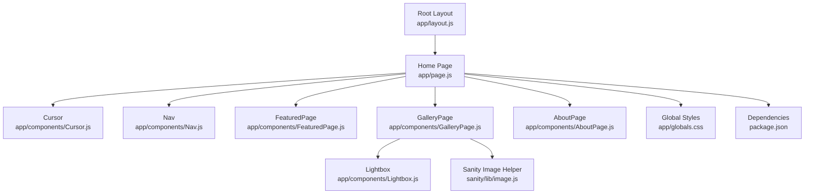
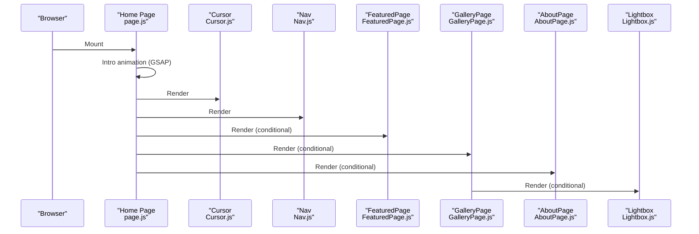
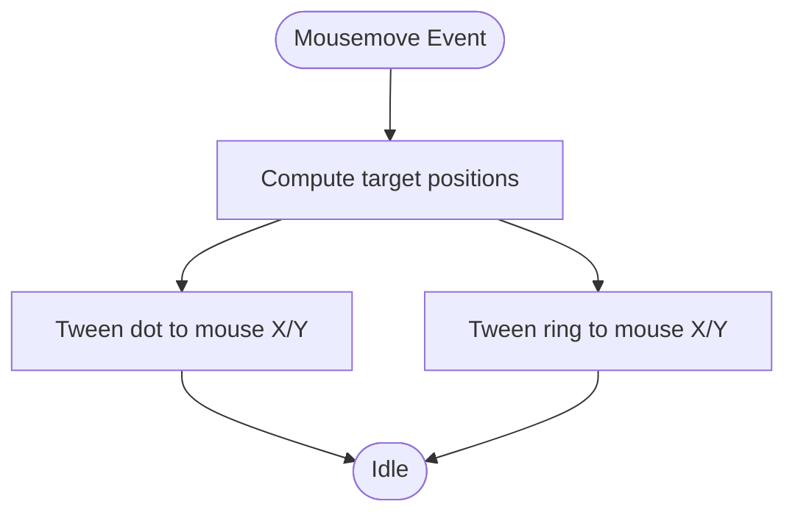
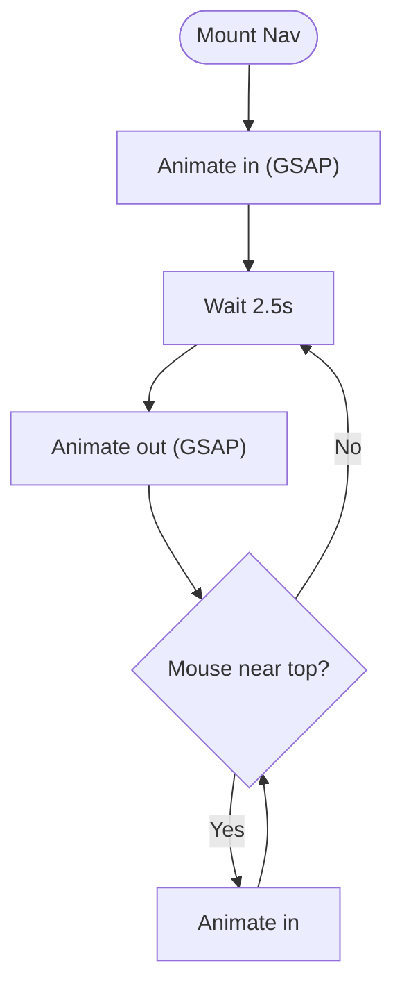
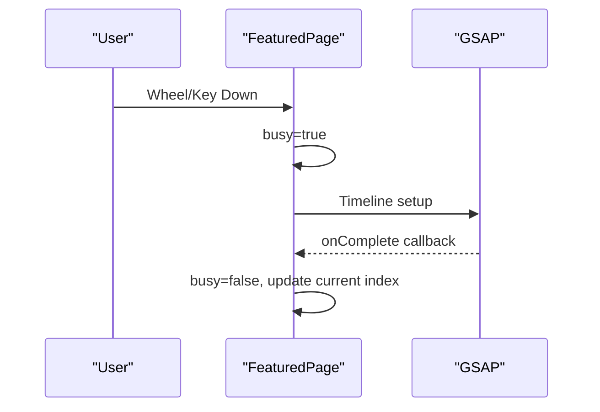
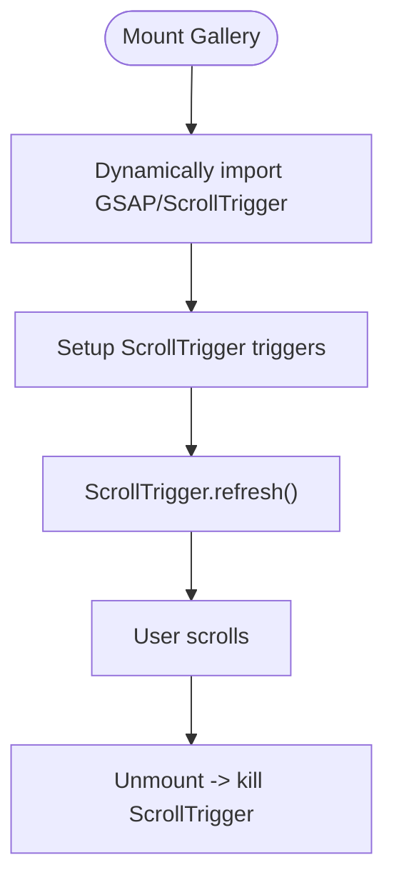
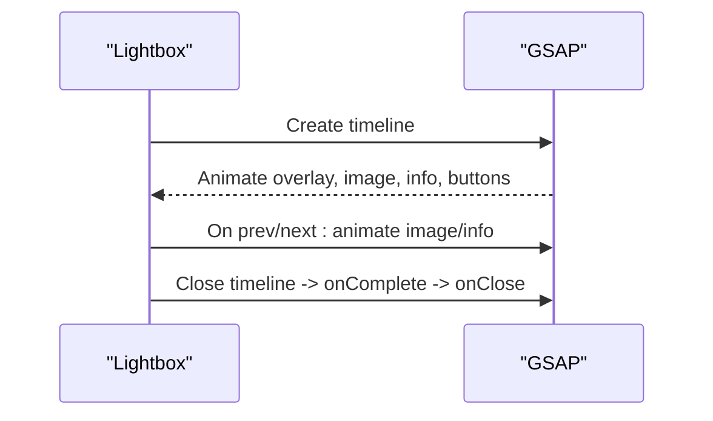
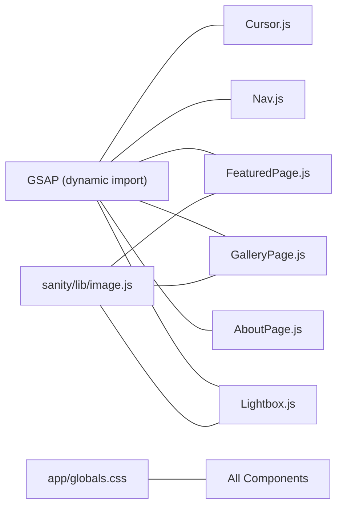

# Runtime Performance

<cite>
**Referenced Files in This Document**
- [Cursor.js](file://app/components/Cursor.js)
- [GalleryPage.js](file://app/components/GalleryPage.js)
- [Lightbox.js](file://app/components/Lightbox.js)
- [Nav.js](file://app/components/Nav.js)
- [FeaturedPage.js](file://app/components/FeaturedPage.js)
- [AboutPage.js](file://app/components/AboutPage.js)
- [page.js](file://app/page.js)
- [layout.js](file://app/layout.js)
- [globals.css](file://app/globals.css)
- [image.js](file://sanity/lib/image.js)
- [package.json](file://package.json)
- [next.config.mjs](file://next.config.mjs)
- [gsap-performance SKILL.md](file://.agents/skills/gsap-performance/SKILL.md)
- [gsap-react SKILL.md](file://.agents/skills/gsap-react/SKILL.md)
</cite>

## Table of Contents
1. [Introduction](#introduction)
2. [Project Structure](#project-structure)
3. [Core Components](#core-components)
4. [Architecture Overview](#architecture-overview)
5. [Detailed Component Analysis](#detailed-component-analysis)
6. [Dependency Analysis](#dependency-analysis)
7. [Performance Considerations](#performance-considerations)
8. [Troubleshooting Guide](#troubleshooting-guide)
9. [Conclusion](#conclusion)

## Introduction
This document provides a comprehensive runtime performance guide for the portfolio application. It focuses on component-level optimizations, user experience enhancements, and animation performance tuning using GSAP. It covers frame rate optimization, GPU acceleration, animation batching, component memoization strategies, React performance hooks, state management optimization, memory management for large photo collections, efficient event handling, DOM manipulation optimization, performance monitoring during user interactions, input delay optimization, smooth scrolling, throttling and debouncing strategies, efficient rendering patterns, practical profiling examples, bottleneck identification, and mobile-specific optimizations.

## Project Structure
The application is a Next.js app with a client-side focused UI and heavy use of GSAP for animations and ScrollTrigger for scroll-driven effects. Key areas relevant to performance include:
- Page composition and navigation orchestration
- Gallery and lightbox experiences with large media
- Cursor and navigation micro-interactions
- Scroll-triggered animations and parallax
- Image sizing and quality via Sanity image helpers

**Diagram sources**
- [layout.js:31-39](file://app/layout.js#L31-L39)
- [page.js:14-227](file://app/page.js#L14-L227)
- [Cursor.js:5-41](file://app/components/Cursor.js#L5-L41)
- [Nav.js:4-168](file://app/components/Nav.js#L4-L168)
- [FeaturedPage.js:6-269](file://app/components/FeaturedPage.js#L6-L269)
- [GalleryPage.js:6-760](file://app/components/GalleryPage.js#L6-L760)
- [AboutPage.js:5-458](file://app/components/AboutPage.js#L5-L458)
- [Lightbox.js:5-303](file://app/components/Lightbox.js#L5-L303)
- [image.js:6-8](file://sanity/lib/image.js#L6-L8)
- [globals.css:53-93](file://app/globals.css#L53-L93)
- [package.json:11-22](file://package.json#L11-L22)

**Section sources**
- [layout.js:31-39](file://app/layout.js#L31-L39)
- [page.js:14-227](file://app/page.js#L14-L227)
- [globals.css:53-93](file://app/globals.css#L53-L93)
- [package.json:11-22](file://package.json#L11-L22)

## Core Components
- Cursor: Lightweight mouse follower using GSAP to move a ring and a dot with minimal DOM updates.
- Nav: Animated navigation bar with GSAP-driven show/hide on scroll/move, using will-change for GPU promotion.
- FeaturedPage: Fullscreen slideshow with GSAP-driven transitions, wheel/keyboard controls, and layered transforms.
- GalleryPage: Scroll-driven layouts with horizontal track, masonry reveals, and parallax overlays using ScrollTrigger.
- AboutPage: Scroll-triggered reveals for text, stats, and collage images.
- Lightbox: Modal with GSAP timeline open/close, image swap transitions, and keyboard navigation.
- Global Styles: CSS variables, reduced motion support, and scrollbars optimized for performance.

**Section sources**
- [Cursor.js:5-41](file://app/components/Cursor.js#L5-L41)
- [Nav.js:4-168](file://app/components/Nav.js#L4-L168)
- [FeaturedPage.js:6-269](file://app/components/FeaturedPage.js#L6-L269)
- [GalleryPage.js:6-760](file://app/components/GalleryPage.js#L6-L760)
- [AboutPage.js:5-458](file://app/components/AboutPage.js#L5-L458)
- [Lightbox.js:5-303](file://app/components/Lightbox.js#L5-L303)
- [globals.css:53-93](file://app/globals.css#L53-L93)

## Architecture Overview
The runtime performance architecture centers on:
- Client-side orchestration in the home page coordinating page switching, intro animation, and global UI.
- Component-specific GSAP orchestration for micro-interactions and macro-experiences.
- Scroll-driven animations via ScrollTrigger for immersive layouts.
- Efficient image loading through Sanity image URLs with width and quality parameters.

**Diagram sources**
- [page.js:14-227](file://app/page.js#L14-L227)
- [Cursor.js:5-41](file://app/components/Cursor.js#L5-L41)
- [Nav.js:4-168](file://app/components/Nav.js#L4-L168)
- [FeaturedPage.js:6-269](file://app/components/FeaturedPage.js#L6-L269)
- [GalleryPage.js:6-760](file://app/components/GalleryPage.js#L6-L760)
- [AboutPage.js:5-458](file://app/components/AboutPage.js#L5-L458)
- [Lightbox.js:5-303](file://app/components/Lightbox.js#L5-L303)

## Detailed Component Analysis

### Cursor Micro-Interaction
- Uses GSAP to animate two concentric elements (dot and ring) on mousemove with short durations and overwrite behavior to prevent queue buildup.
- Leverages refs to target DOM nodes directly and avoids selector churn.
- Minimal DOM overhead with fixed positioning and blend modes.

**Diagram sources**
- [Cursor.js:14-21](file://app/components/Cursor.js#L14-L21)

**Section sources**
- [Cursor.js:5-41](file://app/components/Cursor.js#L5-L41)

### Navigation Auto-Hide with GSAP
- On mount, animates nav into view, then hides after a delay unless the mouse approaches the top.
- Uses will-change on the nav container to hint GPU promotion.
- Mousemove detection toggles show/hide with GSAP tweens.

**Diagram sources**
- [Nav.js:10-68](file://app/components/Nav.js#L10-L68)

**Section sources**
- [Nav.js:4-168](file://app/components/Nav.js#L4-L168)

### Featured Slideshow Transitions
- Implements a fullscreen slideshow with layered transforms and rotations for smooth crossfades.
- Prevents concurrent animations with a busy flag and orchestrates GSAP timelines for coordinated motion.
- Uses GSAP to set initial states and staggered reveals for text lines.

**Diagram sources**
- [FeaturedPage.js:56-105](file://app/components/FeaturedPage.js#L56-L105)

**Section sources**
- [FeaturedPage.js:6-269](file://app/components/FeaturedPage.js#L6-L269)

### Gallery Scroll-Driven Layouts
- Initializes GSAP and ScrollTrigger dynamically on first mount.
- Implements character-split text reveals, parallax backgrounds, scrubbed overlays, horizontal track with pinning, masonry staggered reveals, and portrait card animations.
- Uses ScrollTrigger.refresh() after content initialization and kills triggers on unmount.

**Diagram sources**
- [GalleryPage.js:51-220](file://app/components/GalleryPage.js#L51-L220)

**Section sources**
- [GalleryPage.js:6-760](file://app/components/GalleryPage.js#L6-L760)

### About Scroll-Linked Reveal
- Similar pattern to Gallery: dynamic import of GSAP/ScrollTrigger, setup of multiple ScrollTrigger instances, and cleanup on unmount.
- Includes word-by-word reveals, stats count-up, and collage image animations.

**Section sources**
- [AboutPage.js:11-162](file://app/components/AboutPage.js#L11-L162)

### Lightbox Modal Animation
- Opens with a composed timeline: overlay fade, image scale-up, info panel slide, close button and nav arrows appear.
- Swaps images with a short tween on prev/next.
- Closes with a reverse timeline and invokes onClose callback.

**Diagram sources**
- [Lightbox.js:15-90](file://app/components/Lightbox.js#L15-L90)

**Section sources**
- [Lightbox.js:5-303](file://app/components/Lightbox.js#L5-L303)

### Home Page Orchestration and Intro
- Coordinates intro SVG animation using GSAP with font readiness checks.
- Dynamically imports page components to avoid SSR and reduce initial bundle.
- Uses requestAnimationFrame to gate page-entered state after intro completes.

**Section sources**
- [page.js:14-101](file://app/page.js#L14-L101)
- [page.js:136-145](file://app/page.js#L136-L145)
- [page.js:195-227](file://app/page.js#L195-L227)

## Dependency Analysis
- GSAP and ScrollTrigger are imported dynamically per component to minimize initial payload.
- Sanity image utilities centralize image URL generation with width and quality parameters.
- Global CSS defines color tokens, reduced motion support, and scrollbar styling.

**Diagram sources**
- [Cursor.js:3](file://app/components/Cursor.js#L3)
- [Nav.js:11](file://app/components/Nav.js#L11)
- [FeaturedPage.js:3](file://app/components/FeaturedPage.js#L3)
- [GalleryPage.js:56-57](file://app/components/GalleryPage.js#L56-L57)
- [AboutPage.js:16-17](file://app/components/AboutPage.js#L16-L17)
- [Lightbox.js:18](file://app/components/Lightbox.js#L18)
- [image.js:6-8](file://sanity/lib/image.js#L6-L8)
- [globals.css:53-93](file://app/globals.css#L53-L93)

**Section sources**
- [package.json:11-22](file://package.json#L11-L22)
- [image.js:6-8](file://sanity/lib/image.js#L6-L8)
- [globals.css:53-93](file://app/globals.css#L53-L93)

## Performance Considerations

### GSAP Frame Rate Optimization and GPU Acceleration
- Prefer transform and opacity for animations to keep work on the compositor and avoid layout/paint.
- Use will-change on elements that animate to hint the browser to promote layers.
- Batch reads and writes; avoid interleaving layout reads and writes.
- Reuse timelines and avoid creating hundreds of overlapping tweens; throttle frequent updates.

Practical guidance aligned with repository patterns:
- Cursor and Nav use short-duration tweens and overwrite behavior to prevent queue buildup.
- FeaturedPage uses busy flags to prevent concurrent animations and orchestrates timelines for coordinated motion.
- GalleryPage and AboutPage leverage ScrollTrigger with scrubbing and pinning judiciously; refresh only when layout changes.

**Section sources**
- [Cursor.js:14-21](file://app/components/Cursor.js#L14-L21)
- [Nav.js:103](file://app/components/Nav.js#L103)
- [FeaturedPage.js:56-105](file://app/components/FeaturedPage.js#L56-L105)
- [GalleryPage.js:51-220](file://app/components/GalleryPage.js#L51-L220)
- [AboutPage.js:11-162](file://app/components/AboutPage.js#L11-L162)
- [gsap-performance SKILL.md:15-31](file://.agents/skills/gsap-performance/SKILL.md#L15-L31)
- [gsap-performance SKILL.md:32-36](file://.agents/skills/gsap-performance/SKILL.md#L32-L36)
- [gsap-performance SKILL.md:67-72](file://.agents/skills/gsap-performance/SKILL.md#L67-L72)

### Animation Batching and Throttling
- Use gsap.quickTo() for frequently updated properties (e.g., mouse followers) to reuse a single tween.
- For scroll-driven animations, prefer small scrub values and debounce refresh calls when layout changes occur.

**Section sources**
- [gsap-performance SKILL.md:42-54](file://.agents/skills/gsap-performance/SKILL.md#L42-L54)
- [gsap-performance SKILL.md:56-61](file://.agents/skills/gsap-performance/SKILL.md#L56-L61)

### Component Memoization Strategies and React Hooks
- Use refs to cache DOM nodes and avoid selector churn; pass refs as scopes to keep selectors scoped and efficient.
- Keep dependency arrays tight in useEffect/useGSAP to prevent unnecessary reinitialization.
- Revert GSAP contexts in cleanup to avoid leaks and detached-node updates.

**Section sources**
- [gsap-react SKILL.md:45-61](file://.agents/skills/gsap-react/SKILL.md#L45-L61)
- [gsap-react SKILL.md:63-75](file://.agents/skills/gsap-react/SKILL.md#L63-L75)
- [gsap-react SKILL.md:77-80](file://.agents/skills/gsap-react/SKILL.md#L77-L80)

### State Management Optimization
- Gate expensive operations behind flags (e.g., busy in slideshow) to prevent race conditions and redundant work.
- Defer heavy initialization until after content loads (e.g., dynamic imports of GSAP/ScrollTrigger).
- Use local state minimally; derive values from props and refs where possible.

**Section sources**
- [FeaturedPage.js:56-105](file://app/components/FeaturedPage.js#L56-L105)
- [GalleryPage.js:51-220](file://app/components/GalleryPage.js#L51-L220)
- [AboutPage.js:11-162](file://app/components/AboutPage.js#L11-L162)

### Memory Management for Large Photo Collections
- Lazy-load heavy assets; use appropriate widths and quality parameters from the image utility.
- Avoid retaining references to detached nodes; kill ScrollTrigger instances on unmount.
- Limit DOM nodes per render; prefer virtualization for very long lists (conceptual guidance).

**Section sources**
- [image.js:6-8](file://sanity/lib/image.js#L6-L8)
- [GalleryPage.js:215-219](file://app/components/GalleryPage.js#L215-L219)
- [AboutPage.js:157-161](file://app/components/AboutPage.js#L157-L161)

### Efficient Event Handling and DOM Manipulation
- Attach and detach event listeners in useEffect cleanup to prevent leaks.
- Use transform and opacity for interactive feedback; avoid layout-affecting properties.
- Minimize inline styles; prefer CSS variables and global styles for theme-driven updates.

**Section sources**
- [Cursor.js:19-21](file://app/components/Cursor.js#L19-L21)
- [Nav.js:47-49](file://app/components/Nav.js#L47-L49)
- [globals.css:53-93](file://app/globals.css#L53-L93)

### Smooth Scrolling and Input Delay Optimization
- Use ScrollTrigger with small scrub values for responsive scrolling.
- Debounce refresh calls; call ScrollTrigger.refresh() only when layout changes.
- Provide reduced-motion variants for animations.

**Section sources**
- [GalleryPage.js:210](file://app/components/GalleryPage.js#L210)
- [AboutPage.js:152](file://app/components/AboutPage.js#L152)
- [globals.css:81-83](file://app/globals.css#L81-L83)

### Practical Examples and Profiling
- Profile with browser devtools to measure frame budget and identify layout thrashing.
- Use the “Performance” panel to capture interactions (scroll, hover, keyboard) and inspect long tasks.
- Measure ScrollTrigger-heavy sections with “Layers” and “Paint Flashing” to verify compositing benefits.
- Validate image sizes and network impact using the “Network” panel with real device emulation.

[No sources needed since this section provides general guidance]

### Mobile-Specific Optimizations and Touch Interactions
- Prefer pointer events and touch-friendly hit areas; avoid hover-only interactions.
- Test ScrollTrigger scrubbing on lower-end devices; adjust scrub values accordingly.
- Use reduced-motion media queries to disable or simplify animations on user preference.
- Ensure adequate tap targets and avoid accidental clicks on draggable content.

**Section sources**
- [globals.css:81-83](file://app/globals.css#L81-L83)

## Troubleshooting Guide
- Stray animations or triggers: Ensure ScrollTrigger.getAll().forEach(t => t.kill()) is called on unmount in components that initialize ScrollTrigger.
- Jank during scroll: Verify that transform and opacity are used; check for layout-affecting property animations.
- Excessive memory usage: Confirm refs are cleared and DOM nodes are not retained after unmount; kill tweens and revert contexts.
- Poor input responsiveness: Reduce frequency of frequent updates; consider throttling or using quickTo for mousemove.

**Section sources**
- [GalleryPage.js:215-219](file://app/components/GalleryPage.js#L215-L219)
- [AboutPage.js:157-161](file://app/components/AboutPage.js#L157-L161)
- [gsap-performance SKILL.md:74-79](file://.agents/skills/gsap-performance/SKILL.md#L74-L79)

## Conclusion
The application achieves strong visual performance by combining targeted GSAP animations with ScrollTrigger-driven scroll experiences, while maintaining a lean runtime through dynamic imports, refs, and careful cleanup. By adhering to transform/opacity-first animations, batching updates, and optimizing event handling, the system remains responsive across devices. The included patterns and guidelines provide a blueprint for sustaining performance as the application evolves.