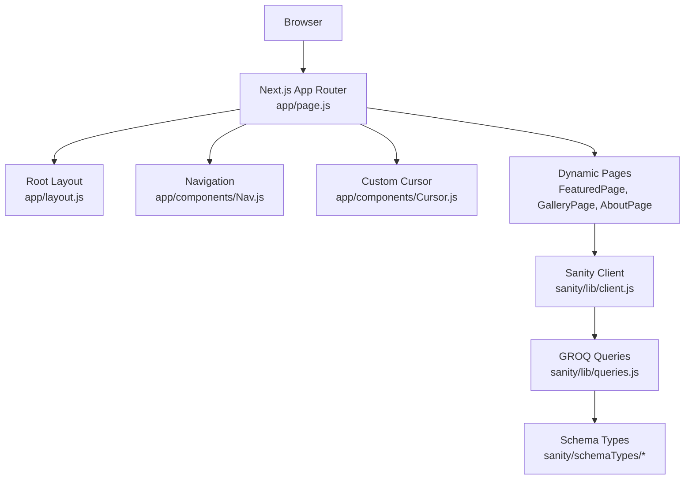
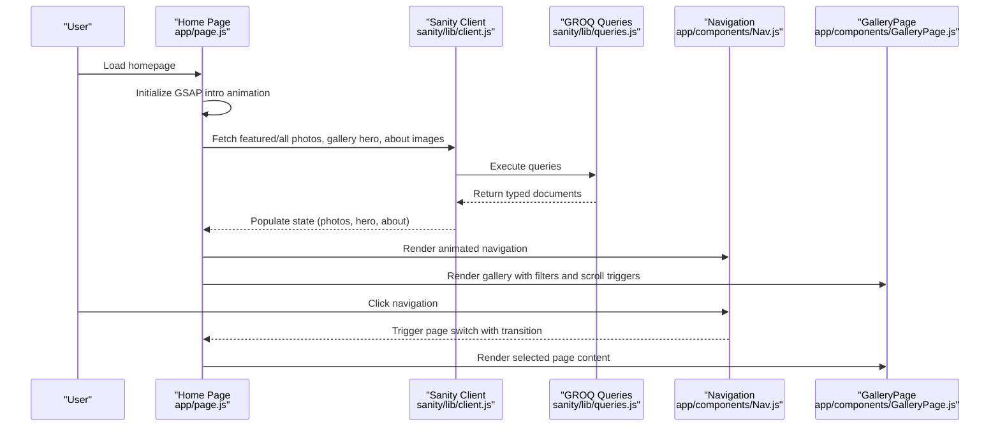
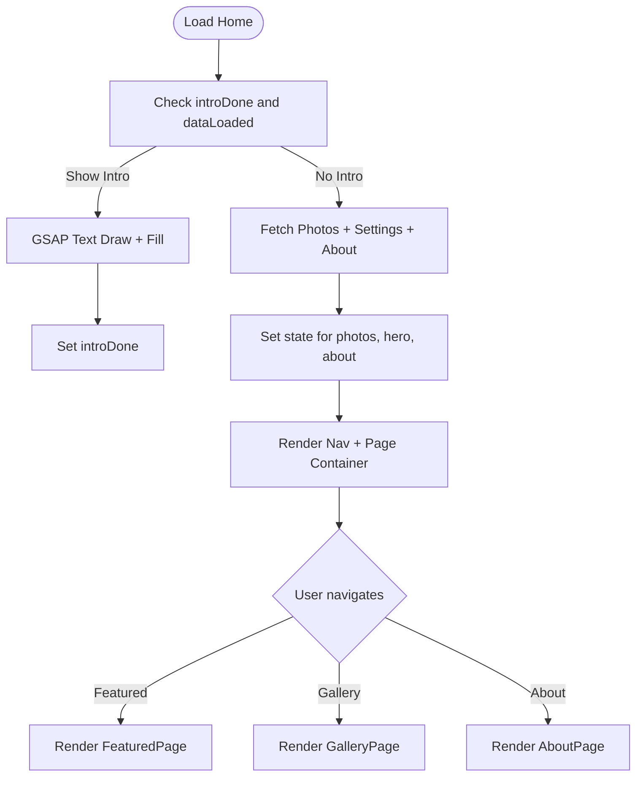
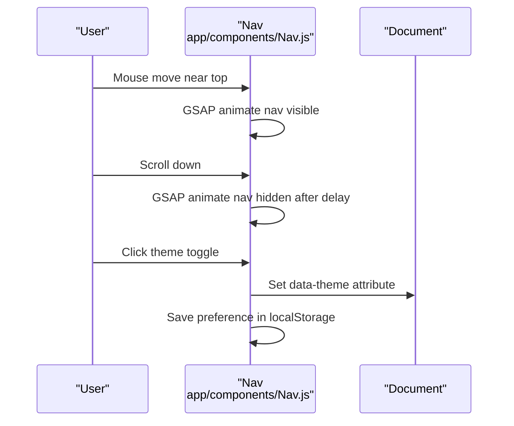
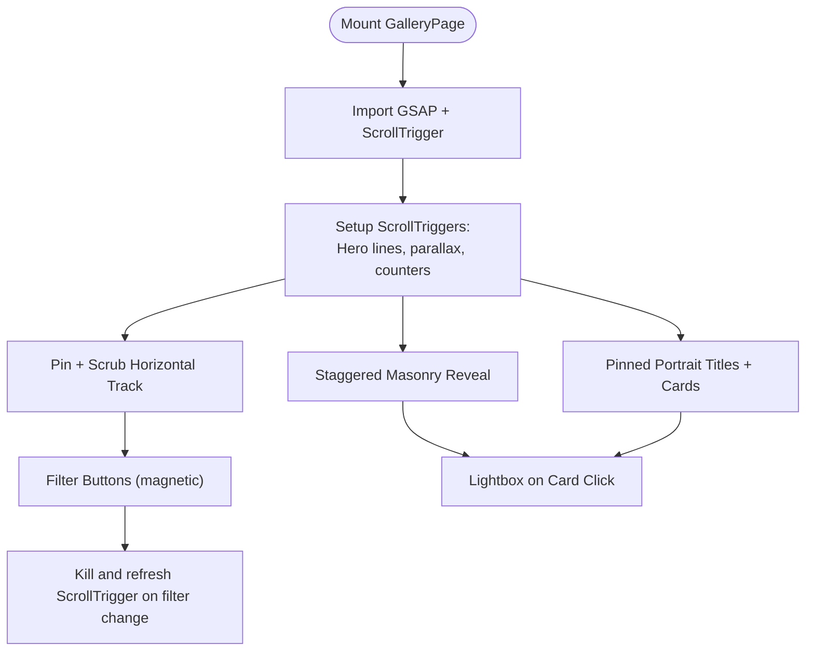
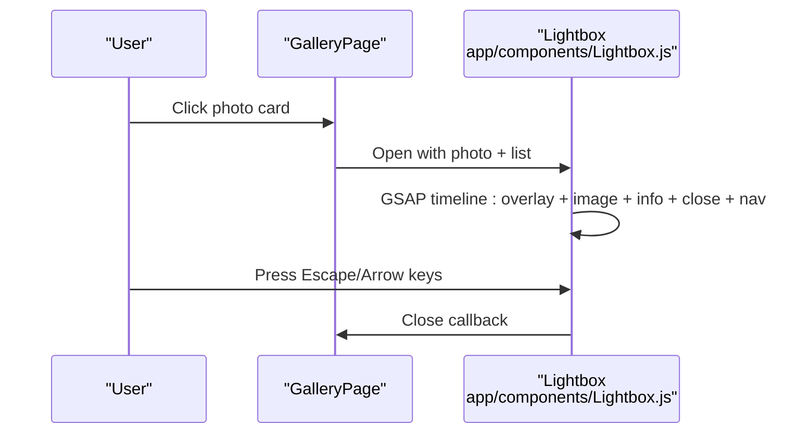
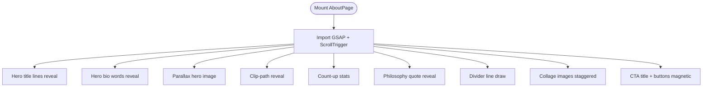
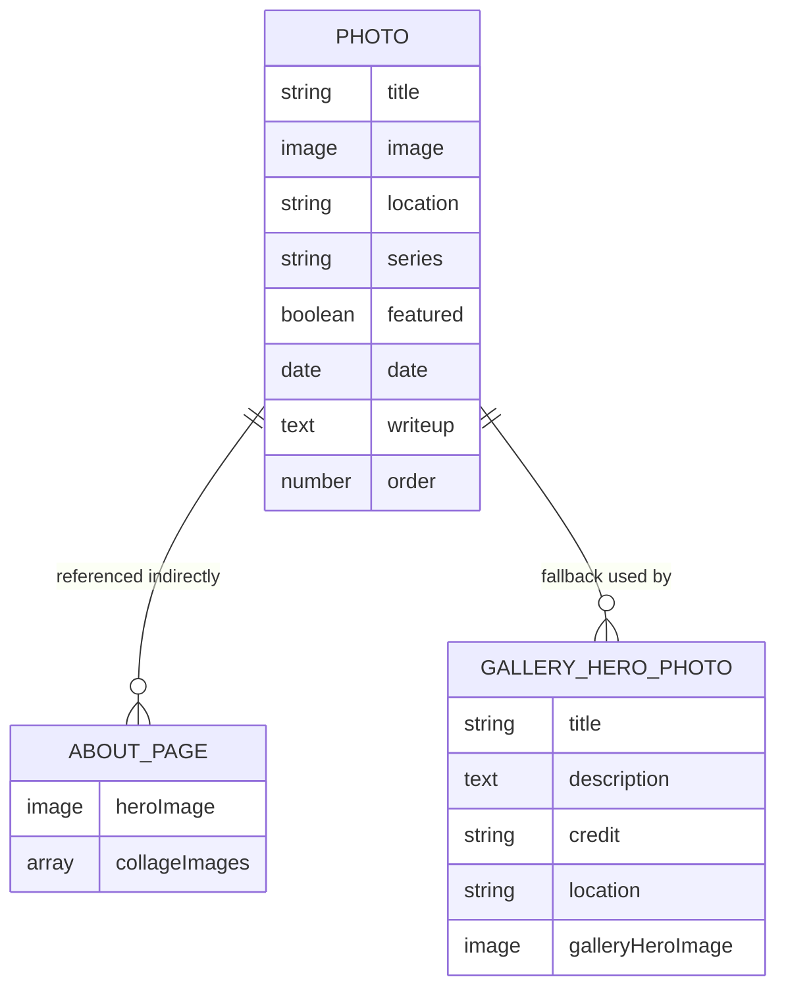
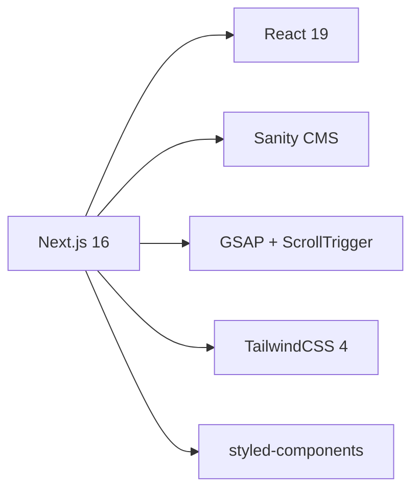

# Project Overview

<cite>
**Referenced Files in This Document**
- [README.md](file://README.md)
- [package.json](file://package.json)
- [app/layout.js](file://app/layout.js)
- [app/page.js](file://app/page.js)
- [app/components/Nav.js](file://app/components/Nav.js)
- [app/components/Cursor.js](file://app/components/Cursor.js)
- [app/components/GalleryPage.js](file://app/components/GalleryPage.js)
- [app/components/Lightbox.js](file://app/components/Lightbox.js)
- [app/components/AboutPage.js](file://app/components/AboutPage.js)
- [sanity/lib/client.js](file://sanity/lib/client.js)
- [sanity/lib/queries.js](file://sanity/lib/queries.js)
- [sanity/schemaTypes/photo.js](file://sanity/schemaTypes/photo.js)
- [sanity/schemaTypes/aboutPage.js](file://sanity/schemaTypes/aboutPage.js)
- [sanity/schemaTypes/siteSettings.js](file://sanity/schemaTypes/siteSettings.js)
</cite>

## Table of Contents
1. [Introduction](#introduction)
2. [Project Structure](#project-structure)
3. [Core Components](#core-components)
4. [Architecture Overview](#architecture-overview)
5. [Detailed Component Analysis](#detailed-component-analysis)
6. [Dependency Analysis](#dependency-analysis)
7. [Performance Considerations](#performance-considerations)
8. [Troubleshooting Guide](#troubleshooting-guide)
9. [Conclusion](#conclusion)

## Introduction
WRD Photography is a professional photography portfolio website showcasing a Cambodia-focused collection spanning street, rural, landscape, and portrait photography. It serves as a digital showcase for a personal archive, emphasizing artistic storytelling and immersive visual experiences. The platform targets photography enthusiasts, art collectors, and potential clients seeking authentic, context-rich imagery from Southeast Asia.

The project’s artistic vision centers on capturing the human condition and landscapes of Cambodia through intentional framing and narrative context. The site balances aesthetic minimalism with interactive storytelling, using modern web technologies to deliver a premium viewing experience.

## Project Structure
The project follows a Next.js 16 App Router architecture with a clear separation of concerns:
- Frontend: Next.js 16 with React 19, styled via CSS-in-JS and CSS variables for theming.
- Content Management: Sanity CMS with GROQ queries for real-time content delivery.
- Animations: GSAP for scroll-driven and micro-interaction animations.
- UX Enhancements: Dynamic loading screens, animated navigation, interactive galleries, and a lightbox viewer.

**Diagram sources**
- [app/page.js:14-227](file://app/page.js#L14-L227)
- [app/layout.js:31-39](file://app/layout.js#L31-L39)
- [app/components/Nav.js:4-168](file://app/components/Nav.js#L4-L168)
- [app/components/Cursor.js:5-42](file://app/components/Cursor.js#L5-L42)
- [sanity/lib/client.js:1-10](file://sanity/lib/client.js#L1-L10)
- [sanity/lib/queries.js:1-33](file://sanity/lib/queries.js#L1-L33)
- [sanity/schemaTypes/photo.js:1-93](file://sanity/schemaTypes/photo.js#L1-L93)

**Section sources**
- [README.md:1-37](file://README.md#L1-L37)
- [package.json:1-31](file://package.json#L1-L31)
- [app/layout.js:1-40](file://app/layout.js#L1-L40)

## Core Components
- Interactive Navigation with Animated Entrance and Auto-Hide on Scroll
- Animated Loading Screen with GSAP Text Reveal
- Dynamic Photo Galleries with Filtered Sections and Horizontal Scroll
- Scroll-Driven Animations for Hero Titles, Parallax Backgrounds, and Staggered Reveal Effects
- Lightbox Viewer with Keyboard Navigation and Smooth Transitions
- Custom Cursor with Magnetic Hover Effects
- Real-Time Content Management via Sanity CMS and GROQ Queries

Practical examples of visual impact and user experience:
- Animated hero text drawing and fill-in effect on initial load.
- Magnetic filter buttons and hover overlays on gallery cards.
- Parallax hero backgrounds and scrubbed opacity overlays during scroll.
- Lightbox with staggered entrance animations and keyboard navigation.
- Auto-hiding navigation that reappears on mouse movement near the viewport top.

**Section sources**
- [app/page.js:31-101](file://app/page.js#L31-L101)
- [app/components/Nav.js:10-68](file://app/components/Nav.js#L10-L68)
- [app/components/GalleryPage.js:51-220](file://app/components/GalleryPage.js#L51-L220)
- [app/components/Lightbox.js:14-90](file://app/components/Lightbox.js#L14-L90)
- [app/components/Cursor.js:9-21](file://app/components/Cursor.js#L9-L21)

## Architecture Overview
The system integrates frontend rendering, content fetching, and animation orchestration:
- The root layout defines global fonts and metadata.
- The home page initializes GSAP animations, fetches content from Sanity, and renders dynamic pages.
- Sanity client and GROQ queries supply structured content for galleries, about page, and hero settings.
- GSAP powers micro-interactions (cursor, nav, buttons) and scroll-triggered animations.

**Diagram sources**
- [app/page.js:106-131](file://app/page.js#L106-L131)
- [sanity/lib/client.js:1-10](file://sanity/lib/client.js#L1-L10)
- [sanity/lib/queries.js:3-32](file://sanity/lib/queries.js#L3-L32)
- [app/components/Nav.js:136-145](file://app/components/Nav.js#L136-L145)
- [app/components/GalleryPage.js:6-26](file://app/components/GalleryPage.js#L6-L26)

**Section sources**
- [app/layout.js:26-29](file://app/layout.js#L26-L29)
- [app/page.js:14-227](file://app/page.js#L14-L227)
- [sanity/lib/client.js:4-9](file://sanity/lib/client.js#L4-L9)
- [sanity/lib/queries.js:3-32](file://sanity/lib/queries.js#L3-L32)

## Detailed Component Analysis

### Home Page and Intro Animation
The home page coordinates:
- A fixed SVG-based intro screen with a drawn-text reveal using GSAP timelines.
- Concurrent data fetching from Sanity using multiple GROQ queries.
- A smooth page switch mechanism between featured, gallery, and about views.

**Diagram sources**
- [app/page.js:31-101](file://app/page.js#L31-L101)
- [app/page.js:106-131](file://app/page.js#L106-L131)
- [app/page.js:136-145](file://app/page.js#L136-L145)

**Section sources**
- [app/page.js:14-227](file://app/page.js#L14-L227)

### Navigation and Theme Toggle
The navigation component:
- Animates into view on load and auto-hides on inactivity.
- Responds to mouse movement near the viewport top/bottom.
- Provides a theme toggle persisted in localStorage and applied to the document element.

**Diagram sources**
- [app/components/Nav.js:10-68](file://app/components/Nav.js#L10-L68)
- [app/components/Nav.js:70-83](file://app/components/Nav.js#L70-L83)

**Section sources**
- [app/components/Nav.js:4-168](file://app/components/Nav.js#L4-L168)

### Gallery Page and Scroll-Driven Animations
The gallery page implements:
- Hero character-split text reveal and eyebrow fade-in.
- Parallax background and overlay scrubbing during scroll.
- Horizontal scrolling track for the street series with tilted cards.
- Masonry layouts for rural and landscape sections with staggered reveals.
- Portrait cards with pinned text and staggered reveals.
- A photo counter that scrubs during scroll.
- A lightbox viewer with keyboard navigation and magnetic button effects.

**Diagram sources**
- [app/components/GalleryPage.js:51-220](file://app/components/GalleryPage.js#L51-L220)
- [app/components/GalleryPage.js:222-232](file://app/components/GalleryPage.js#L222-L232)
- [app/components/GalleryPage.js:748-757](file://app/components/GalleryPage.js#L748-L757)

**Section sources**
- [app/components/GalleryPage.js:6-760](file://app/components/GalleryPage.js#L6-L760)

### Lightbox Viewer
The lightbox provides:
- Overlay fade-in and image scale-up on open.
- Info panel slide-up and close button rotation.
- Keyboard navigation (Escape, Arrow keys) and magnetic hover effects on nav buttons.

**Diagram sources**
- [app/components/GalleryPage.js:17-37](file://app/components/GalleryPage.js#L17-L37)
- [app/components/Lightbox.js:14-90](file://app/components/Lightbox.js#L14-L90)

**Section sources**
- [app/components/Lightbox.js:5-303](file://app/components/Lightbox.js#L5-L303)

### About Page and Scroll Interactions
The about page features:
- Line-by-line hero title reveal and eyebrow animation.
- Word-by-word hero bio reveal.
- Parallax hero image and clipped reveal.
- Stats count-up animations.
- Philosophy quote reveal and divider line draw.
- Collage image staggered reveals.
- Magnetic CTA buttons and section labels.

**Diagram sources**
- [app/components/AboutPage.js:11-162](file://app/components/AboutPage.js#L11-L162)

**Section sources**
- [app/components/AboutPage.js:5-458](file://app/components/AboutPage.js#L5-L458)

### Content Model and Data Flow
Sanity schema types define the content model:
- Photo document with fields for title, image, location, series, featured flag, date, writeup, and order.
- About page document with hero image and collage images.
- Gallery hero document for optional gallery hero image fallback.

**Diagram sources**
- [sanity/schemaTypes/photo.js:5-62](file://sanity/schemaTypes/photo.js#L5-L62)
- [sanity/schemaTypes/aboutPage.js:5-19](file://sanity/schemaTypes/aboutPage.js#L5-L19)
- [sanity/schemaTypes/siteSettings.js:5-33](file://sanity/schemaTypes/siteSettings.js#L5-L33)

**Section sources**
- [sanity/schemaTypes/photo.js:1-93](file://sanity/schemaTypes/photo.js#L1-L93)
- [sanity/schemaTypes/aboutPage.js:1-27](file://sanity/schemaTypes/aboutPage.js#L1-L27)
- [sanity/schemaTypes/siteSettings.js:1-48](file://sanity/schemaTypes/siteSettings.js#L1-L48)

## Dependency Analysis
Technology stack summary:
- Next.js 16 for the frontend framework and App Router.
- React 19 for component model and hooks.
- Sanity CMS for content modeling and headless content delivery.
- GSAP for micro-interactions and scroll-driven animations.
- TailwindCSS 4 via PostCSS for utility-first styling.
- Styled Components for scoped styles where needed.

**Diagram sources**
- [package.json:11-22](file://package.json#L11-L22)

**Section sources**
- [package.json:1-31](file://package.json#L1-L31)

## Performance Considerations
- Lazy-load heavy animations and plugins (GSAP modules) using dynamic imports to reduce initial bundle size.
- Use responsive image transformations via Sanity image helpers to optimize bandwidth.
- Pin and scrub only essential elements in scroll-driven animations to minimize layout thrashing.
- Defer non-critical UI updates until after the initial render and data fetch.
- Keep animation timelines concise and avoid excessive DOM reads/writes.

## Troubleshooting Guide
Common issues and resolutions:
- Fonts not loading during intro animation: Wait for `document.fonts.ready` before measuring text length to prevent layout shifts.
- ScrollTrigger conflicts on filter change: Kill existing triggers and refresh on filter updates.
- Lightbox keyboard events not firing: Ensure event listeners are attached after mount and removed on unmount.
- Theme persistence: Verify localStorage key and document attribute updates on toggle.

**Section sources**
- [app/page.js:50-56](file://app/page.js#L50-L56)
- [app/components/GalleryPage.js:327-331](file://app/components/GalleryPage.js#L327-L331)
- [app/components/Lightbox.js:54-62](file://app/components/Lightbox.js#L54-L62)
- [app/components/Nav.js:70-83](file://app/components/Nav.js#L70-L83)

## Conclusion
WRD Photography delivers a visually compelling, interactive portfolio tailored for showcasing Cambodia’s diverse photographic subjects. Its blend of modern web practices, real-time content management, and expressive animations creates a premium digital experience for photography enthusiasts, collectors, and potential clients. The architecture supports scalable content growth and refined user interactions, positioning the site as a robust foundation for ongoing creative marketing and archival curation.