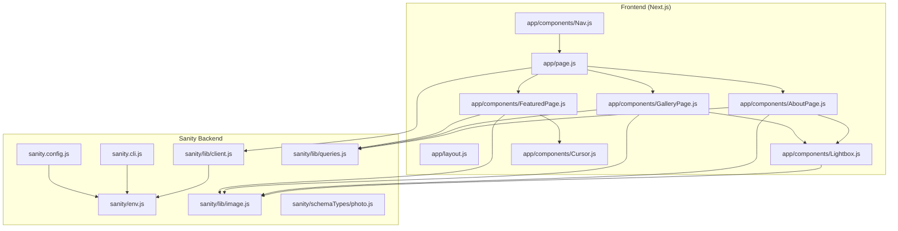
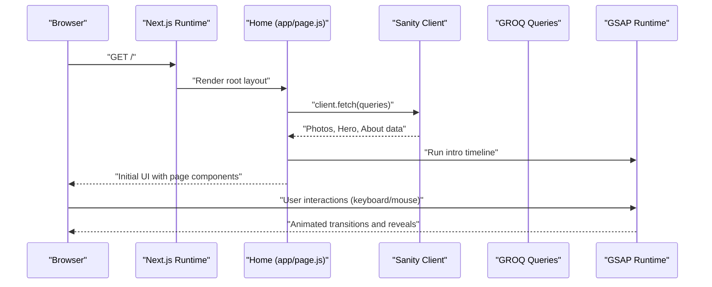
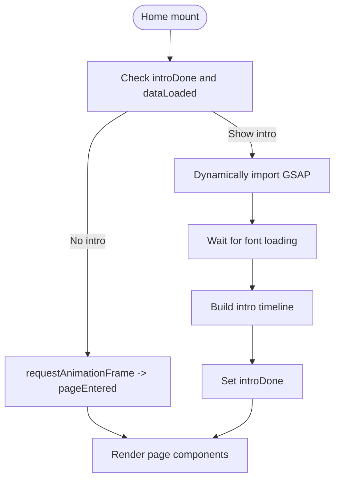
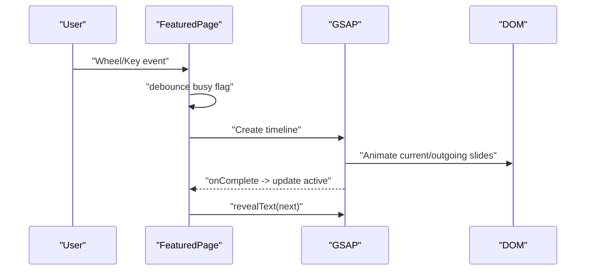
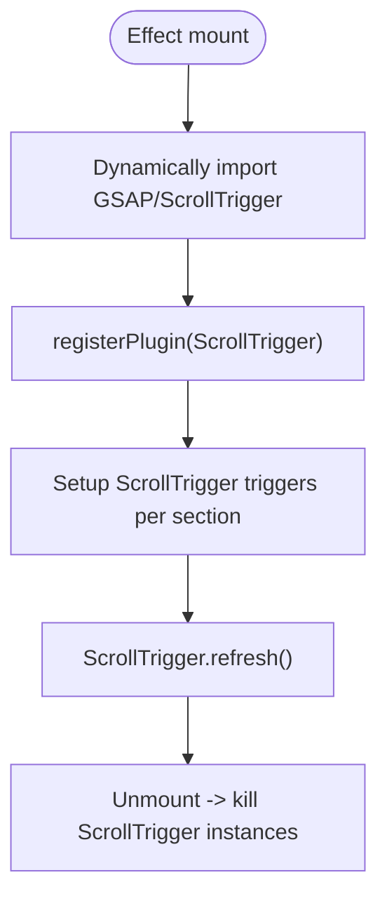
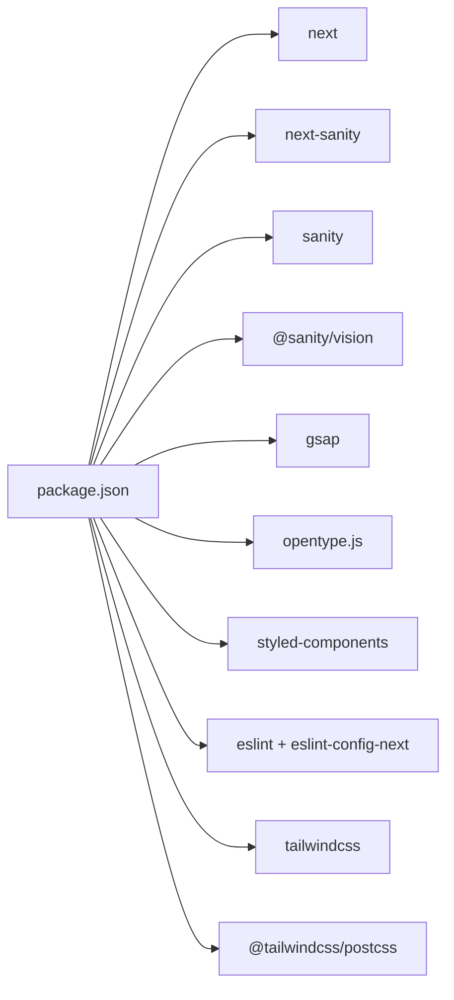

# Troubleshooting and FAQ

<cite>
**Referenced Files in This Document**
- [package.json](file://package.json)
- [next.config.mjs](file://next.config.mjs)
- [sanity.config.js](file://sanity.config.js)
- [sanity.cli.js](file://sanity.cli.js)
- [sanity/env.js](file://sanity/env.js)
- [sanity/lib/client.js](file://sanity/lib/client.js)
- [sanity/lib/queries.js](file://sanity/lib/queries.js)
- [sanity/lib/image.js](file://sanity/lib/image.js)
- [sanity/schemaTypes/photo.js](file://sanity/schemaTypes/photo.js)
- [app/layout.js](file://app/layout.js)
- [app/page.js](file://app/page.js)
- [app/components/FeaturedPage.js](file://app/components/FeaturedPage.js)
- [app/components/GalleryPage.js](file://app/components/GalleryPage.js)
- [app/components/AboutPage.js](file://app/components/AboutPage.js)
- [app/components/Lightbox.js](file://app/components/Lightbox.js)
- [app/components/Cursor.js](file://app/components/Cursor.js)
- [app/components/Nav.js](file://app/components/Nav.js)
</cite>

## Table of Contents
1. [Introduction](#introduction)
2. [Project Structure](#project-structure)
3. [Core Components](#core-components)
4. [Architecture Overview](#architecture-overview)
5. [Detailed Component Analysis](#detailed-component-analysis)
6. [Dependency Analysis](#dependency-analysis)
7. [Performance Considerations](#performance-considerations)
8. [Troubleshooting Guide](#troubleshooting-guide)
9. [Conclusion](#conclusion)
10. [Appendices](#appendices)

## Introduction
This document provides a comprehensive troubleshooting and FAQ guide for the WRD Photography portfolio. It covers development issues (dependencies, builds, environment), browser compatibility, performance (slow loads, animation stutter, memory leaks), Sanity CMS integration (authentication, sync, queries), deployment and hosting (build failures, environment variables, CDN), debugging strategies (rendering, animations, responsive design), and frequently asked questions about customization and maintenance. It also includes diagnostic techniques and step-by-step resolutions for common error scenarios.

## Project Structure
The project is a Next.js 16 application with a Sanity headless CMS backend. Key areas:
- Frontend: Next.js app under app/, styled via CSS-in-JS and global styles
- Animations: GSAP-based components for page transitions, parallax, and scroll-triggered reveals
- CMS: Sanity Studio mounted at /studio with typed schemas and GROQ queries
- Assets: Image URLs generated via @sanity/image-url

**Diagram sources**
- [app/page.js:1-227](file://app/page.js#L1-L227)
- [app/components/FeaturedPage.js:1-269](file://app/components/FeaturedPage.js#L1-L269)
- [app/components/GalleryPage.js:1-760](file://app/components/GalleryPage.js#L1-L760)
- [app/components/AboutPage.js:1-458](file://app/components/AboutPage.js#L1-L458)
- [app/components/Lightbox.js:1-303](file://app/components/Lightbox.js#L1-L303)
- [app/components/Cursor.js:1-42](file://app/components/Cursor.js#L1-L42)
- [app/components/Nav.js:1-168](file://app/components/Nav.js#L1-L168)
- [sanity.config.js:1-29](file://sanity.config.js#L1-L29)
- [sanity.cli.js:1-11](file://sanity.cli.js#L1-L11)
- [sanity/env.js:1-6](file://sanity/env.js#L1-L6)
- [sanity/lib/client.js:1-10](file://sanity/lib/client.js#L1-L10)
- [sanity/lib/queries.js:1-33](file://sanity/lib/queries.js#L1-L33)
- [sanity/lib/image.js:1-9](file://sanity/lib/image.js#L1-L9)
- [sanity/schemaTypes/photo.js:1-93](file://sanity/schemaTypes/photo.js#L1-L93)

**Section sources**
- [package.json:1-31](file://package.json#L1-L31)
- [next.config.mjs:1-7](file://next.config.mjs#L1-L7)
- [sanity.config.js:1-29](file://sanity.config.js#L1-L29)
- [sanity.cli.js:1-11](file://sanity.cli.js#L1-L11)
- [sanity/env.js:1-6](file://sanity/env.js#L1-L6)
- [sanity/lib/client.js:1-10](file://sanity/lib/client.js#L1-L10)
- [sanity/lib/queries.js:1-33](file://sanity/lib/queries.js#L1-L33)
- [sanity/lib/image.js:1-9](file://sanity/lib/image.js#L1-L9)
- [sanity/schemaTypes/photo.js:1-93](file://sanity/schemaTypes/photo.js#L1-L93)
- [app/layout.js:1-40](file://app/layout.js#L1-L40)
- [app/page.js:1-227](file://app/page.js#L1-L227)

## Core Components
- Home page orchestrates data fetching, intro animation, and page routing
- FeaturedPage: GSAP-driven slideshow with keyboard and wheel navigation
- GalleryPage: Scroll-triggered animations, horizontal track, masonry layouts, lightbox
- AboutPage: Scroll-triggered reveals, stats, and interactive elements
- Lightbox: Animated modal with navigation and info panel
- Cursor and Nav: Micro-interactions and theme persistence
- Sanity integration: Client, queries, image URL builder, schema types

**Section sources**
- [app/page.js:1-227](file://app/page.js#L1-L227)
- [app/components/FeaturedPage.js:1-269](file://app/components/FeaturedPage.js#L1-L269)
- [app/components/GalleryPage.js:1-760](file://app/components/GalleryPage.js#L1-L760)
- [app/components/AboutPage.js:1-458](file://app/components/AboutPage.js#L1-L458)
- [app/components/Lightbox.js:1-303](file://app/components/Lightbox.js#L1-L303)
- [app/components/Cursor.js:1-42](file://app/components/Cursor.js#L1-L42)
- [app/components/Nav.js:1-168](file://app/components/Nav.js#L1-L168)
- [sanity/lib/client.js:1-10](file://sanity/lib/client.js#L1-L10)
- [sanity/lib/queries.js:1-33](file://sanity/lib/queries.js#L1-L33)
- [sanity/lib/image.js:1-9](file://sanity/lib/image.js#L1-L9)
- [sanity/schemaTypes/photo.js:1-93](file://sanity/schemaTypes/photo.js#L1-L93)

## Architecture Overview
High-level flow:
- app/page.js initializes GSAP intro, fetches Sanity data concurrently, and renders page components
- Components use GSAP for animations and ScrollTrigger for scroll-driven effects
- Sanity Studio runs alongside the frontend at /studio, configured via sanity.config.js
- Image URLs are generated server-side via @sanity/image-url

**Diagram sources**
- [app/page.js:1-227](file://app/page.js#L1-L227)
- [sanity/lib/client.js:1-10](file://sanity/lib/client.js#L1-L10)
- [sanity/lib/queries.js:1-33](file://sanity/lib/queries.js#L1-L33)

## Detailed Component Analysis

### Home Page and Intro Animation
- Dynamically imports GSAP and runs an intro animation when content is not yet loaded
- Uses requestAnimationFrame to gate initial page-enter transition
- Concurrently fetches all data needed for pages

**Diagram sources**
- [app/page.js:33-101](file://app/page.js#L33-L101)

**Section sources**
- [app/page.js:1-227](file://app/page.js#L1-L227)

### FeaturedPage Slideshow
- Keyboard and wheel navigation with debouncing
- GSAP timeline for cross-slide transitions and staggered text reveals
- Uses urlFor for optimized image URLs

**Diagram sources**
- [app/components/FeaturedPage.js:14-105](file://app/components/FeaturedPage.js#L14-L105)

**Section sources**
- [app/components/FeaturedPage.js:1-269](file://app/components/FeaturedPage.js#L1-L269)
- [sanity/lib/image.js:1-9](file://sanity/lib/image.js#L1-L9)

### GalleryPage Scroll-Driven Effects
- Dynamically imports GSAP and ScrollTrigger
- Initializes character-split hero text, horizontal track scrubbing, masonry reveals, and portrait cards
- Uses ScrollTrigger.refresh lifecycle and cleanup on unmount

**Diagram sources**
- [app/components/GalleryPage.js:51-220](file://app/components/GalleryPage.js#L51-L220)

**Section sources**
- [app/components/GalleryPage.js:1-760](file://app/components/GalleryPage.js#L1-L760)

### AboutPage Reveal Patterns
- Similar ScrollTrigger pattern for hero, stats, philosophy quote, approach items, and collage images
- Magnetic button transforms and theme persistence via localStorage

**Section sources**
- [app/components/AboutPage.js:1-458](file://app/components/AboutPage.js#L1-L458)
- [app/components/Nav.js:70-83](file://app/components/Nav.js#L70-L83)

### Lightbox Modal
- Animated open/close with GSAP timelines
- Keyboard navigation and image swap animations

**Section sources**
- [app/components/Lightbox.js:1-303](file://app/components/Lightbox.js#L1-L303)

### Cursor and Navigation
- Smooth mouse-following cursor with GSAP tweens
- Auto-hide/show navigation on mouse movement

**Section sources**
- [app/components/Cursor.js:1-42](file://app/components/Cursor.js#L1-L42)
- [app/components/Nav.js:1-168](file://app/components/Nav.js#L1-L168)

## Dependency Analysis
- Next.js runtime and app shell
- Sanity client and CLI configuration
- GSAP ecosystem for animations and ScrollTrigger
- Image URL builder for Sanity assets
- Tailwind PostCSS toolchain (v4) and ESLint

**Diagram sources**
- [package.json:11-28](file://package.json#L11-L28)

**Section sources**
- [package.json:1-31](file://package.json#L1-L31)

## Performance Considerations
- Animation performance
  - Use GSAP’s will-change and transform-origin hints where appropriate
  - Prefer transform/opacity over layout-affecting properties
  - Avoid forced synchronous layouts; batch DOM reads/writes
- Scroll-triggered animations
  - Keep ScrollTrigger instances minimal; kill on unmount
  - Use scrubbed animations for parallax and overlay fades
  - Avoid heavy DOM in triggers; prefer GPU-friendly properties
- Data fetching
  - Current implementation fetches multiple queries concurrently; keep queries efficient
  - Consider pagination or limiting results for large galleries
- Images
  - urlFor generates optimized URLs; ensure quality and width parameters match viewport sizes
- Fonts
  - Font swapping reduces FOIT; ensure critical text animations wait for font ready
- Memory leaks
  - Ensure event listeners removed on unmount (e.g., window events)
  - Kill GSAP ScrollTrigger instances during cleanup
- Bundle size
  - Dynamic imports for GSAP modules reduce initial payload
  - Keep animation-heavy components lazy-loaded

[No sources needed since this section provides general guidance]

## Troubleshooting Guide

### Dependency Conflicts and Build Errors
Symptoms
- Build fails with module resolution errors
- Dev server crashes on startup
- Package manager warnings or peer dependency mismatches

Common causes and fixes
- Align versions across Next.js, React, and related packages
  - Ensure React and ReactDOM versions match the Next.js version lock
  - Keep styled-components compatible with the React version
- Resolve conflicting versions
  - Use a single package manager (prefer npm) and clean lockfiles if needed
- Reinstall dependencies
  - Remove node_modules and package-lock.json, then reinstall
- Verify TypeScript/ESLint configuration compatibility
  - Ensure eslint-config-next matches the Next.js version

**Section sources**
- [package.json:11-28](file://package.json#L11-L28)
- [next.config.mjs:1-7](file://next.config.mjs#L1-L7)

### Environment Configuration Problems
Symptoms
- Sanity client reports missing projectId or dataset
- CLI commands fail with undefined environment variables
- Studio does not load or shows auth errors

Root causes and fixes
- Missing environment variables
  - NEXT_PUBLIC_SANITY_PROJECT_ID and NEXT_PUBLIC_SANITY_DATASET must be present
  - Ensure NEXT_PUBLIC_SANITY_API_VERSION is set (fallback exists in env)
- CLI configuration mismatch
  - sanity.cli.js reads from process.env; confirm environment is loaded
- Studio base path
  - Sanity Studio is mounted at /studio; ensure basePath matches

**Section sources**
- [sanity/env.js:1-6](file://sanity/env.js#L1-L6)
- [sanity.cli.js:1-11](file://sanity.cli.js#L1-L11)
- [sanity.config.js:16-28](file://sanity.config.js#L16-L28)

### Browser Compatibility Issues
Symptoms
- GSAP animations stutter or do not play
- Scroll-triggered effects behave erratically
- Modern JS features cause runtime errors

Guidance
- ES modules and dynamic imports
  - Ensure the target browsers support dynamic import and modern JS features used by GSAP
- Polyfills
  - Consider adding polyfills for older browsers if necessary
- GSAP plugins
  - ScrollTrigger requires modern scroll behaviors; test on supported browsers
- CSS variables and clamp
  - The project uses CSS variables and clamp; verify fallbacks for older browsers

**Section sources**
- [app/components/GalleryPage.js:55-58](file://app/components/GalleryPage.js#L55-L58)
- [app/components/FeaturedPage.js:3-3](file://app/components/FeaturedPage.js#L3-L3)

### Performance Troubleshooting
Slow page loads
- Audit bundle size and remove unused features
- Lazy-load heavy components and animations
- Optimize images via urlFor and appropriate widths

Animation stuttering
- Reduce layout thrashing; prefer transform/opacity
- Limit concurrent ScrollTrigger instances
- Use will-change sparingly and remove when unnecessary

Memory leaks
- Unregister ScrollTrigger on unmount
- Remove event listeners in useEffect cleanup
- Avoid retaining large arrays or refs unnecessarily

**Section sources**
- [app/components/GalleryPage.js:215-219](file://app/components/GalleryPage.js#L215-L219)
- [app/components/AboutPage.js:157-161](file://app/components/AboutPage.js#L157-L161)
- [app/components/FeaturedPage.js:30-34](file://app/components/FeaturedPage.js#L30-L34)

### Sanity CMS Integration Issues
Authentication problems
- Ensure NEXT_PUBLIC_SANITY_PROJECT_ID and NEXT_PUBLIC_SANITY_DATASET are set
- Confirm Sanity Studio is reachable at /studio

Content sync failures
- Verify dataset and apiVersion alignment
- Check that queries return expected shapes

Query optimization
- Keep queries selective and avoid large projections
- Use ordering and filtering to limit result sets

**Section sources**
- [sanity/lib/client.js:1-10](file://sanity/lib/client.js#L1-L10)
- [sanity/lib/queries.js:1-33](file://sanity/lib/queries.js#L1-L33)
- [sanity/env.js:1-6](file://sanity/env.js#L1-L6)

### Deployment and Hosting Challenges
Build failures
- Ensure environment variables are present during build
- Validate sanity.cli.js and sanity.config.js correctness

Environment variable issues
- Confirm NEXT_PUBLIC_* variables are available at runtime
- Validate dataset and apiVersion values

CDN configuration
- The project disables CDN for Sanity client; verify caching policies for static assets
- Ensure fonts and images are served efficiently

**Section sources**
- [sanity/lib/client.js:8-8](file://sanity/lib/client.js#L8-L8)
- [sanity.config.js:16-28](file://sanity.config.js#L16-L28)
- [app/layout.js:1-40](file://app/layout.js#L1-L40)

### Debugging Strategies
Component rendering problems
- Temporarily disable animations to isolate rendering issues
- Use React DevTools to inspect props and state flow

Animation glitches
- Log ScrollTrigger instances and their lifecycles
- Verify GSAP plugin registration order

Responsive design issues
- Inspect computed styles and clamp usage
- Test breakpoints and container queries

Diagnostic tools
- Lighthouse for performance and accessibility
- React DevTools Profiler for render bottlenecks
- Browser DevTools Performance panel for animation frames

**Section sources**
- [app/components/GalleryPage.js:55-58](file://app/components/GalleryPage.js#L55-L58)
- [app/components/FeaturedPage.js:3-3](file://app/components/FeaturedPage.js#L3-L3)

### Frequently Asked Questions
Can I change the animation library?
- Yes, replace GSAP imports with your preferred library; ensure equivalent lifecycle hooks and cleanup.

How do I add new sections?
- Extend the Home page routing and create a new component; wire it similarly to existing pages.

Can I customize the Sanity schema?
- Modify sanity/schemaTypes/* and re-run studio; ensure queries reflect schema changes.

How do I optimize images further?
- Adjust urlFor quality and width parameters per device density and viewport.

What browsers are supported?
- Modern browsers supporting ES modules and dynamic imports; test on target devices.

**Section sources**
- [sanity/schemaTypes/photo.js:1-93](file://sanity/schemaTypes/photo.js#L1-L93)
- [sanity/lib/image.js:1-9](file://sanity/lib/image.js#L1-L9)
- [app/components/GalleryPage.js:1-760](file://app/components/GalleryPage.js#L1-L760)

## Conclusion
This guide consolidates actionable steps to resolve common issues across development, CMS integration, performance, and deployment. By aligning environment variables, optimizing queries and animations, and following cleanup and debugging practices, most problems can be systematically identified and resolved.

[No sources needed since this section summarizes without analyzing specific files]

## Appendices

### Quick Fix Reference
- Missing environment variables: Set NEXT_PUBLIC_SANITY_PROJECT_ID, NEXT_PUBLIC_SANITY_DATASET, NEXT_PUBLIC_SANITY_API_VERSION
- Build errors: Reinstall dependencies and align React/Next versions
- Scroll-trigger issues: Kill instances on unmount; refresh after dynamic content
- Image quality: Tune urlFor width and quality parameters

**Section sources**
- [sanity/env.js:1-6](file://sanity/env.js#L1-L6)
- [sanity/lib/client.js:1-10](file://sanity/lib/client.js#L1-L10)
- [sanity/lib/image.js:1-9](file://sanity/lib/image.js#L1-L9)
- [app/components/GalleryPage.js:215-219](file://app/components/GalleryPage.js#L215-L219)